# 无监督机器学习算法

本章讲解的是无监督机器学习算法。我们的目标是在本章结束时，能够理解无监督学习及其基本算法和方法如何有效应用于解决现实世界中的问题。

我们将涵盖以下主题：

+   介绍无监督学习

+   理解聚类算法

+   降维

+   关联规则挖掘

# 介绍无监督学习

如果数据不是随机生成的，它往往在多维空间中表现出某些元素之间的模式或关系。无监督学习涉及在数据集中检测并利用这些模式，以便更有效地对其进行结构化和理解。无监督学习算法揭示这些模式，并利用它们作为赋予数据集特定结构的基础。识别这些模式有助于更深入地理解和呈现数据。从原始数据中提取模式有助于更好地理解原始数据。

该概念如*图 6.1*所示：


图 6.1：使用无监督机器学习从未标记的原始数据中提取模式

在接下来的讨论中，我们将穿越 CRISP-DM 生命周期，这是一种流行的机器学习过程模型。在这个背景下，我们将确定无监督学习适合的位置。举例来说，可以将无监督学习比作侦探在没有预设知识的情况下，通过拼凑线索来形成模式或群组。就像侦探的洞察力对破案至关重要一样，无监督学习在机器学习生命周期中也扮演着关键角色。

## 无监督学习在数据挖掘生命周期中的作用

首先让我们了解一下典型机器学习过程的不同阶段。为了理解机器学习生命周期的不同阶段，我们将通过使用机器学习进行数据挖掘的例子来学习。数据挖掘是从给定数据集中发现有意义的相关性、模式和趋势的过程。为了讨论使用机器学习进行数据挖掘的不同阶段，本书采用了**跨行业数据挖掘标准流程**（**CRISP-DM**）。CRISP-DM 由来自不同组织的数据挖掘专家们设计并实现，包括克莱斯勒和 IBM 等知名公司。更多详情请参考[`www.ibm.com/docs/en/spss-modeler/saas?topic=dm-crisp-help-overview`](https://www.ibm.com/docs/en/spss-modeler/saas?topic=dm-crisp-help-overview)。

CRISP-DM 生命周期包含六个不同的阶段，见下图：

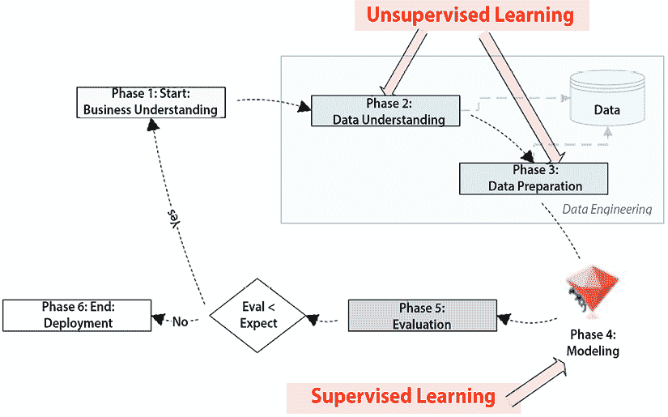

图 6.2：CRISP-DM 生命周期的不同阶段

让我们逐一解析并探索每个阶段。

### 阶段 1：业务理解

本阶段的重点是收集需求，并尝试从业务角度深入理解问题。定义问题的范围并根据机器学习适当重新表述它是这一阶段的重要部分。本阶段包括确定目标、定义项目的范围，并理解利益相关者的需求。

需要注意的是，CRISP-DM 生命周期的第一阶段是关于业务理解。它关注的是需要做什么，而不是如何做。

### 阶段 2：数据理解

本阶段的重点是理解可用于数据挖掘的数据。在此阶段，我们将了解给定的数据集中是否拥有解决第一阶段定义的问题所需的所有信息。我们可以使用数据可视化、仪表板和汇总报告等工具来理解数据中的模式。如本章后面所述，无监督机器学习算法也可以用于发现数据中的模式，并通过详细分析其结构来理解这些模式。

### 阶段 3：数据准备

这涉及为我们将在阶段 4 中训练的机器学习模型准备数据。根据使用案例和需求，数据准备可能包括去除异常值、归一化、去除空值以及减少数据的维度。后续章节会更详细地讨论这些内容。数据处理和准备好后，通常会以 70-30 的比例进行分割。较大的一部分，称为训练数据，用于训练模型识别各种模式，而较小的一部分，称为测试数据，则保存以评估模型在阶段 5 中对未见数据的表现。还可以选择保留一部分数据用于验证和微调模型，以防止过拟合。

### 阶段 4：建模

这是我们通过训练模型来形成数据模式的阶段。对于模型训练，我们将使用在阶段 3 中准备的训练数据分区。模型训练包括将我们准备好的数据输入机器学习算法。通过迭代学习，算法识别并学习数据中固有的模式。目标是形成表示数据集中不同变量之间关系和依赖性的模式。我们将在后续章节中讨论这些数学公式的复杂性和性质如何在很大程度上依赖于我们选择的算法——例如，线性回归模型将生成一个线性方程，而决策树模型将构建一个类似树的决策模型。

除了模型训练，模型调优也是 CRISP-DM 生命周期这一阶段的一个组成部分。该过程包括优化学习算法的参数，以提高其性能，从而使预测更为准确。它涉及使用可选的验证集对模型进行微调，帮助调整模型的复杂性，找到从数据中学习与对未见数据进行概括之间的平衡。在机器学习中，验证集是数据集的一部分，用于对预测模型进行精细调整。

它有助于调整模型的复杂性，旨在找到已知数据学习与对未见数据进行概括之间的最佳平衡。这种平衡对于防止过拟合至关重要，过拟合是指模型过于“记住”训练数据，从而在新数据上表现不佳。因此，模型调优不仅可以提升模型的预测能力，还可以确保其稳健性和可靠性。

### 阶段 5：评估

这一阶段涉及通过使用来自阶段 3 的测试数据来评估最近训练的模型。我们将模型的性能与阶段 1 中设定的基准进行对比。基准在机器学习中的作用是提供一个参考点，可以通过多种方法来确定。它可以通过基本的基于规则的系统、简单的统计模型、随机机会，甚至是基于人类专家的表现来建立。基准的目的是提供一个最小的性能门槛，我们的机器学习模型应该超越这个门槛。基准充当比较的标准，给我们提供一个期望的参考点。如果模型的评估结果与阶段 1 中最初定义的期望一致，我们就可以继续。如果不一致，我们必须重新审视并迭代所有之前的阶段，从阶段 1 开始。

### 阶段 6：部署

一旦评估阶段（阶段 5）结束，我们就会检查训练好的模型的表现是否达到或超过了既定的期望。需要记住的是，成功的评估并不自动意味着可以部署。模型在我们的测试数据上表现良好，但这并不是判断模型是否准备好解决实际问题的唯一标准，如阶段 1 所定义的那样。我们必须考虑诸如模型在从未见过的新数据上的表现、如何与现有系统集成以及如何处理未预见的边缘情况等因素。因此，只有当这些广泛的评估得到了令人满意的验证时，我们才能自信地将模型部署到生产环境中，在那里它开始为我们预先定义的问题提供可用的解决方案。

CRISP-DM 生命周期的第 2 阶段（数据理解）和第 3 阶段（数据准备）都是关于理解数据并为训练模型做准备。这些阶段涉及数据处理。一些组织为此数据工程阶段配备了专门的人员。

很明显，提出问题解决方案的过程是完全数据驱动的。结合有监督和无监督机器学习来制定可行的解决方案。本章专注于解决方案中的无监督学习部分。

数据工程包括第 2 阶段和第 3 阶段，是机器学习中最耗时的部分。它可能占据典型**机器学习**（**ML**）项目的 70% 的时间和资源（*Data Management in Machine Learning: Challenges, Techniques, and Systems*, Cody 等人，SIGMOD ‘17：2017 年 ACM 国际数据管理会议论文集，2017 年 5 月）。无监督学习算法在数据工程中可以发挥重要作用。

以下部分提供了关于无监督算法的更多详细信息。

## 当前无监督学习的研究趋势

机器学习研究领域经历了显著的变化。早期的重点主要集中在有监督学习技术上。这些方法对推理任务立即有效，提供了明显的优势，如节省时间、降低成本和提高预测准确性。

相反，无监督机器学习算法的内在能力最近才开始引起关注。与有监督的对应方法不同，无监督技术在没有直接指令或先入为主的假设下运作。它们擅长探索数据中更广泛的“维度”或方面，从而使数据集的审查更加全面。

为了澄清，在机器学习术语中，“特征”是被观察现象的个体可度量的属性或特征。例如，在一个涉及客户信息的数据集中，特征可能包括客户的年龄、购买历史或浏览行为。“标签”则代表我们希望模型根据这些特征预测的结果。

虽然有监督学习主要集中于建立这些特征与特定标签之间的关系，但无监督学习并不局限于预先确定的标签。相反，它可以更深入地挖掘，发现各种特征之间的复杂模式，这些模式在使用有监督方法时可能会被忽视。这使得无监督学习在应用中具有更广阔和灵活的潜力。

然而，无监督学习固有的灵活性带来了一个挑战。由于探索空间更大，它往往会导致**更高的计算**需求，从而带来更高的成本和更长的处理时间。此外，由于其探索性特点，管理无监督学习任务的规模或“范围”可能更为复杂。然而，能够挖掘数据中隐藏的模式或关联，使得无监督学习成为数据驱动洞察的强大工具。

如今，研究趋势正朝着监督学习和无监督学习方法的整合发展。这种结合策略旨在利用两种方法的优势。

现在让我们来看一些实际的例子。

## 实际示例

目前，无监督学习用于更好地理解数据并为其提供更多结构——例如，它被用于市场细分、数据分类、欺诈检测和市场篮分析（本章稍后讨论）。让我们看一下无监督学习在市场细分中的应用示例。

### 使用无监督学习进行市场细分

无监督学习作为市场细分的强大工具。市场细分是指根据共享特征将目标市场划分为不同组的过程，使公司能够量身定制其营销策略和信息，有效地接触并吸引特定的客户群体。用于分组目标市场的特征可能包括人口统计、行为或地理相似性。通过利用算法和统计技术，它使企业能够从客户数据中提取有意义的见解，识别隐藏的模式，并根据客户行为、偏好或特征的相似性将其分为不同的群体。这种数据驱动的方法使营销人员能够制定量身定制的策略、提高客户定位能力，并增强整体营销效果。

# 理解聚类算法

无监督学习中最简单且最强大的技术之一是通过聚类算法将相似的模式组合在一起。它用于理解与我们要解决的问题相关的特定数据方面。聚类算法寻找数据项中的自然分组。由于该分组不基于任何目标或假设，因此它被归类为无监督学习技术。

以一个充满书籍的巨大图书馆为例。每本书代表一个数据点——包含诸如类型、作者、出版年份等多种属性。现在，想象一个图书管理员（聚类算法），他被要求对这些书籍进行分类。在没有预设类别或说明的情况下，图书管理员开始根据书籍的属性对其进行分类——所有的侦探小说放在一起，经典文学放在一起，同一作者的书籍放在一起，等等。这就是我们所说的“自然组”，即那些共享相似特征的数据项被聚集在一起。

各种聚类算法所创建的分组是基于在问题空间中找到各个数据点之间的相似性。请注意，在机器学习的背景下，数据点是存在于多维空间中的一组测量值或观察结果。简单来说，它是帮助机器了解其所要完成任务的单一信息。确定数据点之间相似性的最佳方法因问题而异，且取决于我们所处理问题的性质。让我们看看可以用来计算数据点之间相似性的各种方法。

### 量化相似性

无监督学习技术，如聚类算法，通过在给定问题空间内确定各种数据点之间的相似性，能够有效工作。这些算法的有效性在很大程度上取决于我们是否能够正确地衡量这些相似性，在机器学习术语中，这些常常被称为“距离度量”。那么，究竟什么是距离度量呢？

本质上，距离度量是一个数学公式或方法，用于计算两个数据点之间的“距离”或相似度。在这个背景下，重要的是要理解，“距离”并不指物理距离，而是基于数据点的特征或属性来衡量相似性或差异性。

在聚类中，我们可以讨论两种主要的距离类型：簇间距离和簇内距离。簇间距离指的是不同簇（或数据点组）之间的距离。与此相对，簇内距离指的是同一簇内（或者说，同一组内）数据点之间的距离。一个好的聚类算法的目标是最大化簇间距离（确保每个簇彼此独立），同时最小化簇内距离（确保同一簇内的数据点尽可能相似）。以下是三种最常用的量化相似性的方法：

+   欧几里得距离度量

+   曼哈顿距离度量

+   余弦距离度量

让我们更详细地了解这些距离度量。

### 欧几里得距离

不同点之间的距离可以量化两个数据点之间的相似性，并广泛应用于无监督机器学习技术，如聚类。欧几里得距离是最常用且最简单的距离度量。这里所说的“距离”量化的是两个数据点在多维空间中相似或不同的程度，这对于理解数据点的分组至关重要。最简单且最广泛使用的距离度量之一就是欧几里得距离。

欧几里得距离可以被认为是三维空间中两个点之间的直线距离，类似于我们在现实世界中测量距离的方式。例如，考虑地图上的两座城市；欧几里得距离就是这两座城市之间的“鸟飞直线”距离，即从城市 A 到城市 B 的直线距离，忽略了任何可能的障碍物，如山脉或河流。

类似地，在我们数据的多维空间中，欧几里得距离计算的是两个数据点之间最短的“直线”距离。通过这种方式，它提供了一个量化的度量，表示数据点之间的相似性或远近，基于它们的特征或属性。例如，假设我们有两个点，`A(1,1)`和`B(4,4)`，它们位于二维空间中，如下图所示：

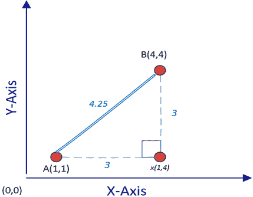

图 6.3：计算两个给定点之间的欧几里得距离

要计算`A`和`B`之间的距离——即`d(A,B)`，我们可以使用以下勾股定理公式：


注意，这个计算适用于二维问题空间。对于*n*维问题空间，我们可以按照以下方式计算两个点**A**和**B**之间的距离：


### 曼哈顿距离

在许多情况下，使用欧几里得距离度量两点之间的最短距离并不能真正代表两点之间的相似性或接近性——例如，如果两个数据点代表地图上的位置，那么通过陆地交通工具（如汽车或出租车）从 A 点到 B 点的实际距离将比通过欧几里得距离计算的距离更远。想象一下一个繁忙的城市网格，在这里你不能像欧几里得距离那样穿越建筑物从一个点到另一个点，而是必须在街道网格中导航。曼哈顿距离就像是这种现实世界中的导航——它计算的是沿着这些网格线从点 A 到点 B 所走的总距离。

对于类似的情况，我们使用曼哈顿距离，它估算了在城市街道上沿网格状街道从起点到目的地时两点之间的距离。与欧几里得距离等直线距离度量不同，曼哈顿距离在这种情况下能更准确地反映两个位置之间的实际距离。曼哈顿距离和欧几里得距离度量之间的比较如下面的图所示：

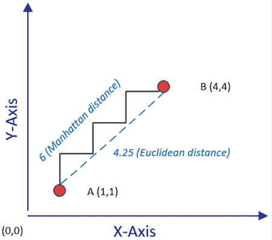

图 6.4：计算两个点之间的曼哈顿距离

请注意，在图中，这些点之间的曼哈顿距离表示为严格沿着该图网格线的折线路径。相比之下，欧几里得距离则显示为从 A 点到 B 点的直线。显然，曼哈顿距离总是等于或大于对应的欧几里得距离。

### 余弦距离

尽管欧几里得和曼哈顿距离度量在简单的低维空间中表现良好，但随着我们进入更加复杂的“高维”环境，它们的效果会减少。“高维”空间指的是包含大量特征或变量的数据集。随着维度（特征）的增加，使用欧几里得和曼哈顿距离计算的距离变得越来越没有意义，且计算负担更加繁重。

为了解决这个问题，我们在高维情况下使用“余弦距离”度量。该度量通过评估由两个数据点与原点连接所形成的角度的余弦来工作。在这里，重要的不是两点之间的物理距离，而是它们形成的角度。

如果数据点在多维空间中距离较近，它们将形成一个较小的角度，无论涉及多少维度。相反，如果数据点之间相距较远，产生的角度会更大。因此，余弦距离在高维数据中提供了一个更细致的相似度度量，帮助我们更好地理解复杂的数据模式：

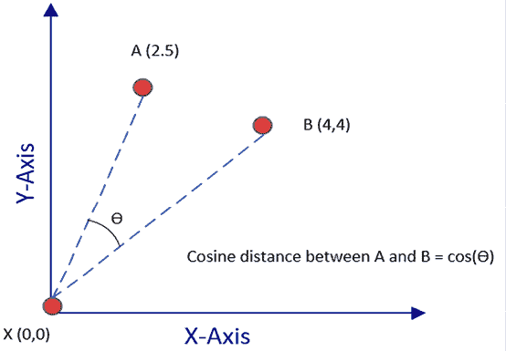

图 6.5：计算余弦距离

文本数据几乎可以被视为一个高维空间。这源于文本数据的独特性质，每个独特的单词可以被视为一个不同的维度或特征。由于余弦距离度量在高维空间中表现得非常好，因此它在处理文本数据时是一个不错的选择。

请注意，在前面的图中，`A(2,5)`和`B(4.4)`之间的角度余弦就是由*图 6.5*中的  表示的余弦距离。这些点之间的参考点是原点——即`X(0,0)`。但实际上，问题空间中的任何点都可以作为参考数据点，不一定非得是原点。

现在，让我们来看看最流行的无监督机器学习技术之一——即 k-means 聚类算法。

## k-means 聚类算法

k-means 聚类算法得名于创建“k”个聚类并使用均值或平均值来确定数据点之间的“接近度”的过程。“均值”一词指的是计算每个聚类的质心或“中心点”的方法，质心本质上是聚类内所有数据点的平均值。换句话说，算法会计算聚类内每个特征的均值，从而得出一个新的数据点——质心。然后，这个质心作为衡量其他数据点“接近度”的参考点。

k-means 的流行源于其可扩展性和速度。该算法计算高效，因为它使用一个简单的迭代过程，其中聚类的质心会反复调整，直到它们成为聚类成员的代表。正是这种简单性使得该算法在处理大规模数据集时尤其快速且可扩展。

然而，k-means 算法的一个显著限制是它无法独立地确定最佳的聚类数“k”。理想的“k”依赖于给定数据集中的自然分组。这个限制背后的设计理念是保持算法的简洁和快速，因此假设有一个外部机制来计算“k”。根据问题的上下文，“k”可以直接确定。例如，如果任务是将一组数据科学学生分成两个聚类，一个专注于数据科学技能，另一个专注于编程技能，那么“k”自然为二。然而，对于那些“k”的值不容易显现的问题，可能需要通过试错的迭代过程，或基于启发式的方法，来估算最适合的数据集聚类数。

### k-means 聚类的逻辑

在这一部分，我们将深入探讨 k-means 聚类算法的工作原理。我们将逐步拆解它的操作过程，以帮助你清晰地理解其机制和应用。本节描述了 k-means 聚类算法的逻辑。

### 初始化

为了进行分组，k-means 算法使用距离度量来找出数据点之间的相似性或接近度。在使用 k-means 算法之前，需要选择最合适的距离度量。默认情况下，会使用欧几里得距离度量。然而，根据数据的性质和需求，你可能会发现其他距离度量，如曼哈顿距离或余弦相似度，更为合适。此外，如果数据集存在离群值，则需要设计一个机制来确定哪些标准需要被识别并从数据集中去除离群值。

有多种统计方法可用于异常值检测，如 Z-score 方法或 **四分位距** (**IQR**) 方法。现在让我们来看一下 k-means 算法中涉及的不同步骤。

### k-means 算法的步骤

k-means 聚类算法涉及的步骤如下：

| **第 1 步** | 我们选择簇的数量，*k*。 |
| --- | --- |
| **第 2 步** | 在数据点中，我们随机选择 *k* 个点作为簇中心。 |
| **第 3 步** | 基于选定的距离度量，我们迭代地计算问题空间中每个点到每个 *k* 个簇中心的距离。根据数据集的大小，这可能是一个耗时的步骤——例如，如果簇中有 10,000 个点，且 *k = 3*，这意味着需要计算 30,000 个距离。 |
| **第 4 步** | 我们将问题空间中的每个数据点分配到最近的簇中心。 |
| **第 5 步** | 现在，我们问题空间中的每个数据点都有一个分配的簇中心。但我们还没有完成，因为初始簇中心的选择是基于随机选择的。我们需要验证当前随机选择的簇中心是否实际上是每个簇的质心。我们通过计算每个 *k* 个簇的组成数据点的均值来重新计算簇中心。这一步解释了为什么这个算法叫做 *k*-means。 |
| **第 6 步** | 如果在第 5 步中簇中心发生了变化，这意味着我们需要重新计算每个数据点的簇分配。为此，我们将回到第 3 步，重复进行计算密集型的步骤。如果簇中心没有发生变化，或者我们预定的停止条件（例如最大迭代次数）已经满足，那么我们就完成了。 |

以下图显示了在二维问题空间中运行 k-means 算法的结果：

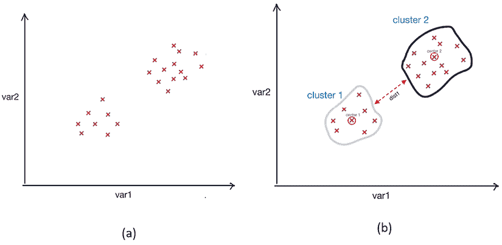

图 6.6：k-means 聚类结果 (a) 聚类前的数据点；(b) 运行 k-means 聚类算法后的结果簇

注意，在这种情况下，运行 k-means 后得到的两个簇是明显区分开的。现在我们来看看 k-means 算法的停止条件。

### 停止条件

在像 k-means 这样的无监督学习算法中，停止条件在确定算法何时应该停止迭代过程中起着至关重要的作用。对于 k-means 算法，默认的停止条件是在第 5 步中簇中心不再发生移动。但是，与许多其他算法一样，k-means 算法可能需要较长的时间才能收敛，尤其是在处理大数据集和高维问题空间时。

我们可以显式地定义停止条件，而不是等待算法收敛，具体如下：

+   通过指定最大执行时间：

    +   **停止条件**：*t*>*t*[max]，其中 *t* 是当前执行时间，*t*[max] 是我们为算法设置的最大执行时间。

+   通过指定最大迭代次数：

    +   **停止条件**：如果 *m*>*m*[max]，其中 *m* 是当前迭代次数，*m*[max] 是我们为算法设置的最大迭代次数。

### 编写 k-means 算法

我们将在您提供的一个简单二维数据集上执行 k-means 聚类，数据集包含两个特征 `x` 和 `y`。假设你看到夜晚花园里散布的萤火虫群体。你的任务是根据它们之间的接近程度将这些萤火虫分组。这就是 k-means 聚类的本质，它是一个流行的无监督学习算法。

我们给定了一个数据集，就像我们的花园一样，数据点绘制在二维空间中。我们的数据点由 `x` 和 `y` 坐标表示：

```py
import pandas as pd
dataset = pd.DataFrame({
    'x': [11, 21, 28, 17, 29, 33, 24, 45, 45, 52, 51, 52, 55, 53, 55, 61, 62, 70, 72, 10],
    'y': [39, 36, 30, 52, 53, 46, 55, 59, 63, 70, 66, 63, 58, 23, 14, 8, 18, 7, 24, 10]
}) 
```

我们的任务是使用 k-means 算法对这些数据点进行聚类。

首先，我们导入所需的库：

```py
from sklearn import cluster
import matplotlib.pyplot as plt 
```

接下来，我们将通过指定聚类数（`k`）来初始化 `KMeans` 类。对于这个例子，假设我们想将数据分成 3 个聚类：

```py
kmeans = cluster.KMeans(n_clusters=2) 
```

现在，我们用数据集来训练我们的`KMeans`模型。值得一提的是，这个模型只需要特征矩阵（`x`），而不需要目标向量（`y`），因为它是一个无监督学习算法：

```py
kmeans.fit(dataset) 
```

现在，让我们来看看标签和聚类中心：

```py
labels = labels = kmeans.labels_
centers = kmeans.cluster_centers_
print(labels) 
```

```py
[0 0 0 0 0 0 0 0 1 1 1 1 1 1 1 1 1 1 1 0] 
```

```py
print(centers) 
```

```py
[[16.77777778 48.88888889]
 [57.09090909 15.09090909]] 
```

最后，为了可视化我们的聚类，我们绘制了数据点，并根据其分配的聚类为其着色。聚类的中心，也称为质心，也被绘制出来：

```py
plt.scatter(dataset['x'], dataset['y'], c=labels)
plt.scatter(kmeans.cluster_centers_[:, 0], kmeans.cluster_centers_[:, 1], s=300, c='red')
plt.show() 
```

在图中，彩色的点表示我们的数据点及其相应的聚类，而红色的点表示每个聚类的质心。

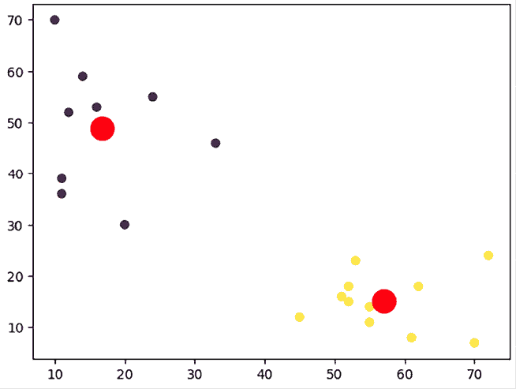

图 6.7：k-means 聚类结果

注意，图中较大的点是由 k-means 算法确定的质心。

### k-means 聚类的限制

k-means 算法设计简单且快速。由于其设计上的故意简化，它具有以下限制：

+   k-means 聚类的最大限制是初始聚类数必须预先确定。

+   聚类中心的初始分配是随机的。这意味着每次运行算法时，可能会给出略微不同的聚类结果。

+   每个数据点只能分配到一个聚类。

+   k-means 聚类对离群点敏感。

现在让我们来看看另一种无监督机器学习技术——层次聚类。

### 层次聚类

K 均值聚类使用自上而下的方法，因为我们从最重要的数据点开始，即聚类中心。还有一种聚类方法，与自上而下的方式不同，我们从底部开始算法。在这里，底部指的是问题空间中的每个单独数据点。解决方案是随着算法向上推进，逐步将相似的数据点聚在一起，直到达到聚类中心。这种自底向上的方法由层次聚类算法使用，且在本节中有详细讨论。

# 层次聚类的步骤

层次聚类包括以下步骤：

1.  我们为问题空间中的每个数据点创建一个单独的聚类。如果问题空间包含 100 个数据点，则会从 100 个聚类开始。

1.  我们只将彼此最接近的点分为一组。

1.  我们检查停止条件；如果停止条件尚未满足，则重复步骤 2。

结果得到的聚类结构称为**树状图**。

在树状图中，垂直线的高度决定了项目之间的相似度，如下图所示：

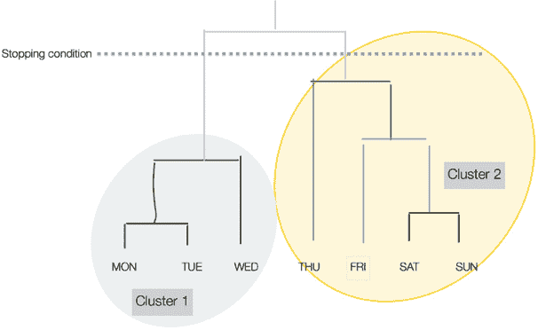

图 6.8：层次聚类

请注意，停止条件在*图 6.8*中以虚线表示。

# 编写层次聚类算法

让我们学习如何在 Python 中编写层次聚类算法：

1.  我们首先从`sklearn.cluster`库中导入`AgglomerativeClustering`，同时导入`pandas`和`numpy`包：

    ```py
    from sklearn.cluster import AgglomerativeClustering
    import pandas as pd
    import numpy as np 
    ```

1.  然后我们将在二维问题空间中创建 20 个数据点：

    ```py
    dataset = pd.DataFrame({
        'x': [11, 11, 20, 12, 16, 33, 24, 14, 45, 52, 51, 52, 55, 53, 55, 61, 62, 70, 72, 10],
        'y': [39, 36, 30, 52, 53, 46, 55, 59, 12, 15, 16, 18, 11, 23, 14, 8, 18, 7, 24, 70]
    }) 
    ```

1.  接下来，我们通过指定超参数来创建层次聚类。需要注意的是，超参数指的是在训练过程前设置的机器学习模型的配置参数，它会影响模型的行为和性能。我们使用`fit_predict`函数来实际处理算法：

    ```py
    cluster = AgglomerativeClustering(n_clusters=2, affinity='euclidean', linkage='ward')
    cluster.fit_predict(dataset) 
    ```

1.  现在让我们来看看每个数据点与所创建的两个聚类的关联：

    ```py
    print(cluster.labels_) 
    ```

    ```py
    [0 0 0 0 0 0 0 0 1 1 1 1 1 1 1 1 1 1 1 0] 
    ```

你可以看到，层次聚类和*k*-均值算法的聚类分配非常相似。

与*k*-均值聚类算法相比，层次聚类算法具有其独特的优势和缺点。一个关键的优势是，层次聚类不需要事先指定聚类数量，这与*k*-均值不同。

当数据没有明确提示最佳聚类数量时，这个特性非常有用。层次聚类还提供了树状图，这是一种类似树的图示，对于可视化数据的嵌套分组以及理解层次结构非常有帮助。

然而，层次聚类也有其缺点。它比*k*-均值更耗费计算资源，因此不适合处理大数据集。

# 理解 DBSCAN

**基于密度的空间应用聚类与噪声** (**DBSCAN**) 是一种无监督学习技术，它基于数据点的密度进行聚类。基本思想是基于这样的假设：如果我们将数据点在一个拥挤或高密度的空间中聚集在一起，我们可以实现有意义的聚类。

这种聚类方法有两个重要的含义：

+   基于这个思想，算法可能会将无论其形状或模式如何的点聚集在一起。这种方法有助于创建任意形状的簇。这里的“形状”指的是多维空间中数据点的模式或分布。这个能力非常有用，因为现实世界中的数据通常是复杂且非线性的，而能够创建任意形状的簇可以更准确地表示和理解这些数据。

+   与 k-means 算法不同，我们不需要指定簇的数量，算法可以检测到数据中适当的分组数量。

以下步骤涉及 DBSCAN 算法：

1.  算法在每个数据点周围建立一个邻域。在此上下文中，“邻域”是指一个区域，其中其他数据点会被检查与感兴趣点的接近程度。这是通过计算在一个通常由变量*eps*表示的距离范围内的数据点数量来实现的。在此设置中，*eps*变量指定了两个数据点之间的最大距离，超过该距离则不被视为在同一邻域内。默认情况下，这个距离是通过欧几里得距离度量来确定的。

1.  接下来，算法对每个数据点的密度进行量化。它使用一个名为`min_samples`的变量，表示一个数据点被视为“核心实例”所需的最小其他数据点数量，这些数据点应该位于数据点的*eps*距离内。简单来说，核心实例是一个密集地被其他数据点包围的数据点。从逻辑上讲，数据点密度高的区域将有更多的核心实例。

1.  每个已识别的邻域标识一个簇。需要特别注意的是，围绕一个核心实例（一个在其“eps”距离内有最小数量其他数据点的数据点）的邻域可能包含其他核心实例。这意味着核心实例并非专属于某一个簇，而是由于其与多个数据点的接近，可能有助于形成多个簇。因此，这些簇的边界可能会重叠，从而导致一个复杂的、相互连接的簇结构。

1.  任何不是核心实例的数据点，或者不在核心实例邻域内的数据点，都被视为离群点。

让我们看看如何在 Python 中使用 DBSCAN 创建簇。

# 在 Python 中使用 DBSCAN 创建簇

首先，我们将从`sklearn`库中导入必要的函数：

```py
from sklearn.cluster import DBSCAN
from sklearn.datasets import make_moons 
```

让我们使用`DBSCAN`来解决一个稍微复杂一点的聚类问题，这个问题涉及被称为“半月形”结构的数据。在这个上下文中，“半月形”是指两组数据点，形状像新月，每个半月代表一个独特的簇。这样的数据集构成了挑战，因为簇是不可线性分割的，意味着无法用一条直线轻松地将不同的组分开。

这是“非线性类边界”概念的应用。与可以由直线表示的线性类边界不同，非线性类边界更加复杂，通常需要曲线或多维面来准确分隔不同的类或簇。

为了生成这个半月形数据集，我们可以利用`make_moons()`函数。这个函数生成一个类似两个半月的螺旋图案。可以根据我们的需求调整月形的“噪声”程度和生成的样本数量。

生成的数据集如下所示：

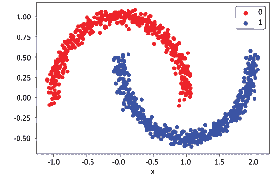

图 6.9：用于 DBSCAN 的数据

为了使用 DBSCAN，我们需要提供`eps`和`min_samples`参数，正如前文所讨论的：

```py
from matplotlib import pyplot
from pandas import DataFrame
# generate 2d classification dataset
X, y = make_moons (n_samples=1000, noise=0.05)
# scatter plot, dots colored by class value
df = DataFrame (dict (x=X[,0], y=X[,1], label=y))
colors = {0: 'red', 1:'blue'}
fig, ax = pyplot.subplots()
grouped = df.groupby('label')
for key, group in grouped:
    group.plot(ax=ax, kind='scatter', x='x', y='y', label=key, color-colors[key])
pyplot.show() 
```

# 评估聚类

良好质量的聚类目标是，属于不同簇的数据点应该是可以区分的。这意味着以下几点：

+   属于同一簇的数据点应该尽可能相似。

+   属于不同簇的数据点应该尽可能不同。

人类直觉可以通过可视化簇来评估聚类结果，但也有数学方法可以量化聚类的质量。这些方法不仅测量每个簇的紧密度（凝聚度）和不同簇之间的分离度，还提供了一种数值化的客观评估聚类质量的方法。轮廓分析就是一种技术，它比较由 k-means 算法创建的簇的紧密度和分离度。它是一个量化簇中凝聚度和分离度的度量指标。虽然这种技术在 k-means 的背景下有提及，但事实上它是可以推广的，适用于评估任何聚类算法的结果，而不仅限于 k-means。

轮廓分析为每个数据点分配一个分数，称为轮廓系数，范围从 0 到 1。它本质上衡量了同一簇内的每个数据点与相邻簇中数据点的距离。

### 聚类的应用

聚类被广泛应用于需要发现数据集潜在模式的场合。

在政府应用场景中，聚类可以用于以下方面：

+   **犯罪热点分析**：将聚类应用于地理位置数据、事件报告和其他相关特征。这有助于识别犯罪高发地区，使执法机构能够优化巡逻路线并更有效地部署资源。

+   **人口社会分析**：聚类可以分析诸如年龄、收入、教育和职业等人口统计数据。这有助于了解不同地区的社会经济组成，为公共政策和社会服务提供信息。

在市场研究中，聚类可以用于以下方面：

+   **市场细分**：通过对消费者数据（包括消费习惯、产品偏好和生活方式指标）进行聚类，企业可以识别出不同的市场细分群体。这有助于量身定制产品开发和营销策略。

+   **定向广告**：聚类有助于分析客户的在线行为，包括浏览模式、点击率和购买历史。这使得公司能够为每个客户群体创建个性化广告，从而提高参与度和转化率。

+   **客户分类**：通过聚类，企业可以根据客户与产品或服务的互动、反馈和忠诚度对客户进行分类。这有助于了解客户行为、预测趋势并制定客户保持策略。

**主成分分析**（**PCA**）也用于一般性的数据探索以及去除实时数据中的噪声，例如股市交易。在这种情况下，“噪声”指的是可能掩盖数据中潜在模式或趋势的随机或不规则波动。PCA 帮助过滤这些不规则波动，使数据分析和解释更加清晰。

# 降维

我们数据中的每个特征对应于我们问题空间中的一个维度。通过减少特征的数量，使我们的问题空间变得更简单，称为**降维**。它可以通过以下两种方式之一来实现：

+   **特征选择**：选择在我们试图解决的问题背景下重要的特征集合

+   **特征聚合**：通过以下算法之一将两个或多个特征合并以减少维度：

    +   **PCA**：一种线性无监督机器学习算法

    +   **线性判别分析**（**LDA**）：一种线性有监督机器学习算法

    +   **KPCA**：一种非线性算法

让我们更深入地了解其中一种流行的降维算法——主成分分析（PCA），并详细探讨。

## 主成分分析

PCA 是一种无监督机器学习方法，通常用于通过线性变换的过程来减少数据集的维度。简单来说，它是一种通过关注数据中最重要的部分来简化数据的方式，这些部分是通过它们的方差来识别的。

考虑一个数据集的图形表示，其中每个数据点都绘制在多维空间中。PCA 帮助识别主成分，这些主成分是数据变化最大的方向。在*图 6.10*中，我们看到了其中的两个，PC1 和 PC2。这些主成分展示了数据点分布的整体“形状”。

每个主成分对应一个新的较小维度，捕捉尽可能多的信息。从实际角度来看，这些主成分可以视为原始数据的摘要指标，使得数据更易于管理和分析。例如，在一个关于顾客行为的大型数据集中，PCA 可以帮助我们识别出定义大多数顾客行为的关键驱动因素（主成分）。

确定这些主成分的系数涉及计算数据协方差矩阵的特征向量和特征值，这是我们在后续章节中将深入探讨的话题。这些系数作为每个原始特征在新组件空间中的权重，定义了每个特征对主成分的贡献。


图 6.10：主成分分析

进一步说明，假设你有一个包含国家经济各个方面的数据集，例如 GDP、就业率、通货膨胀等。这些数据庞大且多维。在这里，PCA 允许你将这些多个维度简化为两个主成分，PC1 和 PC2。这些成分将包含最关键的信息，同时丢弃噪声或不太重要的细节。

结果图表，以 PC1 和 PC2 作为坐标轴，将为你提供一个更易于解释的经济数据的可视化表示，每个点代表一个经济体的状态，该状态基于其 GDP、就业率和其他因素的组合。

这使得 PCA 成为简化和解释高维数据的宝贵工具。

让我们考虑以下代码：

```py
from sklearn.decomposition import PCA
import pandas as pd
url = "https://storage.googleapis.com/neurals/data/iris.csv"
iris = pd.read_csv(url)
iris
X = iris.drop('Species', axis=1)
pca = PCA(n_components=4)
pca.fit(X) 
```

```py
 Sepal.Length   Sepal.Width    Petal.Length    Petal.Width    Species
0    5.1    3.5    1.4    0.2    setosa
1    4.9    3.0    1.4    0.2    setosa
2    4.7    3.2    1.3    0.2    setosa
3    4.6    3.1    1.5    0.2    setosa
4    5.0    3.6    1.4    0.2    setosa
...    ...    ...    ...    ...    ...
145    6.7    3.0    5.2    2.3    virginica
146    6.3    2.5    5.0    1.9    virginica
147    6.5    3.0    5.2    2.0    virginica
148    6.2    3.4    5.4    2.3    virginica
149    5.9    3.0    5.1    1.8    virginica 
```

```py
X = iris.drop('Species', axis=1)
pca = PCA(n_components=4)
pca.fit(X) 
```

```py
PCA(n_components=4) 
```

现在让我们打印出我们 PCA 模型的系数：

```py
pca_df=(pd.DataFrame(pca.components_,columns=X.columns))
pca_df 
```


图 6.11：突出显示 PCA 模型系数的图示

请注意，原始 DataFrame 有四个特征：`Sepal.Length`、`Sepal.Width`、`Petal.Length` 和 `Petal.Width`。前面的 DataFrame 指定了四个主成分 PC1、PC2、PC3 和 PC4 的系数——例如，第一行指定了 PC1 的系数，可用于替代原始的四个变量。

在这里需要注意的是，主成分的数量（在本例中为四个：PC1、PC2、PC3 和 PC4）不一定像我们之前的经济学例子那样必须是两个。主成分的数量是我们根据愿意处理数据的复杂度来选择的。我们选择的主成分越多，我们就能保留原始数据更多的方差，但这也会增加复杂度。

根据这些系数，我们可以计算输入数据框`X`的 PCA 组件：

```py
X['PC1'] = X['Sepal.Length']* pca_df['Sepal.Length'][0] + X['Sepal.Width']* pca_df['Sepal.Width'][0]+ X['Petal.Length']* pca_df['Petal.Length'][0]+X['Petal.Width']* pca_df['Petal.Width'][0]
X['PC2'] = X['Sepal.Length']* pca_df['Sepal.Length'][1] + X['Sepal.Width']* pca_df['Sepal.Width'][1]+ X['Petal.Length']* pca_df['Petal.Length'][1]+X['Petal.Width']* pca_df['Petal.Width'][1]
X['PC3'] = X['Sepal.Length']* pca_df['Sepal.Length'][2] + X['Sepal.Width']* pca_df['Sepal.Width'][2]+ X['Petal.Length']* pca_df['Petal.Length'][2]+X['Petal.Width']* pca_df['Petal.Width'][2]
X['PC4'] = X['Sepal.Length']* pca_df['Sepal.Length'][3] + X['Sepal.Width']* pca_df['Sepal.Width'][3]+ X['Petal.Length']* pca_df['Petal.Length'][3]+X['Petal.Width']* pca_df['Petal.Width'][3]
X 
```

现在让我们在计算 PCA 组件后打印`X`：

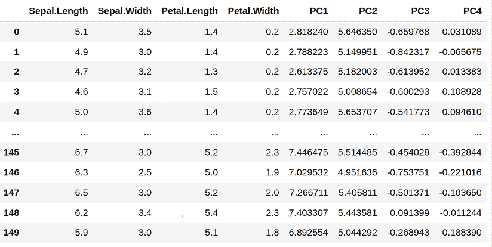

图 6.12：PCA 组件的打印计算结果

现在让我们打印方差比率，并尝试理解使用 PCA 的含义：

```py
print(pca.explained_variance_ratio_) 
```

```py
[0.92461872 0.05306648 0.01710261 0.00521218] 
```

方差比率表示以下内容：

+   如果我们选择用 PC1 替换原始的四个特征，那么我们将能够捕获原始变量方差的约 92.3%。由于未捕获原始四个特征的 100%方差，我们会引入一些近似。

+   如果我们选择用 PC1 和 PC2 替换原始的四个特征，那么我们将捕获原始变量方差的额外 5.3%。

+   如果我们选择用 PC1、PC2 和 PC3 替换原始的四个特征，那么我们将再捕获原始变量方差的 0.017%。

+   如果我们选择用四个主成分替换原始的四个特征，那么我们将捕获原始变量方差的 100%（92.4 + 0.053 + 0.017 + 0.005），但用四个主成分替换四个原始特征是没有意义的，因为我们根本没有降低维度，什么也没实现。接下来，让我们看看 PCA 的局限性。

### PCA 的局限性

尽管 PCA 有很多优点，但它也存在局限性，如下所述：

+   首先，PCA 在处理连续变量时最为有效，因为它的基本数学原理是为处理数值数据而设计的。它处理类别变量时效果较差，而类别变量通常出现在包括性别、国籍或产品类型等属性的数据集中。例如，如果你正在分析一个包含数字响应（如年龄或收入）和类别响应（如偏好或选择的选项）的调查数据集，PCA 对于类别数据并不适用。

+   此外，PCA 通过在较低维空间中创建原始高维数据的近似来运作。虽然这种降维简化了数据处理和操作，但它也带来了代价：一些信息的丢失。这是一个在每个使用案例中需要仔细评估的权衡。例如，如果你处理的是一个生物医学数据集，其中每个特征代表特定的基因标记，那么使用 PCA 可能会导致丢失对某种疾病的诊断或治疗至关重要的信息。

因此，虽然 PCA（主成分分析）在处理具有许多相互关联的数值变量的大型数据集时是一个强大的降维工具，但其局限性需要仔细考虑，以确保它是某个特定应用的正确选择。

### 关联规则挖掘

特定数据集中的模式是需要发现、理解并挖掘出其包含信息的宝藏。有一类重要的算法专注于给定数据集中的模式分析。这类算法中比较流行的一种被称为**关联规则挖掘**算法，它为我们提供了以下功能：

+   能够衡量模式的频率

+   能够建立*因果关系*模式

+   通过将模式的准确性与随机猜测进行比较，量化模式的有用性

现在我们将看一些关联规则挖掘的例子。

### 使用示例

关联规则挖掘用于我们试图调查数据集不同变量之间的因果关系时。以下是它能帮助回答的典型问题：

+   哪些湿度、云量和温度值可能导致明天下雨？

+   什么类型的保险索赔可能表明欺诈行为？

+   哪些药物组合可能会导致患者出现并发症？

正如这些例子所示，关联规则挖掘在商业智能、医疗保健和环境研究等领域有广泛的应用。这一算法是数据科学家工具包中的强大工具，能够将复杂的模式转化为跨多个领域的可操作洞察。

### 市场篮子分析

推荐引擎是本书*第十二章*《推荐引擎》中广泛讨论的一个重要主题，是个性化用户体验的强大工具。然而，还有一种更简单且有效的生成推荐的方法，称为市场篮子分析。市场篮子分析基于哪些商品经常一起购买的信息。与更复杂的推荐引擎不同，这种方法不考虑用户特定数据或用户表达的个别商品偏好。在这里必须做出区分。推荐引擎通常根据用户的过去行为、偏好以及大量其他用户特定信息创建个性化建议。相反，市场篮子分析只关注购买的商品组合，而不考虑购买者是谁或他们的个别偏好。

市场篮分析的一个主要优势是数据收集的相对简便性。收集全面的用户偏好数据可能复杂且耗时。然而，关于商品共同购买的数据通常可以直接从交易记录中提取，这使得市场篮分析成为商家进入推荐领域的一个便捷起点。例如，当我们在沃尔玛购物时，就会生成这类数据，而不需要任何特殊技术来获取这些数据。

所谓的“特殊技术”，是指额外的步骤，如进行用户调查、使用追踪 Cookie 或构建复杂的数据管道。相反，这些数据是作为销售过程的副产品随时可用的。当这些数据在一段时间内收集时，就称为**跨国数据**。

当关联规则分析应用于便利店、超市和快餐连锁店的购物车跨国数据时，这被称为**市场篮分析**。它衡量一起购买一组商品的条件概率，有助于回答以下问题：

+   商品应如何在货架上摆放？

+   商品应该如何在营销目录中展示？

+   基于用户的购买模式，应该推荐什么？

由于市场篮分析能够估计商品之间的关联性，因此它常常用于大宗零售市场，如超市、便利店、药店和快餐连锁店。市场篮分析的优点在于结果几乎是自解释的，意味着商业用户可以轻松理解。

我们来看一个典型的大型超市。商店中所有独特的商品可以用一个集合表示， = {item[1], item[2], . . . , item[m]}。因此，如果该超市销售 500 种不同的商品，那么将是一个包含 500 个元素的集合。

人们会在这家商店购买商品。每次有人购买商品并在收银台付款时，该商品就会被添加到某个特定交易的商品集合中，这个集合被称为**商品集**。在特定时间段内，这些交易会被汇总到一个集合中，表示为，其中 = {t[1], t[2], . . . , t[n]}。

我们来看以下仅由四个交易组成的简单交易数据。这些交易汇总在下面的表格中：

| t[1] | 门柱，护垫 |
| --- | --- |
| t[2] | 球棒，门柱，护垫，头盔 |
| t[3] | 头盔，球 |
| t[4] | 球棒，护垫，头盔 |

让我们更详细地看这个例子：

 = {球棒，门柱，护垫，头盔，球}，表示商店中所有独特的商品。

让我们考虑来自的一个事务 t[3]。注意，在 t[3] 中购买的商品可以用物品集 t[3] = {头盔, 球} 表示，意味着顾客购买了两件商品。这个集合被称为物品集，因为它包含了单个事务中购买的所有商品。由于这个物品集有两个商品，所以物品集 t[3] 的大小被认为是二。这个术语让我们能够更有效地分类和分析购买模式。

# 关联规则挖掘

一个关联规则从数学上描述了涉及多个事务的物品之间的关系。它通过研究两个物品集之间的关系，以 *X* ⇒ *Y* 的形式进行描述，其中 ， 。此外，*X* 和 *Y* 是不重叠的物品集；这意味着 。

一个关联规则可以通过以下形式来描述：

{*头盔*, *球*} ⇒ {*自行车*}

这里， {*头盔*, *球*} 是 *X*， {*自行车*} 是 *Y*。

让我们来看看不同类型的关联规则。

### 规则的类型

运行关联分析算法通常会从事务数据集中生成大量规则。它们中的大多数是无用的。为了挑选出能提供有用信息的规则，我们可以将它们分类为以下三种类型：

+   微不足道的

+   无法解释

+   可执行的

让我们更详细地看一下这些类型。

### 微不足道的规则

在生成的大量规则中，许多从数据中推导出的规则是无用的，因为它们总结了有关业务的常识。这些被称为微不足道的规则。即使微不足道规则的置信度很高，它们仍然无用，不能用于任何基于数据的决策。请注意，这里“置信度”指的是在关联分析中使用的一种度量，量化了在另一个事件（A）已经发生的情况下，某个特定事件（比如 B）发生的概率。我们可以安全地忽略所有微不足道的规则。

以下是一些微不足道规则的例子：

+   任何从高楼大厦跳下来的人很可能会死。

+   更努力工作可以在考试中获得更好的成绩。

+   当温度下降时，取暖器的销售量会上升。

+   在高速公路上超速驾驶会导致发生事故的几率增加。

### 无法解释的规则

在运行关联规则算法之后生成的规则中，那些没有明显解释的规则是最难使用的。请注意，只有当一个规则可以帮助我们发现并理解一个新的模式，并最终可能导致某个特定的行动时，才是有用的。如果不能解释为什么事件 *X* 导致事件 *Y*，那么它就是一个无法解释的规则，因为它只不过是一个数学公式，最终探索的是两个无关和独立事件之间没有意义的关系。

以下是一些无法解释的规则的例子：

+   穿红色衬衫的人在考试中往往表现更好。

+   绿色自行车更容易被盗。

+   买泡菜的人也会购买尿布。

### 可操作规则

可操作规则是我们寻找的黄金规则。它们为业务所理解并能带来洞察。当向熟悉业务领域的观众展示时，它们可以帮助我们发现事件的可能原因。例如，可操作规则可能基于当前的购买模式，建议在商店中为特定产品选择最佳陈列位置。它们还可以建议将哪些物品放在一起，以最大化销售机会，因为用户倾向于将这些物品一起购买。

以下是可操作规则及其相应行动的示例：

+   **规则 1**：向用户社交媒体账户展示广告会提高销售的可能性。

+   **可操作项**：建议广告产品的替代方式。

+   **规则 2**：创建更多的价格点可以提高销售的可能性。

+   **可操作项**：某一商品可以进行促销，而另一商品的价格则可以提高。

现在让我们来看一下如何对规则进行排序。

### 排序规则

关联规则有三种衡量方式：

+   物品的支持度（频率）

+   信心

+   提升度

让我们更详细地了解一下它们。

### 支持度

支持度度量是一个数值，用于量化我们在数据集中寻找的模式的频率。它是通过首先计算我们感兴趣的模式出现的次数，然后将其除以所有交易的总数来计算的。

让我们来看一下针对特定*项目集*[a]的公式：

*numItemset*[a] *= 包含*项目集*[a]的交易数量

*num*[total] *= 交易总数*


仅通过查看支持度，我们就可以了解模式出现的稀有性。低支持度意味着我们在寻找一个稀有事件。在商业环境中，这些稀有事件可能是异常情况或离群值，可能具有重要的意义。例如，它们可能代表不寻常的客户行为或独特的销售趋势，这可能标志着需要战略关注的机会或威胁。

例如，如果*项目集*[a] = {头盔, 球}出现在六笔交易中的两笔中，那么支持度*(项目集*[a]*) = 2/6 = 0.33*。

### 信心

信心是一个数值，它通过计算条件概率量化了我们可以多大程度地将左侧（*X*）与右侧（*Y*）关联。它计算了在事件*X*发生的情况下，事件*X*导致事件*Y*发生的概率。

数学上，考虑规则*X* ⇒ *Y*。

该规则的信心表示为信心(*X* ⇒ *Y* )，其测量方式如下：


让我们看一个例子。考虑以下规则：

{*头盔*, *球*} ⇒ {*球门柱*}

该规则的信心通过以下公式计算：


这意味着，如果某人购物篮中有{头盔，球}，则有 0.5 或 50%的概率他们还会购买搭配的球棒。

### 提升度

估算规则质量的另一种方法是计算提升度。提升度返回一个数字，量化规则在预测结果时相比仅假设方程右侧结果所取得的改进。“改进”指的是规则在预测结果时，相比于基线或默认方法所带来的增强或改善程度。它表示规则提供的预测比仅依赖方程右侧假设所获得的预测更准确或更具洞察力的程度。如果*X*和*Y*项集是独立的，则提升度按如下方式计算：


## 关联分析的算法

在本节中，我们将探索以下两种可用于关联分析的算法：

+   **Apriori 算法**：由 Agrawal, R. 和 Srikant 于 1994 年提出。

+   **FP-growth 算法**：由 Han 等人于 2001 年提出的改进方案。

让我们逐一看一下这些算法。

### Apriori 算法

Apriori 算法是一种迭代和多阶段的算法，用于生成关联规则。它基于生成与测试方法。

在执行 Apriori 算法之前，我们需要定义两个变量：支持度[阈值]和置信度[阈值]。

该算法包括以下两个阶段：

+   **候选生成阶段**：它生成候选项集，其中包含所有支持度[阈值]以上的项集。

+   **筛选阶段**：它会过滤掉所有低于期望置信度[阈值]的规则。

经过筛选后，得到的规则即为答案。

### Apriori 算法的局限性

Apriori 算法的主要瓶颈是在第一阶段生成候选规则——例如， = {项[1]，项[2]，...，项[m]}可以产生 2^m 个可能的项集。由于其多阶段设计，它首先生成这些项集，然后再寻找频繁项集。这个限制是一个巨大的性能瓶颈，使得 Apriori 算法不适用于较大的项集，因为它在找到频繁项集之前会生成过多的项集，这会影响所需时间。

现在让我们深入了解 FP-growth 算法。

### FP-growth 算法

**频繁模式增长**（**FP-growth**）算法是对 Apriori 算法的改进。它首先展示频繁事务 FP 树，这是一棵有序树。它包括两个步骤：

+   填充 FP 树

+   挖掘频繁模式

让我们逐步看这些步骤。

### 填充 FP 树

让我们考虑下表所示的交易数据。首先，我们将其表示为稀疏矩阵：

| **ID** | **球棒** | **球票** | **护垫** | **头盔** | **球** |
| --- | --- | --- | --- | --- | --- |
| 1 | 0 | 1 | 1 | 0 | 0 |
| 2 | 1 | 1 | 1 | 1 | 0 |
| 3 | 0 | 0 | 0 | 1 | 1 |
| 4 | 1 | 0 | 1 | 1 | 0 |

现在，让我们计算每个项的频率并按频率降序排列：

| **项** | **频率** |
| --- | --- |
| 护垫 | 3 |
| 头盔 | 3 |
| 球棒 | 2 |
| 门柱 | 2 |
| 球 | 1 |

现在，让我们根据频率重新排列基于交易的数据：

| **ID** | **原始项** | **重新排序的项** |
| --- | --- | --- |
| t1 | 门柱，护垫 | 护垫，门柱 |
| t2 | 球棒，门柱，护垫，头盔 | 头盔，护垫，门柱，球棒 |
| t3 | 头盔，球 | 头盔，球 |
| t4 | 球棒，护垫，头盔 | 头盔，护垫，球棒 |

为了构建 FP 树，让我们从 FP 树的第一分支开始。FP 树以**空**作为根节点。为了构建树，我们可以用节点表示每个项，如下图所示（这里显示的是 t[1]的树表示）。

请注意，每个节点的标签是项的名称，频率则附加在冒号后面。同时请注意，**护垫**项的频率为 1：

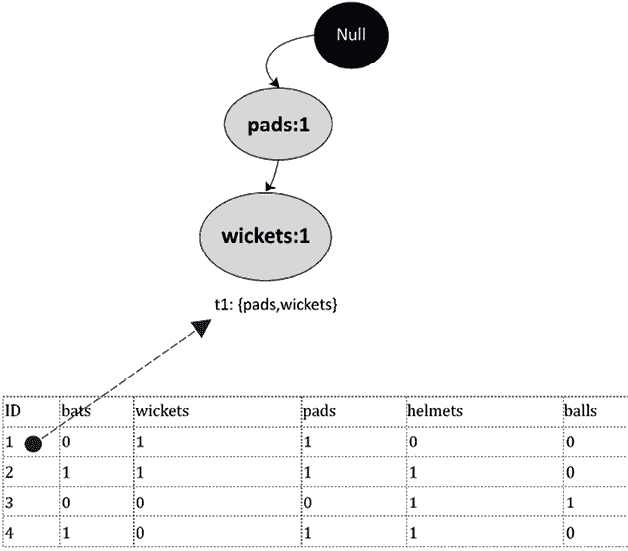

图 6.13：FP 树表示第一个交易

运用相同的模式，让我们绘制所有四个交易，从而得到完整的 FP 树。FP 树有四个叶节点，每个叶节点表示与四个交易相关联的项集。请注意，我们需要计算每个项的频率，并在多次使用时增加其频率——例如，当将 t[2]添加到 FP 树时，**头盔**的频率增加到 2。同样，在添加 t[4]时，它的频率再次增加到 3。

得到的树如以下图所示：

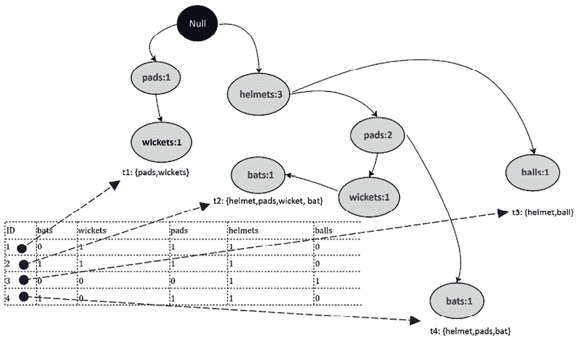

图 6.14：FP 树表示所有交易

请注意，前面的图示中生成的 FP 树是一个有序树。这引出了 FP-growth 树的第二阶段：挖掘频繁模式。

### 挖掘频繁模式

FP-growth 过程的第二阶段专注于从 FP 树中挖掘频繁模式。创建有序树是一个故意的步骤，旨在生成一种便于在寻找这些频繁模式时轻松导航的数据结构。

我们从一个叶节点开始这段旅程，这是一个终点节点，并向上遍历。例如，让我们从一个叶节点项目“球棒”开始。我们接下来的任务是找出“球棒”的条件模式基。术语“条件模式基”可能听起来很复杂，但它仅仅是指从特定叶节点项目到树根的所有路径的集合。对于我们的项目“球棒”，条件模式基将包括从“球棒”节点到树顶部的所有路径。此时，理解有序和无序树之间的差异变得至关重要。在有序树（如 FP 树）中，项目遵循固定顺序，简化了模式挖掘过程。无序树不提供这种结构化设置，这可能使频繁模式的发现更具挑战性。

当计算“球棒”的条件模式基时，我们实质上是映射从“球棒”节点到根的所有路径。这些路径显示了在交易中与“球棒”经常共现的项目。实质上，我们正在遵循与“球棒”相关的树的“分支”，以理解它与其他项目的关系。这种视觉上的说明阐明了我们从哪里获取这些信息以及 FP 树如何帮助阐明交易数据中的频繁模式。**球棒**的条件模式基如下所示：

| 曲棍球: 1 | 护具: 1 | 头盔: 1 |
| --- | --- | --- |
| 护腕: 1 | 头盔: 1 |  |

**球棒**的**频繁模式**将如下所示：

{*曲棍球*, *护具*, *头盔*}: *球棒*

{*护腕*, *头盔*}: *球棒*

### 使用 FP-growth 的代码

让我们看看如何使用 Python 中的 FP-growth 算法生成关联规则。为此，我们将使用`pyfpgrowth`包。首先，如果我们以前从未使用过`pyfpgrowth`，让我们先安装它：

```py
!pip install pyfpgrowth 
```

然后，让我们导入我们实现此算法所需的包：

```py
import pandas as pd
import numpy as np
import pyfpgrowth as fp 
```

现在我们将创建输入数据，形式为`transactionSet`：

```py
dict1 = {
    'id':[0,1,2,3],
    'items':[["wickets","pads"],
    ["bat","wickets","pads","helmet"],
    ["helmet","pad"],
    ["bat","pads","helmet"]]
 }
transactionSet = pd.DataFrame(dict1) 
```

```py
 id    items
0    0    [wickets, pads]
1    1    [bat, wickets, pads, helmet]
2    2    [helmet, pad]
3    3    [bat, pads, helmet] 
```

一旦生成了输入数据，我们将基于我们在`find_frequent_patterns()`中传递的参数生成图案。请注意，传递给此函数的第二个参数是最小支持度，在本例中为 1：

```py
patterns = fp.find_frequent_patterns(transactionSet['items'],1) 
```

图案已生成。现在让我们打印这些图案。这些图案列出了项目组合及其支持度：

```py
patterns 
```

```py
{('pad',): 1,
 ('helmet', 'pad'): 1,
 ('wickets',): 2,
 ('pads', 'wickets'): 2,
 ('bat', 'wickets'): 1,
 ('helmet', 'wickets'): 1,
 ('bat', 'pads', 'wickets'): 1,
 ('helmet', 'pads', 'wickets'): 1,
 ('bat', 'helmet', 'wickets'): 1,
 ('bat', 'helmet', 'pads', 'wickets'): 1,
 ('bat',): 2,
 ('bat', 'helmet'): 2,
 ('bat', 'pads'): 2,
 ('bat', 'helmet', 'pads'): 2,
 ('pads',): 3,
 ('helmet',): 3,
 ('helmet', 'pads'): 2} 
```

现在让我们生成规则：

```py
rules = fp.generate_association_rules(patterns,0.3)
rules 
```

```py
{('helmet',): (('pads',), 0.6666666666666666),
 ('pad',): (('helmet',), 1.0),
 ('pads',): (('helmet',), 0.6666666666666666),
 ('wickets',): (('bat', 'helmet', 'pads'), 0.5),
 ('bat',): (('helmet', 'pads'), 1.0),
 ('bat', 'pads'): (('helmet',), 1.0),
 ('bat', 'wickets'): (('helmet', 'pads'), 1.0),
 ('pads', 'wickets'): (('bat', 'helmet'), 0.5),
 ('helmet', 'pads'): (('bat',), 1.0),
 ('helmet', 'wickets'): (('bat', 'pads'), 1.0),
 ('bat', 'helmet'): (('pads',), 1.0),
 ('bat', 'helmet', 'pads'): (('wickets',), 0.5),
 ('bat', 'helmet', 'wickets'): (('pads',), 1.0),
 ('bat', 'pads', 'wickets'): (('helmet',), 1.0),
 ('helmet', 'pads', 'wickets'): (('bat',), 1.0)} 
```

每条规则都有左手边和右手边，用冒号(`:`)分隔。它还为我们提供了数据集中每条规则的支持度。

# 摘要

在本章中，我们探讨了各种无监督机器学习技术。我们研究了在何种情况下尝试降低我们试图解决的问题的维度是一个好主意，以及如何通过不同的方法实现这一点。我们还研究了无监督机器学习技术在哪些实际示例中可能非常有帮助，包括市场篮分析。

在下一章，我们将探讨各种监督学习技术。我们将从线性回归开始，然后介绍更复杂的监督学习算法，如基于决策树的算法、SVM 和 XGBoost。我们还将学习朴素贝叶斯算法，它最适用于非结构化文本数据。

# 在 Discord 上了解更多信息

要加入本书的 Discord 社区——在这里你可以分享反馈、向作者提问并了解新版本——请扫描下面的二维码：

[`packt.link/WHLel`](https://packt.link/WHLel)


