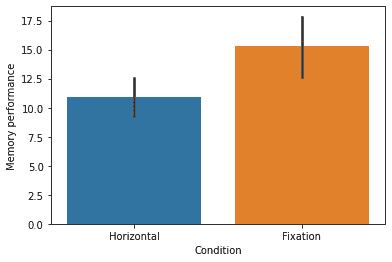
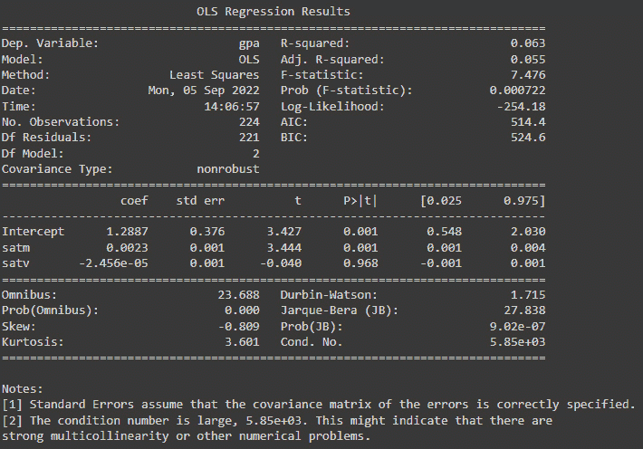
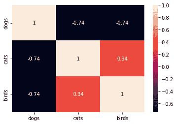
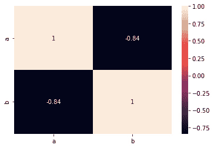
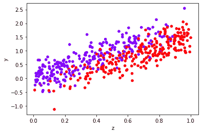
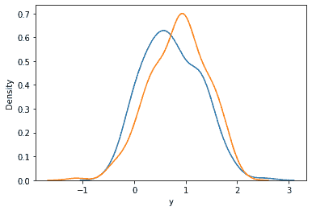

# 2

# 在业务操作中使用机器学习

机器学习是一个研究领域，专注于理解和开发“学习”过程，或使用数据来提高在特定任务集上的表现。它被认为是人工智能的一个组成部分。其中，机器学习是一项技术，使企业能够高效地从非结构化数据中提取知识。在几乎不需要编程的情况下，机器学习——更准确地说，机器学习算法——可以用来从给定的数据集进行迭代学习，理解模式、行为等。

在本章中，我们将学习如何做到以下几点：

+   使用统计分析验证观察到的效果差异

+   分析变量之间的相关性和因果关系，并建立模型

+   为聚类和机器学习模型准备数据

+   开发用于回归和分类的机器学习模型

# 技术要求

为了能够跟随本章的步骤，你需要满足以下要求：

+   运行 Python 3.7 及以上版本的 Jupyter Notebook 实例。如果你有 Google Drive 账户，也可以使用 Google Colab Notebook 运行这些步骤。

+   具备基本的数学和统计概念知识。

+   下载书中 GitHub 页面提供的示例数据集，原始来源是[`python.cogsci.nl/numerical/statistics/`](https://python.cogsci.nl/numerical/statistics/)。

# 使用 t 检验验证变化的效果

当衡量某些操作对特定用户群体的影响时，我们需要验证这些操作是否已经显著影响了目标群体。为了做到这一点，我们可以使用 t 检验。

t 检验是一种统计检验，用于比较两组的均值，以确定某种方法或治疗是否对感兴趣的人群产生影响，或者两个组是否存在差异；它通常用于假设检验。

当两个组中的数据集不涉及相同的值时，独立地选择不同的 t 检验样本。这些样本可能包括两组随机选择的、不相关的患者群体，用来研究药物的效果。例如，其中一组接受处方治疗，另一组则作为对照组，接受安慰剂。这会产生两个独立的、无关的样本集。简单来说，t 检验用于比较两组的均值。它通常用于假设检验，以确定一个方法或治疗是否真正影响了感兴趣的人群，或者两个组之间是否存在差异。

t 检验在商业背景下用于比较两个不同的均值，并确定它们是否代表相同的总体，尤其在验证促销活动对销售提升的影响时非常有用。此外，它还使企业能够理解其结果是否为偶然现象的概率。

我们将学习如何使用 SciPy 包和 Matzke 等人（2015）数据集进行独立样本 t 检验。该数据集中的参与者经历了一项记忆挑战，需回忆出一组单词。在保持间隔期间，一组参与者专注于显示屏上的中央固定点，而另一组志愿者则不断地水平移动眼睛，有些人认为这有助于记忆。

为了判断横向眼动组的记忆表现（`CriticalRecall`）是否优于注视组，我们可以使用 SciPy 库中的 `ttest_ind` 函数：

```py
from scipy.stats import ttest_ind
import pandas as pd
dm = pd.read_csv('matzke_et_al.csv')
dm_horizontal = dm[dm.Condition=='Horizontal']
dm_fixation = dm[dm.Condition=='Fixation']
t, p = ttest_ind(dm_horizontal.CriticalRecall, dm_fixation.CriticalRecall)
print('t = {:.3f}, p = {:.3f}'.format(t, p))
```


图 2.1：T 检验结果

t 检验的 p 值可以在输出结果中找到，它是你评估 t 检验结果所需的全部信息。只需将输出的 p 值与所选的 alpha 水平进行比较，即可在所需的 alpha（显著性）水平上进行假设检验：

```py
import seaborn as sns
import matplotlib.pyplot as plt # visualization
sns.barplot(x='Condition', y='CriticalRecall', data=dm)
plt.xlabel('Condition')
plt.ylabel('Memory performance')
plt.show()
```

如果 p 值小于设定的显著性阈值（例如 0.05），你可以拒绝原假设。两个均值之间的差异在统计上具有显著性。你的样本数据足够有说服力，支持两个总体均值不相等的结论：



图 2.2：总体分布

高 t 值（也称为 t 值）表示组间差异明显，而低 t 值则表示组间相似。自由度，或研究中可能变化的值，对于确定原假设的显著性和真实性至关重要。

在我们的例子中，结果表明存在显著差异（p = 0.0066）。然而，固定注视组表现优于其他组，且其效果与预期方向相反。

另一种测试两个总体差异的方法是配对样本 t 检验，它比较同一组的两个变量均值。为确定平均值是否偏离 0，该过程计算每次出现时两个变量之间的差异。独立或不相关组的均值使用非配对 t 检验进行比较。非配对 t 检验假设组间的方差相等，而配对 t 检验则不要求方差相等。该过程还自动计算 t 检验的效应量。配对 t 检验用于数据为匹配对的情况，而两样本 t 检验用于两个样本在统计上独立的数据。

让我们使用 Moore、McCabe 和 Craig 的数据集。在这里，评估了痴呆症患者在满月和其他月相期间的攻击行为。这是一个被试内设计，因为在两个时间点对每位参与者进行了测量。

你可以使用 `ttest_rel` SciPy 函数来检验攻击性在满月和其他月相之间是否有所不同：

```py
from scipy.stats import ttest_rel
dm = pd.read_csv('moon-aggression.csv')
t, p = ttest_rel(dm.Moon, dm.Other)
print('t = {:.3f}, p = {:.3f}'.format(t, p))
```

如下图所示，有一个有趣且显著的效应，因为 p 值从不为 0，正如输出所示。这一效应表明，人们确实在满月期间最为暴力：


图 2.3：攻击性数据集的 T 检验结果

另一种比较两个组之间差异的方法是统计方法**方差分析**（**ANOVA**），该方法用于检查不同均值之间的差异。罗纳德·费舍尔于 1918 年创立了这一统计检验方法，并一直沿用至今。简而言之，ANOVA 分析可以确定三个或更多独立组的均值是否在统计上存在差异。那么，ANOVA 会取代 t 检验吗？其实不会。ANOVA 用于比较三个或更多组之间的均值，而 t 检验则用于比较两个组之间的均值。

在商业环境中，ANOVA 可以用于预算管理，例如，将预算与成本进行比较，以管理收入和库存。ANOVA 还可以用于通过比较预算与成本来管理收入和库存。例如，为了更好地了解未来的销售表现，ANOVA 还可以用于通过检查数据模式来预测趋势。在评估市场研究中经常使用的多项量表时，ANOVA 尤其有用。使用 ANOVA 可能会帮助你作为市场研究员理解不同群体的反应。你可以通过接受零假设开始测试，即观察到的所有组的均值是相等的。

在下一个示例中，让我们重新审视 Moore、McCabe 和 Craig 提供的心率信息。性别和组别是该数据集中两个与主题相关的因素，还有一个因变量（心率）。你需要以下代码来检查性别、组别或它们的交互作用是否对心率产生影响。

我们将使用 `anova_lm` 的组合，这并不是非常优雅，但关键部分是公式：

```py
from statsmodels.stats.anova import anova_lm
dm = pd.read_csv('heartrate.csv')
dm = dm.rename({'Heart Rate':'HeartRate'},axis=1)  # statsmodels doesn't like spaces
df = anova_lm(ols('HeartRate ~ Gender * Group', data=dm).fit())
print(df)
```

结果显示心率与所有因素相关：性别（F = 185.980，p < .001）、组别（F = 695.647，p < .001）以及性别与组别的交互作用（F = 7.409，p = .006）。


图 2.4：ANOVA 检验结果

现在我们已经验证了多个组之间确实存在差异，接下来可以开始对这些关系进行建模。

## 使用多元线性回归建模关系

被称为多元线性回归的统计方法利用两个或更多的自变量来预测因变量的结果。通过这种方法，分析师可以计算模型的方差以及每个自变量对整体方差的相对贡献。涉及多个解释变量的回归，无论是线性还是非线性的，都属于多元回归范畴。

多元回归分析的目的是让研究人员能够评估结果（因变量）与多个预测变量之间关系的强度，以及每个预测变量在关系中的重要性，通常是通过消除其他预测变量的统计效应来实现。

多元回归包含多个自变量，而线性回归只考虑一个自变量来影响关系的斜率。

企业可以使用线性回归分析趋势并生成估算或预测。例如，如果一家公司的销售额在过去几年中每月逐渐上升，该公司可以通过对销售数据和每月销售额进行线性分析，预测未来几个月的销售额。

让我们使用 Moore、McCabe 和 Craig 的数据集，其中包含高中生的平均绩点（GPA）和数学及语言知识的 SAT 成绩。我们可以使用以下代码来测试`satm`和`satv`是否与`gpa`（独立）相关。

我们将使用`OLS`的 SciPy 函数来评估这个关系，该关系作为相关变量的组合传递，然后拟合到数据上：

```py
from statsmodels.formula.api import ols
dm = pd.read_csv('gpa.csv')
model = ols('gpa ~ satm + satv', data=dm).fit()
print(model.summary())
```



图 2.5：OLS 结果

结果显示，仅数学科目的 SAT 成绩与平均绩点（GPA）有独特的关系，而语言科目的 SAT 成绩则没有。

在下一节中，我们将探讨相关性的概念，即当变量以相似的方式变化时，称为相关；而因果关系则是指一个变量影响另一个变量。

# 建立相关性和因果关系

被称为相关性的统计量表示了两个变量之间线性关系的紧密程度，可以通过图形方式理解为两个曲线重叠的程度。这是一种描述简单关系的典型方法，而不明确指出因果关系。

相关矩阵显示了相关值，用于量化每一对变量之间的线性关系的紧密程度。相关系数的范围是-1 到+1。如果两个变量有相似的上升和下降趋势，相关值为正。

统计中通常测量的四种相关性类型是斯皮尔曼相关系数、皮尔逊相关系数、肯达尔秩相关系数和点二列相关系数。

为了使组织能够根据预测事件结果做出数据驱动的决策，通常使用相关性和回归分析来预测未来的结果。相关性分析的两个主要优点是它能够快速进行假设检验，并帮助企业决定要进一步探究哪些变量。为了确定两个变量之间线性关系的强度，相关性分析的主要方法是应用 Pearson 的 `r` 公式。

使用 pandas 数据框中的 `corr` 方法，我们可以计算列的成对相关性，并删除 NA/null 值。该技术可以作为参数传递，`pearson` 或 `kendall` 为标准相关系数，`spearman` 为斯皮尔曼等级相关性，或者 `kendall` 为 Kendall Tau 相关系数。

pandas 数据框中的 `corr` 方法返回一个浮动矩阵，对角线上为 1，并且无论调用函数的行为如何，都是对称的：

```py
import numpy as np
import pandas as pd
df = pd.DataFrame([(.2, .3,.8), (.0, .6,.9), (.6, .0,.4), (.2, .1,.9),(.1, .3,.7), (.1, .5,.6), (.7, .1,.5), (.3, .0,.8),],columns=['dogs', 'cats','birds'])
corr_mat = df.corr()
```

我们可以使用 seaborn 热图来绘制结果的相关性矩阵：

```py
import seaborn as sn
sn.heatmap(corr_mat, annot=True)
```



图 2.6: 相关性矩阵

利用成对相关性进行特征选择的主要目标是找到高度相关的特征组，并仅保留其中一个，这样可以通过尽可能少的特征来最大化模型的预测值。

成对相关性是在 DataFrame 的行或列与 Series 或 DataFrame 的行或列之间计算的。相关性是在对齐了 DataFrame 的两个轴之后计算的。接下来，我们可以看到一个例子，可能会更清楚一些：

```py
df1=pd.DataFrame( np.random.randn(3,2), columns=['a','b'] )
df2=pd.DataFrame( np.random.randn(3,2), columns=['a','b'] )
```

使用 `corr` 来比较同一数据框内的数值型列。非数值型列将自动被跳过：

```py
corr_mat = df1.corr()
sn.heatmap(corr_mat, annot=True)
plt.show()
```



图 2.7: 相关性矩阵

我们还可以使用 `corrwith` 比较 `df1` 和 `df2` 的列。请注意，只有具有相同名称的列才会被比较：

```py
df1.corrwith(df2)
```

为了简化操作，如果我们希望 pandas 忽略列名并仅比较 `df1` 的第一行与 `df2` 的第一行，可以将 `df2` 的列名重命名为与 `df1` 匹配：

```py
df1.corrwith(df2.set_axis( df1.columns, axis='columns', inplace=False))
```

需要注意的是，在这种情况下，`df1` 和 `df2` 必须具有相同的列数。

最后，你也可以将这两个数据集水平合并，并使用 `corr`。其优点在于，它基本上独立于列的数量和命名规则，但缺点是你可能会得到超出需要或想要的输出：

```py
corr_mat = pd.concat([df1,df2],axis=1).corr()
sn.heatmap(corr_mat, annot=True)
plt.show()
```


图 2.8: 相关性热图

现在我们已经确认了通过相关性分析可以找出两个变量之间的相关性，我们可以尝试通过因果分析验证这些变量是否真正相互影响。

一个变量对另一个变量的影响能力被称为因果关系。第一个变量可能会产生第二个变量，或者可能会改变第二个变量的发生频率。

因果关系是一个事件、过程、状态或对象影响另一个事件、过程、条件或对象发展的过程，其中原因和结果是相互依赖的。那么，相关性与因果关系有什么区别呢？相关性并不自动意味着因果关系，即使因果关系和相关性可能同时存在。在 A 行动导致 B 结果的情况下，因果关系明确适用。另一方面，相关性只是两者之间的关系。

我们可以使用以下数据集来研究变量之间的因果关系：

```py
import numpy as np
import pandas as pd
import random
ds = pd.DataFrame(columns = ['x','y'])
ds['x'] = [int(n>500) for n in random.sample(range(0, 1000), 
      100)]
ds['y'] = [int(n>500) for n in random.sample(range(0, 1000), 
      100)]
ds.head()
```

为了研究因果关系，我们可以尝试估算两组之间的均值差异。两组之间均值的绝对差异被称为均值差异，通常称为均值之差。它让你了解在临床研究中，实验组和对照组的平均值有多大差异。

在下一个示例中，我们将估算提升量作为均值差异的量化值，并计算确定的标准误差。我们将使用 90 作为正态分布范围内的置信区间，这将得到一个 z 值为 1.96：

```py
base,var  = ds[ds.x == 0], ds[ds.x == 1]
delta = var.y.mean() - base.y.mean()
delta_dev = 1.96 * np.sqrt(var.y.var() / var.shape[0] 
      +base.y.var() / base.shape[0])
print("estimated_effect":,delta, "standard_error": delta_dev)
```


图 2.9: 人群之间的估计差异

我们还可以使用列联 `卡方` 检验来比较具有二分依赖变量的两组。例如，我们可以使用是/否响应尺度对男性和女性进行对比。列联卡方检验基于与简单卡方分析相同的原理，该分析比较预期结果与实际结果。

这种统计技术用于将实际结果与预测结果进行比较。此测试的目的是确定观察到的数据与预期数据之间的差异是否是偶然的，还是研究变量之间的相关性。结果会生成一个列联矩阵，从中我们可以推断，如果 C 接近零（或等于零），则变量之间相互独立且没有关联。如果 C 不为零，则存在某种关系；C 只能取正值：

```py
from scipy.stats import chi2_contingency
contingency_table = (
         ds 
         .assign(placeholder=1) 
         .pivot_table(index="x", columns="y", 
              values="placeholder", aggfunc="sum") 
         .values)
_, p, _, _ = chi2_contingency(contingency_table, 
     lambda_="log-likelihood")
```

在这里，我们将仅尝试解释 p 值：

```py
print("P-value:",p)
```


图 2.10: 结果 p 值

现在我们将使用一组合成生成的数据集：

```py
data_1 = pd.read_csv('observed_data_1.csv' )
data_1.plot.scatter(x="z", y="y", c="x", cmap="rainbow", colorbar=False)
```



图 2.11: 数据分布图

连续随机变量的概率密度函数可以通过 **核密度估计**（**KDE**）seaborn 方法来估计。图中曲线下方的区域代表了数据值的概率分布：

```py
import seaborn as sns
sns.kdeplot(data_1.loc[lambda df: df.x == 0].y, label="untreated")
sns.kdeplot(data_1.loc[lambda df: df.x == 1].y, label="treated")
```



图 2.12：密度图

为了研究因果关系，研究人员必须建立一个模型，以描述在因果建模中与特定现象相关的思想之间的联系。

多重因果性——即任何给定结果可能有多个原因——被纳入因果模型。例如，社会地位、年龄、性别、种族和其他因素可能会影响一个人的投票行为。此外，一些独立或解释变量可能是相互关联的。

外部效度可以通过因果模型来解决（即一个研究的结果是否适用于未研究的群体）。在某些情况下，因果模型可以结合数据提供一些单一数据集无法解决的问题的答案。

我们可以使用`causalinference`包中的`est_via_ols`函数，通过最小二乘法估计平均处理效应。

这里，*y*是处理后的潜在结果，D 是处理状态，X 是协变量或个体特征的向量。

控制的参数是`adj`，一个整数，可以是 0、1 或 2。该参数指示如何执行协变量调整。将`adj`设置为 0 时，将不包括任何协变量。将`adj`设置为 1 时，分别包括处理指示变量 D 和协变量 X，或者将`adj`设置为 2 时，还包括 D 与 X 之间的交互项。默认值是 2。

```py
!pip install causalinference
from causalinference import CausalModel
cm = CausalModel(
    Y=data_1.y.values,
    D=data_1.x.values,
    X=data_1.z.values)
cm.est_via_ols(adj=1)
print(cm.estimates)
```


图 2.13：因果模型结果

估计结果显示，变量之间存在负相关关系。负估计可能表明，D 的应用使 Y 的概率降低了 48%。观察所有估计分布以得出结论非常重要。

假设或反事实现实的分析是因果分析，因为我们必须对我们没有目睹的反事实结果做出假设，以评估处理效应：

```py
data_2 = pd.read_csv('observed_data_2.csv')
data_2.plot.scatter(x="z", y="y", c="x", cmap="rainbow", colorbar=False)
```

之前加载的数据将向我们展示因果模型中的不同值：


图 2.14：数据分布

我们将使用新加载的值构建新的因果模型：

```py
cm = CausalModel(
    Y=data_2 .y.values,
    D=data_2 .x.values,
    X=data_2 .z.values)
cm.est_via_ols(adj=1)
```

我们可以打印处理效应估计值，以验证我们的因果模型是否有效：

```py
print(cm.estimates)
```


图 2.15：使用新数据的因果模型结果

估计结果告诉我们，关系已经变为正相关。

因果模型是验证数据中变量关系建模和方向的好方法。

在下一节中，我们将深入探讨如何使用缩放方法准备我们的数据，以适应机器学习，具体取决于数据的分布情况。

# 特征缩放到一个范围

在使用机器学习模型时，数据预处理非常重要，以便解决诸如梯度爆炸或分布不均等问题。

为了将原始特征向量转换为更适合下游估算器的表示，`sklearn.preprocessing`包提供了多个常用的实用函数和转换器类。

许多在`scikit-learn`中使用的机器学习估算器通常需要数据集标准化；如果单个特征不大致符合标准正态分布，它们的表现可能很差：均值为 0，方差为 1 的高斯分布。

通常，标准化数据集对学习算法是有利的。如果数据集中存在异常值，建议使用鲁棒的缩放器或转换器。在包含边际异常值的数据集上，分析不同缩放器对包含异常值的数据影响时，突出显示了多个缩放器、转换器和归一化器的作用。

实际上，我们通常忽略分布的形状，简单地通过将非恒定特征除以其标准差并通过减去每个特征的均值来使数据适应缩放。

例如，学习算法的目标函数的多个组件（如支持向量机的 RBF 核函数或线性模型的 l1 和 l2 正则化项）可能假设所有特征都围绕零居中，或者它们的方差在相同数量级上。如果一个特征的方差比其他特征大几个数量级，它可能主导目标函数，阻止估算器根据其他特征进行正确推断。

`StandardScaler`实用程序类，作为预处理模块的一部分，能够快速简单地对类数组数据集执行以下操作：

```py
from sklearn import preprocessing
x_train = pd.DataFrame([[ 1., -1.,  2.],
                    [ 2.,  0.,  0.],
                    [ 0.,  1., -1.]],columns=['x','y','z'])
scaler = preprocessing.StandardScaler().fit(x_train)
```

以下代码将拟合缩放器到数据，假设我们的分布是标准的：

```py
scaler.mean_
```

现在我们可以可视化数据的均值：


图 2.16：数据的均值

我们也可以可视化缩放：

```py
scaler.scale_
```

数据显示为一组值：


图 2.17：列的缩放

最后，我们可以使用`transform`方法来缩放数据：

```py
x_scaled = scaler.transform(x_train)
```

另一种标准化方法是将每个特征的最大绝对值缩放到单位一，或缩放到一个预定的最小值和最大值之间，通常是零和一。可以使用`MaxAbsScaler`或`MinMaxScaler`来实现这一点。

对非常小的特征标准差的鲁棒性以及在稀疏数据中保留零值是使用这种缩放的两个原因。

要将一个玩具数据矩阵缩放到[0, 1]范围，请参考以下示例：

```py
min_max_scaler = preprocessing.MinMaxScaler()
x_train_minmax = min_max_scaler.fit_transform(x_train)
```

如果我们的分布与标准高斯分布不同，可以使用非线性变换。变换有两种不同的类型：幂变换和分位数变换。分位数和幂变换都通过单调变换保持每个特征的值的秩，因此它们可以保留特征的秩。

基于公式，它是特征的累积分布函数与所需输出分布的分位数函数，分位数变换将所有特征转换为相同的目标分布。这两个事实被应用于该公式：如果是具有连续累积分布函数的随机变量，则均匀分布；如果是具有均匀分布的随机变量，则具有分布。分位数变换通过排名变换平滑掉不典型的分布，相比缩放技术，它对异常值的敏感性较低。然而，它会扭曲特征内部和特征之间的相关性和距离。

Sklearn 提供了一系列称为幂变换的参数变换，旨在将数据从任何分布转换为尽可能接近高斯分布的分布。

我们可以使用 `QuantileTransformer` 将数据映射到均匀分布，它提供了一种非参数变换，将数据映射到一个值介于 0 和 1 之间的均匀分布：

```py
from sklearn.datasets import load_iris
data = load_iris()
x, y = data['data'],data['target']
quantile_transformer = preprocessing.QuantileTransformer(
n_quantiles=5)
x_train_qt = quantile_transformer.fit_transform(x)
x_train_qt[:5]
```

我们可以看到得到的数组：


图 2.18：转换后的数据

也可以通过设置 `output_distribution='normal'`，使用 `QuantileTransformer` 将数据映射到正态分布。以下示例使用了之前的 `iris` 数据集：

```py
quantile_transformer = preprocessing.QuantileTransformer(
n_quantiles=5,output_distribution='normal')
x_trans_qt = quantile_transformer.fit_transform(x)
quantile_transformer.quantiles_
```


图 2.19：通过分位数方法转换的数据

上述代码将使用分位数变换对数据进行缩放，定义五个分位数，并期望输出具有正态分布。

为了确定要使用的适当分布，我们需要深入分析我们变量的分布，因为错误的变换可能会导致我们丧失可能需要考虑的重要细节。

在下一节中，我们将通过使用 scikit-learn 的聚类算法深入探讨无监督学习。

# 聚类数据与降维

聚类过程涉及将总体或数据点分成若干组，使得每组内的数据点彼此之间比其他组的数据点更相似。简单来说，目标是将具有相似特征的人群排序成簇。它在商业分析中常常被使用。如何将大量可用数据整理成有用的结构，是当前组织面临的一个问题。

图像分割、网页分组、市场细分和信息检索是聚类如何帮助企业更好地管理数据的四个例子。数据聚类对于零售公司非常有益，因为它影响销售努力、客户保持和客户购物行为。

向量量化技术“**K-means 聚类**”的目标，起源于信号处理，是将 n 个观测值划分为 k 个簇，每个簇的原型是与其均值最接近的观测值。K-means 聚类是一种无监督的技术，它使用输入数据本身，并且不需要标签化的响应。K-means 聚类是一种流行的聚类方法。通常，实践者首先研究数据集的结构。数据点被 K-means 分为不同的、不重叠的组。

在下一个代码中，我们可以使用`KMeans`来拟合数据，以便将每个数据点标记为某个给定的簇：

```py
from sklearn.cluster import KMeans
kmeans = KMeans(n_clusters=len(set(y)), random_state=0).fit(x)
kmeans.labels_
```


图 2.20：聚类数据

我们可以预测每个新的数据实例属于哪个聚类：

```py
kmeans.predict(x[0].reshape(1,-1))
```


图 2.21：预测数据

我们还可以可视化聚类中心：

```py
kmeans.cluster_centers_
```


图 2.22：聚类中心

`KMeans` 使我们能够在变量过多时找到共同数据的特征，并且对分割很有帮助。但有时需要将维度减少到一组具有共同特征的变量。

为了将数据投影到一个低维环境中，我们可以使用`TruncatedSVD`类。

接下来，我们将数据拟合到两个组件中，以减少维度：

```py
from sklearn.decomposition import PCA
pca = PCA(n_components=2)
pca.fit(x)
```

我们应该努力解释尽可能多的方差，简单来说，就是我们模型能够解释整个数据集的程度：

```py
print(pca.explained_variance_ratio_)
print(pca.singular_values_)
```


图 2.23：PCA 奇异值

在我们对数据进行预处理、减少维度并进行聚类之后，现在可以构建机器学习模型，预测未来的行为。

在接下来的章节中，我们将构建机器学习模型，用于预测回归和分类任务中的新数据标签。

# 构建机器学习模型

我们可以构建的最简单的机器学习模型之一是线性回归，它通过最小化数据集中观察到的目标与线性近似预测目标之间的残差平方和，拟合一个线性模型，并使用系数。

从实现角度来看，这实际上是普通最小二乘法或非负最小二乘法，通过预测器对象进行封装。

我们可以通过使用 Sklearn 中的`LinearRegression`类来非常简单地实现这一点：

```py
from sklearn.linear_model import LinearRegression
from sklearn.datasets import load_diabetes
data_reg = load_diabetes()
x,y = data_reg['data'],data_reg['target']
reg = LinearRegression().fit(x, y)
reg.score(x, y)
```


图 2.24：模型回归得分

前面的代码将为我们的数据拟合一个线性回归模型，并打印出数据的得分。

我们还可以打印出系数，这可以很好地估计每个变量对解释我们要预测的变量的贡献：

```py
reg.coef_
```


图 2.25：回归系数

我们还可以打印截距变量：

```py
reg.intercept_
```


图 2.26：回归截距

最后，我们可以使用模型进行预测：

```py
print('Predicted:',reg.predict(x[10].reshape(
1,-1)),'Actual:',y[10])
```


图 2.27：预测的回归值

在这里，我们预测的是一个连续变量，但我们也可以使用分类器而非回归来预测分类变量。

Sklearn 让我们可以选择使用逻辑回归（`logit` 和 `MaxEnt`）分类器，在多类情况下，如果将 `'multi_class'` 选项设置为 '`ovr`'，训练算法会使用一对多（`OvR`）方案；如果将 `'multi_class'` 选项设置为 `'multinomial'`，则会使用交叉熵损失。该类使用 `'liblinear'` 库，`'newton-cg'`、`'sag'`、`'saga'` 和 `'lbfgs'` 求解器来实现正则化逻辑回归。请记住，正则化是默认启用的。它可以处理稠密和稀疏输入。为了获得最佳速度，仅使用 64 位浮动矩阵；所有其他输入格式将会转换。

`"newton-cg"`、`"sag"` 和 `"lbfgs"` 求解器唯一支持的正则化是具有原始公式的 L2 正则化。`"liblinear"` 求解器支持 L1 和 L2 正则化，但只有 L2 惩罚项具有对偶公式。唯一支持弹性网正则化的求解器是 `"saga"` 求解器。

在拟合模型时，底层的 C 程序通过随机数生成器选择特征。因此，对于相同的输入数据，稍有不同的输出是常见的。如果发生这种情况，可以尝试使用较小的 `tol` 参数：

```py
from sklearn.pipeline import make_pipeline
from sklearn.preprocessing import StandardScaler
from sklearn.linear_model import LogisticRegression
from sklearn.datasets import load_digits
data_class = load_digits()
x,y = data_class['data'],data_class['target']
clf = make_pipeline(StandardScaler(), 
      LogisticRegression(penalty='l2',C=.1))
clf.fit(x, y)
clf.predict(x[:2, :])
```


图 2.28：逻辑回归结果

我们还可以对模型进行评分，以评估预测的精度：

```py
clf.score(x, y)
```


图 2.29：用户数据

为了验证模型，我们可以使用交叉验证，这允许我们评估估算器的性能。这是学习预测函数参数并在同一数据集上评估它的一个方法学错误。一个仅仅重复它刚刚看到的样本标签的模型会得分较高，但无法对尚未见过的数据做出预测。过拟合是这种情况的术语。为了避免这个问题，在进行（有监督的）机器学习实验时，通常会预留一部分可用数据作为测试集（x 测试，y 测试）。

需要注意的是，“实验”一词不仅仅指学术目的，因为机器学习实验有时也始于商业环境。网格搜索方法可用于寻找最优参数。

在`scikit-learn`中，可以使用`train_test_split`辅助函数快速将数据随机划分为训练集和测试集。我们加载`iris`数据集，并在其上训练一个线性支持向量机：

```py
x, y = load_iris(return_X_y=True)
x.shape, y.shape
```


图 2.30：数据形状

现在，我们可以快速采样一个训练集，同时保留 40%的数据用于测试（评估）我们的分类器：

```py
from sklearn.model_selection import train_test_split
from sklearn import svm
x_train, x_test, y_train, y_test = train_test_split(x, y, 
test_size=0.4, random_state=0)
```

我们可以通过查看`numpy`数组的形状来验证生成的训练数据集的形状：

```py
x_train.shape, y_train.shape
```


图 2.31：训练数据形状

我们可以对`test`数据集执行相同操作：

```py
x_test.shape, y_test.shape
```


图 2.32：测试数据形状

最后，我们可以在训练数据上训练我们的机器学习模型，并使用`test`数据集对其进行评分，该数据集包含模型在训练过程中未见过的数据点：

```py
clf = svm.SVC(kernel='linear', C=.7).fit(x_train, y_train)
clf.score(x_test, y_test)
```


图 2.33：逻辑回归评分

在比较不同超参数设置时，仍然有可能出现过拟合现象，例如 SVM 中必须手动选择的 C 参数。这是因为参数可以调整直到估计器的表现最佳。在这种方法中，模型可能会“泄漏”测试集的信息，从而导致评估度量无法准确反映泛化性能。这个问题可以通过进一步从数据集中留出一部分作为“验证集”来解决：首先在训练集上进行训练，然后在验证集上进行评估，当实验成功时，最后可以在测试集上进行最终评估。

然而，通过将可用数据划分为三组，我们大幅减少了可用于训练模型的样本数量，且根据训练集和验证集的随机化，结果可能有所不同。

交叉验证（简称 CV）是一种可以用来解决这个问题的方法。在进行交叉验证时，不再需要验证集，但仍应保留一个测试集以供最终评估。其基本策略，称为 k 折交叉验证，将训练集划分为 k 个较小的子集（其他方法见下文，但通常遵循相同的原则）。每一个 k 个“折”操作如下进行：

各个折叠被用作模型的训练数据，随后使用剩余的部分数据进行验证（即，用作测试集来计算准确度等性能指标）。

在循环中计算的数字的平均值就是由 k 折交叉验证提供的性能指标。尽管这种方法计算开销较大，但它不会浪费大量数据（不像固定一个任意的验证集），这是在样本较少的应用中，如逆推断，的一个显著优势。

我们可以通过在估计器上调用`cross_val`得分帮助函数来计算交叉验证指标，并且该数据集是应用交叉验证的最简单方法。以下示例展示了如何拆分数据，开发模型，并连续五次计算得分（每次使用不同的拆分）以衡量线性核支持向量机在`iris`数据集上的准确性：

```py
from sklearn.model_selection import cross_val_score
scores = cross_val_score(clf, x, y, cv=5)
```

因此，平均得分和标准差由以下公式给出：

```py
print('Mean:',scores.mean(),'Standard Deviation:', 
scores.std())
```

估计器的评分技术默认用于计算每次 CV 迭代时的得分：


图 2.34：CV 平均得分

通过应用`scoring`参数可以更改此设置：

```py
from sklearn import metrics
scores = cross_val_score(clf, x, y, cv=5, scoring='f1_macro')
scores
```

由于`iris`数据集中的样本在目标类别中均匀分布，准确率和 F1 分数几乎相等：


图 2.35：交叉验证（CV）得分

当`cv`参数是整数时，CV 得分默认使用`KFold`或`StratifiedKFold`策略，如果估计器来自`ClassifierMixin`，则使用后者。

也可以通过传递一个使用`ShuffleSplit` Sklearn 类的 CV 迭代器来使用其他 CV 策略：

```py
from sklearn.model_selection import ShuffleSplit
n_samples = x.shape[0]
cv = ShuffleSplit(n_splits=5, test_size=0.3, random_state=0)
cross_val_score(clf, x, y, cv=cv)
```

上述代码将向我们展示在多个测试样本折叠上的 CV 得分，这可以用来防止过拟合问题：


图 2.36：使用洗牌拆分的结果

上述结果向我们展示了 CV 得分的结果。

# 概述

在本章中，我们学习了如何使用描述性统计和机器学习模型量化群体之间的差异，这些差异可以用来验证商业假设以及评估某些营销活动的效果提升。我们还学习了如何通过相关性和因果分析研究变量之间的关系，并如何使用线性模型对这些关系进行建模。最后，我们构建了机器学习模型来预测和分类变量。

在下一章中，我们将学习如何利用网络搜索结果，并将其应用于市场研究的背景下。

# 第二部分：市场与客户洞察

在本部分，您将学习如何通过利用某些工具获取并分析市场数据。本部分将教您如何获取搜索趋势，使用相似查询丰富趋势，使用抓取工具获取数据，并通过有效的可视化监控关键业务绩效 KPI 来构建结果，从而做出更好的决策。

本部分涵盖以下章节：

+   *第三章*，*通过市场洞察寻找商业机会*

+   *第四章*，*通过联合分析理解客户偏好*

+   *第五章*，*通过价格需求弹性选择最优价格*

+   *第六章*，*产品推荐*
