# 8

# 使用客户细分对用户进行分组

为了更好地理解消费者需求，我们需要了解我们的客户具有不同的消费模式。每一类特定产品或服务的消费者群体可以根据年龄、婚姻状况、购买力等因素划分为不同的细分群体。在本章中，我们将对来自一家超市的消费者数据进行探索性分析，然后应用聚类技术将其分成具有相似消费模式的群体。这些知识将帮助我们更好地理解他们的需求，创造独特的优惠，并更有效地进行精准营销。在本章中，我们将学习以下内容：

+   了解客户细分

+   探索有关客户数据库的数据

+   应用特征工程来标准化变量

+   使用 K-means 聚类创建用户细分

+   描述这些群体的共同特征

让我们看看理解步骤并跟随本章的要求。

# 技术要求

为了能够跟随本章的步骤，您需要满足以下要求：

+   运行 Python 3.7 及以上版本的 Jupyter Notebook 实例。如果您有 Google Drive 账户，也可以使用 Google Colab notebook 运行步骤。

+   了解基本的数学和统计学概念。

+   一个 Kaggle 账户—您必须同意我们将获取数据的比赛条款和条件，您可以在此处找到：[`www.kaggle.com/datasets/imakash3011/customer-personality-analysis`](https://www.kaggle.com/datasets/imakash3011/customer-personality-analysis)。

# 了解客户细分

客户细分是将客户根据共同特征分类的实践，以便企业能够有效且恰当地向每个群体进行市场营销。在**企业对企业**（**B2B**）市场营销中，一家公司可能会根据多种标准将其客户群划分为几个组别，如地理位置、行业、员工人数以及公司商品的历史购买记录。

企业通常根据人口统计学特征（如年龄、性别、婚姻状况、地理位置（城市、郊区或农村）和生活阶段（单身、已婚、离婚、空巢、退休））将客户群体划分为不同的细分市场。客户细分要求企业收集关于其客户的数据，评估这些数据，并寻找可用来建立细分市场的趋势。

职位名称、地点和购买的产品——例如——是从购买数据中可以获取的帮助企业了解其客户的一些细节。这些信息可能通过查看客户的系统记录发现。使用选择加入邮件列表的在线营销人员可能会根据吸引客户的选择加入优惠将营销通讯划分为不同类别。例如，其他数据——例如消费者的人口统计信息，如年龄和婚姻状况——则需要通过不同的方法收集。

在消费品领域，其他典型的信息收集方法包括：

+   与客户的面对面访谈

+   在线调查

+   在线营销和网站流量信息

+   焦点小组

所有组织，无论大小、行业，还是在线销售或面对面销售，都可以使用客户细分。这一过程从获取和评估数据开始，最终通过采取适当有效的行动来利用所获得的信息。

在本章中，我们将对一家杂货店数据库中的客户记录执行无监督的聚类分析。为了最大化每位客户对公司的价值，我们将细分客户群体，根据特定需求和消费者行为调整产品。满足不同客户需求的能力也会使公司受益。

## 探索数据

理解客户细分的第一步是了解我们将使用的数据。第一阶段是探索数据，检查我们必须处理的变量，处理非结构化数据并调整数据类型。我们将为聚类分析构建数据，并了解数据的分布情况。

在下一个示例中我们将使用以下 Python 模块进行分析：

+   **Pandas**：用于数据分析和数据处理的 Python 包。

+   **NumPy**：这是一个为大规模、多维数组和矩阵提供支持的库，并附带大量的高阶数学函数，用于操作这些数组。

+   `scipy` 用于统计计算，包括描述性统计和统计模型的估算与推断。它提供用于估算多种统计模型的类和函数。

+   **Yellowbrick**：一个用于视觉分析和诊断工具的 Python 包，旨在通过 scikit-learn 促进 **机器学习**（**ML**）。

+   **Seaborn, mpl_toolkits 和 Matplotlib**：用于有效数据可视化的 Python 包。

现在我们将开始分析，采用以下步骤：

1.  以下代码块将加载之前提到的所有必要包，包括我们将使用的函数，例如 `LabelEncoder`、`StandardScaler` 和 `Kmeans`：

    ```py
    import numpy as np
    ```

    ```py
    import pandas as pd
    ```

    ```py
    import datetime
    ```

    ```py
    import seaborn as sns
    ```

    ```py
    import matplotlib.pyplot as plt
    ```

    ```py
    from matplotlib import colors
    ```

    ```py
    from matplotlib.colors import ListedColormap
    ```

    ```py
    from sklearn.preprocessing import LabelEncoder
    ```

    ```py
    from sklearn.preprocessing import StandardScaler
    ```

    ```py
    from sklearn.decomposition import PCA
    ```

    ```py
    from yellowbrick.cluster import KElbowVisualizer
    ```

    ```py
    from sklearn.cluster import KMeans
    ```

    ```py
    from mpl_toolkits.mplot3d import Axes3D
    ```

    ```py
    from sklearn.cluster import AgglomerativeClustering
    ```

1.  为了提高可读性，我们将限制显示的最大行数为 20，设置最大列数为 50，并将浮动数值显示为保留两位小数：

    ```py
    pd.options.display.max_rows = 20
    ```

    ```py
    pd.options.display.max_columns = 50
    ```

    ```py
    pd.options.display.precision = 2
    ```

1.  接下来，我们将加载数据，这些数据存储在本地数据文件夹中。文件采用 CSV 格式，使用制表符作为分隔符。我们将数据读取到一个 Pandas DataFrame 中，并打印数据的形状，以及显示前几行：

    ```py
    path = "data/marketing_campaign.csv"
    ```

    ```py
    data = pd.read_csv(path, sep="\t")
    ```

    ```py
    print("Data Shape", data.shape)
    ```

    ```py
    data.head()
    ```

这会生成以下输出：


图 8.1：用户数据

1.  为了全面了解我们将采取的清洗数据集的步骤，让我们查看使用`describe`方法生成的数据的统计摘要：

    ```py
    data.describe()
    ```

这会生成以下输出：

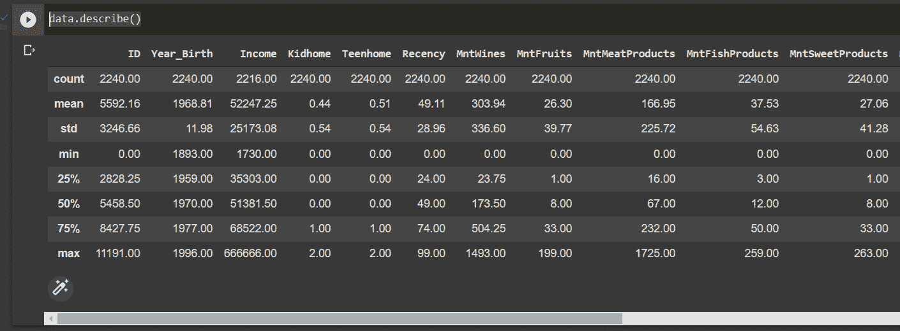

图 8.2：描述性统计摘要

1.  为了获取更多关于特征的信息，我们可以使用`info`方法显示`null`值的数量和数据类型：

    ```py
    data.info()
    ```

这会生成以下输出：

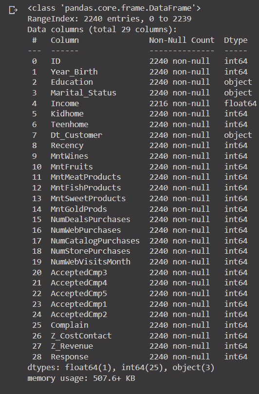

图 8.3：列数据类型和缺失值

从之前使用 Pandas DataFrame 的`describe`和`info`方法显示的输出中，我们可以看到以下内容：

+   `Income`列中有 26 个缺失值

+   名为`Dt_Customer`的日期变量，表示客户加入数据库的日期，并未被解析为`DateTime`

+   我们的 DataFrame 中有一些类别特征，其`dtype`为对象类型，我们稍后需要将它们编码为数值特征，以便能够应用聚类方法。

1.  为了处理缺失值，我们将删除缺失收入值的行，因为收入是描述客户的重要变量：

    ```py
    data = data.dropna()
    ```

    ```py
    print("Data Shape", data.shape)
    ```

1.  我们将使用`pd.to_datetime` Pandas 方法解析日期列。需要注意的是，该方法会自动推断日期格式，但如果需要，我们也可以指定格式：

    ```py
    data["Dt_Customer"] = pd.to_datetime(data["Dt_Customer"])
    ```

1.  在解析日期之后，我们可以查看最新和最早注册客户的值：

    ```py
    str(data["Dt_Customer"].min()),str(data["Dt_Customer"].max())
    ```

    ```py
    >>>> ('2012-01-08 00:00:00', '2014-12-06 00:00:00')
    ```

1.  在下一步中，我们将创建一个基于`Dt_Customer`的特征，表示客户注册公司数据库的天数，相对于数据库中第一个注册的用户，尽管我们也可以使用今天的日期。我们这样做是因为我们分析的是历史记录，而不是最新数据。`Customer_For`特征是客户注册日期减去日期列中的最小值，可以解释为客户开始在商店购物以来的天数，相对于最后记录的日期：

    ```py
    data["Customer_For"] = data["Dt_Customer"]-data["Dt_Customer"].min()
    ```

    ```py
    data["Customer_For"] = data["Customer_For"].dt.days
    ```

1.  现在，我们将探索类别特征中的唯一值，以更清楚地了解数据：

    ```py
    data["Marital_Status"].value_counts().plot.bar(figsize=(12,6),title = 'Categories in the feature Marital_Status:')
    ```

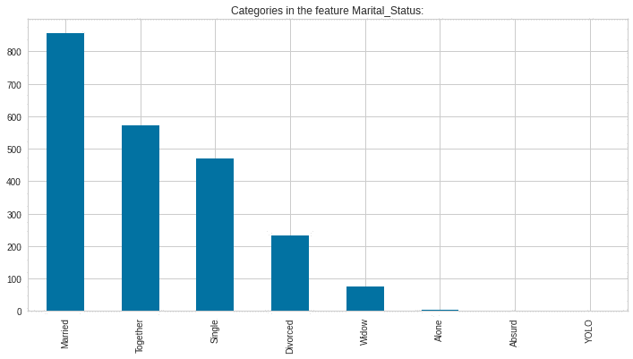

图 8.4：婚姻状况

在这里，我们可以看到有几种婚姻状况，这可能是由于数据采集时自由文本输入造成的。我们将需要标准化这些值。

1.  接下来，我们将使用`value_counts`方法查看`Education`特征中的值，并使用 Pandas 的`plot`方法绘制条形图：

    ```py
    data["Education"].value_counts().plot.bar(figsize=(12,6),title = 'Categories in the feature Education:')
    ```

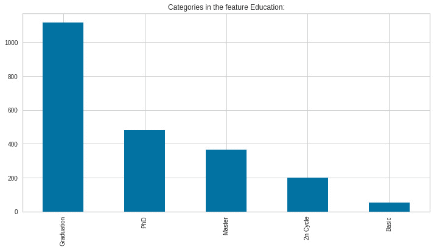

图 8.5：教育水平值

再次，我们可以看到自由文本输入的影响，因为有几个值具有相同的基本含义；因此，我们也需要对它们进行标准化处理。

在接下来的部分，我们将应用特征工程来结构化数据，以便更好地理解和处理数据。

# 特征工程

为了能够正确分析数据以及建模集群，我们需要清理和结构化数据——这个步骤通常被称为特征工程——因为我们需要根据分析计划重新结构化一些变量。

在这一部分，我们将执行下一步操作，清理和结构化一些数据集特征，目标是简化现有变量，并创建更易于理解的特征，以正确描述数据：

1.  使用`Year_Birth`特征创建一个`Age`变量，表示每位客户的出生年份。

1.  创建一个`Living_With`特征，以简化婚姻状况，描述夫妻的居住情况。

1.  创建一个`Children`特征，表示家庭中孩子的总数——即儿童和青少年。

1.  按照产品类型汇总支出，以更好地捕捉消费者行为。

1.  使用一个名为`Is_Parent`的特征表示父母身份。

所以，让我们应用这里提到的步骤来结构化数据：

1.  首先，让我们从客户当前的年龄开始，使用`pd.to_datetime`方法获取当前年份和客户的出生年份：

    ```py
    data["Age"] = pd.to_datetime('today').year - 
    ```

    ```py
          data["Year_Birth"]
    ```

1.  现在，我们将使用`sum`方法对选定列进行求和，并沿列轴汇总支出数据：

    ```py
    prod_cols = ["MntWines","MntFruits","MntMeatProducts",
    ```

    ```py
    "MntFishProducts","MntSweetProducts","MntGoldProds"]
    ```

    ```py
    data["Spent"] = data[prod_cols].sum(axis=1)
    ```

1.  作为下一步，我们将婚姻状况的值映射到不同的编码中，以简化含义相近的术语。为此，我们定义一个映射字典，并用它来替换`marital_status`列中的值，创建一个新特征：

    ```py
    marital_status_dict= {"Married":"Partner",
    ```

    ```py
                          "Together":"Partner",
    ```

    ```py
                          "Absurd":"Alone",
    ```

    ```py
                          "Widow":"Alone",
    ```

    ```py
                          "YOLO":"Alone",
    ```

    ```py
                          "Divorced":"Alone",
    ```

    ```py
                          "Single":"Alone",}
    ```

    ```py
    data["Living_With"] = data["Marital_Status"].replace(marital_status_dict)
    ```

1.  接下来，我们通过将家庭中孩子和青少年的总数相加，创建一个`Children`特征：

    ```py
    data["Children"]=data["Kidhome"]+data["Teenhome"]
    ```

1.  现在，我们使用关系和儿童数据建模家庭成员总数：

    ```py
    data["Family_Size"] = data["Living_With"].replace({"Alone": 1, "Partner":2})+ data["Children"]
    ```

1.  最后，我们在一个新变量中捕捉父母身份：

    ```py
    data["Is_Parent"] = (data.Children> 0).astype(int)
    ```

1.  现在，我们将教育水平分为三个组以便简化：

    ```py
    edu_dict = {"Basic":"Undergraduate","2n Cycle":"Undergraduate", "Graduation":"Graduate", "Master":"Postgraduate", "PhD":"Postgraduate"}
    ```

    ```py
    data["Ed_level"]=data["Education"].replace(edu_dict)
    ```

1.  现在，为了简化，我们使用映射字典将列重命名为更易于理解的术语：

    ```py
    col_rename_dict = {"MntWines": "Wines",
    ```

    ```py
                       "MntFruits":"Fruits",
    ```

    ```py
                       "MntMeatProducts":"Meat",
    ```

    ```py
                       "MntFishProducts":"Fish",
    ```

    ```py
                       "MntSweetProducts":"Sweets",
    ```

    ```py
                       "MntGoldProds":"Gold"}
    ```

    ```py
    data = data.rename(columns=col_rename_dict)
    ```

1.  现在，我们将删除一些冗余特征，专注于最清晰的特征，包括我们刚刚创建的特征。最后，我们将使用`describe`方法查看统计描述分析：

    ```py
    to_drop = ["Marital_Status", "Dt_Customer", 
    ```

    ```py
          "Z_CostContact", "Z_Revenue", "Year_Birth", "ID"]
    ```

    ```py
    data = data.drop(to_drop, axis=1)
    ```

    ```py
    data.describe()
    ```

1.  统计数据显示，`Income`和`Age`特征中存在一些不一致的情况，我们将通过可视化来更好地理解这些不一致之处。我们从`Age`的直方图开始：

    ```py
    data["Age"].plot.hist(figsize=(12,6))
    ```

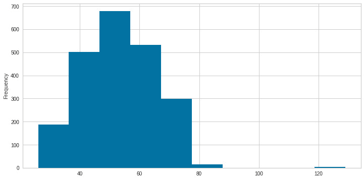

Figure 8.6: Age data

我们可以看到有一些异常值，年龄超过 120 岁，因此我们将移除这些异常值。

1.  接下来，我们来看一下收入分布：

    ```py
    data["Income"].plot.hist(figsize=(12,6))
    ```

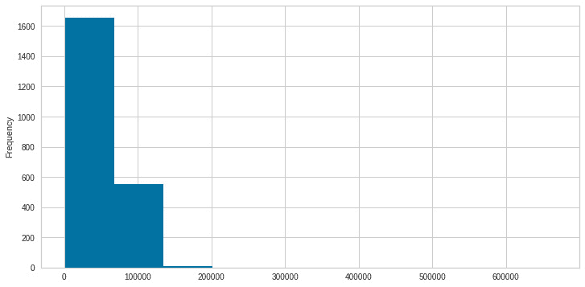

图 8.7：收入数据

同样，我们可以看到大多数收入低于 20,000，因此我们将限制消费水平。

1.  接下来，我们通过设置`年龄`的上限来剔除异常值，以避免数据不真实，并将收入限定为包含 99%的案例：

    ```py
    prev_len = len(data)
    ```

    ```py
    data = data[(data["Age"]<99)]
    ```

    ```py
    data = data[(data["Income"]<150000)]
    ```

    ```py
    new_len = prev_len - len(data)
    ```

    ```py
    print('Removed outliers:',new_len)
    ```

上述代码将输出以下内容：

```py
>>> Removed outliers: 11
```

1.  现在，我们可以回过头来查看`年龄`和`消费`数据分布，以更好地了解我们的客户。我们首先通过创建`年龄`特征的直方图来开始：

    ```py
    data["Age"].plot.hist(figsize=(12,6))
    ```

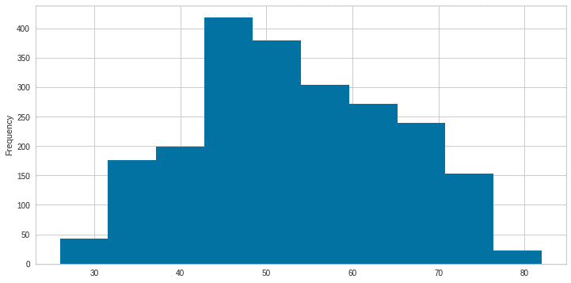

图 8.8：无异常值的年龄分布

年龄集中在 50 岁左右，右偏，意味着我们的客户的平均年龄超过 45 岁。

```py
data["Income"].plot.hist(figsize=(12,6))
```

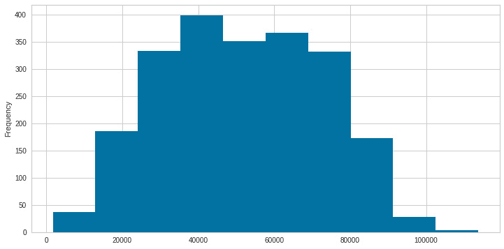

图 8.9：无异常值的收入分布

查看消费分布，它呈正态分布，集中在 4,000 左右，略微向左偏斜。

1.  接下来，我们将创建一个 Seaborn 成对图，以根据父母身份的颜色标签显示不同变量之间的关系：

    ```py
    sns.pairplot(data[["Income", "Recency", "Customer_For", "Age", "Spent", "Is_Parent"]], hue= "Is_Parent",palette= (["red","blue"]))
    ```


图 8.10：关系图

这些图形使我们能够快速观察不同变量之间的关系以及它们的分布。最明显的关系之一是消费与收入之间的关系，我们可以看到收入越高，支出越高，同时还观察到单亲家庭的支出大于非单亲家庭。我们还可以看到，最近一次消费行为较频繁的是父母，而单身消费者的消费频率较低。接下来，让我们来看一下特征之间的相关性（此时排除类别属性）。

1.  我们将使用`corr`方法创建相关矩阵，并通过`numpy`掩码仅显示数据的下三角部分。最后，我们将使用 Seaborn 方法来显示这些值：

    ```py
    df_corr = data.corr()
    ```

    ```py
    mask = np.triu(np.ones_like(df_corr, dtype=bool))
    ```

    ```py
    df_corr = df_corr.mask(mask).round(3)
    ```

    ```py
    fig, ax = plt.subplots(figsize=(16,16))
    ```

    ```py
    cmap = colors.ListedColormap(["#682F2F", "#9E726F", "#D6B2B1", "#B9C0C9", "#9F8A78", "#F3AB60"])
    ```

    ```py
    sns.heatmap(df_corr, cmap=cmap,annot=True,ax=ax)
    ```

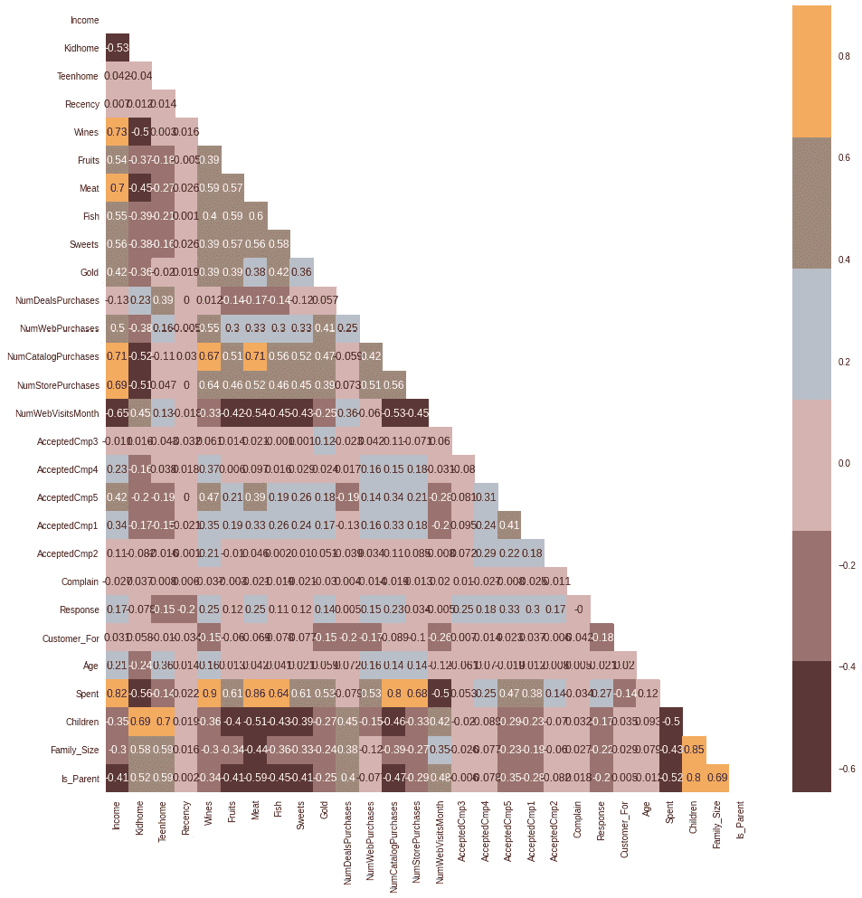

图 8.11：变量相关性

这些相关性使我们能够更详细地探索变量之间的关系。我们可以看到，在平均值上，子女数量与消费支出呈负相关，而子女数量与最近消费行为呈正相关。这些相关性有助于我们更好地理解消费模式。

在接下来的章节中，我们将使用聚类概念将客户分成具有共同特征的群体。

# 创建客户细分

市场营销人员可以通过细分目标受众，更好地针对不同的受众子群体进行营销。产品开发和传播可能是这些努力的一部分。细分为企业带来如下好处：

+   为每个客户或用户群体在合适的沟通渠道上创建有针对性的营销传播

+   对正确的客户应用正确的定价选项

+   集中精力在最有利可图的客户身上

+   提供更好的客户服务

+   推广和交叉推广其他商品和服务

在本节中，我们将对数据进行预处理，以便应用聚类方法进行客户细分。我们将在这里列出用于预处理数据的步骤：

+   使用标签编码器对分类变量进行编码，将它们转换为数值列

+   使用标准缩放器对特征进行缩放，以规范化值

+   应用**主成分分析**（**PCA**）进行降维

所以，让我们按照这里的步骤进行操作：

1.  首先，我们需要列出分类变量。在这里，我们将使用列名并检查列的`dtype`，以仅获取对象列：

    ```py
    object_cols = [c for c in data.columns if data[c].dtypes == 'object']
    ```

    ```py
    print("Categorical variables in the dataset:", object_cols)
    ```

1.  接下来，我们将使用`sklearn`的`LabelEncoder`函数对`dtypes`对象进行编码：

    ```py
    LE = LabelEncoder()
    ```

    ```py
    for i in object_cols:
    ```

    ```py
        data[i]=data[[i]].apply(LE.fit_transform)
    ```

1.  我们对数据进行子集选择，并通过删除“已接受交易”和“促销”特征，对数值变量进行缩放：

    ```py
    scaled_ds = data.copy()
    ```

    ```py
    cols_del = ['AcceptedCmp3', 'AcceptedCmp4', 'AcceptedCmp5', 'AcceptedCmp1','AcceptedCmp2', 'Complain', 'Response']
    ```

    ```py
    scaled_ds = scaled_ds.drop(cols_del, axis=1)
    ```

1.  最后，我们可以应用缩放：

    ```py
    scaler = StandardScaler()
    ```

    ```py
    scaler.fit(scaled_ds)
    ```

    ```py
    scaled_ds = pd.DataFrame(scaler.transform(
    ```

    ```py
          scaled_ds),columns= scaled_ds.columns )
    ```

这个数据集中有许多属性描述了数据。特征越多，在商业环境中正确分析它们就越困难。这些特征中的许多是冗余的，因为它们是相互关联的。因此，在将特征输入分类器之前，我们将对选定的特征进行降维处理。

降维是减少考虑的随机变量数量的过程。为了降低大型数据集的维度，通常使用一种名为 PCA 的技术。PCA 通过将大量变量压缩成一个较小的集合，同时保留较大集合中的大部分数据来工作。

随着数据集变量的减少，准确性自然会下降，但降维的答案是牺牲一些准确性换取简单性，因为机器学习算法可以通过更小的数据集更快速、更容易地分析数据，因为需要处理的无关因素更少。总之，PCA 的基本原则是尽可能保留信息，同时减少所收集数据中的变量数量。

本节中我们将应用的步骤如下：

+   使用 PCA 进行降维

+   在三维图中绘制降维后的 DataFrame

+   使用 PCA 进行降维，再一次

这将使我们能够以三维的方式可视化投影的细分。在理想的设置中，我们将使用每个成分的权重来理解每个成分所代表的意义，并更好地理解我们正在可视化的信息。为了简化起见，我们将专注于成分的可视化。以下是步骤：

1.  首先，我们将启动 PCA，将维度或特征减少到三个，以简化复杂性：

    ```py
    pca = PCA(n_components=3)
    ```

    ```py
    PCA_ds = pca.fit_transform(scaled_ds)
    ```

    ```py
    PCA_ds = pd.DataFrame(PCA_ds, columns=([
    ```

    ```py
          "component_one","component_two", "component_three"]))
    ```

1.  数据集中每个主成分（特征向量）所解释的变异度被统计为“解释的方差”。这只是指数据集中每个唯一主成分可以解释的数据变异度。

    ```py
    print(pca.explained_variance_ratio_)
    ```

    ```py
    >>>>[0.35092717 0.12336458 0.06470715]
    ```

对于这个项目，我们将把维度减少到三维，这能够解释观察变量的 54%的总方差：

```py
print('Total explained variance',sum(pca.explained_variance_ratio_))
>>>> Total explained variance 0.5389989029179605
```

1.  现在我们可以将数据投影到 3D 图中，以查看点的分布：

    ```py
    x,y,z=PCA_ds["component_one"],PCA_ds[
    ```

    ```py
          "component_two"],PCA_ds["component_three"]
    ```

    ```py
    fig = plt.figure(figsize=(10,8))
    ```

    ```py
    ax = fig.add_subplot(111, projection="3d")
    ```

    ```py
    ax.scatter(x,y,z, c="maroon", marker="o" )
    ```

    ```py
    ax.set_title("A 3D Projection Of Data In The Reduced Dimension")
    ```

    ```py
    plt.show()
    ```

上述代码将展示我们在三维中投影的维度：

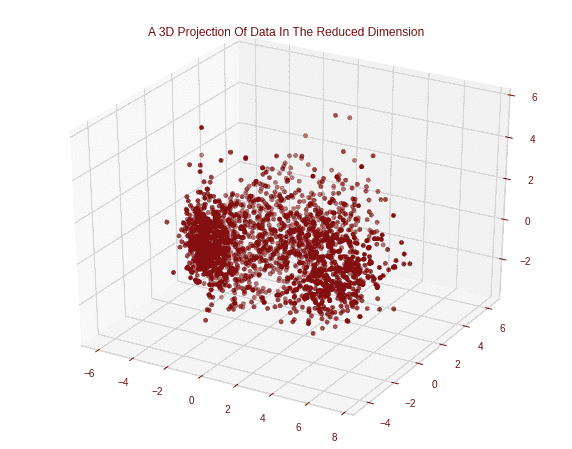

图 8.12：PCA 变量的三维表现

由于现在的属性仅有三维，聚合聚类将用于执行聚类。凝聚聚类是一种层次聚类技术。在达到适当数量的簇之前，样本将会被合并。

聚类的过程涉及将数据点分组，使得每个组内的数据点比其他组中的数据点更相似。简而言之，目标是将具有相似特征的任何组分成簇。聚类的目标是在数据集中找到独特的组，或称为“簇”。该工具使用机器学习算法来构建组，组内的成员通常会共享相似的特征。

机器学习中使用的两种模式识别方法是分类和聚类。虽然这两个过程之间有一些相似之处，但聚类发现事物之间的相似性，并根据那些将它们与其他对象组区分开来的特征将其分组，而分类则使用预定的类别将对象分配到这些类别中。“簇”是这些集合的名称。

聚类涉及的步骤如下：

+   肘部法用于确定要形成的簇的数量

+   通过凝聚聚类进行聚类

+   通过散点图检查形成的簇

在 K 均值聚类中，理想的簇数是通过肘部法来确定的。通过肘部法绘制不同成本函数值下形成的簇的数量或 K：

1.  肘部法是一种启发式方法，用于聚类分析，以估计数据集中存在的簇的数量。将解释的变异度作为簇的数量的函数进行绘图，该过程包括选择曲线的肘部作为适当的簇数，如以下代码片段所示：

    ```py
    fig = plt.figure(figsize=(12,8))
    ```

    ```py
    elbow = KElbowVisualizer(KMeans(), k=(2,12), metric='distortion') # distortion: mean sum of squared distances to centers
    ```

    ```py
    elbow.fit(PCA_ds)
    ```

    ```py
    elbow.show()
    ```

这段代码将绘制肘部图，这是对所需簇数的一个良好估算：


图 8.13：肘部法

1.  根据前面的单元，四个簇将是这个数据集的最佳选择。为了获得最终的簇，我们将拟合凝聚聚类模型，如下所示：

    ```py
    AC = AgglomerativeClustering(n_clusters=4)
    ```

    ```py
    # fit model and predict clusters
    ```

    ```py
    yhat_AC = AC.fit_predict(PCA_ds)
    ```

    ```py
    PCA_ds["Clusters"] = yhat_AC
    ```

1.  最后，我们将向原始 DataFrame 中添加一个 `Clusters` 特征，以便进行可视化：

    ```py
    data["Clusters"]= yhat_AC
    ```

1.  现在，我们可以使用每个集群的颜色代码，在三维空间中可视化集群：

    ```py
    classes = [0,1,2,3]
    ```

    ```py
    values = PCA_ds["Clusters"]
    ```

    ```py
    colors = ListedColormap(['red','blue','green','orange'])
    ```

    ```py
    fig = plt.figure(figsize=(10,8))
    ```

    ```py
    ax = plt.subplot(projection='3d')
    ```

    ```py
    scatter = ax.scatter(x, y,z, c=values, cmap=colors)
    ```

    ```py
    plt.legend(handles=scatter.legend_elements()[0], labels=classes)
    ```

上述代码将显示一个三维可视化的 PCA 组件，颜色根据集群进行区分：

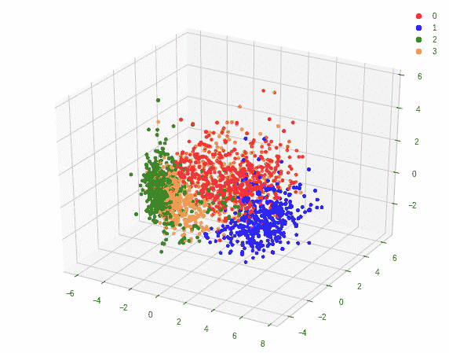

图 8.14：PCA 变量与集群标注

从中我们可以看到，每个集群在可视化中占据了一个特定的空间。现在我们将深入描述每个集群，以便更好地理解这些群体。

# 将集群理解为客户群体

为了严格评估获得的输出结果，我们需要评估所描述的集群。这是因为集群分析是一种无监督的方法，提取的模式应该始终反映现实，否则，我们可能只是在分析噪声。

消费者群体之间的共同特征可以帮助企业选择哪些商品或服务应该向哪些群体广告宣传，以及如何向每个群体进行市场营销。

为了做到这一点，我们将使用**探索性数据分析**（**EDA**）在集群的上下文中查看数据并做出判断。以下是步骤：

1.  让我们首先检查集群组分布：

    ```py
    cluster_count = PCA_ds["Clusters"].value_counts().reset_index()
    ```

    ```py
    cluster_count.columns  = ['cluster','count']
    ```

    ```py
    f, ax = plt.subplots(figsize=(10, 6))
    ```

    ```py
    fig = sns.barplot(x="cluster", y="count", palette=['red','blue','green','orange'],data=cluster_count)
    ```

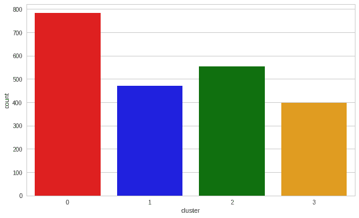

图 8.15：集群数量

各集群分布相对均衡，集群 0 占主导地位。可以清晰地看到，集群 1 是我们最大的客户群体，其次是集群 0。

1.  我们可以使用以下代码来探索每个集群在目标营销策略上的消费：

    ```py
    f, ax = plt.subplots(figsize=(12, 8))
    ```

    ```py
    pl = sns.scatterplot(data = data,x=data["Spent"], y=data["Income"],hue=data["Clusters"], palette= colors)
    ```

    ```py
    pl.set_title("Cluster vs Income And Spending")
    ```

    ```py
    plt.legend()
    ```

    ```py
    plt.show()
    ```

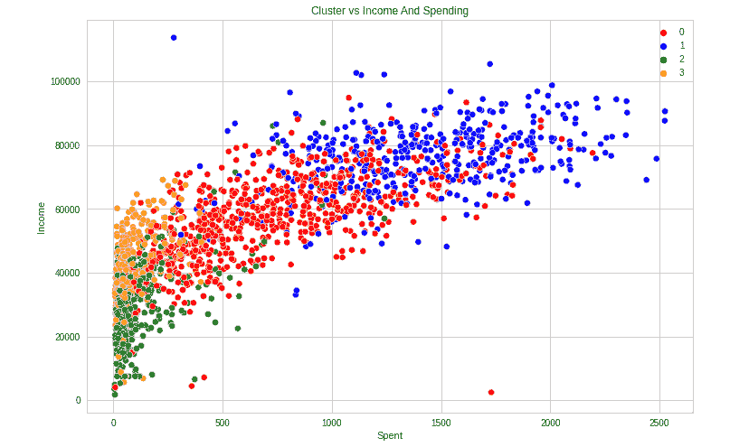

图 8.16：收入与消费关系

在收入与消费关系图中，我们可以看到下一个集群的模式：

+   集群 0 是高消费和中等收入的群体

+   集群 1 是高消费和高收入的群体

+   集群 2 是低消费和低收入的群体

+   集群 3 是高消费和低收入的群体

1.  接下来，我们将查看数据中每个产品的消费集群的详细分布。即，我们将探索消费模式。以下是代码：

    ```py
    f, ax = plt.subplots(figsize=(12,6))
    ```

    ```py
    sample = data.sample(750)
    ```

    ```py
    pl = sns.swarmplot(x=sample["Clusters"], y=sample["Spent"], color= "red", alpha=0.8 ,size=3)
    ```

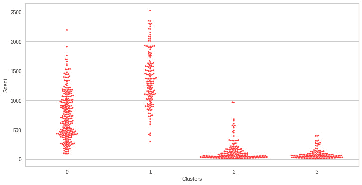

图 8.17：每个集群的消费分布

从*图 8.17*中可以看到，集群 0 的消费分布较为均匀，集群 1 的消费集中在高消费上，而集群 2 和 3 则集中在低消费上。

1.  接下来，我们将使用 Seaborn 创建集群的 Boxen 图，以找出每个集群的消费分布：

    ```py
    f, ax = plt.subplots(figsize=(12, 6))
    ```

    ```py
    pl = sns.boxenplot(x=data["Clusters"], y=data["Spent"], palette=['red','blue','green','orange'])
    ```

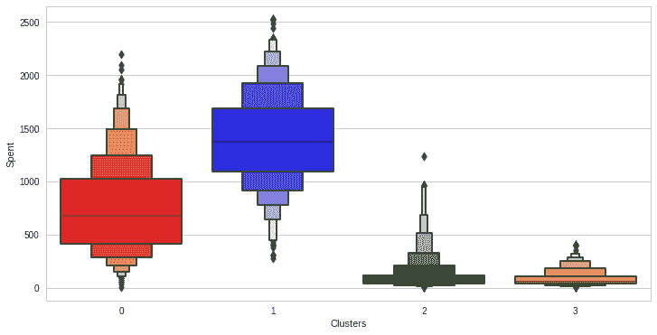

图 8.18：每个集群的消费分布（Boxen 图）

我们可以使用不同的方式来可视化这些模式，使用 Boxen 图。

1.  接下来，我们将创建一个特征来获取接受的促销活动总和，以便我们能够建模它们与不同集群之间的关系：

    ```py
    data["TotalProm"] = data["AcceptedCmp1"]+ data["AcceptedCmp2"]+ data["AcceptedCmp3"]+ data["AcceptedCmp4"]+ data["AcceptedCmp5"]
    ```

1.  现在，我们将绘制接受的总营销活动数量与集群之间的关系图：

    ```py
    f, ax = plt.subplots(figsize=(10, 6))
    ```

    ```py
    pl = sns.countplot(x=data["TotalProm "],hue=data["Clusters"], palette= ['red','blue','green','orange'])
    ```

    ```py
    pl.set_title("Total Promotions vs Cluster")
    ```

    ```py
    pl.set_xlabel("Cluster")
    ```

    ```py
    pl.set_ylabel("Count")
    ```


图 8.19：每个群体应用的促销活动

我们可以看到，尽管每个群体的促销活动没有显著的特征模式，但我们可以看到群体 0 和群体 2 是应用促销活动数量最多的两个群体。

1.  现在，我们可以将每种群体类型的购买交易数量可视化：

    ```py
    f, ax = plt.subplots(figsize=(12, 6))
    ```

    ```py
    pl = sns.boxenplot(y=data["NumDealsPurchases"],x=data["Clusters"], palette= ['red','blue','green','orange'])
    ```

    ```py
    pl.set_title("Purchased Deals")
    ```

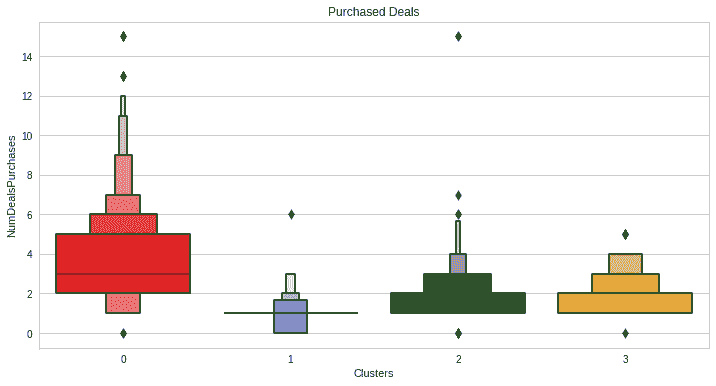

图 8.20：每个群体购买的交易数量

促销活动未能广泛传播，但交易却非常成功。群体 0 和群体 2 的结果是最好的。群体 1 是我们的顶级客户之一，但他们对促销活动不感兴趣。没有什么能强烈吸引群体 1。

现在，群体已经创建并且其购买模式已经被分析，我们来看看这些群体中的每个成员。为了确定谁是我们的明星客户，谁需要零售店的营销团队进一步关注，我们将对已开发的群体进行分析。

考虑到群体特征，我们将绘制一些代表客户个人特征的元素。我们将根据结果得出结论。

1.  我们将使用 Seaborn 联合图来可视化不同变量之间的关系和分布：

    ```py
    sns.jointplot(x=data['Education'], y=data["Spent"], hue =data["Clusters"], kind="kde", palette=['red','blue','green','orange'],height=10)
    ```

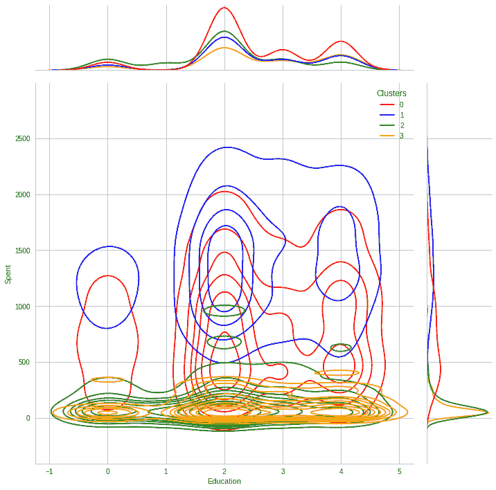

图 8.21：每个群体的消费与教育水平分布

群体 0 主要集中在中等教育水平，但在高学历方面也有一个峰值。群体 2 在教育方面是最低的。

1.  接下来，我们将看看家庭规模：

    ```py
    sns.jointplot(x=data['Family_Size'], y=data["Spent"], hue =data["Clusters"], kind="kde", palette=['red','blue','green','orange'],height=10)
    ```

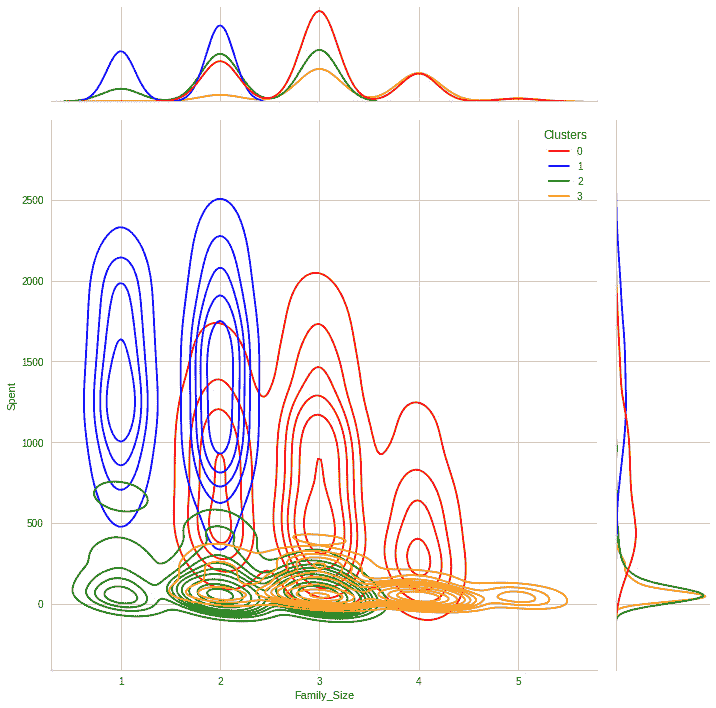

图 8.22：每个群体的消费与家庭规模分布

群体 1 代表小家庭规模，群体 0 代表夫妻和家庭。群体 2 和群体 3 的分布较为均匀。

1.  现在我们来看看消费与客户群体的关系：

    ```py
    sns.jointplot(x=data['Customer_For'], y=data["Spent"], hue =data["Clusters"], kind="kde", palette=['red','blue','green','orange'],height=10)
    ```

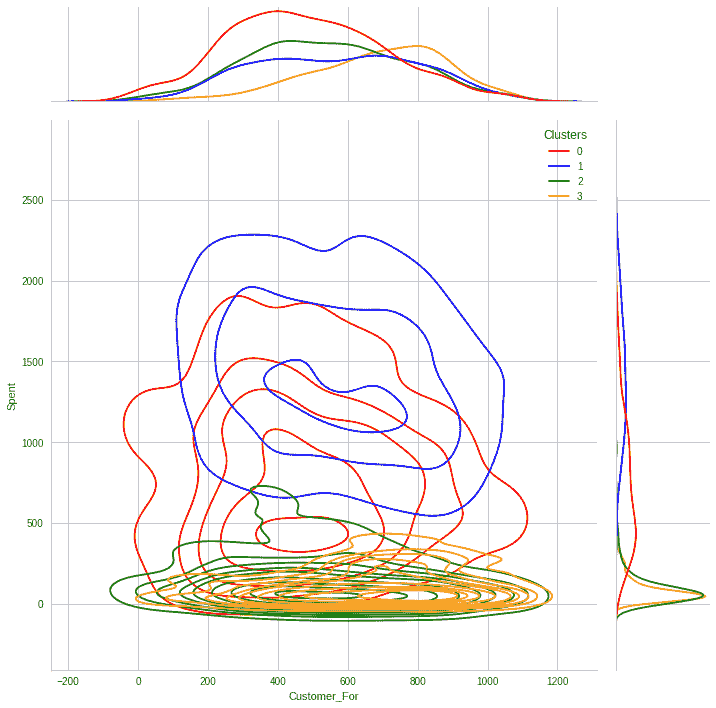

图 8.23：每个群体的消费与客户分布

群体 3 是由年长客户组成的群体。尽管群体 0 的消费最高，但值得注意的是，它在“自客户成为用户以来的天数”这一维度上有一个向左偏移的趋势。

```py
sns.jointplot(x=data['Age'], y=data["Spent"], hue =data["Clusters"], kind="kde", palette=['red','blue','green','orange'],height=10)
```


图 8.24：每个群体的消费与年龄分布

群体 0 是拥有较年长客户的群体，而拥有最年轻客户的是群体 2。

# 总结

本章我们进行了无监督聚类。经过降维后，使用了凝聚层次聚类方法。为了更好地基于客户的家庭结构、收入和消费习惯对群体进行分析，我们将用户分为四个群体。这一方法可用于制定更有效的营销计划。

在接下来的章节中，我们将深入研究使用时间序列数据预测销售，以便能够根据一组历史销售确定收入预期，并理解它们与其他变量的关系。
