# 9

# 使用历史降价数据预测销售

许多零售商别无选择，只能跟随行业趋势，增加折扣和特别促销活动，以维持在当今过度饱和市场中的竞争优势。这是因为大多数新客户更加敏感价格，会在多个网站上比价，寻找特定商品的最佳优惠。

然而，折扣也有其弊端。虽然促销活动能加速销售，但企业在没有进行充分研究的情况下提供折扣，也面临着进一步利润损失的风险。零售数据建模的一大挑战是需要根据有限的历史数据做出决策。如果圣诞节一年只有一次，那么看到战略决策对底线的影响的机会也只有一次。

本章我们将深入研究行业领先者最新的降价和折扣营销策略，并展示如何在保持利润率的同时实施这些策略。我们将使用来自 45 家超市的历史销售信息，这些超市分布在多个区域。虽然普遍认为这些降价对销售有影响，但很难预见到哪些部门会受到影响，以及影响的程度。因此，我们的目标是预测每个商店中各个部门的销售情况，这些商店有多个部门。选定的假期降价事件也被纳入数据集，以增加难度。

本章中，我们将学习以下内容：

+   考虑所有影响销售的因素，确定销售表现

+   探索销售数据，确定影响销售的因素

+   研究促销降价在假期期间对销售的影响

+   在特定降价应用下预测销售

我们将使用反映实际真实数据的数据，尽量接近现实情况。

# 技术要求

为了能够跟随本章中的步骤，你需要满足以下要求：

+   一个运行 Python 3.7 及以上版本的 Jupyter notebook 实例。如果你有 Google Drive 账户，你也可以使用 Google Colab notebook 来运行这些步骤。

+   理解基本的数学和统计概念

# 创建有效的降价策略

降价是指产品因未能以原定售价售出而进行的降价处理。一个折扣的例子是，如果你有一件商品，经过一个月的销售低迷后，你决定降价 20%。即使你只是失去了收入，这也会吸引更多人以更低的价格购买它。由于该商品原本销售不佳，提供一个合适的折扣价格通常会导致原本不会发生的销售。然而，你会发现，通常需要根据销售低迷来调整你的降价策略，可能会将折扣从 20% 调整到 30%、40% 等等。时机尤其重要，因为你希望在商品仍然符合季节、趋势等背景时卖出它。

Markdown 与折扣需要区分。在零售中，折扣是根据购买者的客户类型对商品或交易价格的降低。例如员工折扣、老年人折扣和常客折扣就是几种例子。由于获得折扣，许多零售商认为这使得顾客更有可能回到他们的商店，而不是去竞争对手的店。

在本章中，我们将使用位于美国不同地点的商店的历史销售数据。每个商店有多个部门，我们将预测整个部门的销售情况。此外，公司全年举办多次促销 markdown 销售活动，其中超级碗、劳动节、感恩节和圣诞节是四个最大节假日。

此外，沃尔玛全年会举行几次促销性 markdown 活动。这些 markdown 活动通常会在重要节假日前进行，其中四个最大的节假日分别是超级碗、劳动节、感恩节和圣诞节。包括这些假期的周数在评估中比非假期周数的权重高五倍。此竞赛面临的挑战之一是，在没有完整/理想的历史数据的情况下，如何建模假期周数中 markdown 对销售的影响。

在接下来的部分，我们将分析数据以理解变量及其分布，并将其结构化以便于可视化和用于机器学习。

# 数据分析

我们提供了 3 个文件，分别包含关于 45 家商店的匿名信息，指出商店的类型和规模、涵盖 2010-02-05 至 2012-11-01 的历史训练数据，以及一个包含与给定日期的商店、部门和区域活动相关的附加数据的文件。

在下一个示例中，使用了以下 Python 模块：

+   pandas：一个用于数据分析和数据处理的 Python 包

+   NumPy：这是一个库，支持大规模的多维数组和矩阵，并提供丰富的高阶数学函数用于对这些数组进行操作。

+   Seaborn 和 Matplotlib：用于有效数据可视化的 Python 包

1.  我们将通过导入库开始分析，并通过读取所有文件并使用`read_csv` pandas 函数的 `parse_date` 选项解析 `Date` 列来开始分析数据：

    ```py
    import pandas as pd # data processing
    ```

    ```py
    import matplotlib.pyplot as plt # visualization
    ```

    ```py
    import seaborn as sns # visualization
    ```

    ```py
    train=pd.read_csv("/content/train.csv", 
    ```

    ```py
          parse_dates=["Date"])
    ```

    ```py
    features=pd.read_csv("/content/features.csv", 
    ```

    ```py
          parse_dates=["Date"])
    ```

    ```py
    stores=pd.read_csv("/content/stores.csv")
    ```

1.  现在所有文件已加载完毕，我们可以通过查看训练文件的前几行开始：

    ```py
    train.head()
    ```

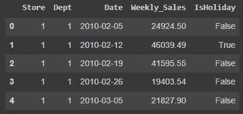

图 9.1：商店、日期和部门的每周销售训练文件

该文件包含每个商店和部门的每周销售数据，并标明该日是否为假期。

我们还将引入一些日期变量，以便使分析更为简便：

```py
train['Year']=train['Date'].dt.year
train['Month']=train['Date'].dt.month
train['Week']=train['Date'].dt.week
train['Day']=train['Date'].dt.day
```

1.  我们将要查看的下一个文件包含关于每家商店类型和规模的信息。我们可以稍后使用这些信息来评估降价的效果是否会根据商店特征的不同而有所变化：

    ```py
    stores.head()
    ```

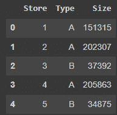

图 9.2：商店类型和规模数据

1.  我们可以通过使用 Seaborn 的箱形图，开始可视化销售类型和规模的分布。在接下来的代码块中，我们将创建一个数据子集，将商店数据的**类型**和**规模**列进行拼接。然后，我们使用 Matplotlib 创建一个 8x6 英寸的图形，图形中将包含 Seaborn 图：

    ```py
    data = pd.concat([stores['Type'], stores['Size']], axis=1)
    ```

    ```py
    f, ax = plt.subplots(figsize=(8, 6))
    ```

    ```py
    fig = sns.boxplot(x='Type', y='Size', data=data)
    ```

代码将展示商店规模的分布情况。

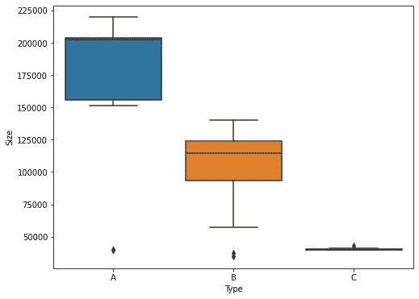

图 9.3：商店类型和规模数据

在规模方面，我们可以看到有三种类型的商店，其中 A 类型是最大的。看到分位数之间的变化以及异常值是很有趣的。

1.  最后，接下来的文件包含更多关于每一天和商店的上下文数据。这些信息包括温度、燃料价格、应用的不同降价类型，分为五种类型，还有消费者物价指数、失业率，以及关于该天是否是节假日的信息：

    ```py
    features.head()
    ```


图 9.4：按商店分类的上下文数据

我们将在 `train` 的 pandas DataFrame 中使用 `merge` 方法，来附加关于日期、商店规模和类型的信息，这些数据来源于商店的 DataFrame：

```py
train=train.merge(stores, on='Store', how='left')
train.head()
```

之前的代码将合并数据并显示前几行。

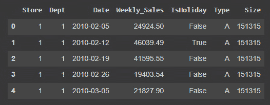

图 9.5：带有节假日、商店类型和规模信息的每周销售数据

我们现在可以通过商店类型的分布来可视化每周销售数据。我们将创建一个包含**类型**和**每周销售**列的数据子集，创建一个 8x6 英寸的 Matplotlib 图形，然后填充一个 Seaborn 箱形图：

```py
data = pd.concat([train['Type'], train['Weekly_Sales']], axis=1)
f, ax = plt.subplots(figsize=(8, 6))
fig = sns.boxplot(x='Type', y='Weekly_Sales', data=data, showfliers=False)
```

这将根据商店类型生成箱形图的可视化。

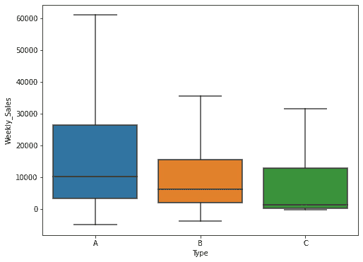

图 9.6：按类型的每周销售数据箱形图

关于商店的类型，我们可以看到，尽管 A 类型是最小的，但它的销售中位数却是最高的。

1.  我们现在将创建一个按商店 ID 分布的销售数据箱形图。我们从训练数据中提取**商店**和**每周销售**列，创建一个 25x8 英寸的 Matplotlib 图形，然后显示一个 Seaborn 箱形图，x 轴为商店 ID，按类型进行颜色区分：

    ```py
    data = pd.concat([train['Store'], train['Weekly_Sales'], train['Type']], axis=1)
    ```

    ```py
    f, ax = plt.subplots(figsize=(25, 8))
    ```

    ```py
    fig = sns.boxplot(x='Store', y='Weekly_Sales', data=data, showfliers=False, hue="Type")
    ```

该代码将生成每周按商店分布的箱形图。


图 9.7：按商店 ID 和类型的每周销售数据

从箱线图中，我们可以看出，门店可能是提供销售信息的变量，因为在所有类型中，销售的上边界有一致的高值模式。这表明在某些时刻，需求在短时间内增加。此外，数据中没有出现需求在中位数以下大幅下降的情况。

门店数据中包含了许多关于类型、规模和部门的内在信息。因此，我们将探讨节假日如何影响销售。

1.  我们重复相同的步骤：创建数据子集、绘制 Matplotlib 图形和 seaborn 箱线图，但现在的 hue 变量设置为**IsHoliday**列：

    ```py
    data = pd.concat([train['Store'], train['Weekly_Sales'], train['IsHoliday']], axis=1)
    ```

    ```py
    f, ax = plt.subplots(figsize=(25, 8))
    ```

    ```py
    fig = sns.boxplot(x='Store', y='Weekly_Sales', data=data, showfliers=False, hue="IsHoliday")
    ```

这段代码将展示更多层次的销售信息分布。


图 9.8：按门店 ID 划分的每周销售数据，包括节假日与不包括节假日

从数据中可以看出，**Holiday** 和 **Store** 之间没有显著的关系，除了在节假日当天销售略有上升。这可能意味着大部分销售是在节假日前几天完成的。

1.  现在，让我们深入探讨按部门类型划分的销售差异。为此，我们将创建一个数据子集，作为每个部门每周销售的分组，然后计算均值并重置索引。我们使用条形图展示数据，因为如果使用箱线图，难以一眼看出部门之间的差异，原因是部门数量太多：

    ```py
    data= train[['Dept','Weekly_Sales']].groupby('Dept').mean().reset_index()
    ```

    ```py
    f, ax = plt.subplots(figsize=(25, 8))
    ```

    ```py
    fig = sns.barplot(x='Dept', y='Weekly_Sales', data=data)
    ```

这项可视化将为我们提供按部门划分的销售视角。


图 9.9：按部门划分的每周中位销售额

我们可以看到不同部门的销售存在差异。某些部门的收入高度集中，这可能促使我们考虑排除那些销售较小的部门。但这可能并不合适，因为这些部门可能吸引那些只需要特定商品的顾客前来，并最终购买其他商品。你可以使用如 Apriori 算法等方法进一步研究这一点。

1.  接下来，我们将可视化按月份划分的每周销售，以窥探数据的季节性。我们创建包含相关列的数据子集，并使用箱线图可视化数据：

    ```py
    data = pd.concat([train['Month'], train['Weekly_Sales']], axis=1)
    ```

    ```py
    f, ax = plt.subplots(figsize=(8, 6))
    ```

    ```py
    fig = sns.boxplot(x='Month', y="Weekly_Sales", data=data, showfliers=False)
    ```

以下是月度销售的分布情况。

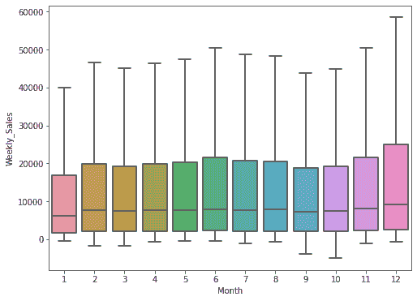

图 9.10：按月份划分的每周销售数据

我们可以通过可视化节假日在月度销售中的表现，进一步探索月度销售数据。我们通过将箱线图的 hue 值设置为`IsHoliday`来实现这一点：

```py
data = pd.concat([train['Month'], train[
      'Weekly_Sales'],train['IsHoliday']], axis=1)
f, ax = plt.subplots(figsize=(8, 6))
fig = sns.boxplot(x='Month', y="Weekly_Sales", data=data, showfliers=False, hue='IsHoliday')
```

以下图表展示了按月份和节假日划分的销售分布。

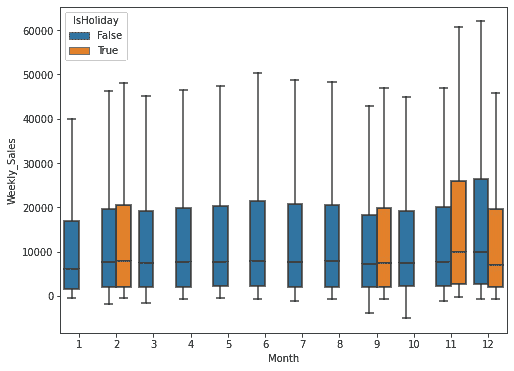

图 9.11：按月份区分节假日的每周销售数据

对于大多数节假日，假期当天的销售稍高于常规日，圣诞节除外，圣诞节是在 12 月。

现在，我们可以创建一个 seaborn 的 relplot 来按周可视化数据：

```py
data = pd.concat([train['Week'], train['Weekly_Sales'],train['Type']], axis=1)
sns.relplot(x='Week', y="Weekly_Sales", data=data, hue='Type',kind='line',height=8, aspect=2.2)
```

这个图表显示了中位数和置信区间。

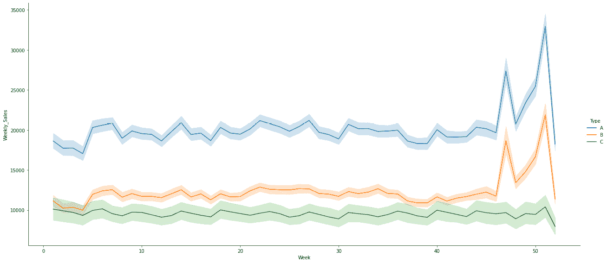

图 9.12: 随时间变化的每周销售

通过查看 relplot，我们可以看到第 40 周到第 50 周之间销售的急剧增长。

1.  我们可以使用箱线图来可视化每周销售数据，将 `Week` 放在 x 轴，将 `Weekly_Sales` 列放在 y 轴：

    ```py
    data = pd.concat([train['Week'], train['Weekly_Sales']], axis=1)
    ```

    ```py
    f, ax = plt.subplots(figsize=(20, 6))
    ```

    ```py
    fig = sns.boxplot(x='Week', y="Weekly_Sales", data=data, showfliers=False)
    ```

该图表显示了每年按周的中位数和置信区间。


图 9.13: 每年按周的销售

我们现在可以看到，年初的假期带来了小幅增长，而年末的假期则带来了最大的销售增长，包括随后的一个星期的急剧下降。

1.  我们现在可以使用 seaborn 的 relplot 绘制数据，使用日期和每周销售数据，并通过 hue 参数按商店类型进行区分：

    ```py
    data = pd.concat([train['Date'], train[
    ```

    ```py
          'Weekly_Sales'],train['Type']], axis=1)
    ```

    ```py
    sns.relplot(x='Date', y="Weekly_Sales", data=data, hue='Type',kind='line',height=8, aspect=2.2)
    ```

上述代码绘制了带有置信带的数据。


图 9.14: 随时间变化的每周销售

我们可以观察到，两个年份中的数据呈现出相同的模式，这可以通过进一步分析数据的季节性来解释。季节性是指在某些时间段内反复出现的模式。购买模式的周期在每年末重复，并在圣诞节前几周出现急剧增长。

1.  我们的下一步将是分析每周销售的均值，按周和应用的降价进行区分。为此，首先我们将每周销售按周进行分组并计算均值，然后打印形状进行合理性测试：

    ```py
    data_store = train[['Week','Weekly_Sales']].groupby(['Week']).mean().reset_index()
    ```

    ```py
    data_store.shape
    ```

    ```py
    >>>(52, 2)
    ```

然后，我们可以从特征数据框中获取有关该特定周应用的降价信息，并计算均值：

```py
data_features = features[['Week','MarkDown1','MarkDown2',
'MarkDown3','MarkDown4','MarkDown5']].groupby(['Week']).mean().reset_index()
data_features.shape
>>>(52, 6)
```

1.  现在，我们可以合并两个数据框，并获得每周的中位销售信息以及所应用的降价类型：

    ```py
    data_store = data_store.merge(data_features,on=['Week'],how='left').fillna(.0)
    ```

    ```py
    data_store.index = data_store['Week']
    ```

    ```py
    data_store = data_store.drop(['Week'],axis=1)
    ```

    ```py
    data_store.head()
    ```

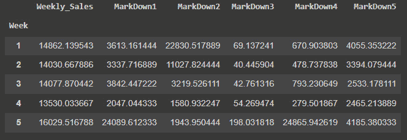

图 9.15: 每周中位数销售和每周降价

使用这些信息，我们现在可以绘制数据，查看折扣与每周销售之间的影响：

```py
data_store.plot(figsize=(20,8))
```

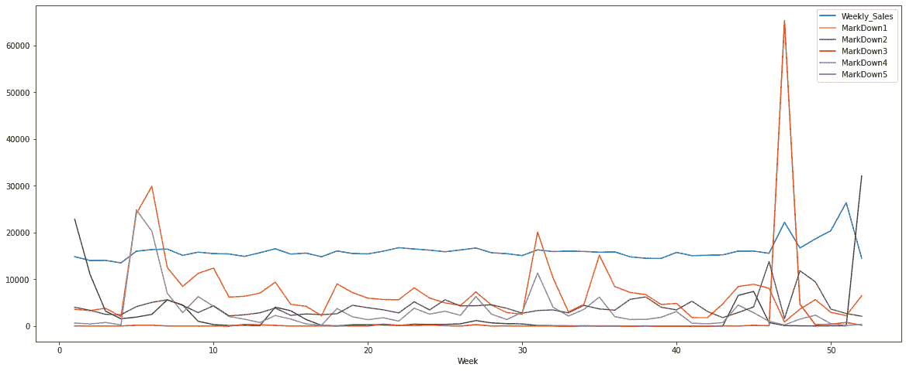

图 9.16: 每周中位数销售和每周降价

从数据中我们可以看到，许多降价是在圣诞节前立即实施的，然后在接下来的几周内继续进行。其原因可能是，这些降价是为了减少在假期期间未售出的库存。

1.  现在，我们将查看销售与描述每一天和每个商店条件的特征之间的关系。为此，我们按周对销售数据进行分组并计算均值。然后，我们对特征数据执行相同操作，最后将两个 DataFrame 合并：

    ```py
    data_features = features.drop(['Store','Date','MarkDown1',
    ```

    ```py
    'MarkDown2','MarkDown3','MarkDown4','MarkDown5'],axis=1).groupby(['Week']).mean().reset_index()
    ```

    ```py
    data_store = train[['Week','Weekly_Sales']].groupby(['Week']).mean().reset_index()
    ```

    ```py
    data_store = data_store.merge(data_features,on=['Week'],how='left').fillna(.0)
    ```

    ```py
    data_store.head()
    ```

前面的代码将展示我们合并后的数据。


图 9.17：每周中位数上下文数据

1.  我们现在可以利用这些信息构建一个 seaborn 配对图来可视化任何关系。我们排除了`Week`和`IsHoliday`变量，后者是因为类别变量难以通过这种类型的图进行可视化：

    ```py
    sns.pairplot(data_store.drop(['Week','IsHoliday'],axis=1))
    ```

代码将创建一个显示数值变量之间关系的图表。


图 9.18：特征配对图

我们可以看到，尽管我们能够更好地理解这些关系，但大部分每周销售的均值每周相似，这使得与 CPI、失业率或油价之间的有意义关系难以区分。我们应该不对数据进行分组，重新进行此操作，这样会得到更多信息，但需要更多的处理时间。

1.  为了预测销售，首先，我们需要处理数据并做出一些决策。第一个决策是我们希望在哪个时间层级进行预测。在我们的案例中，我们将使用`predict`进行每周销售的预测。我们会将所有数据合并到一个 DataFrame 中，在该 DataFrame 中，每个数据点都附加了关于商店以及那天条件的信息。

我们还将 Type 列转换为一-hot 向量表示，使用 `pd.get_dummies` 函数：

```py
data = train.drop(['Year','Month','Week'],axis=1).merge(features.drop(['IsHoliday','Week'],axis=1),on=['Store','Date'])
data = pd.concat([data.drop(['Type'],axis=1),
      pd.get_dummies(data['Type'])],axis=1).fillna(0)
data['IsHoliday'] = data['IsHoliday'].astype(int)
data.head()
```

我们可以看到 DataFrame 中创建的列。


图 9.19：没有编码变量的数据集

这种数据配置使我们能够扩展探索，分析变量之间的相关性，进而为使用数据预测销售奠定基础。

下一段代码将使用 `pandas` DataFrame 的 `corr()` 方法分析变量之间的相关性，我们将使用 `numpy` 包来屏蔽冗余的值，最后使用 seaborn 的 `heatmap` 可视化工具绘制数据：

```py
import numpy as np
df_corr = data.drop(['Date'],axis=1).corr()
mask = np.triu(np.ones_like(df_corr, dtype=bool))
df_corr = df_corr.mask(mask).round(3)
fig, ax = plt.subplots(figsize=(16,16))
sns.heatmap(df_corr, annot=True,ax=ax)
```

上述代码将创建变量相关性的可视化图。

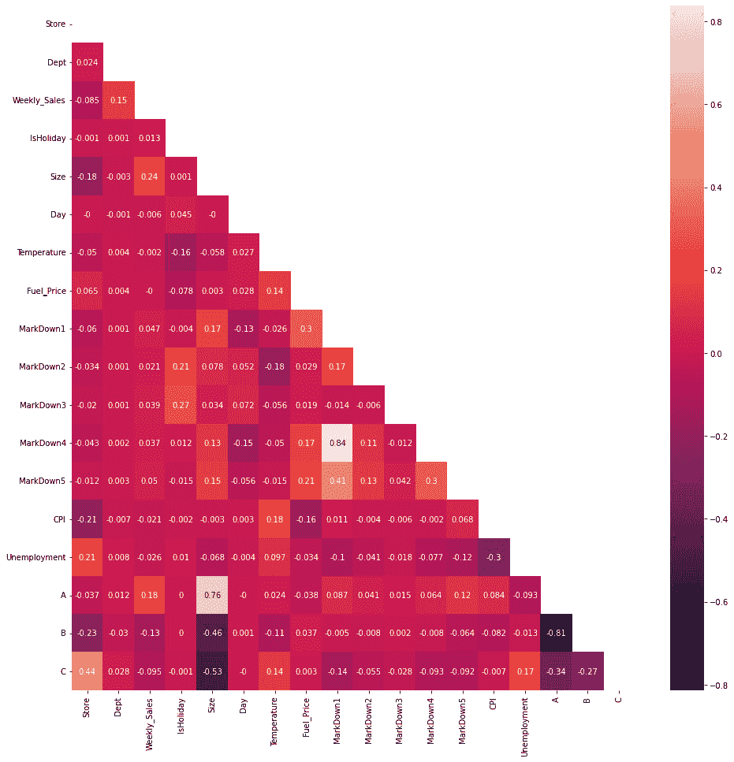

图 9.20：变量相关性

我们可以看到一些有趣的相关性，例如，折扣 2 和 3 的大小与商店大小之间的正相关性，以及折扣 1 和 4 的大小之间的正相关性。

1.  最后，我们可以展示变量与每周销售之间的相关性程度：

    ```py
    f, ax = plt.subplots(figsize=(20, 6))
    ```

    ```py
    data = df_corr['Weekly_Sales'].dropna().sort_values(ascending=False)
    ```

    ```py
    sns.barplot(x=data.index,y=data)
    ```

以下条形图将展示我们最相关的变量。


图 9.21：排序后的变量相关性

我们可以看到每周销售受商店大小的正向影响最大，其次是 markdowns 5 和 1。它与失业率和**消费者价格指数**（**CPI**）呈负相关，这也是合理的。

现在我们对数据有了更好的理解，我们将开始进行每周销售预测的过程。

# 使用 Prophet 预测销售

预测时间序列可能是一个具有挑战性的任务，因为你可以使用许多不同的方法，并且每种方法都有许多不同的超参数。Prophet 库是一个开源库，旨在为单变量时间序列数据集进行预测。它易于使用，并设计为自动找到一组良好的超参数，使模型能够为具有标准趋势和季节性结构的数据做出有竞争力的预测。我们将学习如何使用 Facebook Prophet 包来预测每周销售时间序列：

1.  首先，我们将导入库并创建一个包含所有描述为连续变量或独热表示的特征的数据集：

    ```py
    from fbprophet import Prophet
    ```

    ```py
    data = train.drop(['Year','Month','Week'],axis=1).merge(features.drop(['IsHoliday','Week'],axis=1),on=['Store','Date'])
    ```

    ```py
    data = pd.concat([data.drop(['Type'],axis=1),
    ```

    ```py
          pd.get_dummies(data['Type'])],axis=1).fillna(0)
    ```

    ```py
    data['IsHoliday'] = data['IsHoliday'].astype(int)
    ```

1.  过滤 Store 1 的结果，因为我们将训练一个能够学习每个特定商店行为的模型：

    ```py
    data = data[data.Store==1]
    ```

1.  对于 Prophet 包，我们需要准备一些具有特定数据类型的预期列名。在这种情况下，我们需要传递 `ds` 和 `y` 变量，第一个是 `datetime` 类型的列：

    ```py
    data['ds']= pd.to_datetime(data['Date'])
    ```

    ```py
    data =  data.sort_values(['ds'],ascending='True')
    ```

    ```py
    data['y']=data['Weekly_Sales']
    ```

现在我们已经创建了具有正确数据类型的列，我们可以删除冗余列并显示前几行：

```py
data = data.drop(['Date','Weekly_Sales'],axis=1).reset_index(drop=True)
data.head()
```


图 9.22：用于模型训练的数据

现在我们可以将数据分为训练数据集和测试数据集。

```py
x_train = data[:-1000]
x_test = data[-1000:]
```

1.  最后，我们可以定义将使用的模型。在这种情况下，我们需要建立线性增长和乘法季节性。在这种情况下，我们还包括了每周季节性：

    ```py
    model = Prophet(changepoint_prior_scale=0.05, 
    ```

    ```py
                interval_width=0.95,
    ```

    ```py
                growth = 'linear',
    ```

    ```py
                seasonality_mode = 'multiplicative',
    ```

    ```py
                weekly_seasonality=True,
    ```

    ```py
                changepoint_range=0.9)
    ```

在训练预测模型之前，我们可以添加使用附加变量的回归器。

这里，`add_regressor` 参数是训练数据框中附加变量的列名：

```py
for c in ['Dept','IsHoliday',
      'CPI','Fuel_Price','MarkDown1',
'MarkDown2','MarkDown3','MarkDown4','MarkDown5', 'Unemployment']:
  print(c)
  model.add_regressor(name=c, prior_scale=None, standardize='auto', mode='additive')
```

请注意，这里我们正在将附加变量作为回归器添加到模型中。这些变量应具有未来（测试）数据的值。一个关键因素是，我们对所有变量使用相同的参数，而建议的做法是对每个变量单独进行调优，尽管根据每个变量的具体情况来选择这些参数超出了本分析的范围。

最后，我们可以拟合模型：

```py
model.fit(data[['ds','y','Dept','IsHoliday','CPI',
'Fuel_Price','MarkDown1','MarkDown2','MarkDown3',
'MarkDown4','MarkDown5', 'Unemployment']])
```

1.  模型训练完成后，我们可以使用它对测试数据进行预测，以评估预测的表现：

    ```py
    forecast = model.predict(x_test[['ds','Dept','IsHoliday','
    ```

    ```py
    CPI','Fuel_Price','MarkDown1','MarkDown2','MarkDown3',
    ```

    ```py
    'MarkDown4','MarkDown5', 'Unemployment']])
    ```

我们可以访问结果预测，展示每个日期的预测值，以及上下边界：

```py
print(forecast[['ds', 'yhat', 'yhat_lower', 
      'yhat_upper']].head())
```


图 9.23：预测数据

1.  现在，我们可以将这些结果与测试数据中 y 的实际值连接起来，以可视化结果。为便于可视化，生成的曲线采用七天滞后的滚动平均进行平滑处理：

    ```py
    forecast_data = pd.concat([forecast[['yhat', 
    ```

    ```py
    'yhat_lower', 'yhat_upper']],
    ```

    ```py
    x_test['y'].reset_index(drop=True)],axis=1)
    ```

    ```py
    forecast_data.rolling(window=7).mean().plot(figsize=(20,8))
    ```

上述代码将生成一个可视化图，我们可以看到实际销售与实际结果的对比。

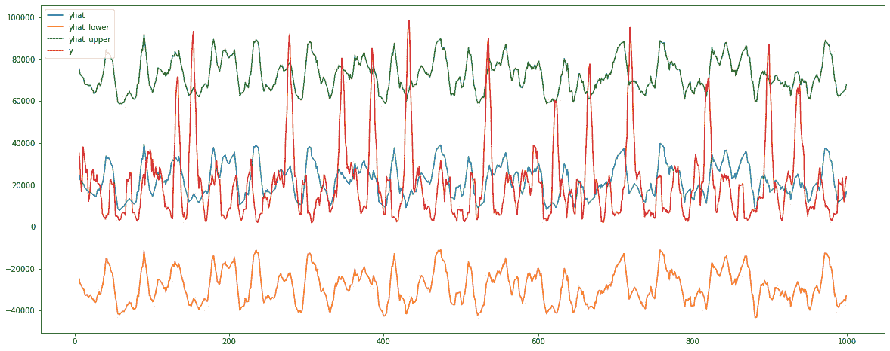

图 9.24：预测数据与实际值对比

我们可以看到，除了个别情况外，大多数情况下，预测值与实际值接近，极少出现超出上限的情况，但从未低于下限。

# 总结

本章我们已深入探讨了销售分析和降价应用的细节。如前所述，降低商品价格以增加销售和减少库存相关成本之间存在一定的权衡，而这种降价会导致一定的收入损失。在零售的情况下，这些结果受到多个因素的影响，其中包括某个店铺的位置、环境和经济条件，以及季节性因素，正如我们通过不同节假日销售分析所看到的那样。

销售和降价的分析与预测可以帮助微调应用的降价策略，从而维持盈利性和销售之间的平衡，并深入理解涉及的变量及其相对影响，这有助于设计更好的降价策略。

在下一章，我们将深入探讨电子商务零售商如何学习消费者行为、理解消费者细分、预测消费者生命周期价值，以及预测哪些用户最终会购买。
