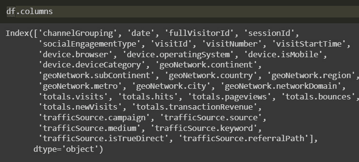
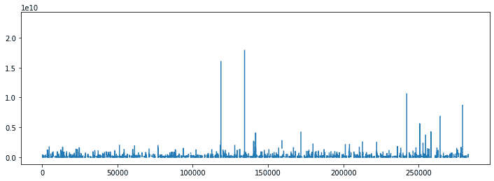
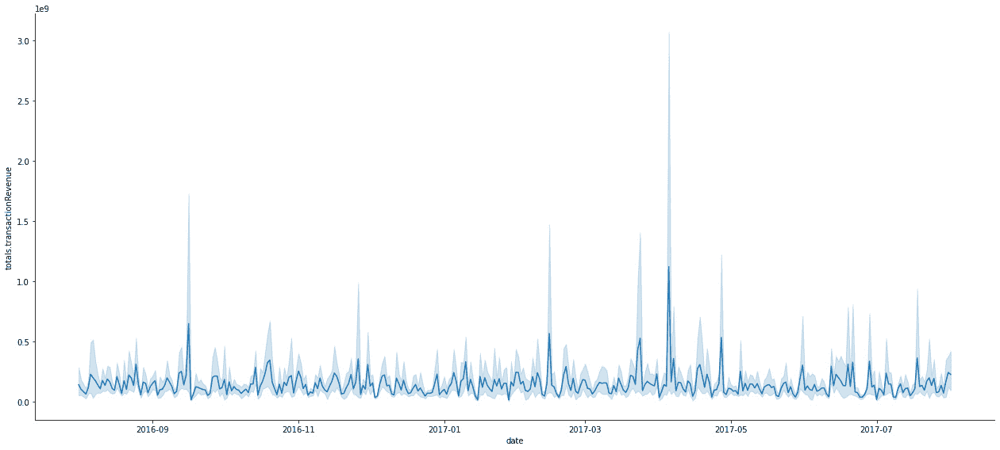
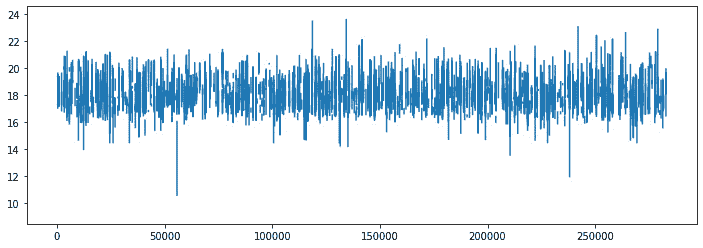
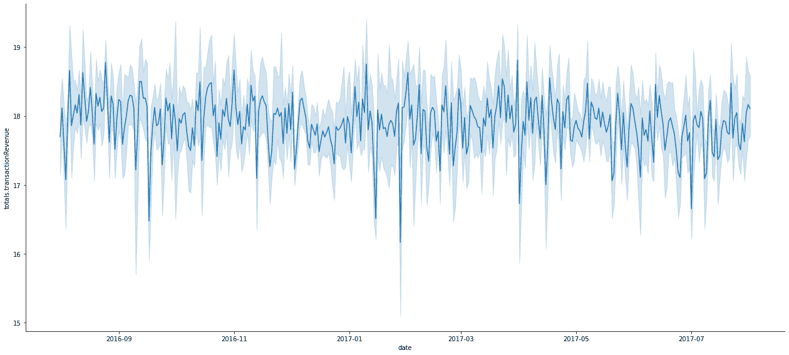
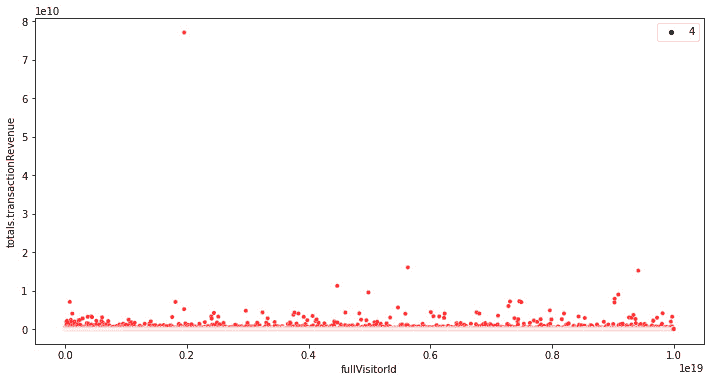
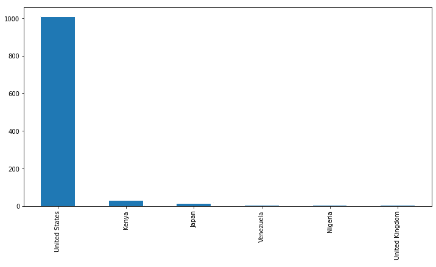
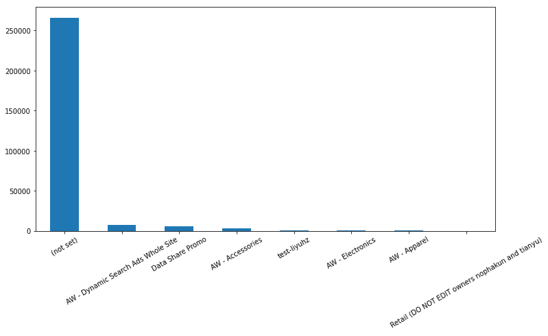
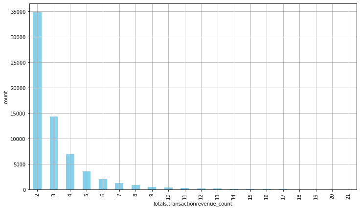
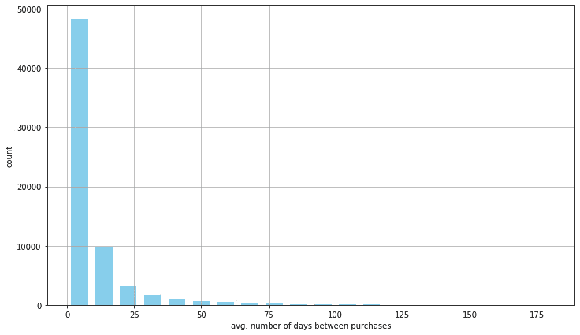

# 网页分析优化。

数据驱动的营销优化是一种重视能够通过可信和可验证数据支持的决策的营销分析方法。它高度重视那些可以通过实证证据证明的选择，无论是流量来源、页面浏览量，还是每次会话的时间。数据收集、处理和解释的有效性对最大化营销结果是数据驱动方法成功的关键因素。

在本章中，我们将学习以下内容：

+   理解网页分析是什么。

+   如何使用网页分析数据来改善业务运营。

+   基于网页分析数据计算用户的**客户生命周期价值**（**CLV**）。

+   基于这些历史数据预测用户的 CLV。

让我们确定了解这些步骤并跟随本章所需的要求。

本章涵盖以下主题：

+   理解网页分析。

+   使用网页分析来改善商业决策。

+   探索数据。

+   计算 CLV。

+   预测客户收入。

# 技术要求。

为了能够跟随本章中的步骤，你需要满足以下要求：

+   一个运行 Python 3.7 及以上版本的 Jupyter Notebook 实例。如果你有 Google Drive 账户，也可以使用 Google Colab 笔记本来运行这些步骤。

+   理解基本的数学和统计学概念。

# 理解网页分析。

对于电子商务，理解用户行为至关重要。网页分析的数据通常显示在可以根据用户画像或时间段等因素调整的仪表板上。这些仪表板随后用于做出产品和市场决策，因此这些数据的准确性至关重要。数据可以分为多个组别，包括以下内容：

+   通过检查访问次数、新访客与回访者的比例、访客来源，以及他们使用的浏览器或设备（桌面与移动设备），可以了解受众数据。

+   常见的登录页面、常访页面、常退出页面、每次访问所花费的时间、每次访问的页面数量以及跳出率，都可以用于研究受众行为。

+   活动数据用于了解哪些活动带来了最多的流量，哪些网站作为推荐来源表现最佳，哪些关键词搜索导致了访问，以及活动媒介的细分，如电子邮件与社交媒体的对比。

然后，销售、产品和营销团队可以使用这些信息了解用户如何与产品互动，如何定制信息，以及如何改进产品。

用于跟踪和分析网站流量的最佳和最有效的工具之一是 Google Analytics。您可以从中了解到关于您网站访问者的大量信息，包括他们是谁、他们在寻找什么以及他们是如何找到您的。每家希望开发和改善其在线存在的公司都应该使用 Google Analytics。

Google Analytics 将为您提供的最重要信息列在此处：

+   您的访问者来自哪里——如果您针对特定受众，这一点非常重要。

+   人们如何找到您的网站是了解您的努力是否成功的关键信息。它表明用户是直接访问您的网站，通过另一个网站的链接（如 Twitter 或 Facebook），还是通过搜索引擎到达的。

+   访问者使用的浏览器——通过了解他们使用的浏览器，您可以决定应该集中注意力的浏览器。

+   人们用来找到您的网站的搜索引擎术语是 SEO 的重要信息。了解人们如何通过搜索引擎找到您的网站的搜索术语有助于评估您的进展。

在接下来的部分，我们将深入探讨如何利用 Google Analytics 数据来了解我们的客户群体。

# 使用网络分析来改善业务运营

通过利用数字分析和用户输入的见解，我们可以通过转化率优化增加我们的网站和应用程序的性能。通过利用当前的流量并最大化它，以期提高销售、线索或任何其他目标。

借助数字分析仪表板和分析，我们可以监控用户活动，包括他们的来源、他们在我们的网站或应用程序上浏览的页面，以及他们如何在各个页面之间移动。通过内容和用户行为分析，我们可以确定哪里有最大的潜力，以及需要进行哪些变更来实现指定的目标和目标。

通过定义和执行测量计划，企业网站或应用的标签具有上下文意义。这使得公司可以进行**优势、劣势、机会和威胁**（**SWOT**）分析，从而明确目标和目标，并指示必须通过特定内容和消息来定位内外网站或应用的用户细分。

当识别出机会或威胁时，也可以进行 A/B 或多元测试。通过这种方式，我们可以向不同用户群体展示网站功能的两个（或多个）不同迭代版本，然后评估哪个表现更好。我们可以使用这种方法做出基于数据的决策，而忽略季节性影响等因素。

现在我们已经了解了应用程序的背景，请从查看数据集并了解我们的需求、我们的目标以及分析的局限性开始。

# 探索数据

在下一个示例中，我们将使用以下 Python 模块：

+   **pandas**：用于数据分析和数据操作的 Python 包。

+   **NumPy**: 这是一个支持大规模多维数组和矩阵的库，并提供了一大批高层次的数学函数来操作这些数组。

+   `Statsmodels`: 一个 Python 包，提供了对 SciPy 的补充，用于统计计算，包括描述性统计和统计模型的估计与推断。它提供了许多不同统计模型的估计类和函数。

+   **Seaborn 和 Matplotlib**: 用于有效数据可视化的 Python 包。

我们将按以下步骤开始：

1.  以下代码块将加载所有必需的包，加载数据并显示前五行。为了提高可读性，我们将限制显示的最大行数为 `20`，将最大列数限制为 `50`，并将浮动数字显示为 `2` 位小数：

    ```py
    import pandas as pd
    ```

    ```py
    pd.options.display.max_rows = 20
    ```

    ```py
    pd.options.display.max_columns = 50
    ```

    ```py
    pd.options.display.precision = 2
    ```

    ```py
    df = pd.read_csv('google_analytics_clean_data.csv')
    ```

    ```py
    df["date"] = pd.to_datetime(df["date"], format="%Y%m%d") # seting the column as pandas datetime
    ```

    ```py
    df.head()
    ```

上面的代码将加载文件，将日期列转换为正确的数据类型，并提示我们查看前几行。


图 10.1：Google Analytics 示例数据

我们可以看到，这是一个可以从 Google Analytics 获得的数据演示，因为某些列不可用。

1.  我们将探索这组列：

    ```py
    df.columns
    ```

这行代码将显示文件中所有列的名称。



图 10.2：列名

根据我们从 Kaggle 竞赛中获得的有关列和数据的信息，我们可以描述数据集中的列：

+   `fullVisitorId`: 每个用户的标识符。

+   `channelGrouping`: 客户被重定向的渠道。

+   `date`: 访问的日期。

+   `Device`: 使用的设备类型。

+   `geoNetwork`: 客户的位置。

+   `socialEngagementType`: 客户是否在社交媒体上参与互动？

+   `trafficSource`: 该字段显示流量来源。

+   `visitId`: 特定访问的标识符。

+   `visitNumber`: 特定客户的会话计数。

1.  现在我们已经有了有关列的信息，可以绘制收入列以查看它们的分布：

    ```py
    df['totals.transactionRevenue'].plot(figsize=(12,4))
    ```

这行代码将使用 pandas 的 `plot` 方法显示列的分布。



图 10.3：收入分布

许多公司发现 80/20 法则是成立的：只有一小部分客户创造了大部分收入，通过查看数据我们可以验证这一点，少数客户创造了大部分收入。营销团队面临的问题是如何将适当的资金分配到促销活动中。在这种情况下，比例明显更低。

1.  数据点之间的统计关联通过关系图展示。数据可视化对于发现趋势和模式至关重要。这张图为用户提供了额外的轴级函数，利用语义子集映射，可以展示两个变量之间的关系。以长格式模式传递整个数据集将对重复值（每年）进行汇总，以展示均值和 95%的置信区间。

在这里，我们使用`seaborn`包创建一个带有 95%置信区间区域的关系图，展示收入列：

```py
import seaborn as sns
sns.relplot(x='date', y='totals.transactionRevenue', data=df,kind='line',height=8, aspect=2.2)
```

这展示了带有置信区间的交易分布，如下所示：



图 10.4：带有置信区间的收入分布

这里我们看到的一个问题是，由于数值差异，数据难以观察，因此我们将实现对数尺度。对于广泛的数值范围，通常会使用一种非线性尺度，称为对数尺度。每个区间的增量是以对数的底数为因子的，而不是等量增加。常用的对数尺度有以 10 为底和以 e 为底的尺度。

有时，显示的数据比其余数据大得多或小得多——当值之间的百分比变化显著时，对数尺度也可能很有帮助。如果可视化中的数据范围非常广泛，我们可以使用对数尺度。

另一个好处是，当显示较小的价格上涨或下跌时，对数定价尺度比线性定价尺度表现得更好。它们可以帮助你确定价格必须上涨或下跌多少，才能达到买入或卖出的目标。然而，如果价格接近，对数价格尺度可能会变得拥挤且难以读取。使用对数尺度时，当值之间的百分比变化相同时，尺度上的价格之间的垂直距离是相等的。

1.  在这里，我们将使用`numpy`库在收入列上实现对数尺度：

    ```py
    import numpy as np
    ```

    ```py
    df['totals.transactionRevenue'] = np.log(df['totals.transactionRevenue'])
    ```

    ```py
    df['totals.transactionRevenue'].plot(figsize=(12,4))
    ```

在这里，我们可以看到在对数尺度上的交易。



图 10.5：对数尺度收入

1.  我们现在可以使用关系图更好地可视化带有置信区间的对数交易值：

    ```py
    sns.relplot(x='date', y='totals.transactionRevenue', data=df,kind='line',height=8, aspect=2.2)
    ```

我们可以通过`relplot`获得更好的可视性，它将绘制均值数据为一条线，并显示 95%的数据所在的置信区间。



图 10.6：带有置信区间的对数尺度收入

1.  另一种可视化方法是使用散点图，这对于识别离群值非常有用：

    ```py
    import matplotlib.pyplot as plt # visualization
    ```

    ```py
    data = df.groupby("fullVisitorId")["totals.transactionRevenue"].sum().reset_index()
    ```

    ```py
    f, ax = plt.subplots(figsize=(12, 6))
    ```

    ```py
    fig =sns.scatterplot(x='fullVisitorId', y='totals.transactionRevenue',size=4,alpha=.8,color='red', data=data)
    ```

散点图向我们展示了有一些离群值。



图 10.7：作为散点图的交易

在这里，我们可以更清楚地看到，只有少数几个用户通过他们的订单创造了极高的收入。

1.  现在，我们可以看看前 50 名客户的支出模式：

    ```py
    top_50_customers = data.sort_values(['totals.transactionRevenue'],ascending=False).head(50)
    ```

    ```py
    top_50_customers['totals.transactionRevenue'].plot.bar(figsize=(15,6))
    ```

接下来是一个关于前几大客户的条形图。


图 10.8：最高收入的用户

从这张图中我们可以确认，用户**26437**是我们最大的客户。

1.  使用 Google Analytics 查找商品和服务的潜在市场是该工具的另一个精彩应用。你可以查看按国家分列的访问量和转化率，选择重点关注的地区，并决定在哪些地方扩展，尤其是在你的业务面向全球或考虑全球化时。在这里，我们可以分析用户群体中的主要国家：

    ```py
    global_countries = df['geoNetwork.country'].value_counts().head(20)
    ```

    ```py
    global_countries.plot.bar(figsize=(16,6))
    ```

上面的代码将展示用户来自的国家。


图 10.9：所有国家

我们可以看到，绝大多数用户集中在美国。

1.  现在，让我们关注一下我们的顶级客户，并查看他们来自哪些地方。我们可以通过遮罩在前 50 名用户名单中的用户，然后复制前面的图形来实现：

    ```py
    top_50_data = df[df.fullVisitorId.isin(top_50_customers.fullVisitorId)]
    ```

    ```py
    top_50_countries = top_50_data['geoNetwork.country'].value_counts()
    ```

    ```py
    top_50_countries.plot.bar(figsize=(12,6))
    ```

上面的代码将以条形图的形式展示前几大国家。



图 10.10：最大客户的国家

再次，我们可以确认最大的客户来自美国，其次是肯尼亚和日本。

1.  现在，我们将分析有多少访客实际上进行了转化，也就是他们实际购买了某些商品：

    ```py
    zero_revenue_users = (data["totals.transactionRevenue"]==0).sum()
    ```

    ```py
    print("Number of unique customers with non-zero revenue: ", len(data)-zero_revenue_users, "and the ratio is: ", zero_revenue_users / len(data))
    ```

    ```py
    >>> Number of unique customers with non-zero revenue:  6876 and the ratio is:  0.9264536003080478
    ```

比例上，约有 8% 的用户实际在网站上进行了购买，这个比例不错。

1.  现在，我们将开始清理数据的过程，首先查找只有一个值的分类列。这些列没有提供有效数据，我们将将其删除：

    ```py
    const_cols = [c for c in df.columns if df[c].nunique(dropna=False)==1 ]
    ```

    ```py
    Const_cols
    ```

    ```py
    >>> ['socialEngagementType', 'totals.visits']
    ```

    ```py
    df = df.drop(const_cols, axis=1)
    ```

1.  现在，我们将通过删除一些不使用的列来简化数据：

    ```py
    drop_cols = ['sessionId','visitId','visitStartTime',
    ```

    ```py
    'geoNetwork.continent','geoNetwork.subContinent',
    ```

    ```py
    'geoNetwork.region','geoNetwork.metro',
    ```

    ```py
    'geoNetwork.city','geoNetwork.networkDomain']
    ```

    ```py
    df = df.drop(drop_cols, axis=1)
    ```

    ```py
    df.columns
    ```

以下截图展示了我们当前拥有的列：


图 10.11：最终列集合

1.  我们的列现在已经精简为我们实际需要的列。接下来，让我们探索`campaign`列，看看哪一项活动更成功：

    ```py
    df['trafficSource.campaign'].value_counts().plot.bar(figsize=(10,6),rot=30)
    ```



图 10.12：活动数据

从活动数据中我们可以看出，大部分流量并非来自活动，而且一些活动表现不佳。这些信息可以帮助营销团队优化这些活动并节省费用。

# 计算 CLV

客户生命周期价值（CLV）是一项指标，用于描述公司在客户保持关系期间，可以从一个典型客户身上获得的总收入。CLV 是公司从典型客户身上赚取的总金额，它在营销中被用来预测客户未来整个关系过程中将产生的净利润。

了解客户的 CLV 至关重要，因为它能帮助我们决定花多少钱来吸引新客户以及保持现有客户。计算 CLV 最简单的方法是将每次购买的平均值乘以客户每年购买的次数，再乘以客户关系的平均持续时间（按年或月计算）。

通过计算不同客户的 CLV（客户生命周期价值），可以获得许多好处，其中最关键的是商业决策。了解你的 CLV 能帮助你发现如下内容：

+   你可以花费多少资金，依然能与类似的客户保持盈利的关系

+   高 CLV 客户所青睐的产品种类

+   哪些产品的盈利性最高

+   你的最盈利的客户类型是谁

将资源花费在现有客户群体的销售上是关键，因为现有客户的购买概率为 60%到 70%，而新客户的购买概率只有 5%到 20%。有几种策略能增加消费者再次购买的可能性，其中一些方法如下：

+   让客户更容易退还他们购买的商品，因为如果让顾客退货变得困难或昂贵，将大幅降低他们再次购买的可能性。

+   设定交货日期的预期目标，并通过建立安全边际超越这些预期。例如，承诺在 5 月 20 日交货，然后在 5 月 1 日提前交货，而不是反过来。

+   创建一个有实际可得且有吸引力的激励措施的计划，鼓励用户进行重复购买。

+   提供激励措施以鼓励客户继续选择你的品牌。

+   与长期客户保持联系，确保他们知道你依然在关心他们，同时提供简单的方式让他们联系到你。

+   专注于获取并保持回头客，这些顾客将推动你的品牌发展，以及长期客户。

更具体地说，计算 CLV 的步骤如下：

1.  将数据分割为每三个月一组。

1.  汇总每位客户在过去 3 个月的收入。

1.  生成类似“自上次购买以来的天数”、“购买间隔的平均天数”等列。

我们将通过以下步骤来进行：

1.  为了应用这一方法，我们将定义一些辅助函数，并与`pandas`的聚合方法一起使用，以确定我们用户的 CLV：

    ```py
    def groupby_mean(x):
    ```

    ```py
        return x.mean()
    ```

    ```py
    def groupby_count(x):
    ```

    ```py
        return x.count()
    ```

    ```py
    def purchase_duration(x):
    ```

    ```py
        return (x.max() - x.min()).days
    ```

    ```py
    def avg_frequency(x):
    ```

    ```py
        return (x.max() - x.min()).days/x.count()
    ```

1.  我们希望将分析的时间范围设定为 3 个月，因此我们将创建一个变量来确定这一点：

    ```py
    clv_freq = '3M'
    ```

1.  需要注意的是，我们将使用`__name__`属性来确定 Python 中函数的名称，并保持列名整洁。要访问`__name__`属性，只需在函数名后不加括号并使用`__name__`属性即可。它将返回函数名的字符串：

    ```py
    groupby_mean.__name__ = 'avg'
    ```

    ```py
    groupby_count.__name__ = 'count'
    ```

    ```py
    purchase_duration.__name__ = 'purchase_duration'
    ```

    ```py
    avg_frequency.__name__ = 'purchase_frequency'
    ```

1.  现在，我们可以通过应用`groupby`方法并使用之前定义的函数来聚合值，从而创建我们的汇总数据框：

    ```py
    summary_df = df.reset_index().groupby('fullVisitorId').agg({
    ```

    ```py
        'totals.transactionRevenue': [min, max, sum, groupby_mean, groupby_count],
    ```

    ```py
        'date': [min, max, purchase_duration, avg_frequency]
    ```

    ```py
    })
    ```

1.  最后，我们将对列名进行一些调整，以提高可读性：

    ```py
    summary_df.columns = ['_'.join(col).lower() for col in summary_df.columns]
    ```

我们可以检查数据框的最终大小：

```py
summary_df.shape
>>> (93492, 9)
```

我们还可以通过`describe`方法检查值的分布：

```py
summary_df.describe()
```

在这里，我们调用了`pandas`的统计摘要：


图 10.13：计算的用户 CLV

1.  现在，让我们通过查看购买日期来筛选出那些实际购买了商品的用户：

    ```py
    summary_df = summary_df.loc[summary_
    ```

    ```py
          df['date_purchase_duration'] > 0]
    ```

之后，我们大大减少了数据集中的用户数量：

```py
summary_df.shape
>>> (66168, 9)
```

1.  我们可以通过绘制分组后的结果，使用交易计数来可视化这些结果：

    ```py
    import matplotlib.pyplot as plt
    ```

    ```py
    ax = summary_df.groupby('totals.transactionrevenue_count').count()['totals.transactionrevenue_avg'][:20].plot(
    ```

    ```py
        kind='bar',
    ```

    ```py
        color='blue',
    ```

    ```py
        figsize=(12,7),
    ```

    ```py
        grid=True
    ```

    ```py
    )
    ```

    ```py
    ax.set_ylabel('count')
    ```

    ```py
    plt.show()
    ```



图 10.14：交易收入计数

1.  现在，最常见的交易次数是**2**，呈抛物线方式减少。这为我们提供了足够的信息，以便在客户第二次交易后向他们提供激励措施，鼓励他们继续购买。

现在，让我们来看看交易之间的天数：

```py
ax = summary_df['date_purchase_frequency'].hist(
    bins=20,
    color='blue',
    rwidth=0.7,
    figsize=(12,7)
)
ax.set_xlabel('avg. number of days between purchases')
ax.set_ylabel('count')
plt.show()
```



图 10.15：购买之间的时间

这些信息告诉我们，客户在 25 天后再次购买的情况很少，因此我们可以利用这些信息在交易间隔超过某个阈值时保持用户活跃。这帮助我们减少客户流失并提高忠诚度。

现在，我们已经确定了如何计算 CLV，这将帮助我们制定更好的营销策略，精确了解我们可以为获取每个客户花费多少。

# 预测客户收入

通过利用我们公司历史上的交易数据，我们试图预测在特定时间点从客户那里获得的未来收入。当你能够准确预测收入时，规划如何实现收入目标会更简单，在许多情况下，营销团队会被分配收入目标，特别是在初创行业的融资轮之后。

B2B 营销聚焦于目标，这时历史预测（通过历史数据预测我们的收入）一直非常成功。因为精准的历史收入和管道数据为你以前的收入创造提供了宝贵的洞察。你可以利用这些洞察预测为实现收入目标所需的条件。为营销团队提供更好的信息的因素可以总结为四个指标，在你开始计算预期收入之前：

+   你需要多长时间才能产生收入

+   每个管道阶段的交易平均停留时间

+   以往交易的数量

+   在这个时间段内产生的收入

这些指标通常是你预测收入的基础，并且能够帮助创建更加明确的营销计划。

像“用户需要多长时间才能开始赚钱”这样的问题要求你收集这些指标。了解用户的收入时间（从创建账户到用户完成购买所需的时间）是第一步。这是因为收入时间决定了你通常需要多长时间才能创造收入，并收回为获得这个客户所做的投资。如果忽略了这些指标，你的收入周期和估算将失去同步，没有这个参数，可能会导致你错失目标并错误分配资金。事实上，你必须了解你的收入时间。

同样，唯一准确衡量这一点的方法是从一个匿名用户首次与你互动的那一刻开始，直到该账户转化为客户。如果没有识别首次接触，你的测量将不准确，并且再次低估了你实际上需要多长时间才能获得收入：

1.  我们将通过导入将要使用的包开始分析，包括 `LightGBM` 分类。需要注意的是，我们会将交易中的 NaN 值替换为零：

    ```py
    from sklearn import model_selection, preprocessing, metrics
    ```

    ```py
    import lightgbm as lgb
    ```

    ```py
    # Impute 0 for missing target values
    ```

    ```py
    df["totals.transactionRevenue"].fillna(0, inplace=True)
    ```

    ```py
    y = df["totals.transactionRevenue"].values
    ```

    ```py
    id = df["fullVisitorId"].values
    ```

为了使分类数据能供各种模型使用，必须通过编码过程将分类数据转换为整数表示。在数据科学领域，数据准备是建模之前的必要步骤——那么，如何在数据科学中处理分类数据呢？常用的方法如下：

+   使用 Python 的 `category_encoding` 库进行独热编码

+   Scikit-learn 预处理

+   `get_dummies` 在 pandas 中的使用

+   二进制编码

+   频率编码

+   标签编码

+   序数编码

当数据无法以其现有格式跨系统或应用程序传输时，这种方法通常会被采用，以确保数据的完整性和可用性。数据保护和安全性并不使用编码，因为解码很简单。

将类别特征的水平转换为数值的一个非常有效的方法是使用标签，这些标签的值介于 0 和 n 类 - 1 之间，其中 n 是不同标签的数量。在这里，我们使用`LabelEncoder`对变量进行编码。重复的标签会分配与第一次相同的值。

1.  我们将列出需要编码的类别列。这里，列表是硬编码的，但我们本可以使用`pandas`的数据类型来确定对象列：

    ```py
    cat_cols = ['channelGrouping','device.browser','device.deviceCategory','device.operatingSystem','geoNetwork.country','trafficSource.campaign','trafficSource.keyword','trafficSource.medium','trafficSource.referralPath','trafficSource.source','trafficSource.isTrueDirect']
    ```

1.  现在，我们将遍历它们并使用`LabelEncoder`进行编码：

    ```py
    for col in cat_cols:
    ```

    ```py
        print(col)
    ```

    ```py
        lbl = preprocessing.LabelEncoder()
    ```

    ```py
        lbl.fit(list(df[col].values.astype('str')))
    ```

    ```py
        df[col] = lbl.transform(list(df[col].values.astype('str')))
    ```

1.  现在，类别列已经转换完成，我们将继续将数值列转换为浮动类型，以满足 LightGBM 的要求。

接下来是我们将要处理的列：

```py
num_cols = ['totals.hits',
            'totals.pageviews',
            'visitNumber',
            'totals.bounces',
            'totals.newVisits']
```

1.  下一步，我们使用`astype` pandas 方法将这些数据类型转换为浮动类型：

    ```py
    for col in num_cols:
    ```

    ```py
        print(col)
    ```

    ```py
        df[col] = df[col].astype(float)
    ```

1.  现在，我们可以根据时间将训练数据集划分为开发集（`dev`）和验证集（`val`）：

    ```py
    import datetime
    ```

    ```py
    dev_df = df[df['date']<='2017-05-31']
    ```

    ```py
    val_df = df[df['date']>'2017-05-31']
    ```

1.  对收入变量应用对数变换：

    ```py
    dev_y = np.log1p(dev_df["totals.transactionRevenue"].values)
    ```

    ```py
    val_y = np.log1p(val_df["totals.transactionRevenue"].values)
    ```

1.  接下来，我们将类别列和数值列进行连接：

    ```py
    dev_X = dev_df[cat_cols + num_cols]
    ```

    ```py
    val_X = val_df[cat_cols + num_cols]
    ```

开发数据框的最终形状如下所示：

```py
dev_df.shape
>>> (237158, 20)
```

验证数据框的最终形状如下所示：

```py
val_df.shape
>>> (45820, 20)
```

为了预测每个用户的 CLV，我们将使用之前指定的 LightGBM 回归模型。该算法是表现最好的算法之一，且它是一种决策树算法。

决策树是一种监督学习工具，可以根据过去对查询的回答来分类或预测数据。监督学习的一个例子是决策树模型，它在具有所需类别的数据集上进行训练和测试。决策树用于分类和回归应用，是一种非参数方法。它的结构是层次化的，包含根节点、分支、内部节点和叶节点。

LightGBM 是一种基于决策树的梯度提升算法，它在提高模型性能的同时，使用更少的内存。`LightGBM`是一个 Python 中的开源梯度提升实现，旨在与现有的实现一样有效，甚至更高效。这个软件库、机器学习方法和开源项目统称为 LightGBM。

LightGBM 的优点包括更快的训练速度和更高的效率：LightGBM 采用基于直方图的方法，通过将连续特征值分到离散的区间中，从而加速训练过程。这种技术还将连续值转化为离散区间，减少了内存的使用。

1.  为了简化训练流程，我们将实现一个自定义函数来运行 LightGBM 模型。此函数具有预定义的参数，我们可以根据获得的性能进行调整。这些参数作为字典传递，文档中可以进一步介绍它们：

    ```py
    def run_lgb(train_X, train_y, val_X, val_y):
    ```

    ```py
        params = {
    ```

    ```py
            "objective" : "regression",
    ```

    ```py
            "metric" : "rmse",
    ```

    ```py
            "num_leaves" : 50,
    ```

    ```py
            "learning_rate" : 0.1,
    ```

    ```py
            "bagging_fraction" : 0.7,
    ```

    ```py
            "feature_fraction" : 0.5,
    ```

    ```py
            "bagging_frequency" : 5,
    ```

    ```py
            "verbosity" : -1
    ```

    ```py
        }
    ```

    ```py
        lg_train = lgb.Dataset(train_X, label=train_y)
    ```

    ```py
        lg_val = lgb.Dataset(val_X, label=val_y)
    ```

    ```py
        model = lgb.train(params, lg_train , 1000, 
    ```

    ```py
        valid_sets=[lg_val ], early_stopping_rounds=100, 
    ```

    ```py
        verbose_eval=100)
    ```

    ```py
        pred_val_y = model.predict(val_X, 
    ```

    ```py
        num_iteration=model.best_iteration)
    ```

    ```py
        return model, pred_val_y
    ```

在这里，函数使用`Dataset`方法加载训练和开发数据集，并在 1,000 步中使用指定的参数训练模型。开发数据集用于验证，因为它能提供有关模型整体表现的信息。

1.  现在，我们可以开始训练模型：

    ```py
    model, pred_val = run_lgb(dev_X, dev_y, val_X, val_y)
    ```


图 10.16：每用户收入的 RMSE 值

结果显示，模型的表现可以得到提升，这需要我们微调参数，直到达到一个在我们置信区间内的表现水平。

# 总结

网络分析使我们能够优化在线销售的产品和服务的表现。通过深入了解客户及其消费模式，我们能够改进与客户的沟通方式。 在本章中，我们深入了解了这些数据，并探讨了如何使用这些数据来确定客户的客户生命周期价值（CLV）、了解其特征以及识别关键指标，从而制定成功的数字营销计划。

下一章将探讨几位行业专家在如何将数据、机器学习和商业智能（BI）应用于现实商业场景以改善运营方面的考虑。
