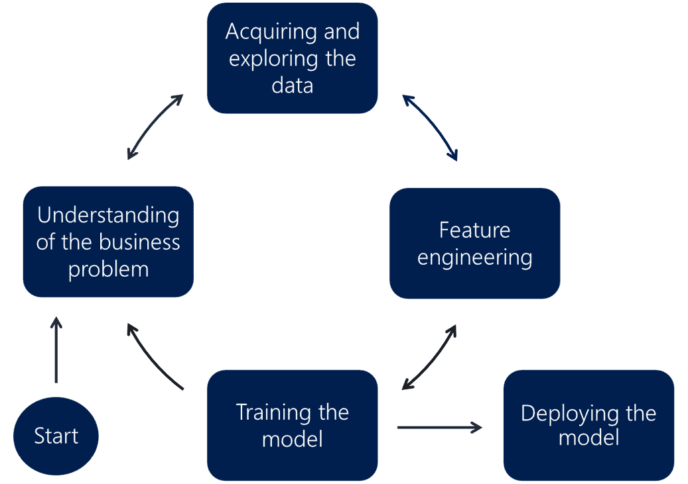
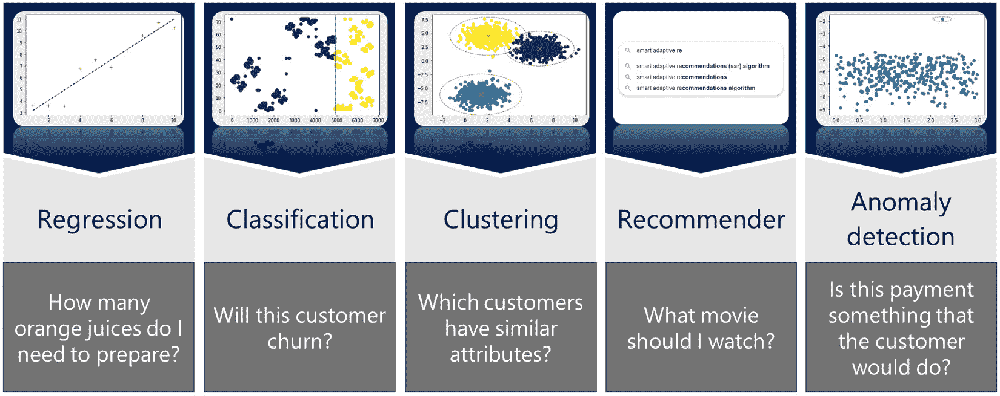
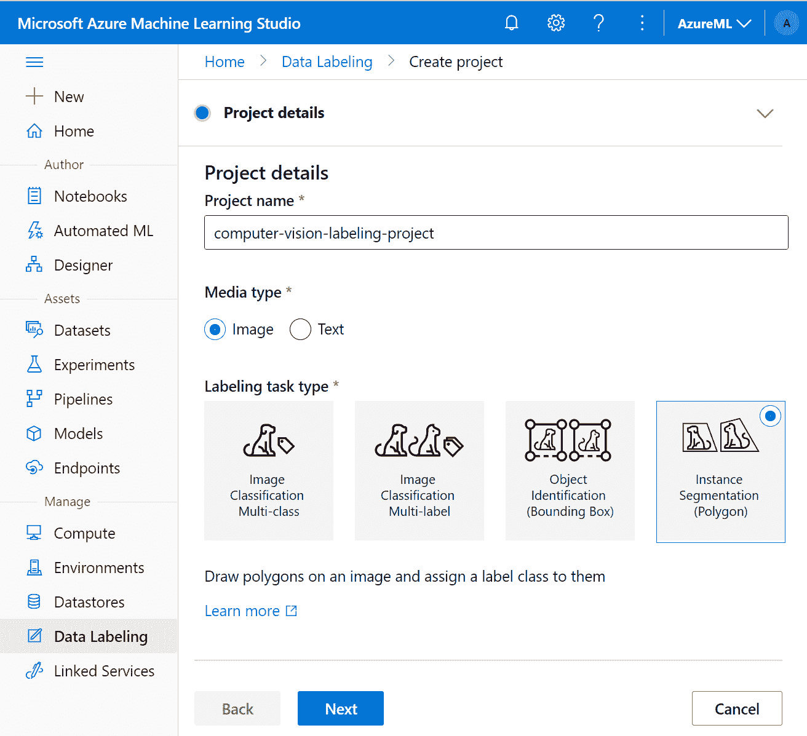
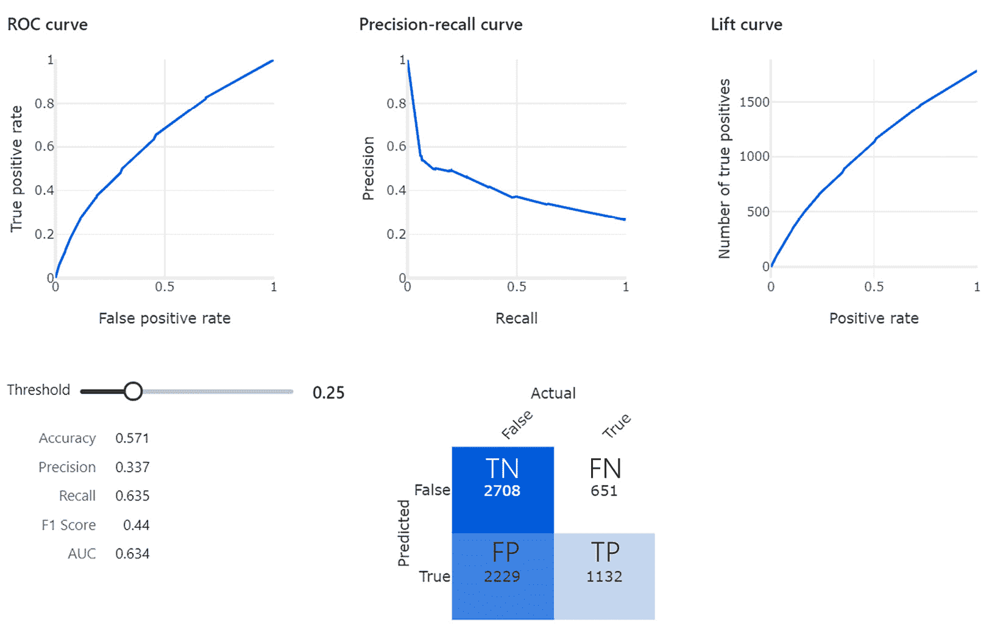
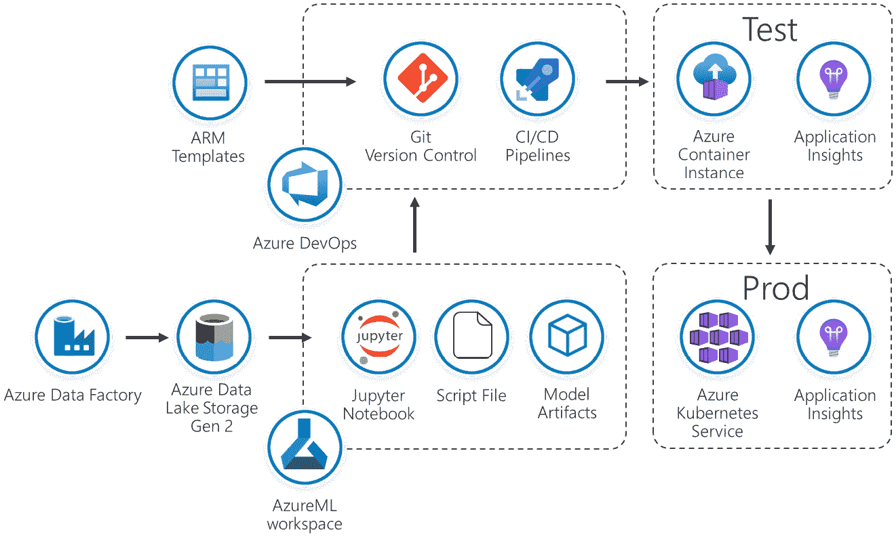
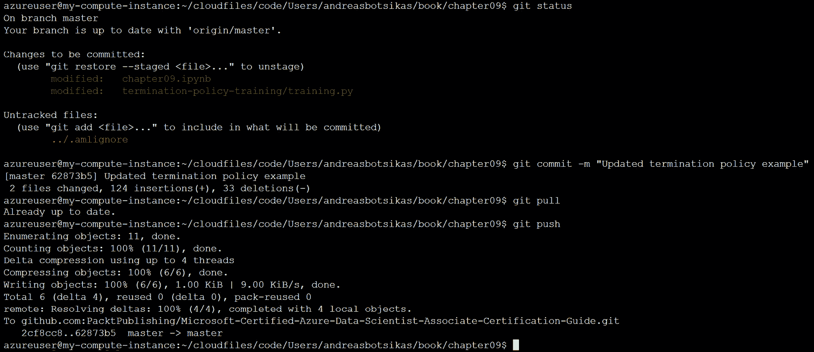

# *第一章*：现代数据科学概述

数据科学起源于 18 世纪初，并在过去几十年里获得了巨大的流行。

在本书中，你将学习如何在 Azure 上运行数据科学项目，Azure 是微软的公共云基础设施。你将掌握成为认证 Azure 数据科学家助理所需的所有技能。你将从本章开始，了解书中贯穿的基础术语。然后，你将深入学习**Azure 机器学习**（**AzureML**）服务。你将首先配置工作区，然后在 AzureML Studio 网页界面中体验无代码、低代码的构建。接着，你将深入学习以代码为主的数据科学实验，使用 AzureML **软件开发工具包**（**SDK**）进行工作。

在本章中，你将学习一些与数据科学相关的基本术语，这些术语是 DP 100 考试所需的。你将从了解数据科学项目的典型生命周期开始。接着，你将阅读有关大数据的内容，并了解 Apache Spark 技术如何帮助你训练机器学习模型。然后，你将探索什么是**DevOps**思维方式，以及它如何帮助你成为一个高效、多学科、敏捷团队的成员，这个团队构建了增强机器学习的产品。

在本章中，我们将涵盖以下主要内容：

+   数据科学的演变

+   进行数据科学项目

+   在数据科学中使用 Spark

+   采纳 DevOps 思维方式

# 数据科学的演变

如果你试图追溯数据科学实践的根源，你可能会发现它的证据可以追溯到文明的初期。18 世纪，政府开始收集人口和财务数据用于征税，这一做法被称为**统计学**。随着时间的推移，这个术语的使用范围扩展到包括对收集的数据进行总结和分析。1805 年，法国数学家阿德里安-玛丽·勒让德发布了一篇论文，描述了用**最小二乘法**拟合线性方程，尽管大多数人将对该方法的完整描述归功于卡尔·弗里德里希·高斯，他在几年后发表了相关内容。1900 年，卡尔·皮尔逊在《哲学杂志》上发布了关于**卡方**统计量的观察，这是数据科学中假设检验的基石。1962 年，因**快速傅里叶变换**和**箱型图**而闻名的科学家约翰·图基，发表了一篇论文，表达了他对数据分析的热情，以及统计学如何需要演变成一门新的科学。

另一方面，随着二十世纪中叶信息学的兴起，**人工智能**（**AI**）领域由约翰·麦卡锡（John McCarthy）于 1955 年首次提出，作为思考机器的官方术语。人工智能是计算机科学的一个领域，旨在开发可以模仿人类智能行为的系统。使用诸如**信息处理语言**（**IPL**）和**列表处理器**（**LISP**）等编程语言，开发人员编写了能够操纵列表和其他各种数据结构以解决复杂问题的程序。在 1955 年，阿瑟·塞缪尔（Arthur Samuel）的跳棋程序是第一款能够通过存储棋盘状态并缓存在该状态下获胜的几率来从已经进行过的游戏中*学习*的程序。这个跳棋程序可能是**机器学习**（人工智能的一个子领域）的第一个例子，机器学习利用历史数据和数据中编码的模式来训练模型，使系统能够模仿人类任务，而无需显式编写整个逻辑。事实上，你可以将机器学习模型看作是通过对数据集训练算法以识别特定类型模式所生成的软件代码。

2001 年，威廉·S·克利夫兰（William S. Cleveland）发表了第一篇文章，其中使用了“**数据科学**”这一术语，这一术语至今仍被我们沿用，指的是处于统计学、数据分析和信息学交叉点的科学，旨在通过数据解释现象。

尽管大多数人将数据科学与机器学习相关联，但数据科学的范围要广泛得多，它包括在实际机器学习模型训练过程之前的数据分析和准备工作，正如你将在下一节中看到的那样。

# 从事数据科学项目

数据科学项目的目标是将从数据中提取的智能融入应用程序中。在本节中，你将发现该类项目中所需的常见任务和关键考虑事项。有许多成熟的生命周期过程，例如**团队数据科学过程**（**TDSP**）和**跨行业标准数据挖掘过程**（**CRISP-DM**），它们描述了在典型项目中执行的迭代阶段。最常见的阶段如*图 1.1*所示：



图 1.1 – 数据科学项目的迭代阶段

尽管图表展示了各阶段之间的某些指示性流动，但如果需要，你可以自由地从一个阶段跳转到任何其他阶段。此外，这种方法是迭代的，数据科学团队应当经过多次迭代，不断改进其业务理解和最终模型，直到满足成功标准。在本章的*采用 DevOps 思维模式*部分，你将进一步了解迭代过程的好处。数据科学过程从业务理解阶段开始，这是你将在下一节中详细阅读的内容。

## 了解业务问题

数据科学项目的第一阶段是业务理解阶段。在这个阶段，数据科学团队与业务利益相关者合作，定义一个简短而直接的问题，机器学习将尝试回答。

*图 1.2* 显示了机器学习可以回答的五个最常见问题：



图 1.2 – 机器学习可以回答的五个问题

在这些问题背后，有一组建模技术你将使用：

+   **回归**模型允许你基于一个或多个特征预测一个数值。例如，在*第八章*《用 Python 代码进行实验》中，你将尝试基于一年之前采集的 10 个测量值，预测你希望获得的数值。训练一个回归模型是一个**监督式**的机器学习任务，这意味着你需要提供足够的样本数据来训练模型，以预测期望的数值。

+   **分类**模型允许你根据一组输入预测一个类标签。这个标签可以是简单的“是/否”标签，也可以是蓝色、绿色或红色等颜色标签。例如，在*第五章*《让机器进行模型训练》中，你将训练一个分类模型，检测客户是否会取消他们的手机订阅。预测一个人是否会停止做某件事，通常被称为**流失**或退订检测。训练一个分类模型是一个监督式机器学习任务，需要一个带标签的数据集来训练模型。带标签的数据集包含了输入和你希望模型预测的标签。

+   **聚类**是一个**无监督**的机器学习任务，用于对数据进行分组。与前两种模型类型不同，聚类不需要任何训练数据。它直接作用于给定的数据集，并创建所需数量的集群，将每个数据点分配到相应的集群中。聚类模型的常见应用是当你试图识别你客户基础中的不同消费群体，以便你可以通过特定的营销活动来针对这些群体。

+   **推荐系统**旨在基于用户的个人资料推荐最佳选项。搜索引擎、电子商店和流行的视频流媒体平台利用这种类型的模型来提供个性化的推荐，帮助用户决定接下来该做什么。

+   **异常检测**模型可以从数据集或数据流中检测异常值。异常值是指那些与其他元素不相符的项目，表示存在异常。例如，如果一台机器的振动传感器开始发送异常测量值，这可能是设备即将故障的良好指示。

在业务理解阶段，你将尝试理解问题陈述并定义成功标准。设定机器学习能够和不能做到的适当预期是确保团队之间一致性的关键。

在数据科学项目中，通常会有多轮的业务理解。数据科学团队在探索数据集或训练模型后会获得很多洞察。将这些洞察带给业务利益相关者，验证你团队的假设，或深入了解你正在解决的问题是非常有帮助的。例如，业务利益相关者可能会解释你在数据中检测到的模式，但你却无法解释其背后的原因。

一旦你掌握了要解决的问题，接下来你需要获取一些数据，进行探索，甚至为其打上标签，更多内容将在下一节中讲解。

## 获取和探索数据

在理解了你要解决的问题后，接下来是收集支持机器学习过程的数据。数据可以有多种形式和格式。它既可以是存储在数据库系统中的结构化表格数据，也可以是存储在文件共享中的文件，如图像等。起初，你可能不知道要收集哪些数据，但你必须从某个地方开始。寻找数据时，一个典型的轶事是，总觉得总有一个 Excel 文件包含了关键信息，你必须不断地去请求，直到找到它。

一旦你找到了数据，你就需要分析它，了解数据集是否完整。数据通常存储在本地系统中，或者存储在**在线事务处理**（**OLTP**）数据库中，你无法轻易访问。即使数据可以访问，也不建议直接在源系统中探索它，因为你可能会意外影响承载数据的底层引擎的性能。例如，针对销售表的复杂查询可能会影响电子商店解决方案的性能。在这种情况下，通常会将所需的数据集导出为某种文件格式，比如最具互操作性的**逗号分隔值**（**CSV**）格式，或者更加优化用于分析处理的**Parquet**格式。然后将这些文件上传到便宜的云存储中，供进一步分析使用。

在 Microsoft Azure 中，最常见的目标要么是存储帐户中的 Blob 容器，要么是 **Azure Data Lake Gen 2** 文件系统中的文件夹，它提供了更加细粒度的访问控制机制。数据复制可以通过使用如 **AzCopy** 或 **Storage Explorer** 等工具以一次性方式进行。如果你想要配置一个可以定期拉取增量新数据的重复过程，你可以使用更高级的工具，如 **Azure Data Factory** 或 **Azure Synapse Analytics** 的管道。在 *第四章*中，*配置工作区*，你将回顾从本地提取数据所需的组件以及你可以从 AzureML 工作区中连接的可用数据存储，以便访问各种数据集。在 *第四章*的 *与数据集一起工作* 部分，你将了解 AzureML 支持的数据集类型，以及如何探索它们以深入了解其中存储的信息。

收集数据时，一个常见的任务是数据清理步骤。在这个过程中，你需要删除重复记录、填补缺失值或修复常见的数据输入问题。例如，你可以通过将 *UK* 记录替换为 *United Kingdom* 来统一国家文本字段。在 AzureML 中，你可以在 *第六章* 中看到的设计器中，或通过你将从 *第七章* 起使用的笔记本体验来执行这些清理操作。尽管你可能会在 AzureML 中开始进行这些清理操作，但随着项目的推进，这些清理活动通常会移到 **Azure Data Factory** 或 **Azure Synapse Analytics** 的管道中，这些管道将数据从源系统中提取出来。

重要提示

在进行数据清理时，要注意 **yak shaving**。术语 *yak shaving* 在 90 年代被创造出来，用来描述一种情形：在处理某项任务时，你意识到必须做另一个任务，这又引发了另一个任务，以此类推。这一系列任务可能会让你偏离原定目标。例如，你可能会发现一些记录在国家文本字段中存在无效编码，但你可以理解参考的国家。于是你决定更改 CSV 文件的导出编码，但你意识到你使用的导出工具已经过时，不支持 UTF-8。这时你开始寻找系统管理员来更新你的软件。与其沿着这个方向走，不如记下需要做的事情，并将其添加到待办事项中。你可以在下次迭代时修复这个问题，那时你会更清楚自己是否真的需要这个字段。

另一个常见的任务是对数据集进行标注，特别是当您需要处理监督学习模型时。例如，如果您正在整理一个数据集来预测客户是否会流失，您需要标记取消订阅的客户记录。一个更复杂的标注案例是当您为社交媒体消息创建情感分析模型时。在这种情况下，您需要获取一批消息，逐一浏览，并为每条消息标记其情感是正面还是负面。

在 AzureML Studio 中，您可以创建标注项目，允许您对数据集的标注工作进行扩展。AzureML 允许您定义文本标注或图像标注任务。然后，您可以邀请团队成员根据给定的指示来标注数据。一旦团队开始标注数据，AzureML 会自动训练一个相应的模型。当模型足够好时，它开始向标注者提供建议，从而提高生产力。*图 1.3* 显示了标注项目创建向导以及当前图像标注任务中的各种选项：



图 1.3 – 创建 AzureML 标注项目

通过此项目阶段，您应已发现相关的源系统，并生成了一个准备好用于机器学习训练的清理数据集。在下一部分，您将学习如何创建其他数据特征，帮助模型训练过程，这一过程称为 **特征工程**。

## 特征工程

在特征工程阶段，您将生成新的数据特征，以更好地表示您要解决的问题，并帮助机器从数据集中学习。例如，以下代码块通过转换销售数据集中的 `product` 列创建一个名为 `product_id` 的新特征：

```py
product_map = { "orange juice": 1, "lemonade juice": 2 }
dataset["product_id"] = dataset["product"].map(product_map)
```

该代码块使用 `map` 方法将文本转换为数值。`product` 列被称为 `橙汁` 或 `柠檬水`。如果您在同一数据集中有一个 1 到 5 的评级特征，那将是一个离散的数值变量，能够取的值是有限的，在本例中只有 *1*、*2*、*3*、*4* 或 *5*。如果您有一个记录客户购买了多少升或多少加仑的列，那么它将是一个 **连续** 数值变量，可以取任何大于或等于零的数值，例如半升。除了数值，日期字段也被视为连续变量。

重要提示

尽管在前面的示例中，`product_id` 特征是一个 **离散** 数值变量，但这类特征通常被当作分类变量来处理，正如您将在 *第五章*《让机器来进行模型训练》中看到的那样。

有许多可用的特征化技术。以下是一个示例列表：

+   **数值特征的标准化**：此技术将所有数值特征转换为可以轻松比较的范围。例如，在*第八章*，*使用 Python 代码进行实验*中，你将基于医学测量数据训练机器学习模型。血糖测量值范围从 80 到 200 mg/dL，而血压测量值范围从 60 到 128 mm Hg。这些数值通过它们的均值进行标准化，这种转换称为标准化或**Z-score**归一化。它们的数值最终会在 -1 到 1 的范围内，这样机器就能提取出更好的洞察。

+   **拆分**：将一列拆分为两个新特征是非常常见的做法。例如，全名会被拆分为姓名和姓氏以便进一步分析。

+   **分箱**：此技术将连续特征分组为不同的组或箱，这可能揭示出有关你正在解决的问题的重要信息。例如，如果你有出生年份数据，可以创建分箱来将不同的代际群体分组。在这种情况下，出生年份在 1965 到 1980 年之间的人将属于*X 代*群体，而出生在 1981 到 1996 年间的人则属于*千禧一代*分组。通常会使用你在*理解商业问题*部分中看到的聚类模型来生成群体并定义这些分箱。

+   对于 `product`，你执行了标签编码。你将类别变量转换为数值变量。标签编码的一个典型例子是 T 恤尺码，其中小号对应*1*，中号对应*2*，大号对应*3*。然而，在 `product` 例子中，你不小心定义了 `橙汁`（`1`）和 `柠檬汁`（`2`）之间的顺序，这可能会让机器学习算法感到困惑。在这种情况下，除了使用示例中产生 `product_id` 特征的顺序编码，你还可以使用独热编码。在这种情况下，你将引入两个二进制特征，分别为*orange_juice*和*lemonade_juice*。这些特征将根据顾客购买的是哪种果汁，接受*0*或*1*的值。

+   **生成滞后特征**：如果你处理的是时间序列数据，可能需要从前一个时间点的值生成特征。例如，如果你尝试预测 10 分钟后的温度，你可能需要当前的温度以及 30 分钟前和 1 小时前的温度。这两个额外的过去温度就是滞后特征，你需要对它们进行特征工程。

    重要提示

    对大数据集进行所有这些转换可能需要大量的内存和处理时间。这时，像 Spark 这样的技术就发挥了作用，通过并行化处理过程。你将在本章的*使用 Spark 进行数据科学*部分了解更多关于 Spark 的内容。

在*第十章*中，*理解模型结果*部分，你将使用来自`sklearn`库的`MinMaxScaler`方法对数值特征进行缩放。

作为特征工程阶段的最后一步，你通常会移除不必要或高度相关的特征，这个过程称为**特征选择**。你将删除那些不会用于训练机器学习模型的列。通过删除这些列，你减少了训练时机器的内存需求，减少了训练模型所需的计算时间，同时生成的模型体积也会更小。

在创建这些特征时，你可能需要返回到*数据获取和探索*阶段，甚至回到*理解业务问题*阶段，以获取更多的数据和见解。然而，某一时刻，你的训练数据集将准备好训练模型，这将在下一节中介绍。

## 训练模型

一旦你准备好数据集，机器学习的训练过程就可以开始。如果模型需要监督学习且你有足够的数据，你可以将数据集按 70%对 30%或 80%对 20%的比例分为训练集和验证集。你选择要训练的模型类型，指定模型的训练参数（称为**超参数**），并训练模型。使用剩余的验证数据集，你根据**指标**评估训练模型的性能，并决定该模型是否足够好，可以进入下一个阶段，或者是否需要返回到*理解业务问题*阶段。监督模型的训练过程如*图 1.4*所示：


](img/B16777_01_004.jpg)

图 1.4 – 训练一个监督学习模型

上述步骤有几种变体：

+   如果模型属于无监督学习类别，例如聚类算法，你只需将所有数据传入训练模型。然后评估检测到的聚类是否满足业务需求，调整超参数，再次尝试。

+   如果你有一个需要监督学习的模型，但没有足够的数据，通常使用**k 折交叉验证**技术。通过 k 折交叉验证，你可以指定要将数据集拆分成的折数。AzureML 使用**AutoML**，如果数据少于 1,000 行，则执行 10 折验证；如果数据集在 1,000 到 20,000 行之间，则执行 3 折验证。一旦你有了这些折，你就开始一个迭代过程，具体步骤如下：

    1.  保留一个折用于验证，并使用其余的折来训练一个新的模型。

    1.  使用保留的折对训练的模型进行评估。

    1.  记录模型得分并丢弃模型。

    1.  重复*步骤 I*，将另一个折保留用于验证，直到所有折都用于验证。

    1.  生成聚合模型的性能。

        重要提示

        在机器学习研究文献中，有一种方法叫做**半监督学习**。这种方法将少量标记数据与大量未标记数据结合起来训练模型。

与其训练一个单一的模型，评估结果后再尝试使用不同的超参数集，你可以自动化这个过程，并行评估多个模型。这个过程叫做超参数调优，你将在*第九章*，*优化机器学习模型*中深入了解。在同一章中，你还将学习如何自动化模型选择，这是一种 AzureML 的功能，称为 AutoML。

**度量标准**帮助你选择使预测值与实际值之间差异最小的模型。它们因训练的模型类型而有所不同。在回归模型中，度量标准试图最小化预测值与实际值之间的误差。最常见的度量标准有**平均绝对误差**（**MAE**）、**均方根误差**（**RMSE**）、**相对平方误差**（**RSE**）、**相对绝对误差**（**RAE**）、**决定系数**（**R²**）和**归一化均方根误差**（**NRMSE**），这些你将在*第八章*，*使用 Python 代码进行实验*中看到。

在分类模型中，度量标准略有不同，因为它们不仅要评估模型正确预测的结果数量，还要评估错误分类的数量。例如，在客户流失的二分类问题中，可能有四种结果：

+   模型预测客户会流失，且客户确实流失了。这被认为是**真阳性**（**TP**）。

+   模型预测客户会流失，但客户保持忠诚。这被认为是**假阳性**（**FP**），因为模型错误地预测了客户会流失。

+   模型预测客户不会流失，但客户流失了。这被认为是**假阴性**（**FN**），因为模型错误地判断了客户会忠诚。

+   模型预测客户不会流失，且客户保持忠诚。这被认为是**真阴性**（**TN**）。

这四种情况构成了**混淆矩阵**，如*图 1.5*所示：



图 1.5 – 分类模型的评估

通过混淆矩阵，你可以计算其他指标，例如**准确率**，它计算评估测试中所有正确结果的总数（在此案例中，**1132** TP + **2708** TN = 3840 条记录与 **2708** + **651** + **2229** + **1132** = 6720 条总记录）。另一方面，**精确度**或**阳性预测值** (**PPV**) 评估实际正确的预测有多少（在此案例中，**1132** TP 与 **1132** + **2229** 总的正确预测）。**召回率**，也称为**敏感性**，衡量有多少实际的真实值被正确分类（在此案例中，**1132** TP 与 **1132** + **651** 总的实际真实值）。根据你要解决的业务问题，你需要在各种指标之间找到平衡，因为某些指标可能比其他指标更有帮助。例如，在 COVID-19 大流行期间，一个模型如果通过召回率为 1 来确定某人是否感染了病毒，会识别出所有感染的患者。然而，它也可能错误地分类了一些未感染的患者，而其他指标，如精确度，则能够捕捉到这一点。

重要提示

当你的模型过于拟合数据时，请留意。这是我们所说的**过拟合**，它可能表示模型在训练数据集中找到了某种在现实生活中不存在的模式。此类模型在投入生产并对未知数据进行推理时，往往表现不佳。过拟合的常见原因是偏倚的训练数据集，它仅暴露了真实世界样本的一部分。另一个原因是目标泄露，即某种方式下，试图预测的值被作为输入传递给模型，可能是通过一个使用目标列工程化的特征。有关如何处理过拟合和不平衡数据的指导，请参阅*进一步阅读*部分。

正如你迄今所见，训练机器学习模型时需要考虑许多因素，在本书中，你将获得一些训练模型的实战经验。在大多数情况下，你首先需要选择将要执行训练过程的计算机类型。目前，你有两个选择，**中央处理单元**（**CPU**）或**图形处理单元**（**GPU**）计算目标。这两种目标至少都包含一个 CPU，因为这是任何现代计算机的核心元素。不同之处在于，GPU 计算目标还提供一些非常强大的显卡，可以执行大规模的并行数据处理，从而加速训练过程。为了利用 GPU，你训练的模型需要支持基于 GPU 的训练。GPU 通常用于神经网络训练，使用的框架包括**TensorFlow**、**PyTorch** 和**Keras**。

一旦你训练了一个满足在数据科学项目的*理解业务问题*阶段定义的成功标准的机器学习模型，就该将其操作化，并开始使用它进行推理了。你将在下一节阅读到这一部分内容。

## 部署模型

在模型操作化方面，你有两种主要方法：

+   **实时推理**：模型始终处于加载状态，等待对传入数据进行推理。典型的使用场景是网页和移动应用程序，这些应用会调用模型来根据用户输入进行预测。

+   **批处理推理**：每次调用批处理过程时，都会加载模型，并基于传入的批记录生成预测。例如，假设你训练了一个模型来识别照片中的你的面部，并且你想要为硬盘上的所有图片打上标签。你将配置一个过程，使用模型对每张图片进行处理，并将结果存储在文本或 CSV 文件中。

这两者之间的主要区别在于你是否已经拥有用于预测的数据。如果你已经拥有数据且这些数据不发生变化，你可以进行批处理推理。例如，如果你想预测下周比赛的足球比分，你可以运行批处理推理并将结果存储在数据库中。当客户请求特定的预测时，你可以从数据库中提取结果。然而，在足球比赛进行时，预测最终比分的模型需要实时获取诸如当前球员数量和受伤情况等特征信息。对于这些情况，你可能想要部署一个暴露 REST API 的 Web 服务，在该服务中，你发送所需的信息，模型则进行实时推理。你将在*第十二章*，*通过代码操作化模型*中深入了解实时和批处理方法。

在这一部分，你回顾了数据科学项目的生命周期，并逐步了解了所有阶段，从理解需要做什么到通过部署批处理或实时服务来实现模型操作化。特别是在实时流处理中，你可能听说过**结构化流处理**这一术语，它是基于 Spark 构建的一个可扩展的处理引擎，允许开发者像在静态数据上执行批处理推理一样执行实时推理。你将在下一节学习更多关于 Spark 的内容。

# 在数据科学中使用 Spark

在 21 世纪初，大数据问题成为现实。数据中心存储的数据在数量和速度上迅速增长。到 2021 年，我们将数据集称为大数据，当它们的大小达到至少几个 TB 时，甚至在大型组织中，PB 级的数据也并不罕见。这些数据集以非常快的速度增长，可能是每天几 GB，甚至是每分钟增长的速度，例如，当你在在线商店中存储用户与网站的交互数据以进行点击流分析时。

2009 年，加利福尼亚大学伯克利分校启动了一个研究项目，旨在提供处理大数据所需的并行计算工具。2014 年，Apache Spark 的第一个版本从该研究项目中发布。该研究团队的成员创办了**Databricks**公司，这是 Apache Spark 开源项目的重要贡献者之一。

Apache Spark 提供了一个易于使用的可扩展解决方案，允许人们以分布式的方式对数据进行并行处理。Spark 架构的核心思想是，驱动节点负责执行你的代码。你的代码被拆分成多个可以在更小数据部分上执行的并行任务。这些小任务会被调度到工作节点执行，如*图 1.6*所示：


图 1.6 – 在 Spark 集群中并行处理大数据

例如，假设你想计算公司在去年销售了多少产品。在这种情况下，Spark 可以启动 12 个任务，分别生成每月的汇总数据，然后这些结果将由另一个任务处理，汇总所有月份的总数。如果你倾向于将整个数据集加载到内存中并直接进行汇总，我们来看看你需要多少内存。假设单月的销售数据存储在一个 1GB 的 CSV 文件中。加载这个文件大约需要 10GB 的内存。压缩后的`pandas.``DataFrame`对象。正如你能理解的那样，同时加载所有 12 个文件到内存中是一个不可能完成的任务。你需要并行处理，而 Spark 可以自动为你完成这个工作。

重要提示

Parquet 文件以列式格式存储，这使得你可以仅加载需要的部分列。例如，在 1GB 的 Parquet 文件中，如果你只加载数据集的一半列，那么你可能只需要 20GB 的内存。这也是 Parquet 格式在分析负载中广泛使用的原因之一。

Spark 是用 Scala 编程语言编写的。它为 Scala、Python、Java、R，甚至 C# 提供了 API。不过，数据科学社区通常在使用 Scala 时，致力于达到最大计算性能并利用 Java 库生态系统，或者使用 Python，这也是现代数据科学社区广泛采用的语言。当你编写 Python 代码来利用 Spark 引擎时，你是在使用 PySpark 工具对后来在 Spark 框架中引入的`Spark.DataFrame`对象进行操作。为了从 Spark 的分布式特性中获益，你需要处理大量数据集。这意味着，如果你处理的记录仅为几十万条甚至几百万条，Spark 可能会显得过于复杂。

Spark 提供了两个机器学习库，旧的`Spark.DataFrame`结构，这是一个分布式数据集合，并提供与 Python pandas 或 R 中使用的`DataFrame`对象类似的功能。此外，`pandas.DataFrame`的操作允许你利用现有的编码技能在 Spark 上进行操作。

AzureML 允许你在 PySpark 上执行 Spark 任务，既可以使用其原生计算集群，也可以通过连接到**Azure Databricks**或**Synapse Spark 池**来实现。尽管本书中你不会编写任何 PySpark 代码，但在 *第十二章*，《使用代码实现模型操作》中，你将学习如何在不需要 Spark 或驱动节点的情况下实现类似的并行化效果。

无论你是在普通的 Python、PySpark、R 还是 Scala 中编程，你都在生成一些代码工件，这些代码很可能是更大系统的一部分。在下一部分，你将探索 DevOps 思维模式，该模式强调软件工程师、数据科学家和系统管理员之间的沟通与协作，以实现更快的有价值产品特性的发布。

# 采纳 DevOps 思维模式

DevOps 是一种团队思维模式，旨在尽量减少开发人员和系统操作员之间的隔阂，从而缩短产品的开发生命周期。开发人员不断修改产品以引入新特性和修改现有行为。另一方面，系统操作员需要保持生产系统的稳定并确保其正常运行。在过去，这两个团队是孤立的，开发人员常常是将新的软件部分“抛”给运营团队，后者会尝试将其部署到生产环境中。正如你所想，事情并不总是那么顺利，导致这两个团队之间出现摩擦。说到 DevOps，一个基本的实践是，团队需要具备自主性，并应包含所有所需的学科，包括*开发人员*和*操作员*。

在数据科学领域，一些人将这项实践称为**MLOps**，但其基本理念保持不变。一个团队应该是自给自足的，能够开发出整体解决方案所需的所有组件，从带入数据的数据工程部分、模型的训练，一直到在生产环境中运营化模型。这些团队通常以**敏捷**的方式工作，采用迭代方法，根据反馈寻求持续改进，正如*图 1.7*所示：


图 1.7 – 敏捷 MLOps 团队中的反馈流程

MLOps 团队根据其待办事项执行迭代步骤，正如你在*数据科学项目工作*部分看到的那样。一旦模型准备好，作为团队一部分的系统管理员会知道需要做些什么来将模型投入生产。模型被密切监控，如果发现缺陷或性能下降，则为 MLOps 团队创建一个待办事项，安排在下一个冲刺中处理。

为了最小化生产中新增特性的开发和部署生命周期，需要拥抱自动化。DevOps 团队的目标是尽量减少部署过程中人工干预的次数，并自动化尽可能多的可重复任务。

*图 1.8*显示了使用 MLOps 思维方式开发实时模型时最常用的组件：



图 1.8 – MLOps 驱动的数据科学项目中常见的组件

让我们分析这些组件：

+   **ARM 模板**允许你自动化 Azure 资源的部署。这使得团队可以快速启动和关闭开发、测试，甚至生产环境。这些构件存储在 Azure DevOps 的 Git 版本控制仓库中。通过 Azure DevOps 管道，多个环境的部署得以自动化。你将会在*第二章*中阅读关于 ARM 模板的内容，*部署 Azure 机器学习工作区资源*。

+   使用**Azure Data Factory**，数据科学团队协调从源系统提取和清洗数据。数据被复制到数据湖中，可以从 AzureML 工作区访问。Azure Data Factory 使用 ARM 模板定义其协调管道，这些模板存储在 Git 仓库中，以便跟踪变更并能够在多个环境中部署。

+   在 AzureML 工作区内，数据科学家正在编写他们的代码。最初，他们开始使用 Jupyter 笔记本。笔记本是一个很好的原型设计工具，正如你在*第七章*，《AzureML Python SDK》中所看到的那样。随着项目的进展，脚本会从笔记本中导出，并整理成编码脚本。所有这些代码制品都会通过 Git 进行版本控制，使用终端和如*图 1.9*所示的命令：



图 1.9 – 在 AzureML 中使用 Git 对笔记本和脚本文件进行版本控制

+   当一个模型经过训练后，如果其性能优于当前生产环境中的模型，它会在 AzureML 中注册，并触发一个事件。这个事件会被 AzureML DevOps 插件捕获，从而触发模型在测试环境中的自动部署。模型会在该环境中进行测试，如果所有测试通过且在**Application Insights**中未记录任何错误（该工具用于监控部署），则可以将制品自动部署到下一个环境，直到生产环境。

确保代码和模型质量的能力在这个自动化过程中起着至关重要的作用。在 Python 中，你可以使用各种工具，如 Flake8、Bandit 和 Black，来确保代码质量、检查常见的安全问题，并保持代码库的一致格式。你还可以使用`pytest`框架编写功能测试，在这些测试中，你将把模型的结果与黄金数据集进行对比。通过`pytest`，你甚至可以执行集成测试，验证端到端系统是否按预期工作。

采用 DevOps 是一项永无止境的旅程。每次重复这个过程，团队都会变得更好。诀窍在于建立对端到端开发和部署过程的信任，让每个人都能自信地做出更改并将其部署到生产环境。当过程失败时，要理解失败的原因，并从错误中吸取教训。创建防止未来失败的机制，并继续前行。

# 总结

在本章中，您了解了数据科学的起源以及它与机器学习的关系。然后，您学习了数据科学项目的迭代性质，并发现了您将要进行的各个阶段。从问题理解阶段开始，您将获取和探索数据，创建新特征，训练模型，然后进行部署以验证您的假设。接着，您看到如何使用 Spark 生态系统扩展大数据文件的处理。在最后一节中，您了解了 DevOps 思维方式，它帮助敏捷团队提高效率，即在短时间内开发和部署新产品功能。您看到 MLOps 驱动的团队中常用的组件，并看到在该图的中心位置，您会找到 AzureML。

在下一章中，您将学习如何部署 AzureML 工作区，并了解在本书中整个数据科学之旅中将使用的 Azure 资源。

# 深入阅读

本节提供了一些有用的网络资源，帮助您扩展对本章中涉及的主题的理解：

+   AzCopy 命令行工具用于将 blob 和文件复制到存储帐户：[`aka.ms/azcopy`](http://aka.ms/azcopy)。

+   Azure Storage Explorer 是一款免费的工具，用于管理所有 Azure 云存储资源：[`azure.microsoft.com/features/storage-explorer/`](https://azure.microsoft.com/features/storage-explorer/)。

+   *《数据湖的搭乘指南》* 是一本详细的指南，涵盖了在构建数据湖时需要考虑的关键事项和最佳实践：[`aka.ms/adls/hitchhikersguide`](https://aka.ms/adls/hitchhikersguide)。

+   使用 AzureML 优化数据处理：[`docs.microsoft.com/azure/machine-learning/concept-optimize-data-processing`](https://docs.microsoft.com/azure/machine-learning/concept-optimize-data-processing)。

+   Koalas 项目：[`koalas.readthedocs.io`](https://koalas.readthedocs.io)。

+   防止模型过拟合并处理不平衡数据的指南：[`docs.microsoft.com/azure/machine-learning/concept-manage-ml-pitfalls`](https://docs.microsoft.com/azure/machine-learning/concept-manage-ml-pitfalls)。

+   针对在 AzureML 和 Azure DevOps 中工作的数据科学家和应用程序开发人员的 MLOps 指南：[`aka.ms/MLOps`](https://aka.ms/MLOps)。
