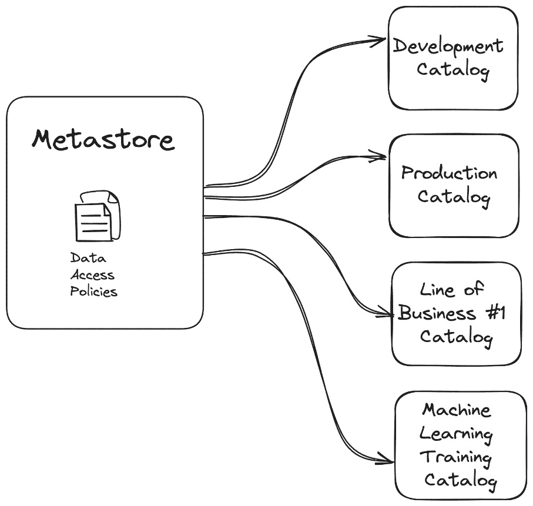
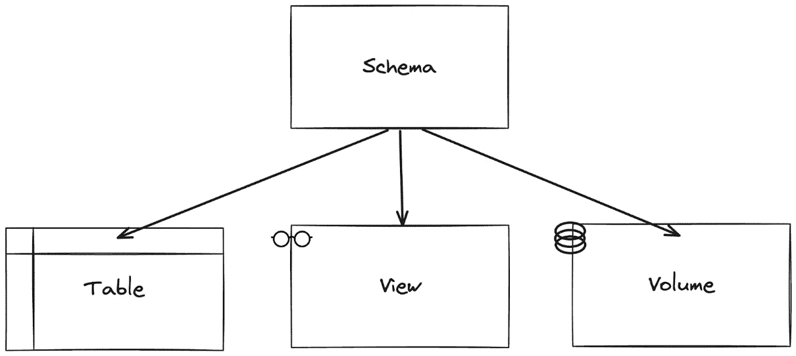
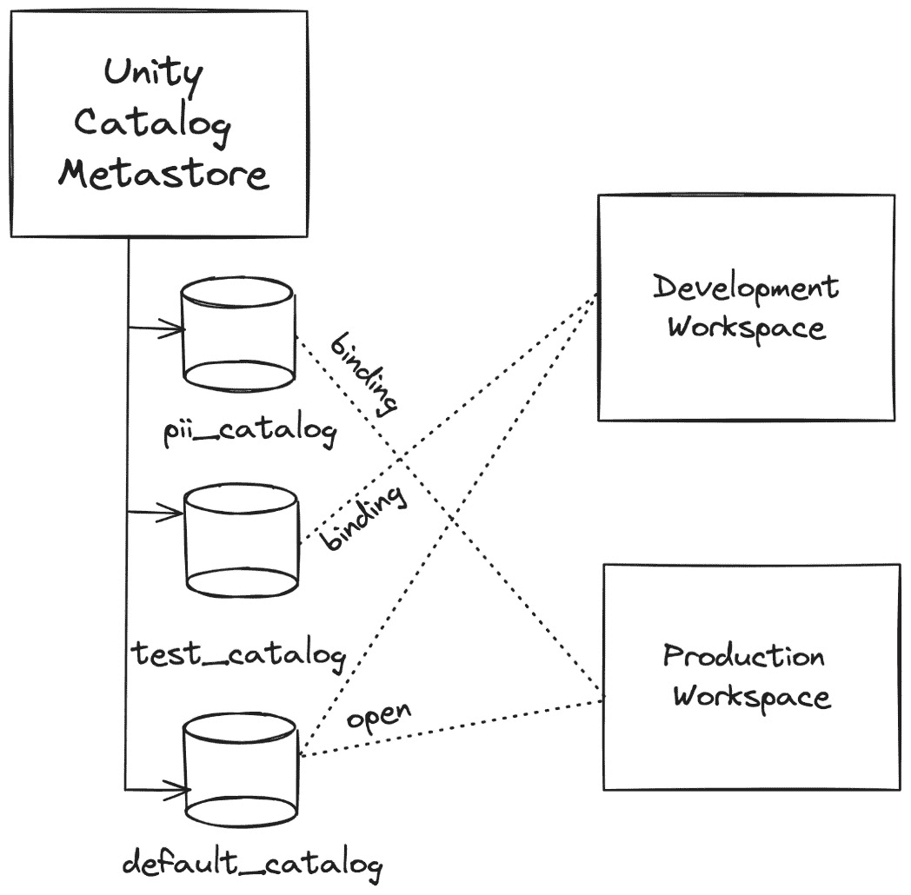
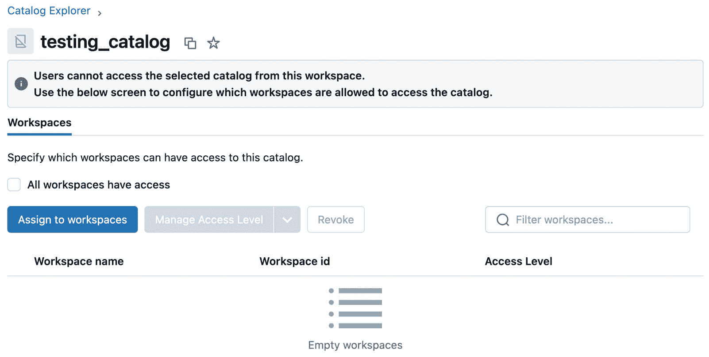
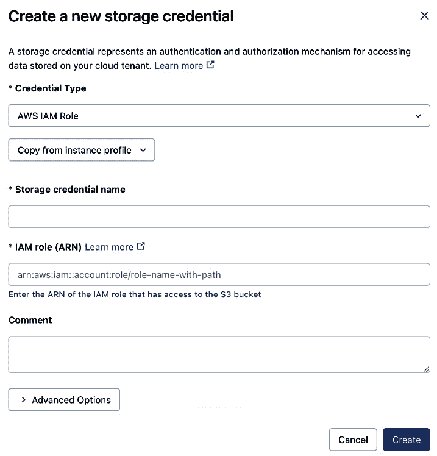
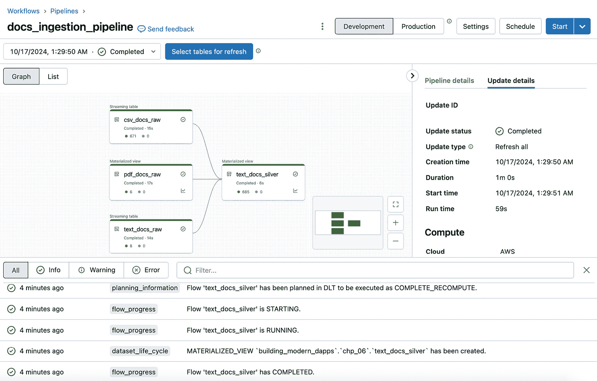

# 在 Unity Catalog 中管理数据位置

在本章中，我们将探讨如何使用**Unity Catalog**中的可安全管理对象有效地管理数据存储位置——这些对象允许管理员授予用户、群组和服务主体细粒度的权限。我们将介绍六种在 Unity Catalog 中存储数据的可安全管理对象：目录、模式、表、卷、外部位置和连接。我们还将探讨如何有效地管理组织内不同角色和部门的数据存储访问，确保在 Databricks 数据智能平台内的数据安全性和可审计性。最后，我们将概述如何在 Unity Catalog 中组织和结构化不同存储位置的数据。

在本章中，我们将涵盖以下主要内容：

+   在 Unity Catalog 中创建和管理数据目录

+   设置 Unity Catalog 中数据的默认存储位置

+   在 Unity Catalog 中创建和管理外部存储位置

+   实践实验 – 为生成性 AI 流水线提取文档文本

# 技术要求

为了跟随本章提供的示例，您需要具备 Databricks 工作区的权限，以便创建并启动一个通用集群，这样您就可以导入并执行本章附带的笔记本。所有代码示例可以从本章的 GitHub 仓库下载，地址为 [`github.com/PacktPublishing/Building-Modern-Data-Applications-Using-Databricks-Lakehouse/tree/main/chapter06`](https://github.com/PacktPublishing/Building-Modern-Data-Applications-Using-Databricks-Lakehouse/tree/main/chapter06)。我们还建议将您的 Databricks 用户提升为元存储管理员（参见*第五章*），这样您就可以添加和删除外部位置、安全凭证、外部连接，并将目录绑定到 Databricks 工作区。本章将创建并运行多个新的笔记本，预计消耗约 5-10 **Databricks** **单位** (**DBUs**)。

# 在 Unity Catalog 中创建和管理数据目录

**目录**是 Unity Catalog 对象模型层次结构中用于存储数据资产的最顶层容器。一个目录将包含一个或多个模式（或数据库），这些模式可以包含一个或多个表、视图、模型、函数或卷。



图 6.1 – 数据通过目录在 Unity Catalog 中进行隔离

一个常见的问题是：“我的工作区应该拥有多少个目录？”虽然没有准确的标准来回答应该为工作区创建多少个目录，但一个好的经验法则是根据自然的划分因素来划分工作区目录，例如业务线、逻辑工作环境、团队或使用案例等。此外，您还应考虑哪些组和用户将拥有使用数据资产的权限，这也是决定如何创建目录隔离时的一个因素。

重要提示

最佳实践是避免创建过少的目录，以至于无法合理地将数据集相互区分。同样，也应该避免在一个工作区内创建过多目录，因为这会让用户在浏览和发现数据集时感到困难。目标应该是找到两者之间的平衡。

元数据存储管理员或 Unity Catalog 中的特权用户，可以授予其他用户在元数据存储中创建附加目录的权限。例如，以下由元数据存储管理员执行的授权语句将授予 Databricks 用户**jane.smith@example.com**在其 Databricks 工作区附加的元数据存储中创建新目录的权限：

```py
GRANT CREATE CATALOG ON METASTORE TO `jane.smith@example.com`;
```

此外，对于 2023 年 11 月 8 日之后创建的 Databricks 工作区，会在 Unity Catalog 元数据存储中创建一个默认工作区目录**<workspace_name>_catalog**。默认情况下，工作区中的所有用户都可以访问此目录并创建数据资产。

## 管理数据与外部数据

当您部署 Unity Catalog 元数据存储时，部署过程的一部分是设置一个新的默认云存储容器，位于元数据存储级别。这个云存储容器作为 Databricks 数据智能平台上创建的所有数据资产的*默认*位置。例如，当用户创建一个新表时，如果他们没有在**数据定义语言**（**DDL**）语句中指定**LOCATION**属性，Databricks 数据智能平台将把表数据存储在默认存储容器中。因此，平台会负责管理此表的生命周期，包括数据文件、元数据，甚至表的特性，如调整表布局和文件大小。这种数据资产被称为*托管*表，因为 Databricks 数据智能平台会管理其生命周期。此外，如果该表被删除，平台将负责移除所有表的元数据和数据文件。

然而，如果用户在 DDL 语句中提供了**LOCATION**属性，则会覆盖默认行为。相反，用户明确指示 Databricks 数据智能平台将数据存储在 Unity Catalog 默认存储容器之外的位置。因此，这种类型的数据资产被称为*外部*表。Databricks 不会管理表的性能特性，例如文件的大小或文件的布局。与托管表不同，如果删除外部表，仅会从 Unity Catalog 中移除表的条目，而表的元数据和数据文件不会从其外部位置中删除。相反，表的所有者需要负责从云位置删除表文件，因为他们已经接管了表生命周期的管理。

一般来说，*托管*表示 Databricks 平台管理生命周期，数据将存储在默认存储容器中；而*外部*意味着对象所有者控制对象生命周期，数据应该存储在外部存储位置。

实际上，您可能有充分的理由希望将数据资产存储在不同于元数据存储（metastore）默认位置的位置。例如，对于包含敏感数据的特权数据集，如**个人身份信息**（**PII**）/**受保护的健康信息**（**PHI**）数据，您可能希望将这些数据集存储在单独的存储账户中。或者，您可能有合同义务要求数据必须单独存储在隔离的存储账户中。无论如何，数据隔离的需求是很常见的。在下一节中，我们将介绍 Unity Catalog 中的另一个可安全管理的对象，允许数据管理员在保持与传统表和视图的强隔离的同时，安全地存储任意类型的数据。

## 将数据保存到 Unity Catalog 中的存储卷

**卷**，即**存储卷**，可用于存储各种格式类型的文件。此外，卷可以与表和视图一起存储在 Unity Catalog 中的模式下。表和视图用于存储结构化数据，而卷可以用来存储结构化、半结构化或非结构化数据。



图 6.2 – 存储卷与表和视图一起存储在 Unity Catalog 中的模式中

卷可以由 Databricks 数据智能平台管理，一旦删除，存储容器及其所有内容将被完全移除。另一方面，卷可以是外部卷，意味着卷的所有者管理存储卷的存储位置，一旦删除，存储容器的内容不会被移除。

存储卷通过消除在 Unity Catalog 中创建和管理外部存储位置及存储凭证对象的开销，简化了文件的存储。而外部位置则需要创建一个伴随的存储凭证，这使得配置和撤销配置稍微复杂一些。

存储卷为特定模式的用户提供了将任意文件存储在由 Databricks 数据智能平台管理的安全存储位置中的灵活性。默认情况下，存储卷将在父模式的默认存储位置中持久化数据。例如，如果在创建模式时没有提供存储位置，则存储卷中的数据将存储在 Unity Catalog 元数据存储的默认存储帐户中。而如果模式在创建时指定了明确的存储位置，则默认情况下，存储卷会将其内容存储在该云位置中。

元数据存储管理员或具有明确权限的特权用户可以在目录中创建或删除存储卷。以下示例授予 Databricks 用户在开发目录中创建存储卷的明确权限：

```py
GRANT CREATE VOLUME
    ON CATALOG development_catalog
    TO `jane.smith@example.com`;
```

完全限定的存储卷路径是通过 **/Volumes/** 后跟目录、模式和卷名称来构建的。例如，可以使用以下路径引用一个任意文本文件：

**/** **Volumes/catalog_name/schema_name/volume_name/subdirectory_name/arbitrary_file.txt**

在前面的示例中，我们让 Databricks 数据智能平台决定如何使用模式、表格、视图和存储卷存储数据。然而，我们也可以为某些可安全控制的对象设置规定的云位置。让我们看看如何使用 Unity Catalog 中的几种技术来控制存储位置。

# 设置 Unity Catalog 中数据的默认位置

您可以使用多种技术来控制 Unity Catalog 中数据的存储位置：

+   **目录级别的默认位置**：在创建新目录时，数据管理员可以指定存储位置。在创建数据资产时，例如创建表格，且未指定位置，则数据将存储在目录位置中。

+   **模式级别的默认位置**：类似地，您可以在模式级别指定默认位置。模式位置将覆盖在目录级别指定的任何默认位置。在创建数据资产时，例如创建表格，且未指定位置，则数据将存储在模式位置中。

+   **表格级别的外部位置**：这是数据管理者对其数据集的最精细粒度的控制。表格位置将覆盖在目录或模式级别指定的任何默认位置。

+   **卷位置**：与外部位置密切相关（见《在 Unity Catalog 中创建和管理外部存储位置》部分），卷允许控制表数据存储在云存储位置的方式。

# 将目录隔离到特定工作空间

默认情况下，当您在 Unity Catalog 中创建目录时，该目录将对元存储管理员可见，允许他们授予用户在使用该元存储的*所有* Databricks 工作空间中访问权限。然而，在某些情况下，您可能希望覆盖此行为，并强制实施更强的数据集隔离。例如，敏感数据集可能只允许在生产工作空间中用于数据管道处理，但不应在较低环境（如开发工作空间）中使用。Unity Catalog 的一个功能，称为**目录绑定**，有助于解决此类场景。通过目录绑定，目录管理员（如元存储管理员或目录所有者）可以控制哪些工作空间可以访问特定目录。对于那些未绑定到特定目录的 Databricks 工作空间，该目录将不会出现在 Catalog Explorer UI 的搜索结果中。



图 6.3 – 目录绑定允许数据管理员控制每个工作空间的数据隔离和隔离级别

此外，数据管理员可以指定可对绑定到特定工作空间的数据集执行的操作类型。例如，假设您希望限制对测试环境中目录内数据集的只读访问。数据管理员可以通过 UI、在 Databricks 数据智能平台中使用 Catalog Explorer，或者通过自动化工具（如 Terraform 或 REST API）更改目录的绑定设置。让我们来看一个示例，如何利用 Databricks REST API 将包含 PII 数据的测试目录绑定到生产工作空间。

首先，让我们通过更新目录的默认设置来开始，使得目录不再可以从所有使用我们 Unity Catalog 元存储的工作空间访问。默认情况下，该属性设置为**开放**，我们希望将目录隔离到指定的工作空间：

```py
import requests
catalog = "testing_catalog"
response = requests.patch(
    f"https://{workspace_name}/api/2.1/unity-catalog/catalogs/{catalog}",
    headers = {"Authorization": f"Bearer {api_token}"},
    json = {"isolation_mode": "ISOLATED"}
)
print(response.json())
```

我们还可以使用 Catalog Explorer 来验证我们的目录隔离模式是否已根据之前的请求进行了更新。从 Databricks 工作空间，导航到左侧菜单中的 Catalog Explorer。接下来，在搜索框中输入目录名称以筛选目录，然后点击目录的名称。在 Catalog Explorer UI 中，验证详细信息，确保名为**所有工作空间均可访问**的复选框不再被选中。



图 6.4 – 目录绑定信息可以通过 Databricks UI 配置

现在，我们的目录不再对元存储管理员开放，以便他们从所有使用 Unity Catalog 元存储的工作区授予访问权限，我们希望将目录仅绑定到我们希望用户访问的工作区。

在下一个示例中，我们将再次使用 Databricks REST API，允许生产工作区的数据管理员为目录中的数据集分配只读访问权限：

```py
response = requests.patch(
    f"https://{workspace_name}/api/2.1/unity-catalog/bindings/catalog/{catalog}",
    headers = {"Authorization": f"Bearer {api_token}"},
    json = {"add": [{
        "workspace_id": <production_workspace_id>,
        "binding_type": "BINDING_TYPE_READ_ONLY"}]
    }
)
print(response.json())
```

重要提示

在前面的示例中，我们提供了工作区标识符，作为绑定 Unity Catalog 中目录到工作区的请求载荷。如果你不确定你的工作区标识符是什么，可以通过检查 Databricks 工作区的 URL 快速找到它。工作区标识符可以在 URL 的第一个 URI 部分中找到，并遵循 **https://<workspace_name>.cloud.databricks.com/o=<workspace_id>** 模式。工作区标识符是紧随 **o=** URL 参数后的数字值。

到目前为止，你应该已经了解目录绑定对数据管理员控制数据访问方式的重要影响，并进一步在 Databricks 数据智能平台中隔离数据集。然而，可能会有一些特定场景，数据管理员需要控制云存储位置，比如在管道处理过程中履行不将数据集共同存储的合同义务。在接下来的部分中，我们将讨论数据管理员如何为数据集分配特定的云存储位置。

# 在 Unity Catalog 中创建和管理外部存储位置

Databricks 的一个强项是数据的开放性，这意味着用户可以连接到存储在各种云原生存储系统中的数据。例如，用户可以连接到存储在 Amazon 的 S3 服务中的数据，并将这些数据与存储在 **Azure Data Lake Storage** (**ADLS**) **Gen2** 存储容器中的另一个数据集进行连接。然而，缺点之一是与这些云原生存储服务的集成需要复杂的配置设置，这些设置通常需要在笔记本执行开始时进行配置，或者可能在集群启动时通过初始化脚本进行配置。这些配置设置非常复杂，至少需要将其存储在 Databricks 密钥中，并且身份验证令牌需要由云管理员轮换——对于一个本应简单的任务（使用 Spark 的 **DataFrameReader** 加载远程数据），这是一种非常复杂的维护生命周期。Unity Catalog 提供的一个关键好处是一个可安全管理的对象，称为 **存储凭证**，它旨在简化这一维护任务，同时允许最终用户存储和连接外部数据集，而这些数据集并不在 Databricks 数据智能平台内。云管理员或元数据存储管理员可以将云服务认证详细信息存储在一个地方，从而避免最终用户（可能并不具备技术背景）需要配置云认证的复杂细节，比如 IAM 角色标识符。为了举例说明这些配置细节可能有多复杂，以下代码片段可以用来配置使用在代码执行过程中设置的配置来进行对 ADLS Gen2 容器的认证：

```py
# Connect to data stored in an ADLS Gen2 container
account_name = "some_storage_account"
spark.conf.set(f"fs.azure.account.auth.type.{account_name}.dfs.core.windows.net", "SAS")
spark.conf.set(f"fs.azure.sas.token.provider.type.{account_name}.dfs.core.windows.net", "org.apache.hadoop.fs.azurebfs.sas.FixedSASTokenProvider")
# Use a Databricks Secret to safely store and retrieve a SAS key for authenticating with ADLS service
spark.conf.set(
    f"fs.azure.sas.fixed.token.{account_name}.dfs.core.windows.net",
    dbutils.secrets.get(scope="sas_token_scope", 
    key="sas_ token_key"))
```

## 使用存储凭证存储云服务认证信息

**存储凭证** 是 Unity Catalog 中的一个可安全管理的对象，它将云原生凭证抽象化，用于访问云存储账户。例如，存储凭证可能代表 **亚马逊网络服务**（**AWS**）云中的 **身份与访问管理**（**IAM**）角色。存储凭证也可能代表 Azure 云中的 **托管身份** 或服务主体。一旦创建了存储凭证，访问该存储凭证的权限可以通过显式授权语句授予 Unity Catalog 中的用户和用户组。与 Unity Catalog 中的其他可安全管理对象类似，Databricks 数据智能平台提供了多种创建新安全凭证的方法。例如，元数据存储管理员可以选择使用 **美国国家标准协会结构化查询语言**（**ANSI SQL**）来创建存储凭证，或者他们可能使用 Databricks UI。



图 6.5 – 可以使用 Databricks UI 创建存储凭证

存储凭证与 Unity Catalog 中的另一个可保护对象**外部位置**配对使用，这种组合用于在特定的云存储帐户中存储和访问数据。


图 6.6 – 存储凭证封装了一个云身份，并由 Unity Catalog 用于访问外部存储位置

您必须是 Databricks 帐户管理员或 Unity Catalog 元数据存储的元数据存储管理员，且该角色包括**CREATE STORAGE CREDENTIAL** 权限。以下示例使用 Databricks **命令行接口**（**CLI**）工具，通过 AWS 中的 IAM 角色在 Unity Catalog 中创建一个新的存储凭证：

```py
databricks storage-credentials create \
  --json '{"name": "my_storage_cred", ' \
  '"aws_iam_role": {"role_arn": ' \
  '"arn:aws:iam::<role_identifier>:role/<account_name>"}}'
```

这次我们使用 SQL API 来授予**数据科学**小组使用凭证访问云存储的权限：

```py
-- Grant access to create an external location using the storage cred
GRANT CREATE EXTERNAL LOCATION
    ON STORAGE CREDENTIAL my_s3_bucket_cred
    TO `data-science`;
```

然而，Databricks 数据智能平台外部的存储容器可能并不是您希望从湖仓连接的唯一数据源。例如，可能会有某些场景，您可能需要连接到外部系统，例如现有的数据仓库或关系型数据库，以交叉引用数据。让我们将注意力转向**Lakehouse Federation**，它允许湖仓用户查询 Databricks 数据智能平台之外的数据集。

## 使用 Lakehouse Federation 查询外部系统

Lakehouse Federation 是 Databricks 数据智能平台中的一项功能，允许用户在不需要将数据迁移到湖仓的情况下，对外部存储系统执行查询。Unity Catalog 中的另一个可保护对象，称为**连接**，可以用来将查询联合到外部系统。连接代表与外部系统的*只读*连接，如**关系型数据库管理系统**（**RDBMS**），例如 Postgres 或 MySQL，或是像 Amazon Redshift 这样的云数据仓库。这是一种快速查询外部数据的方法，可以在湖仓中快速原型化新的管道。也许，您甚至需要交叉引用一个外部数据集，但又不想立即经过创建另一个**提取、转换和加载**（**ETL**）管道的繁琐过程来引入新的数据源。

可以通过导航到 Databricks 数据智能平台中的 Catalog Explorer，展开**连接**窗格，并点击**外部连接**来查看所有连接的列表，查看先前创建的连接的详细信息。

让我们看一个例子，展示如何使用 Databricks 中的 SQL 连接 API 创建一个新的外部连接到 MySQL 数据库。Databricks 建议将所有凭据存储在 Databricks 密钥库中，并通过 **secret()** SQL 函数轻松地从 SQL 中检索，提供密钥库范围和密钥：

```py
CREATE CONNECTION my_mysql_connection TYPE mysql
OPTIONS (
    host '<fully_qualified_hostname>',
    port '3306',
    user secret('mysql_scope', 'mysql_username'),
    password secret('mysql_scope', 'mysql_password')
)
```

接下来，通过点击左侧导航栏中的目录资源管理器，展开 **外部数据** 面板，点击 **连接** 菜单项，导航到 **连接** 界面。此时，你应该能看到新创建的 MySQL 数据库连接，点击它将显示关于连接的详细信息。


图 6.7 – 可以从目录资源管理器查看连接到外部存储系统的情况

让我们将之前各节所学内容结合起来，构建一个现代数据管道，以支持生成式 AI 的应用场景。

# 动手实验 – 提取文档文本以用于生成式 AI 管道

在这个例子中，我们将展示一个典型的管道，旨在提取文档中的文本，用于生成式 AI。这是一个非常常见的架构模式，特别适用于诸如训练聊天机器人等实际应用场景。在过程中，我们将看到 Databricks 数据智能平台上的存储卷如何非常适合处理来自外部云存储位置的任意文件。所有代码示例可以从本章的 GitHub 仓库下载，地址为 [`github.com/PacktPublishing/Building-Modern-Data-Applications-Using-Databricks-Lakehouse/tree/main/chapter06`](https://github.com/PacktPublishing/Building-Modern-Data-Applications-Using-Databricks-Lakehouse/tree/main/chapter06)。

## 生成虚拟文档

数据管道的第一步将是生成任意文本文件以提取文本的过程。让我们开始在 Databricks 工作区中创建一个新的笔记本，用于训练我们组织的聊天机器人。以下代码示例使用流行的 **faker** Python 库来随机生成文档内容，并使用 **reportlab** Python 库生成 PDF 文件。

首先，使用 **%pip** 魔法命令在第一个笔记本单元中安装库依赖项：

```py
%pip install faker reportlab
```

## 定义辅助函数

让我们定义几个辅助函数，这些函数将接收随机生成的段落文本并将其保存为文档。我们将定义三个辅助函数——每个文档格式类型一个辅助函数——纯文本、**可移植文档格式**（**PDF**）和**逗号分隔** **值**（**CSV**）：

1.  让我们定义一个纯文本文件的辅助函数：

    ```py
    from shutil import copyfile
    def save_doc_as_text(file_name, save_path, paragraph):
        """Helper function that saves a paragraph of text as a text file"""
        tmp_path = f"/local_disk0/tmp/{file_name}"
        volume_path = f"{save_path}/{file_name}"
        print(f"Saving text file at : {tmp_path}")
        txtfile = open(tmp_path, "a")
        txtfile.write(paragraph)
        txtfile.close()
        copyfile(tmp_path, volume_path)
    ```

1.  接下来，我们定义一个用于 PDF 文件的辅助函数：

    ```py
    def save_doc_as_pdf(file_name, save_path, paragraph):
        """Helper function that saves a paragraph of text as a PDF file"""
        from reportlab.pdfgen.canvas import Canvas
        from reportlab.lib.pagesizes import letter
        from reportlab.lib.units import cm
        tmp_path = f"/local_disk0/tmp/{file_name}"
        volume_path = f"{save_path}/{file_name}"
        canvas = Canvas(tmp_path, pagesize=letter)
        lines = paragraph.split(".")
        textobject = canvas.beginText(5*cm, 25*cm)
        for line in lines:
            textobject.textLine(line)
            canvas.drawText(textobject)
        canvas.save()
        print(f"Saving PDF file at : {tmp_path}")
        copyfile(tmp_path, volume_path)
    ```

1.  最后，我们定义一个用于 CSV 文件的辅助函数：

    ```py
    def save_doc_as_csv(file_name, save_path, paragraph):
        """Helper function that saves a paragraph of text as a CSV file"""
        import csv
        tmp_path = f"/local_disk0/tmp/{file_name}"
        volume_path = f"{save_path}/{file_name}"
        print(f"Saving CSV file at : {tmp_path}")
        with open(tmp_path, 'w', newline='') as file:
            writer = csv.writer(file)
            writer.writerow(["Id", "Sentence"])
            i = 1
            for line in paragraph.split("."):
                writer.writerow([i, line])
                i = i + 1
        copyfile(tmp_path, volume_path)
    ```

这是一种很好的方式来模拟你所在组织随着时间的推移可能会积累的各种文档。

## 随机选择文件格式

接下来，我们需要随机选择文件格式来保存生成的文档。首先，我们导入 **faker** 库和一些 Python 实用库，这些库将帮助我们创建不可预测的行为。我们还将定义一些全局变量，用于确定我们随机生成文档的特征，比如要生成的文档数量、每个文档生成的句子数量，以及存储文档的文件格式类型。将以下代码片段添加到笔记本中：

```py
from faker import Faker
import time
import random
Faker.seed(631)
fake = Faker()
# Randomly generate documents
num_docs = 5
num_sentences_per_doc = 100
doc_types = ["txt", "pdf", "csv"]
volume_path = f"/Volumes/{catalog_name}/{schema_name}/{volume_name}"
```

接下来，让我们创建一个简单的 **for** 循环，作为我们随机文档生成器的主干。在 **for** 循环中，我们将使用 **faker** 库生成一段随机文本，文本中的句子数量等于由我们全局变量 **num_sentences_per_doc** 设置的数量：

```py
for _ in range(num_docs):
    paragraph = fake.paragraph(nb_sentences=num_sentences_per_doc)
```

在生成了一段随机文本后，就该选择以哪种文件格式存储文本了。我们将利用 **random** Python 库，从 **doc_types** 全局变量中定义的文件格式列表中随机选择一种文件格式类型。将以下代码片段添加到 for 循环体内：

```py
    # Randomly choose a document format type
    doc_type = doc_types[random.randrange(2)]
    print(doc_type)
    if doc_type == "txt":
        doc_name = f"{fake.pystr()}.txt"
        save_doc_as_text(doc_name, volume_path, paragraph)
    elif doc_type == "pdf":
        doc_name = f"{fake.pystr()}.pdf"
        save_doc_as_pdf(doc_name, volume_path, paragraph)
    elif doc_type == "csv":
        doc_name = f"{fake.pystr()}.csv"
        save_doc_as_csv(doc_name, volume_path, paragraph)
```

最后，我们将添加一个休眠定时器来模拟文本文档生成中的不可预测的高峰和低谷——这是在典型的生产环境中可能出现的现象。将以下代码片段添加到 for 循环体的底部：

```py
    # Sleep for a random interval
    sleep_time = random.randint(3, 30)
    print(f"Sleeping for {sleep_time} seconds...\n\n")
    time.sleep(sleep_time)
```

在笔记本的全局变量部分，你还会注意到，我们已经为我们的过程定义了一个卷路径，用于保存随机生成的文档：

**volume_path =** **f"/Volumes/{catalog_name}/{schema_name}/{volume_name}"**

这是一种方便的方式，可以将云存储位置引用为本地存储路径。而且，我们还享受 Unity Catalog 存储卷所带来的强大数据治理优势。例如，所有数据默认都是安全的，其他用户或进程在我们获得存储卷访问权限之前无法读取这些文档。最后，让我们将新笔记本附加到 Databricks 数据智能平台上一个正在运行的通用集群，并点击笔记本顶部的 **Run all** 按钮，开始生成并保存新文档到我们的存储卷位置。

## 创建/组装 DLT 管道

现在我们已经生成了一些文本文档，接下来让我们创建一个新的 DLT 管道，该管道将流式传输随机生成的文档并执行简单的文本提取。从本章的 GitHub 仓库中导入名为**Preprocess Text Documents.py**的笔记本到你的 Databricks 工作区。你会注意到我们定义了三个新的流式表，这些表负责摄取随机生成的文本、PDF 和 CSV 文档。在进行最小的预处理后，这些数据源的文本字段被提取并在第四个表格**text_docs_silver**中进行合并。这个第四个表将作为我们聊天机器人训练的输入：

```py
@dlt.table(
    name="text_docs_silver",
    comment="Combined textual documents for Generative AI pipeline."
)
def text_docs_silver():
    text_docs_df = dlt.read("text_docs_raw").withColumn(
        "type", F.lit("text"))
    csv_docs_df = dlt.read("csv_docs_raw").withColumn(
        "type", F.lit("csv"))
    pdf_docs_df = dlt.read("pdf_docs_raw").withColumn(
        "type", F.lit("pdf"))
    combined_df = text_docs_df.union(csv_docs_df).union(
        pdf_docs_df)
    return combined_df
```

在将笔记本连接到正在运行的集群后，系统将提示你创建一个新的 DLT 管道。继续创建一个全新的 DLT 管道（在*第二章*中介绍），并为管道命名一个有意义的名称，例如**doc_ingestion_pipeline**。选择处理模式为**Triggered**，产品版本选择**Core**，其余选项保持默认设置。最后，点击**Start**以开始更新执行新创建的 DLT 管道。



图 6.8 – 一个 DLT 管道的概述，提取保存在 Unity Catalog 中的卷位置的任意文档的文本。

你应该能看到 DLT 管道正在增量处理随机生成的文本文档，从每种不同的文件类型中提取文本，并将它们合并成一个下游的汇总数据集。这是一个简单而强大的例子，展示了如何将 DLT 与 Unity Catalog 中的存储卷结合起来，在真实世界的使用案例中处理任意文件格式。

# 总结

在本章中，我们介绍了多种存储数据的方法，同时通过 Unity Catalog 中的不同可安全对象保持细粒度的访问控制。我们讲解了如何使用 Unity Catalog 中的目录、模式、表、视图、卷和外部位置来存储数据。我们还看到组织如何将目录绑定到单个 Databricks 工作区，以隔离数据集，甚至设置只读的访问权限。我们讨论了 Databricks 数据智能平台中受管数据集的区别，以及如何使用目录、模式、表、卷和外部位置设置存储位置来存储数据。我们介绍了如何使用 Lakehouse Federation 在不迁移数据的情况下直接查询外部数据源，如数据仓库。最后，我们通过一个实践操作，展示了如何实现生成式 AI 管道的开始，利用 Unity Catalog 中的卷提取文档中的文本。

现在我们已经为存储数据和其他资产打下了坚实的基础，在下一章中，我们将介绍如何在 Databricks 数据智能平台中跟踪各个对象的血统。
