# 7

# 有效地可视化数据

*一图胜千言*，这句古老的格言常被引用。视觉表达通常是传达数字信息的首选方式。正如你从自己的经验中可以验证的那样，数据图表在商业备忘录、演示文稿、报纸文章和科学论文中无处不在。然而，从表格中的数据转化为图形表达（这一过程称为**数据可视化**）远非简单且无风险。尽管许多软件（包括 Power BI、Excel、KNIME 等）提供了快速创建图表的方式，但制作有效且具有专业外观的视觉效果远非易事：它需要结构化的规划和有纪律的执行。

本章将为你提供一套实用的指导方针，确保通过有效的数据可视化过程清晰地传达商业信息。具体来说，我们将探讨以下问题：

+   有哪些类型的图表可供选择，它们各自有什么特点？

+   根据我想要传达的具体信息，应该使用哪种图表？

+   我如何确保视觉效果直接且不易产生误解？

+   在可视化数据时需要避免的常见陷阱是什么？

在上一章我们聚焦于 Power BI，而在本章中，我们将学习一些适用于*任何*能够生成视觉效果的软件的技巧：实际上，把数据可视化看作一种工具无关的技能，是你在数据分析师工具包中必须具备的能力。

本章的流程涵盖了数据可视化的两个基本阶段。第一步是规划我们的图表，考虑我们想要表达的具体观点，以及哪些图表类型最适合我们的需求。然后，我们进入构建图表的阶段，包括微调视觉属性、打磨各个图形元素，并避免常见的错误：这一部分将总结为一份实际的数据可视化质量规则清单。在进入规划阶段之前，我们快速框定一下数据可视化的普遍需求。

# 什么是数据可视化？

虽然数据可视化的基本概念很简单，但我们还是需要花些时间来合理地设定场景。数据可视化的核心目标是将基于数据的信息传递给另一个人。有效进行这一沟通过程意味着接收者能够理解原始的基于数据的信息，并通过认知“理解”它。*图 7.1* 展示了一个传递数据消息失败的图示：将所有数据按原始格式呈现。

![文本]

图像描述自动生成

图 7.1：以原始格式呈现数据：如你所见，决策者明显感到不知所措，并且大多数数据被忽视了。

这里的决策者显然被如此大量的原始数据所压倒。这是可以理解的：每个人的认知能力都是有限的，我们的大脑一次只能处理一定量的信息。如果我们试图同时呈现过多数据，便会超出接收者的认知极限，导致他们得到的只是原始信息的部分或扭曲版本。结果，我们的初衷要么被忽视，要么——更糟糕——被误解。坏消息是，无论我们面对的是谁，无论他们有多聪明，能理解的有效信息总是有限的：其余的将被简单地忽略。

另一个坏消息是，如果有几个人在查看相同的数据，他们的“收获”将会有所不同，因为他们各自的敏感性会让他们关注原始数据的不同切片或方面。好消息是，我们有一种已建立的有效沟通数据的方法：将数据转化为一种抽象的可视化形式，传达我们希望传递的关键内容。这就是数据可视化的核心所在。

数据可视化之所以强大，是因为它利用了我们大脑最发达的功能之一：视觉。作为自然进化的一部分，人类一直依赖眼睛来执行生命中至关重要的活动，如寻找食物来源和识别关键威胁。因此，我们的大脑不断优化其视觉能力。正如罗切斯特大学医学光学教授大卫·威廉姆斯所注意到的，现在大脑皮层（大脑表面）中超过 50% 的部分参与处理视觉信息：这比所有其他四种感官加起来还多！大脑可以迅速通过识别一些关键特征（如大小、颜色、曲率、位置、坡度等）来解读图像，这些特征是我们不加意识努力就能本能察觉的。它们被称为注意前属性，我们在数据可视化中广泛利用这些特性。

在*图 7.2*中，你可以看到数据可视化的潜在用途：通过将数据（即使是大量数据，经过适当筛选和聚合）编码成图形摘要，决策者的认知能力得到了最充分的利用，且接收到的信息是明确无误的：

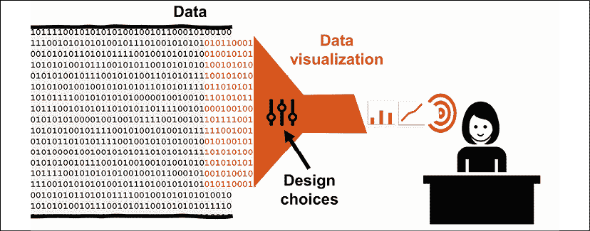

图 7.2：通过可视化呈现数据：通过选择正确的设计方案，决策者可以轻松理解你的信息

如图所示，数据可视化就像一个可定制的漏斗，正确使用需要一些调整。事实上，并没有一种唯一的方式来可视化相同的数据：通过做出一些设计选择（如图表类型、要以图形方式编码的度量、视觉属性等），你可以“调整”漏斗，使其最适合实现你的精确沟通目标。你的责任是做好这个调整。需要注意的是，这些设计选择并非仅仅出于美学需求。图表中的每一个视觉模式都有其含义，并且会被我们的脑海解读，我们本能地会在其中识别出一些视觉线索（先觉属性）。每一个图形元素都占用了部分认知能力，因此除非它在我们的沟通目标中有意义，否则我们不会使用任何视觉线索。正如我们稍后会深入了解的，数据可视化的口号是*少即是多*，而*简约*无疑是最佳的选择。

尽管漏斗的类比是对现实的粗略简化（数据可视化不仅仅是“压缩”数据），但它很好地描绘了我建议你在可视化数据时保持的思维方式。记住这一点：要将数据转化为直观、具有影响力且不含糊的视觉效果，你必须做出正确的*设计*选择。你需要像设计师一样思考。在这一章中，你将扮演图中“漏斗操作者”的角色，即决定如何根据要传达的特定信息来表现数据的视觉设计师。你将学会如何为你的图表始终如一地做出正确的设计选择。

现在，场景已经设定，你作为视觉设计师的角色也揭晓了，接下来让我们进入规划阶段，在这一阶段我们将做出一些关键的设计选择。

# 每个信息都有一个合适的图表类型

每一个图表背后的终极目标应该是传达一个精准的基于数据的信息。不出所料，当我们规划图表时，首先要做的就是决定我们要传递的具体信息。你可以把这个信息看作是对某个特定业务问题的回答，比如*品牌 X 的市场份额是否持续增长？*或*收入与服务价格之间有何关联？*。尽管业务问题往往模糊且多面，但在大多数情况下，它们属于以下三种类型之一：

+   **演变**：这些问题涉及随着时间推移数量的变化。如果你的业务问题包含像*增长*、*下降*、*增加*、*减少*、*加速*、*减速*、*落后*、*滞后*、*超越*或*趋势*等词汇，那么它很可能属于**演变**类型。这是数据图表回答的最常见问题之一，因为理解业务绩效指标如何演变是无处不在的需求。

+   **大小**：这些问题询问的是组成部分相对于整体的比例（也称为**部分与整体**）或在可比数量中的排名。你可以在此类问题中找到的典型词汇包括*驱动因素*、*消耗因素*、*高*、*低*、*顶部*、*底部*、*最大*、*最小*，以及——通常——所有以*est*结尾的最高级形容词。每当我们涉及基准、排名、比较或深入分析组成部分时，我们都会提出与大小相关的商业问题。

+   **关系**：这类问题探讨不同指标之间的相互关系。当我们使用诸如*相关*、*共同增长/下降*等词汇时，通常是在询问一个数量如何*相对于另一个数量*发生变化，这类问题就属于这一类型。

*表 7.1* 提供了按每组分类的商业问题示例列表。看完后，想想你最近在工作中参与的一些问题：很有可能你会在这三类中的每一类中找到相关的示例。

| 信息类型 | 商业问题示例 |
| --- | --- |
| 演变 | 销售是在增加还是减少？变化速度如何？ |
| 趋势是否有加速或减缓？ |
| 我们在消费中是否看到季节性变化？ |
| 尺寸 | 哪些产品推动了销售增长？ |
| 哪些品牌是我最大的竞争对手？ |
| 我的竞争对手在哪个产品线中赚取的利润最多？ |
| 销售流失方面最重要的机会是什么？ |
| 关系 | 利润如何随着包装尺寸的增加而分布？ |
| 可支配收入在全国范围内是如何分布的？ |
| 不同品牌之间价格与盈利能力有关系吗？ |

表 7.1：按信息类型组织的一些商业问题示例

确定你想要传达的商业信息类型是规划数据可视化设计的必要初步步骤。事实上，每种信息类型（演变、大小或关系）都对应一个或多个匹配的图表类型，如*图 7.3*所示。图中，每一行表示一种基本的图表类型（**柱状图**、**折线图**、**树图**和**散点图**）：它们有一组备选的呈现方式，你可以根据具体情况考虑使用：

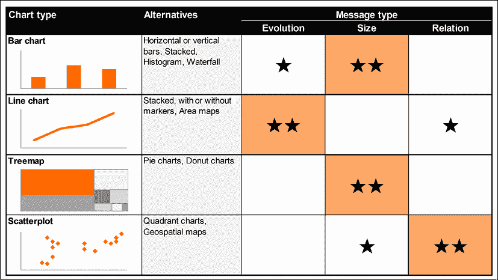

图 7.3：图表选择矩阵：每种信息类型都有其偏好的图表类型。两个星号是显而易见的匹配，但一个星号的组合也可以很好地工作

我希望你能发现图表选择矩阵简单易记，因为它可以成为你根据所要传达的消息快速决定使用何种图表类型的最佳助手（通过这样做，你可以回答你当时面临的商业问题）。你应该考虑到，市面上有更多的图表类型，有些具有很强的视觉吸引力；然而，超过 90%的情况下，你仅使用这个简单的图表类型列表就能传达清晰的信息。坚持使用这些已知图表的另一个好处是，商业伙伴们自然能够识别这些图表并知道如何解读它们，从而使你的信息——记住数据可视化的终极目标——更加简洁和直接。

在介绍了四种图表类型及其选择时机后，我们来逐一了解每种类型及其最佳使用方式。对于每种图表类型，你将看到一个简要描述，包含它是什么样的，提供一些视觉示例，并列出一系列规则（这些规则会以**粗体**突出显示），在构建这种图表时可以随时参考。

## 条形图

条形图（*图 7.4*）可能是地球上最具代表性的图表类型。对于横轴上的每个类别，你都有一个或多个条形，其长度与要可视化的数量成比例。长度是一个非常直观的预注意属性：大脑会自然地感知每个条形之间的相对大小差异。这使得条形图特别适合传递关于不同大小的商业实体（如品牌、产品或国家）的信息，便于快速比较、排名和基准测试（尤其是当条形按高度排序时，这是通常推荐的做法）。类别也可以是时间段，如月份、季度或年份：这就是为什么条形图也用于展示随时间变化的信息（当然，在这种情况下，你不应该对条形进行排序，始终保持自然的时间顺序）。

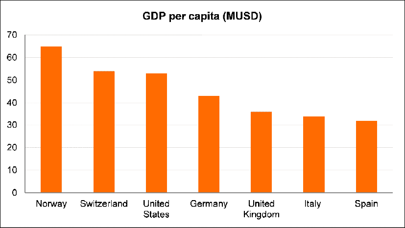

图 7.4：一张简单的条形图：你可以一眼看出不同国家的 GDP 水平。

使用条形图时需要牢记的一个简单规则是，**比例尺应始终从零开始**。如果不这样做，条形图的长度就不再与我们希望显示的实际值成比例：这会欺骗观众的眼睛，误用了长度这一预注意属性。例如，看看*图 7.5*：德国人均 GDP 看起来只有挪威的一半，而实际上约为其三分之二：

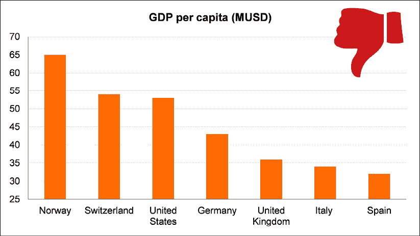

图 7.5：在条形图中，条形应始终从零开始（而不是像这个例子中从 25 开始）

这种图表的一种有趣变体是**横向条形图**：通常情况下，横向条形比纵向条形更好，尤其是当类别很多或标签较长时。看一下*图 7.6*中的例子：国家名称不需要倾斜（节省读者的脖子），而且条形可以更长，这样能更容易地比较不同国家之间的差异：

图 7.6：横向条形图：更好地利用视觉空间的简单方式

当你有另一个类别变量需要编码时，可以使用**堆叠条形图**。如*图 7.7*所示，每个子类别（在这个例子中是国家内的部门）作为图表的一部分显示，用不同的颜色突出显示。通过这种方式，你可以展示每个组件相对于整个条形的大小，并且还可以进行国家/部门组合的比较。建议仅在需要编码的子类别较少时使用（理想情况下不超过四个）；否则，读者很难辨认每个条形部分：

图 7.7：堆叠条形图：通过使用颜色可以区分子类别

需要考虑的条形图系列中的另一个扩展是**直方图**：这本质上是一个条形图，展示了通过分组范围的频率分布。请看*图 7.8*中的例子。这个图表告诉我们，价格落在 €5.8 到 €5.9 区间内的频率最高：

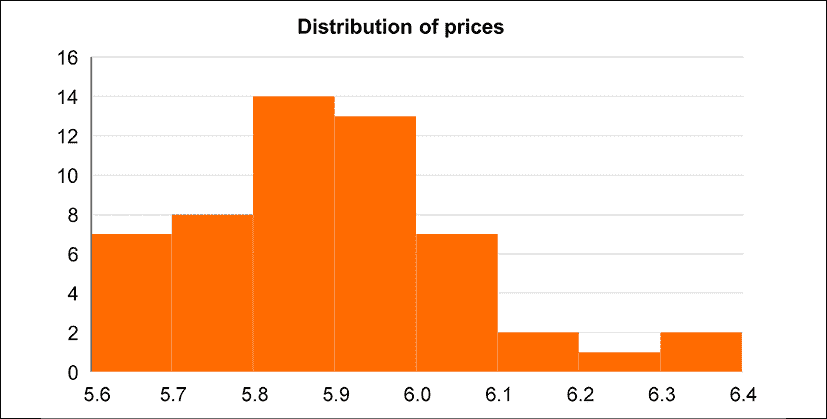

图 7.8：直方图：你可以轻松看到落在等大小范围内的值的频率

最后，条形图的另一种有用变体是**瀑布图**。这种图表非常适合展示前后对比中的正负变化成分，就像*图 7.9*中显示的 GDP 变化：

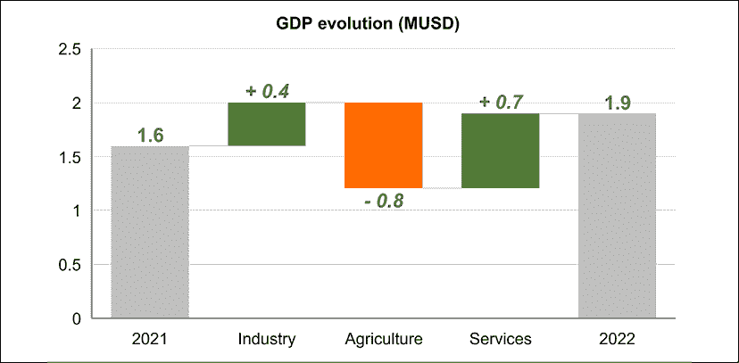

图 7.9：瀑布图：你可以揭示变化的推动因素和抑制因素

## 折线图

折线图是展示数量随连续变量（如时间）变化的最自然方式。一个典型的案例是*图 7.10*：这条线是通过“连接点”得出的，连接了在纵轴上显示的不同销售值（在这种情况下，不需要像条形图那样从零开始），而横轴则表示时间值，按等间隔排列。数据点之间的连接线利用斜率这一预注意属性来传达数量是*上升还是下降*，以及变化速度：

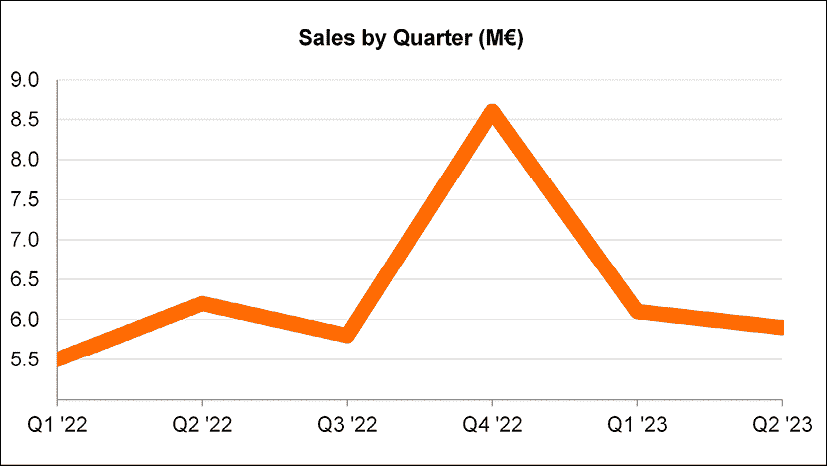

图 7.10：折线图的结构：连续变量（在大多数情况下是时间）位于横轴上

虽然最常见的情况是展示随时间的演变，但你也可以使用折线图来绘制任何连续变量的趋势。例如，如果你想展示不同价格点的销售产品数量，你可以将价格设置为横轴，观察随着价格的提高，销售如何下降。在任何情况下，**切勿在折线图的横轴上使用类别变量**。原因很简单：在折线图中，大脑将线条的坡度与相邻元素之间的变化联系起来，比如两个随时间连续的点。以*图 7.11*为例：意大利和挪威之间没有逻辑上的连续性（除了字母顺序，这对我们的信息没有意义），因此我们在两国之间看到的陡峭上升既是人为的，也是令人困惑的：

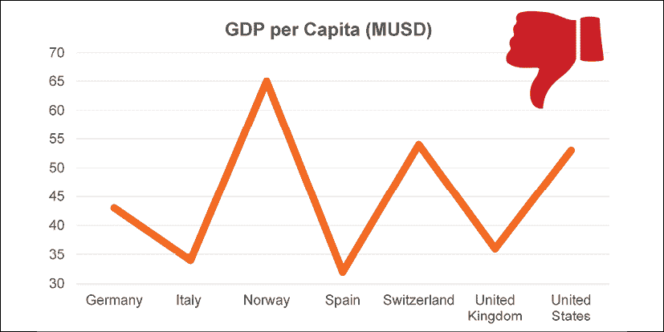

图 7.11：折线图的横轴上使用类别变量：初学者应避免的错误

你还可以使用折线图显示多条时间序列在相同时间框架内的关系，并通过颜色区分不同的线条。然而，建议使用**直接标签**，将其放置在每条线旁边：这些标签更清晰，可以避免使用图例，从而省去了“映射”颜色到类别的麻烦。此外，这种方法还允许你使用颜色来视觉突出数据的一部分，就像*图 7.12*中所展示的那样，这将使图表更专注于你想传达的具体信息。

图 7.12：带有直接标签的折线图：尽量避免使用颜色图例，将其替换为直接标签

另一个建议是在采用**双轴**时要非常小心，双轴意味着在同一图表中允许线条分别对应两个不同的参考轴，且这些轴具有不同的量度尺度。双轴图形可能出现的问题之一是，当两条线相交时，大脑会预先关注这一交叉点：换句话说，它*必须意味着某些东西*。但实际上，这可能与我们想传达的信息没有任何关系。以*图 7.13*中的左侧图表为例：份额和销售线在第二季度和第三季度之间交叉，但这完全是由于两个垂直尺度的任意定义所致：

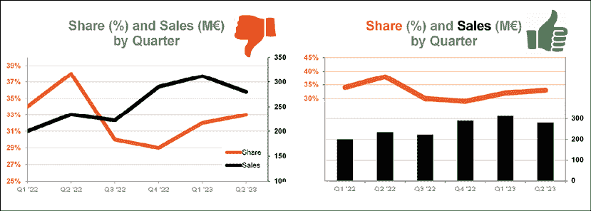

图 7.13：双轴图形较为复杂：左侧图表有一个人工交叉点，且比右侧图表更难解读

右侧图表中的组合图是一种更为稳健的替代方案：柱状图和折线图明确地分别对应两个不同的轴，它们既不重叠也不产生交叉。选择右侧图形的另一个理由是其**简单的轴增量**：选择连续的两个奇数（29%、31%、33%等）作为增量，不如右侧图形（30%、35%、40%等）直观。

另一种更直接的替代方法是将相同数据可视化为多个单独的图表（通常称为层格图或面板图），如*图 7.14*所示。这种方法对于分离多条重叠数据序列时非常有用。它是一种**避免意大利面图表**的方法，后者将许多线条挤进一个图表中，使得每条线都很难单独追踪并解读：

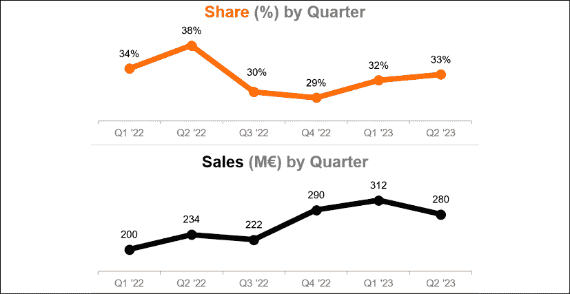

图 7.14：在层格图中合并的两条线：在这种情况下，我们通过采用数据标签来避免使用垂直坐标轴

在*图 7.14*的特定情况下，你还可以看到垂直轴已经完全被移除，取而代之的是**数据标签**，用于显示垂直轴的值。当你更倾向于报告精确值且可视化的数据点不多时，可以考虑使用数据标签，而不是依赖坐标轴。

## 层级树图

层级树图非常适合展示整体各个部分的相对大小。在层级树图中，整个空间被划分为多个矩形，每个矩形的大小与一个数值变量成正比。正如在*图 7.15*中所示，可以同时展示层级的多个层次（在此例中，国家和类别是用于分解销售的两个层级），并且可以比较所有元素的大小：

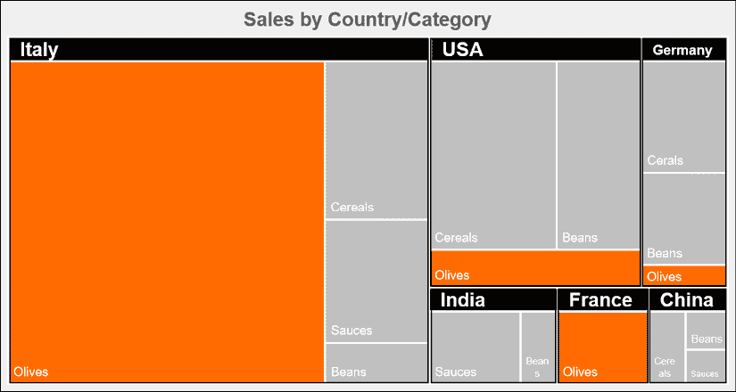

图 7.15：展示国家/类别组合的销售相对大小的层级树图：颜色用于突出显示每个国家橄榄销售的普及度

即使你只有一个层级的分割，层级树图仍然是传达整体各部分相对大小的好方法。我敢打赌，有些人现在在想：*我们不能用饼图来表示吗？* 尽管饼图仍然被广泛使用，数据可视化专家建议**避免使用饼图**，认为有更直接和更好的替代方案。信息设计专家 Stephen Few 用一个简洁的规则总结了他对饼图的看法：*饼图留着当甜点吃吧！* 很容易理解为什么：*图 7.16*展示了一个饼图和一个条形图，它们可视化的是相同的数据集，并清楚地展示了为什么饼图不如条形图。饼图通过角度来编码定量值，而角度比长度更难以立即感知，长度则用于条形图。我们的脑袋在评估角度的幅度时比较困难。再看一下图中的饼图：你能轻松比较中国（饼图中的第一块，从“正午”开始）和法国（第四块，顺时针方向）的大小吗？

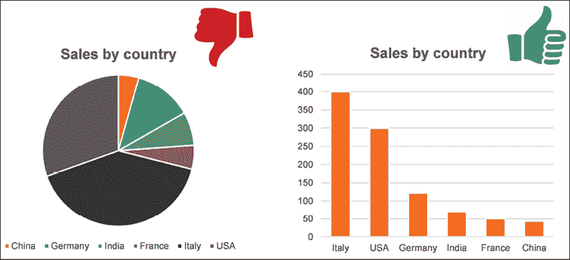

图 7.16：饼图更适合搭配茶水，而不是用来展示数据：在这种情况下，条形图做得更好

唯一可以使用饼图（或其其他听起来更好听的替代图表，如**甜甜圈图**）的情况是当你只有两部分时（如我们在上一章中做的那样——参见*图 6.32*）：在这种情况下，很容易看出哪一部分更大，因此可以使用这些图表。在所有其他情况下，你应该使用条形图或树图来传达关于大小和比例的信息：就是这么简单。

## 散点图

在散点图中，数据以一系列点的形式显示在一个矩形区域内。两个量用来控制出现在图表中的点的横坐标和纵坐标。通过这种方式，你可以轻松地展示这两个量之间的关系。看看*图 7.17*中的示例：单位销售数量（编码为纵坐标，或*y*轴）随着单位价格（用于控制横坐标，或*x*轴）的增加而明显下降：

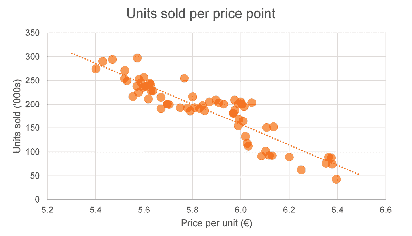

图 7.17：显示单位销售数量与单位价格关系的散点图：价格越高，销售越少。虚线趋势线使这一关系更加明显

我们可以看到这两个量之间的相互依赖关系（线性相关性）：随着价格的上涨，我们的销售量减少。散点图同样给我们提供了关于非线性现象的明显提示。例如，在*图 7.17*中，我们可以看到在€6.00 的价格阈值之后，销售出现了明显的下降。似乎全数字价格充当了一个心理阈值：顾客对€5.99 的价格标签比€6.00 的价格标签更具吸引力。像这样的线性和非线性模式可以通过散点图轻松发现：这使得它们成为在需要传达基于关系的商业信息时的安全图表选择。

添加一个**趋势线**，就像你在*图 7.17*中看到的虚线那样，可以突出线性关系。你还记得我们在*第五章*《工作中应用机器学习》里遇到的线性回归算法吗？趋势线只是通过横坐标（自变量）解释纵坐标（因变量）数量的线性模型的可视化呈现。你可以回去查看*图 5.7*，复习一下线性回归的视觉效果。

**象限图**，如*图 7.18*所示，是散点图的一种有趣扩展。通过两条参考线——一条垂直线和一条水平线——通常将它们设置在感兴趣范围的“中间”，我们将图表的空间划分为四个象限。每个象限与“低于”和“高于”每个参考阈值的四种逻辑组合之一相关：

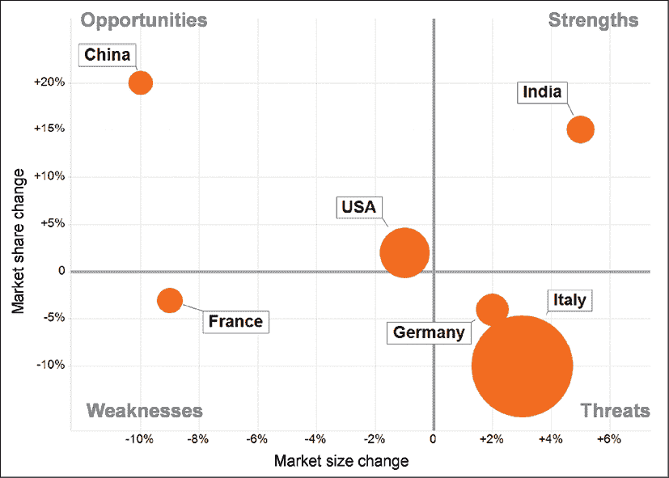

图 7.18：一个象限图，显示了市场规模和市场份额变化（x 轴和 y 轴）以及业务规模（气泡大小）：这个图表提供了一个框架，可以根据每个国家的位置来对其进行分类。

这种图表在将每个象限与明确的商业解释关联时变得非常强大。例如，*图 7.18* 显示了一个公司在各个国家市场的市场份额年变化（纵轴）和所在市场的规模（横轴）。出现在右上角的国家（在我们的例子中，只有印度）是公司的优势：在这些市场中，公司正在增加其市场份额，同时，整个类别的消费也在增长（可能是由人口增长驱动）。如果这一趋势在未来得到确认，这个市场将变得对公司越来越重要：结合市场份额的增长，印度可以被加入到公司战略**优势**的列表中。如果你转而查看右下象限，我们会发现一些国家的市场规模在增长，但市场份额却在下降。如果我们不采取行动，这些市场将逐渐侵蚀我们更多的全球份额，因为这些国家的市场份额可能会增加。因此，这些是需要谨慎管理的*威胁*。在这个象限图中，气泡的大小与当前业务的规模成正比，这使得优先事项更容易看出。这个例子说明了象限图成为数据的商业解释框架的潜力。不幸的是，象限图仍然被低估，我强烈建议在你的工作领域考虑其可能的应用，因为它们可以带来真正的不同。

关于散点图的最后一个考虑：刻度不需要从零开始。因此，当你想要展示的值都远离“零”时，可以用散点图代替条形图来传达关于规模的信息：这会给你带来一个有意义的优势，即将刻度缩小到一个更小的感兴趣范围，使得差异更加明显。例如，*图 7.19* 是一个散点图，展示了与*图 7.4* 相同的数据：在散点图中，各国人均 GDP 的差距更加明显。

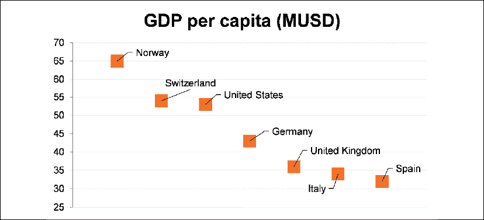

图 7.19：与图 7.4 中的条形图替代的散点图：如果信息是关于各国人均 GDP 的绝对差距，这种设计效果很好

我们现在已经完成了对数据可视化所需的基本图表类型的概述。条形图、折线图、树图和散点图涵盖了你可以通过数据传达的大多数商业信息。现在我们已经准备好了所有的元素，接下来我们将它们整合在一起，最终确定我们的视觉设计。

# 完成你的可视化

除了我们在前面几页中遇到的关于每种图表类型的具体设计指南外，还有一些适用于每次数据可视化的通用质量设计规则。这些规则的共同点将我们带回到本章开始时提到的地方：极简主义是有效数据可视化的终极关键。

耶鲁大学教授爱德华·塔夫图在现代数据可视化领域开创了先河。他提出的一个关键概念是**数据墨水比**，它描述了图表中由数据驱动的视觉元素的普及程度。考虑你在图表中使用的所有“墨水”来绘制数据的本质和非冗余的展示信息：如果我们删除这些图表元素，我们也会去除我们想要传达的潜在商业信息。现在想一想，绘制图表所需的总墨水量，包括不必要的图例、背景图片、不需要的文本等。塔夫图发现，通过去除所有杂乱的元素，我们最大化了数据墨水在总墨水中的比例（数据墨水比），从而获得更有效的数据可视化效果。

让我们通过一个例子来看它可能变得多糟：*图 7.20*展示了一个糟糕的柱状图，里面包含了几种错误的设计选择：

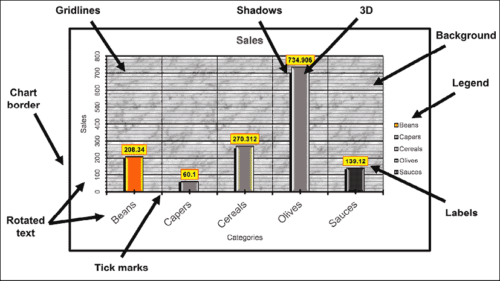

图 7.20：数据可视化中不应采取的做法示例：此图表的数据墨水比处于最低水平

虽然很少能看到像这样的数据可视化如此糟糕，我相信你在工作中看到的许多视觉图表也会存在一个或多个与此类似的错误。在接下来的几页中，我们将通过一套实用的指南，帮助我们避免所有这些问题。我们需要培养出能够发现这些缺陷的设计眼光，以便我们能够始终构建出整洁且专业级别的数据图表。看看*图 7.20*，我们似乎可以从多种角度来开始分析：

+   **网格线：**网格线有助于引导视线将数据点与坐标轴连接起来，但并非总是必要的。无论如何，网格线应始终保持视觉低调且几乎不可见。尽量让它们尽可能细，且使用浅灰色。不要在每个轴上夸大网格线的数量：每个维度的网格线应不超过 10 条。如果你能够完全避免使用网格线，那就更好了：例如，如果你在数据点上方使用了数据标签，就应该去掉网格线和坐标轴，因为它们已经不再需要了。

+   **刻度标记：**刻度标记有助于将轴标签与数据元素对齐，比如线形图中的时间周期。类似于网格线，刻度标记应当视觉上较为低调，因此应保持其短小和纤细。柱状图通常不需要刻度标记，因为每一根柱子都应当很容易地与某个类别对应。就像任何可视化辅助工具一样，如果你不确定是否需要保留刻度标记，我的建议是将它们去掉，然后检查是否所有内容仍然清晰可见。

+   **图表边框**：你可以去掉图表的外部边框：它们会浪费墨水，但确实不会提供任何信息。为了避免与幻灯片或文档中的其他元素或文本混淆，围绕图表留出一条宽敞的空白区域：这样看起来既整洁又轻盈，这正是你需要的效果。

+   **旋转文本**：如前所述，当文本被垂直旋转或倾斜时，它的可读性会降低，需要更多的时间才能阅读，因此应该避免。在条形图的情况下，使用水平条形可以为长标签腾出空间。

+   **3D 效果**：数据图表是对一组数据点的*抽象*表示。在数据可视化中，我们完全可以去除*真实感*的因素。数据图表中的三维视角只会带来负面影响，因为它使得比较大小和参考线变得更加困难。3D 散点图有时在科学领域用于数据探索：在这种情况下，它们总是允许通过适当的旋转和平移与视图进行交互。在商业领域，这几乎是不必要的。不要使用 3D。

+   **阴影**：与我们在 3D 部分所说的类似，在任何数据可视化中都没有必要添加光影效果。虽然许多软件平台无理地允许这样做，但不要在你的视觉元素中添加阴影。

+   **背景**：图表的背景应该是中性的，以便前景中的所有元素能够尽可能清晰地区分开来。有时，缺乏经验的用户会在图表的背景中加入颜色或更糟糕的是产品和品牌的图片来使其看起来“酷”：这只会降低他们传达业务信息的成功率，因为图表的可读性变差。有趣的是，Excel 提供了在*图 7.20*中看到的白色大理石纹理作为背景——我并没有编造！别问我为什么，但 Excel 还有一个预加载的纹理，展示了鱼化石的图案。它非常奇怪，值得一看，但——请不要使用它。

+   **标签**：使用标签来标识线条或指定数据值非常有用。你应该避免添加重复标签，因为它们会增加不必要的墨水：例如，如果你在折线图或条形图上有数据标签，你可以完全去除坐标轴和网格线，正如我们在*图 7.14*中所做的那样。使用标签时，请确保它们没有边框或非中性色背景。如果它们显示数据值，避免过多的小数位，就像在*图 7.20*中那样。一般来说，保持文本标签尽可能简洁，以便清晰地传达你需要的信息。

+   **图例**：图例用于提供图表中颜色或纹理的解读键。使用图例的问题在于，它们始终需要读者的眼睛和注意力在图表中的数据元素和图例本身之间来回切换。作为一般规则，我们应该尽量避免使用图例，并始终寻找替代方法，就像我们在*图 7.12*中使用直接标签一样。如果必须使用图例，尽量通过将元素分组或过滤不重要的项来限制项目数量：人眼很难在同一图表中清晰地区分超过五种颜色。

除了前述元素，当我们优化数据图表时，还应注意颜色的使用。重要的是要认识到，颜色是我们大脑在面对图表时解码的最直接的前注意属性之一。至于其他属性，如长度、大小和位置，颜色在数据图表中使用时应始终具有特定的含义。换句话说，颜色从来不是为了装饰或满足任何美学需求而存在。在数据可视化中，颜色是有功能性原因的，比如：

+   **突出需要注意的元素**，就像我们在*图 7.15*中强调橄榄类别时所做的那样。正如我们将在下一章看到的，颜色在区分数据的背景和前景时可以非常有力。

+   **编码额外维度**，就像在*图 7.7*中展示的堆叠条形图，或通过颜色渐变显示连续变量。

大约 5%的人受到**色觉缺陷**（**CVD**）的影响，这是一种让某些颜色组合（如绿色和红色的不同色调）难以区分的色盲形式。因此，通过采用对色盲友好的调色板（[davidmathlogic.com/colorblind](http://davidmathlogic.com/colorblind)）或使用明暗对比的颜色差异（当图表仅以黑白墨水打印时，这也很有用），尽量在数据可视化中做到完全包容。

在*图 7.21*中，你会看到一个改进版的之前看到的糟糕图表。这个图表现在已经通过应用我们在本章中遇到的所有质量指南进行了处理：

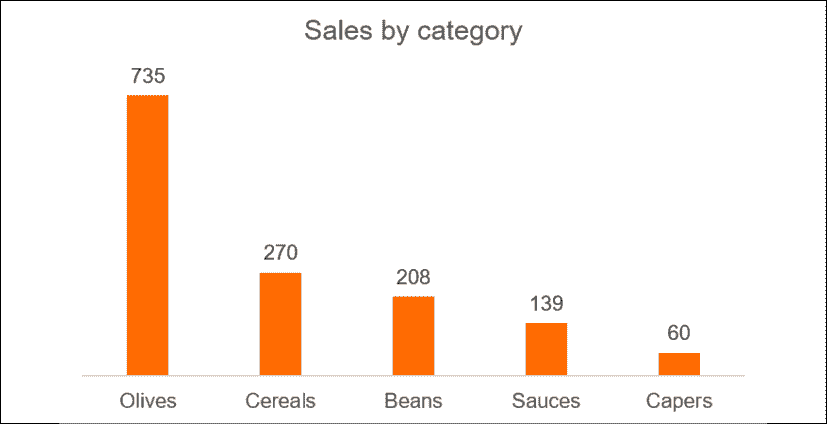

图 7.21：改进版的前一个条形图：简洁胜出

自行判断：极简主义能增强清晰度，并超越任何添加不必要图形修饰的华丽尝试。

# 总结

本章为你提供了一套实用的工具和指南，用于设计专业且有效的可视化图表，供你在日常工作中使用。我们从设定数据可视化的整体目标开始：通过利用人类的视觉感知将基于数据的信息传递给他人。我们已经看到，在这一过程中，我们需要扮演设计师的角色，做出关于“要可视化什么”和“如何可视化”的选择。在选择了要传达的特定信息类型（可能是时间演变、绝对和相对大小的比较，或数量之间的关系）后，我们学习了如何使用图表选择矩阵来挑选合适的图表类型。我们发现了线性图表、柱状图、树形图和散点图的优缺点以及实施时常见的陷阱，而这些图表正是我们最常需要使用的类型。最后，我们介绍了一套确保数据可视化质量时应遵循的指南。我们发现，所有这些规则有一个共同的目标：它们都邀请我们在构建图表时应用有条理的简化、直接性和极简主义。

本章中我们学到的所有好实践都需要通过实践才能转化为习惯。我的建议是，一旦你开始处理下一个需要刷新或创建的数据图表，就立刻应用我们在这里学到的所有规则。有些规则一开始可能会让你感觉不太习惯——我知道你们当中有些人是饼图的忠实粉丝——但它们无疑会帮助你在数据可视化方面变得更加自信和成功。

在本章中，我们专注于将数据转化为可视化并传达特定的信息。在下一章中，我们将更进一步：我们将学习如何将基于数据的信息转化为引人入胜的故事，这就是数据讲故事的核心。
