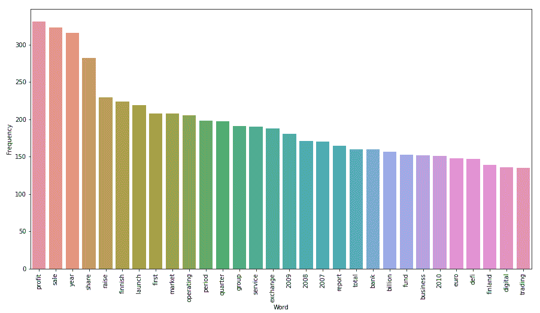
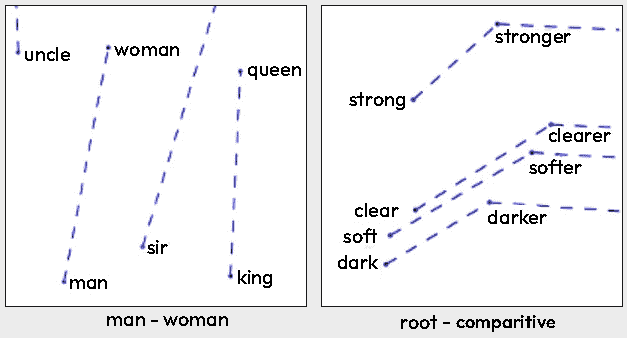
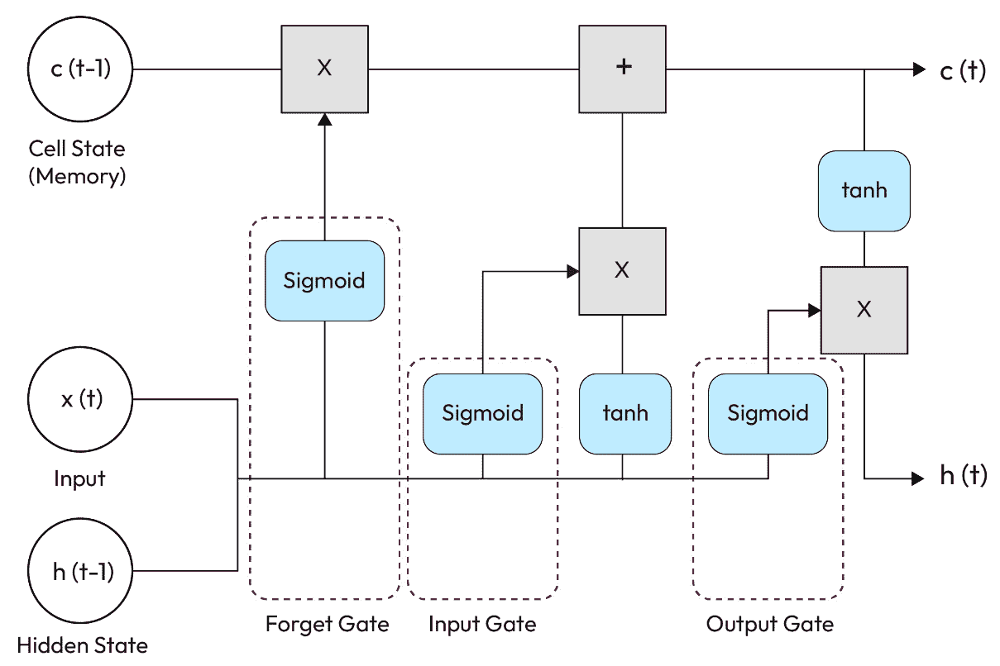
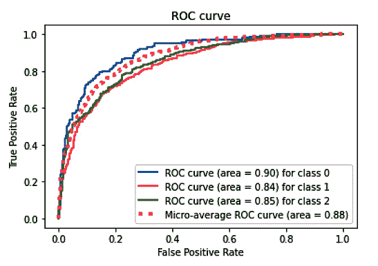
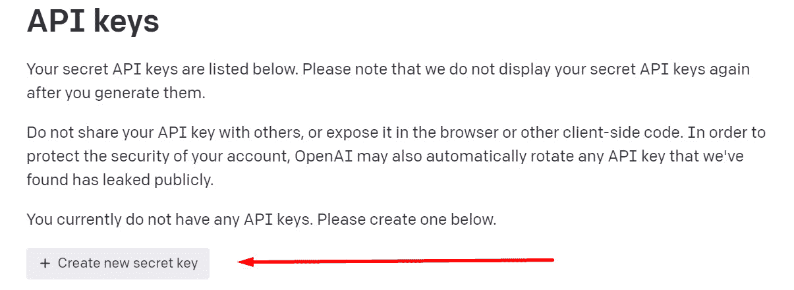
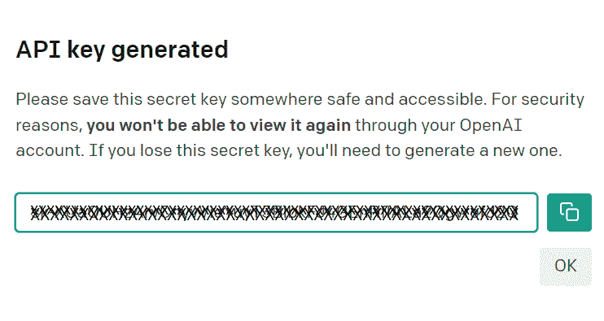

# 8

# 情感分析 – 自然语言处理（NLP）与加密新闻

**自然语言处理**（**NLP**）属于人工智能领域，致力于计算机对文本的理解。近年来，随着如 ChatGPT 等工具的出现，NLP 已经成为我们日常生活中不可或缺的一部分。然而，金融行业已经在相当长一段时间里利用 NLP，尤其是在基本面分析方面。

基本面分析旨在根据公开可得的信息确定资产的内在价值，如股票、代币或 NFT 艺术作品。在传统金融中，文本数据来源于定期向美国证券交易委员会（SEC）提交的报告（如 10K 表格或 10Q 表格），包括财务报表、专业媒体新闻、社交媒体平台如 X（前身为 Twitter）以及其他渠道。Web3 创造了一个类似的环境，市场活动持续不断，X 和新闻平台成为主要的文本资源。值得注意的是，虽然大多数 Web3 公司目前可能还没有义务提交监管报告，但这些数据源最终有可能会成为大多数公司可以获取的资源。

自然语言处理在金融领域的应用涵盖了多个方面，包括以下内容：

+   **情感分析**：确定文本的积极性、消极性或中立性，这些文本可能是新闻文章、社交媒体帖子（推文、Reddit 等）等。这些算法还可以提供关于情感极性和主观性的见解，帮助评估对公司、行业、市场、政府决策、加密货币发展等的情感。

+   **主题建模**：帮助根据文档所涵盖的主题对大量财务文档进行分类和组织。这有助于高效管理和访问相关信息。

+   **摘要**：在一个内容不断产生的世界里，显然没有足够的时间和/或资源去分析和给每个内容排出层次。NLP 技术正被应用于收集并创建简短的文档摘要，方便分析人员处理。

+   **欺诈检测**：利用 NLP 技术审查电子邮件、聊天记录、财务文件、转录对话等，发掘潜在的欺诈活动模式。

+   **交易**：将 NLP 工具纳入交易策略中，发出市场趋势的信号或预测，或增强基本面分析交易员的决策过程。

NLP 技术的数据源是被归类为非结构化的文本。我们周围充斥着这样的文本，且每秒钟都会产生更多。在*第三章*中我们探讨了其中一些文本来源；本章将继续探讨其他文本来源。

在本章中，我们将分析来自 Crypto Panic 的新闻情感。为此，我们将构建一个**神经网络**（**NN**），并解释预训练嵌入的概念和使用方法。我们将使用加密新闻数据集和传统金融新闻数据集来训练我们的模型。此外，我们还将学习如何为神经网络使用预处理文本的基本知识，以及如何评估此类模型的结果。

在撰写本文时，ChatGPT 已经成为现实。公开的信息揭示了它在一个广泛的多语言语料库上进行了训练，并利用强化学习不断提高其性能。我们将学习如何将 ChatGPT 集成到 Crypto Panic 数据集的情感分析中。这可以作为一个现成的工具来使用，同时我们构建一个专门的语料库来训练我们的模型。

在本章中，我们将覆盖以下主要主题：

+   一种用于情感分析的深度学习管道，包括准备、模型构建、训练和评估阶段。

+   集成 ChatGPT 进行情感分析

# 技术要求

在本章中，我们将使用 *第七章* 中介绍的库工具——即 scikit-learn 和 Keras。此外，我们还将使用 **NLTK**，这是一个 Python 库，对处理人类语言数据非常有帮助。NLTK 包含了一系列模块和函数，使我们能够执行诸如分词、词干提取和词性标注等任务。这个库简化了处理大量文本数据集的过程，使它们能够与机器学习或深度学习模型进行集成。

如果你之前没有使用过 NLTK，可以使用以下代码进行安装：

```py
pip install nltk
```

`nltk` 的文档可以在 https://www.nltk.org 找到。另一个在处理文本操作和清理时非常重要的库是 **re**，即**正则表达式**的缩写。正则表达式是一串字符，用于定义搜索模式。以下是一个示例：

| **模式** | **搜索标准** |
| --- | --- |
| [a-z] | 匹配范围 a-z 中的任何单个字符 |
| [0-9A-Fa-f] | 匹配任何十六进制数字 |

表 8.1 – “re” 模式示例

`re` 库提供了使用上述模式的函数和方法。例如，`re.sub` 将所有与模式匹配的字符替换为指定的字符串。有关函数的完整列表，请访问 https://docs.python.org/3/library/re.xhtml#module-re。

在我们的工作中，我们将使用 Google 的 Colaboratory 平台，该平台已包含核心库的导入。然而，对于特定任务，还需要其他的导入。

你可以在本书的 GitHub 仓库中找到本章的所有数据和代码文件，地址为[`github.com/PacktPublishing/Data-Science-for-Web3/tree/main/Chapter08`](https://github.com/PacktPublishing/Data-Science-for-Web3/tree/main/Chapter08)。我们建议你浏览`Chapter08`文件夹中的代码文件，以便跟随学习。

## 示例数据集

本章中，我们将合并两个标题数据集；你可以在*进一步阅读*部分和代码中找到相关来源的链接。数据集如下：

+   **金融短语库**：该数据集也可在 Kaggle 上获取，包含一个标题，并附带零售投资者角度的情感分析标签。它由多个数据集组成，每个数据集根据短语情感共识的程度对句子进行分类。在本练习中，我们将使用*Sentence_AllAgree*数据集。

+   **CryptoGDELT2022**：该数据集来自论文*Cryptocurrency Curated News Event Database From GDELT*，包含从**全球事件、语言与情感数据库**（**GDELT**）提取的新闻事件。它涵盖了 2021 年 3 月 31 日至 2022 年 4 月 30 日之间的新闻事件。该数据集包含多种情感得分和手动标注方法。在本练习中，我们将仅使用手动标注。

让我们开始构建我们的管道。

# 构建我们的管道

在 NLP 管道中，准备工作通常包括一个预处理步骤，在该步骤中我们清理和规范化数据。接下来，特征表示步骤将语言转换为可以供我们选择的模型使用的输入。完成这些后，我们便可以开始构建、训练和评估模型。这个战略计划将在接下来的章节中实现。

## 准备

语言在多种形式中表现出来。存在格式化的细微差异，例如大写或标点符号；一些作为语言辅助的词汇，其本身没有真正的语义意义，比如介词；以及包括表情符号在内的特殊字符，进一步丰富了语言的表现形式。为了处理这些数据，我们必须将原始文本转换为数据集，并遵循与数字数据集类似的标准。这个清理过程使我们能够去除异常值、减少噪音、管理词汇大小，并优化数据以便 NLP 模型处理。

数据清理管道的基本流程图如下所示：


图 8.1 – 清理图示

让我们深入了解这些步骤。

### 规范化

规范化包括一系列任务，如小写化、移除 HTML 痕迹、链接和表情符号。我们的目标是清理数据库，只留下有效的词汇。

此外，这一过程还涉及去除那些对模型缺乏信息量或可能引入偏差的词汇，从而导致不理想的预测。根据任务的不同，我们将选择需要删除的词汇。这个步骤还处理了去除可能遗漏在 *停用词* 清理过程中的词汇。

我们还可以将 Unidecode 文本转换为 ASCII 文本。Unidecode 支持来自不同语言的字符，将它们转化为最接近的 ASCII 对应字符。例如，西班牙字符“ñ”在 ASCII 中变为“n”。我们在 `Database_and_Preprocessing.ipynb` 中通过以下代码片段实现了这一转换：

```py
text = unidecode.unidecode(text)
```

规范化通过将所有文本呈现为一致的格式来促进统一性，指引模型的注意力集中在内容上，而非表面差异。

### 停用词

我们在这里的目标是排除对模型贡献较小的语义价值或意义的词汇。经常使用的词汇，如冠词（“a”，“the”，“an”）、介词（“on”，“at”，“from”，“to”）、连词（“and”，“so”，“although”）和代词（“she”，“he”，“it”），在语言中起到功能性作用，但缺乏模型可以利用的实质性语义内容。

因此，这些词汇通常在预处理过程中被过滤掉。可以按语言下载停用词集，并通过 NLTK 直接应用于我们的清理过程。在 `Database_and_Preprocessing.ipynb` 中，我们通过以下代码片段下载了英语停用词：

```py
nltk.download('stopwords')
stop_words = set(stopwords.words('english'))
```

这一过程减少了数据中的噪声，并有助于提高模型的效率。

### 分词

分词是将数据库中的文本拆分为较小的有意义单位，称为词元。这些单位可以是句子或单词。例如，我们来看一下以下标题：

*“SEC 正在调查 Coinbase 的 Earn 产品、钱包服务和* **交易活动**”*

当分词为单词时，输出结果如下：

`['SEC', 'investigating', 'Coinbase', 'Earn', 'product', ',', 'wallet', 'service', '``exchange', 'activity']`

分词产生了模型可以有效处理的结构化输入，促进了数据分析。此类分析指导了词汇大小的选择，用于降维，在 `Database_and_Preprocessing.ipynb` 中可以找到此类降维的示例。此分析展示了在分析过的数据集中最常出现的词汇。该分析得出以下结果：



图 8.2 – 分析过的标题中最常出现的词

### 词形还原和词性标注（POS）

这些技术将单词还原为其基本形式或词根。这使我们能够通过选择那些已变化的单词并用其词根替代它们，减少我们需要处理的单词多样性。在我们的示例句子（“SEC 正在调查 Coinbase 的 Earn 产品、钱包服务和交易活动”）中，单词*investigating*将变为*investigate*。

词形还原的准确性取决于库对单词在句子中上下文或功能的理解。词性标注为我们的分析提供了这种上下文信息。以下是一个示例：

```py
nltk.pos_tag
```

词性标注帮助我们根据单词在句子或文档中的位置，程序化地为每个单词分配上下文。以下是一个示例：

```py
word= ['SEC', 'investigating', 'Coinbase', 'Earn', \
    'product', ',', 'wallet', 'service', 'exchange','activity']
[nltk.pos_tag([w]) for w in word]
[[('SEC', 'NNP')], [('investigating', 'VBG')], [('Coinbase', 'NN')], [('Earn', 'NN')], [('product', 'NN')], [(',', ',')], [('wallet', 'NN')], [('service', 'NN')], [('exchange', 'NN')], [('activity', 'NN')]]
```

清理后的句子结果如下所示：

```py
investigate coinbase earn product wallet service exchange activity
```

让我们来看一些额外的预处理技术：

+   **词干提取**：这涉及从单词中去除前缀和后缀，以推导出一个共同的基本形式，称为“词干”。得到的词干可能并不总是形成有效的单词，但它旨在捕捉核心含义。

+   **命名实体识别**（**NER**）：该技术自动识别并分类文本中的命名实体（例如，人名、地名、组织名和日期）。NER 从非结构化文本中提取结构化信息，将实体分类到预定义的类别中。我们在《第三章》中讨论的 X（前身为 Twitter）数据集就是这一方法的一个示例。

+   **依存句法分析**：该技术分析句子的语法结构，以建立单词之间的关系。它创建了一个层次结构，其中每个单词与其支配单词（“头”）相连，并分配一个语法角色（“依存标签”）。

检查点

该管道的逐步版本已详细列出在`Database_and_Preprocessing.ipynb`中。如果你想跳过这一部分，生成的`.csv`文件已经上传到本书的 GitHub，并可以通过`preprocessed.csv`访问。

### 特征表示

在预处理阶段之后，下一步是将得到的原始文本数据转换为模型可以利用的特征，用于统计推断。目标是从文本中提取相关信息，并以算法能够理解的方式进行编码。实现这一目标的方法有多种，但通常涉及将单词表示为向量，并衡量单词在文档中的频率。一些常见的技术包括词袋模型、**词频-逆文档频率**（**TF-IDF**）和词嵌入。我们简要描述它们。

### 词袋模型

该技术通过统计单词出现的次数构建一个表示文档中所有单词的向量。它忽略句子的顺序和单词的上下文。可以使用来自 scikit-learn 库的`sklearn.feature_extraction.text.CountVectorizer`来实现该方法。这个方法比较基础，丢失了重要的上下文信息，并且可能会创建一个非常稀疏的矩阵，因为词汇表非常庞大：


图 8.3 – 词袋模型。文本摘自 https://rif.technology/content-hub/crypto-credit-card/

此外，通过结合 n-grams（即将具有上下文意义的两个或多个单词连接在一起）可以增强这种方法。例如，“自然语言”，“机器学习”和“新闻稿”在组合时能 encapsulate 特定的概念，但单独来看，它们并不保留这些概念。将 n-grams 融入到词袋模型中，可以进一步扩展词汇表。

### TF-IDF

这是一种替代方法，使用`sklearn.feature_extraction.text.TfidfVectorizer`。

### 词嵌入

词嵌入将单词表示为连续空间中的密集向量。通过捕捉单词之间的关系，这种方法保留了上下文和语义信息。**Word2Vec** 和 **GloVe** ([`www.tensorflow.org/tutorials/text/word2vec`](https://www.tensorflow.org/tutorials/text/word2vec)) 是生成词嵌入的流行算法。这些嵌入可以在大型文本语料库上进行预训练，或者针对特定任务进行微调。在我们的模型中，我们使用了 GloVe ([`nlp.stanford.edu/projects/glove`](https://nlp.stanford.edu/projects/glove)) 向量。

GloVe，特别是，通过一种无监督学习算法开发的预训练向量。这种方法利用文本中普遍存在的线性子结构，通过测量向量之间的距离来评估语义相似性。GloVe 网站提供了一个经典示例，说明了模型所识别的关系：



图 8.4 – GloVe 发现的单词结构示例（来源：[`nlp.stanford.edu/projects/glove/`](https://nlp.stanford.edu/projects/glove/)）

## 模型构建

我们正在处理一个监督学习任务，目标是将 Crypto Panic 的头条新闻分类为正面、负面和中立。为此，我们将使用`Modeling.ipynb`文件。

LSTM 是一种**递归神经网络**（**RNN**），能够学习长期依赖关系，在文本任务中显著优于常规的 RNN。该结构常用于自然语言处理任务，因为它能够很好地建模输入数据的序列并保留句子或文档中单词之间的依赖关系。因此，它不仅可以基于当前输入进行预测，还可以考虑远程信息——即上下文——而不仅仅是特定的单词。需要注意的是，虽然 LSTM 在捕捉长期依赖关系方面可能更有效，但其性能也可能取决于一些因素，如具体任务、数据集的大小以及模型的架构。在某些情况下，基于 Transformer 的高级架构（如 BERT 和 GPT）在某些自然语言处理任务中也表现出了更优的性能。

Christopher Olah 在他的博客中对该模型进行了很好的介绍，他是这样描述的：

“*人类在思考时不会每一秒钟都从头开始。当你阅读这篇文章时，你是基于对前一个单词的理解来理解每一个新单词的。你不会把所有东西都抛弃然后重新开始思考。你的思维* *具有持续性*。”

LSTM 是一种专门的 RNN 变种，旨在检测数据序列中的模式，无论这些模式来源于传感器数据、资产价格还是自然语言。其独特之处在于与传统的 RNN 相比，LSTM 能够在更长的时间内保存信息。RNN 具有短期记忆，只能在当前神经元中保留信息，这导致它在处理更长序列时的预测能力有限。当内存超出时，模型会简单地丢弃最旧的数据，并用新数据替换它，而不考虑被丢弃的数据是否重要。LSTM 通过选择性地将相关信息保存在**单元状态**中，除了传统的短期记忆存储在**隐藏状态**外，克服了这种短期记忆问题。

在每个计算步骤的开始，我们有当前的输入 *x(t)*、长时记忆的前一个状态 *c(t-1)*，以及存储在隐藏状态中的短期记忆的前一个状态 *h(t-1)*。在过程的结束时，我们获得更新后的单元状态和新的隐藏状态。单元状态携带着信息和数据集的时间戳，使其能够从输入数据的顺序中提取意义。

这三个输入通过三个门进行处理，每个门都有其特定功能：

+   **遗忘门**：该门决定哪些当前信息和先前信息被保留，哪些被丢弃。它将隐藏状态的先前状态和当前输入进行整合，并通过一个 sigmoid 函数进行传递。sigmoid 函数输出的值在 0 到 1 之间，0 表示先前的信息被认为无关并可被遗忘，1 则表示该信息应被保留。最终的结果将乘以当前的单元状态。

+   **输入门**：该门决定当前输入在解决任务中的重要性。它量化了由输入 *x(t)* 传递的新信息的相关性。当前输入与上次运行的隐藏状态相乘。输入门认为重要的所有信息都被加到单元状态中，形成新的单元状态 *c(t)*。这个新的单元状态成为长期记忆的当前状态，并将在下一次运行中使用。

+   **输出门**：LSTM 模型的输出在隐藏状态中计算：



图 8.5 – 单元状态

为了与 LSTM 进行交互，我们需要输入具有统一长度的向量。为了满足这一要求，我们必须按照以下方式顺序地对预处理后的输入文本进行编码：

+   `tokenizer.texts_to_sequences(X_train)`：此步骤将每个文本转换为一个整数序列，使用 tokenizer 中最常见的词汇。如果 tokenizer 的词汇表中缺少某些词汇，则会使用预定义的`<OOV>`（超出词汇表）标记。

+   `pad_sequences`：此函数将先前转换的序列转换为形状为（序列数，所需序列长度）的二维数组。`maxlen`参数可以由用户定义，或者默认设置为列表中最长期序列的长度。此外，用户可以选择填充发生在序列的开始还是结束。

我们构建的模型以嵌入层作为其核心元素，并设置`trainable = False`以保持来自 Glove500 的见解。如果我们选择从头开始训练，则需要将该参数设置为`True`：

```py
model = Sequential()
model.add(Embedding(input_dim = len(word_index) + 1 ,\
    output_dim = embedding_dim ,\
    weights = [embedding_vectors],\
    input_length = max_length ,\
    trainable = False))
```

此外，我们的设计包括了一个 LSTM 层、一个全连接层和一个 dropout 层。dropout 层是一种常用的正则化技术，旨在防止过拟合，其通过在每次训练的前向传播中随机停用（即将其置为零）一部分神经元来操作。这有助于防止网络过度依赖特定的神经元，并鼓励网络学习更为鲁棒且具备泛化能力的特征：

```py
model.add(Bidirectional(LSTM(embedding_dim, activation = 'relu',\
    dropout = 0.0 ,\
    recurrent_dropout = 0.0)))
model.add(Dense(embedding_dim, activation='relu'))
model.add(Dropout(0.3))
```

对于最后的全连接层，我们使用`'softmax'`激活函数，它为每个训练类别分配一个小数概率：

```py
model.add(Dense(label_distinct, activation='softmax',\
    bias_initializer =  'zeros'))
```

我们通过利用`'categorical_crossentropy'`作为损失函数来编译模型，这是多类别分类任务（包括两个以上类别）的标准选择，正如在这里的情况：

```py
model.compile(loss = 'categorical_crossentropy',\
    optimizer = Adam(1e-3), \
    metrics = ['accuracy'])
```

检查点

该部分管道的逐步版本显示在`Modeling.ipynb`中。如果你想跳过这一部分，生成的模型和分词器已经上传到本书的 GitHub 仓库，并可以通过`chapter8_model.h5`和`text_tokenizer.json`进行访问。

## 训练与评估

我们可以使用以下代码片段训练模型：

```py
model.fit(X_train_pad, y_train, batch_size = batch_size, \
    epochs = 10, validation_data = (X_test_pad, y_test), \
    verbose = 0, callbacks=[tensorboard_callback])
```

在完成训练后，我们通过三种不同的方法评估其性能和结果：

**小测试**：我们查找测试样本，应用模型，并进行评估。我们必须始终记得对样本进行预处理，并将它们以模型准备好的形状传递给模型。

`log` 文件夹用于存储训练和验证结果：

```py
tensorboard_callback = \
    tf.keras.callbacks.TensorBoard(log_dir="./logs")
```

这个文件夹在随附的训练说明中提到（`callbacks=[tensorboard_callback]`）。TensorBoard 然后访问这个文件夹以显示结果。

**ROC AUC 曲线**：根据 Jason Brownlee 的博客，“*ROC 曲线是通过计算不同阈值下模型预测集的假阳性率和真阳性率来总结模型行为的诊断图*。” ROC 曲线是二分类任务的评估指标。为了将其应用于我们的多类问题，我们必须通过 **一对一** (**OvO**) 或 **一对多** (**OvA**)/**一对其余** (**OvR**) 方法将多类问题转化为二类问题。在 OvR 中，我们评估每个类别与其他类别的关系；在 OvO 中，我们评估每对类别之间的关系。选择这些技术取决于特定问题的细节、类别数量、计算资源和数据集特点。某些机器学习库，如 scikit-learn，为多类分类算法提供了 OvA 和 OvO 策略的选择。

在这种情况下，我们使用 OvA 方法，其中我们衡量模型预测每个标签的效果，将一个标签视为真实，其他所有标签视为假。通过这种方式，我们可以绘制 ROC AUC 曲线。曲线越接近 1，模型越好；越接近 0.5，模型的表现越差：



图 8.6 – 应用的 ROC AUC 曲线

在处理不平衡数据集时，准确率和 ROC AUC 曲线可能会过于乐观。

**F1 分数**：通过 OvA 角度解决多类分类问题时，我们获得一组二值值，从中可以计算精确度、召回率和 F1 分数。F1 分数在目标是最小化假阳性和假阴性时更加适用。这个指标结合了精确度和召回率的信息，是它们的调和平均数。F1 分数的公式如下：

F*1* 分数 = 2 *  精确度 * 召回率  _____________  精确度 + 召回率

Joos Korstanje 在他的博客中简洁地总结了这一点：

+   *如果模型的精确度和召回率都很高，模型将获得高 F1 分数*

+   *如果精确度和召回率* *都较低，模型将获得较低的 F1 分数*

+   *如果精确度或召回率较低，而另一个较高*，模型将获得中等的 F1 分数。

上述度量可以通过以下代码片段生成：

```py
classification_report(y_test, y_pred_onehot, target_names=target_names
```

该模型的加权平均 F1 分数为 `0.72`。

我们可以使用以下代码片段保存已训练的模型，以备将来使用：

```py
text_tokenizer_json = tokenizer.to_json()
with io.open('text_tokenizer.json','w',encoding='utf-8') as f:
    f.write(json.dumps(text_tokenizer_json, \
        ensure_ascii=False))
model.save('chapter8_model.h5')
```

在本书 GitHub 仓库中的 `Chapter08/app.py` 文件里，我们开发了一个应用程序，它从 Cryptopanic API 获取标题，应用已训练的情感模型，并在控制台中显示结果。

关于 NLP 挑战的说明

由于人类语言固有的复杂性，NLP 面临着多个挑战，这些挑战可能会显著影响其模型的表现和准确性。然而，存在潜在的缓解策略来应对这些挑战：

**歧义性**：单词和短语通常具有多重含义，正确的解释依赖于上下文。这种复杂性即使对母语和非母语使用者来说也是一种挑战，尤其是在隐喻的使用中。同样，模型在解释用户意图时也会遇到困难。为了解决这个问题，可以设计模型以纳入更广泛的上下文信息，通过利用周围的单词和短语来进行更准确的意义推断。

**语言多样性**：语言在语法、句法和语义上展现出广泛的差异。此外，俚语、地区方言和文化差异进一步加剧了语言的多样性。NLP 模型如果只在特定类型的数据上训练，可能难以在多样的语言环境中推广应用。为了解决这一限制，模型可以在更广泛且多样化的数据集上进行训练，以涵盖各种语言模式。

**数据稀缺性**：NLP 模型在训练过程中严重依赖大量的标注数据。然而，为所有可能的语言变体和应用获取标注数据是一个挑战。迁移学习技术，如在大语料库上进行预训练并对特定任务进行微调，通过减轻对大量标注数据的需求，提供了一个可行的解决方案。

**伦理考量与偏差**：NLP 模型可能会无意中学习到训练数据中的偏差，从而导致偏向的输出。解决这个问题需要精心策划多样化和具有代表性的训练数据集、定期审查模型的偏差，并实施公平意识的训练技术。

虽然 NLP 面临许多挑战，但机器学习技术的持续研究和进步有助于克服这些障碍。

## ChatGPT 集成

当时间紧迫且无法收集必要的数据来训练新模型以构建分类器时，我们可以考虑使用预训练模型，如 TextBlob、spaCy 或 Hugging Face 库提供的模型。此外，我们还可以无缝集成现成的模型，如 ChatGPT。

我让 ChatGPT 自我介绍，以下是它的回答：

“*我是 ChatGPT，一个由 OpenAI 开发的大型语言模型，基于 GPT-3 架构。我在大量文本数据上进行训练，能够生成类人回答，回应各种问题和提示。我的主要目的是帮助用户生成文本，无论是写文章、回答问题，还是完成创意任务。我在各种话题上拥有广泛的知识，包括科学、技术、历史和文学等。我旨在理解自然语言，能够以* *对话式的方式* 回复基于文本的输入。*”

本章特别相关的是最后一句话。该工具精通多样的词汇，能够处理文本输入。

ChatGPT 的架构与 LSTM 不同。它使用**transformer**架构，使其能够理解和生成自然语言文本。Transformer 使用自注意力机制来捕捉句子中单词之间的关系，从而允许对单词进行并行处理，而不像 LSTM 那样进行顺序处理。Transformer 被用于翻译语言、总结长文章、回答问题、完成句子，甚至创作故事。BERT 和 GPT 是常见的 Transformer 模型。

在`Chapter07/chat_gpt integration`文件中，我们复制了与前一部分相同的用例，在该用例中，我们与 Cryptopanic API 进行了交互，提取标题，应用 ChatGPT 模型，并在控制台中显示输出，取得了优异的结果。为了方便操作，需要一个 API 密钥，可以通过以下步骤在 OpenAI 官网生成：

1.  访问[`platform.openai.com/docs/api-reference`](https://platform.openai.com/docs/api-reference)，前往注册部分，然后在其网站上进行注册。

1.  在左侧，你会看到一个下拉菜单，写着**查看 API 密钥**。点击这个菜单，进入生成新 API 密钥的页面：



图 8.7 – ChatGPT – API 密钥登录页面

1.  生成并安全存储生成的 API 密钥非常重要，因为一旦生成，它们就无法再被检索：



图 8.8 – Chat GPT – API 密钥生成

本节的目的是要认识到 ChatGPT 的存在，它能够完成出色的工作，并通过连接 API 来解决情感分析问题，这可能是一个临时解决方案，特别是在没有足够数据来训练专用模型的情况下。

可以使用任务特定的数据对 ChatGPT 进行微调，以适应特定任务或领域。此过程使模型能够适应目标应用的细微差别和需求。例如，我们可以将模型定制为生成更简短的回答，减少在提示中所需的上下文量，以提高响应效果，并定义它如何处理边缘情况。假设我们希望将一个专门的机器人集成到公司内部通讯系统中，提供简洁的加密货币新闻摘要，具有特定的语气或格式。这可以通过该训练过程来实现。有关该过程的详细文档，请参阅 [`platform.openai.com/docs/guides/fine-tuning`](https://platform.openai.com/docs/guides/fine-tuning)，并且可以在 *进一步* *阅读* 部分找到逐步教程。

# 摘要

自然语言处理（NLP）领域正在迅速发展，为从非结构化数据（如文本）中提取洞察提供了有效的手段。在本章中，我们介绍了该领域，展示了其中的一个典型任务，阐明了工作流程，讨论了相关数据，并使用嵌入进行模型训练。此外，我们还展示了模型评估过程，并展示了如何将其集成到一个程序中，该程序从 CryptoPanic API 获取头条新闻。

值得强调的是，积累大量数据对高模型准确性至关重要。然而，在无法构建此类模型的情况下，也可以采取替代方案。我们探讨了其中一种解决方案，涉及使用 ChatGPT API，它提供了访问经过全面数据集训练的文本机器人。

在接下来的章节中，我们将深入探讨数据团队如何为艺术团体提供支持，帮助他们通过使用 NFT 将艺术作品转化为独特的产品。

# 进一步阅读

要了解更多关于本章内容的主题，请查阅以下资源：

+   引言：

    +   Bird, Steven, Edward Loper 和 Ewan Klein（2009），*Python 自然语言处理*。O’Reilly Media Inc. 可在 [`www.nltk.org/book/`](https://www.nltk.org/book/) 查阅。

    +   Yordanov, V.（2019 年 8 月 13 日）。*文本自然语言处理简介*。Medium。可在 https://towardsdatascience.com/introduction-to-natural-language-processing-for-text-df845750fb63 查阅。

    +   Gabriel Doyle 和 Charles Elkan。（无日期）。*金融主题模型*。可在 [`pages.ucsd.edu/~gdoyle/papers/doyle-elkan-2009-nips-paper.pdf`](https://pages.ucsd.edu/~gdoyle/papers/doyle-elkan-2009-nips-paper.pdf) 查阅。

    +   Sigmoider.（2018 年 5 月 3 日）。*开始使用 NLP（第一部分）*。Medium。可在 https://medium.com/@gon.esbuyo/get-started-with-nlp-part-i-d67ca26cc828 查阅。

    +   Suhyeon Kim, Haecheong Park, 和 Junghye Lee.（无日期）。*基于 Word2vec 的潜在语义分析（W2V-LSA）用于主题建模：区块链技术趋势分析的研究*。[`www.sciencedirect.com/science/article/pii/S0957417420302256`](https://www.sciencedirect.com/science/article/pii/S0957417420302256)。

    +   数据科学与机器学习的现状（2022）。*Kaggle：您的机器学习和数据科学社区*。[`www.kaggle.com/kaggle-survey-2022`](https://www.kaggle.com/kaggle-survey-2022)。

    +   *非常好的 ChatGPT 微调教程：Tech-At-Work*。 (2023 年 9 月 11 日）。轻松微调 ChatGPT 3.5，超越 GPT-4！[视频]。YouTube。[`www.youtube.com/watch?v=8Ieu2v0v4oc`](https://www.youtube.com/watch?v=8Ieu2v0v4oc)。

+   示例数据库：

    +   Malo, P., Sinha, A., Korhonen, P., Wallenius, J., 和 Takala, P. (2014 年）。*好债务还是坏债务：检测经济文本中的语义取向*。信息科学与技术协会期刊，65(4)，782-796。[`www.kaggle.com/datasets/ankurzing/sentiment-analysis-for-financial-news`](https://www.kaggle.com/datasets/ankurzing/sentiment-analysis-for-financial-news)。

    +   Manoel Fernando Alonso Gadi 和 Miguel Ángel Sicilia.（2022 年 10 月 10 日）。*来自 GDELT 的加密货币精选新闻事件数据库* [pdf]。Research Square。[`assets.researchsquare.com/files/rs-2145757/v1_covered.pdf?c=1665769708`](https://assets.researchsquare.com/files/rs-2145757/v1_covered.pdf?c=1665769708)。

+   预处理：

    +   Bird, S., Klein, E., 和 Loper, E. (2009 年）。*使用 Python 进行自然语言处理*。O’Reilly Media。

    +   *Sklearn.feature_extraction.text.CountVectorizer*。（无日期）。scikit-learn。检索于 2023 年 3 月 24 日。[`scikit-learn.org/stable/modules/generated/sklearn.feature_extraction.text.CountVectorizer.xhtml`](https://scikit-learn.org/stable/modules/generated/sklearn.feature_extraction.text.CountVectorizer.xhtml)。

    +   *Sklearn.feature_extraction.text.TfidfVectorizer*。（无日期）。scikit-learn。检索于 2023 年 3 月 24 日。[`scikit-learn.org/stable/modules/generated/sklearn.feature_extraction.text.TfidfVectorizer.xhtml`](https://scikit-learn.org/stable/modules/generated/sklearn.feature_extraction.text.TfidfVectorizer.xhtml)。

+   模型：

    +   Dudeperf3ct。 (2019 年 1 月 28 日）。*LSTM 和 GRU 的力量*。博客。[`dudeperf3ct.github.io/lstm/gru/nlp/2019/01/28/Force-of-LSTM-and-GRU/#bag-of-words-model`](https://dudeperf3ct.github.io/lstm/gru/nlp/2019/01/28/Force-of-LSTM-and-GRU/#bag-of-words-model)。

    +   Brandon Rohrer。 (无日期）。*循环神经网络（RNN）和长短期记忆（LSTM）* [视频]。YouTube。[`www.youtube.com/watch?v=WCUNPb-5EYI&list=PLVZqlMpoM6kaJX_2lLKjEhWI0NlqHfqzp`](https://www.youtube.com/watch?v=WCUNPb-5EYI&list=PLVZqlMpoM6kaJX_2lLKjEhWI0NlqHfqzp)。

    +   Pennington, J.（无日期）。*GloVe：全球词向量表示*。斯坦福自然语言处理组。[`nlp.stanford.edu/projects/glove/`](https://nlp.stanford.edu/projects/glove/)。

    +   Jason Brownlee. (2020). *深度卷积神经网络在情感分析（文本分类）中的应用*。机器学习大师。可在[`machinelearningmastery.com/develop-word-embedding-model-predicting-movie-review-sentiment/`](https://machinelearningmastery.com/develop-word-embedding-model-predicting-movie-review-sentiment/)获取。

+   评估：

    +   T., B. (2022 年 12 月 9 日). *多分类分类指标的综合指南*。Medium。可在[`towardsdatascience.com/comprehensive-guide-on-multiclass-classification-metrics-af94cfb83fbd`](https://towardsdatascience.com/comprehensive-guide-on-multiclass-classification-metrics-af94cfb83fbd)获取。

    +   Jason Brownlee (2021). *不平衡分类的评估指标概览*。机器学习大师。可在 https://machinelearningmastery.com/tour-of-evaluation-metrics-for-imbalanced-classification/获取。

    +   Korstanje, J. (2021 年 8 月 31 日). *F1 得分*。Medium。可在[`towardsdatascience.com/the-f1-score-bec2bbc38aa6`](https://towardsdatascience.com/the-f1-score-bec2bbc38aa6)获取。
