# 9

# NFT 的生成艺术

“我使用数据作为颜料，借助人工智能的画笔进行绘画。”

——Refik Anadol

在本章中，我们将进行一次艺术休息，尽情发挥创造力。虽然我们之前的重点是分析区块链上由他人生成的内容，但在本章中，我们将创造自己的内容，并将其添加到区块链上。

本章的加入源于认识到，作为数据科学家，我们可能会遇到需要与艺术家团队合作，制作或协助制作 NFT 系列的请求。在*第四章*中，我们研究了 NFT 的艺术应用，并探索了诸如*Bored Ape*等知名系列，该系列的总交易量为 978,382 ETH（约合 18 亿美元）。我们不清楚他们是否使用了人工智能来制作所有图像，但它们是艺术可以在区块链上拥有和交易的一个很好的案例。为了能够参与这个市场，我们将学习从制作图像到在 OpenSea 上列出销售的整个过程。

一个名为*Artsy Monke*的系列使用人工智能通过将 Bored Ape 系列与 20 种精选的绘画风格相结合来创作图像。您可以在[`opensea.io/collection/artsy-monke`](https://opensea.io/collection/artsy-monke)找到他们的 OpenSea 系列网站。书本封面上的图像是 Artsy Monke #9937。

另一个例子是 Refik Anadol 的*机器幻觉*系列，这是与 NASA 合作的项目，使用了超过两百万张由国际空间站、哈勃望远镜和 MRO 望远镜等空间机构记录的原始图像，经过人工智能数据处理，创作了六幅画作和一件雕塑作为输入。

人工智能所带来的工具范围超出了本章的讨论范围。然而，我们将讨论三种可能对艺术家团队联系以帮助他们建立 NFT 系列时有用的实际工具：上色、风格迁移和提示生成艺术。我们将从不修改内容的编辑开始，逐步过渡到完全创作图像。最后，我们将学习如何在区块链上创建一个系列并将其列出销售。

在本章中，我们将涵盖以下主要主题：

+   创作色彩——上色工具

+   创作风格——风格迁移工作流程

+   创作提示——文本转图像解决方案

+   变现——铸造和销售 NFT

# 技术要求

在本章中，我们将为每个部分使用不同的工具。对于*上色*部分，我们将使用一个名为`.zip`的程序，该程序需要下载到您的计算机并解压缩。

转到*风格迁移*部分，我们将使用一个 VGG19 模型，其文档可以在[`www.tensorflow.org/api_docs/python/tf/keras/applications/vgg19/VGG19`](https://www.tensorflow.org/api_docs/python/tf/keras/applications/vgg19/VGG19)找到。它遵循的是 Keras 示例，详见[`keras.io/examples/generative/neural_style_transfer/`](https://keras.io/examples/generative/neural_style_transfer/)。

对于*文本到图像*部分，我们将与 Leonardo AI 平台进行互动，只需要创建一个账户。此外，我们还将与 OpenSea 平台互动，这要求我们拥有一个有效的钱包，以便进行铸造。

你可以在本书的 GitHub 仓库中找到所有数据和代码文件，链接为[`github.com/PacktPublishing/Data-Science-for-Web3/tree/main/Chapter09`](https://github.com/PacktPublishing/Data-Science-for-Web3/tree/main/Chapter09)。我们建议你阅读`Chapter09`文件夹中的代码文件，以便跟随本书学习。本章节中创建的 NFT 系列可以在[`opensea.io/collection/mysterious-library`](https://opensea.io/collection/mysterious-library)访问。

# 创作与颜色 – 着色

给图像着色需要艺术团队付出大量工作。作为数据科学家，我们可以借助一种工具来辅助他们，这个工具可以在遵循艺术方向的同时，轻松地进行绘画。我们所提到的工具叫做**Style2Paints**，它是一种半自动着色方法，在不需要色彩修正时可以生成自动化的结果。它还提供了一个功能，允许为工具提供提示，以便获得更加定制化的结果。

## 使用 Style2Paints 实操

一旦安装了 Style2Paints，主页面将像*图 9.1*所示。左侧有一个颜色样式栏，右侧则有一个色板：

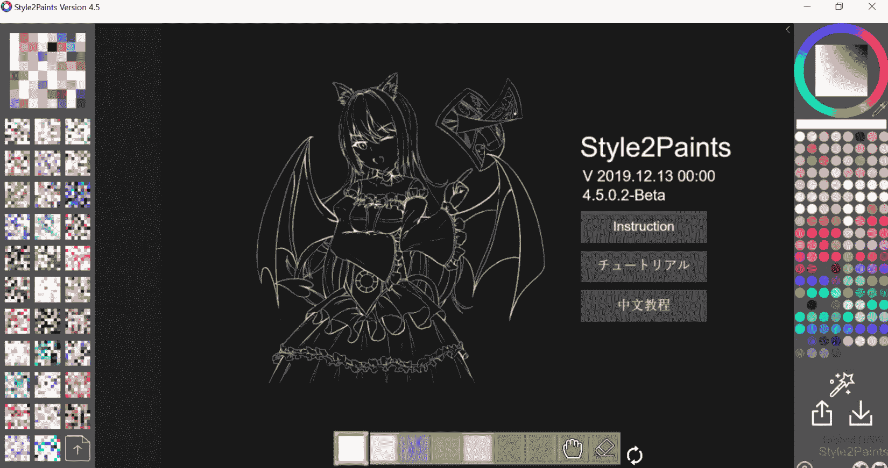

图 9.1 – Style2Paints 主视图

这个工具可以与彩色图像和黑白图像一起使用。请按以下步骤操作：

1.  要上传图像进行着色，点击符号。

1.  选择图像的绘画区域并点击**确定**。

1.  在左侧，我们将看到一个已预先着色的图像列表，可以点击并下载。例如，如果我们上传一个基础草图或“线条艺术”，工具将会在网站的左侧建议一些颜色样式。

请参考以下线条艺术示例：

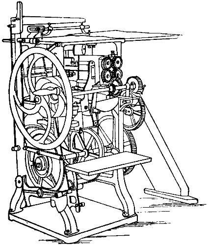

图 9.2 – 书籍装订机，Joseph William Zaehnsdorf，公共领域，来自 Wikimedia Commons

通过使用这些颜色样式，我们可以仅通过点击一种颜色组合，从一张黑白图像创建出八种不同颜色的书籍装订机图像：

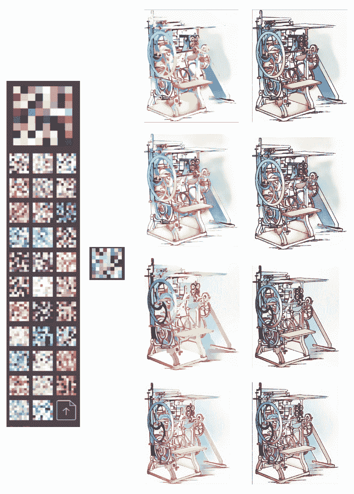

图 9.3 – 书籍装帧的彩色版本

也可以编辑已经有一些颜色的图像。例如，我们考虑艺术猴 #9937：

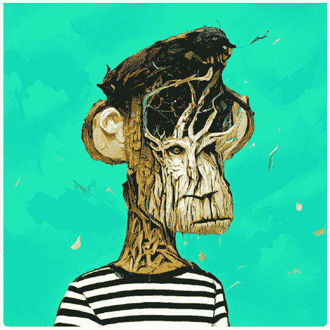

图 9.4 – 艺术猴 #9937

我们可以通过使用位于工具左侧的颜色样式选项轻松更改图像使用的颜色。点击每种颜色组合，图像会发生变化。可以在*图 9.5*中看到一些示例：


图 9.5 – 彩色艺术猴 #9937

也可以在没有颜色样式建议的情况下手动上色，并使用文档所称的“提示点”颜色调色板。提示的使用场景是保持某种美学一致性或纠正一些颜色样式建议。按照以下步骤操作：

1.  通过点击工具右侧的颜色之一来选择一个颜色。

1.  在我们想要用选定颜色着色的图像部分添加一个点。这是一个“提示”。

1.  点击图标；图像将重新加载，用我们选择的颜色涂绘所选区域。

关于如何使用这个直观工具的逐步教程可以在*进一步* *阅读*部分找到。

## 理论

**卷积神经网络**（**CNN**）是一种专门用于分析视觉数据的深度神经网络类型。总体而言，CNN 受到人类视觉系统如何处理信息的启发。它们由多个层次组成，这些层次能够自动学习和检测各种特征，如边缘、角落、纹理以及更复杂的模式，从原始像素数据中提取出来。这些学习到的特征随后可用于图像分类、物体检测、人脸识别等任务。

以下是 CNN 的关键组件：

+   **卷积层**：这是卷积神经网络（CNN）的核心。它将一组可学习的滤波器（也叫卷积核）应用到输入图像上。这个过程被称为特征提取，用于识别图像的不同特征。

+   **池化层**：此层减少特征图的空间维度，同时保留重要信息。池化有两种类型：最大池化和平均池化。通常在卷积层后应用，以减少在前一层创建的特征图的大小。经过几层卷积和池化层后，特征图被展平成一维向量，作为全连接层的输入。

+   **全连接层**：这些层类似于传统神经网络中的层，连接不同的层。

我们刚刚详细描述的组件可以按顺序在*图 9.6*中可视化：

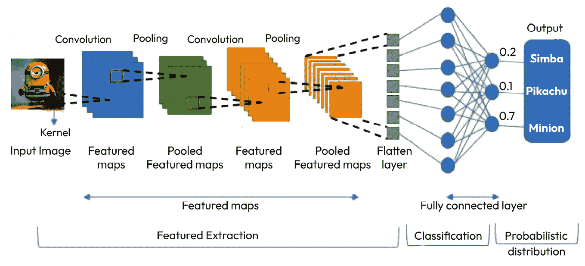

图 9.6 – CNN 的结构。照片由 Alison Wang 提供，来自 Unsplash

CNN 使用标注数据集进行训练。在训练过程中，网络的参数（权重和偏置）通过优化算法（如梯度下降）进行更新，以最小化一个损失函数，该损失函数量化了预测标签和实际标签之间的差异。

Style2Paints 模型基于一个 CNN 框架，并使用 Danbooru 数据库进行训练，模型包含两个部分：草图和细化过程。根据*两阶段草图着色*论文，“*第一个草图阶段会大胆地将颜色涂抹到画布上，创建一个颜色草图，目的是丰富颜色的多样性 (…) 第二个细化阶段纠正颜色错误，细化细节并打磨模糊的纹理，以达到最终的输出效果*。”该神经网络已被训练来处理缺乏一些重要信息（如阴影或纹理）的彩色草图。

它使用**生成对抗网络**（**GANs**），这是一种用于生成建模的 CNN 类型。这种神经网络由两个子模型组成：生成器和判别器。生成器执行无监督任务，总结训练数据集（通常是图像）的分布，并生成合成副本供判别器分析。判别器接收这些副本，并将其与一些训练数据集的样本结合起来，执行有监督任务，区分真实样本（地面真实样本）和假样本（由生成器生成的）。当判别器无法区分生成图像和地面真实图像时，模型被认为已经训练完成。生成器此时被保留用于生成该问题领域的新样本。

训练过程可以通过以下图示来查看：


图 9.7 – 训练过程的步骤

这可以看作是两个子模型相互竞争并不断提高生成和辨别能力。这就是为什么“对抗性”这个词出现在它的名称中的原因。该结构的概述可以在*进一步阅读*部分找到。

训练 GAN 需要大量数据集和大量 GPU。如果你有兴趣训练自己的 GAN，圣路易斯华盛顿大学的视频已经包含在*进一步阅读*部分。

## 关于训练数据集的说明

如果使用的模型已经使用我们尝试重现的图像风格进行训练，通常会得到更好的结果。例如，如果我们想要用摄影风格进行绘画，我们可能会尽量避免使用经过动漫风格训练的模型。

正如预期的那样，Style2Paints 是使用 Danbooru 数据集训练的，Danbooru 是一个经过标注的动漫数据集，随着时间的推移不断发展和扩展。Style2Paints 是在 2018 年版本上进行训练的，但在撰写时，已有 2021 年版本。该数据集包含带有元数据和标签的图像。动漫艺术有一些共同特征，例如大而富有表现力的眼睛、鲜艳的色彩、夸张的表情，以及变化丰富的色彩调色板，用以反映图像中的氛围。

以下是一些常用的图像数据集：

+   **ImageNet**：这是一个图像集合，遵循 WordNet 层级结构。WordNet 集合中的每个相关概念都是一个“同义词集”，与其他同义词集形成关系，建立起从一般到抽象和具体的概念层级。ImageNet 项目试图为每个同义词集提供 1,000 张图像。该数据集对于目标分类任务非常有用。欲了解更多信息，请访问[`www.image-net.org/`](https://www.image-net.org/)。

+   **常见的上下文对象**（**COCO**）：这是一个大型数据集，已被注释用于目标检测任务。它包含超过 33,000 张图像，按目录组织，注释以 JSON 格式存储，包含对象和边界框坐标。欲了解更多信息，请访问[`cocodataset.org/#home`](https://cocodataset.org/#home)。

+   **MPII 人体姿势数据库**：该数据集已为人体姿势估计任务准备。它包含大约 25,000 张图像，反映了超过 410 种日常人类活动。欲了解更多信息，请访问[`human-pose.mpi-inf.mpg.de/`](http://human-pose.mpi-inf.mpg.de/)。

+   **电影中标记的帧**：该数据集包含从流行好莱坞电影中提取的图像。这些图像经过多个处理过程（从选择到清理），然后进行了最终的人工审查和身体关节的标注。欲了解更多信息，请访问[`bensapp.github.io/flic-dataset.xhtml`](https://bensapp.github.io/flic-dataset.xhtml)。

+   **Caltech-UCSD Birds-200-2011**：该数据集包含约 12,000 张来自 200 个鸟类类别的图像，并分为测试集和训练集。每张图像都有详细的注释，包括一个子类别标签、15 个部位位置、312 个二进制属性和一个边界框。该数据集可在 TensorFlow 上获取。欲了解更多信息，请访问[`www.vision.caltech.edu/datasets/cub_200_2011/`](https://www.vision.caltech.edu/datasets/cub_200_2011/)。

+   **Laion-5b**：这是 Stable Diffusion（我们稍后将回顾的内容）训练所使用的数据集。它包含 58.5 亿对通过 CLIP 筛选的图像-文本对，这些数据通过德国实体 LAION 进行的互联网大规模抓取收集而来。欲了解更多信息，请访问[`laion.ai/blog/laion-5b/`](https://laion.ai/blog/laion-5b/)。

在这一部分，我们学习了如何使用一个工具，它可以帮助进行着色工作流程，无论是自动还是手动。接下来的部分，我们将深入探讨通过 AI 将一种图像的风格迁移到另一张图像，从而对图像进行广泛的着色影响。

# 风格创作——风格迁移

我们可以通过风格迁移来帮助艺术团队，这是一种将两张图像结合起来的过程：

+   风格图像或*根*图像，我们将从中学习风格

+   目标图像，我们将使用新的风格来转换它

结果图像将保留目标图像的核心元素，但看起来像是按照风格图像的风格绘制或印刷的。

风格迁移有多种方法，包括利用 GAN（上一部分中描述）、使用 **视觉几何组**（**VGG**），以及使用稳定扩散（我们将在下一部分讨论）。

在 `style_transfer.ipynb` 中，我们将使用 VGG19，这是一个具有 19 层的特殊 CNN 类型，已使用来自 ImageNet 数据库的超过百万张图像进行训练，以提取毕加索画作的风格并将其迁移到一张照片上。毕加索属于**立体主义**运动，在这一运动中，艺术家们运用了多种视角，使用几何形状，并且将画面平面进行了简化。关于这一艺术运动的定义特征，可以在 *进一步* *阅读* 部分找到一篇有趣的文章。

让我们逐步了解我们必须遵循的步骤。

## 准备工作

首先，我们必须获得根图像和目标图像的张量表示。`preprocess_image()` 函数通过使用 Keras 库和以下代码片段来完成这项工作：

```py
def preprocess_image(image_path):
    img = keras.preprocessing.image.load_img(
        image_path, target_size=(img_nrows, img_ncols)
    )
    img = keras.preprocessing.image.img_to_array(img)
    img = np.expand_dims(img, axis=0)
    img = vgg19.preprocess_input(img)
    return tf.convert_to_tensor(img)
```

## 模型构建

我们通过设置 ImageNet 数据集的权重来构建 VGG19 模型，这意味着模型将使用已经在 ImageNet 数据集上预训练的权重进行初始化。`include_top` 参数设置为 `False`，这意味着模型中不包括负责分类的顶部层。原因是我们希望将 VGG19 模型用作特征提取器，而非用于分类目的：

```py
model = vgg19.VGG19(weights="imagenet", include_top=False)
```

代码还提取了由模型每一层生成的信息，以便在后续的损失函数中使用，这些损失函数我们将在此处进行描述。

我们定义了三个损失函数：

+   **总变差损失**，它通过衡量结果图像中像素之间的空间连续性，来确保最终图像的一致性。

+   `content_layer_name`。

+   `style_layer_names`。

风格损失使用的是一个 Gram 矩阵（本质上是一个张量与其转置相乘），并在 `gram_matrix()` 函数中计算。卷积层的 Gram 矩阵的理论基础是将它们之间学到的风格特征结合起来。例如，毕加索的立体主义是一种颜色、形状和纹理的结合。通过这些特征的合成（即 Gram 矩阵）来衡量它们之间的相关性，将能代表毕加索的风格。

`compute_loss`函数总结了之前定义的各种损失的组合，而`compute_loss_and_grads`执行计算。

## 训练与推理

训练过程将减少风格损失和内容损失，这两者构成了总变差损失。训练过程使用**随机梯度下降**（**SGD**）作为优化器，以迭代方式减少损失。

提议的脚本在每 100 次迭代后保存图像，以便我们监控图像变化。文档建议在训练过程结束时展示最终图像，我们将训练步数设置为 4000 步。

通过使用笔记本中名为`deprocess_image()`的`util`函数，该函数将张量重建为`.png`文件，以便可以保存和显示，我们可以看到将毕加索画作风格转移到照片上的效果：


图 9.8 – 毕加索画风中的瀑布

在第一部分，我们学习了如何通过应用颜色自动修改图像；在这一部分，我们回顾了如何通过将基础图像与特定风格相结合来创建图像。在这两种情况下，我们都提供了想要修改的图像。在接下来的部分，我们将学习如何通过文本输入或提示生成图像。

# 使用提示生成 – 文本到图像

在本节中，我们将介绍一些能够基于**提示**生成图像的服务。提示是一组自然语言指令，输入模型后可以生成图像。任何可以用语言描述的内容都可以转化为图像。提示越详细，输出的作品就越独特。指令可以包括一些关键词，这些关键词将增强生成作品的原创性，例如生成图像的风格、长宽比、预期图像的分辨率等。

我们将介绍的所有服务都使用某种形式的**扩散模型**，结合其他模型以提高图像生成过程的效率，去除干扰性结果（例如，针对次要 18），等等。扩散模型是生成模型，旨在复制训练数据。在训练过程中，模型将噪声添加到训练数据集中，并学习如何反向操作以恢复原始图像。通过从训练噪声中恢复，模型学习图像的基本特征以及如何生成新数据。

让我们简要分析它们逐一。

## DALL.E 2

OpenAI，开发了 ChatGPT 的同一个研究团队，开发了 DALL-E 2，它是一个从文本描述生成图像的工具。根据他们的文档，“*DALL·E 是一个变换器语言模型。它接收文本和图像作为一个包含最多 1280 个令牌的数据流，并使用最大似然训练来生成所有令牌，依次生成*。”该模型是一个 120 亿参数的自回归变换器，经过 2.5 亿对图像-文本对的训练，这些对从互联网上收集而来。

DALL-E 2 不仅根据预定义的提示生成图像，还允许用户修改图像的部分内容或为较小的图像区域添加背景信息。

同样的团队还设计了**对比语言图像预训练**（**CLIP**），它使我们能够将文本与图像进行映射，并返回最适合输入图像的标题。更多信息可以在[`openai.com/research/clip`](https://openai.com/research/clip)找到。这使得图像标签和分类的速度提升到了一个新水平。

## Stable Diffusion

Stable Diffusion 模型是开源的，包含代码和检查点。为了让 Stable Diffusion 模型能够在低 GPU 上训练，它们并不是直接在图像上训练，而是在数据集的潜在空间中进行训练。模型从数据集的潜在结构中学习，而不是处理每一张图像。使用潜在空间进行训练使得我们能够向模型提供文本和图像，这些内容将在模型用来重新生成图像的同一空间中进行处理。

上一节提到的 CLIP 模型帮助训练了最新版本的 Stable Diffusion V2。仓库链接是[`github.com/Stability-AI/stablediffusion`](https://github.com/Stability-AI/stablediffusion)。

## Midjourney

Midjourney 使用的基础模型没有公开，但它们可能是多种扩散模型的组合，正如 DALL-E 和 Stable Diffusion 的解释所示。Midjourney 目前只能通过其官方 Discord 服务器上的 Discord 机器人访问，或者邀请机器人到第三方服务器。它没有 API。

这项服务迅速变得非常流行。

## Leonardo.Ai

他们页面的链接是[`app.leonardo.ai/`](https://app.leonardo.ai/)。这个工具提供现成的模型，能够生成专门针对一些最常见主题训练的图像，例如**角色扮演游戏**（**RPGs**）或现实照片。它还提供工具来微调模型，使其能够适应我们的训练数据集，并且提供一个慷慨的免费层。最后，它对开发者友好，提供易于互动的 API。每个模型都有一个基于 Stable Diffusion 发布版的“基础模型”描述。

要开始使用，请在他们的应用程序上注册并完成**入门**调查。与基本服务互动无需付费，但获取 API 密钥时必须付费：

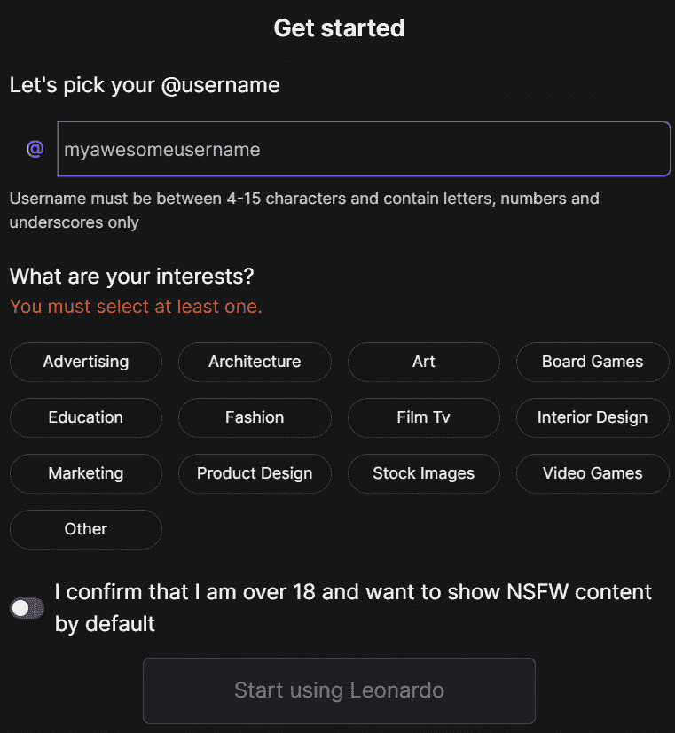

图 9.9 – 第一次登录 Leonardo.Ai

在主页视图中，列出了我们可以互动的模型，具体取决于我们想生成的图像类型。如前所述，每个模型都是针对特定目的进行优化的。例如，有一个模型专门用于复古风格摄影或角色扮演游戏角色肖像。

我们还可以看到两个标签，分别是**社区动态**和**个人动态**，它们显示由社区和我们自己生成的图像。

如果我们转到 AI 生成工具，我们将看到视图左侧有多个选项可供选择，其中包括以下内容：

+   **图像数量**：这使我们可以选择每次运行时生成的图像数量。

+   **提示魔力**：根据他们的描述，“*我们的实验性渲染管道可能具有更好的提示遵循性*”。启用此功能后，生成的图像更加艺术化。

+   **提示魔力强度**：此选项决定了之前渲染的详细程度的权重。

+   **公开图像**：此选项允许我们选择是否将这些图像与公共动态分享。

+   **图像尺寸**：此选项让我们可以设置图像的大小。

+   **指导尺度**：此选项决定了提示在最终图像中的权重。建议将其保持在 7 或 8。

我们还可以上传一张图片作为提示使用。

关于好提示的说明

**词汇**：避免使用“very”或“super”来表示强调。相反，可以选择表达相同意思的词汇。例如，将“very tired”替换为“exhausted”。

**拼写错误**：避免发送拼写错误的单词、缩写、收缩词或俚语，因为模型可能难以将它们与其训练时所使用的数据集对齐。

**具体性**：尽量减少词汇选择中的模糊性和不必要的文本。为了提高效果，可以使用“cheeseless pizza”而不是“pizza with no cheese”。利用负面提示来排除图像中的特定物体或特征。

**需要考虑的关键词**：包括图像背景、风格词（如动漫、写实、纸艺、立体主义、炭笔画、民间艺术、涂鸦）、光线（柔光、环境光、霓虹灯、工作室灯光）或一天中的时间（早晨、黄金时段、午夜）的提示。

此外，该应用还帮助我们生成提示。在我们刚刚描述的 AI 工具中，我们可以看到**提示生成**标签，它帮助我们生成提示，以便使用 AI 获取所需的图像。

### 亲自体验 Leonardo.Ai

让我们通过 API 做一个练习。文档可以在[`docs.leonardo.ai/reference/getuserself`](https://docs.leonardo.ai/reference/getuserself)找到。它是一个易于使用的 API，可以通过我们熟悉的`request`库进行访问。

API 可以帮助我们从提示到文件夹的整个管道建设，我们可以将其提交给艺术团队进行审核。`Leonardo_AI.ipynb`文件包含我们将要探索的工作流。

尽管 API 仍在开发中，并且并非所有功能和模型都可以通过程序调用，但前面描述的大部分选项都可以作为参数添加到负载中。

让我们查看以下代码片段：

```py
payload = {
    "prompt": prompt,
    "modelId":"6bef9f1b-29cb-40c7-b9df-32b51c1f67d3",
    "width": 512,
    "height": 512,
    "sd_version": "v2",
    "presetStyle": "LEONARDO",
     "public": False,
    "promptMagic": True
}
```

要与 API 互动，我们需要登录并获得一组 API 密钥，这些密钥将作为授权信息传递在请求头中。

重要的是要从网站上阅读参数，因为文档并不完整。例如，有些模型是以特定的图像尺寸进行训练的，因此最好将这些首选尺寸输入到参数负载中。此外，并非所有模型都可以通过 API 调用，也无法访问提示生成器。

尽管有这些限制，这仍然是一个很棒的工具，可以帮助我们快速生成高质量的图像。

# 铸造一个 NFT 收藏

本节分析所有工具的目的是为了创建或修改我们可以出售的图像，或者艺术团队可以出售的图像。一旦我们生成了图像，我们希望以 Web3 的方式“拥有”它们，正如在 *第四章* 中解释的那样。为了实现这一目标，我们将在市场平台上创建一个收藏。

**铸造**是指在区块链上创建一个物品的数字踪迹。正如我们在描述 ERC 721 时看到的，它意味着这个踪迹将指向一个包含存储图像的 URL。所有存储在区块链上的内容都需要支付油费。

懒铸造的概念相对较新。**懒铸造**意味着授权平台在 NFT 售出时铸造 NFT，而不是提前铸造。这一点很重要，因为铸造需要消耗油费，在高峰期油费可能很高。此外，懒铸造有助于减少创建一个可能不会高价售出的收藏品的风险。截至目前，主要的市场平台，如 OpenSea 和 Rarible，提供这一服务。

该过程包括以下步骤：

1.  创作者通过特定的智能合约 *懒铸造* NFT。智能合约会代表我们铸造并出售 NFT。我们提供授权。

1.  买家在购买我们的 NFT 时支付包括铸造费用和 NFT 本身的费用。

这种方法将铸造过程推迟到 NFT 售出之前，这是对创作者的激励，鼓励他们继续创作和展示艺术作品，而无需支付油费。

让我们在 OpenSea 上创建一个收藏：

1.  访问 [`opensea.io/`](https://opensea.io/)。要与平台互动，你需要一个钱包。

1.  连接你的钱包并进入个人资料选项：


图 9.10 – 连接到你的钱包

1.  点击 **我的收藏**：


图 9.11 – 我的收藏标签页

1.  点击蓝色的 **创建一个** **收藏** 按钮：


图 9.12 – 我的集合页面

1.  系统会提供两个选项：传统选项（**部署您自己的合约**）和懒铸造选项（**使用 OpenSea 合约**）。点击第二个选项：

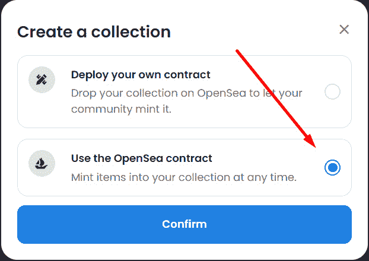

图 9.13 – 选择懒铸造选项

1.  会打开一个页面，您可以在其中填写集合的详细信息。我们将找到以下几个细节：

    1.  集合的名称。

    1.  描述

    1.  可接受的货币。

    1.  集合页面的图片。

    1.  作者收益。如我们在*第四章*中提到的，每次 NFT 被出售时，可以设定创作者将保留的百分比。

填写完所有必需的详细信息后，点击**保存**。现在我们有了一个集合，接下来需要将艺术品添加到其中：

1.  返回您的个人资料并点击**创建**：

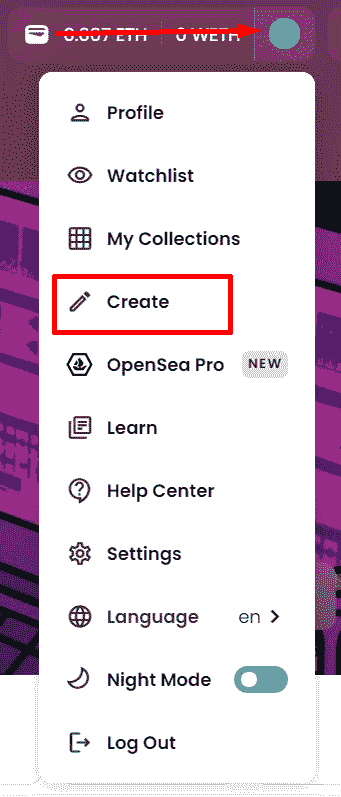

图 9.14 – 创建 NFT

1.  您可能需要额外的授权才能访问此面板。如果是这样，您将被带到**创建新项目**页面：[`opensea.io/asset/create`](https://opensea.io/asset/create)。

1.  上传您想要铸造的图片、视频或音频。在这个示例中，我们将铸造一张使用`Leonardo_AI.ipynb`笔记本生成的图片：

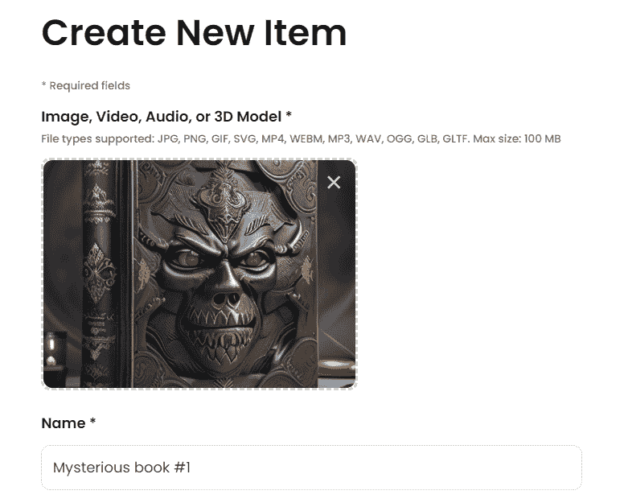

图 9.15 – 新项目的详细信息

1.  开始填写必填字段：

    1.  名称

    1.  描述

    1.  将其连接到之前在*步骤* *4*中创建的集合

    1.  确定可以铸造的相同性质的物品数量

    1.  该物品将所在的网络

    点击**创建**；您将看到以下输出：

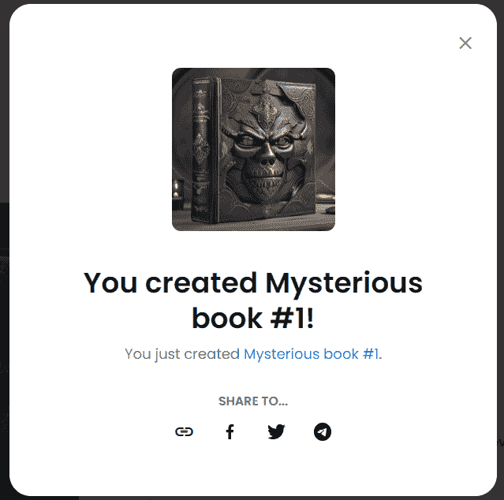

图 9.16 – 签署创建后的结果信息

1.  启用销售。为此，请访问该物品的页面并点击**出售**按钮：


图 9.17 – 销售详情

新选项将会出现供您选择。可以选择固定价格或限定时间的拍卖。如果我们想以固定价格出售，可以按照以下步骤操作。

1.  点击**固定价格**：

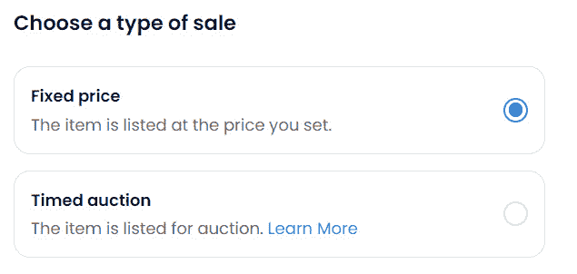

图 9.18 – 固定价格选项

1.  设置一个价格，使用我们在创建集合时决定的任何可接受的货币或代币。

1.  在此下方，我们将看到收益的总结以及 OpenSea 收取的费用（在写作时，这个费用为 2.5%）。

1.  如果我们同意，可以点击**完成列表**。为了批准这个列表，OpenSea 需要我们的签名。

1.  一旦签署完成，我们将收到新的通知，告知我们该物品已列出。现在，它已经在市场上，可以购买了！

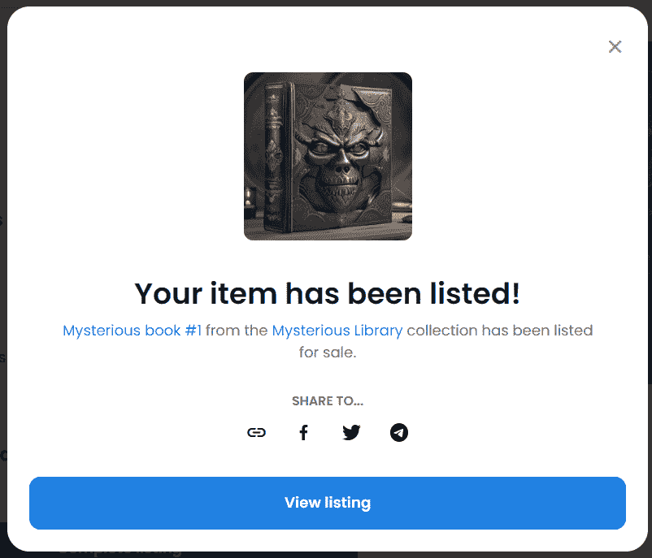

图 9.19 – 销售列表已启用

本节中生成的所有插图均可在《神秘图书馆收藏》查看：[`opensea.io/collection/mysterious-library`](https://opensea.io/collection/mysterious-library)。

# 总结

在本章中，我们探讨了三种不同的使用 AI 工具进行艺术项目的方式。我们研究了使用 GAN 模型为草图上色，探索了 VGG19 模型进行风格转移，并发现了基于提示生成艺术的 Stable Diffusion 模型的最先进应用。

此外，我们还了解了整个工作流程，从完成的艺术作品到将最终图像列出在市场上。通过结合 AI 和区块链技术的力量，我们现在有了探索和变现艺术作品的新机会，以激动人心和创新的方式。

值得注意的是，关于使用 AI 生成的图像的所有权问题已经引发了讨论。这源于这些模型可能在没有艺术家同意的情况下使用了受版权保护的艺术作品进行训练的可能性。回应者认为，模型输出的变革性特征，加上合理使用的论点，可能会驳回此类指控。这个持续的问题尚未被法律当局明确解决，并且可能在不同国家之间存在差异。

在探索了 NFT 领域之后，我们将把注意力转向一个关键方面，这一方面是确保这一创新领域完整性的基础——欺诈检测。在接下来的章节中，我们将分析另一个应用案例，在这个案例中，机器学习可以帮助我们发现异常并提高交易安全性。

# 进一步阅读

想要了解更多本章所涵盖的主题，请参考以下资源：

+   Crypto Grims: [`twitter.com/cryptogrims`](https://twitter.com/cryptogrims)

+   Artsy Monke 收藏品: [`opensea.io/assets/ethereum/0xa4bcd3b7f141ba1f08f36033fdfce691565561bc`](https://opensea.io/assets/ethereum/0xa4bcd3b7f141ba1f08f36033fdfce691565561bc)。

+   Mishra, M. (2020, September 2). *卷积神经网络解析*. Medium. 可在[`towardsdatascience.com/convolutional-neural-networks-explained-9cc5188c4939`](https://towardsdatascience.com/convolutional-neural-networks-explained-9cc5188c4939)查看。

+   Fortis, S. (n.d.). *Google AI 将所有 10,000 个 BAYC NFT 转化为机器生成艺术*. Cointelegraph. 可在[`cointelegraph.com/news/google-ai-turns-all-10-000-bayc-nfts-into-machine-made-art`](https://cointelegraph.com/news/google-ai-turns-all-10-000-bayc-nfts-into-machine-made-art)查看。

+   Lllyasviel (n.d.). *style2paints.github.io*. 可在[`style2paints.github.io/`](https://style2paints.github.io/)查看。

+   Lllyasviel/style2paints. (n.d.). GitHub. 可在[`github.com/lllyasviel/style2paints`](https://github.com/lllyasviel/style2paints)查看。

+   Tang, J.（2020 年 10 月 20 日）。*尝试理解一个全明星自动上色项目——Style2Paints（第一部分）*。Medium。可在[`medium.com/ai-innovation/attempt-to-understand-an-all-star-auto-color-project-style2paints-part-1-84d2e3d96da`](https://medium.com/ai-innovation/attempt-to-understand-an-all-star-auto-color-project-style2paints-part-1-84d2e3d96da)查看。

+   Lvmin Zhang, Chengze Li, Tien-Tsin Wong, Yi Ji 和 Chunping Liu。（无日期）。*CUHK 计算机科学与工程*。可在[`www.cse.cuhk.edu.hk/~ttwong/papers/colorize/colorize.pdf`](https://www.cse.cuhk.edu.hk/~ttwong/papers/colorize/colorize.pdf)查看。

+   Nerdy Rodent。（2020 年 11 月 19 日）。*Style2Paints——使用 AI 轻松为任何线条艺术上色* [视频]。YouTube。可在[`www.youtube.com/watch?v=cvN9oQfC3w0`](https://www.youtube.com/watch?v=cvN9oQfC3w0)查看。

+   GAN 结构概述。（无日期）。*Google 开发者平台*。可在[`developers.google.com/machine-learning/gan/gan_structure`](https://developers.google.com/machine-learning/gan/gan_structure)查看。

+   Prof. Jeff Heaton – 圣路易斯华盛顿大学。（2022 年 1 月 19 日）。*图像和数据生成的 GAN 入门（7.1）* [视频]。YouTube。可在[`www.youtube.com/watch?v=hZw-AjbdN5k`](https://www.youtube.com/watch?v=hZw-AjbdN5k)查看。

+   Prof. Jeff Heaton – 圣路易斯华盛顿大学。（2021 年 2 月 17 日）。*从您自己的图像训练 GAN：StyleGAN2 ADA* [视频]。YouTube。可在[`www.youtube.com/watch?v=kbDd5lW6rkM`](https://www.youtube.com/watch?v=kbDd5lW6rkM)查看。

+   Prof. Jeff Heaton – 圣路易斯华盛顿大学。（2021 年 5 月 12 日）。*在 Colab Free 和 Colab Pro 技巧下训练 NVIDIA StyleGAN2 ADA* [视频]。YouTube。可在[`www.youtube.com/watch?v=L3JLzoe-dJU`](https://www.youtube.com/watch?v=L3JLzoe-dJU)查看。

+   *T81_558_deep_learning/t81_558_class_07_1_gan_intro.ipynb at master · jeffheaton/t81_558_deep_learning*。（无日期）。GitHub。可在[`github.com/jeffheaton/t81_558_deep_learning/blob/master/t81_558_class_07_1_gan_intro.ipynb`](https://github.com/jeffheaton/t81_558_deep_learning/blob/master/t81_558_class_07_1_gan_intro.ipynb)查看。

+   *T81_558_deep_learning/t81_558_class_07_2_train_gan.ipynb at master · jeffheaton/t81_558_deep_learning*。（无日期）。GitHub。可在[`github.com/jeffheaton/t81_558_deep_learning/blob/master/t81_558_class_07_2_train_gan.ipynb`](https://github.com/jeffheaton/t81_558_deep_learning/blob/master/t81_558_class_07_2_train_gan.ipynb)查看。

+   Jason Brownlee 博士。（2019 年 7 月 19 日）。*机器学习精通*。机器学习精通。可在[`machinelearningmastery.com/what-are-generative-adversarial-networks-gans/`](https://machinelearningmastery.com/what-are-generative-adversarial-networks-gans/)查看。

+   *立体主义的 4 个特征及其重要性*。（无日期）。Artlex – 艺术词典和百科全书。可在 [`www.artlex.com/art-movements/cubism/characteristics/`](https://www.artlex.com/art-movements/cubism/characteristics/) 获取。

+   *神经风格* *迁移*：[`keras.io/examples/generative/neural_style_transfer/`](https://keras.io/examples/generative/neural_style_transfer/)。

+   *DALL·E：从文本创建图像*。（无日期）。OpenAI。可在 [`openai.com/research/dall-e`](https://openai.com/research/dall-e) 获取。

+   *零-shot 文本到图像生成*。（无日期）。arXiv.org。可在 [`arxiv.org/abs/2102.12092`](https://arxiv.org/abs/2102.12092) 获取。

+   Aleksa Gordić - The AI Epiphany. (2022 年 9 月 1 日). *稳定扩散：使用潜在扩散模型进行高分辨率图像合成 | ML 编程系列* [视频]。YouTube。可在 [`www.youtube.com/watch?v=f6PtJKdey8E`](https://www.youtube.com/watch?v=f6PtJKdey8E) 获取。

+   *Stability-AI/stablediffusion*。（无日期）。GitHub。可在 [`github.com/Stability-AI/stablediffusion`](https://github.com/Stability-AI/stablediffusion) 获取。

+   *稳定扩散是如何工作的？潜在扩散模型解析*。（2022 年 12 月 3 日）。Louis Bouchard。可在 [`www.louisbouchard.ai/latent-diffusion-models/`](https://www.louisbouchard.ai/latent-diffusion-models/) 获取。

+   Arya, G. (2023 年 1 月 14 日). *潜在扩散模型的力量：革命性的图像创作*。Analytics Vidhya。可在 [`www.analyticsvidhya.com/blog/2023/01/power-of-latent-diffusion-models-revolutionizing-image-creation/`](https://www.analyticsvidhya.com/blog/2023/01/power-of-latent-diffusion-models-revolutionizing-image-creation/) 获取。

+   *API 文档*。（无日期）。Leonardo.Ai。可在 [`docs.leonardo.ai/reference/getuserself`](https://docs.leonardo.ai/reference/getuserself) 获取。

+   Ashley, K. (2021). *用人工智能创作艺术：用 AI、区块链和 NFT 创作并销售你的艺术*。
