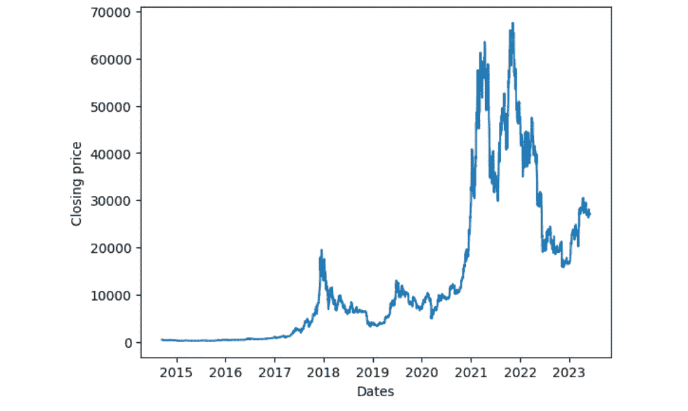
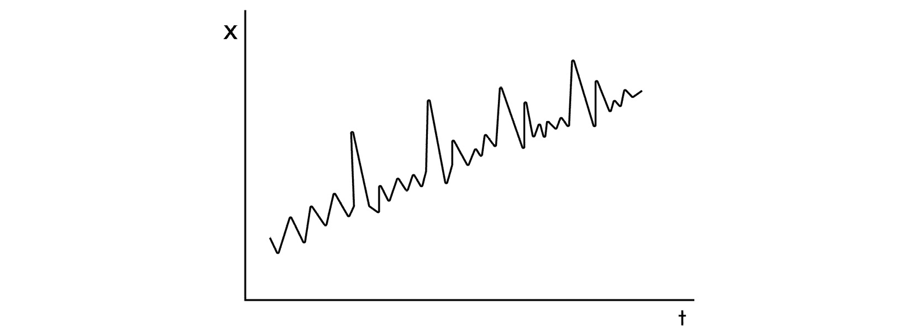
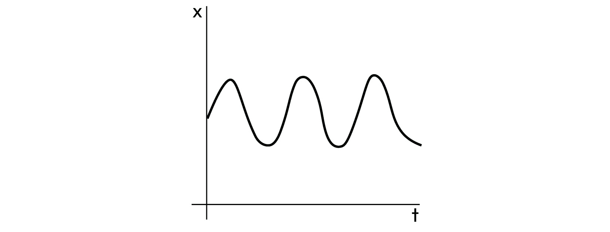
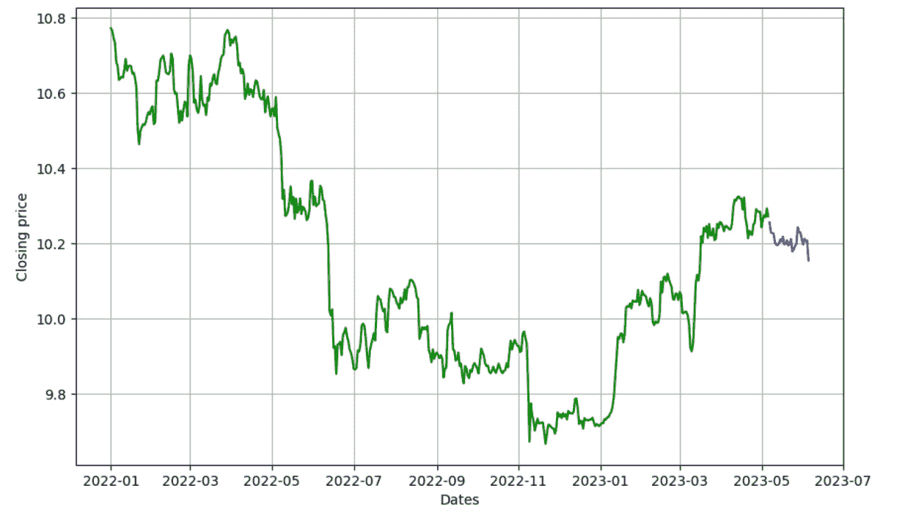
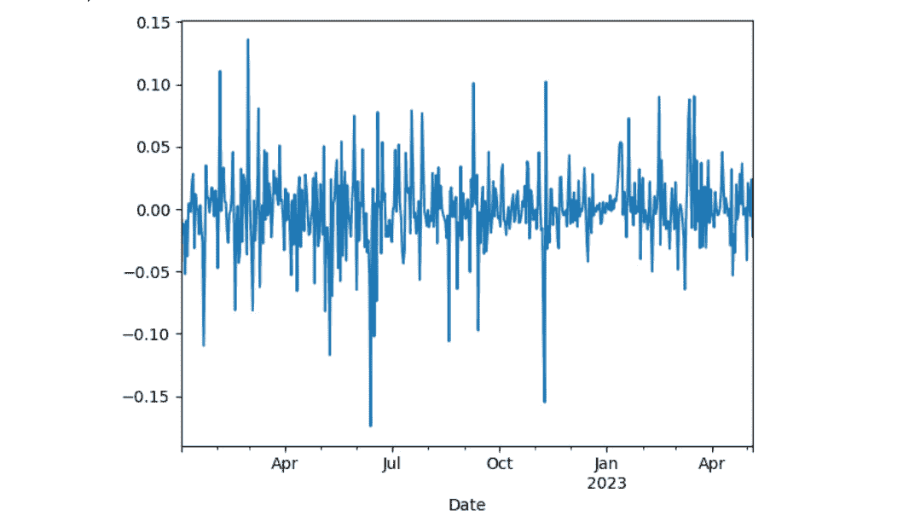
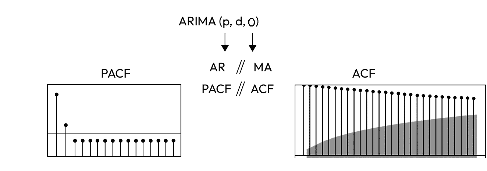
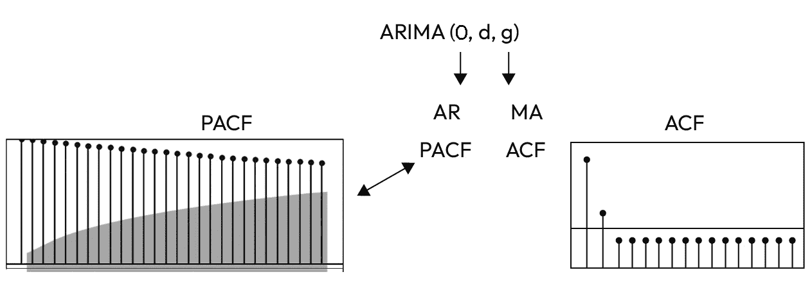
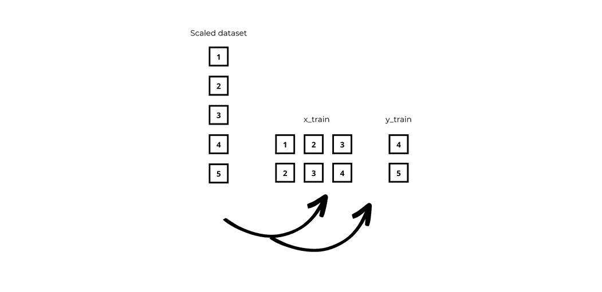
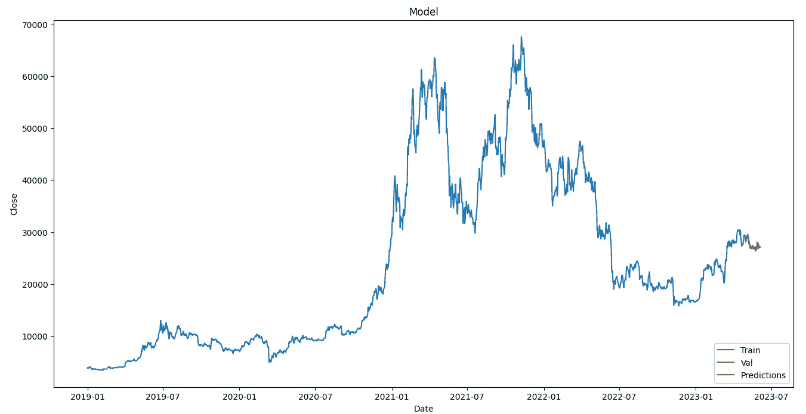

# 11

# 使用时间序列进行价格预测

金融行业中，分析师和研究人员花费大量时间进行投资机会预测，包括资产价格和资产收益。随着大量数据的可用性和处理技术的进步，**机器学习**（**ML**）得到了迅猛发展，应用领域也从资产定价扩展到如保险定价、投资组合管理和风险管理等领域。

除了机器学习在金融行业中的广泛应用外，我们现在还可以考虑 Web3 和开放数据的影响。正如我们在本书中所学到的，Web3 中的数据是任何人都可以访问的。特权信息，如银行余额或重要账户变动，任何知道去哪里查看的人都可以看到，正如在*第五章*中所解释的那样。

金融行业中的许多资产建模和预测问题都涉及时间因素和连续输出的估计。因此，本章的重点将放在时间序列分析上，理解这些输出是什么，以及如何对其建模。我们的目标是利用包括时间因素在内的历史数据点，来预测未来的结果，特别是在预测价格的背景下。

总结一下，本章将涵盖以下主题：

+   时间序列基础

+   数据库选择和特征工程

+   模型建立、训练和结果评估

我们将同时采用传统统计模型和**深度学习**（**DL**）方法来捕捉时间序列数据中的模式和动态。

# 技术要求

在本章中，我们将使用`statsmodels`库，特别是其时间序列分析包（`tsa`和`statespace`）。`statsmodels`是一个全面的 Python 模块，提供了广泛的类和函数，用于估计各种统计模型，执行统计测试，并进行统计数据探索。对于时间序列分析，它提供了基本的模型，如单变量**自回归**（**AR**）模型，**向量自回归**（**VAR**）模型，以及单变量**自回归滑动平均**（**ARMA**）模型。此外，它还提供了时间序列的描述性统计，如**自相关**和**偏自相关**函数（**ACF**和**PACF**）。

如果你之前没有使用过`statsmodels`，可以通过以下命令进行安装：

```py
pip install statsmodels
```

`statsmodels`的文档可以在[`www.statsmodels.org/stable/index.xhtml`](https://www.statsmodels.org/stable/index.xhtml)找到。

我们还将使用`pmdarima`，它允许我们与`pmdarima`进行交互，`pmdarima`作为多个统计和机器学习库（包括`statsmodels`和`scikit-learn`）的 Python 封装。如果你之前没有使用过`pmdarima`，可以通过以下命令安装：

```py
pip install pmdarima
```

`pmdarima` 的文档可以在 [`alkaline-ml.com/pmdarima/`](http://alkaline-ml.com/pmdarima/) 找到。

我们还将从 `yfinance` 中提取我们的工作数据集，`yfinance` 是一个开源的 Python 库，作为 Yahoo Finance API 的接口，提供便捷的金融数据访问，包括股市价格、历史数据、股息信息等。要安装该库，我们需要运行以下命令：

```py
pip install yfinance
```

`yfinance` 的文档可以在 [`pypi.org/project/yfinance/`](https://pypi.org/project/yfinance/) 找到。

与本章相关的所有数据和代码文件可以在本书的 GitHub 仓库中访问，点击此处查看：

[`github.com/PacktPublishing/Data-Science-for-Web3/tree/main/Chapter11`](https://github.com/PacktPublishing/Data-Science-for-Web3/tree/main/Chapter11)

我们建议你阅读 `Chapter11` 文件夹中的代码文件，以便更有效地跟随本章内容。

# 时间序列基础

时间序列是一组在时间上等间隔观测值的集合。

– 路易斯·阿尔贝里科·吉尔-阿拉尼亚

吉尔-阿拉尼亚教授提到的观测值集合形成了一系列事件，这些事件随着时间的推移按时间顺序展开并发展。

这些观测值代表了随时间变化或波动的各种数据点，例如股价、温度读数、销售数据、网站流量、区块链交易数量等。每个观测值都包含关于过去的宝贵信息，并为未来的趋势提供线索。

一个代表 **比特币-美元**（**BTC-USD**）月度收盘价的 10 个月时间序列如下所示：

| **日期** | **收盘价** |
| --- | --- |
| 2014/10/1 | 338.321014 |
| 2014/11/1 | 378.046997 |
| 2014/12/1 | 320.192993 |
| 2015/1/1 | 217.464005 |
| 2015/2/1 | 254.263 |
| 2015/3/1 | 244.223999 |
| 2015/4/1 | 236.145004 |
| 2015/5/1 | 230.190002 |
| 2015/6/1 | 263.071991 |
| 2015/7/1 | 284.649994 |

表 11.1 – BTC-USD 时间序列片段（来源：Yahoo Finance）

在我们分析时间序列数据时，可以识别模式、趋势和波动。这些模式可能揭示反复出现的主题，遵循清晰的轨迹，或者表现出混乱和不可预测的行为。以下是自 2015 年以来 BTC 价格的时间序列可视化：



图 11.1 – 整个系列的图示

时间序列包括以下组成部分：

**趋势**：这代表系列的整体方向性运动。趋势可以是确定性的，由潜在的理由驱动，或者是随机的，表现出随机行为。

在下一个例子中，我们观察到自 2017 年以来的持续上升趋势，并且在过去 2 年中加速：


图 11.2：趋势图

**季节性**：这部分指的是系列中在特定时间框架内重复出现的周期或模式。

在给定的数据集中，我们可以观察到每年中期的下降和年末的增长：


图 11.3 – 季节性成分

**白噪声**：这表示系列中未被趋势或季节性成分捕获的部分。

在给定的数据集中，该成分最初看起来是平坦的，但在特定点呈现出高峰，如 2017-2018 年末和 2021 年：


图 11.4 – 白噪声表示

为了分解时间序列以分析其成分，我们可以使用以下代码：

```py
decompose = seasonal_decompose(df, model= 'additive').plot(observed=True, seasonal=True, trend=True, resid=True, weights=False)
```

时间序列分析中还有两个相关概念：自相关和平稳性。

**自相关**：这指的是序列中连续点之间的依赖关系。它表明给定时间段的值受先前时间段的测量影响。自回归的顺序表示用于预测当前值的先前值数量，称为*滞后*。例如，如果我们使用前 2 个月的价格来预测比特币的月均价，这对应于滞后为 2 的自相关。

**平稳**：如果“*均值和方差不依赖于时间，并且任何两个观测值之间的协方差仅取决于它们之间的距离，而不取决于具体的时间位置*”（*Luis Alberiko Gil-Alaña*）。对于许多时间序列模型和分析，平稳性是一个重要的假设。我们可以从前述引用中得出结论，具有趋势或季节性的时间序列不能被认为是平稳的。

例如，以下时间序列示例明显呈上升趋势，因此不是平稳的：



图 11.5 – 带有趋势的时间序列

以下时间序列随着时间的推移和趋势具有增加的方差，因此不是平稳的：


图 11.6 – 方差时间序列

以下时间序列没有趋势或季节性，因此可以被视为平稳的：



图 11.7 – 平稳时间序列

现在我们已经了解了理论，让我们介绍数据集。

# 探索数据集

对于价格预测，我们将利用两个数据集。第一个数据集是从 Yahoo Finance 提取的 BTC 价格时间序列数据，以每日为粒度。

为了提取它，我们使用 Yfinance 库和以下代码：

```py
data=yf.Ticker('BTC-USD')
df= data.history (start='YEAR-MONTH-DAY', end='YEAR-MONTH-DAY')
```

该数据集包含多个列，但我们将重点关注收盘价列和日期列。`date` 列需要作为索引使用，并指定频率。如果数据源不是 Yfinance（它已经处理了这一点），以下代码片段可能会很有帮助：

```py
df = df.set_index(pd.DatetimeIndex(df['Date'], freq='D'))
```

作为 Web3 数据集，相较于传统的金融股票价格数据集，它也包括了周末的价格，反映了市场的连续运营特点。在选择时间序列数据集时，必须确保没有缺失值，或者使用适当的技术处理它们。

如果只需要处理工作日，Pandas 库提供了一些额外的函数，比如`USFederalHolidayCalendar`，它导入假期日历并提供假期列表：

```py
from pandas.tseries.holiday import USFederalHolidayCalendar
```

`CustomBusinessDay` 类提供了一个参数化的 `BusinessDay` 类，可用于创建自定义的工作日日历，以适应本地假期和本地周末惯例：

```py
from pandas.tseries.offsets import CustomBusinessDay
```

此外，我们还准备了一个由新闻文章及其对应的**情感分析**（**SA**）组成的数据集。对于我们希望建模的比特币（BTC）价格时间序列中的每一天，我们将其与一组新闻文章及其相应的 SA 匹配。我们将验证一个假设，即将来自现实世界的外部信息纳入模型中，将提高预测性能。其他可以考虑的变量包括交易量、包含*BTC*一词的推文数量、距下次减半事件（即比特币挖矿奖励减半，每约四年发生一次）的剩余天数等。

在**探索性数据分析**（**EDA**）过程中，可能会发现数据集中的缺失值、异常值或不规则情况。如在*第一章*中所讨论，有些时候由于极端波动，市场价格会暂停，例如 UST 脱钩。在处理包含这些问题的数据集时，我们应如何应对？对于平稳序列，非时间序列特定方法，如均值或中位数插补，是有效的。针对时间序列的特定技术包括**最近观察值前推**（**LOCF**），它用紧接前一个观察值填充缺失值；以及**下一观察值后推**（**NOCB**），它用紧接后一个观察值填充缺失值。另一种方法是插值，根据假定的观察值之间的关系，可以是线性、插值多项式或样条插值。有关解决这一问题的更多方法，参见*进一步阅读*部分。

在深入研究模型之前，重要的是要解决时间序列数据的训练-测试集拆分概念。与我们迄今为止分析的传统数据集不同，时间序列模型本质上具有内生的时间性，这正是我们希望捕捉的内容。这意味着，值在时间序列中的位置将对未来的点产生影响。为了理解并捕捉这种时间关系，我们必须保持时间序列及任何外生变量的时间顺序。随机拆分数据不适用于时间序列分析。

在这种情况下，测试数据集将由序列中最新的部分组成，而训练数据集将包括从序列开始到所选测试部分的所有行。

Sklearn 提供了一个有用的类来执行这种拆分，叫做`TimeSeriesSplit`：

```py
from sklearn.model_selection import TimeSeriesSplit
```

文档可以在以下链接中找到：

[`scikitlearn.org/stable/modules/generated/sklearn.model_selection.TimeSeriesSplit.xhtml`](https://scikitlearn.org/stable/modules/generated/sklearn.model_selection.TimeSeriesSplit.xhtml)

我们尝试解决的挑战是预测那些不包含在训练中的日期的 BTC 价格。时间序列问题可以通过使用统计建模来处理，我们将其称为传统方法，也可以通过机器学习来处理，在这种方法中我们将训练一个**长短期记忆**（**LSTM**）模型。

# 讨论传统的数据处理管道

初步的方法涉及统计建模，使用像 ARIMA、**带外生变量的 ARIMA**（**ARIMAX**）和自动 ARIMA 等模型。为了使用这些模型，我们需要解决两个额外的挑战：确保时间序列的平稳性和确定合适的模型阶数。

统计模型在应用于平稳时间序列时表现更好。像 ARIMA 这样的传统统计时间序列模型在处理平稳时间序列时更为有效。解决这个问题将是预处理阶段的一部分。

第二个挑战出现在建模阶段，这涉及理解数据集、确定合适的滞后和定义时间窗口。我们将使用 Auto ARIMA 算法手动接近解决方案，它会自动处理超参数。

## 数据预处理

可以采用多种函数将非平稳时间序列数据转换为适合我们模型的格式。例如，差分、对数变换、**移动平均**（**MAs**）、百分比变化、滞后和累积和等。

差分计算连续观测值之间的差异。这个技术通过去除某个水平的变化来帮助稳定时间序列的均值，从而减少或消除趋势和季节性。

在`Traditional time series models.ipynb`笔记本中，我们从一个看起来像这样的数据集开始：



图 11.8 – 完整时间序列

为了应用差分，我们可以使用以下代码：

```py
df.diff().dropna()
```

经过这样的处理，数据集转换如下：



图 11.9 – 差分时间序列

在某些情况下，仅进行一次差分可能无法使序列变为平稳。在这种情况下，可能需要进行第二次差分以实现平稳。

其他函数，如百分比变化、对数差分和 MA，也可以帮助减少趋势和季节性，使序列更像白噪声。对数变换在处理非恒定方差时尤其有用，而 MA 对于波动性较高的序列也有益。

为了帮助判断一个序列是否平稳，我们可以使用统计检验方法，如迪基-富勒检验。该检验是基于根的检验，重点关注与时间序列变量第一阶滞后相关的系数。如果该系数等于 1（表示单位根），则该时间序列表现为非平稳，即原假设。如果检验结果为负且具有统计学显著性，我们拒绝原假设，表明该时间序列是平稳的。还有其他类似的检验方法，如**Kwiatkowski-Phillips-Schmidt-Shin**（**KPSS**）检验或 Phillips-Perron 检验。由于解释超出了本书的范围，但它们都可以从我们使用的同一库中获得。一旦我们获得了平稳的数据集，就可以开始建模。

## 建模 – ARIMA/SARIMAX 和 Auto ARIMA

在用于预测未来值的统计算法中，我们遇到了 ARIMA/SARIMAX 和 Auto ARIMA。ARIMA 考虑过去的值来预测未来的值，而 SARIMAX 则结合了季节性模式和外生变量。Auto ARIMA 则基于训练数据自动化建模过程。

这些模型的名称源自其包含的概念。**ARIMA**代表**自回归**（**AR**）-**差分**（**I**）-**移动平均**（**MA**）。**SARIMAX**在此基础上增加了**S**，表示**季节性**，以及**X**，表示**外生性**，因为它可以输入独立变量。**Auto ARIMA**则在**Auto**（自动建模）前缀的基础上进一步简化了建模过程。让我们深入探讨这些概念。

**AR**确定时间序列自身的回归阶数。它假设最新的数据点值依赖于前一个值，并且该依赖关系具有我们确定的滞后数，即*滞后观测数*。

我们可以通过使用 PACF 图来确定回归阶数，该图是`statsmodels`库的一部分。以下代码可用于绘制该图：

```py
pacf_td = plot_pacf(training_data)
```

PACF 衡量过去值与当前值之间的直接相关性，并检查每个滞后的尖峰以确定其显著性。如果某个滞后的尖峰超出了显著性限制，则表明该滞后的相关性不为零。显著相关性的数量决定了 AR 项（p）的阶数。

**I** 表示使序列平稳所需的差分次数。

**MA** 根据过去的预测误差来建模时间序列的误差，假设当前误差依赖于先前的误差，并且具有我们确定的滞后。这本质上对应于时间序列数据上“窗口”函数的大小，并且对应于模型中的 MA (*q*) 部分。我们可以通过检查自相关图 (ACF) 来确定 q 的阶数。

ACF 展示了时间序列元素之间是正相关、负相关，还是相互独立的。横轴表示滞后值，尖峰显示了这些滞后值的相关性程度。我们根据远离零的统计显著尖峰，考虑一个阶数为 q 的 ACF。

为了绘制 ACF，我们可以使用以下代码，利用 `statsmodels` 库：

```py
acf_diff = plot_acf(df_train_diff)
```

这里是开始测试模型的一个经验法则：

如果 PACF 在滞后 p 处有显著尖峰但之后没有，并且 ACF 图呈现更渐进的衰减，我们将为模型使用以下阶数：ARIMA (p,d,0)：



图 11.10 – 假设 1

如果 ACF 图在滞后 q 处有显著尖峰但之后没有，并且 PACF 图呈现出更渐进的衰减，我们将为模型使用以下阶数：ARIMA (0,d,q)：



图 11.11 – 假设 2

`m` 表示时间周期。它将以类似时间序列的方式建模。SARIMA 的季节性组件的具体内容如下：

`SARIMA(p,d,q)`**(P,D,Q)[m]**

组件定义如下：

+   `P`：季节性 AR 阶数。

+   `D`：季节性差分阶数。

+   `Q`：季节性 MA 阶数。

+   `m`：单个季节性周期的时间步数。为了得到这个数字，通常需要分解我们希望预测的相似时间段（始终使用训练数据集）以观察季节性。在此分析中，我们看到季节性为 8 天。

为了评估模型，我们采用一种传统的回归指标——**均方根误差** (**RMSE**)。RMSE 是一种统计度量，用于评估模型预测准确性，方法是计算 **均方误差** (**MSE**) 的平方根。MSE 是原始值与预测值之间平方差的平均值。RMSE 产生一个单一、易于解释的值，代表预测模型误差的典型大小。较低的 RMSE 表示预测值与实际值之间的拟合度更好，反映了模型的预测更为准确。另一个相关指标是 **平均绝对误差** (**MAE**)，它表示数据集中实际值与预测值之间绝对差值的平均值。

RMSE 被广泛用于比较回归模型的性能，特别是因为它与因变量的单位相同，从而使得结果更容易解释。

在 Jupyter 笔记本中，我们可以观察到模型还可以进一步改进。手动建模的结果是 RMSE 值为 `0.073`。

## Auto ARIMA

Auto ARIMA 很好地处理了超参数调优任务。它会自动生成参数（`p`，`d`，`q`）的最优值。

被称为**赤池信息量准则**（**AIC**）的度量，用于选择回归模型的预测变量，用来确定 ARIMA 模型的阶数。特别地，Auto ARIMA 模型在拟合过程中通过迭代来寻找能最小化 AIC 的最佳参数组合。根据文档，它*类似于网格搜索*，尝试不同的 p 和 q 参数组合。对于差分项，Auto ARIMA 使用如扩展的迪基-富勒（Augmented Dickey-Fuller）检验等平稳性检验，并考虑季节性。

这种方法显著改善了我们的模型，节省了时间并减少了人为错误。为了实现它，我们可以使用以下代码：

```py
pm.auto_arima(training_data, stepwise=False, seasonal=True, n_jobs=-1, trace=True)
```

传入的参数如下：

+   `training_data`：这是我们希望建模的时间序列数据。

+   `stepwise`：一个布尔参数，控制函数是否应执行逐步搜索以找到最佳 ARIMA 模型。如果设置为 `True`，函数将执行逐步搜索（即，它将迭代考虑添加或删除 AR、MA 或 I 组件）。如果设置为 `False`，函数将通过对所有可能组合进行穷举搜索来查找最佳 ARIMA 模型，类似于网格搜索。逐步搜索较快，但可能并不总是能找到最佳模型。

+   `seasonal`：一个布尔参数，指定模型是否应包括季节性成分（例如 SARIMA）。如果设置为 `True`，该函数将搜索数据中的季节性模式。如果设置为 `False`，则仅考虑非季节性的 ARIMA 模型。

+   `n_jobs`：该参数控制在执行模型搜索时使用的 CPU 核心数。将其设置为`-1`表示使用所有可用的 CPU 核心，这可以加快搜索过程，尤其是在数据集较大的时候。

+   `trace`：这是一个调试参数。当设置为 `True` 时，它启用详细输出，包含诊断信息和模型搜索过程中的中间结果。

实现该模型后，RMSE 显著下降；然而，仍有改进空间。现在，让我们看看如何融入特定领域或主题知识。

## 添加外生变量

外生变量是可以被纳入模型的附加信息。这些变量可以来自相同的时间序列，比如观察 BTC 价格在特定小时或日期的波动，或者它们可以是完全外生的，如新闻情感分析或来自 X（前 Twitter）的数据。

在我们的笔记本中，我们将每天新闻的情感作为外生变量纳入模型。该数据集的预处理包括以下内容：

1.  根据 `sentiment_mapping` 字典将新闻情绪映射到以下标准：

    ```py
    sentiment_mapping = {
        'Positive': 1,
        'Negative': -1,
        'Neutral': -1
    z-score value, which behaves as a threshold against which we will identify outliers. Those considered outliers are multiplied by 2\. This is done with the following code in the traditional_time_series_models.ipynb file:

    ```

    outliers = day_sentiment_df[z_scores > threshold]

    outliers['sentiment_number'] = outliers['sentiment_number'] * 2

    day_sentiment_df.update(outliers)

    ```py

    ```

*步骤 1* 和 *步骤 2* 中的两个决策是数据科学家的任意决定，旨在反映加密市场通常会对新闻产生过度反应，无论是正面、负面还是中性新闻。

通过应用外生变量，ARIMAX 和 Auto ARIMA 模型显示出相较于不使用外生变量的版本，RMSE 下降，这是非常积极的：

+   `rmse -` `manual: 0.046`

+   `rmse -` `auto: 0.062`

我们看到，当加入外生变量时，手动调整模型的表现优于 Auto ARIMA 模型。

为了比较这些模型与 LSTM 的性能，我们可以比较 RMSE 指标，或者使用以下代码反转结果，以便比较 USD 价格。要从对数转换中反转，我们可以使用以下代码片段：

```py
testing_data= np.exp(testing_data)
forecast_test=np.exp(forecast_test)
rmse_exog = np.sqrt(mean_squared_error(testing_data, forecast_test))
```

我们已经回顾了统计模型，现在我们继续构建深度学习（DL）模型。

# 使用神经网络 – LSTM

我们在*第八章*中详细解释了 LSTM 的工作原理。简而言之，LSTM 是一种专门设计用来检测数据序列中模式的**递归神经网络**（**RNN**）。它的独特之处在于，相比于传统的 RNN，LSTM 可以在较长时间内保留信息。LSTM 通过选择性地保留相关信息来克服短期记忆问题。

## 数据预处理

我们将把这个问题视为**监督学习**（**SL**）任务。为此，我们将修改训练集，具体方法如下：

1.  使用 `MinMaxScaler()` 缩放数据集。

1.  遍历缩放后的数据集，并提取当前价格（`y_train`）之前的 60 天数据，将其转换为每个价格的特征。结果将是一个训练数据集，其中有 60 个价格列作为每个 BTC 价格（`y_train`）的 `x_train` 特征。总之，对于模型学习的每个数据点，它参考的是 `x_train` 中的前 60 天数据：



图 11.12 – 训练数据集结构

我们使用之前的 60 天作为每一天的输入变量，将其视为输出变量。

## 模型构建

为了构建模型，我们将利用 Keras 库。为此，我们为模型添加了两层 LSTM，每层 50 个神经元，第一层的输入形状为我们的数据集。

我们还添加了两层全连接层，每层分别有 25 和 1 个神经元。模型结构应保持尽可能简单，并且完全可以修改：

```py
model= Sequential ()
model.add (LSTM(50, return_sequences=True, input_shape=(x_train.shape[1],1)))
model.add (LSTM (50, return_sequences = False))
model.add (Dense(25))
model.add (Dense(1))
```

我们稍后会使用 Adam 优化器进行编译，并选择 `mean_squared_error` 作为损失度量：

```py
model.compile (optimizer='Adam', loss='mean_squared_error')
```

为了保存回调，以便分析我们训练的结果，我们设置了 TensorBoard 工具，从一个新的文件夹中读取保存的日志：

```py
tensorboard_callback = tf.keras.callbacks.TensorBoard(log_dir="./logs")
```

## 训练与评估

我们用批量大小为 10 和 35 个 epoch 来训练我们的模型：

```py
model.fit (x_train, y_train, batch_size=10, epochs=35,callbacks=[tensorboard_callback])
```

为了评估模型的预测效果，我们将构建一个包含过去 30 天数据的新数据集，这些数据未曾传递给模型。为此，我们需要遵循与*数据预处理*部分中训练数据集相同的步骤。我们将 60 行数据转化为`x_test`中的列，这些列成为第 61 个值的特征，该值即为要预测的`y`（或`y_test`）。

在预测时，我们只会考虑最后 30 天的数据，并计算预测值与`y_test`值之间的 RMSE。为此，我们可以使用以下代码：

```py
np.sqrt(mean_squared_error(y_test, predictions))
```

如果我们绘制预测值和真实数据的图表，结果还不错。请参阅`Chapter11/LSTM.ipynb`笔记本查看彩色版本：



图 11.13 – 预测值和真实数据

对比模型的 RMSE 显示，在价格高波动的环境中，LSTM 方法表现更好，误差为$457，而最好的 ARIMA 模型误差为$1,283。

需要考虑的一些关键差异如下：

+   **变量之间的关系**：ARIMA 模型假设输入和输出变量之间存在线性关系。它们可以捕捉一些非线性模式，但数据中的复杂非线性依赖关系无法覆盖。LSTM 模型更适合捕捉时间序列数据中的非线性关系和长期依赖性。这使得 LSTM 模型更适合建模具有复杂时间模式的非线性和顺序数据。

+   **训练复杂度**：ARIMA 模型涉及估计 AR、MA 和差分项等参数。LSTM 模型和所有**神经网络**（**NNs**）一样，需要更多的计算资源和训练时间。它们涉及训练多个递归单元层次，且有大量参数。与传统统计模型相比，训练深度学习（DL）模型通常需要更多的数据和计算能力。

在我们分析的库中，可以同时检查这两种方法，比较它们的表现，并评估每个模型的准确性。

# 总结

在本章中，我们探讨了对 BTC 价格时间序列的分析，适用于一个持续运作、波动性高且可能对新闻事件产生夸张反应的市场。

我们首先熟悉了时间序列分析的基本概念，并介绍了传统模型，如 ARIMA 和 Auto ARIMA。对于我们的用例，我们将价格数据集转换为平稳形式，并学习如何将这些模型应用于数据。最后，我们将外部变量（如新闻）纳入模型中。这个外部信息证明是有价值的，有助于减少我们跟踪的误差指标。

此外，我们深入探讨了 LSTM 模型方法，这要求我们以不同的方式重构数据集。这涉及到对数据集的众多修改和调整，以适应 LSTM 模型的特定要求，最终取得了更好的表现。

通过采用一系列综合性技术并结合外部因素，我们在分析和预测代币价格时间序列方面获得了宝贵的洞察。这些发现为进一步探索和完善我们的模型奠定了基础。

# 深入阅读

为了补充本章内容，以下链接可能对您有所帮助：

+   *R 中的时间序列分析第二部分：时间序列转换*。（无日期）。一个展示 R 与 Python 教程的在线社区。*DataScience+*。[`datascienceplus.com/time-series-analysis-in-r-part-2-time-series-transformations/`](https://datascienceplus.com/time-series-analysis-in-r-part-2-time-series-transformations/)

+   *计算机科学*。(*2019 年*，*12 月 22 日*)。*使用 Python 和机器学习进行股票价格预测* [视频]。*YouTube*。[`www.youtube.com/watch?v=QIUxPv5PJOY`](https://www.youtube.com/watch?v=QIUxPv5PJOY)

+   *Luis Alberiko Gil-Alaña*。(*2021*)。*时间序列导论* [PDF 文档]。

+   *加密货币与股市指数。它们相关吗？* *LA Gil-Alaña*，*EJA Abakah*，*MFR Rojo*。*国际商业与金融研究*，*2020*。[`ddfv.ufv.es/bitstream/handle/10641/2229/cryptocurrencies%20and%20stock%20market%20indices.pdf?sequence=1&isAllowed=y`](http://ddfv.ufv.es/bitstream/handle/10641/2229/cryptocurrencies%20and%20stock%20market%20indices.pdf?sequence=1&isAllowed=y)

+   *比特币市场中的长记忆波动建模：持久性和结构性断裂的证据*。*E Bouri*，*LA Gil-Alaña*，*R Gupta*，*D Roubaud*。*国际金融与经济学杂志*，*2019*。[`onlinelibrary.wiley.com/doi/abs/10.1002/ijfe.1670`](https://onlinelibrary.wiley.com/doi/abs/10.1002/ijfe.1670)

+   *Abulkhair, A.* (*2023 年*，*6 月 13 日*)。*数据插补揭秘 | 时间序列数据*。*Medium*。`medium.com/@aaabulkhair/data-imputation-demystified-time-series-data-69bc9c798cb7`

+   *Jingjuewang*。(*2017 年*，*12 月 11 日*)。*初学者处理时间序列中的缺失值*。*Kaggle：你的机器学习与数据科学社区*。[`www.kaggle.com/code/juejuewang/handle-missing-values-in-time-series-for-beginners`](https://www.kaggle.com/code/juejuewang/handle-missing-values-in-time-series-for-beginners)

+   *Aldean, A. S.* (*2023 年*，*6 月 29 日*)。*时间序列数据插值*。*Medium*。`medium.com/@aseafaldean/time-series-data-interpolation-e4296664b86`

+   *Holloway, N*. (*2019*, *March 16*). *季节性和 SARIMAX*. *Kaggle: 你的机器学习与数据科学* *社区*. [`www.kaggle.com/code/nholloway/seasonality-and-sarimax`](https://www.kaggle.com/code/nholloway/seasonality-and-sarimax)

+   *Brownlee, J*. (*2020*, *December*). *使用 Python 的预测区间理解时间序列预测不确定性*. *机器学习* *精通*. [`machinelearningmastery.com/time-series-forecast-uncertainty-using-confidence-intervals-python/`](https://machinelearningmastery.com/time-series-forecast-uncertainty-using-confidence-intervals-python/)

+   *Chugh, A.* (*2022*, *March 16*). *MAE、MSE、RMSE、决定系数、调整后的 R 平方——哪个指标更好？* *Medium*. [`medium.com/analytics-vidhya/mae-mse-rmse-coefficient-of-determination-adjusted-r-squared-which-metric-is-better-cd0326a5697e`](https://medium.com/analytics-vidhya/mae-mse-rmse-coefficient-of-determination-adjusted-r-squared-which-metric-is-better-cd0326a5697e)
