# 14

# 与 Web3 数据领域领导者的访谈

当那婴儿最终找到了他的母亲时，我完全明白他的感受。

—— Sheryl Sandberg（《Lean In》）

Jeff Olson 在他的书《The Slight Edge》中专门有一章强调了从已经取得成功的人那里学习的重要性。这个概念通过下图进行了说明：

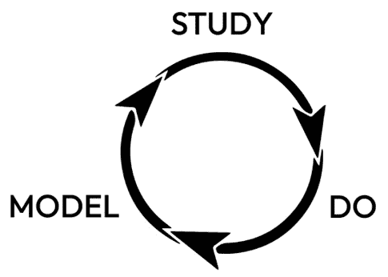

图 14.1 – 学习轮（改编自：《The Slight Edge》，第 192 页，*第十三章*，向导师学习）

上面的图表显示，学习不仅仅是阅读和实践的结合；它还包括从该领域专业人士的经验中汲取洞见。

虽然这本书一直将理论与实际练习相结合，但还有第三种学习方式，叫做 *通过建模学习*，我们将在本章中探讨这一方式。

过去，追求某种职业的人会在该领域的大师指导下学习，向拥有第一手经验并能传授真实知识的人学习。秉持这一理念，我联系了一些 Web3 数据科学领域的领军人物，寻求他们对该行业过去、现在和未来的看法。

# Hildebert Moulié（又名 hildobby）

数据可访问性为我创造了一个新工作。

Hildobby 是 Dragonfly 的数据科学家。他的 X（前身为 Twitter）账户可以在 [`twitter.com/hildobby`](https://twitter.com/hildobby) 找到。

**Gabriela**：你能否向我讲述一下你的职业经历，并突出那些在加密领域中塑造你当前专业知识的最重要经历或角色？

**Hildebert**：目前，我在一家名为 **Dragonfly** 的风险投资公司工作，([`www.dragonfly.xyz/`](https://www.dragonfly.xyz/))，该公司专注于投资与加密相关的公司。我是团队中的数据科学家，我认为我进入这个领域的方式非常非传统，这让我感到非常高兴。我现在开始讲述一下是什么让我走到这里。在我获得本科学位后，我希望能积累一些实际经验，以明确我未来想做什么，于是我有机会加入一家名为 **Kaiko** 的公司，这是一家由家庭成员经营的加密货币中心交易数据公司。我得到了被雇佣的机会，刚开始我是那个令人烦恼的实习生，大家雇我只是因为我是小表弟，但最后发展得非常好，我也非常喜欢在那里工作。我还学到了很多关于加密货币领域的知识，吸引我持续关注这个领域的，绝对是这个生态系统的 *精神* 和意识形态，任何人都可以以自己的方式做出贡献。

当我的父母说服我去读硕士学位，而不是直接工作时，我去了阿姆斯特丹。我攻读的是计算科学硕士，这基本上是建模方面的内容。在学习的同时，我在一家奶制品数据公司找到了工作，虽然这份工作非常有趣，但主题对我来说并不有吸引力，如果你能理解的话。这个行业对我来说并不最具吸引力。它是一个极其慢节奏的行业；几乎没有什么发生，你懂的；至少对我来说，它并不令人兴奋。

所以，当 COVID 封锁来袭时，像很多人一样，我感到无聊，想重新进入加密货币领域，我心想：“我怎样才能以自己的方式贡献，或者至少更好地理解整个事情？”实际上，我是想先理解并*玩一玩*。然后我找到了**Dune analytics** ([`dune.com/home`](https://dune.com/home))，在这里我不需要运行自己的基础设施，只需关注从数据中提取洞察。我在 Dune 上玩了大约 9 个月，匿名地在 Twitter（现在是 X）上分享。我想向自己证明，重要的不是我是谁，而是我分享的内容。最终，有些人开始联系我，提供自由职业的工作，发生得越多，我就越考虑放弃学业，专注于这个项目，全职做下去。这是一个非常困难的决定，因为我的家人非常反对。我知道如果我这么做，我就会全身心投入这个项目，我已经处于一个有很多自由职业工作安排的阶段，我的整周时间已经排满了。我赚到了钱，是的。更酷的是，Dune 还支持我成为*Resident Wizard*，这是一个两年前启动的项目，基本上帮助我能够发布数据，而不必担心获得资金，并给了我自由，专注于那些没有人愿意直接付费研究，但大家都有些兴趣的话题。例如，整个市场在某个行业中的表现如何，类似的问题。我很享受这个过程。

我一直在做一些自由职业的工作，后来我最终想加入一家公司，能够做同样的事情，但不需要担心组织问题，可以与人一起做项目，只需要专注于数据。我在自由职业中看到的请求的一个特点是，付费分析的公司往往在数据中有偏向，他们希望看到的内容，我认为当金钱直接与这个方面挂钩时，很难做到客观。所以，我很高兴我最终有机会在 2022 年 7 月加入 Dragonfly，成为一名数据科学家，差不多是一年半前的事情。你的兴趣爱好是有可能变成全职工作的。

加密货币非常强大，因为它将个体置于聚光灯下，而不是那些已经成名的大公司；任何人，只要贡献得当，都可能在这个领域产生一些影响。*不管你是谁，来自哪里*，这都非常强大，因为你可以成为自己的创造者，得益于加密货币将数据透明度提升到了一个全新的层次；数据是公开的，一切都以不同的方式运作。Dune 就是其中的一部分；现在任何人都可以查看数据，Dune 让它变得更简单，让每个人可以专注于从数据中提取价值，而不是需要关注后台的事务。此外，它已经成为一个寻找加密分析的好地方，就像我们寻找视频时去 YouTube 一样。

**Gabriela**：你认为 Web3 的数据科学是一个小众领域吗？它会一直保持这样吗，还是加密数据会扩展到其他应用场景？你认为未来会有哪些其他方使用我们的分析结果？

**Hildebert**：我认为加密货币已经到了一个阶段，它有扩展的计划，并且已经非常有用，也许不是在你最初想到的常规应用场景中，但以稳定币为例。稳定币对于那些无法轻松拥有银行账户或抵御通货膨胀的国家来说是一个重要解决方案。它提供了一种无需第三方的交易方式，并消除了现有系统中存在的潜在费用。

与现有系统相比，加密货币行业有很大的效率提升空间，我认为我们已经达到了一个具有巨大潜力的技术阶段，但它目前处于类似于 90 年代初互联网的发展阶段，可能我们并不完全了解它是什么，但即使是那些初步的探索，你也能看到它的使用价值。当时，仍然可以看到有人在问“如果我能发信件，为什么还需要电子邮件？”对于一些人来说，这可能感觉像是一种潮流，最后这个行业会找到自己的应用场景，就像今天的社交媒体一样，已经变得非常庞大。我认为这是一项需要一些时间来理解的技术，我们将看到它如何发挥作用，许多行业都可以从中受益。

再举一个例子，**Spindl** ([`www.spindl.xyz/`](https://www.spindl.xyz/))，这是 Dragonfly 投资组合中的一家公司。我与他们有着密切合作，我总是对他们正在开发的新东西感到兴奋。如今，区块链广告充满了欺诈行为，这主要是因为它很难做到，因为 Web2 和 Web3 之间没有连接，缺乏像 Google Ads 这样的服务，无法提供广告表现、目标受众、哪些有效和哪些无效的视图。这些信息对行业非常有价值。

我们现在正在建设扩展所需的基础模块。要让这些基础模块作为基础运作并完成整个系统是需要一些时间的。我不知道十年后会是什么样子，但我不认为六年前有人能预见到我们现在所处的位置。我认为没有人能预测那种浪潮的到来；它们只是当技术成熟时自然发生的。

**Gabriela：加密生态系统中有哪些发展引起了你的兴趣，特别是在其潜力方面，能够吸引下一个亿级用户？**

**Hildebert**：在我看来，这不一定是某个具体的东西，而是更广泛的，是整个系统新概念的一部分。与现有的系统相比，我认为加密货币有潜力取代那些目前需要*第三方*参与的结构。它们将被抽象化或移除，并且这将影响费用和成本，而这些通常倾向于朝着“低价竞争”的方向发展，这很有道理，因为它一切都是为了提高效率。归根结底，用户才是真正的赢家，因为你最终得到的费用是合理的，而且完全有可能有人出现并以更好的产品或更低的价格接管。这种方式有助于改善竞争。我想对此我感到相当满意。

另外一个我想强调的特点是加密货币的*跨境*特性，它真正将世界连接在一起。我想国际支付是一个很好的例子，展示了现在的正常、无摩擦的服务，而在某些地方这可能并不容易，而这项技术在这方面确实帮助很大。你知道，用加密货币做国际支付要便宜得多，而且你不需要任何人批准收款，只要有互联网和钱包地址就行。

数据的透明性使得竞争格局更加清晰，因为一切都是公开进行的，并且至少在公开区块链上可以公开分析，而且有多个竞争者进入，看看是否有某种角度能够让之前的人插手并说“好吧，我们认为可以通过降低费用来获得成功”，而在这种地方每个人都能获益。

要真正产生影响，教育和监管是必要的。我认为良好监管的加密货币将是非常棒的，我相信我们最终会实现这一点。总的来说，我对这两个方面感到兴奋：费用和跨境支付。

**Gabriela：考虑到 AI 的持续进展，普遍认为 AI 正在超越知识工作。在你看来，我们应如何适应这种进展并进行转变？最重要的是，在这个不断变化的环境中，你认为有哪些新兴机会？**

**Hildebert**：我认为 AI 使得智力工作能够处于平等的地位。我们每个人都需要以自己的方式得到帮助，而这正是 AI 所做的。我认为它让你将正在做的事情推向更远的地方。以数据为例，现在，对于基本的数据分析，你不一定需要有人去查看它，因为 AI 能够执行好的模型来理解数据，并且它的输出是可靠的。因此，分析师们可以（现在这个问题已经解决）进一步推进研究，真正把研究推进一步。它远不是让我害怕它会取代我工作的地方，因为我认为它只是推动了我们，而不是替代了我们。

**Gabriela**：如果有人想和你合作，你希望在他们的个人资料中看到什么？软技能（独立工作能力、团队合作、情商、敏捷方法）和硬技能（工具**和技术）？

**Hildebert**：我认为这非常重要，尤其是在所有公司都远程工作的情况下，你必须具备*独立性*。我想和一个独立的人合作，我不希望总是需要在别人背后，因为如果这样最终浪费了我太多时间，我们就会失去讨论的部分。我想和你讨论，我很看重别人挑战我所知道的东西。我特别喜欢那些不一定和我意见一致的人。正是这种冲突产生了真正好的对话，我认为这比那些大家都同意的对话要好，因为从中你不一定能获得价值。这个行业更多的是关于每个人交付的内容，而不是大公司开着大量的会议，像回音室一样运作，更多的是聚焦于每个人可以带到桌面上的东西。

我的建议是关注工作和成果，而不是工作时间或以一种标准的 Web 2.0 正式公司方式来监控每个人。我认为最酷的是个体和这个人能带来什么。我认为我们每个人都有自己的技能，能为团队贡献东西，就像有不同形式的智慧一样，你知道的，有些人擅长写作，有些人擅长编码，有些人擅长运动，大家共同合作，创造出优秀的产品。

关于硬技能，我重视理解加密货币是什么以及*行业*。你不了解数据，直到你了解数据背后的东西。一个行业与另一个行业截然不同，而一个行业中重要的东西可能在另一个行业中不起作用。这也是为什么，当你制作仪表盘时，你要首先展示那些有趣的内容。理解市场可能比编程或其他任何事情更重要。它会让你知道自己是否能够阐明最重要的东西，并且首先展示它。

讲故事也很重要。当我查看仪表盘时，我希望能看到最重要的信息。我应该能够仅凭一两个图表就评估我所看到内容的表现，如果我有兴趣，随时可以深入探索。良好的*展示技巧*对于数据科学家来说至关重要，因为许多优秀的工作因展示得非常糟糕而被埋没，而许多东西则因人们擅长营销而被推向前台，实际上这些工作并没有太多实质内容。因此，总结来说，对我而言，行业知识和展示技巧的良好结合是非常必要的。

对我来说，一个实际的招聘建议是，我根本不在乎你的简历。对我来说更重要的是你知道自己能带来什么。要创造价值，理解技术和区块链领域是非常重要的，然后你不能没有实践就到达那里。我认为到达那里最好的方法就是开始。如果你感兴趣，*你需要开始*，你最终会成为专家。我认为，如果我看看我认为在任何行业中成功的人，那些人都是不断尝试的，而他们很少在第一次尝试时就成功，但他们会一直尝试。我想和那些我可以说“我看过你的作品，觉得很有趣”的人一起工作，而且这是我没见过的，或者你确实带来了某些东西。这并不是来自于去一所不是每个人都能接触到的好学校。就像我说的，整个加密领域让我们站在了同一起跑线上。证明你创造的价值，而不是给我看你的学术资历。

**Gabriela**: 你对那些正在学习 Web3 数据的人有什么建议？对那些想要从其他行业转到 Web3 的人有什么建议？  

**Hildebert**：就像我之前说的，尝试新事物。尝试新事物通常能解锁你能接触到的人和你能够接触到的群体，因为他们也关心你在做什么。在这个领域里，当你提出有趣的问题时，人们会很乐意帮助你。在这个尝试阶段，我建议联系那些（你不一定能及时得到回应的人），但是如果你能带来一些新的东西，并且有非常有见地或有趣的问题，那么他们更有可能联系你。

另外，建立*声誉*，尤其是在加密数据领域；当我查看仪表盘时，我没有时间深入挖掘每个人的代码并区分信号和噪声，建立信任需要一些时间。但是，如果是 Michael Silberling（[`twitter.com/MSilb7`](https://twitter.com/MSilb7)）或 Chuxin（[`twitter.com/chuxin_h`](https://twitter.com/chuxin_h)）发布的内容，我知道他们已经赢得了我的信任，因为我已经多次看到他们的作品，并且知道他们遵循最佳实践。在本书的某一章中，有提到目前尚未形成稳定的标准。这是事实，分析师必须准备好进行迭代。区块链数据是一个迭代过程，与我想象中几年后能够实现的相比，我们目前才处于初始阶段。

此外，这突显了整个预处理部分的重要性，因为通过清理数据可以获得洞见。我去年工作的一项内容是 NFT 交易以及洗盘交易标准是什么（编辑注：该分析在*第四章*中提到）。如果你以原始形式看待交易，它的活动非常零散，但如果你能够清理掉有机活动并过滤掉那些无机活动，就有可能得到更干净的数据，从中提取出更多的洞见。从这个角度来看，仍然有很多工作要做，可能有多年积压的任务，因为有太多的领域需要调查。

我认为*一致性*和声誉是密切相关的。必须持续提供精准的分析，因为如果你发布了误导性或不准确的数据，你的声誉就会受到打击，我也不再信任你。我们都犯过错误，我也犯过很多错误，但重要的是要保持透明，出错时道歉并澄清，提供一个修正后的版本。没有人能对一切拥有完美的视野；这本身就是一个迭代过程，但只要你重视透明度，我们就能共存。这是一个透明的系统，我认为系统中的人也应该保持透明。用户没有时间去验证一切；随着时间的推移，他们最终会学会信任。

我们的工作是将*复杂转化为简单*，正如我之前所说，过高的复杂度会让很多内容丢失。要能够简化它，就必须消化数据，真正理解其中的复杂性才能进行翻译。我通常会从一个高层次的理解开始，然后逐步深入。这或许是最好的方式，因为你可以满足每个人的需求，而不是直接进入细节，那样可能会让人困惑。

对于仪表盘来说，钩子非常重要，而钩子由重要的数据组成。在 YouTube 上的视频也是如此。当人们进入你的仪表盘时，实际上你是在“偷取”他们的时间，因此你需要确保他们花的时间是值得的。如果你不去优化你的钩子，他们就不会坚持下来，去观看你发布的所有内容。钩子非常重要，之后你可以深入讲解，但现实情况是，90%的人只想看到高层次的分析，剩下的 10%才会深入研究，像是到操作层面。我们如何制作最佳的钩子呢？这是一个反复试验的过程，我每次都会稍微尝试不同的方式，现在它已经变得极其简单了，比如一句话和我想发布的主要图表。这个想法是，如果分析师想了解更多，他们可以去浏览线程，但整体的思路已经非常简洁地呈现出来了。

# Jackie Zhang

我们是一个非常适应的物种。

Jackie Zhang 在 Dune Analytics 担任开发者关系的角色。她的 LinkedIn 可以在[`www.linkedin.com/in/jackieyingzhuzhang/`](https://www.linkedin.com/in/jackieyingzhuzhang/)找到，她的 X（前 Twitter）账号是[`twitter.com/agaperste`](https://twitter.com/agaperste)。她还是*Journey of the Unordinary*频道的主持人，该频道可以在`www.youtube.com/@JourneyofTheUnordinary`找到。

**Gabriela: 你能带我回顾一下你的职业历程，并突出一下对你目前在** **加密领域的专业知识影响最大的一次经历或角色吗？**

**Jackie**: 我会从我现在的位置开始，然后倒回去看我是如何到达这里的。我的职位是 Dune Analytics 的开发者关系（[`dune.com/home`](https://dune.com/home)）。Dune 是一家加密数据公司，所以这就是加密领域的由来。而且公司由一个小团队组成，因此我有机会深入思考产品以及我们如何销售和发展。我想你们已经可以看到我对加密与数据、产品与社区的桥接的兴趣。如果你要让我定义自己，我就像一位桥梁建设者，我对这个角色感到非常满意。

回到是什么促使我走到今天这一步，在大学时，我学习了计算机科学和金融，大学毕业后我在德意志银行担任软件开发员。我很快意识到，我想在工作中做一座桥梁，即使是在软件开发的角色中。我擅长连接内部用户，架起需求和代码之间的桥梁。还有一个方面是，它让我思考“这就是我想做的事”，这对我来说更具个人意义，因为很长时间我都没有意识到这一点。

我来自非常传统的中国父母，他们会给你关于应该做什么的指导，尽管我想学习国际关系，但他们建议我学计算机科学，因为学计算机科学找工作更容易。我做了，但是在美国生活了将近十年后，我仍然面临签证问题。所以，我当时面临这个签证问题，我要么被公司派往伦敦，要么得做点别的事情。所以，我决定回去读研究生。我已经知道自己想从软件开发转型，选择了数据科学，它更接近商业领域，毕业后我在富达公司找到了一份常规的数据科学工作。说实话，那一年我做了很多 Web 开发工作，在那里时也是如此。

我很幸运遇到了我的丈夫，通过我们的婚姻解决了我的签证问题。然后我第一次感到，我有了思考自己真正想做的事情的自由。我其实不知道怎么过多地质疑自己想做什么或者我热衷于什么。所以，我通过说*“好吧，我就看看我最终会把大部分时间花在哪里”*来解决这个问题。这就是加密货币兴趣开始的地方。它已经是一个主题，我会花很多时间深入了解，去探索。这是我所有空闲时间投入的地方，我意识到自己从未有过这样的吸引力。最开始，我只是想做这件事，然后最终我不得不全职进入加密货币领域。真正让我兴奋的是，能够更好地分配世界资源的承诺。我内心对加密货币理念有一种推动力，但与此同时，我喜欢使用开放的加密数据，并且能够创造利益，使它变得更加公平。拥有了技术能力，让我能够转型并在我感兴趣的业务中担任角色，这让我非常喜欢它的*精神*。它是一种理念，然后我意识到我做这件事时是快乐的。

我认为当前找工作的方式已经在慢慢发生变化。不再像以前那样“哦，我投简历然后走传统流程。”而是你先为协议工作，最终被聘用。

**Gabriela**：你认为 Web3 数据科学是一个小众领域吗？它会一直保持这种状态吗，还是加密数据会扩展到其他使用场景？你认为未来还有哪些其他方会消费我们的分析？

**Jackie**：好，第一个问题很简单：我们目前确实处在一个小众领域。第二个问题，简短的回答是，只有时间能告诉我们答案。Frederick（Dune 的 CEO）实际上在 DuneCon 上提到过这个问题，他引用了 Steve Jobs 的一句话：

“…人们问我，‘为什么我要在家里买台电脑？’”

…嗯，就是为了了解它，做一些有趣的模拟。

…但除此之外，现在没有什么好理由去为你的家买一个。

但会有的，会有的。

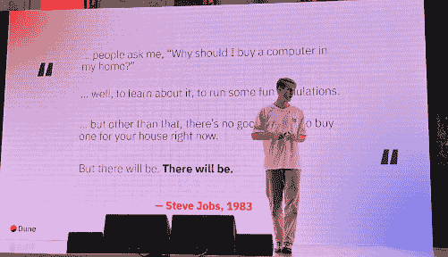

图 14.2 – 来自 2023 年 11 月 2 日里斯本 DuneCon 的照片

时间会证明，我希望会证明。我认为像您这样的行业人士有信念，但您的信念总是带着一种飞跃式的信任。但我已经看到朝这个方向发展的实际数据。我不知道未来会怎样，但如果从大局来看，我认为比特币 ETF 是真实存在的。我不认为我们提到过 adoption（采纳），但越来越多的人在听说它，去年人们的看法更为负面；而现在，也许是更加中立的态度。它在未来如何被采纳，可以通过广告、效果营销以及 Spindl（[`www.spindl.xyz/`](https://www.spindl.xyz/)）正在做的事情。我很期待看到他们更多的行动。

Web2 是一个高度封闭的领域，尽管有许多内容应该保持私密，我认为我们可以做得更多，在这个领域提出更多的解决方案。如果我们能够抽象出像区块链这样复杂的底层技术，也许可以朝着消费者在应用中所需要的方向发展，技术对他们来说是透明的，我认为这样会有更广阔的前景。

**Gabriela：在加密生态系统中，哪些发展引起了您的兴趣，尤其是它们在吸引下一个** **十亿用户方面的潜力？**

**Jackie**：基本上，我们还不知道，有很多努力在寻找答案。我仍然认为我们处于早期阶段，因为当你仔细想想，要采纳一个产品需要两个因素。你需要有动机去做，然后你需要有能力去做。

我认为今天，我们正处于一个区块链作为高通胀国家的价值储存工具，或者作为受制裁国家的跨境支付手段的世界，但除此之外，除了现有的麻烦之外，似乎没有什么其他动机让你去经历现在加密货币的复杂性。我看到一些聪明的人早早进入这个领域，试图进行套利，就像做钱的交易员。我还读过有关期权交易员的内容，区块链使他们能够比以前更轻松地进行操作。即便如此，面对开放数据，我们仍然没有让这些非常聪明的人得到他们原本无法获得的机会，所以我对这些想法持看好态度，但我不确定这些极具动力和能力的人是否代表了下一个十亿用户的群体，许多人在生活中仍面临自己的困境，如何获得下一餐等问题。总之，我认为吸引下一个十亿用户的解决方案与日常问题有关。它不涉及新功能或类似的东西，而是服务必须解决人们的日常问题。

**Gabriela：考虑到人工智能的持续进步，普遍认为人工智能正在超越智力工作。您认为我们应该如何适应这一进展并做出转变？最重要的是，您认为在这个** **变化中的新机遇在哪里？**

**Jackie**：我认为，直到我们拥有通用人工智能，机器人真正接管世界之前，我认为我们不必担心什么，因为我们是一个非常*适应性强的物种*。如果你想想看，最初人们是不能写字的，对吧？所以，抄写员有很多工作，但后来每个人都学会了读写，抄写员不再需要了，但其他工作出现了。另一个例子是女性，她们曾经花很多时间洗衣服，然后洗衣机发明了，女性开始大规模地为市场创造价值。我只是觉得一切都会好起来的。在短期视角下，我们仍然需要很多分析师来写好的 SQL，以训练 AI。例如，以 Dune AI 为例，你需要有人能够写好查询，然后将它们输入到这个模型中并评估结果是否正确。所以，是的，我认为在短期内，我们仍然需要写 SQL 的人，然后当我们到达不再需要写 SQL 的阶段时，拥有区块链数据知识的人将会没问题，因为那时每个人都需要从数据中提取洞察等等。就像现在每个人都能读书一样，SQL 也会经历相同的过程。人类将会进入下一个阶段。我认为我们会完全没问题，变得更好、更高效。

**Gabriela**：如果有人想和你一起工作，你希望在他们的个人资料上看到什么？软技能（独立工作的能力、团队合作、情商、敏捷方法）和硬技能（工具**和技术）？

**Jackie**：关于软技能，我认为独立性的另一个方面就是*依赖性*。这意味着一个人会出现，并且你可以信任他们。如果他们做了他们说会做的事情，我会信任他们。此外，*内在驱动力*也很重要。你无法真正评估热情之类的东西，但完成事情的驱动力，因为这表明他们对这件事感兴趣。另一个软技能是*沟通能力*，基本的沟通能力，但也包括跨部门协作的能力，比如能够与不同的人、不同的部门交流，并努力让大家一起工作。你必须能够确保每个人都互相理解，明白需要交付的内容、方向和如何影响他人，使他们愿意与你一起前行。这就像是以沟通为基础的领导力。*学习能力*，好奇心和学习能力，因为你总是可以尝试新事物。

在硬技能方面，我会加上*数据敏感度*，意味着知道该问哪些问题，我认为这来自于经验。然后是常规技能，比如 SQL、Python 和行业知识，这些都是相当标准的。发展软技能很重要，因为你总是可以学习新东西。

**Gabriela**：你对于正在学习 Web3 数据的人有什么建议？以及对于想从其他行业转向 Web3 的人，有什么建议？

**Jackie**：我觉得我们已经提到过这个了，但就去做吧，去尝试吧。兴趣会像自然流动一样，一步接一步地来。不要强迫自己。

同时，你需要保持一致性。Andrew、Hildobby 和 Coby 之所以能够保持影响力并继续做大，是因为他们始终产生有价值的内容。他们不是做一次热门内容然后就离开。

此外，特别是对于从 Web2 转向 Web3 的人，我建议专注于学习加密知识，因为分析技能已经足够在 Web3 中表现出色。这个领域的数据成熟度仍然不高，所以他们现有的技术分析技能可能就足够了。我希望更多来自 Web2 的有经验的人加入 Web3，让这个领域变得更加成熟，因为我认为我们的人手还不够，而且还有很多事情要做。这是一次邀请，请加入我们。这个世界如此开放，可以做的事情非常多，而且非常友好。想象一下，在这个领域，有很多相互连接的大团队在与您共同解决问题，而不是像 Web2 中那样，一支由 5 名数据人员组成的小团队，每个人只专注于自己的任务。此外，在 Web3 中，一旦完成了工作，你就可以在别人已经构建的基础上继续构建。这种可组合性的理念在这里非常突出。

简洁明了的仪表盘非常重要。大多数时候，用户看一到两个图表就会离开，对吧？这就像是一个 30 分钟的 PowerPoint 演示文稿。除非它仅仅是关于数据，否则他们能真正记住多少内容呢？专注于制作易于理解的统计数据。它们必须简单，否则信息会丢失。

# Marina Ghosh

无论你是出于好奇想要探索资源，还是准备进行全面的职业转型，你都不必单打独斗！

Marina 是 **Flipside Crypto** 的社区关系顾问，同时也是 **MetricsDAO** 的董事会成员和贡献者。她的 X（前身为 Twitter）账户是 https://twitter.com/queriesdata。

**Gabriela**：能否带我走一遍你的职业历程，并重点讲述一下在加密领域塑造你目前专业能力的最重要经历或角色？请从简要描述你目前的**角色**开始。

**Marina：** 在我的工作中，我支持区块链分析社区中的数据分析师们发展他们的技能，产生对 Web3 有价值的开源洞见，并将他们的技能和热情转化为充实的职业生涯。与 Web2 中的数据不同，Web3 数据不是专有或需要付费的，这创造了一种独特的方式供任何人参与其中。结果就是在链上数据周围形成了一个狂热爱好者和专业人士的生态系统。这正是我开始这条道路的方式：通过接触这个生态系统，成为这个社区的分析爱好者之一，并制作了大量的仪表板！

开源区块链数据分析可以为个人职业发展带来显著的向上（或者说横向，如果你在转行）机会。对于那些对区块链充满好奇，并有兴趣通过学习入门级数据分析技能开始的人来说，他们会发现自己有无限的主题可以探索，同时专业技能会变得越来越复杂。学习如何处理描述实时 Web3 初创企业和社区的实际数据，会比仅仅下载模拟或经常使用的公共数据集进行练习感觉更加有意义。从一开始，你就可以创造出实际的价值：发现能够帮助协议在业务决策中找到洞见，参与关于资本分配的对话，并帮助社区更好地了解他们喜爱的协议。对于想要在 Web3 数据职业生涯或与数据相关的职位（如产品、客户或社区成功）中找到突破口的人来说，这种影响力在他们的求职申请中非常有帮助。但与此同时，这也在价值转移方面创建了价值，Web3 项目为社区分析师补偿创造的价值——可以想象成自由职业请求、追溯式补助金，以及分析奖励和激励计划。

我通过参与类似的活动更深入地了解了这个行业，并对它充满了热情！（除了追溯式补助金，这是我个人的愿望清单，作为分散自治组织（**DAO**）团队的一部分，我还没有获得过）。现在，我已经开始与 Flipside 和 MetricsDAO 等组织合作，最初我作为 Web3 分析师社区成员与它们有很多接触点。

**Gabriela：你认为 Web3 数据科学是一个小众领域吗？它将保持这种状态还是将扩展到其他用例？你认为未来会有哪些其他方面的人群在消费我们的分析？**

**Marina**：这是一个足够大的领域，当你是其中一部分时，感觉它几乎是吞噬一切的！说正经的，我认为一个有趣的交集是**现实世界资产**（**RWA**）。现在，像耐克和星巴克这样的公司正在将 Web3 元素加入到它们的商业模式中，任何人都可以通过链上数据查看它们这一部分业务的成功程度（这些公司反过来也需要加密数据专家）。体育也是另一个应用场景：忠实的粉丝可以从试图评估他们实体交易卡收藏的价值，到查看链上数据了解他们的体育 NFT 收藏品的价值。游戏产业中通过游戏内购买也在拥抱加密技术，并因此可以通过区块链数据获得更多的洞察。

**Gabriela**：在加密生态系统中，哪些发展引起了你的兴趣，特别是它们在吸引下一个**十亿用户**方面的潜力？

**Marina**：我最近在 Flipside 博客上分享了我对这个话题的看法（[`data.flipsidecrypto.com/blog/new-kid-on-base-network-effects-could-onboard-the-next-billion-into-web3`](https://data.flipsidecrypto.com/blog/new-kid-on-base-network-effects-could-onboard-the-next-billion-into-web3)）！为了帮助加密生态系统实现雄心勃勃的用户引导目标，我认为倍增效应和网络效应将创造出比线性增长更快的增长。SocialFi 帮助 Base 最近成功吸引了大量用户，这与 Web2 的社交网络相似，你会加入其中来关注你早期采纳的朋友，然后更多的朋友会注册来关注你，依此类推。另一个倍增器是开发者：那些专注于引导开发者并提供优质开发者体验的协议，将会看到一些开发者创建的应用程序脱颖而出，吸引大量用户。那些旨在成为不太稳定经济环境中日常金融替代方案的项目，也有潜力利用网络效应。例如，一个向家乡汇款的移民工人如果使用稳定币汇款，他们将引导收款人进入 Web3。

**Gabriela**：考虑到人工智能的不断进展，一般人会认为 AI 正在超过智力工作。你同意吗？在你看来，我们应该如何适应这一进程并做出转变？最重要的是，在这个**变化中的环境**中，你认为有哪些新兴的机会？

**Marina**：举个例子，AI 可以帮助你修复 SQL 查询，但它也可以帮助你学习一门新的编程语言或库，你将用它来编程。撇开编程不谈，解释和从区块链数据中得出结论是非常微妙的，因此更适合人类思维。加密数据输出远未标准化，即使未来这一方面得到改进，从数据中提取有意义的结论仍然需要大量上下文（而这通常需要人类）。

**Gabriela: 如果有人想和你一起工作，你希望在他们的个人资料中看到什么？软技能（独立工作能力、团队协作能力、情商、敏捷方法）和硬技能（工具和技术）？**

**Marina**：我将为那些想要进入区块链数据分析领域的人回答这个问题。首先，构建数据分析（以及与之相关的领域如数据科学或分析工程）的技术基础，是当今一个资源丰富的事业。现如今，有许多资源（其中许多是免费的），包括书面、视频、社交媒体和互动格式，提供了技能列表以及帮助学习和练习这些技能的材料。而更为难得，但完全可以实现的力量，是建立你自己作为一个深入挖掘、提供优质 Web3 洞察的人的声音和形象，并且培养你的网络和社区（甚至是一个观众群体），他们会发现这些洞察有趣且有用，参与讨论，提出请求，并提供反馈。积极融入社区并理解数据问题与需求，是区分有影响力 Web3 分析师的关键。这需要好奇心、专业性与友好性，以及不断投入精力来关注 Web3 及其细分领域和项目，建立关系，开展对话，并时刻思考如何通过数据驱动的问题为大家带来价值。

**Gabriela: 那么对于那些想要从其他行业转型到 Web3 的人呢？**

**Marina**：无论你是出于好奇想要探索资源，还是准备进行彻底的职业转型，你都不需要单打独斗！相反，加入社区，与大家共同前行。这将帮助你在许多方面的旅程中，从找到资源、解答你的问题、认识处于类似 Web3 数据熟悉阶段的他人，到建立同行和有经验的区块链数据专业人士的网络。幸运的是，已经有多个专业化的社区存在。你将会找到与你选择的加密数据工具或服务提供商（如 Flipside）相关的资源和社区；MetricsDAO 是一个与工具无关的中心，汇聚了许多链上数据专业人士、爱好者以及学习资源；Crypto Data Bytes 在 Substack 上提供了大量的教育材料；还有一些发布作品的加密分析师社区，比如 OurNetwork。阅读是寻找灵感和结识数据专业人士的好方式。带着你的好奇心和友善，你会发现自己融入了一个支持你成长的社区。

# One Digit 教授

区块链不是传统的数据库。分析师不会向其写入数据或对其进行更正。

One Digit 教授是**Sovryn**的数据科学家。他的 X（前 Twitter）账号可以在[`twitter.com/onedigitmoney`](https://twitter.com/onedigitmoney)上找到。

**Gabriela**：您能为我讲述一下您的职业历程，并突出您在加密领域塑造当前专业知识的最重要经验或角色吗？请从简要描述您的**当前角色**开始。

**One Digit 教授**：我目前在 Sovryn 担任数据分析师和技术传播者的角色。这两个角色是相辅相成的，因为每一部分都会影响到另一部分。我以一种不同寻常的方式进入这个角色。我在学术界作为工程学教授工作了超过 30 年，后来加入了 Sovryn，并从一个纯粹的技术传播角色逐步发展到现在的职位。我对高阶数学、数学建模和编程非常熟悉，也有丰富的技术传播经验。我当前角色的具体内容与我之前的职业经验有很大不同，但我的背景为我提供了基础和信心，使我能够发展到这个角色。

**Gabriela**：这种情况会保持不变，还是加密数据会扩展到其他应用场景？您认为未来还有哪些方方面面会使用我们的分析？

**One Digit 教授**：我对这个问题没有完全形成定见。我的总体看法是，加密数据分析本质上与其他数据分析没有什么不同。链上分析开辟了数据分析的新应用领域，并激发了许多创造性的分析指标。然而，方法上与传统分析方法类似。我可以看到，未来加密分析将在链上取证、以及交易和投资决策分析中发挥更大的作用。

**Gabriela**：在加密生态系统中，哪些发展引起了您的兴趣，尤其是在它们能够吸引下一个**十亿用户**的潜力方面？

**One Digit 教授**：我对比特币上的 rollups 非常感兴趣，特别是那些可以使用像 BitVM、见证加密或权益证明第二层等方法，将比特币无信任地绑定到比特币之上的更灵活层。这很可能是解决扩展性问题的一种方案。

**Gabriela**：考虑到人工智能的持续进展，普遍存在人工智能在智力工作领域超越人类的看法。您同意吗？在您看来，我们应该如何适应这一进程并进行调整？最重要的是，您认为在这个**变化中的格局**中有哪些新兴机会？

**One Digit 教授**：它使得理解语法或调试代码变得更加容易，但有时也能让我不被细节所困，专注于高层次的问题。人工智能能够帮助的一个领域是分析代码库并描述系统的功能，或者能够回答有关系统的问题。另一个领域是识别那些在对代码功能的初步理解中并不显而易见的漏洞。

**Gabriela**：如果有人想和你一起工作，你希望在他们的个人资料中看到什么？软技能（独立工作能力、团队合作精神、情商、敏捷方法）和硬技能（工具**和技术）？

**教授 One Digit**：同时，还需要具备解决新问题的能力和愿意使用不熟悉的新工具。

**Gabriela**：那么对于那些想从其他行业转行进入 Web3 的人呢？

**教授 One Digit**：你需要了解 Web3 的动机和文化。这意味着理解我们为什么要追求去中心化、无权限等。否则，很难理解或欣赏数据及其含义。理解区块链的基本理念和结构是必须的。区块链不是传统的数据库。分析师不会向其中写入数据或修正数据。进入这个领域的人还应该了解比特币、以太坊与其他山寨币的子文化和态度。你需要在一个与你对世界未来走向的哲学相符合的领域工作。花时间找到一个你相信会使世界变得更好的项目，而不仅仅是一个能支付你工资并让你做酷事的项目。

# 附录 1

让我们开始安装以下环境。

## Google Colaboratory

1.  前往你的 Google Drive 并打开一个 Google Colaboratory 文档。

1.  点击**连接**：


图 A1.1 – 连接 Colab

1.  它会显示**初始化**、**分配**、**连接**，然后**已连接**：


图 A1.2 – 已连接

1.  如果你点击**查看资源**，它会展示你正在使用的计算机：

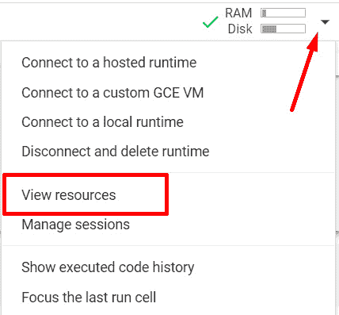

图 A1.3 – 查看资源

## Anaconda

1.  前往 [`www.anaconda.com/`](https://www.anaconda.com/) 并点击**下载**。它将下载 Python 和多个流行的库：

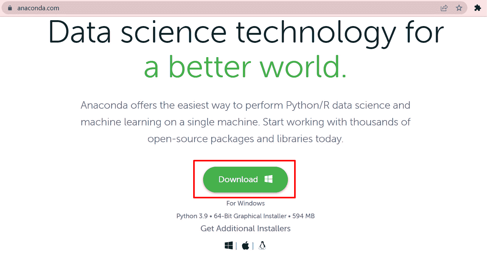

图 A1.4 – 下载 Anaconda

将下载一个可执行文件，启动它。

1.  点击**下一步**按钮并阅读并接受许可协议：

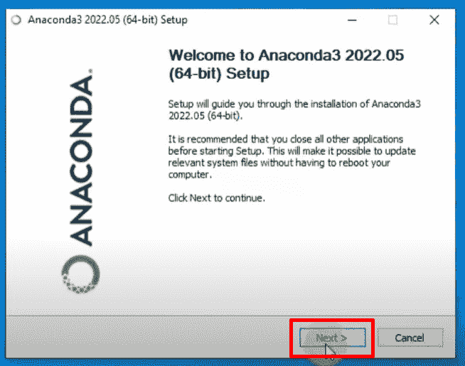

图 A1.5 – 启动安装文件

1.  会出现一些额外的设置问题。

    本书中的练习，你只需要做以下几步：

    +   **安装类型**：选择为**仅我自己**安装选项。

    +   **安装位置**：接受默认设置。

    +   **高级安装选项**：将 Anaconda 3 注册为 Python 3.9 系统。

    Python 3.9 是目前的版本，预计会不断发展，版本号可能会有所变化。

1.  然后，点击**安装**，等待安装完成，然后点击**完成**。

根据你对终端的熟悉程度，有两种方法可以使用 Anaconda。点击 Windows **Start** 按钮，你将看到 Anaconda 应用或 Anaconda 提示符。Anaconda 应用长这样：

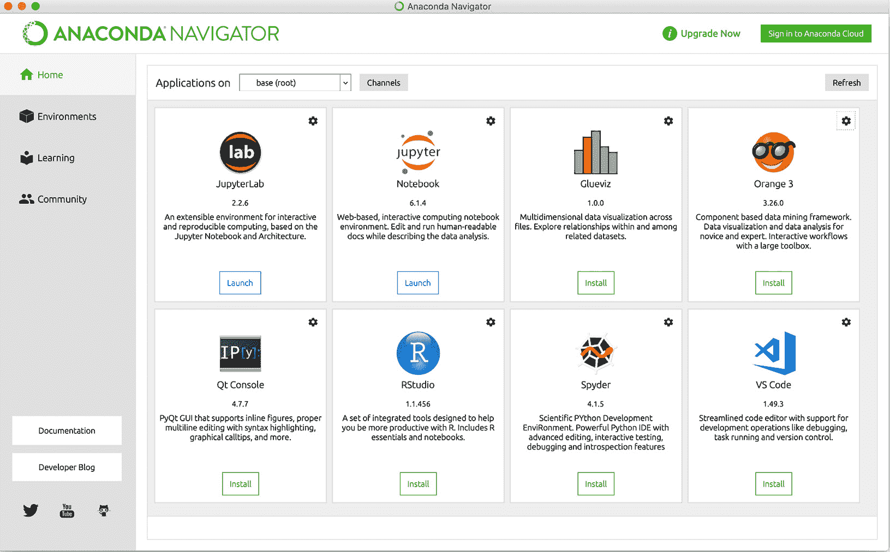

图 A1.6 – Anaconda 应用概览

Anaconda 提示符看起来就像一个终端。为了能够安装我们将要使用但 Anaconda 中未预安装的库，你需要通过以下方式添加 `pip` 分发工具：

1.  打开终端并输入以下命令：

    ```py
    conda install pip
    ```

    然后，按 *Enter* 键并等待下载完成。

1.  要创建环境，请按照以下步骤操作（在终端中）：

    ```py
    y and press *Enter*, and it will build the environment.
    ```

1.  每次你想在相同环境下工作时，打开终端并输入以下命令：

    ```py
    conda activate web3data
    ```

1.  要访问我们将要工作的 Jupyter notebook，一旦环境被激活，输入以下命令：

    ```py
    jupyter lab
    ```

    一个 Jupyter notebook 网页将在本地服务器上启动。

另一种方法是通过点击 **Launch** 按钮从应用程序启动 Jupyter Notebook。它将打开一个本地网站。在那里，进入你将保存工作的文件夹，点击左上角的 **New** 按钮。它会提供一个选项列表；选择 **Python3 (ipykernel)**，然后它会打开一个我们将要工作的笔记本：

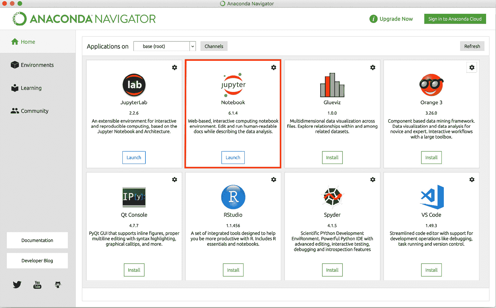

图 A1.7 – Anaconda 应用中的 Jupyter Notebook 概览

## Ganache

Ganache 是一款旨在创建个人本地区块链网络用于测试和开发的软件。它是 Truffle 套件框架的关键组成部分，Truffle 套件还包括 Drizzle。Truffle 作为开发环境、测试框架和资产管道，而 Drizzle 提供了多种前端库。让我们看看如何访问 Ganache：

1.  访问 [`trufflesuite.com/ganache/`](https://trufflesuite.com/ganache/) 并根据你的操作系统下载程序：

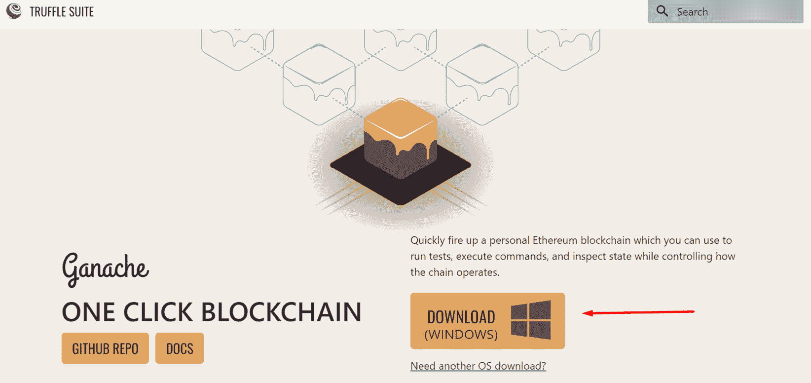

图 A1.8 – Ganache 下载

1.  启动已下载的可执行文件，阅读并接受条款和条件，并确认是否希望启用分析功能。

1.  一旦 Ganache 程序启动，导航到 **QUICKSTART**。这将是你进行测试的以太坊环境。你将看到一个类似于以下的页面：

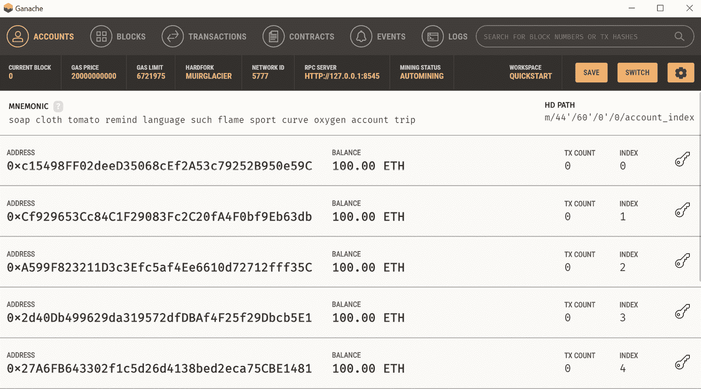

图 A1.9 – Ganache 快速入门

## Infura

1.  首先，访问 [`infura.io/`](https://infura.io/) 并点击 **注册**，然后输入你的电子邮件地址和密码：


图 A1.10 – Infura 注册

1.  阅读并接受条款和条件后，点击 **创建一个免费账户**。检查你的电子邮件，点击其中的验证链接确认你的账户。

1.  一系列人口统计学问题将会出现。选择适合你的答案。

1.  创建你的第一个项目，并为其命名，例如 `web3datascience`：

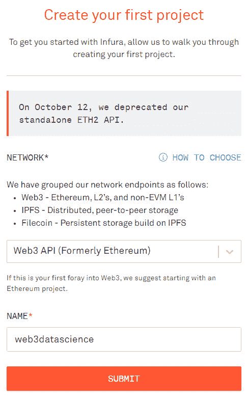

图 A1.11 – 项目创建

1.  点击 **提交**。这将带你进入下一个页面，类似于如下所示的页面：


图 A1.12 – 用户仪表盘

1.  在灰色框中导航到 **管理密钥**，以查找你的 API 密钥：


图 A1.13 – API 密钥信息

# 附录 2

以下是如何在 X（前身为 Twitter）上创建 **开发者** 账户并获取 API 密钥的步骤：

1.  访问 https://developer.twitter.com/ ，并确保你的 X 账户已成功登录。这里有多个订阅计划；为了完成 `Chapter03/Social.ipynb` 中的练习，你至少需要订阅 **基础** 计划：


图 A2.1 – 订阅选项

一旦获得权限，我们应该创建一个项目，并为项目命名：


图 A2.2 – 项目名称

从提供的选项中选择一个用例：

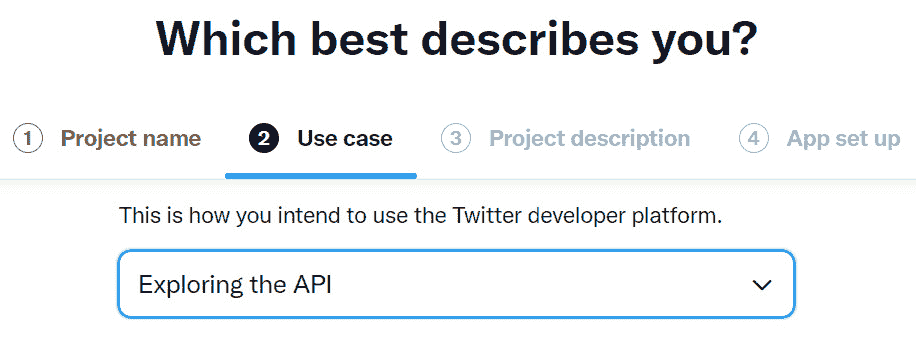

图 A2.3 – 下拉选项列表

更详细地描述项目：

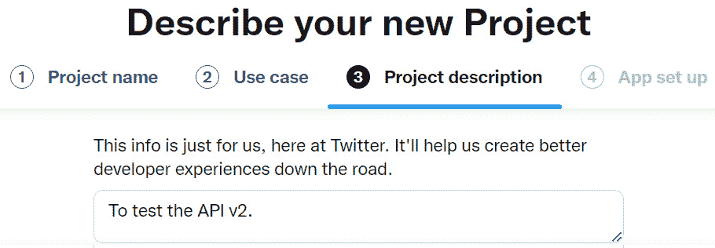

图 A2.4 – 描述用例的空间

1.  一旦项目创建完成，我们将创建一个与该项目相关的应用。每个订阅计划都允许连接到项目的应用数量有限：


图 A2.5 – 应用选项

1.  我们需要提供关于应用的详细信息，在最后一个标签页中，我们将看到 API 密钥；这就是应用将使用的地方：

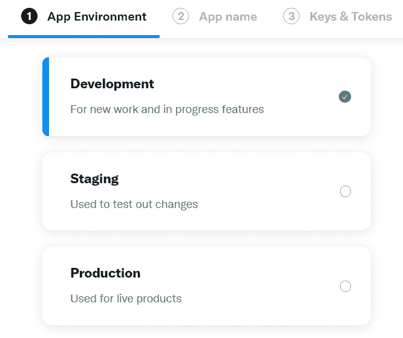

图 A2.6 – 应用环境选项

为应用提供一个名称：


图 A2.7 – 应用名称

在这个标签页中，我们将看到生成的 API 密钥——一组三个密钥：API 密钥、API 密钥密钥和承载令牌：


图 A2.8 – 密钥与令牌标签

# 附录 3

以下是对 Dune Analytics `nft.trade` 表格的逐列分析，并附加了对文档中关于 Bored Ape #6633 销售的评论，这些评论也包含在 *第四章* 中。（来源：[`dune.com/docs/data-tables/spellbook/top-tables/nft.trades/#column-data`](https://dune.com/docs/data-tables/spellbook/top-tables/nft.trades/#column-data) 和 [`dune.com/queries/3268989`](https://dune.com/queries/3268989)）：

+   `block_time`: 交易添加的区块时间戳。

+   `nft_token_id`: 正在转移的令牌 ID。在我们在笔记本中分析的案例中，该数字为 `6633`。

+   `erc_standard`：智能合约遵循的标准，表示项目的结构方式。可以是**ERC 20**、**ERC 721**或**ERC 1155**。该表还显示了**SuperRare**标准。

+   `platform`：这一列将显示进行交易的市场平台。

+   `platform_version`：一些市场随时间演变并更改了其智能合约。查询信息的方式和功能可能会根据平台版本有所不同。

+   `trade_type`：根据文档，这张表列出了三种交易类型：

    +   **单一物品交易**：单笔交易中只包含一个物品。

    +   **捆绑交易**：一个交易中包含多个物品。

    +   **聚合器交易**：单笔交易中同时从多个市场转移多个物品。

    但在查询数据时，我们发现这一列是指主要销售或二级销售：

+   `category`：智能合约执行的活动类别，范围从拍卖到传统销售。

+   `nft_project_name`：NFT 项目的名称，以人类可读的形式表示；例如，Bored Ape Yacht Club 或 CryptoPunks。

+   `evt_type`：以 Bored Ape 6633 为例，它的类型是`trade`。此表中的选项有`trade`、`redeem`、`mint`和`swap`。

+   `usd_amount`：交易中支付的价格。该价格是将转账货币的数量（例如 ETH/USDT）与转账时的市场价格相乘得出的。根据 Dune 文档，市场价格来自第三方数据库。

+   `seller`：市场中艺术品的卖家。以 Bored Ape 6633 为例，卖家的地址是`0xde2…06ef`。

+   `buyer`：市场中艺术品的买家。以 Bored Ape 6633 为例，买家的地址是`0xb4…cb57`。

+   `original_amount`：以交易所使用的代币/货币金额表示的支付价格。在我们关注的例子中，是 ETH。此值已解码，意味着它是从最初反映在链上的格式中转换过来的。

+   `original_amount_raw`：支付的价格，但未解码小数部分。

+   `currency_symbol`：用于生成交易的货币或代币。

+   `original_currency_contract`：使用的货币或代币的合约。当在 ERC-20 代币中搜索转账时，这非常有用。例如，如果 NFT 销售的支付使用 USDT 或 DOC，我们需要在 USDT 或 DOC 智能合约日志中搜索转账。在日志中，我们会找到涉及的两个地址之间的转账记录。

+   `currency_contract`：当货币被包装以便在交易所使用时，这个字段是相关的。例如，对于以太坊，包装合约是 WETH，合约为`xc02…6cc2`。

+   `project_contract_address`: 这是集合合约地址，结合代币 ID 可以为非同质化物品提供唯一性。在 Bored Ape Yacht Club 集合中，合约地址为`0xbc…f13d`，如在*第四章*开头所示。

+   `aggregator_name` 和 `aggregator_address`: 在本次分析的转账中，这些列为空。它们包含聚合器的地址，以防其中任何一个参与交易。

+   `exchange_contract_address`: 交易发生的市场地址。在我们在笔记本上跟踪的收藏品的案例中，市场为 OpenSea，地址为`0x7b…d12b`。这些智能合约处理平台上列出的收藏品的转移和支付。

+   `tx_hash`: 销售交易的交易哈希。

+   `block_number`: 交易被纳入的区块号。

+   `tx_from`: 交易发起方。在 Bored Ape 6633 的销售中，发起方是买家。

+   `tx_to`: 交易的接收方。在市场中的销售交易中，接收方是交易所智能合约，它接收交易并激活相关功能以执行销售。在本例中，接收方为 OpenSea 交易所地址。

+   `royalty_fees_percent`: 支付给创作者的版权费（以百分比表示）。以 Bored Ape 6633 的销售为例，版权费为 2%。

+   `royalty_fees_amount`: 以此次交易所使用的货币表示的版权费用。在本例中，版权费用为 3.99975 WETH。

+   `royalty_fee_amount_usd`: 执行时版权费用的美元价值。在本例中，版权费用为 12,929.991825 美元。

+   `platform_fees_percent`: 平台费用（以百分比表示）。在本例中，平台费用为 2%，与版权费用相同。

+   `platform_fees_amount`: 以此次交易所使用的货币表示的平台费用，金额为 3.99975 WETH。

+   `platform_fees_usd`: 执行时平台费用的美元价值。金额为 12,929.991825 美元。
