8

# 8\. 超参数调节

概览

在本章中，每种超参数调节策略将首先分解为其关键步骤，然后再展示任何高级的 scikit-learn 实现。这是为了确保在跳到更自动化的方法之前，你能完全理解每种策略背后的概念。

在本章结束时，你将能够通过系统地评估具有不同超参数的估算器，进一步提升预测性能。你将成功地部署手动搜索、网格搜索和随机搜索策略，找到最优超参数。你将能够对**k 最近邻**（**k-NN**）、**支持向量机**（**SVMs**）、岭回归和随机森林分类器进行参数化，以优化模型性能。

# 引言

在前几章中，我们讨论了几种方法来得到一个表现良好的模型。这些方法包括通过预处理、特征工程和缩放来转换数据，或从大量可用的 scikit-learn 估算器中选择一个合适的估算器（算法）类型。

根据最终选择的估算器，可能有一些设置可以调整，以提高整体预测性能。这些设置被称为超参数，推导出最佳超参数的过程称为调参或优化。正确调节超参数可以带来性能的显著提升，甚至达到两位数的百分比，因此在任何建模任务中都非常值得进行调参。

本章将讨论超参数调节的概念，并介绍一些简单的策略，帮助你为估算器找到最佳超参数。

在前几章中，我们看到了一些使用各种估算器的练习，但我们并没有进行任何超参数调节。阅读完本章后，我们建议你重新审视这些练习，应用所学的技巧，看看能否提升结果。

# 什么是超参数？

超参数可以被看作是每个估算器的控制旋钮和开关，改变它们会影响估算器如何工作，从而解释数据中的关系。

请查看*图 8.1*：

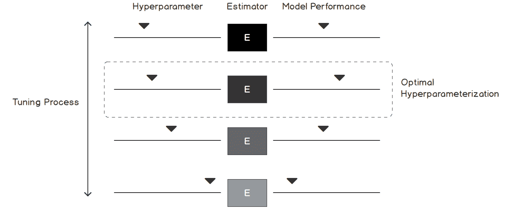

图 8.1：超参数如何工作

如果你从左到右阅读前面的图示，你会看到在调节过程中，我们改变超参数的值，这会导致估算器的变化。进而，这会引起模型性能的变化。我们的目标是找到能带来最佳模型性能的超参数配置。这将是*最优*的超参数配置。

估算器可以具有不同数量和类型的超参数，这意味着有时你可能会面临需要选择大量可能的超参数配置的情况。

例如，scikit-learn 实现的 SVM 分类器（`sklearn.svm.SVC`），你将在本章稍后看到，是一个具有多种可能超参数配置的估算器。我们将仅测试其中的一小部分配置，即使用线性核或二次、三次或四次的多项式核。

这些超参数中，有些是连续型的，而有些是离散型的，连续型超参数的存在意味着理论上可能的超参数化组合是无限的。当然，当涉及到生成具有良好预测性能的模型时，一些超参数化组合要比其他的好得多，作为数据科学家，你的工作就是找到这些更优的超参数配置。

在接下来的章节中，我们将更详细地探讨如何设置这些超参数。但首先，需要澄清一些术语。

## 超参数与统计模型参数的区别

在你阅读数据科学的材料时，特别是在统计学领域，你会遇到“模型参数”、“参数估计”和“（非）参数化模型”等术语。这些术语与模型数学公式中的参数有关。最简单的例子是没有截距项的单变量线性模型，它的形式如下：


图 8.2：单变量线性模型的方程

在这里，𝛽 是统计模型参数，如果选择这种形式，数据科学家的任务就是使用数据来估计它的值。这个过程可以通过**普通最小二乘法**（**OLS**）回归建模实现，也可以通过一种叫做中位数回归的方法实现。

超参数的不同之处在于它们是外部于数学模型的。例如，在这个案例中，超参数是估计 𝛽 的方法（如最小二乘法（OLS）或中位数回归）。在某些情况下，超参数可能会完全改变算法（即，生成一个完全不同的数学模型）。你将在本章中看到这种情况的例子。

在接下来的章节中，你将学习如何设置超参数。

## 设置超参数

在*第七章*，*机器学习模型的泛化*中，你接触到了用于分类的 k-NN 模型，并且你看到了随着 k（最近邻的数量）的变化，模型性能在预测类别标签时发生了变化。在这里，k 是一个超参数，手动尝试不同的 k 值就是超参数调整的一个简单形式。

每次初始化一个 scikit-learn 估计器时，它将根据你为其参数设置的值来采用超参数化。如果你没有指定任何值，那么估计器将采用默认的超参数化。如果你想查看估计器的超参数设置以及可以调整的超参数，只需打印`estimator.get_params()`方法的输出。

例如，假设我们初始化一个 k-NN 估计器但未指定任何参数（空括号）。要查看默认的超参数设置，我们可以运行：

```py
from sklearn import neighbors
# initialize with default hyperparameters
knn = neighbors.KNeighborsClassifier()
# examine the defaults
print(knn.get_params())
```

你应该看到以下输出：

```py
{'algorithm': 'auto', 'leaf_size': 30, 'metric': 'minkowski', 
 'metric_params': None, 'n_jobs': None, 'n_neighbors': 5, 
 'p': 2, 'weights': 'uniform'}
```

现在，所有超参数的字典已打印到屏幕上，显示它们的默认设置。注意，`k`，即我们最近邻居的数量，设置为 `5`。

若要了解这些参数的含义，如何更改它们以及它们可能带来的效果，你可以运行以下命令并查看相关估计器的帮助文件。

对于我们的 k-NN 估计器：

```py
?knn
```

输出将如下所示：

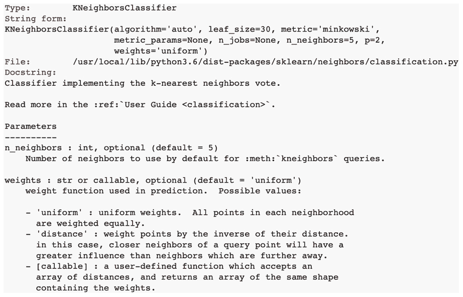

图 8.3：k-NN 估计器的帮助文件

如果你仔细查看帮助文件，你会看到在 `String form` 标题下列出了估计器的默认超参数化，并且在 `Parameters` 标题下有对每个超参数含义的解释。

回到我们的示例，如果我们想将超参数从 `k = 5` 更改为 `k = 15`，只需重新初始化估计器并将 `n_neighbors` 参数设置为 `15`，这将覆盖默认设置：

```py
"""
initialize with k = 15 and all other hyperparameters as default
"""
knn = neighbors.KNeighborsClassifier(n_neighbors=15)
# examine
print(knn.get_params())
```

你应该看到以下输出：

```py
{'algorithm': 'auto', 'leaf_size': 30, 'metric': 'minkowski', 
 'metric_params': None, 'n_jobs': None, 'n_neighbors': 15, 
 'p': 2, 'weights': 'uniform'}
```

你可能已经注意到，k 并不是 k-NN 分类器唯一的超参数。设置多个超参数就像指定相关参数一样简单。例如，我们可以将邻居数从 `5` 增加到 `15`，并强制算法在训练时考虑邻域中点的距离，而非简单的多数投票。更多信息，请参阅帮助文件中 `weights` 参数的说明（`?knn`）：

```py
"""
initialize with k = 15, weights = distance and all other 
hyperparameters as default 
"""
knn = neighbors.KNeighborsClassifier(n_neighbors=15, \
                                     weights='distance')
# examine
print(knn.get_params())
```

输出将如下所示：

```py
{'algorithm': 'auto', 'leaf_size': 30, 'metric': 'minkowski', 
 'metric_params': None, 'n_jobs': None, 'n_neighbors': 15, 
 'p': 2, 'weights': 'distance'}
```

在输出中，你可以看到 `n_neighbors`（即 `k`）现在被设置为 `15`，而 `weights` 设置为 `distance`，而非 `uniform`。

注意

本节代码可以在 [`packt.live/2tN5CH1`](https://packt.live/2tN5CH1) 找到。

## 关于默认值的说明

通常，机器学习库的开发人员已尽力为估计器设置合理的默认超参数。但需要注意的是，对于某些数据集，通过调优可能会获得显著的性能提升。

# 寻找最佳超参数设置

最佳的超参数设置取决于你最初构建机器学习模型的整体目标。在大多数情况下，这就是找到对未见数据具有最高预测性能的模型，通常通过其正确标注数据点（分类）或预测数字（回归）的能力来衡量。

未见数据的预测可以通过保留测试集或交叉验证来模拟，本章使用的是前者方法。每种情况的性能评估方式不同，例如，回归使用**均方误差**（**MSE**），分类则使用准确度。我们力求降低 MSE 或提高预测的准确度。

让我们在以下练习中实现手动超参数调优。

## 练习 8.01：手动调优 k-NN 分类器的超参数

在本练习中，我们将手动调优一个 k-NN 分类器，该分类器在*第七章：机器学习模型的泛化*中介绍，我们的目标是基于来自受影响乳腺样本的细胞测量值预测恶性或良性乳腺癌的发生。

注意

本练习中使用的数据集可以在我们的 GitHub 仓库找到，网址为[`packt.live/36dsxIF`](https://packt.live/36dsxIF)。

这些是数据集的重要属性：

+   ID 号码

+   诊断（M = 恶性，B = 良性）

+   3-32)

为每个细胞核计算 10 个实数值特征，计算方法如下：

+   半径（从中心到周长上点的平均距离）

+   纹理（灰度值的标准差）

+   周长

+   面积

+   平滑度（局部半径长度的变化）

+   紧凑性（周长² / 面积 - 1.0）

+   凹度（轮廓凹部分的严重程度）

+   凹点（轮廓中凹部分的数量）

+   对称性

+   分形维度（指的是组织结构的复杂性；“海岸线近似” - 1）

    注意

    数据集的属性详情可以在[`packt.live/30HzGQ6`](https://packt.live/30HzGQ6)找到。

以下步骤将帮助你完成本练习：

1.  在 Google Colab 中创建一个新的笔记本。

1.  接下来，从 scikit-learn 导入`neighbors`、`datasets`和`model_selection`：

    ```py
    from sklearn import neighbors, datasets, model_selection
    ```

1.  加载数据。我们将这个对象命名为`cancer`，并隔离目标`y`和特征`X`：

    ```py
    # dataset
    cancer = datasets.load_breast_cancer()
    # target
    y = cancer.target
    # features
    X = cancer.data
    ```

1.  初始化一个 k-NN 分类器，使用其默认的超参数设置：

    ```py
    # no arguments specified
    knn = neighbors.KNeighborsClassifier()
    ```

1.  将这个分类器输入到 10 折交叉验证（`cv`）中，计算每一折的精确度分数。假设最大化精确度（在所有正分类中真正例的比例）是本练习的主要目标：

    ```py
    # 10 folds, scored on precision
    cv = model_selection.cross_val_score(knn, X, y, cv=10,\
                                         scoring='precision')
    ```

1.  打印`cv`显示每一折计算得到的精确度分数：

    ```py
    # precision scores
    print(cv)
    ```

    你将看到以下输出：

    ```py
    [0.91666667 0.85       0.91666667 0.94736842 0.94594595 
     0.94444444 0.97222222 0.92105263 0.96969697 0.97142857]
    ```

1.  计算并打印所有折的平均精确度分数。这将给我们一个模型整体表现的概念，具体如下面的代码片段所示：

    ```py
    # average over all folds
    print(round(cv.mean(), 2))
    ```

    你应该会得到以下输出：

    ```py
    0.94
    ```

    你应该会看到平均分数接近 94%。能否进一步提高？

1.  再次运行所有内容，这次将超参数`k`设置为`15`。你会看到结果实际上稍微更差（低了 1%）：

    ```py
    # k = 15
    knn = neighbors.KNeighborsClassifier(n_neighbors=15)
    cv = model_selection.cross_val_score(knn, X, y, cv=10, \
                                         scoring='precision')
    print(round(cv.mean(), 2))
    ```

    输出结果如下：

    ```py
    0.93
    ```

1.  再尝试一次，`k` = `7`、`3` 和 `1`。在这种情况下，默认值 5 似乎是最好的选择。为了避免重复，你可以定义并调用一个 Python 函数，如下所示：

    ```py
    def evaluate_knn(k):
        knn = neighbors.KNeighborsClassifier(n_neighbors=k)
        cv = model_selection.cross_val_score(knn, X, y, cv=10, \
                                             scoring='precision')
        print(round(cv.mean(), 2))
    evaluate_knn(k=7)
    evaluate_knn(k=3)
    evaluate_knn(k=1)
    ```

    输出结果如下：

    ```py
    0.93
    0.93
    0.92
    ```

    没有什么能超过 94%。

1.  我们来改变第二个超参数。将`k = 5`，如果我们把 k-NN 的加权系统从`uniform`改为基于`distance`，会发生什么呢？重新运行所有代码，这次使用以下超参数设置：

    ```py
    # k =5, weights evaluated using distance
    knn = neighbors.KNeighborsClassifier(n_neighbors=5, \
                                         weights='distance')
    cv = model_selection.cross_val_score(knn, X, y, cv=10, \
                                         scoring='precision')
    print(round(cv.mean(), 2))
    ```

    性能有提升吗？

    对于默认的超参数设置，你不应看到进一步的提升，因为输出结果是：

    ```py
    0.93
    ```

因此我们得出结论，在这种情况下，默认的超参数设置是最优的。

注意

要访问此部分的源代码，请参阅 [`packt.live/322lWk4`](https://packt.live/322lWk4)。

你也可以在线运行这个示例，网址为 [`packt.live/3gbOyfU`](https://packt.live/3gbOyfU)。

## 手动搜索的优缺点

在所有的超参数调优策略中，手动过程给了你最多的控制权。通过这个过程，你可以感受到不同超参数设置下，估计器的表现如何，这意味着你可以根据自己的期望进行调整，而无需不必要地尝试大量的可能性。然而，这个策略只有在你想尝试的可能性较少时才可行。当可能性超过大约五个时，这个策略就变得过于繁琐，无法实际应用。

在接下来的几节中，我们将介绍两种策略，以更好地处理这种情况。

# 使用网格搜索进行调优

在机器学习的背景下，网格搜索指的是一种策略，即系统地测试从预定义的超参数可能性集合中，每一个超参数设置。你决定用于评估性能的标准，搜索完成后，你可以手动检查结果并选择最佳的超参数设置，或者让计算机为你自动选择。

总体目标是尝试找到一个最佳的超参数设置，从而在预测未见数据时提高性能。

在我们开始介绍 scikit-learn 中的网格搜索实现之前，先用简单的 Python `for`循环演示该策略。

## 网格搜索策略的简单演示

在接下来的网格搜索策略演示中，我们将使用我们在*练习 8.01*中看到的乳腺癌预测数据集，*手动调节 k-NN 分类器的超参数*，当时我们手动调整了 k-NN 分类器的超参数，以优化癌症预测的精确度。

这一次，我们不再手动拟合具有不同`k`值的模型，而是通过 Python 字典定义我们希望尝试的`k`值，即`k = 1, 3, 5, 7`。这个字典将作为我们进行网格搜索的基础，帮助我们找到最佳超参数设置。

注意

本部分代码可以在[`packt.live/2U1Y0Li`](https://packt.live/2U1Y0Li)找到。

代码如下：

```py
from sklearn import neighbors, datasets, model_selection
# load data
cancer = datasets.load_breast_cancer()
# target
y = cancer.target
# features
X = cancer.data
# hyperparameter grid
grid = {'k': [1, 3, 5, 7]}
```

在代码片段中，我们使用了一个字典`{}`并将`k`值设置在 Python 字典中。

在代码片段的下一部分，为了进行搜索，我们通过遍历网格来拟合每个`k`值的模型，并每次通过 10 折交叉验证评估模型。

在每次迭代结束时，我们通过`print`方法提取、格式化并报告交叉验证后的平均精度得分：

```py
# for every value of k in the grid
for k in grid['k']:
    # initialize the knn estimator
    knn = neighbors.KNeighborsClassifier(n_neighbors=k)
    # conduct a 10-fold cross-validation
    cv = model_selection.cross_val_score(knn, X, y, cv=10, \
                                         scoring='precision')
    # calculate the average precision value over all folds
    cv_mean = round(cv.mean(), 3)
    # report the result
    print('With k = {}, mean precision = {}'.format(k, cv_mean))
```

输出结果如下：


](img/B15019_08_04.jpg)

图 8.4：所有折叠的平均精度

从输出中我们可以看到，`k = 5`是找到的最佳超参数化，平均精度大约为 94%。将`k`增加到`7`并没有显著改善性能。需要注意的是，我们这里只更改了`k`这个参数，每次初始化 k-NN 估算器时，其他超参数都保持默认值。

为了清晰地表达这一点，我们可以运行相同的循环，这次仅打印出将要尝试的超参数设置：

```py
# for every value of k in the grid 
for k in grid['k']:
    # initialize the knn estimator
    knn = neighbors.KNeighborsClassifier(n_neighbors=k)
    # print the hyperparameterization
    print(knn.get_params())
```

输出结果如下：

```py
{'algorithm': 'auto', 'leaf_size': 30, 'metric': 'minkowski', 
 'metric_params': None, 'n_jobs': None, 'n_neighbors': 1, 
 'p': 2, 'weights': 'uniform'}
{'algorithm': 'auto', 'leaf_size': 30, 'metric': 'minkowski',
 'metric_params': None, 'n_jobs': None, 'n_neighbors': 3, 
 'p': 2, 'weights': 'uniform'}
{'algorithm': 'auto', 'leaf_size': 30, 'metric': 'minkowski', 
 'metric_params': None, 'n_jobs': None, 'n_neighbors': 5, 
 'p': 2, 'weights': 'uniform'}
{'algorithm': 'auto', 'leaf_size': 30, 'metric': 'minkowski', 
 'metric_params': None, 'n_jobs': None, 'n_neighbors': 7, 
 'p': 2, 'weights': 'uniform'}
```

从输出中你可以看到，我们唯一改变的参数是`k`，每次迭代中的其他设置都保持不变。

对于单一超参数的网格搜索，简单的单循环结构是可以的，但如果我们想尝试第二个超参数呢？记住，对于 k-NN，我们还有可以取值为`uniform`或`distance`的权重，选择不同的权重会影响 k-NN 如何学习如何分类数据点。

为了继续，我们只需要创建一个字典，包含`k`的值以及我们希望尝试的权重函数，作为单独的键/值对：

```py
# hyperparameter grid
grid = {'k': [1, 3, 5, 7],\
        'weight_function': ['uniform', 'distance']}
# for every value of k in the grid
for k in grid['k']:
    # and every possible weight_function in the grid 
    for weight_function in grid['weight_function']:
        # initialize the knn estimator
        knn = neighbors.KNeighborsClassifier\
              (n_neighbors=k, \
               weights=weight_function)
        # conduct a 10-fold cross-validation
        cv = model_selection.cross_val_score(knn, X, y, cv=10, \
                                             scoring='precision')
        # calculate the average precision value over all folds
        cv_mean = round(cv.mean(), 3)
        # report the result
        print('With k = {} and weight function = {}, '\
              'mean precision = {}'\
              .format(k, weight_function, cv_mean))
```

输出结果如下：


](img/B15019_08_05.jpg)

图 8.5：不同`k`值的所有折叠的平均精度值

你可以看到，当`k = 5`时，权重函数不基于距离，所有其他超参数保持默认值，平均精度最高。如前所述，如果你想查看 k-NN 的完整超参数化集，只需在估算器初始化后，在`for`循环中添加`print(knn.get_params())`：

```py
# for every value of k in the grid
for k in grid['k']:
    # and every possible weight_function in the grid 
    for weight_function in grid['weight_function']:
        # initialize the knn estimator
        knn = neighbors.KNeighborsClassifier\
              (n_neighbors=k, \
               weights=weight_function)
        # print the hyperparameterizations
        print(knn.get_params())
```

输出结果如下：

```py
{'algorithm': 'auto', 'leaf_size': 30, 'metric': 'minkowski', 
 'metric_params': None, 'n_jobs': None, 'n_neighbors': 1, 
 'p': 2, 'weights': 'uniform'}
{'algorithm': 'auto', 'leaf_size': 30, 'metric': 'minkowski', 
 'metric_params': None, 'n_jobs': None, 'n_neighbors': 1, 
 'p': 2, 'weights': 'distance'}
{'algorithm': 'auto', 'leaf_size': 30, 'metric': 'minkowski', 
 'metric_params': None, 'n_jobs': None, 'n_neighbors': 3, 
 'p': 2, 'weights': 'uniform'}
{'algorithm': 'auto', 'leaf_size': 30, 'metric': 'minkowski', 
 'metric_params': None, 'n_jobs': None, 'n_neighbors': 3, 
 'p': 2, 'weights': 'distance'}
{'algorithm': 'auto', 'leaf_size': 30, 'metric': 'minkowski', 
 'metric_params': None, 'n_jobs': None, 'n_neighbors': 5, 
 'p': 2, 'weights': 'uniform'}
{'algorithm': 'auto', 'leaf_size': 30, 'metric': 'minkowski', 
 'metric_params': None, 'n_jobs': None, 'n_neighbors': 5, 
 'p': 2, 'weights': 'distance'}
{'algorithm': 'auto', 'leaf_size': 30, 'metric': 'minkowski', 
 'metric_params': None, 'n_jobs': None, 'n_neighbors': 7, 
 'p': 2, 'weights': 'uniform'}
{'algorithm': 'auto', 'leaf_size': 30, 'metric': 'minkowski', 
 'metric_params': None, 'n_jobs': None, 'n_neighbors': 7, 
 'p': 2, 'weights': 'distance'}
```

这个实现虽然非常适合展示网格搜索过程的工作原理，但在尝试评估具有`3`、`4`甚至`10`种不同类型超参数（每种都有大量可能设置）的估算器时，可能并不实用。

以这种方式继续进行意味着需要编写和跟踪多个 `for` 循环，这可能会很繁琐。幸运的是，`scikit-learn` 的 `model_selection` 模块提供了一种叫做 `GridSearchCV` 的方法，它更加用户友好。我们将在接下来的主题中讨论这个方法。

# GridSearchCV

`GridsearchCV` 是一种调优方法，通过评估网格中提到的参数组合来构建模型。在下图中，我们将看到 `GridSearchCV` 与手动搜索的不同，并通过表格形式详细了解网格搜索。

## 使用 GridSearchCV 进行调优

我们可以通过利用 `model_selection.GridSearchCV` 更轻松地进行网格搜索。

为了做对比，我们将使用之前的同一个乳腺癌数据集和 k-NN 分类器：

```py
from sklearn import model_selection, datasets, neighbors
# load the data
cancer = datasets.load_breast_cancer()
# target
y = cancer.target
# features
X = cancer.data
```

加载数据后，我们需要做的下一件事是初始化我们希望在不同超参数化下评估的估计器类：

```py
# initialize the estimator
knn = neighbors.KNeighborsClassifier()
```

然后我们定义网格：

```py
# grid contains k and the weight function
grid = {'n_neighbors': [1, 3, 5, 7],\
        'weights': ['uniform', 'distance']}
```

为了设置搜索，我们将刚初始化的估计器和超参数网格传递给 `model_selection.GridSearchCV()`。我们还必须指定一个评分指标，这个方法将用于评估在搜索过程中尝试的各种超参数化的表现。

最后一步是使用交叉验证通过 `cv` 参数设置将要使用的分割数。我们将其设置为 `10`，从而进行 10 折交叉验证：

```py
"""
 set up the grid search with scoring on precision and 
number of folds = 10
"""
gscv = model_selection.GridSearchCV(estimator=knn, \
                                    param_grid=grid, \
                                    scoring='precision', cv=10)
```

最后一步是通过 `fit()` 方法将数据传递给这个对象。一旦完成，网格搜索过程将启动：

```py
# start the search
gscv.fit(X, y)
```

默认情况下，关于搜索的信息将打印到屏幕上，允许你看到将要评估的 k-NN 估计器的确切估计器参数化：


图 8.6: k-NN 估计器的估计器参数化

一旦搜索完成，我们可以通过访问和打印 `cv_results_` 属性来查看结果。`cv_results_` 是一个字典，包含关于在每个超参数化下模型表现的有用信息，例如评分指标的平均测试集值（`mean_test_score`，值越低越好），尝试的所有超参数化的完整列表（`params`），以及模型与 `mean_test_score` 相关的排名（`rank_test_score`）。

找到的最佳模型的排名为 1，第二好的模型排名为 2，以此类推，正如你在 *图 8.8* 中看到的那样。模型拟合时间通过 `mean_fit_time` 报告。

虽然对于较小的数据集通常不是一个考虑因素，但在某些情况下，这个值可能很重要，因为您可能会发现通过某些超参数化在模型性能上的边际增加与模型拟合时间的显著增加相关联，这取决于您可用的计算资源，可能会导致该超参数化变得不可行，因为它将花费太长时间来拟合：

```py
# view the results
print(gscv.cv_results_)
```

输出将如下所示：

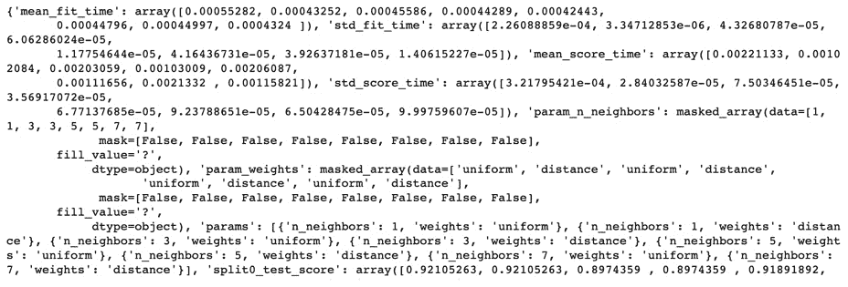

图 8.7：GridsearchCV 结果

模型排名可见以下图片：

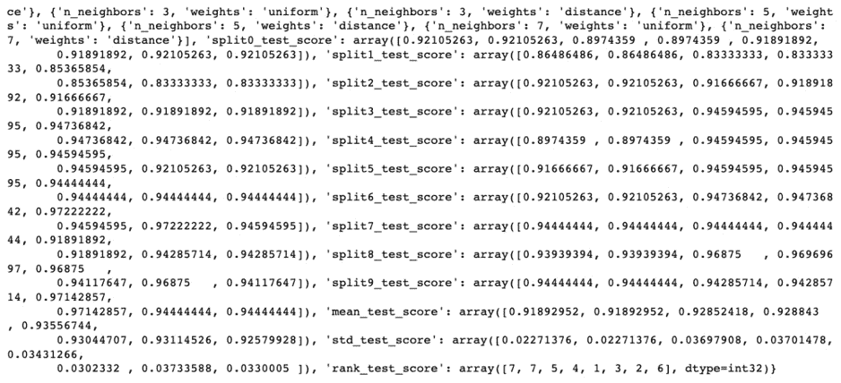

图 8.8：模型排名

注意

出于展示目的，输出已经被截断。您可以在这里查看完整的输出：[`packt.live/2uD12uP`](https://packt.live/2uD12uP)。

在输出中，值得注意的是，此字典可以轻松转换为 pandas DataFrame，这样使得信息更加清晰易读，并允许我们选择性地显示我们感兴趣的指标。

例如，假设我们只对前五个表现最佳模型的每个超参数化（`params`）和平均交叉验证测试分数（`mean_test_score`）感兴趣：

```py
import pandas as pd
# convert the results dictionary to a dataframe
results = pd.DataFrame(gscv.cv_results_)
"""
select just the hyperparameterizations tried, 
the mean test scores, order by score and show the top 5 models
"""
print(results.loc[:,['params','mean_test_score']]\
      .sort_values('mean_test_score', ascending=False).head(5))
```

运行此代码将产生以下输出：


图 8.9：前 5 个模型的 mean_test_score

我们还可以使用 pandas 生成以下结果的可视化：

```py
# visualise the result
results.loc[:,['params','mean_test_score']]\
       .plot.barh(x = 'params')
```

输出将如下所示：

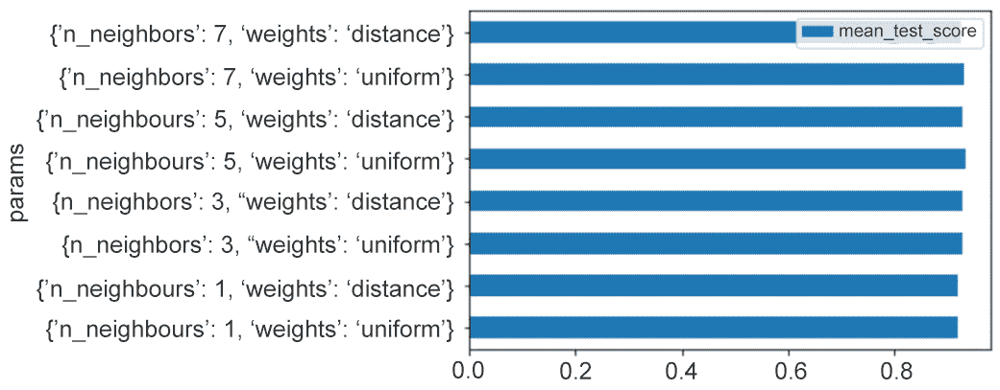

图 8.10：使用 pandas 可视化输出

当您查看前述图表时，您会发现找到的最佳超参数设置是 `n_neighbors = 5` 和 `weights = 'uniform'`，因为这会产生最高的平均测试分数（精度）。

注意

此部分的代码可以在 [`packt.live/2uD12uP`](https://packt.live/2uD12uP) 找到。

### 支持向量机（Support Vector Machine，SVM）分类器

**SVM** 分类器基本上是一种监督学习模型。它是一种常用的估算器类别，可用于二元和多类分类。它在数据有限的情况下表现良好，因此是一个可靠的模型。与高度迭代或集成方法（如人工神经网络或随机森林）相比，训练速度相对较快，这使其成为在计算机处理能力有限的情况下的良好选择。

它通过利用一种称为核函数的特殊数学公式进行预测。这个函数可以采用多种形式，其中一些函数（如具有其自身可调参数的多项式核函数）。

SVM 在图像分类的背景下表现良好，您将在以下练习中看到。

注意

有关支持向量机的更多信息，请参见[`packt.live/37iDytw`](https://packt.live/37iDytw)，并参考[`packt.live/38xaPkC`](https://packt.live/38xaPkC)。

## 练习 8.02: 支持向量机的网格搜索超参数调优

在本练习中，我们将使用一种叫做 SVM 分类器的估计器，并通过网格搜索策略来调整其超参数。

我们在这里关注的监督学习目标是基于图像对手写数字（0-9）进行分类。我们将使用的数据集包含 1,797 个标记的手写数字图像。

注意

本练习所用的数据集可以在我们的 GitHub 库中找到：[`packt.live/2vdbHg9`](https://packt.live/2vdbHg9)。

数据集的详细信息可以在原始数据集的网址找到：[`packt.live/36cX35b`](https://packt.live/36cX35b)。

1.  在 Google Colab 中创建一个新的笔记本。

1.  从 scikit-learn 中导入`datasets`、`svm`和`model_selection`：

    ```py
    from sklearn import datasets, svm, model_selection
    ```

1.  加载数据。我们将这个对象命名为 images，然后将目标`y`和特征`X`分离。在训练步骤中，SVM 分类器将学习`y`如何与`X`相关联，因此，当给定新的`X`值时，它能够预测新的`y`值：

    ```py
    # load data
    digits = datasets.load_digits()
    # target
    y = digits.target
    # features
    X = digits.data
    ```

1.  将估计器初始化为多类 SVM 分类器，并将`gamma`参数设置为`scale`：

    ```py
    # support vector machine classifier
    clr = svm.SVC(gamma='scale')
    ```

    注意

    关于`gamma`参数的更多信息，请访问[`packt.live/2Ga2l79`](https://packt.live/2Ga2l79)。

1.  定义我们的网格，涵盖四种不同的分类器超参数配置，包括线性核和多项式核（分别为`2`、`3`和`4`度）。我们希望查看哪种超参数配置能够提供更准确的预测：

    ```py
    # hyperparameter grid. contains linear and polynomial kernels
    grid = [{'kernel': ['linear']},\
            {'kernel': ['poly'], 'degree': [2, 3, 4]}]
    ```

1.  设置网格搜索 k 折交叉验证，使用`10`折和准确度评分方法。确保它的输入包含我们的`grid`和`estimator`对象：

    ```py
    """
    setting up the grid search to score on accuracy and 
    evaluate over 10 folds
    """
    cv_spec = model_selection.GridSearchCV\
              (estimator=clr, param_grid=grid, \
               scoring='accuracy', cv=10)
    ```

1.  通过将数据提供给`.fit()`方法来开始搜索。过程中，将会打印出超参数配置尝试情况以及选择的评分方法：

    ```py
    # start the grid search
    cv_spec.fit(X, y)
    ```

    你应该看到以下输出：

    

    图 8.11: 使用.fit()方法进行网格搜索

1.  要查看所有结果，只需将`cv_spec.cv_results_`打印到屏幕上。你会看到结果结构为字典，这样你就可以通过键访问所需的信息：

    ```py
    # what is the available information
    print(cv_spec.cv_results_.keys())
    ```

    你将看到以下信息：

    

    图 8.12: 结果作为字典

1.  对于这个练习，我们主要关心每种不同超参数配置在测试集上的表现。你可以通过`cv_spec.cv_results_['mean_test_score']`查看第一个超参数配置，通过`cv_spec.cv_results_['params']`查看第二个超参数配置。

    我们将结果字典转换为`pandas` DataFrame，并找到最佳的超参数配置：

    ```py
    import pandas as pd
    # convert the dictionary of results to a pandas dataframe
    results = pd.DataFrame(cv_spec.cv_results_)
    # show hyperparameterizations
    print(results.loc[:,['params','mean_test_score']]\
          .sort_values('mean_test_score', ascending=False))
    ```

    你将看到以下结果：

    

    图 8.13：参数化结果

    注意

    你可能会得到略有不同的结果。不过，你获得的值应与前面的输出大致一致。

1.  最好的做法是可视化你所得到的任何结果。`pandas` 使这一过程变得简单。运行以下代码来生成可视化图表：

    ```py
    # visualize the result
    (results.loc[:,['params','mean_test_score']]\
            .sort_values('mean_test_score', ascending=True)\
            .plot.barh(x='params', xlim=(0.8)))
    ```

    输出结果如下：

    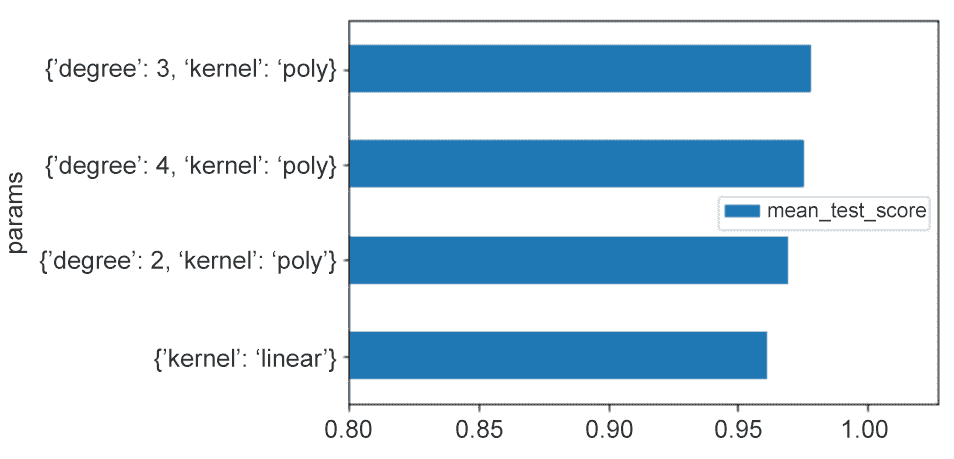

图 8.14：使用 pandas 可视化结果

注意

要访问此特定部分的源代码，请参考[`packt.live/36At2MO`](https://packt.live/36At2MO)。

你也可以在[`packt.live/2YdQsGq`](https://packt.live/2YdQsGq)上在线运行此示例。

我们可以看到，具有三次多项式核函数的 SVM 分类器在所有评估的超参数组合中具有最高的准确率。你可以随意向网格中添加更多超参数组合，看看是否能提高分数。

## 网格搜索的优缺点

与手动搜索相比，网格搜索的主要优点在于它是一个自动化过程，用户只需设置一次并可忘记它。此外，你还可以精确控制所评估的超参数组合，当你对哪些超参数组合可能在你的场景中有效有先验知识时，这种精确性是一个很好的优势。由于网格的定义是明确的，你也很容易理解搜索过程中将会发生什么。

网格搜索策略的主要缺点是计算开销非常大；也就是说，当需要尝试的超参数组合数量大幅增加时，处理时间可能非常慢。此外，在定义网格时，你可能会无意中遗漏一个实际上是最优的超参数组合。如果它没有出现在网格中，它将永远不会被尝试。

为了克服这些缺点，我们将在下一部分探讨随机搜索。

# 随机搜索

与网格搜索通过预定义的超参数集合逐一进行搜索不同，在随机搜索中，我们通过假设每个超参数是一个随机变量，从可能性的分布中进行采样。在深入了解这一过程之前，简要回顾一下随机变量及其分布的含义是有帮助的。

## 随机变量及其分布

随机变量是非恒定的（其值可能变化），其变异性可以通过分布来描述。随机变量的分布有很多种类型，但每种都属于两大类之一：离散型和连续型。我们使用离散型分布来描述值只能取整数的随机变量，例如计数。

一个例子是主题公园一天的游客数量，或者高尔夫球手打入一杆所需的尝试次数。

我们使用连续分布来描述那些值沿着由无限小增量组成的连续体的随机变量。示例包括人类的身高或体重，或者外部空气温度。分布通常具有控制其形状的参数。

离散分布可以通过所谓的概率质量函数来数学描述，该函数定义了随机变量取某一特定值的确切概率。该函数左侧的常见符号为`P(X=x)`，其英文含义是随机变量`X`等于某一特定值`x`的概率为`P`。请记住，概率的范围介于`0`（不可能）和`1`（必然）之间。

根据定义，所有可能的`x`值对应的每个`P(X=x)`的总和将等于 1，或者换句话说，`X`取任何值的概率为 1。这种分布的一个简单例子是离散均匀分布，其中随机变量`X`只能取有限范围内的一个值，而且它取任何特定值的概率对于所有值都是相同的，因此称之为均匀分布。

例如，如果有 10 个可能的值，`X`取任何特定值的概率恰好为 1/10。如果有 6 个可能的值，就像标准的六面骰子一样，概率将是 1/6，依此类推。离散均匀分布的概率质量函数为：


](img/B15019_08_15.jpg)

图 8.15: 离散均匀分布的概率质量函数

以下代码将帮助我们查看该分布的形式，其中`X`有 10 个可能值。

首先，我们创建一个`X`可能取值的所有值的列表：

```py
# list of all xs
X = list(range(1, 11))
print(X)
```

输出结果如下：

```py
 [1, 2, 3, 4, 5, 6, 7, 8, 9, 10]
```

然后我们计算`X`取任意`x`值的概率（`P(X=x)`）：

```py
# pmf, 1/n * n = 1
p_X_x = [1/len(X)] * len(X)
# sums to 1
print(p_X_x)
```

如前所述，概率的总和将等于 1，而这适用于任何分布。现在我们拥有了所有需要的内容来可视化该分布：

```py
import matplotlib.pyplot as plt
plt.bar(X, p_X_x)
plt.xlabel('X')
plt.ylabel('P(X=x)')
```

输出结果如下：


](img/B15019_08_16.jpg)

图 8.16: 可视化条形图

在视觉输出中，我们看到`X`在 1 到 10 之间的特定整数的概率为 1/10。

注意

你常见的其他离散分布包括二项分布、负二项分布、几何分布和泊松分布，所有这些我们都鼓励你进一步研究。可以将这些术语输入搜索引擎以获取更多信息。

连续随机变量的分布稍微复杂一点，因为我们无法直接计算 `P(X=x)`，因为 `X` 位于一个连续体上。然而，我们可以使用积分来近似某一范围内的概率，但这超出了本书的讨论范围。`X` 与概率的关系通过概率密度函数 `P(X)` 来描述。或许最著名的连续分布就是正态分布，它在视觉上呈现为钟形曲线。

正态分布有两个描述其形状的参数：均值（`𝜇`）和方差（`𝜎`2）。正态分布的概率密度函数为：


图 8.17：正态分布的概率密度函数

以下代码展示了两个正态分布，它们的均值（`𝜇` `= 0`）相同，但方差参数（`𝜎``2 = 1` 和 `𝜎``2 = 2.25`）不同。首先，我们使用 NumPy 的 `.linspace` 方法生成从 `-10` 到 `10` 的 100 个均匀分布的值：

```py
import numpy as np
# range of xs
x = np.linspace(-10, 10, 100)
```

然后，我们为这两个正态分布生成近似的 `X` 概率。

使用 `scipy.stats` 是处理分布的好方法，它的 `pdf` 方法使我们可以轻松地可视化概率密度函数的形状：

```py
import scipy.stats as stats
# first normal distribution with mean = 0, variance = 1
p_X_1 = stats.norm.pdf(x=x, loc=0.0, scale=1.0**2)
# second normal distribution with mean = 0, variance = 2.25
p_X_2 = stats.norm.pdf(x=x, loc=0.0, scale=1.5**2)
```

注意

在这个例子中，`loc` 对应于 𝜇，而 `scale` 对应于标准差，它是 `𝜎``2` 的平方根，因此我们要对输入进行平方处理。

然后我们可视化结果。注意，`𝜎``2` 控制着分布的宽度，也就控制了随机变量的变化范围：

```py
plt.plot(x,p_X_1, color='blue')
plt.plot(x, p_X_2, color='orange')
plt.xlabel('X')
plt.ylabel('P(X)')
```

输出结果如下：

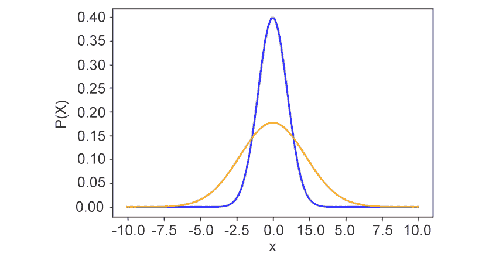

图 8.18：可视化正态分布

你常见的其他离散分布包括伽玛分布、指数分布和贝塔分布，我们鼓励你进行进一步研究。

注意

本节的代码可以在[`packt.live/38Mfyzm`](https://packt.live/38Mfyzm)找到。

## 随机搜索过程的简单演示

再次强调，在我们开始讲解 scikit-learn 实现的随机搜索参数调优之前，我们将使用简单的 Python 工具演示这个过程。到目前为止，我们一直使用分类问题来展示调优概念，但接下来我们将探讨回归问题。我们能否找到一个模型，基于患者的 BMI 和年龄等特征预测糖尿病的发展？

注意

原始数据集可以在[`packt.live/2O4XN6v`](https://packt.live/2O4XN6v)找到。

本节的代码可以在[`packt.live/3aOudvK`](https://packt.live/3aOudvK)找到。

我们首先加载数据：

```py
from sklearn import datasets, linear_model, model_selection
# load the data
diabetes = datasets.load_diabetes()
# target
y = diabetes.target
# features
X = diabetes.data
```

为了更好地理解数据，我们可以检查第一个患者的疾病进展：

```py
# the first patient has index 0
print(y[0])
```

输出结果如下：

```py
 151.0
```

现在让我们来分析它们的特征：

```py
# let's look at the first patients data
print(dict(zip(diabetes.feature_names, X[0])))
```

我们应该看到以下结果：


图 8.19：患者特征字典

对于这种情况，我们将尝试一种叫做岭回归的技术，它将拟合一个线性模型到数据上。岭回归是一种特殊的方法，允许我们直接使用正则化来帮助减轻过拟合问题。岭回归有一个关键超参数𝛼，它控制模型拟合中的正则化程度。如果𝛼设置为 1，将不使用正则化，这实际上是岭回归模型拟合与 OLS 线性回归模型拟合相等的特殊情况。增大𝛼的值，会增加正则化的程度。

注意

我们在*第七章*中讨论了岭回归，*机器学习模型的泛化*。

关于岭回归和正则化的更多信息，请参见[`packt.live/2NR3GUq`](https://packt.live/2NR3GUq)。

在随机搜索超参数调整的背景下，我们假设𝛼是一个随机变量，我们需要指定一个可能的分布。

在这个例子中，我们假设𝛼遵循伽马分布。这个分布有两个参数，k 和𝜃，分别控制分布的形状和尺度。

对于岭回归，我们认为最优的𝛼值接近 1，当𝛼远离 1 时，其可能性逐渐降低。反映这一思想的伽马分布的参数化方式是 k 和𝜃都等于 1。为了可视化这种分布的形式，我们可以运行以下代码：

```py
import numpy as np
from scipy import stats
import matplotlib.pyplot as plt
# values of alpha
x = np.linspace(1, 20, 100)
# probabilities
p_X = stats.gamma.pdf(x=x, a=1, loc=1, scale=2)
plt.plot(x,p_X)
plt.xlabel('alpha')
plt.ylabel('P(alpha)')
```

输出将如下所示：

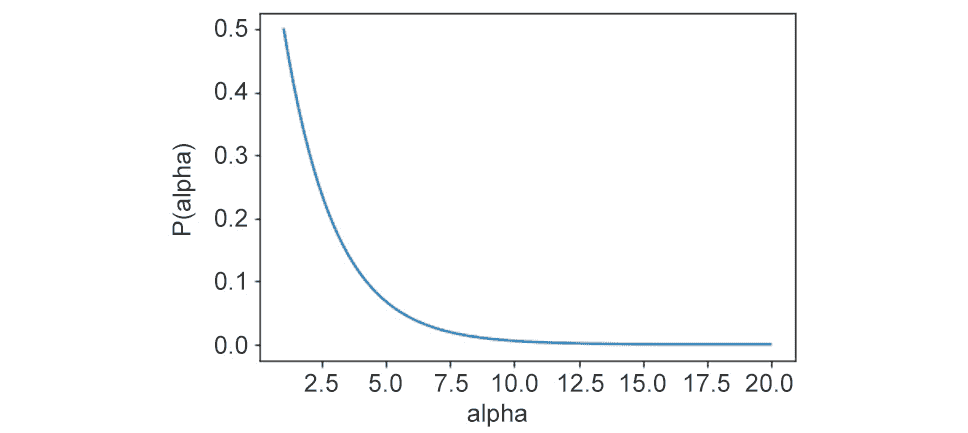

图 8.20：概率的可视化

在图中，你可以看到，对于较小的𝛼值，概率急剧下降，而对于较大的𝛼值，下降速度较慢。

随机搜索过程的下一步是从所选分布中采样 n 个值。在这个例子中，我们将绘制 100 个𝛼值。请记住，抽取某个特定𝛼值的概率与该值在此分布中定义的概率有关：

```py
# n sample values
n_iter = 100
# sample from the gamma distribution
samples = stats.gamma.rvs(a=1, loc=1, scale=2, \
                          size=n_iter, random_state=100)
```

注意

我们设置一个随机状态以确保结果的可重复性。

绘制样本的直方图，如下图所示，可以揭示出一个大致符合我们所采样的分布的形状。请注意，随着样本数量的增加，直方图将更符合该分布：

```py
# visualize the sample distribution
plt.hist(samples)
plt.xlabel('alpha')
plt.ylabel('sample count')
```

输出将如下所示：

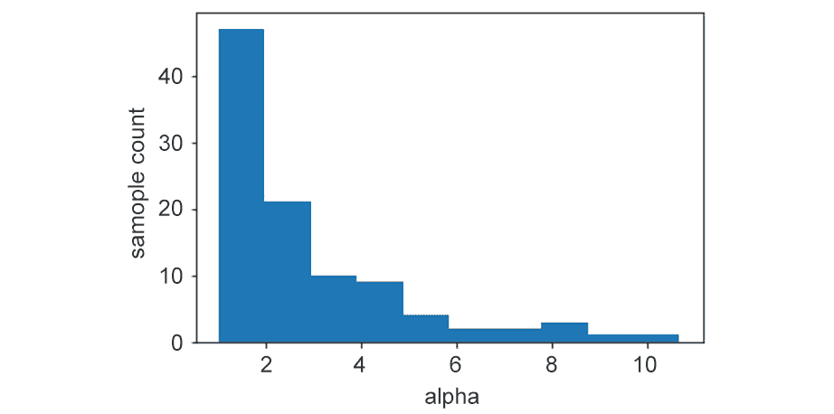

图 8.21：样本分布的可视化

然后，将为每个采样的𝛼值拟合一个模型并评估其性能。正如我们在本章中其他超参数调整方法中看到的，性能将通过 k 折交叉验证（`k = 10`）来评估，但因为我们处理的是回归问题，所以评估指标将是测试集的负均方误差（MSE）。

使用此度量意味着较大的值更好。我们将结果存储在一个字典中，每个 𝛼 值作为键，对应的交叉验证负 MSE 作为值：

```py
# we will store the results inside a dictionary
result = {}
# for each sample
for sample in samples:
    """
    initialize a ridge regression estimator with alpha set 
    to the sample value
    """
    reg = linear_model.Ridge(alpha=sample)
    """
    conduct a 10-fold cross validation scoring on 
    negative mean squared error
    """
    cv = model_selection.cross_val_score\
         (reg, X, y, cv=10, \
          scoring='neg_mean_squared_error')
    # retain the result in the dictionary
    result[sample] = [cv.mean()]
```

我们将不再检查原始的结果字典，而是将其转换为 pandas DataFrame，转置并为列命名。按负均方误差降序排序显示，对于此问题，正则化的最佳水平实际上是在 𝛼 约为 1 时，即我们没有找到证据表明该问题需要正则化，OLS 线性模型足以解决该问题：

```py
import pandas as pd
"""
convert the result dictionary to a pandas dataframe, 
transpose and reset the index
"""
df_result = pd.DataFrame(result).T.reset_index()
# give the columns sensible names
df_result.columns = ['alpha', 'mean_neg_mean_squared_error']
print(df_result.sort_values('mean_neg_mean_squared_error', \
                            ascending=False).head())
```

输出将如下所示：


图 8.22：随机搜索过程的输出

注意

结果会有所不同，取决于所使用的数据。

只要可能，进行结果可视化总是有益的。将 𝛼 与负均方误差绘制成散点图清晰地表明，远离 𝛼 = 1 并不会改善预测性能：

```py
plt.scatter(df_result.alpha, \
            df_result.mean_neg_mean_squared_error)
plt.xlabel('alpha')
plt.ylabel('-MSE')
```

输出将如下所示：

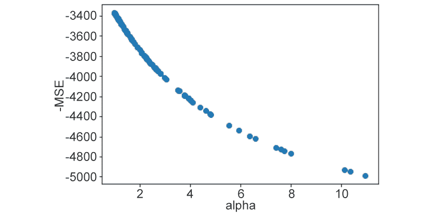

图 8.23：绘制散点图

我们发现最优的 𝛼 值为 1（其默认值），这在超参数调优中是一个特殊情况，因为最优的超参数配置恰好是默认值。

## 使用 RandomizedSearchCV 进行调优

实际上，我们可以使用 scikit-learn 的 `model_selection` 模块中的 `RandomizedSearchCV` 方法进行搜索。你只需要传入估计器、你希望调优的超参数及其分布、你希望从每个分布中抽取的样本数量，以及你希望评估模型性能的度量标准。这些对应于 `param_distributions`、`n_iter` 和 `scoring` 参数。为了演示，我们使用 `RandomizedSearchCV` 进行之前完成的搜索。首先，我们加载数据并初始化我们的岭回归估计器：

```py
from sklearn import datasets, model_selection, linear_model
# load the data
diabetes = datasets.load_diabetes()
# target
y = diabetes.target
# features
X = diabetes.data
# initialise the ridge regression
reg = linear_model.Ridge()
```

然后，我们指定希望调优的超参数是 `alpha`，并且我们希望 𝛼 按 `gamma` 分布，`k = 1` 且 `𝜃` `= 1`：

```py
from scipy import stats
# alpha ~ gamma(1,1)
param_dist = {'alpha': stats.gamma(a=1, loc=1, scale=2)}
```

接下来，我们设置并运行随机搜索过程，它将从我们的 `gamma(1,1)` 分布中抽取 100 个值，拟合岭回归并使用交叉验证评估其性能，评分标准是负均方误差：

```py
"""
set up the random search to sample 100 values and 
score on negative mean squared error
"""
rscv = model_selection.RandomizedSearchCV\
       (estimator=reg, param_distributions=param_dist, \
        n_iter=100, scoring='neg_mean_squared_error')
# start the search
rscv.fit(X,y)
```

完成搜索后，我们可以提取结果并生成一个 pandas DataFrame，正如我们之前所做的那样。按 `rank_test_score` 排序并查看前五行与我们的结论一致，即 alpha 应设置为 1，并且该问题似乎不需要正则化：

```py
import pandas as pd
# convert the results dictionary to a pandas data frame
results = pd.DataFrame(rscv.cv_results_)
# show the top 5 hyperparamaterizations
print(results.loc[:,['params','rank_test_score']]\
      .sort_values('rank_test_score').head(5))
```

输出将如下所示：


图 8.24：使用 RandomizedSearchCV 调优的输出

注意

之前的结果可能会有所不同，取决于数据。

## 练习 8.03：随机搜索超参数调优，应用于随机森林分类器

在这个练习中，我们将重新审视手写数字分类问题，这次使用随机森林分类器，并通过随机搜索策略调优超参数。随机森林是一种常用的方法，适用于单类和多类分类问题。它通过生成 `n` 个简单的树模型来学习，每棵树逐步将数据集分割成能够最佳分离不同类别数据点的区域。

最终生成的模型可以看作是每个树模型的平均值。通过这种方式，随机森林是一种 `集成` 方法。我们将在这个练习中调优的参数是 `criterion` 和 `max_features`。

`criterion` 是指从类纯度角度评估每次分裂的方式（分裂越纯净越好），而 `max_features` 是随机森林在寻找最佳分裂时可以使用的最大特征数量。

以下步骤将帮助你完成这个练习。

1.  在 Google Colab 中创建一个新的笔记本。

1.  导入数据并提取特征 `X` 和目标 `y`：

    ```py
    from sklearn import datasets
    # import data
    digits = datasets.load_digits()
    # target
    y = digits.target
    # features
    X = digits.data
    ```

1.  初始化随机森林分类器估算器。我们将 `n_estimators` 超参数设置为 `100`，这意味着最终模型的预测基本上是 `100` 个简单树模型的平均值。请注意使用随机状态来确保结果的可重复性：

    ```py
    from sklearn import ensemble
    # an ensemble of 100 estimators
    rfc = ensemble.RandomForestClassifier(n_estimators=100, \
                                          random_state=100)
    ```

1.  我们将调优的参数之一是 `max_features`。让我们找出它可以取的最大值：

    ```py
    # how many features do we have in our dataset?
    n_features = X.shape[1]
    print(n_features)
    ```

    你应该看到我们有 64 个特征：

    ```py
    64
    ```

    现在我们知道了 `max_features` 的最大值，我们可以自由地定义超参数输入到随机搜索过程中。此时，我们没有理由认为 `max_features` 的某个特定值更加优化。

1.  设置一个覆盖 `1` 到 `64` 范围的离散均匀分布。记住概率质量函数 `P(X=x) = 1/n`，因此在我们的情况下 `P(X=x) = 1/64`。由于 `criterion` 只有两个离散选项，因此它也将作为一个离散均匀分布进行采样，`P(X=x) = ½`：

    ```py
    from scipy import stats
    """
    we would like to smaple from criterion and 
    max_features as discrete uniform distributions
    """
    param_dist = {'criterion': ['gini', 'entropy'],\
                  'max_features': stats.randint(low=1, \
                                                high=n_features)}
    ```

1.  现在我们已经拥有了设置随机搜索过程所需的一切。如前所述，我们将使用准确率作为模型评估的指标。请注意使用随机状态：

    ```py
    from sklearn import model_selection
    """
    setting up the random search sampling 50 times and 
    conducting 5-fold cross-validation
    """
    rscv = model_selection.RandomizedSearchCV\
           (estimator=rfc, param_distributions=param_dist, \
            n_iter=50, cv=5, scoring='accuracy' , random_state=100)
    ```

1.  让我们通过 `fit` 方法启动过程。请注意，由于随机森林的内部迭代过程，拟合随机森林和交叉验证都是计算量大的过程。生成结果可能需要一些时间：

    ```py
    # start the process
    rscv.fit(X,y)
    ```

    你应该看到如下内容：

    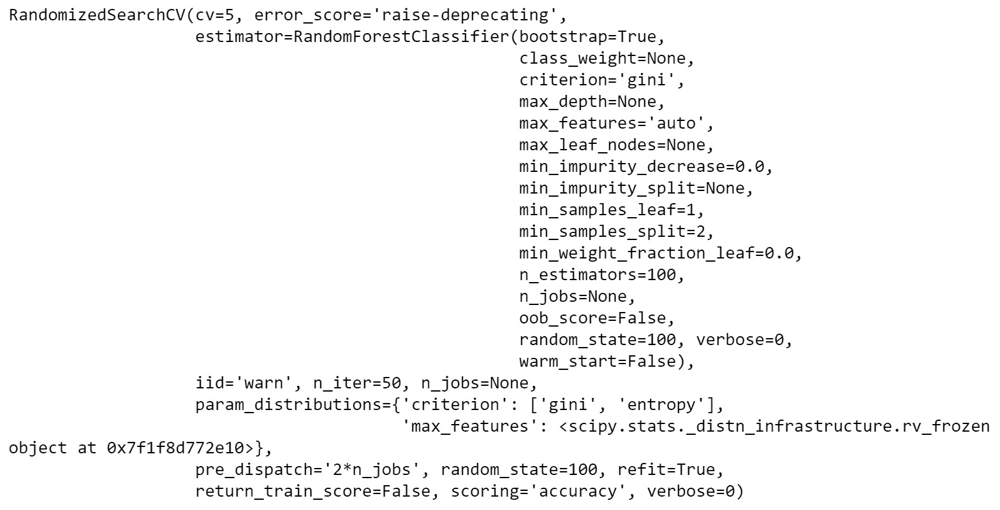

    图 8.25：RandomizedSearchCV 结果

1.  接下来，您需要检查结果。从`results`属性创建一个`pandas` DataFrame，按`rank_test_score`排序，并查看排名前五的模型超参数配置。请注意，由于随机搜索是随机抽取超参数配置，因此可能会出现重复项。我们从 DataFrame 中移除重复的条目：

    ```py
    import pandas as pd
    # convert the dictionary of results to a pandas dataframe
    results = pd.DataFrame(rscv.cv_results_)
    # removing duplication
    distinct_results = results.loc[:,['params',\
                                      'mean_test_score']]
    # convert the params dictionaries to string data types
    distinct_results.loc[:,'params'] = distinct_results.loc\
                                       [:,'params'].astype('str')
    # remove duplicates
    distinct_results.drop_duplicates(inplace=True)
    # look at the top 5 best hyperparamaterizations
    distinct_results.sort_values('mean_test_score', \
                                 ascending=False).head(5)
    ```

    您应该会得到以下输出：

    

    图 8.26：前五名超参数配置

    注意

    您可能会得到略有不同的结果。不过，您获得的值应该与前述输出中的值大体一致。

1.  最后一步是可视化结果。包括所有参数配置会导致图表杂乱，因此我们将筛选出那些平均测试得分 > 0.93 的参数配置：

    ```py
    # top performing models
    distinct_results[distinct_results.mean_test_score > 0.93]\
                     .sort_values('mean_test_score')\
                     .plot.barh(x='params', xlim=(0.9))
    ```

    输出将如下所示：

    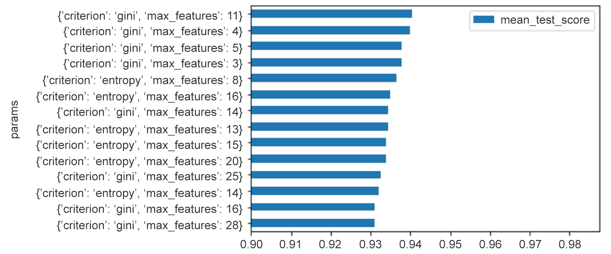

图 8.27：可视化表现最佳模型的测试得分

注意

要访问此特定部分的源代码，请参考[`packt.live/2uDVct8`](https://packt.live/2uDVct8)。

您还可以在网上运行此示例，访问[`packt.live/3gbQMvw`](https://packt.live/3gbQMvw)。

我们发现最好的超参数配置是使用`gini`准则的随机森林分类器，最大特征数设置为 4。

## 随机搜索的优缺点

由于随机搜索从可能的超参数配置范围中抽取有限的样本（在`model_selection.RandomizedSearchCV`中为`n_iter`），因此可以将超参数搜索的范围扩展到超出网格搜索实际可行的范围。这是因为网格搜索必须尝试该范围内的所有可能性，设置一个较大的值范围可能会导致处理速度过慢。搜索更广泛的范围使您有机会发现真正的最优解。

与手动搜索和网格搜索策略相比，您确实牺牲了一定的控制力以获得这一好处。另一个需要考虑的问题是，设置随机搜索比其他选项稍微复杂一些，因为您必须指定分布。总是有出错的可能性。也就是说，如果您不确定使用什么分布，可以选择离散或连续均匀分布，针对各个变量类型，这将为所有选项分配相等的选择概率。

## 活动 8.01：蘑菇有毒吗？

想象一下，您是一名数据科学家，在当地大学的生物学系工作。您的同事是一位专门研究真菌的生物学家（真菌学家），她请求您帮助她开发一个机器学习模型，能够根据蘑菇外观的相关特征判断某个蘑菇物种是否有毒。

本活动的目标是使用网格搜索和随机搜索策略来找到一个最优模型。

注意

本次练习所用的数据集可以在我们的 GitHub 仓库找到：[`packt.live/38zdhaB`](https://packt.live/38zdhaB)。

数据集的属性详情可以在原始数据集网站找到：[`packt.live/36j0jfA`](https://packt.live/36j0jfA)。

1.  使用`pandas.read_csv()`方法将数据加载到 Python 中，命名为`mushrooms`对象。

    提示：数据集是 CSV 格式且没有表头。在`pandas.read_csv()`中设置`header=None`。

1.  从数据集中分离出目标变量`y`和特征`X`。

    提示：目标变量可以在第一列中找到（`mushrooms.iloc[:,0]`），特征则位于其余列（`mushrooms.iloc[:,1:]`）。

1.  重新编码目标变量`y`，使有毒蘑菇表示为`1`，可食用蘑菇表示为`0`。

1.  将特征集`X`的列转换为具有二进制表示的`numpy`数组。这称为独热编码（one-hot encoding）。

    提示：使用`preprocessing.OneHotEncoder()`将`X`转换。

1.  进行网格搜索和随机搜索，以找到随机森林分类器的最佳超参数配置。使用准确率作为模型评估方法。确保在初始化分类器时，以及进行随机搜索时，`random_state = 100`。

    对于网格搜索，使用以下内容：

    ```py
    {'criterion': ['gini', 'entropy'],\
     'max_features': [2, 4, 6, 8, 10, 12, 14]}
    ```

    对于随机搜索，使用以下内容：

    ```py
    {'criterion': ['gini', 'entropy'],\
     'max_features': stats.randint(low=1, high=max_features)}
    ```

1.  绘制随机搜索找到的前 10 个模型的平均测试分数与超参数化的关系图。

    你应该看到一个类似下面的图表：


图 8.28：平均测试分数图

注意

活动的解决方案可以在这里找到：[`packt.live/2GbJloz`](https://packt.live/2GbJloz)。

# 摘要

本章中，我们介绍了基于搜索估计器超参数化以提高性能的三种超参数调优策略。

手动搜索是三种方法中最具操作性的，但可以让你对整个过程有独特的理解。它适用于估算器较简单（超参数较少）的情况。

网格搜索是一种自动化方法，是三种方法中最系统化的，但当可能的超参数范围增大时，运行时可能会非常消耗计算资源。

随机搜索虽然设置最为复杂，但它基于从超参数分布中进行采样，这使得你能够扩大搜索范围，从而增加发现优秀解的机会，而这些可能在网格搜索或手动搜索中被错过。

在下一章，我们将学习如何可视化结果、总结模型并阐述特征的重要性和权重。
