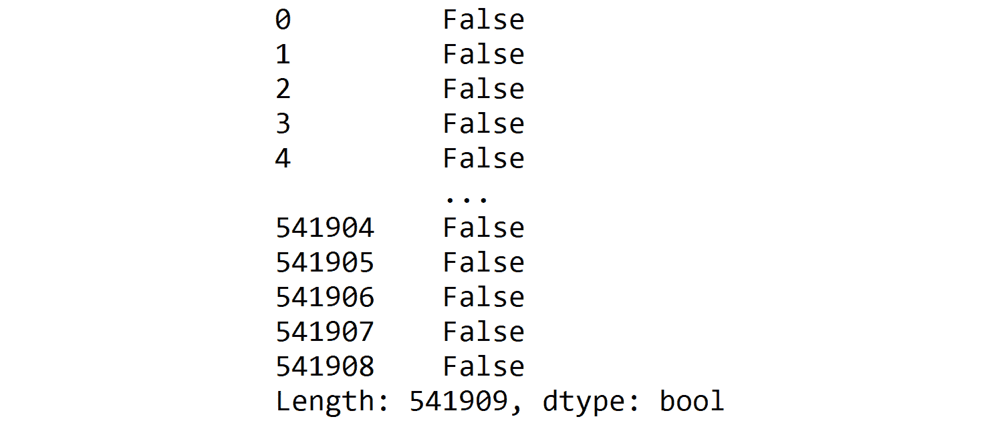
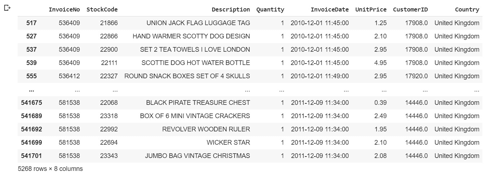
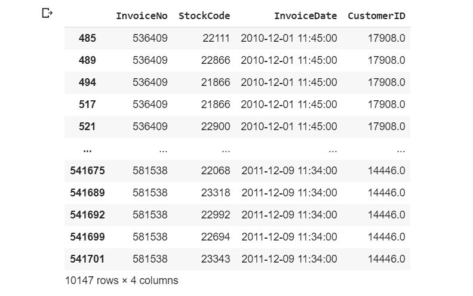

# 11. 数据准备

概述

本章结束时，你将能够根据特定条件筛选 DataFrame；删除重复或无关的记录或列；将变量转换为不同的数据类型；替换列中的值，并处理缺失值和异常值。

本章将介绍你可以用来处理数据问题的主要技术，以便在建模之前实现数据集的高质量。

# 介绍

在上一章中，你看到了了解数据的重要性，并学到了不同的技术和工具来实现这一目标。在对给定的**数据集**进行**探索性数据分析**（**EDA**）时，你可能会发现一些潜在的问题，在建模阶段之前需要解决。正是本章将讨论的内容，你将学习如何处理一些最常见的数据质量问题，并适当准备数据集。

本章将向你介绍在数据科学家职业生涯中经常遇到的一些问题（如**重复行**、错误的数据类型、错误的值和缺失值），并介绍你可以使用的技术来轻松解决这些问题。但要小心——你遇到的一些问题不一定需要修复。你发现的一些可疑或意外值可能在业务角度上是合理的。这些可能是非常罕见但完全真实的值。因此，在修改数据集之前，与你的相关方或数据工程团队确认非常重要。确保你在准备数据集时为业务做出正确的决策是你的责任。

比如，在*第十章*，*数据集分析*中，你查看了*在线零售数据集*，该数据集中`Quantity`列有一些负值。这里我们期望的是只有正值。但在直接解决这个问题（比如删除记录或将其转换为正值）之前，最好先与相关方沟通，确认这些值对于业务来说是否不重要。他们可能会告诉你，这些值非常重要，因为它们代表了退货商品，并且给公司带来了巨大的成本，所以他们希望分析这些情况，以减少这些数字。如果你直接进入数据清洗阶段，你可能会错过这一关键信息，进而得出错误的结论。

# 处理行重复问题

大多数时候，你收到或能访问的数据集可能并非 100%清洁。它们通常存在一些需要修复的问题。其中一个问题可能是行重复。行重复意味着数据集中有几条记录包含完全相同的信息。使用`pandas`包，你可以非常轻松地找到这些情况。

让我们使用在*第十章*中看到的例子，*分析数据集*。

首先**导入**数据集到 DataFrame：

```py
import pandas as pd
file_url = 'https://github.com/PacktWorkshops/'\
           'The-Data-Science-Workshop/blob/'\
           'master/Chapter10/dataset/'\
           'Online%20Retail.xlsx?raw=true'
df = pd.read_excel(file_url)
```

`pandas`的`duplicated()`方法检查行是否为重复项，如果是重复项则返回`True`，否则返回`False`：

```py
df.duplicated()
```

你应该得到如下输出：



](img/B15019_11_01.jpg)

图 11.1：duplicated()方法的输出

注意

本章中的输出已被截断，以便有效地使用页面空间。

在 Python 中，`True`和`False`这两个二进制值分别对应数值 1 和 0。为了找出有多少行被标记为重复项，你可以在`duplicated()`的输出上使用`sum()`方法。这将把所有的 1（即`True`值）加起来，从而给出重复项的数量：

```py
df.duplicated().sum()
```

你应该得到如下输出：

```py
5268
```

由于`duplicated()`方法的输出是一个`pandas`系列，每一行对应一个二进制值，你也可以利用它来对子集化 DataFrame 的行。`pandas`包提供了不同的 API 来对子集化 DataFrame，具体如下：

+   df[<行>或<列>]

+   df.loc[<行>, <列>]

+   df.iloc[<行>, <列>]

第一个 API 通过`InvoiceNo`、`StockCode`、`InvoiceDate`和`CustomerID`对 DataFrame 进行子集化，你需要使用如下代码：

```py
df[['InvoiceNo', 'StockCode', 'InvoiceDate', 'CustomerID']]
```

你应该得到如下输出：


](img/B15019_11_03.jpg)

图 11.2：子集化列

如果你只想过滤掉被认为是重复的行，可以在`duplicated()`方法的输出上使用相同的 API 调用。它将只保留值为**True**的行：

```py
df[df.duplicated()]
```

你应该得到如下输出：



](img/B15019_11_03.jpg)

图 11.3：子集化重复行

如果你想同时对子集化行和列，必须使用其他两个可用的 API 之一：`.loc`或`.iloc`。这两个 API 功能相同，但`.loc`使用标签或名称，而`.iloc`仅接受索引作为输入。你将使用`.loc` API 来子集化重复行，并只保留选定的四列，正如前面的示例所示：

```py
df.loc[df.duplicated(), ['InvoiceNo', 'StockCode', \
                         'InvoiceDate', 'CustomerID']]
```

你应该得到如下输出：


](img/B15019_11_04.jpg)

图 11.4：使用.loc 子集化重复行和选定的列

上述输出显示，前几个重复项的行号分别为`517`、`527`、`537`等。默认情况下，`pandas`不会将重复项的第一次出现标记为重复：所有的重复项除了第一次出现外，其余都会标记为`True`。你可以通过指定`keep`参数来改变这个行为。如果你想保留最后一个重复项，你需要指定`keep='last'`：

```py
df.loc[df.duplicated(keep='last'), ['InvoiceNo', 'StockCode', \
                                    'InvoiceDate', 'CustomerID']]
```

你应该得到如下输出：


](img/B15019_11_05.jpg)

图 11.5：子集化最后的重复行

从前面的输出可以看到，行 `485` 的值与行 `539` 相同。正如预期的那样，行 `539` 不再被标记为重复行。如果你想标记所有重复记录为重复，你需要使用 `keep=False`：

```py
df.loc[df.duplicated(keep=False), ['InvoiceNo', 'StockCode',\
                                   'InvoiceDate', 'CustomerID']]
```

你应该得到以下输出：



图 11.6：获取所有重复行的子集

这次，行 `485` 和 `539` 被标记为重复行。现在你已经知道如何识别重复观察值，你可以决定是否要将它们从数据集中删除。如前所述，修改数据时必须小心。你可能需要向业务方确认，他们是否同意你删除这些数据行。你需要解释为什么要删除这些行。在在线零售数据集中，以行 `485` 和 `539` 为例，这两条记录是完全相同的。从业务角度来看，这意味着一个特定的客户（`CustomerID 17908`）在同一个发票（`InvoiceNo 536409`）上，在完全相同的日期和时间（`InvoiceDate 2010-12-01 11:45:00），购买了相同的商品（`StockCode 22111`）。这非常可疑。在与业务方沟通时，他们可能会告诉你，在那个时候发布了新软件，并且有一个 BUG 导致所有购买的商品都被拆分成单独的行项目。

在这种情况下，你知道不应该删除这些行。另一方面，他们可能会告诉你重复不应该发生，可能是由于人工错误，在数据录入或数据提取步骤中发生了问题。假设确实是这种情况，那么现在可以安全地删除这些行。

为此，你可以使用 `pandas` 的 `drop_duplicates()` 方法。它有与 `duplicated()` 相同的 `keep` 参数，用于指定你希望保留哪个重复记录，或者是否希望删除所有重复记录。在这种情况下，我们希望保留至少一行重复数据。这里，我们希望保留第一次出现的重复行：

```py
df.drop_duplicates(keep='first')
```

你应该得到以下输出：


图 11.7：使用 `keep='first'` 删除重复行

该方法的输出是一个新的 DataFrame，其中包含唯一的记录，只有第一次出现的重复项被保留。如果你希望替换现有的 DataFrame，而不是获得一个新的 DataFrame，则需要使用 `inplace=True` 参数。

`drop_duplicates()` 和 `duplicated()` 方法还有一个非常有用的参数：`subset`。这个参数允许你在查找重复项时指定要考虑的列列表。默认情况下，DataFrame 的所有列都会用来查找重复行。我们来看一下仅查看 `InvoiceNo`、`StockCode`、`invoiceDate` 和 `CustomerID` 列时，有多少重复行：

```py
df.duplicated(subset=['InvoiceNo', 'StockCode', 'InvoiceDate',\
                      'CustomerID'], keep='first').sum()
```

你应该得到以下输出：

```py
10677
```

仅查看这四列，而不是所有列，我们可以看到重复行的数量已从`5268`增加到`10677`。这意味着有些行在这四列的值完全相同，但在其他列的值不同，可能是不同的记录。在这种情况下，最好使用所有列来识别重复记录。

## 练习 11.01：处理乳腺癌数据集中的重复数据

在本练习中，你将学习如何识别重复记录，以及如何处理这些问题，使得数据集仅包含**唯一**记录。让我们开始吧：

注意

我们在本练习中使用的数据集是乳腺癌检测数据集，分享者是来自威斯康星大学医院的 Dr. William H. Wolberg，并由 UCI 机器学习库托管。该数据集的属性信息可以在此找到：[`packt.live/39LaIDx`](https://packt.live/39LaIDx)。

这个数据集也可以在本书的 GitHub 仓库中找到：[`packt.live/2QqbHBC`](https://packt.live/2QqbHBC)。

1.  打开一个新的**Colab**笔记本。

1.  导入`pandas`包：

    ```py
    import pandas as pd
    ```

1.  将`Breast Cancer`数据集的链接赋值给一个名为`file_url`的变量：

    ```py
    file_url = 'https://raw.githubusercontent.com/'\
               'PacktWorkshops/The-Data-Science-Workshop/'\
               'master/Chapter11/dataset/'\
               'breast-cancer-wisconsin.data'
    ```

1.  使用`pandas`包中的`read_csv()`方法，加载数据集到一个名为`df`的新变量，并使用`header=None`参数。我们这么做是因为该文件没有列名：

    ```py
    df = pd.read_csv(file_url, header=None)
    ```

1.  创建一个名为`col_names`的变量，包含列名：`Sample code number, Clump Thickness, Uniformity of Cell Size, Uniformity of Cell Shape, Marginal Adhesion, Single Epithelial Cell Size, Bare Nuclei, Bland Chromatin, Normal Nucleoli, Mitoses` 和 `Class`：

    ```py
    col_names = ['Sample code number','Clump Thickness',\
                 'Uniformity of Cell Size',\
                 'Uniformity of Cell Shape',\
                 'Marginal Adhesion','Single Epithelial Cell Size',\
                 'Bare Nuclei','Bland Chromatin',\
                 'Normal Nucleoli','Mitoses','Class'] 
    ```

1.  使用`columns`属性赋值 DataFrame 的列名：

    ```py
    df.columns = col_names
    ```

1.  使用`.shape`属性显示 DataFrame 的形状：

    ```py
    df.shape
    ```

    你应该得到以下输出：

    ```py
    (699, 11)
    ```

    该 DataFrame 包含`699`行和`11`列。

1.  使用`head()`方法显示 DataFrame 的前五行：

    ```py
    df.head()
    ```

    你应该得到以下输出：

    

    图 11.8：乳腺癌数据集的前五行

    所有变量都是数值型的。样本代码号列是测量样本的标识符。

1.  使用`duplicated()`和`sum()`方法查找重复行的数量：

    ```py
    df.duplicated().sum()
    ```

    你应该得到以下输出：

    ```py
    8
    ```

    通过查看该数据集的 11 列，我们可以看到有`8`行重复数据。

1.  使用`loc()`和`duplicated()`方法显示重复行：

    ```py
    df.loc[df.duplicated()]
    ```

    你应该得到以下输出：

    

    图 11.9：重复记录

    以下行是重复的：`208`、`253`、`254`、`258`、`272`、`338`、`561`和`684`。

1.  如同在*步骤 9*中那样显示重复行，但这次使用`keep='last'`参数：

    ```py
    df.loc[df.duplicated(keep='last')]
    ```

    你应该得到以下输出：

    

    图 11.10：使用 keep='last' 的重复记录

    通过使用`keep='last'`参数，以下行被认为是重复的：`42`，`62`，`168`，`207`，`267`，`314`，`560`，和`683`。通过将这个输出与前一步的输出进行比较，我们可以看到第 253 行和第 42 行是相同的。

1.  使用`drop_duplicates()`方法以及`keep='first'`参数删除重复行，并将其保存到一个名为`df_unique`的新 DataFrame 中：

    ```py
    df_unique = df.drop_duplicates(keep='first')
    ```

1.  使用`.shape`属性显示`df_unique`的形状：

    ```py
    df_unique.shape
    ```

    你应该会得到以下输出：

    ```py
    (691, 11)
    ```

    现在我们已经删除了八条重复记录，剩下的只有`691`行数据。现在，数据集只包含唯一的观察值。

    注意

    若要访问此部分的源代码，请参考[`packt.live/2EiArYI`](https://packt.live/2EiArYI)。

    你还可以在[`packt.live/349tLat`](https://packt.live/349tLat)在线运行这个例子。

在本练习中，你学习了如何识别并删除来自真实世界数据集的重复记录。

# 转换数据类型

你在项目中可能会遇到的另一个问题是某些列的数据类型被错误推断。正如我们在*第十章*《分析数据集》中所看到的，`pandas`包提供了一个非常简单的方法，通过`.dtypes`属性显示每一列的数据类型。你可能会想，`pandas`是什么时候识别每一列的数据类型的？当你使用`read_csv()`、`read_excel()`等方法将数据集加载到`pandas` DataFrame 时，类型就被检测出来了。

完成这些操作后，`pandas`将尽力根据每一列中包含的值自动找出最佳数据类型。让我们看看这个方法在`Online Retail`数据集上的效果。

首先，你必须导入`pandas`：

```py
import pandas as pd
```

然后，你需要将数据集的 URL 赋给一个新变量：

```py
file_url = 'https://github.com/PacktWorkshops/'\
           'The-Data-Science-Workshop/blob/'\
           'master/Chapter10/dataset/'\
           'Online%20Retail.xlsx?raw=true'
```

让我们使用`read_excel()`将数据集加载到`pandas` DataFrame 中：

```py
df = pd.read_excel(file_url)
```

最后，让我们打印每一列的数据类型：

```py
df.dtypes
```

你应该会得到以下输出：


图 11.11：在线零售数据集每列的数据类型

上面的输出显示了每一列被分配的数据类型。`Quantity`、`UnitPrice`和`CustomerID`被识别为数值变量（`int64`、`float64`），`InvoiceDate`是一个`datetime`变量，其他所有列都被认为是文本（`object`）。这并不算太糟糕。`pandas`在识别非文本列方面做得很不错。

但是如果你想改变某些列的数据类型呢？你有两种方法可以实现这一点。

第一种方法是重新加载数据集，但这一次，你需要使用`dtype`参数指定感兴趣列的数据类型。该参数接受一个字典，其中列名作为键，正确的数据类型作为值，例如{'col1': np.float64, 'col2': np.int32}，作为输入。让我们尝试在`CustomerID`上使用这个方法。我们知道它不是一个数值变量，因为它包含唯一的**标识符**（代码）。在这里，我们将把它的数据类型更改为**object**：

```py
df = pd.read_excel(file_url, dtype={'CustomerID': 'category'})
df.dtypes
```

你应该得到如下输出：


图 11.12：转换 CustomerID 后每列的数据类型

如你所见，`CustomerID`的数据类型已成功更改为`category`类型。

现在，让我们看看第二种将单列转换为不同类型的方法。在`pandas`中，你可以使用`astype()`方法，并指定要转换成的新数据类型，作为其`pandas`序列，更准确地说，你需要将其重新赋值给数据框的同一列。例如，如果你想将`InvoiceNo`列更改为分类变量，你可以这样做：

```py
df['InvoiceNo'] = df['InvoiceNo'].astype('category')
df.dtypes
```

你应该得到如下输出：


图 11.13：转换 InvoiceNo 后每列的数据类型

如你所见，`InvoiceNo`的数据类型已更改为分类变量。`object`和`category`的区别在于，后者具有有限的可能值（也叫离散变量）。一旦这些被更改为分类变量，`pandas`将自动列出所有值。你可以通过`.cat.categories`属性访问它们：

```py
df['InvoiceNo'].cat.categories
```

你应该得到如下输出：


图 11.14：InvoiceNo 分类变量的类别（可能值）列表

`pandas`已识别出该列中有 25,900 个不同的值，并列出了所有这些值。根据变量分配的数据类型，`pandas`提供了不同的属性和方法，这些对于数据转换或特征工程非常有用（将在*第十二章*，*特征工程*中讨论）。

最后需要说明的是，你可能会想知道何时使用第一种更改某些列类型的方法（在加载数据集时）。为了找出每个变量的当前类型，你必须先加载数据，那么为什么还需要使用新的数据类型重新加载数据呢？在第一次加载后，使用`astype()`方法来更改类型会更容易。使用它的原因有几个。一个可能的原因是你已经在其他工具中探索了数据集，比如 Excel，并且已经知道正确的数据类型是什么。

第二个原因可能是你的数据集很大，无法一次性加载。如你所见，默认情况下，`pandas` 使用 64 位编码来处理数值变量，这会占用大量内存，可能有些过于浪费。

例如，`Quantity` 列的数据类型是 int64，这意味着可能的值范围是 -9,223,372,036,854,775,808 到 9,223,372,036,854,775,807。然而，在*第十章*，*数据集分析*中分析该列分布时，你了解到该列的值范围仅为 -80,995 到 80,995。你不需要使用如此多的空间。通过将该变量的数据类型从 int64 降级为 int32（范围为 -2,147,483,648 到 2,147,483,647），你可能能够重新加载整个数据集。

## 练习 11.02：为 Ames Housing 数据集转换数据类型

在本练习中，你将通过将变量转换为正确的数据类型来准备数据集。

你将使用 Ames Housing 数据集来完成此任务，我们也在*第十章*，*数据集分析*中使用了该数据集。有关此数据集的更多信息，请参阅以下说明。让我们开始吧：

注意

本练习中使用的数据集是 Ames Housing 数据集，由 Dean De Cock 编制：[`packt.live/2QTbTbq`](https://packt.live/2QTbTbq)。

为了方便，你可以在本书的 GitHub 仓库中找到该数据集：[`packt.live/2ZUk4bz`](https://packt.live/2ZUk4bz)。

1.  打开一个新的 Colab 笔记本。

1.  导入 `pandas` 包：

    ```py
    import pandas as pd
    ```

1.  将 Ames 数据集的链接赋值给一个名为 `file_url` 的变量：

    ```py
    file_url = 'https://raw.githubusercontent.com/'\
               'PacktWorkshops/The-Data-Science-Workshop/'\
               'master/Chapter10/dataset/ames_iowa_housing.csv'
    ```

1.  使用 `pandas` 包的 `read_csv` 方法，将数据集加载到一个名为 `df` 的新变量中：

    ```py
    df = pd.read_csv(file_url)
    ```

1.  使用 `dtypes` 属性打印每一列的数据类型：

    ```py
    df.dtypes
    ```

    你应该得到以下输出：

    

    图 11.15：列及其分配的数据类型列表

    注意

    上面的输出已被截断。

    在*第十章*，*数据集分析*中，你知道 `Id`、`MSSubClass`、`OverallQual` 和 `OverallCond` 列被错误地归类为数值变量。它们有有限数量的唯一值，不能进行任何数学运算。例如，将 `Id` 列中的两个不同值相加、相减、相乘或相除是没有意义的。因此，你需要将它们转换为类别变量。

1.  使用 `astype()` 方法，将 `'Id'` 列转换为类别变量，如下所示：

    ```py
    df['Id'] = df['Id'].astype('category')
    ```

1.  将 `'MSSubClass'`、`'OverallQual'` 和 `'OverallCond'` 列转换为类别变量，就像我们在上一步中做的那样：

    ```py
    df['MSSubClass'] = df['MSSubClass'].astype('category')
    df['OverallQual'] = df['OverallQual'].astype('category')
    df['OverallCond'] = df['OverallCond'].astype('category')
    ```

1.  创建一个 for 循环，遍历四个类别列`('Id', 'MSSubClass', 'OverallQual',` 和 `'OverallCond'`)并使用 `.cat.categories` 属性打印它们的名称和类别：

    ```py
    for col_name in ['Id', 'MSSubClass', 'OverallQual', \
                     'OverallCond']:
        print(col_name)
        print(df[col_name].cat.categories)
    ```

    你应该得到以下输出：

    

    图 11.16：四个新转换变量的类别列表

    现在，这四列已经被转换为类别变量。从*步骤 5*的输出中，我们可以看到有很多`object`类型的变量。让我们看看它们，看看是否也需要转换。

1.  创建一个新的 DataFrame，命名为`obj_df`，该 DataFrame 仅包含`object`类型的变量，使用`select_dtypes`方法并加上`include='object'`参数：

    ```py
    obj_df = df.select_dtypes(include='object')
    ```

1.  创建一个名为`obj_cols`的新变量，包含`obj_df` DataFrame 中列名的列表，使用`.columns`属性并显示其内容：

    ```py
    obj_cols = obj_df.columns
    obj_cols
    ```

    你应该得到以下输出：

    

    图 11.17：“object”类型变量列表

1.  像我们在*步骤 8*中做的那样，创建一个`for`循环，遍历`obj_cols`中包含的列名，并使用`unique()`方法打印它们的名称和唯一值：

    ```py
    for col_name in obj_cols:
        print(col_name)
        print(df[col_name].unique())
    ```

    你应该得到以下输出：

    

    图 11.18：每个“object”类型变量的唯一值列表

    如你所见，所有这些列都包含有限数量的唯一值，且这些值由文本组成，这表明它们是类别变量。

1.  现在，创建一个`for`循环，遍历`obj_cols`中包含的列名，并使用`astype()`方法将每个列转换为类别变量：

    ```py
    for col_name in obj_cols:
        df[col_name] = df[col_name].astype('category')
    ```

1.  打印每一列的数据类型，使用`dtypes`属性：

    ```py
    df.dtypes
    ```

    你应该得到以下输出：

    

图 11.19：变量及其新数据类型的列表

注意

上面的输出已被截断。

要访问此部分的源代码，请参考[`packt.live/2FvR8R6`](https://packt.live/2FvR8R6)。

你也可以在[`packt.live/3aAmKka`](https://packt.live/3aAmKka)上运行此示例。

你已经成功地将具有错误数据类型（数值型或对象型）的列转换为类别变量。你的数据集现在距离准备好进行建模更进一步了。

在下一部分，我们将讨论如何处理错误值。

# 处理错误值

你可能会遇到的另一个问题是数据集中某些观察值的错误值。有时，这是由于语法错误引起的；例如，某个国家的名称可能全为小写、全为大写、标题化（只有第一个字母大写），或者甚至缩写。例如，法国可能会有不同的值，如‘France’，‘FRANCE’，‘france’，‘FR’等。如果你将‘France’定义为标准格式，那么所有其他变体都被认为是数据集中的错误值，并需要修正。

如果这种问题在建模阶段之前没有得到处理，可能会导致错误的结果。模型会认为这些不同的变体是完全不同的值，并可能不太关注这些值，因为它们有独立的频率。例如，假设'France'代表 2%的值，'FRANCE'代表 2%，'FR'代表 1%。你知道这些值对应的是同一个国家，应该代表 5%的值，但模型会把它们当作不同的国家处理。

让我们通过使用`Online Retail`数据集来学习如何在实际生活中检测此类问题。

首先，你需要将数据加载到一个`pandas` DataFrame 中：

```py
import pandas as pd
file_url = 'https://github.com/PacktWorkshops/'\
           'The-Data-Science-Workshop/blob/'\
           'master/Chapter10/dataset/'\
           'Online%20Retail.xlsx?raw=true'
df = pd.read_excel(file_url)
```

在这个数据集中，有两个变量似乎彼此相关：`StockCode` 和 `Description`。第一个包含所售物品的标识代码，另一个包含它们的描述。然而，如果你查看一些例子，比如`StockCode 23131`，`Description`列有不同的值：

```py
df.loc[df['StockCode'] == 23131, 'Description'].unique()
```

你应该得到以下输出：


图 11.20：描述列和库存代码 23131 的唯一值列表

上述输出中有多个问题。一个问题是单词`Mistletoe`拼写错误，变成了`Miseltoe`。其他错误是意外值和缺失值，这些将在下一节中讨论。看来`Description`列被用来记录诸如`had been put aside`的评论。

让我们专注于拼写错误问题。我们需要做的是修改错误的拼写并用正确的值替换它。首先，让我们创建一个名为`StockCodeDescription`的新列，它是`Description`列的完全副本：

```py
df['StockCodeDescription'] = df['Description']
```

你将使用这个新列来修正拼写错误问题。为此，使用你在本章前面学到的子集技巧。你需要使用`.loc`并筛选你想要的行和列，即所有`StockCode == 21131`且`Description == MISELTOE HEART WREATH CREAM`的行，以及`Description`列：

```py
df.loc[(df['StockCode'] == 23131) \
        & (df['StockCodeDescription'] \
           == 'MISELTOE HEART WREATH CREAM'), \
        'StockCodeDescription'] = 'MISTLETOE HEART WREATH CREAM'
```

如果你重新打印这个问题的值，你会看到拼写错误的值已经被修正，不再出现：

```py
df.loc[df['StockCode'] == 23131, 'StockCodeDescription'].unique()
```

你应该得到以下输出：


图 11.21：修正第一个拼写错误问题后的描述列和库存代码 23131 的唯一值列表

如你所见，这个产品仍然有五个不同的值，但其中一个值，即`MISTLETOE`，被拼写错误：`MISELTOE`。

这一次，我们不再查找完全匹配（一个单词必须与另一个单词完全相同），而是查找部分匹配（一个单词的部分内容出现在另一个单词中）。在我们的例子中，我们将不再查找`MISELTOE`的拼写，而只查找`MISEL`。`pandas`包提供了一种名为`.str.contains()`的方法，我们可以使用它来查找与给定表达式部分匹配的观察值。

让我们使用这个方法来查看整个数据集中是否有相同的拼写错误问题（`MISEL`）。由于此方法无法处理缺失值，你需要添加一个额外的参数。此外，你还需要筛选出`Description`列中没有缺失值的行。这可以通过向`.str.contains()`方法提供`na=False`参数来实现：

```py
df.loc[df['StockCodeDescription']\
  .str.contains('MISEL', na=False),]
```

你应该得到以下输出：


图 11.22：显示所有包含拼写错误'MISELTOE'的行

这个拼写错误问题（`MISELTOE`）不仅与`StockCode 23131`相关，还涉及其他项目。你需要使用`str.replace()`方法修复所有这些问题。该方法接受两个参数：需要替换的字符字符串和替换字符串：

```py
df['StockCodeDescription'] = df['StockCodeDescription']\
                             .str.replace\
                             ('MISELTOE', 'MISTLETOE')
```

现在，如果你打印出所有包含拼写错误`MISEL`的行，你将看到这些行已经不存在了：

```py
df.loc[df['StockCodeDescription']\
  .str.contains('MISEL', na=False),]
```

你应该得到以下输出：


图 11.23：清理后显示所有包含拼写错误 MISELTOE 的行

你刚刚看到如何轻松清理数据中包含错误值的观察值，方法是使用`pandas`包提供的`.str.contains`和`.str.replace()`方法。这些方法只能用于包含字符串的变量，但相同的逻辑也可以应用于数值变量，并且可以用来处理极端值或异常值。你可以使用==、>、<、>=或<=运算符来筛选你想要的行，然后将观察值替换为正确的值。

## 练习 11.03：修复 State 列中的错误值

在这个练习中，你将通过列出所有美国的财务官员来清理数据集中`State`变量的值。我们之所以这样做，是因为数据集中包含一些错误的值。让我们开始吧：

注意：

原始数据集由 Forest Gregg 和 Derek Eder 共享，可以在[`packt.live/2rTJVns`](https://packt.live/2rTJVns)找到。

我们在这里使用的修改版数据集可以在本书的 GitHub 仓库中找到：[`packt.live/2MZJsrk`](https://packt.live/2MZJsrk)。

1.  打开一个新的 Colab 笔记本。

1.  导入`pandas`包：

    ```py
    import pandas as pd
    ```

1.  将数据集链接赋值给一个名为`file_url`的变量：

    ```py
    file_url = 'https://raw.githubusercontent.com/'\
               'PacktWorkshops/The-Data-Science-Workshop/'\
               'master/Chapter11/dataset/officers.csv'
    ```

1.  使用`pandas`包中的`read_csv()`方法，将数据集加载到一个名为`df`的新变量中：

    ```py
    df = pd.read_csv(file_url)
    ```

1.  使用 `.head()` 方法打印出数据框的前五行：

    ```py
    df.head()
    ```

    你应该得到以下输出：

    

    图 11.24：财务官员数据集的前五行

1.  打印出 `State` 变量的所有唯一值：

    ```py
    df['State'].unique()
    ```

    你应该得到以下输出：

    

    图 11.25：State 列中唯一值的列表

    所有州的值都已编码为两位大写字符格式。如你所见，有些值是错误的，如 `il` 和 `iL`（看起来像是 Illinois 的拼写错误），还有一些意外的值，如 `8I`、`I` 和 `60`。在接下来的几步中，你将解决这些问题。

1.  使用 `pandas` 的 `.str.contains()` 方法和子集 API 打印出 `State` 列中包含 `il` 值的行，即 DataFrame [条件]。你还需要在 `str.contains()` 中将 `na` 参数设置为 `False`，以排除缺失值的观测：

    ```py
    df[df['State'].str.contains('il', na=False)]
    ```

    你应该得到以下输出：

    

    图 11.26：具有 il 值的观测

    如你所见，所有具有 `il` 值的城市都来自伊利诺伊州。因此，正确的 `State` 值应为 `IL`。你可能会认为以下值也指向伊利诺伊州：`Il`、`iL` 和 `Il`。我们接下来将查看它们。

1.  现在，创建一个 `for` 循环，迭代 `State` 列中的以下值：`Il`、`iL`、`Il`。然后，使用 `pandas` 的子集方法打印出 City 和 State 变量的值，即 `.loc()`：DataFrame.loc[行条件，列条件]。对每个观测值执行此操作：

    ```py
    for state in ['Il', 'iL', 'Il']:
        print(df.loc[df['State'] == state, ['City', 'State']])
    ```

    你应该得到以下输出：

    

    图 11.27：具有 il 值的观测

    注意

    前面的输出已被截断。

    如你所见，这些城市都属于伊利诺伊州。我们将用正确的值替换它们。

1.  创建一个条件掩码（`il_mask`），使用 `isin()` 方法和这些值的列表作为参数，筛选出包含四个错误值（`il`、`Il`、`iL` 和 `Il`）的所有行。然后，将结果保存在一个名为 `il_mask` 的变量中：

    ```py
    il_mask = df['State'].isin(['il', 'Il', 'iL', 'Il'])
    ```

1.  使用 `.sum()` 方法打印出与我们在 `il_mask` 中设置的条件匹配的行数。这将对所有值为 `True`（匹配条件）的行进行求和：

    ```py
    il_mask.sum()
    ```

    你应该得到以下输出：

    ```py
    672
    ```

1.  使用 `pandas` 的 `.loc()` 方法，筛选出符合 `il_mask` 条件的行，并将 `State` 列的值替换为 `IL`：

    ```py
    df.loc[il_mask, 'State'] = 'IL'
    ```

1.  再次打印出 `State` 变量的所有唯一值：

    ```py
    df['State'].unique()
    ```

    你应该得到以下输出：

    

    ```py
    df.loc[df['State'] == 'II',]
    ```

    你应该得到以下输出：

    

    图 11.29：在 State 列中筛选出值为 IL 的行

    `State`列中仅有两个地方使用了`II`值，且这两个地方的城市都是 Bloomington，位于伊利诺伊州。此处，正确的`State`值应该是`IL`。

1.  现在，创建一个`for`循环，迭代三个不正确的值（`I`、`8I`和`60`），并使用我们在*步骤 12*中使用的相同逻辑输出子集行。只显示`City`和`State`列：

    ```py
    for val in ['I', '8I', '60']:
        print(df.loc[df['State'] == val, ['City', 'State']])
    ```

    你应该得到以下输出：

    

    图 11.30：包含不正确值（I、8I 和 60）的观测

    所有包含不正确值的观测都是位于伊利诺伊州的城市。让我们现在修复它们。

1.  创建一个`for`循环，迭代四个不正确的值（`II`、`I`、`8I`和`60`），并重新使用*步骤 12*中的子集逻辑将`State`中的值替换为`IL`：

    ```py
    for val in ['II', 'I', '8I', '60']:
        df.loc[df['State'] == val, 'State'] = 'IL'
    ```

1.  输出所有`State`变量的唯一值：

    ```py
    df['State'].unique()
    ```

    你应该得到以下输出：

    

    图 11.31：State 列的唯一值列表

    你已经修复了伊利诺伊州的状态问题。然而，在这一列中还有两个不正确的值：`In`和`ng`。

1.  重复*步骤 13*，但改为迭代`In`和`ng`值：

    ```py
    for val in ['In', 'ng']:
        print(df.loc[df['State'] == val, ['City', 'State']])
    ```

    你应该得到以下输出：

    

    图 11.32：包含不正确值（In，ng）的观测

    在`State`中具有`ng`值的行缺少值。我们将在下一部分中讨论这个话题。`State`为`In`的观测是印第安纳州的一个城市，所以正确的值应该是`IN`。让我们修正它。

1.  使用`.loc()`和`.str.contains()`方法筛选出`State`中包含`In`值的行，并将州值替换为`IN`。别忘了为`.str.contains()`指定`na=False`参数：

    ```py
    df.loc[df['State']\
      .str.contains('In', na=False), 'State'] = 'IN'
    ```

    输出所有`State`变量的唯一值：

    ```py
    df['State'].unique()
    ```

    你应该得到以下输出：

    

图 11.33：State 列的唯一值列表

注意

要访问此特定部分的源代码，请参考[`packt.live/319pfGX`](https://packt.live/319pfGX)。

你也可以在线运行这个例子，网址为[`packt.live/2E8ICHn`](https://packt.live/2E8ICHn)。

你刚刚使用`pandas`包提供的方法修复了`State`变量中的所有不正确值。在下一部分，我们将讨论如何处理缺失值。

# 处理缺失值

到目前为止，你已经看到了数据集中的各种问题。现在是时候讨论另一个经常发生的问题：缺失值。如你所料，这类问题意味着某些变量的某些值缺失。

`pandas`包提供了一个方法，我们可以用它来识别 DataFrame 中的缺失值：`.isna()`。我们来看一下它在`Online Retail`数据集上的应用。首先，你需要导入`pandas`并将数据加载到 DataFrame 中：

```py
import pandas as pd
file_url = 'https://github.com/PacktWorkshops/'\
           'The-Data-Science-Workshop/blob/'\
           'master/Chapter10/dataset/'\
           'Online%20Retail.xlsx?raw=true'
df = pd.read_excel(file_url)
```

`.isna()`方法返回一个`pandas`系列，表示 DataFrame 中每个单元格的二进制值，指出它是否缺少值（`True`）或者不缺少值（`False`）：

```py
df.isna()
```

你应该得到以下输出：


图 11.34：`.isna()`方法的输出

正如我们之前看到的，我们可以将一个二元变量的输出传递给`.sum()`方法，它会将所有的`True`值加在一起（具有缺失值的单元格），并为每一列提供一个总结：

```py
df.isna().sum()
```

你应该得到以下输出：


图 11.35：每个变量的缺失值总结

正如你所看到的，`Description`列中有`1454`个缺失值，而`CustomerID`列中有`135080`个缺失值。让我们来看一下`Description`中缺失值的观测。你可以使用`.isna()`方法的输出来提取缺失值的行：

```py
df[df['Description'].isna()]
```

你应该得到以下输出：


图 11.36：提取具有缺失值的描述行

从上面的输出中，你可以看到所有缺失值的行，`unit price`（单价）都是`0.0`，并且缺失了`CustomerID`列。在实际项目中，你需要与业务方讨论这些情况，检查这些交易是否真实。如果业务方确认这些观测数据无关，那么你需要从数据集中删除它们。

`pandas`包提供了一个方法，我们可以用它轻松地删除缺失值：`.dropna()`。这个方法会返回一个没有缺失值的 DataFrame。默认情况下，它会查看所有列。你可以使用`subset`参数指定一个列列表，让它去查找：

```py
df.dropna(subset=['Description'])
```

这个方法会返回一个新的 DataFrame，其中指定的列没有缺失值。如果你希望直接替换原始数据集，可以使用`inplace=True`参数：

```py
df.dropna(subset=['Description'], inplace=True)
```

现在，来看一下每个变量的缺失值总结：

```py
df.isna().sum()
```

你应该得到以下输出：


图 11.37：每个变量的缺失值总结

正如你所看到的，`Description`列中不再有缺失值。让我们看一下`CustomerID`列：

```py
df[df['CustomerID'].isna()]
```

你应该得到以下输出：


](img/B15019_11_41.jpg)

图 11.38：缺失值的 CustomerID 行

这次，所有交易看起来都正常，只是`CustomerID`列缺失值；其他所有变量都已填充了看起来合理的值。无法推断`CustomerID`列的缺失值。这些行占数据集的约 25%，因此不能将它们删除。

然而，大多数算法要求每个观察值都有一个值，因此你需要为这些情况提供一个值。我们将使用`pandas`的`.fillna()`方法来做到这一点。将填充的值设置为`Missing`，并将`inplace=True`作为参数：

```py
df['CustomerID'].fillna('Missing', inplace=True)
df[1443:1448]
```

你应该得到以下输出：


已被替换为 Missing

](img/B15019_11_39.jpg)

图 11.39：缺失值的 CustomerID 已被替换为 Missing 的行示例

让我们检查数据集中是否有缺失值：

```py
df.isna().sum()
```

你应该得到以下输出：


](img/B15019_11_40.jpg)

图 11.40：各变量缺失值的总结

你已成功修复了数据集中所有缺失的值。这些方法同样适用于处理缺失的数值变量。我们将在接下来的练习中讨论这一点。当你想要使用`.fillna()`填充缺失值时，只需提供一个数值。

## 练习 11.04：修复马匹肠绞痛数据集中的缺失值

在本练习中，你将清理`马匹肠绞痛`数据集中所有数值变量的缺失值。

肠绞痛是马匹可能遭受的一种疼痛情况，这个数据集包含了与该疾病的特定病例相关的各种信息。如果你想了解更多关于数据集属性的信息，可以使用“注”部分提供的链接。让我们开始吧：

注

该数据集来自 UCI 机器学习库。关于属性的信息可以在[`packt.live/2MZwSrW`](https://packt.live/2MZwSrW)找到。

为了方便你，我们将在本练习中使用的数据集文件已经上传到本书的 GitHub 仓库：[`packt.live/35qESZq`](https://packt.live/35qESZq)。

1.  打开一个新的 Colab 笔记本。

1.  导入`pandas`包：

    ```py
    import pandas as pd
    ```

1.  将数据集的链接赋值给名为`file_url`的变量：

    ```py
    file_url = 'http://raw.githubusercontent.com/'\
               'PacktWorkshops/The-Data-Science-Workshop/'\
               'master/Chapter11/dataset/horse-colic.data'
    ```

1.  使用`pandas`包中的`.read_csv()`方法，将数据集加载到一个名为`df`的新变量中，并指定`header=None`、`sep='\s+'`和`prefix='X'`参数：

    ```py
    df = pd.read_csv(file_url, header=None, \
                     sep='\s+', prefix='X')
    ```

1.  使用`.head()`方法打印数据框的前五行：

    ```py
    df.head()
    ```

    你应该得到以下输出：

    

    ](img/B15019_11_41.jpg)

    图 11.41：马匹肠绞痛数据集的前五行

    如你所见，作者使用了`?`字符表示缺失值，但`pandas`包认为这只是一个正常值。你需要将它们转换为缺失值。

1.  使用`.read_csv()`方法将数据集重新加载到`pandas`数据框中，但这次需要添加`na_values='?'`参数，指定将此值视为缺失值：

    ```py
    df = pd.read_csv(file_url, header=None, sep='\s+', \
                     prefix='X', na_values='?')
    ```

1.  使用`.head()`方法打印数据框的前五行：

    ```py
    df.head()
    ```

    你应该得到以下输出：

    

    图 11.42：马疝气数据集的前五行

    现在，你可以看到`pandas`已将所有`?`值转换为缺失值。

1.  使用`dtypes`属性打印每列的数据类型：

    ```py
    df.dtypes
    ```

    你应该得到以下输出：

    

    图 11.43：每列的数据类型

1.  通过结合`.isna()`和`.sum()`方法，打印每列的缺失值数量：

    ```py
    df.isna().sum()
    ```

    你应该得到以下输出：

    

    图 11.44：每列的缺失值数量

1.  创建一个名为`x0_mask`的条件掩码，这样你就可以使用`.isna()`方法找到`X0`列中的缺失值：

    ```py
    x0_mask = df['X0'].isna()
    ```

1.  使用`.sum()`方法对`x0_mask`显示此列的缺失值数量：

    ```py
    x0_mask.sum()
    ```

    你应该得到以下输出：

    ```py
    1
    ```

    这里，你得到了与*步骤 9*中`X0`相同的缺失值数量。

1.  使用`.median()`方法提取`X0`的均值，并将其存储在名为`x0_median`的新变量中。打印其值：

    ```py
    x0_median = df['X0'].median()
    print(x0_median)
    ```

    你应该得到以下输出：

    ```py
    1.0
    ```

    这个列的中位数值是`1`。你将用这个值替换`X0`列中的所有缺失值。

1.  使用`.fillna()`方法和`inplace=True`参数，用中位数值替换`X0`变量中的所有缺失值：

    ```py
    df['X0'].fillna(x0_median, inplace=True)
    ```

1.  通过结合`.isna()`和`.sum()`方法，打印`X0`的缺失值数量：

    ```py
    df['X0'].isna().sum()
    ```

    你应该得到以下输出：

    ```py
    0
    ```

    变量中不再有缺失值。

1.  创建一个`for`循环，遍历数据框中的所有列。在循环中，计算每列的中位数，并将其保存到一个名为`col_median`的变量中。然后，使用`.fillna()`方法以及`inplace=True`参数，用这个中位数值填充缺失值，并打印列名及其中位数值：

    ```py
    for col_name in df.columns:
        col_median = df[col_name].median()
        df[col_name].fillna(col_median, inplace=True)
        print(col_name)
        print(col_median)
    ```

    你应该得到以下输出：

    

    图 11.45：每列的中位数值

1.  通过结合`.isna()`和`.sum()`方法，打印每列的缺失值数量：

    ```py
    df.isna().sum()
    ```

    你应该得到以下输出：

    

图 11.46：每列的缺失值数量

注意

要访问此部分的源代码，请参考 [`packt.live/34c1zUd`](https://packt.live/34c1zUd)。

你也可以在 [`packt.live/324mHt0`](https://packt.live/324mHt0) 上在线运行这个示例。

你已经成功地使用 `pandas` 包提供的方法 `.isna()` 和 `.fillna()` 修复了所有数值变量的缺失值。

## 活动 11.01：准备快速约会数据集

作为一名企业家，你计划推出一款新的约会应用程序。你的应用与其他竞争对手的主要区别将是你高效的用户匹配算法。在构建这个模型之前，你与一家快速约会公司合作，从真实活动中收集数据。你刚刚收到了合作伙伴公司提供的数据集，但你意识到数据并不像你预期的那样干净；存在缺失和错误的值。你的任务是修复该数据集中主要的数据质量问题。

以下步骤将帮助你完成此活动：

1.  使用 `.read_csv()` 下载并加载数据集到 Python 中。

1.  使用 `.shape` 打印出 DataFrame 的维度。

1.  使用 `.duplicated()` 和 `.sum()` 检查所有列的重复行。

1.  使用 `.duplicated()` 和 `.sum()` 检查标识符列（`iid`、`id`、`partner` 和 `pid`）的重复行。

1.  检查以下数值变量是否有意外值：`'imprace'`, `'imprelig'`, `'sports'`, `'tvsports'`, `'exercise'`, `'dining'`, `'museums'`, `'art'`, `'hiking'`, `'gaming'`, `'clubbing'`, `'reading'`, `'tv'`, `'theater'`, `'movies'`, `'concerts'`, `'music'`, `'shopping'` 和 `'yoga'`。

1.  替换已识别的错误值。

1.  使用 `.dtypes` 检查不同列的数据类型。

1.  使用 `.astype()` 将不包含数值的列的数据类型更改为分类数据类型。

1.  使用 `.isna()` 和 `.sum()` 检查每个数值变量的缺失值。

1.  使用 `.fillna()`、`.mean()` 和 `.median()` 替换每个数值变量的缺失值，填充为相应的均值或中位数值。

    注意

    本活动的数据集可以在本书的 GitHub 仓库中找到：[`packt.live/36u0jtR`](https://packt.live/36u0jtR)。

    原始数据集由哥伦比亚商学院的 Ray Fisman 和 Sheena Iyengar 分享：[`packt.live/2Fp5rUg`](https://packt.live/2Fp5rUg)。

    作者提供了一份非常有用的文档，描述了数据集及其特征：[`packt.live/2Qrp7gD`](https://packt.live/2Qrp7gD)。

你应该得到以下输出。该图表示具有意外值的 `imprace` 行数以及意外值的列表：


图 11.47：具有意外值的 `imprace` 行数和意外值的列表。

下图展示了具有意外值的行数以及每列意外值的列表：


图 11.48：具有意外值的行数以及每列意外值的列表

下图展示了游戏的唯一值列表：


图 11.49：游戏的唯一值列表

下图展示了每列的数据类型：


图 11.50：每列的数据类型

下图显示了每列的更新数据类型：


图 11.51：每列的数据类型

下图显示了数值变量的缺失值数量：


图 11.52：数值变量的缺失值数量

下图显示了 `int_corr` 的唯一值列表：


图 11.53：'int_corr' 的唯一值列表

下图显示了数值变量的唯一值列表：


图 11.54：数值变量的唯一值列表

下图显示了数值变量的缺失值数量：


图 11.55：数值变量的缺失值数量

注意

此活动的解决方案可以在以下地址找到：[`packt.live/2GbJloz`](https://packt.live/2GbJloz)。

# 总结

在本章中，你了解了准备给定数据集并修复其主要质量问题的重要性。这一点至关重要，因为数据集越干净，任何机器学习模型就越容易学到相关的模式。更重要的是，大多数算法无法处理缺失值等问题，因此必须在建模阶段之前解决这些问题。在本章中，你涵盖了数据科学项目中最常遇到的问题：重复行、错误的数据类型、意外值和缺失值。

本章的目标是向您介绍一些概念，这些概念将帮助您发现一些问题并轻松修复它们，从而拥有基本工具箱，可以处理其他情况。最后需要注意的是，在本章的整个过程中，我们强调了与您所在的业务或数据工程团队讨论发现的问题的重要性。例如，如果您在数据集中检测到意外的值，您可能希望在删除或替换它们之前确认它们在业务上是否具有特殊意义。

在修复问题时，您还需要非常小心：您不希望过度修改数据集，以免产生额外的意外模式。这正是为什么建议您用**平均值**或**中位数**替换数值变量中的任何缺失值。否则，您将会大幅改变其分布。例如，如果某个变量的值在 0 到 10 之间，将所有缺失值替换为-999 将极大地改变它们的平均值和**标准** **偏差**。

在下一章中，我们将讨论特征工程这一有趣的主题。
