# 使用机器学习的文本增强

使用**机器学习**（**ML**）的文本增强是一种比我们在上一章中介绍的标准文本增强方法更为先进的技术。具有讽刺意味的是，文本增强旨在提高机器学习模型的准确性，但我们使用了一个预训练的机器学习模型来创建额外的训练 NLP 数据。这是一个循环过程。本书不涉及机器学习编程，但理解使用库与使用机器学习进行文本增强之间的区别是非常有益的。

增强库，无论是用于图像、文本还是音频，都会遵循传统的编程方法论，包含结构化数据、循环和条件语句。例如，如在*第五章*中所示，实施`_print_aug_reserved()`方法的伪代码可能如下所示：

```py
# define synonym words, pseudo-code
reserved = [['happy', 'joyful', 'cheerful'],
  ['sad', 'sorrowful', 'regretful']]
# substitute the word with its synonym, pseudo-code
for i, word in (input_text)
  for set_word in (reserved)
    for i, syn in set_word
      if (syn == word)
        input_text[i] = set_word[i+1]
```

正常路径的代码未覆盖错误检查，但重点是该库的功能遵循标准的顺序编码方法。

另一方面，机器学习基于 13 种已知的机器学习算法之一，包括`_print_aug_reserved()`伪代码算法。

以下是用于图像分类的深度学习（DL）架构表示。它展示了过程化方法与神经网络算法之间的区别。此图是通过**Latex**和**Overleaf**云系统创建的，输出结果如下：


图 6.1 – 深度学习模型的表示

Overleaf 项目及其代码来自 Duc Haba 先生的公开代码库，网址为[`www.overleaf.com/project/6369a1eaba583e7cd423171b`](https://www.overleaf.com/project/6369a1eaba583e7cd423171b)。你可以克隆并修改代码以展示其他 AI 模型。

本章将介绍使用机器学习的文本增强，特别是以下主题：

+   机器学习模型

+   词汇增强

+   句子增强

+   真实世界的 NLP 数据集

+   通过 Python 笔记本强化你的学习

让我们简要描述在 Python 包装函数代码中使用的机器学习模型。

# 机器学习模型

本章中，文本增强包装函数使用机器学习生成新的文本，用于训练机器学习模型。理解这些模型是如何构建的并不在本书范围内，但对这些机器学习模型及其算法的简要描述是必要的。Python 包装函数将在后台使用以下机器学习模型：

+   Tomáš Mikolov 于 2013 年发布了一个名为**Word2Vec**的神经网络 NLP 算法。该模型可以根据输入文本提议同义词。

+   **全局词向量表示**（**GloVe**）算法由 Jeffrey Pennington、Richard Socher 和 Christopher D. Manning 于 2014 年创建。它是一种无监督学习的自然语言处理（NLP）算法，用于将词语表示为向量格式。其结果是一个线性算法，能够将最接近的相邻词汇聚集在一起。

+   **Wiki-news-300d-1M** 是一个预训练的机器学习模型，使用了**fastText**开源库。它是基于维基百科 2017 年文章中的 100 万个单词、UMBC WebBase 语料库（包含超过 30 亿个单词）和 Statmt.org 新闻数据集（包含超过 160 亿个词元）进行训练的。T. Mikolov、E. Grave、P. Bojanowski、C. Puhrsch 和 A. Joulin 在他们的论文《*预训练分布式词表示的进展*》中介绍了**Wiki-news-300d-1M**。该模型的许可协议为 Creative Commons Attribution-Share-Alike License 3.0。

+   **GoogleNews-vectors-negative300** 是一个预训练的**Word2Vec**模型，使用了包含约 1000 亿个单词和 300 个维度的 Google 新闻数据集。

+   Google 于 2017 年推出了**transformer**神经网络算法。近期自然语言处理和计算机视觉领域的前沿突破均来源于该变换器模型。

+   **BERT** 模型由 Jacob Devlin、Ming-Wei Chang、Kenton Lee 和 Kristina Toutanova 于 2018 年提出，专门用于语言推理和预测。

+   **RoBERTa** 是一种优化过的自监督自然语言处理模型算法，建立在 BERT 的基础上。它在许多自然语言处理推理任务中表现优异。Meta AI 于 2019 年发布了 RoBERTa。

+   Facebook 的**wmt19-en-de**和**wmt19-de-en**是来自*HuggingFace*的预训练自然语言处理模型，用于从英语翻译到德语（Deutsch）并相互转换。该模型于 2021 年公开发布。

+   Facebook 的**wmt19-en-ru**和**wmt19-ru-en**是来自*HuggingFace*的预训练自然语言处理模型，用于从英语翻译到俄语（Русский）并相互转换。该模型于 2021 年公开发布。

+   **XLNet** 是一个基于 transformer-XL 的预训练模型，由 Zhilin Yang、Zihang Dai、Yiming Yang、Jaime Carbonell、Russ R. Salakhutdinov 和 Quoc V. Le 于 2021 年在*HuggingFace*上公开发布。该模型在学术论文《*XLNet: 用于语言理解的广义自回归预训练*》中进行了介绍。

+   **生成式预训练变换器 2**（**GPT-2**）算法是一个开源 AI 模型，由 OpenAI 于 2019 年发布。该模型在生成反馈问题与答案以及文章文本摘要方面表现出色，且与人类写作水平相当。

+   **T5** 和 **T5X** 模型使用文本到文本的变换器算法。它们是基于庞大的语料库进行训练的。Colin Raffel、Noam Shazeer、Adam Roberts、Katherine Lee、Sharan Narang、Michael Matena、Yanqi Zhou、Wei Li 和 Peter J. Liu 在 2020 年的论文《*探索统一文本到文本变换器的迁移学习极限*》中介绍了 T5。

有趣的事实

生成式人工智能，当使用变换器模型时，例如 OpenAI 的 GPT-3、GPT-4 或 Google Bard，能够写出与人类作家一样好的内容，甚至更好。

现在我们了解了一些机器学习模型，接下来我们来看看哪些增强功能使用了哪些机器学习模型。

# 词汇增强

在这一章中，词语增强技术类似于*第五章*中的方法，该方法使用了**Nlpaug**库。不同之处在于，包装函数使用强大的机器学习模型来实现显著的效果，而非 Python 库。有时，输出或重写的文本与人类写作非常相似。

具体来说，你将学习四种新技术，每种技术有两种变体。让我们从 Word2Vec 开始：

+   **Word2Vec**方法使用神经网络 NLP Word2Vec 算法和 GoogleNews-vectors-negative300 预训练模型。Google 使用包含约 1000 亿个单词和 300 维度的大型语料库进行了训练。替换和插入是两种模式变体。

+   **BERT**方法使用 Google 的 Transformer 算法和 BERT 预训练模型。替换和插入是两种模式变体。

+   **RoBERTa**方法是 BERT 模型的一种变体。替换和插入是两种模式变体。

+   在本章中，我们将介绍的最后一种词语增强技术是使用 Facebook（Meta）的预训练翻译模型进行**反向翻译**。它将输入的英文文本翻译成另一种语言，然后再翻译回英文。我们将研究的两种变体涉及将英文翻译成德语（Deutsch），然后再翻译回英文，使用的是**facebook/wmt19-en-de**和**facebook/wmt19-de-en**模型；将英文翻译成俄语（Русский），然后再翻译回英文，使用的是**facebook/wmt19-en-ru**和**facebook/wmt19-ru-en**模型。

通过查看词语包装函数的输出，这将更容易理解，但在此之前，我们先来描述句子增强。

# 句子增强

在句子级别进行增强是一个强大的概念，5 年前这是无法实现的。你必须在机器学习研究公司工作，或者是亿万富翁，才能访问这些著名的预训练模型。某些 Transformer 和**大型语言模型**（**LLMs**）在 2019 和 2020 年作为开源发布，但它们通常用于研究。当时，方便通过 GPU 访问在线 AI 服务器并不普及。LLM 和预训练模型最近才开始向公众开放，可以将它们集成到你的项目中，如 HuggingFace 网站。重要的是，对于独立研究人员或学生来说，LLM 和预训练模型直到 2021 年中才开始变得可访问。

使用机器学习的句子和词语增强方法不能像使用**Nlpaug**库的方法那样动态进行。换句话说，你必须将增强后的文本写入并保存到本地或云端磁盘空间。其主要原因是每个训练周期的增强步骤所需时间过长。优点是，你可以将原始文本的大小增加 20 到 100 倍。

具体来说，我们将介绍以下技术：

+   使用**T5** NLP 算法进行文本摘要。

+   **顺序**和**有时**是两种句子流方法。这些流方法结合了 **GloVe** 和 **BERT** NLP 算法。

对于句子增强技术，通过使用真实世界的 NLP 数据集作为输入文本并查看包装函数的输出，更容易理解这些技术。因此，接下来的部分将介绍如何用 Python 代码编写包装函数来深入了解句子增强，但首先，让我们下载真实世界的 NLP 数据集。

# 真实世界的 NLP 数据集

本章将使用与**第五章**相同的 Netflix 和 Twitter 真实世界 NLP 数据集。此外，两个数据集已经经过审核、清洗，并存储在本书 GitHub 仓库中的 `pluto_data` 目录中。启动过程与前几章相似，步骤如下：

1.  克隆 Python Notebook 和 Pluto。

1.  验证 Pluto。

1.  定位 NLP 数据。

1.  将数据加载到 pandas。

1.  查看数据。

让我们从 Python Notebook 和 Pluto 开始。

## Python Notebook 和 Pluto

首先将 `data_augmentation_with_python_chapter_6.ipynb` 文件加载到 Google Colab 或您选择的 Jupyter Notebook 或 JupyterLab 环境中。从这一点开始，我们将仅显示代码片段。完整的 Python 代码可以在 Python Notebook 中找到。

下一步是克隆仓库。我们将重用**第五章**的代码。使用 `!git` 和 `%run` 语句来实例化 Pluto：

```py
# clone Packt GitHub repo.
!git clone 'https://github.com/PacktPublishing/Data-Augmentation-with-Python'
# Instantiate Pluto
%run 'Data-Augmentation-with-Python/pluto/pluto_chapter_5.py'
```

输出如下：

```py
---------------------------- : ----------------------------
                        Hello from class : <class '__main__.PacktDataAug'> Class: PacktDataAug
                                     Code name : Pluto
                                     Author is : Duc Haba
---------------------------- : ----------------------------
```

接下来的设置步骤是检查 Pluto 是否正确加载。

## 验证

以下命令要求 Pluto 显示他的状态：

```py
# Am I alive?
pluto.say_sys_info()
```

输出将如下所示，具体取决于您的系统：

```py
---------------------------- : ----------------------------
                 System time : 2022/11/09 05:31
                    Platform : linux
     Pluto Version (Chapter) : 5.0
             Python (3.7.10) : actual: 3.7.15 (default, Oct 12 2022, 19:14:55) [GCC 7.5.0]
            PyTorch (1.11.0) : actual: 1.12.1+cu113
              Pandas (1.3.5) : actual: 1.3.5
                 PIL (9.0.0) : actual: 7.1.2
          Matplotlib (3.2.2) : actual: 3.2.2
                   CPU count : 12
                  CPU speed : NOT available
---------------------------- : ----------------------------
```

Pluto 显示他来自**第五章**（版本 5.0），这是正确的。此外，清洗后的 NLP Twitter 和 Netflix 数据集已存储在 `~/``Data-Augmentation-with-Python/pluto_data` 目录中。

## 真实世界的 NLP 数据

Pluto 正在使用来自**第五章**的干净版本数据，这些数据没有脏话。它们是来自 Kaggle 网站的 Netflix 和 Twitter NLP 数据集。清洗后的数据集已经保存在本书的 GitHub 仓库中。因此，Pluto 不需要再次下载它们。不过，您仍然可以通过 `fetch_kaggle_dataset()` 函数下载它们或其他真实世界数据集。Pluto 使用以下命令来定位已清洗的 NLP 数据集：

```py
# check to see the files are there
f = 'Data-Augmentation-with-Python/pluto_data'
!ls -la {f}
```

输出如下：

```py
drwxr-xr-x 2 root root    4096 Nov 13 06:07 .
drwxr-xr-x 6 root root    4096 Nov 13 06:07 ..
-rw-r--r-- 1 root root 3423079 Nov 13 06:07 netflix_data.csv
-rw-r--r-- 1 root root 6072376 Nov 13 06:07 twitter_data.csv
```

有趣的事实

Pluto 变懒了，他没有使用 Python 库和用 Python 编码，而是通过下达 Linux Bash 命令行代码作弊。感叹号字符 (`!`) 允许 Python Notebook 后门进入内核，例如在 Linux 上使用 `!ls -la` 或在 Windows 上使用 `!dir`。您可以使用任何操作系统的命令行代码。但这不是可移植的代码，因为 Windows、iOS、Linux、Android 等操作系统（支持 Safari、Chrome、Edge 和 Firefox 等网页浏览器）上的命令是不同的。

下一步是将数据加载到 Pluto 的伙伴 pandas 中。

## Pandas

Pluto 重用了 *第二章* 中的 `fetch_df()` 方法，将数据加载到 pandas 中。以下命令将真实世界的 Netflix 数据导入 pandas：

```py
# import to Pandas
f = 'Data-Augmentation-with-Python/pluto_data/netflix_data.csv'
pluto.df_netflix_data = pluto.fetch_df(f,sep='~')
```

同样，加载真实世界 Twitter 数据的命令如下：

```py
# import to Pandas
f = 'Data-Augmentation-with-Python/pluto_data/twitter_data.csv'
pluto.df_twitter_data = pluto.fetch_df(f,sep='~')
```

有趣的挑战

Pluto 挑战你从 Kaggle 网站找到并下载两个额外的 NLP 数据。提示：使用 Pluto 的 `fetch_kaggle_dataset()` 函数。使用 `fetch_df()` 函数将其导入 pandas。

现在，Pluto 已经定位并将数据导入 pandas，加载数据序列的最后一步是查看和验证数据。

## 查看文本

`draw_word_count()` 和 `draw_null_data()` 方法帮助我们理解 NLP 数据，Pluto 建议重新查看 *第五章*，以查看那些 Netflix 和 Twitter 图表。一种更有趣、更丰富多彩的方法是使用 `draw_word_cloud()` 函数。

Pluto 使用以下命令绘制 Netflix 词云信息图：

```py
# draw infographic plot
pluto.draw_text_wordcloud(pluto.df_netflix_data.description,
  xignore_words=wordcloud.STOPWORDS,
  title='Word Cloud: Netflix Movie Review')
```

输出如下：


图 6.2 – Netflix 词云

同样，Pluto 使用以下命令显示 Twitter 词云：

```py
# draw infographic plot
pluto.draw_text_wordcloud(pluto.df_twitter_data.clean_tweet,
  xignore_words=wordcloud.STOPWORDS,
  title='Word Cloud: Twitter Tweets')
```

输出如下：

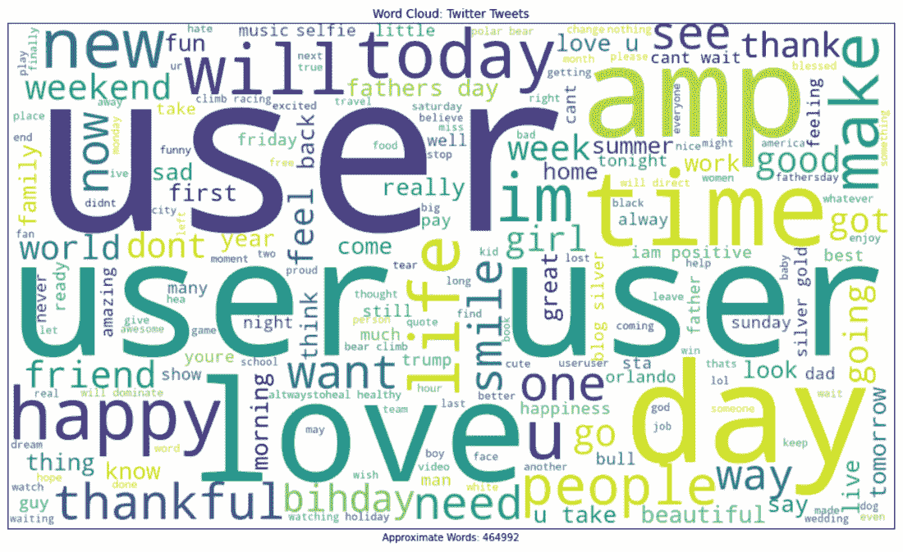

图 6.3 – Twitter 词云

除了真实世界的 NLP 数据，Pluto 还使用了查尔斯·狄更斯的《双城记》前几行作为控制文本。在本章中，Pluto 将扩展控制文本，加入狄更斯先生的《双城记》第一页、梅尔维尔的《白鲸》和卡罗尔的《爱丽丝梦游仙境》。这些书籍是公共领域作品，定义见古腾堡计划。

变量分别为 `pluto.orig_text`、`pluto.orig_dickens_page`、`pluto.orig_melville_page` 和 `pluto.orig_carroll_page`。

有趣的事实

机器学习擅长改变典型的人类写作文本，但修改经典作品几乎是犯罪行为。Pluto 只希望阐明增强概念，绝不亵渎经典。这一切都是为了科学。

你已经加载了 Python Notebook，实例化了 Pluto，访问了清理过的 NLP 真实世界数据，并通过词云信息图进行了验证。现在，是时候编写并调试 Python 代码，以更深入地了解机器学习中的单词和句子增强。

# 通过 Python Notebook 加强你的学习

尽管 NLP ML 非常复杂，包装代码的实现却出奇地简单。这是因为 Pluto 采用了结构化的面向对象方法。首先，我们在*第一章*中为 Pluto 创建了一个基础类，并使用装饰器在学习新的增强概念时添加了新方法。在*第二章*中，Pluto 学会了从 Kaggle 网站下载成千上万的真实世界数据集。*第三章*和*第四章*介绍了包装函数的处理过程，使用了强大的开源库。最后，*第五章*提出了使用**Nlpaug**库时的文本增强概念和方法。

因此，基于我们之前的知识，本章中的包装函数使用强大的 NLP ML 预训练模型来执行增强。

本章将特别介绍包装函数和使用以下技术对 Netflix 和 Twitter 真实世界数据集进行增强的结果：

+   **Word2Vec** 词语增强

+   **BERT** 和 **Transformer** 词语增强

+   **RoBERTa** 增强

+   **回译**

+   **T5** 增强

+   **Sequential** 和 **Sometime** 增强

让我们从 Word2Vec 开始。

## Word2Vec 词语增强

`print_aug_ai_word2vec()`包装函数的关键参数如下：

```py
# code snippet for print_aug_ai_word2vec()
model_type = 'word2vec',
model_path = 'GoogleNews-vectors-negative300.bin'
action = 'insert'    # or 'substitute'
nlpaug.augmenter.word.WordEmbsAug(model_type,
  model_path,
  action)
```

完整的函数可以在 Python Notebook 中找到。Pluto 使用真实世界的 NLP Netflix 数据来测试该函数，具体如下：

```py
# augment using word2vec
pluto.print_aug_ai_word2vec(pluto.df_netflix_data,
  col_dest='description',
  action='insert',
  aug_name='Word2Vec-GoogleNews Word Embedding Augment')
```

趣味事实

当你运行一个包装函数时，新的数据会被随机选择并处理。因此，最好反复运行包装函数，查看来自 Netflix 数据集的不同电影评论或来自 Twitter 数据集的不同推文。

输出如下：

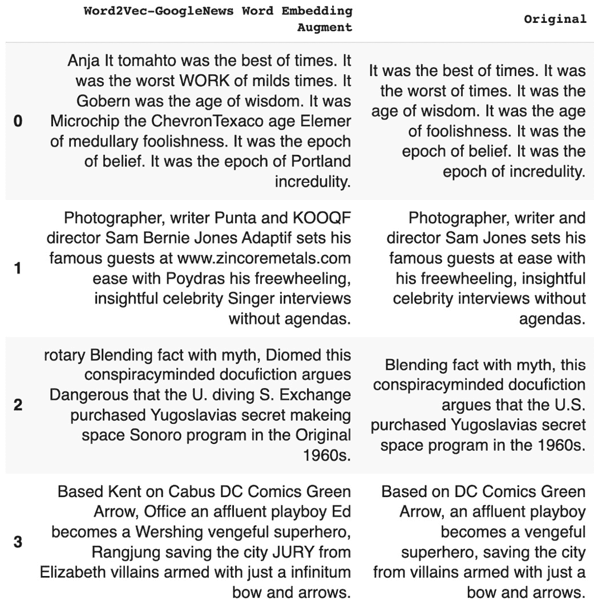

图 6.4 – 使用插入模式的 Word2Vec 在 Netflix 数据上的应用

在*图 6.3*中，第一行是控制输入。它摘自《*双城记*》这本书。你会发现，通过将控制文本与数据集中的文本进行对比，增强效果更容易察觉。此外，控制文本对于比较不同增强技术之间的差异也是必需的。

Pluto 发现，在*第 1 行*中注入的名称，如**Punta**（一个可信的西班牙作家名字）和**Poydras**，作为实际名称和可行的添加物，符合这个名人电影评论的背景。虽然这些名字在电影中并不真实出现，但它们在电影情感预测的文本增强中是可以接受的。

在*第 2 行*中，**blending**、**dangerous**和**original 1960s**这几个词为电影描述增添了色彩，同时又不改变间谍电影描述的意图。

在*第 3 行*，在漫画《绿箭侠》电影描述中，加入像**Kent of Cabus**（来自英国 Cabus 村的 Kent）、**Rangjung**（不丹的一个村庄，作为可能的英雄名字）和**Elizabeth**（作为反派角色）的名字是 100%合理的情节设定，适合我们的超级英雄。

总的来说，Pluto 对**Word2Vec**机器学习模型感到惊讶。单词和名字的插入情境非常合适，仿佛是人类作家创作的。然而，狄更斯的控制文本读起来非常有趣，这并不是机器学习的错。系统并不知道这本书是 19 世纪写的，只根据文本的前几行做出了推断。电影评论是完整的思路，而控制文本只是片段之一。

Pluto 对真实世界的 Twitter 数据执行类似的命令，具体如下：

```py
# augment using word2vec
pluto.print_aug_ai_word2vec(pluto.df_twitter_data,
  col_dest='clean_tweet',
  action='insert',
  aug_name='Word2Vec-GoogleNews Word Embedding Augment')
```

输出如下：

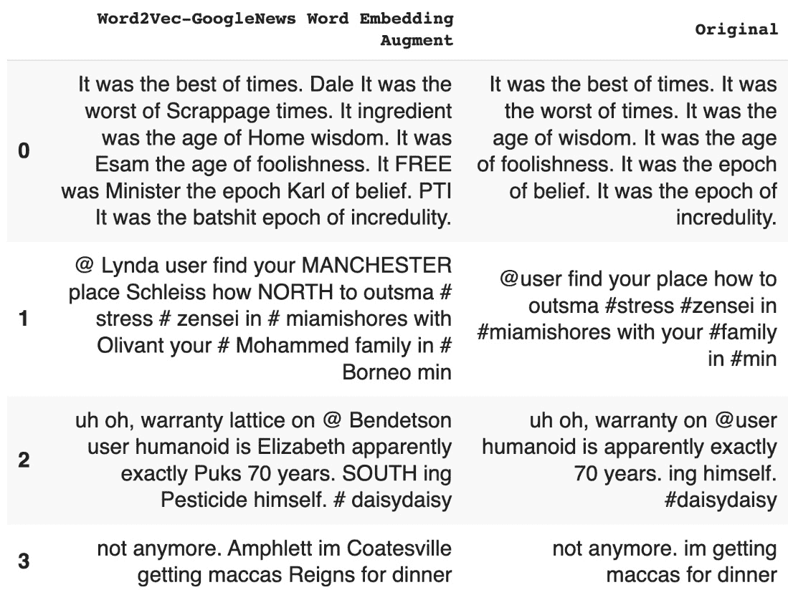

图 6.5 – Word2Vec 在 Twitter 数据上的插入模式

由于推文就像是没有经过深思熟虑或编辑的随机想法，在*图 6.4*中，**Word2Vec**的插入就像一个无聊的高中生一边做作业一边玩电脑游戏。Pluto 无法判断修改后的文本是否合理。这会增加还是减少 AI 在情感分析中的预测准确性？

对于狄更斯的控制文本，Pluto 感到震惊。它非常糟糕，但他承诺当使用变换器和生成 AI 时，后续模型会更好。

现在我们看过了**insert**模式，让我们看看**Word2Vec**模型在**substitute**模式下的表现。

### Substitute

**Substitute**模式会替换单词，并且在句子中添加单词。Pluto 将**Word2Vec**模型以**substitute**模式应用于 Netflix 数据，具体如下：

```py
# augmenting using word2vec
pluto.print_aug_ai_word2vec(pluto.df_netflix_data,
  col_dest='description',
  action='substitute',
  aug_name='Word2Vec-GoogleNews Word Embedding Augment')
```

输出如下：

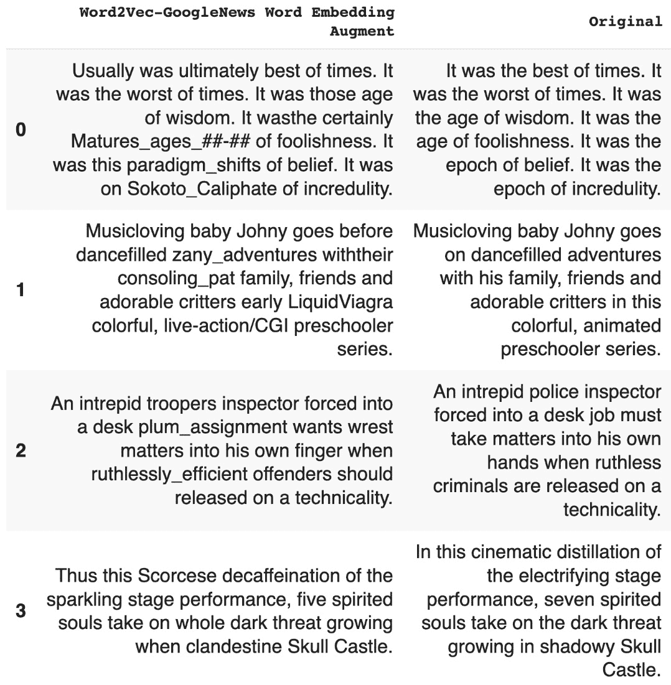

图 6.6 – Word2Vec 在 Netflix 数据上的替换模式

在*图 6.5*中，*第 0 行*是控制文本，而*第 1 行*中，**zany adventure**适合儿童冒险电影，但**liquid viagra**显然不合适。

在*第 2 行*，将**police**替换为**troopers**、**job**替换为**plum assignment**、**wrest**替换为**must take**、**figure**替换为**hand**，以及将**offenders**替换为**criminals**，这些在警匪电影中是合适的。因此，**Word2Vec**模型做了适当的增强处理。

在*第 3 行*，将**cinematic distillation**替换为**Scorcese decaffeination**是一个有趣的选择，值得人类作家考虑。将**electrifying**改为**sparkling**很聪明，因为电力可以产生火花。将**shadowy**替换为**clandestine**是个不错的选择，但将**seven**改为**five**则显得不必要。

再次说明，**Word2Vec**模型在控制文本的处理上本可以做得更好。

Pluto 对 Twitter 数据做了同样的处理，命令如下：

```py
# augmenting using word2vec
pluto.print_aug_ai_word2vec(pluto.df_twitter_data,
  col_dest='clean_tweet',
  action='substitute',
  aug_name='Word2Vec-GoogleNews Word Embedding Augment')
```

输出如下：

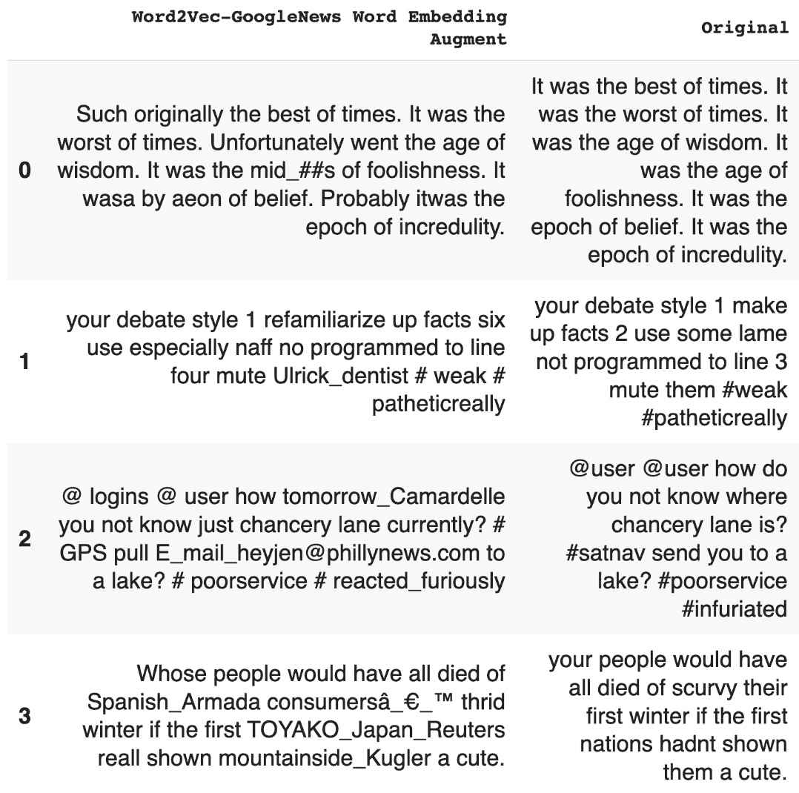

图 6.7 – Word2Vec 在 Twitter 数据上使用替换模式

在*图 6.6*中，推文杂乱无章，许多内容是不完整的想法。**Word2Vec**模型尽力而为，而 Pluto 认为没有人类能做得更好。

接下来我们要探讨的技术是 **BERT**，它使用变压器模型和生成性 AI。

## BERT

BERT 是一个由 Google 开发的变压器模型，经过大量语料库的训练。结果是接近完美的人类质量输出。从 2022 年 8 月中旬开始，BERT 和许多其他变压器模型通过 *HuggingFace* 向公众开放，易于获取。

`print_aug_ai_bert()` 函数的关键代码行如下：

```py
# code snippet for print_aug_id_bert()
model_path='bert-base-uncased'
aug_func = nlpaug.augmenter.word.ContextualWordEmbsAug(
  action=action,
  model_path=model_path)
```

完整的函数可以在 Python Notebook 中找到。Pluto 使用 `insert` 模式将 NLP Netflix 数据输入，命令如下：

```py
# Augmenting using BERT
pluto.print_aug_ai_bert(pluto.df_netflix_data,
  col_dest='description',
  action='insert',
  aug_name='BERT Embedding Insert Augment')
```

结果如下：

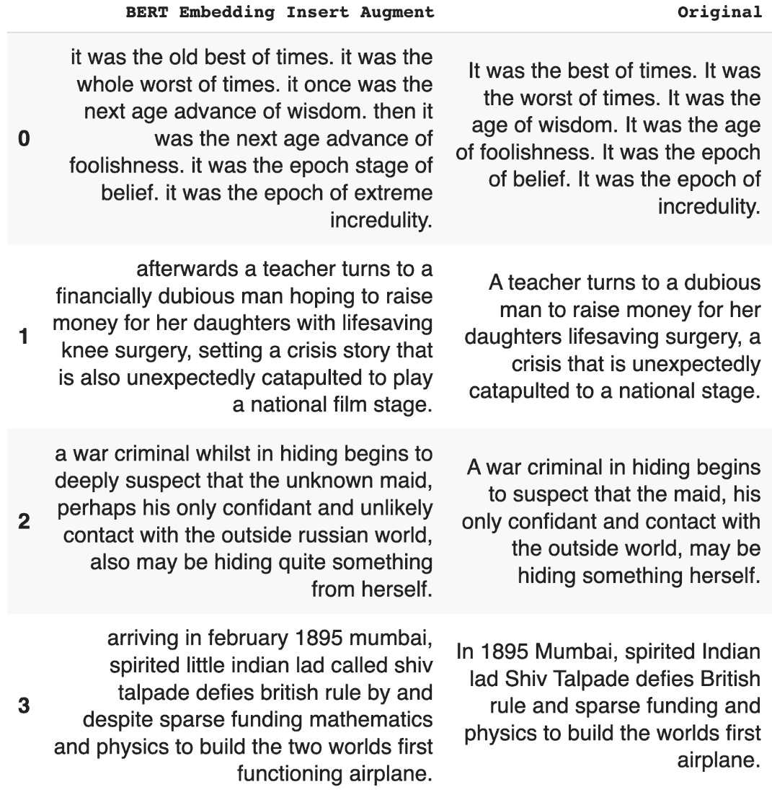

图 6.8 – BERT 在 Netflix 数据上使用插入模式

在*图 6.7*中，Pluto 立刻识别出与 **Word2Vec** 模型的改进。在控制文本*第 0 行*中，插入的单词是可以接受的。虽然缺乏散文的优雅，但如果必须在文本中加入单词，这样的文本看起来像人类写的。

在*第 1 行*，添加的短语恰到好处，如 **afterward**（之后）、**financial dubious**（财务可疑）、**knee surgery**（膝盖手术）、和 **to play a national** **film stage**（演奏国家级电影舞台）。

在*第 2 行*，增强的短语质量达到了人类作家的水平，如 **whilst in hiding**（在隐藏中）、**deeply suspect**（深度可疑）、**unknown maid**（未知的女仆）、**perhaps his only**（或许是他唯一的）、**outside Russian world**（俄罗斯外部世界）、以及 **maybe hiding** **quite something**（也许隐藏着某种东西）。

在*第 3 行*，Pluto 对结果印象深刻，例如 **arriving in February**（二月到达）、**little Indian lad**（小印度男孩）、**despite sparse funding**（尽管资金稀缺）、**funding mathematics and physics**（资助数学和物理）、和 **first** **functioning airplane**（第一架有功能的飞机）。

有趣的事实

你是否像 Pluto 一样对 BERT 模型的输出感到惊讶？它就像是一个真人，而不是一个人工神经网络（ANN）。

请重新运行包装函数，查看 BERT 对其他电影评论的增强效果。你读得越多，就越能欣赏使用 **变压器** 模型的先进突破。它是生成性 AI 的基础。

接下来，Pluto 使用插入模式将 Twitter 数据输入 BERT 模型，命令如下：

```py
# augmenting using BERT
pluto.print_aug_ai_bert(pluto.df_twitter_data,
  col_dest='clean_tweet',
  action='insert',
  aug_name='BERT Embedding Insert Augment')
```

结果如下：


图 6.9 – BERT 在 Twitter 数据上使用插入模式

有趣的事实

在*图 6.8*中，BERT 模型给出了另一版本的狄更斯控制文本。每次 Pluto 运行包装函数时都会得到一个新的版本。可能性是无穷无尽的。Pluto 必定运行了超过 50 次包装函数。每次结果都不同。

Pluto 发现有比推文更适合研究的 NLP 数据，但它们代表了真实世界，因此值得继续使用。当 Pluto 反复运行包装函数时，他更喜欢 BERT 增强版的推文而不是原始推文，因为插入文本使其更易阅读。

当切换到**替换**模式时，BERT 的输出优于普通人类写作。

### 替换

接下来，Pluto 使用以下命令将 Netflix 数据以**替换**模式输入到 BERT 中：

```py
# augmenting using BERT
pluto.print_aug_ai_bert(pluto.df_netflix_data,
  col_dest='description',
  action='substitute',
  aug_name='BERT Embedding Substitute Augment')
```

结果如下：

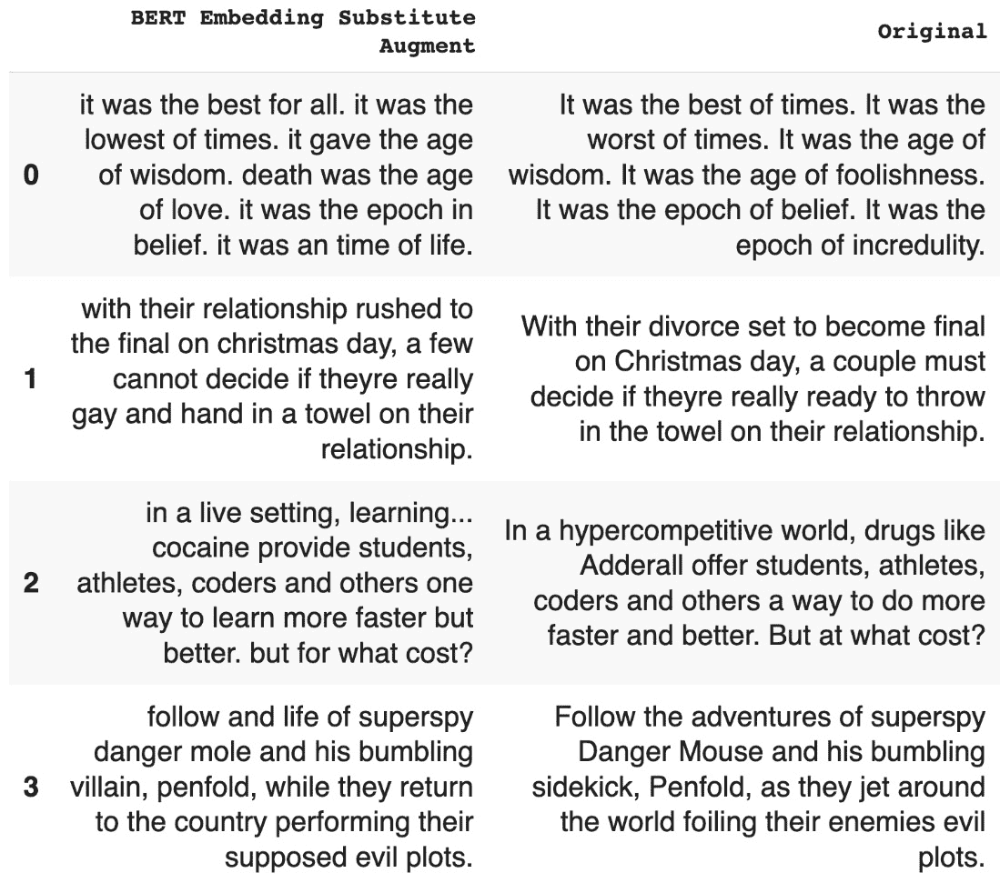

图 6.10 – BERT 在 Netflix 数据上使用替换模式

在*图 6.9*中，对于控制文本，*第 #0 行*，BERT 将**它是愚蠢的时代**替换为**死亡是爱的时代**。

有趣的事实

停止。Pluto 的思维被震撼了。甚至 Pluto 的人类伙伴也无言以对。Pluto 期待像 BERT 这样的变压器模型能做到很好，但哲学思考或诗歌是另一个层次的。现在，你对 BERT 印象深刻了吗？

剩余的电影评论增强内容，如*第 #1 行*、*第 #2 行*和*第 #3 行*，完美无瑕。增强后的词语与电影的类型和背景契合。就像 BERT 理解了电影的意义，但这并不真实。BERT 模型并不像烤面包机那样具备意识。然而，BERT 确实能很好地模仿人类写作。

一个有趣的注释是，在*第 #1 行*中，在描述一对情侣关系的电影描述中，BERT 使用了词汇*gay*，这在上一章关于数据偏见中有讨论过。因为*gay*是一个形容轻松和无忧无虑的词汇，但在现代语境下，*gay*通常与一个人的同性恋倾向，尤其是男性的同性恋倾向相关联。

再次提醒，Pluto 鼓励你在 Python Notebook 上反复运行包装函数。你将会超越技术成就的欣赏，觉得 BERT 甚至有了个性。

Pluto 使用以下命令对 Twitter 数据进行了相同的处理：

```py
# augmenting using BERT
pluto.print_aug_ai_bert(pluto.df_twitter_data,
  col_dest='clean_tweet',
  action='substitute',
  aug_name='BERT Embedding Substitute Augment')
```

结果如下：

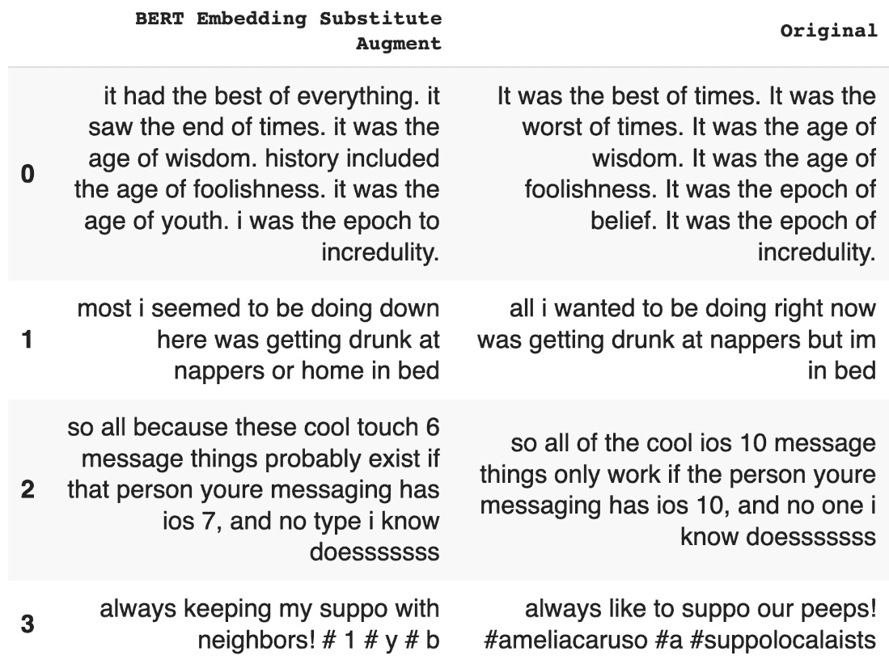

图 6.11 – BERT 在 Twitter 数据上使用替换模式

当 Pluto 在 Python Notebook 上反复运行包装函数时，在*图 6.10*中，他发现增强后的推文比原始文本更易于阅读。

对于控制文本，*第 #0 行*，Pluto 发现将增强后的文本**它是青春的时代**替换原文**它是信仰的时代**，是非常合适的。这与狄更斯先生书中的背景和风格非常契合。

有趣的挑战

这个挑战是一个思维实验。BERT 是基于人工神经网络（ANN）算法构建的。它不包含语法规则，比如名词和动词用来构造句子。没有语法规则，它是如何写出如此流利的英语的呢？提示：考虑模式。BERT 在庞大的语料库上进行了训练。单词和句子的数量大到五年前根本无法想象。很少有人知道神经网络算法是如何学习的。这不是复杂的数学问题。它是梯度下降和矩阵乘法推动数十亿个节点（或神经元），但这些节点的集合又是如何写出让人信服的英语的呢？

冥王星可以花几天时间讨论 BERT，但让我们继续深入了解**RoBERTa**（**Roberta**）。这听起来像是 BERT 的女性版。

## RoBERTa

RoBERTa 是 BERT 的自监督优化算法。虽然 BERT 是由谷歌创建的，但 RoBERTa 是 Meta AI（或 Facebook）开发的。

冥王星用以下命令将 Netflix 数据输入 RoBERTa 的插入模式：

```py
# augmenting using Roberta
pluto.print_aug_ai_bert(pluto.df_netflix_data,
  col_dest='description',
  model_path='roberta-base',
  action='insert',
  aug_name='Roberta Embedding Insert Augment')
```

结果如下：

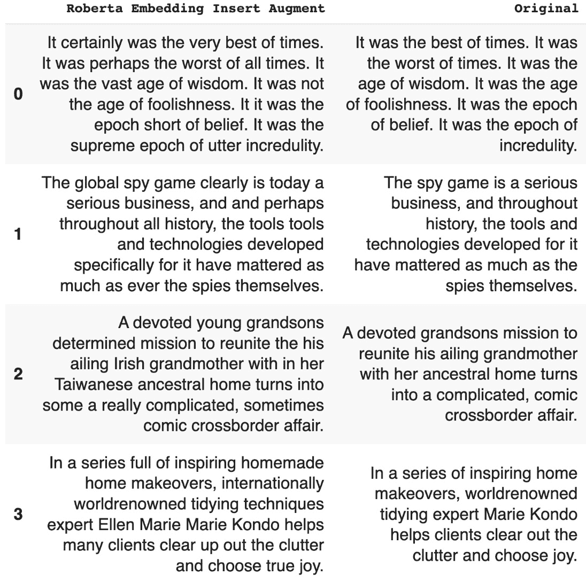

图 6.12 – RoBERTa 在 Netflix 数据上使用插入模式

*图 6.11*中的输出与**BERT**的输出相似，令人印象深刻。单词并不是随机插入句中的。它们表达了可能的解释，并给人一种**RoBERTa**理解单词意义的印象。这样的技术成就 1 年前是无法实现的，而**RoBERTa**几个月前才发布。

冥王星反复运行包装函数，并且从未厌倦阅读结果。他用以下命令对 Twitter 数据做了相同的操作：

```py
# augmenting using Roberta
pluto.print_aug_ai_bert(pluto.df_twitter_data,
  col_dest='clean_tweet',
  model_path='roberta-base',
  action='insert',
  aug_name='Roberta Embedding Insert Augment')
```

结果如下：

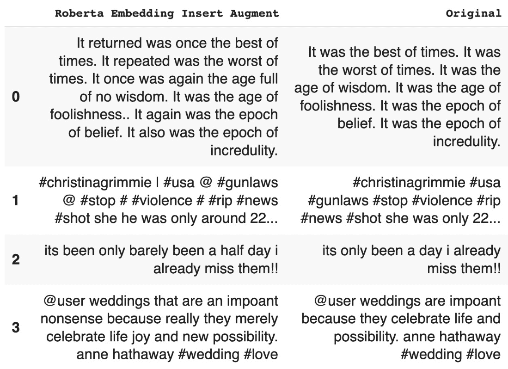

图 6.13 – RoBERTa 在 Twitter 数据上使用插入模式

冥王星无法将铅变成金子，而 RoBERTa 也无法将如*图 6.12*所示的包含拼写错误和不完整想法的推文转化为连贯的句子。尽管如此，RoBERTa 仍然是增强现实世界推文的最佳选择之一。

接下来，冥王星将尝试使用**替换**模式的**RoBERTa**。

### 替换

在替换模式下，RoBERTa 将根据上下文和写作风格，以惊人的准确度替换单词或短语。

冥王星将 Netflix 数据以替换模式输入 RoBERTa 模型，使用以下命令：

```py
# augmenting using Roberta
pluto.print_aug_ai_bert(pluto.df_netflix_data,
  col_dest='description',
  model_path='roberta-base',
  action='substitute',
  aug_name='Roberta Embedding Substitute Augment')
```

输出如下：

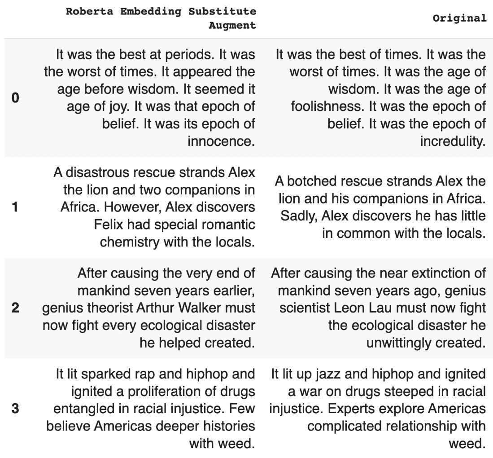

图 6.14 – RoBERTa 在 Netflix 数据上使用替换模式

无论冥王星执行多少次包装函数，他仍然对 RoBERTa 在*图 6.13*中提供的输出感到惊讶。例如，在*第 1 行*，她将短语**Alex discovers he has little in common with the local**改为**Alex discovers Flix had special romantic chemistry with the local**。RoBERTa 真是富有想象力。这就是人类写作时的方式吗？

冥王星使用以下命令对 Twitter 数据执行相同操作：

```py
pluto.print_aug_ai_bert(pluto.df_twitter_data,
  col_dest='clean_tweet',
  model_path='roberta-base',
  action='substitute',
  aug_name='Roberta Embedding Substitute Augment')
```

结果如下：

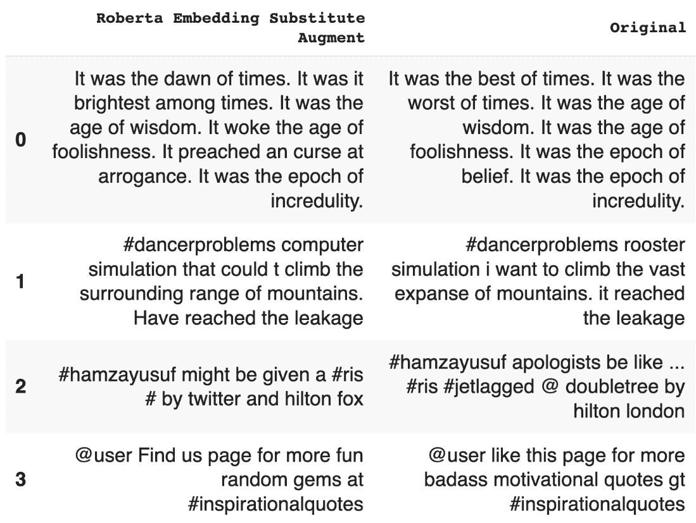

图 6.15 – RoBERTa 在 Twitter 数据上的替代模式使用

如**图 6.14**所示，文本增强不必是枯燥或临床的。使用 BERT 和 RoBERTa 等变换器模型，增强过程既有趣又充满奇迹。例如，在控制文本中，**第 0 行**，RoBERTa 写道，**它对傲慢宣讲了诅咒**，取代了**这是一个信仰的时代**。

有趣的事实

冥王星的人类伴侣需要经过长时间的思考，才能得出结论：增强文本确实与**图 6.14**中的原始文本——控制文本——意义相同。很容易被误导，认为 RoBERTa 有良知。我们将智能与意识相联系，意味着如果你有智能，你必须是自我意识的，反之亦然，但我们知道这并不成立。例如，一名职业政治家非常自我意识。他一直在谈论自己，但他聪明吗？

继续使用最新的强大 ML 模型，冥王星将通过使用**反向翻译**技术走上不同的文本增强道路。

## 反向翻译

反向翻译是文本增强中的一个新概念，因为在两年前是不可行的。机器学习的自然语言处理（ML NLP）技术早已存在，Google 翻译也一直在推进。但只有少数数据科学家能够使用变换器和进行语言翻译所需的强大服务器，访问大型语言模型。

文本增强的技术是将文本翻译成另一种语言，然后再翻译回原语言。通过这种方式，结果将是原始文本的增强版本。没有任何语言翻译是完美的，因此扩展版本会与原始文本略有不同。例如，原文是英文的。使用强大的 NLP 模型，我们将其翻译成德语，然后再翻译回英语。翻译后的英语文本将与原始的英语文本有所不同。

与**Word2Vec**、**BERT**和**RoBERTa**相比，反向翻译方法可能更具鲁棒性。这是因为翻译回原文时，第二次或第三次得到的结果是相同的。换句话说，其他方法的输出会产生成千上万种变化，而反向翻译则只有两三种增强版本。

冥王星在*HuggingFace*网站上找到了两个来自 Facebook（或 Meta AI）的 NLP 预训练翻译模型，它们支持英语到德语（Deutsch）和英语到俄语（Русский）。还有更多的模型，但这两个足以展示该技术。让我们从德语开始。

### 德语 (Deutsch)

`print_aug_ai_back_translation()`方法遵循与其他包装函数相同的结构。它看起来 deceptively 简单，只有五行代码，但实际上包含了复杂的理论和编码技巧。这让 Pluto 想起了艾萨克·牛顿爵士的名言：“*如果我看得更远，那是因为站在了* *巨人的肩膀上。*”

关键代码行如下：

```py
# code snippet for back translation
from_model_name='facebook/wmt19-en-de'
to_model_name='facebook/wmt19-de-en'
aug_func = nlpaug.augmenter.word.BackTranslationAug(
  from_model_name=from_model_name,
  to_model_name=to_model_name)
```

完整的函数可以在 Python Notebook 中找到。Pluto 使用以下命令将 Netflix 数据输入：

```py
# augmenting using back translation
pluto.print_aug_ai_back_translation(pluto.df_netflix_data,
  col_dest='description',
  from_model_name='facebook/wmt19-en-de',
  to_model_name='facebook/wmt19-de-en',
  aug_name='FaceBook Back Translation: English <-> German Augment')
```

结果如下：

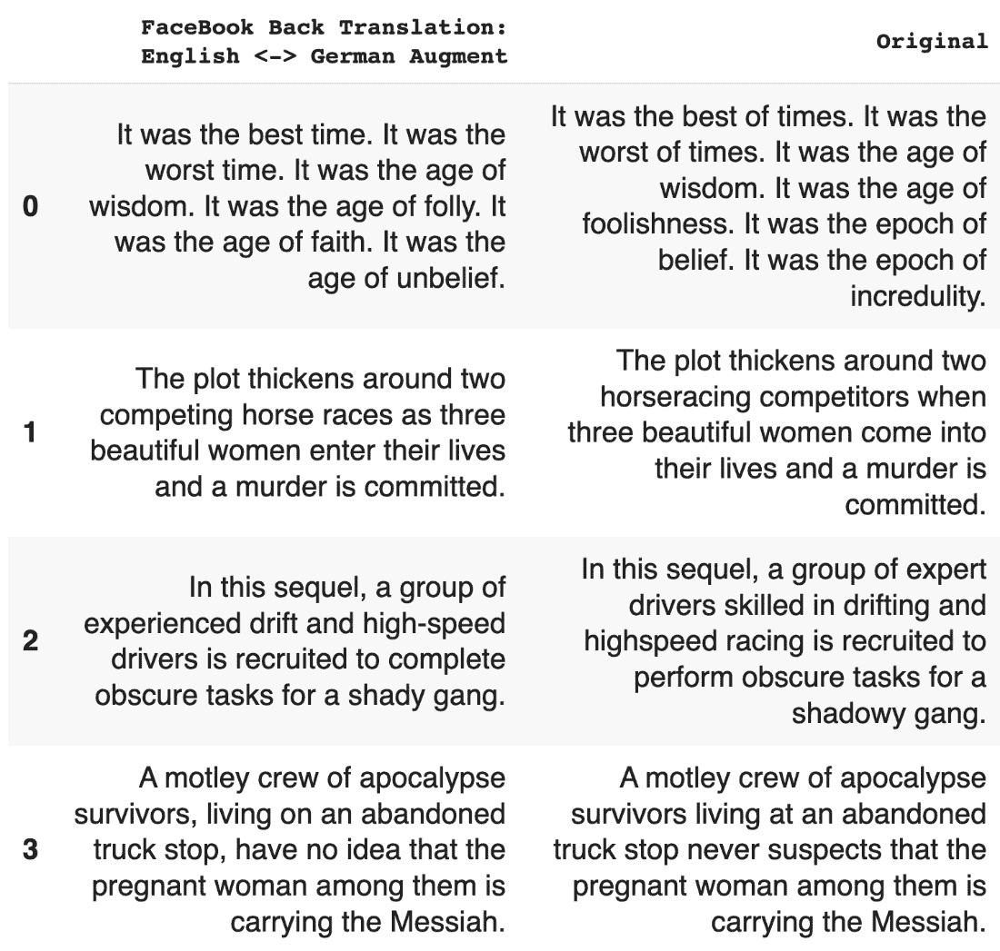

图 6.16 – 回译，Netflix 数据中的德语

趣事

*图 6.15*中的输出令人失望，因为它与原文相似，但这一技术成就令人震惊。首先，你需要一位专家将英语翻译成德语。这对人类来说是一个具有挑战性的任务。其次，你必须将其无误地翻译回英语。选择类似词语的差异体现在表达上。也许只有全球 5% 的人能完成这个任务。让机器全天候、每周 7 天、维持同样的准确性水平来完成这项任务是神奇的。没有人类能够达到这个水平。

*图 6.15*中的输出提供了几乎完美的英德回译。Pluto 用以下命令对 Twitter 数据做了相同的操作：

```py
# augmenting using back translation
pluto.print_aug_ai_back_translation(pluto.df_twitter_data,
  col_dest='clean_tweet',
  from_model_name='facebook/wmt19-en-de',
  to_model_name='facebook/wmt19-de-en',
  aug_name='FaceBook Back Translation: English <-> German Augment')
```

输出如下：

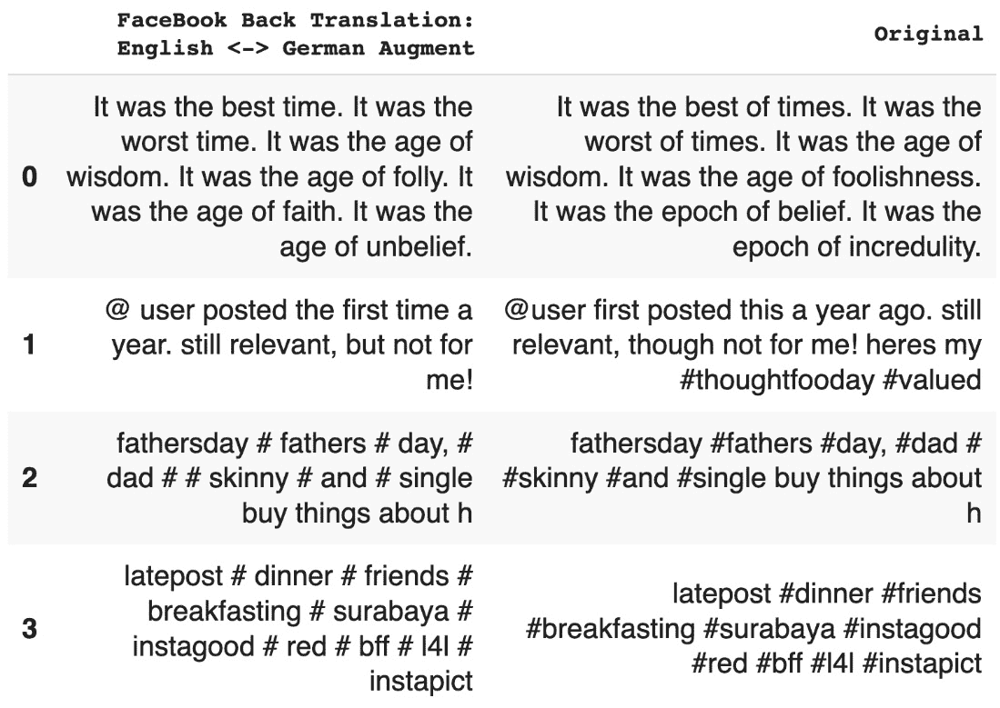

图 6.17 – 回译，Twitter 数据中的德语

在*图 6.16*中，将无意义的推文翻译成德语并回译对人类来说更困难，因为我们的思维更容易疲劳并且会放弃。只有机器才能全天候完成这项工作。控制文本的德语回译是可以接受的。

将文本翻译成俄语并回译会产生类似的结果。我们来看看。

### 俄语（Русский）

Pluto 选择重复相同的英俄回译技术，因为他好奇选择非罗曼语族语言是否会对增强结果产生不同的影响。

使用相同的`print_aug_ai_back_translation()`函数，Pluto 将俄语翻译的 Facebook 模型定义如下：

```py
# code snippet for back translation to Russian
from_model_name='facebook/wmt19-en-ru'
to_model_name='facebook/wmt19-ru-en'
```

完整的函数代码可以在 Python Notebook 中找到。Pluto 将 Netflix 数据传递给包装函数如下：

```py
# augmenting using back translation
pluto.print_aug_ai_back_translation(pluto.df_netflix_data,
  col_dest='description',
  from_model_name='facebook/wmt19-en-ru',
  to_model_name='facebook/wmt19-ru-en',
  aug_name='FaceBook Back Translation: English <-> Russian Augment')
```

结果如下：

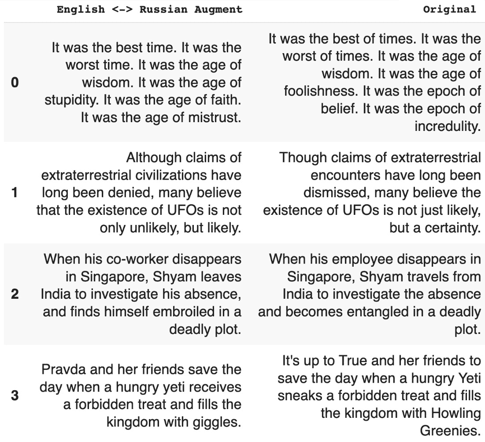

图 6.18 – 回译，Netflix 数据中的俄语

值得注意的是，在*图 6.17*中，NLP **T5** 模型将一种罗曼语族语言（英语）翻译成一种东斯拉夫语言（俄语）并回译，几乎达到了完美的准确性。语法规则、句子结构、字母表、历史、文化和语言都不同，但机器能够在没有意识的情况下完成这项任务。

推文不适合测试，但并非所有项目都是合乎逻辑的。Pluto 曾参与过一些构思不周的现实世界 NLP 项目。向包装函数提供推特数据的命令如下：

```py
# augmenting using back translation
pluto.print_aug_ai_back_translation(pluto.df_twitter_data,
  col_dest='clean_tweet',
  from_model_name='facebook/wmt19-en-ru',
  to_model_name='facebook/wmt19-ru-en',
  aug_name='FaceBook Back Translation: English <-> Russian Augment')
```

结果如下：

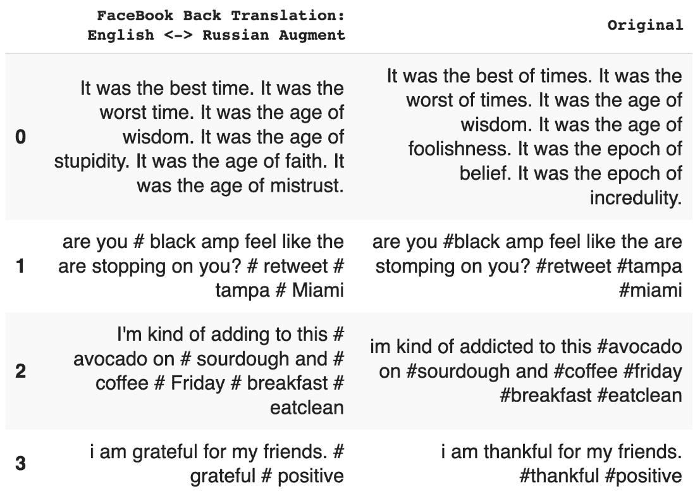

图 6.19 – 反向翻译，推特数据上的俄语

如果俄罗斯人不能理解推文，那么还有谁能呢？阅读*图 6.18*中的控制文本，Pluto 可以判断翻译是否正确。由于某些推文较短，翻译成俄语后再翻回英语非常完美。

有趣的挑战

这个挑战是一个思想实验。你能否使用相同的技术来增强德语？或者你能否将几个反向翻译组合在一起——例如，从英语翻译到德语，再到俄语，最后回到英语？

**反向翻译**、**RoBERTa**、**BERT**和**Word2Vec** NLP 机器学习模型是文本增强的最先进技术。下一个层次是使用摘要和顺序及有时技术的句子增强。

## 句子增强

句子**流**级别使用了多种词汇增强方法的结合。但在此之前，Pluto 将使用**T5** NLP 模型生成文本摘要。**摘要**技巧是最近才实现的一项新概念。它可以将一页、一篇文章甚至一本书生成一个摘要，用于 NLP 文本增强模型中。

### 摘要技巧

对于文本增强，**摘要**技巧可能会带来几个不同的版本进行训练。然而，假设 Pluto 将**流**和**摘要**技巧结合起来，例如，向**流**技巧提供摘要文本，而不是原始文本，在这种情况下，它将生成许多新的原始文本用于训练。

有趣的事实

Pluto 首创了**摘要到流**的概念，用于文本增强。他在网上和学术出版物中做了初步搜索，但他需要帮助找到摘要到流技巧的参考文献。如果没有找到相关资料，那么 Pluto 就是第一个实现该策略的人。

Pluto 不会使用 Netflix 电影描述或 Twitter 推文作为摘要方法。这是因为它们太短，无法展示 T5 NLP 模型的强大功能。相反，Pluto 将使用以下*现实世界 NLP* *数据*部分提到的书籍的第一页：

+   *双城记* 由狄更斯所著

+   *白鲸* 由梅尔维尔所著

+   *爱丽丝梦游仙境* 由卡罗尔所著

再次强调，这些书籍是公有领域的，如古腾堡计划所定义。

此外，Pluto 将使用本章的第一页，因为你已经读过这本书，但你可能没有读过那三本经典书籍。

`print_aug_ai_t5()`包装函数的关键代码行如下：

```py
aug_func = nlpaug.augmenter.sentence.AbstSummAug(
  model_path='t5-base')
```

普鲁托正在和你玩猜谜游戏。首先，他将列出四条命令行来生成四个摘要，但他会将输出结果打乱顺序。因此，你必须猜出哪个摘要属于哪本书。你将再次对**T5** NLP 模型的输出质量感到惊讶，它可与人类作家相媲美。

深刻的意义在于，你或普鲁托可以通过几行 Python 代码自动生成书籍、论文、文档、文章和帖子摘要。几年前，这项任务被认为是不可能完成的。

有趣的挑战

这里有一个思维实验。你能在不懂德语的情况下成为德国法律的专家吗？一年前这是不可能的，因为当时没有机器学习的突破，但今天，你可以使用 Python Notebook 中的代码作为基础，翻译所有德国语法书籍。

获取我们将要查看的四本书第一页摘要的四条命令如下：

```py
# Alice in Wonderland
pluto.df_t5_carroll = pluto.print_aug_ai_t5(
  pluto.orig_carroll_page,
  bsize=1)
# Tale of Two Cities
pluto.df_t5_dickens = pluto.print_aug_ai_t5(
  pluto.orig_dickens_page,
  bsize=1)
# Moby Dick
pluto.df_t5_melville = pluto.print_aug_ai_t5(
  pluto.orig_melville_page,
  bsize=1)
# This chapter first page
pluto.df_t5_self = pluto.print_aug_ai_t5(
  pluto.orig_self,
  bsize=1)
```

打乱顺序的结果如下：


图 6.20 – 摘要 T5 NLP 引擎 – 1

第二个输出如下：


图 6.21 – 摘要 T5 NLP 引擎 – 2

第三个输出如下：


图 6.22 – 摘要 T5 NLP 引擎 – 3

第四个输出如下：


图 6.23 – 摘要 T5 NLP 引擎 – 4

有趣的挑战

你能将摘要与书籍匹配起来吗？**T5** 引擎并不像 OpenAI GPT3、GPT4 或 Google Bard 那样是一个生成型人工智能引擎，但它的摘要非常准确。

*双城记*书籍，如*图 6.19*所示，是一本相对较难读的书，普鲁托觉得非常有趣的是，现代政治评论员*大卫·罗斯科普夫*竟然与狄更斯的这本书有关联。书的第一页确实提到了**英国臣民在美国的议会**。因此，罗斯科普夫先生的关联是一个很好的猜测，也许普鲁托应该将章节的前 10 页输入到**T5** NLP 引擎中，并查看摘要。

*白鲸*的第一页摘要非常到位，如*图 6.20*所示。它可以与人类作家的作品相媲美，第一页的第一个词是**以实马利**。普鲁托希望**T5** NLP 模型能在他上学的早期就出现。

普鲁托的人类伙伴高兴地承认，这一章节第一页的摘要更为精准且易于阅读，如*图 6.21*所示。也许**T5** NLP 引擎应该和普鲁托一起共写这本书，这样他的伙伴就能在阳光明媚的下午享受追逐松鼠的乐趣。

*爱丽丝梦游仙境*的第一页摘要完美无缺，如*图 6.22*所示。**T5** NLP 引擎无误地捕捉到了开篇的内容。作为额外奖励，普鲁托只输入了前五句话。输出如下：


图 6.24 – 总结 T5 NLP 引擎 – 《爱丽丝梦游仙境》的前五行

在*图 6.23*中，**T5**如何知道白兔是故事中的关键？兔子只在输入文本的最后一句话中出现，称爱丽丝为雏菊链的制造者非常有趣。

句子增强的下一步是将这些摘要输入到**流**方法中。

### 总结到流技术

流技术中的顺序方法按顺序应用增强列表。Pluto 创建了两个文本增强方法，如下所示：

```py
# augment using uloVe
pluto.ai_aug_glove = nlpaug.augmenter.word.WordEmbsAug(
    model_type='glove', model_path='glove.6B.300d.txt',
    action="substitute")
# augment using BERT
pluto.ai_aug_bert = nlpaug.augmenter.word.ContextualWordEmbsAug(
  model_path='bert-base-uncased',
  action='substitute',
  top_k=20)
```

第一个使用`print_aug_ai_sequential()`包装函数，它使用增强列表和关键代码行，如下所示：

```py
# augment using sequential
aug_func = nlpaug.flow.Sequential(
  [self.ai_aug_bert, self.ai_aug_glove])
```

Pluto 将四个摘要输入流方法，如下所示：

```py
# Alice in Wonderland
pluto.print_aug_ai_sequential(pluto.df_t5_carroll)
# Tale of Two Cities
pluto.print_aug_ai_sequential(pluto.df_t5_dickens)
# Moby Dick
pluto.print_aug_ai_sequential(pluto.df_t5_melville)
# This chapter
pluto.print_aug_ai_sequential(pluto.df_t5_self)
```

让我们来看一下结果。

*《爱丽丝梦游仙境》*的增强摘要输出如下：

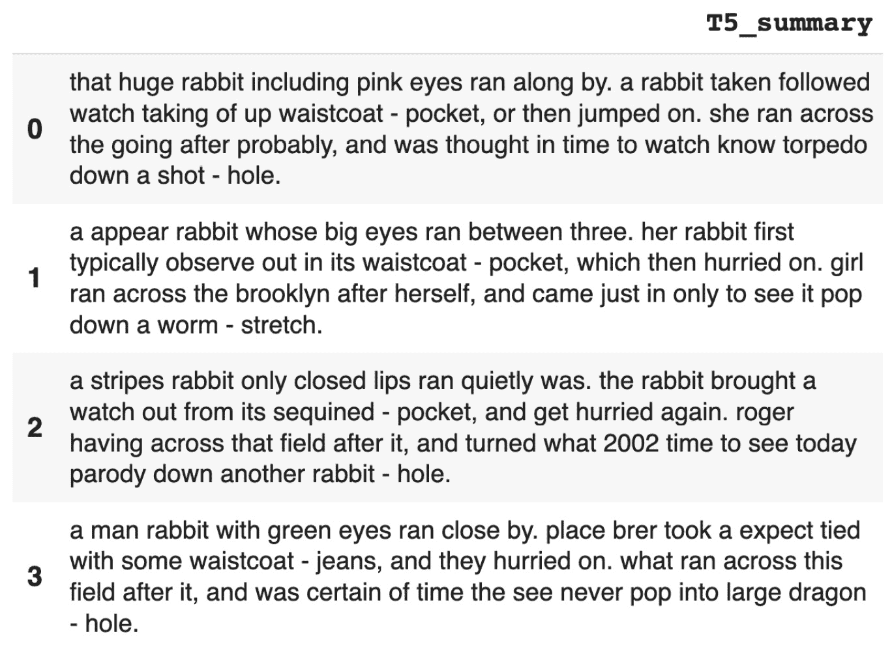

图 6.25 – 总结到流方法，爱丽丝梦游仙境

*《双城记》*的增强摘要输出如下：

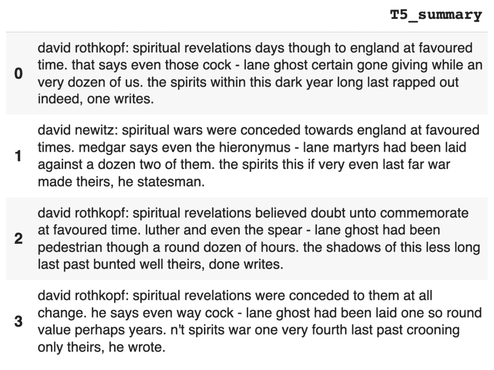

图 6.26 – 总结到流方法，双城记

*《白鲸》*的增强摘要输出如下：

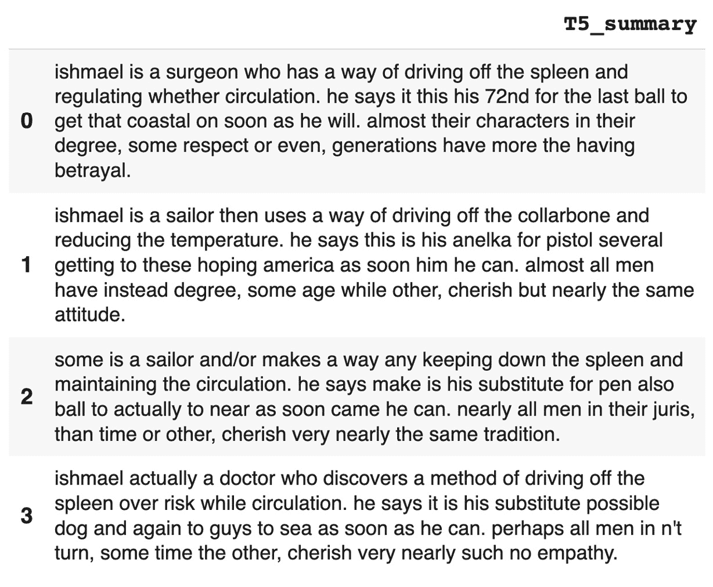

图 6.27 – 总结到流方法，白鲸

本章的增强摘要输出如下：

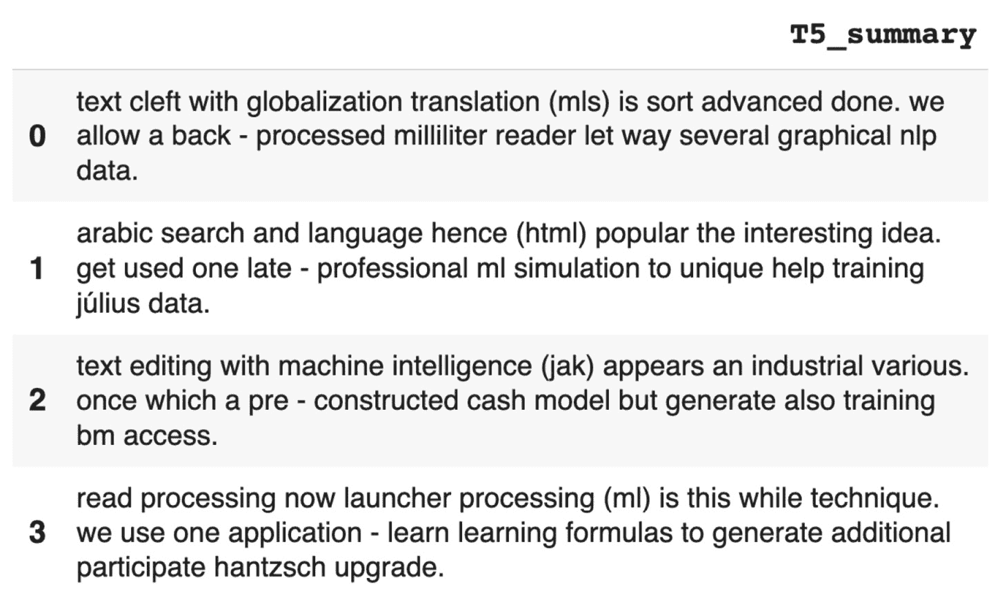

图 6.28 – 总结到流方法，本章

Pluto 喜欢阅读增强后的摘要。有些聪明，有些夸张，但对于增强文本来说，它们足够了。

下一步是`print_aug_ai_sometime()`包装函数，位于 Python Notebook 中，但他认为在这一章解释结果不会带来更多的洞察。你可以在 Python Notebook 中运行这个包装函数并查看结果。

有趣的挑战

Pluto 挑战你重构**Pluto 类**，使其更快、更紧凑。你还应包含前几章的所有图片包装器和辅助函数。Pluto 鼓励你创建并上传你的库到*GitHub*和*PyPI.org*。此外，你不必将类命名为**PacktDataAug**，但如果你引用或提到这本书，Pluto 和他的人类伙伴会露出灿烂的笑容。代码目标是为了易于理解、可重用的模式，以及在**Python Notebook**中的教学。因此，将代码重构为 Python 库会相对轻松且有趣。

**总结到流**技术是本章最后将介绍的方法。现在，让我们总结一下这一章。

# 摘要

使用机器学习（ML）进行文本增强是一项高级技术。我们使用了一个预训练的 ML 模型来创建额外的训练 NLP 数据。

在输入前三个段落后，**T5** NLP ML 引擎为本章写出了前面的总结。它非常完美，体现了本章的精神。因此，Pluto 保留了这个总结不做更改。

此外，我们讨论了 14 种 NLP ML 模型和四种词语增强方法。它们分别是**Word2Vec**、**BERT**、**RoBERTa**和**回译**。

Pluto 展示了 BERT 和 RoBERTa 能与人类写作相媲美。增强后的文本不仅仅是合适的，还富有启发性，例如将*这是愚蠢的时代*替换为*死亡是爱的时代*，或者将*这是信仰的时代*替换为*这是*青春*的时代*。

对于**回译**方法，Pluto 使用 Facebook 或 Meta 的 AI NLP 模型将文本翻译成德语和俄语，然后再翻译回英语。

对于句子增强，Pluto 通过 **T5** NLP ML 引擎精准总结了三本经典书籍的第一页，给大家留下了深刻印象。此外，他还开创了**从总结到流**的文本增强概念。Pluto 可能是第一个实现**从总结到流**策略的人。

在本章中，有许多*有趣的事实*和*有趣的挑战*。Pluto 希望你能充分利用这些内容，拓展你的经验，超越本章的范围。

下一章将讨论音频增强，这将带来不同的挑战，但 Pluto 已经准备好应对它们。

# 第四部分：音频数据增强

本部分包括以下章节：

+   *第七章*，*音频数据增强*

+   *第八章*，*使用谱图进行音频数据增强*
