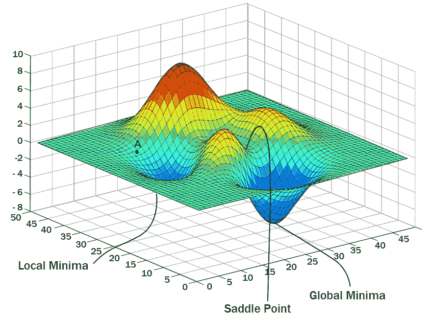
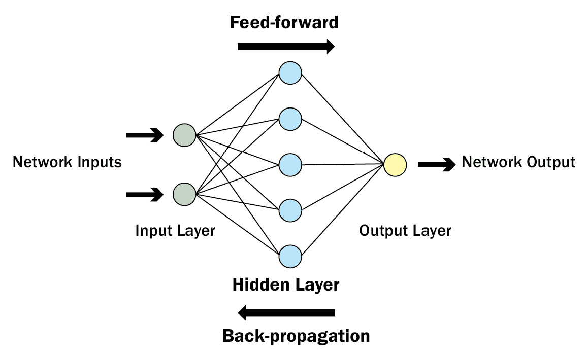
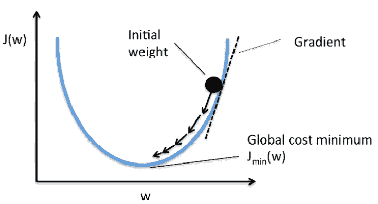
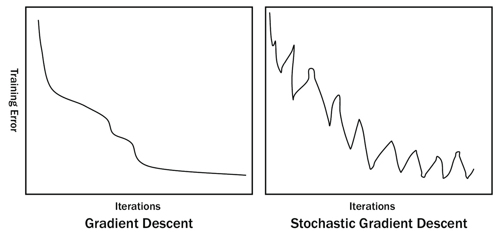
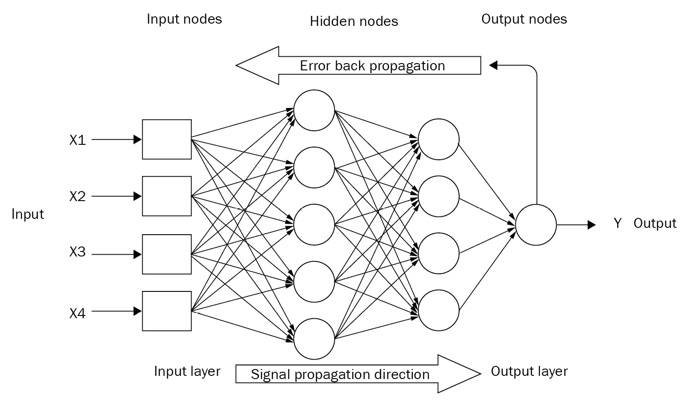
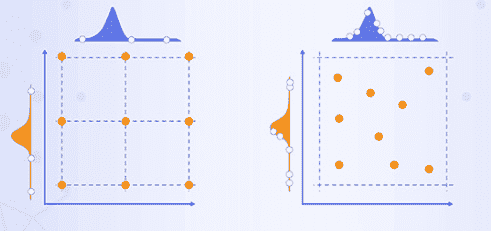
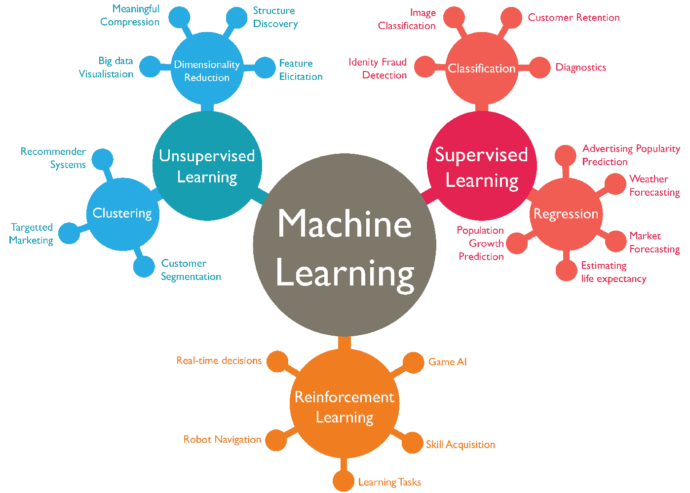
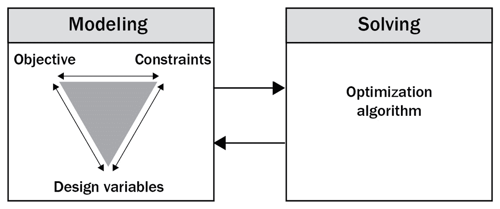

# 机器学习与数学建模

在上一章学习了数学优化的主要组成部分：决策变量、目标函数和约束条件后，现在是时候探讨**机器学习**（**ML**）模型了，其中大多数可以被看作是数学模型。人类通过大量的历史数据让机器学习。机器学习模型增强了人类和机器的决策能力，充分利用数据和算法的力量。几乎所有这些模型背后都在运行某种优化算法。

机器学习（ML）这一术语首次由计算机科学和游戏领域的先驱 Arthur L. Samuel 在 20 世纪 50 年代普及。自那时以来，数据量飞速增长，尤其是在过去几十年中，处理大量数据已经超出了人类大脑的能力范围。因此，机器学习介入并找到了在几乎所有领域的应用，帮助人类做出决策。

数据科学中的学习问题可以根据业务问题或用例大致分为回归、分类和聚类。回归和分类使用监督学习算法预测目标变量，通常称为因变量，而独立变量则称为预测变量。聚类则使用无监督学习算法，其中目标是未知的。值得一提的是，并非所有机器学习算法中的学习都涉及优化，例如**k-最近邻**（**kNN**）就是一个监督学习的例子。机器学习主要是一个预测工具，帮助企业为未来做好规划，从而有利于其利润。企业还利用机器学习进行异常（或离群点）检测和推荐系统。严格的数学建模则帮助企业在电力分配、员工调度和库存管理等领域做出决策。

一些在机器学习模型中使用的约束优化算法如下：

+   **主成分分析**（**PCA**）

+   使用期望最大化算法进行聚类（例如高斯混合模型）

+   使用拉格朗日乘子法的支持向量机

其他使用无约束优化的机器学习算法包括神经网络中的**随机梯度下降**（**SGD**）和深度学习中的批量梯度下降（神经网络具有大量的隐藏层，位于输入和输出之间）。除了这些，还有进化学习中的遗传算法，这些算法涵盖了约束和无约束优化问题。

机器学习的主要组成部分包括表示、评估和优化。表示是指通过统计地呈现知识和历史数据，以寻找模式，换句话说，就是将一个业务问题表述出来，从而得出或估算解决方案。接下来是对这一表述的评估，我们称之为模型，并将数据与已知的示例或数据样本进行拟合和比较。最后，模型背后的算法优化其权重和偏差，以更好地拟合数据，优化过程会迭代进行，直到达到所需的精度为止。在接下来的章节中，我们将学习主成分分析（PCA）和梯度下降法。

本章涵盖以下主题：

+   机器学习作为数学优化问题

+   机器学习作为一种预测工具

+   数学建模作为一种规范性工具

# 机器学习作为数学优化

机器学习可以描述为寻找将输入示例映射到输出示例的未知潜在（近似）函数。在这一过程中，机器学习算法定义了一个参数化的映射函数，并通过优化或最小化函数中的误差来求解其参数的值。机器学习就是函数近似与函数优化的结合。函数参数也称为模型系数。每次我们将模型拟合到训练数据集时，都在解决一个优化问题。

每种机器学习算法对映射函数的形式做出不同的假设，这进而影响要执行的优化类型。机器学习是一种函数近似方法，旨在最优地拟合输入数据。当数据（样本大小或样本数量）有限时，特别具有挑战性。必须选择一个机器学习算法，以最有效的方式解决优化问题；例如，神经网络使用随机梯度下降（SGD），而普通最小二乘法和梯度下降用于线性回归。当我们偏离默认算法时，必须有充分的理由这么做。在数学优化中，有时可能会使用启发式方法来确定近似最优解。这发生在经典算法过于缓慢，无法找到近似解，或者无法找到优化问题的精确解时。启发式算法的例子包括遗传算法和模拟退火算法。

## 示例 1 – 回归

一个机器学习问题可以表述为：给定输入数据（X）和输出数据（Y），学习一个映射函数（f），使得 Y = f(X)。给定新的输入数据，我们应该能够通过已学习的函数 f 将每个数据映射到（或预测）输出。通常，由于观察数据中的噪声和选择的学习算法在逼近映射函数时的误差，预测误差是不可避免的。寻找能够最小化误差、代价或损失的输入集合，本质上就是在解决优化问题。映射函数的选择决定了优化的难度。选择越偏向或约束越强，优化越容易。

例如，线性回归是一个受约束的模型。通过线性代数，可以解析求解它。在这种情况下，映射函数的输入是模型系数。优化算法，如迭代局部搜索，可以用数值方法求解，但几乎总是比解析解法效率低。逻辑回归（用于分类任务）是一个约束较少的模型，在这种情况下需要使用优化算法。这里的损失或误差也称为逻辑损失或交叉熵。虽然在这两种回归模型中都可以使用全局搜索优化算法，但它通常不如使用解析方法或局部搜索方法高效。当搜索空间或地形是多模态和非线性时，适合使用迭代全局搜索（如梯度下降），正如*图 2.1*所示。

图 2.1：无约束优化空间的 3D 地形图，其中 A 是当前状态

## 示例 2 – 神经网络

神经网络是一个灵活的模型，约束非常少。网络通常包含一个输入层、一个隐藏层（可以有多个）和一个输出层节点，映射函数的输入通过加权连接到输入层，如*图 2.2*所示。正是这个映射函数，监督学习算法试图最优地逼近。

图 2.2：网络中的三个基本最小层

预测输出与期望输出的偏差就是误差值，而这个误差或代价，如*图 2.3*所示，在模型训练过程中被最小化，同时逼近该函数。神经网络需要一个迭代的全局搜索算法。梯度下降是优化神经网络的首选方法，神经网络有多个变种，即批量梯度下降、迷你批量梯度下降和随机梯度下降（SGD）。其中最受欢迎的 SGD 算法之一是**自适应矩估计**（**Adam**），它为每个参数计算自适应学习率。

图 2.3：通过梯度下降最小化成本函数 J(w)，其中 w 是输入（来自《Python 机器学习》Sebastian Raschka 的贡献）

梯度是函数对输入变量值的偏导数（斜率/曲率）所组成的向量。顾名思义，梯度下降算法需要计算该梯度。每个输入的梯度的负值沿着梯度指向上坡的方向向下走，从而得出新的输入值。步长用于缩放梯度，并控制输入相对于梯度的变化。这个步长或增量就是学习率，是算法的超参数，也是更新网络权重的比例。这个过程会一直重复，直到找到函数的最小值。梯度下降算法被用于最小化预测模型的损失函数，如回归或分类。这个适应过程产生了 SGD，如*图 2.4*所示。

图 2.4：梯度下降扩展

SGD 是梯度下降优化算法的扩展，其中目标函数被视为损失或误差，例如回归中的均方误差和分类中的交叉熵。由于目标函数相对于输入的梯度是噪声性的，且仅能通过概率近似确定，算法因此被称为“随机”。由于训练数据中的稀疏性和噪声，评估出的梯度带有统计噪声。一般而言，SGD 及其变种仍然是机器学习和深度学习（人工神经网络）模型训练中最常用的优化算法。神经网络的输入是权重（模型参数），目标函数是针对一个批次的预测误差的平均值，而这个批次是训练数据集的一个子集。

为了提高过程效率（例如在更少的迭代中找到相同或更好的损失），SGD 的一个流行扩展是 Adam。Adam 优化方法在计算上高效，内存占用少，非常适合处理规模大、特征多的问题。Adam 的配置参数包括学习率（步长）、用于均值（第一矩）估计的指数衰减率（表示为 beta 1）、用于方差（第二矩）估计的指数衰减率（表示为 beta 2），以及防止除零错误的非常小的数值 epsilon。较大的学习率（表示为 alpha）会导致在更新之前更快的初始学习，而较小的学习率则意味着在整个训练过程中较慢的学习。这些参数通常需要很少的调节，因为它们有直观的解释。

使用 SGD 训练多层神经网络的一个主要挑战是计算网络隐藏层节点的梯度。这个问题可以通过利用微积分中的链式法则来解决，一个实现该法则的高效算法叫做反向传播，它计算损失函数对模型变量的梯度。一个特定输入变量值的函数的一级导数是该函数随着该变量的变化率，当有多个输入变量时，（偏）导数形成一个向量。对于网络中的每个权重，反向传播计算出梯度，然后 SGD 优化算法使用这些梯度来更新权重。反向传播从网络的输出向输入方向传播，如*图 2.5*所示。它将预测输出中的误差传播回去，以计算每个输入变量的梯度，基本上是信息从代价函数通过网络向后流动。反向传播涉及链式法则的递归应用，即在已知父函数导数的情况下，计算子函数的导数。

图 2.5：神经网络中的反向传播

遗传算法不利用模型的结构，这意味着它不需要梯度。对于使用神经网络模型的问题，我们需要使用反向传播计算的梯度来优化模型。可以公平地说，反向传播是优化过程的一部分，而优化算法是 SGD。

现在我们已经探讨了将回归、分类和神经网络等机器学习任务视为数学优化问题的方式，接下来我们将学习机器学习作为一种预测建模工具，并了解它在一些重要领域中的应用。

# 机器学习——一种预测工具

通过预测模型的工作过程涉及到多个步骤的优化，除去将学习算法最佳拟合数据之外，还包括将原始数据转换为最适合在学习算法中使用的形式。机器学习模型具有可以配置的超参数，以便根据特定数据集进行调整。对于所选择的机器学习算法，测试一组超参数是标准做法，这被称为超参数调优或优化。网格搜索或随机搜索算法通常用于这种调优过程。*图 2.6*展示了这两种搜索算法类型。网格搜索更适合快速搜索超参数，并且通常表现良好。你也可以在某些问题中使用贝叶斯优化进行超参数调优。我们将在本书的最后部分详细学习这些优化技术。

图 2.6：网格搜索（左）与随机搜索（右）

机器学习实践者通常会执行一个手动过程来进行预测模型选择，这涉及到数据准备、模型评估、调整模型参数，最后为给定数据集选择最佳模型。这可以被看作是一个优化问题，可以通过**自动化机器学习**（**AutoML**）来解决，几乎不需要用户干预。自动化优化方法在机器学习中的应用，也被像谷歌和微软这样的公司提供为云产品服务。

无论输入数据集中是否包含目标变量，机器学习算法分别会成为监督学习或无监督学习。在强化学习中，某些行为会受到鼓励，而其他行为则会被抑制。通过从环境中获得的经验，奖励强化了期望的行为。这三种机器学习类型如*图 2.7*所示。

图 2.7：三种机器学习类型——监督学习、无监督学习与强化学习

接下来，我们将讨论机器学习模型在一些主要领域中如何安全地作为预测工具占据一席之地。

## 电子商务

机器学习模型帮助零售商了解顾客的购买行为及其偏好。通过分析顾客的历史购买模式和产品的点击率，电子商务公司能够有效地推荐产品并提供优惠，以最大化销售额。个性化推荐帮助零售商保持顾客基础，从而创造忠诚度。以下链接概述了机器学习在电子商务行业中的具体应用：

[`blog.shift4shop.com/machine-learning-ecommerce-industry`](https://blog.shift4shop.com/machine-learning-ecommerce-industry)

## 销售与市场营销

ML 模型也被用于 B2B 营销。通过客户细分，识别并获取与现有企业特征相似的潜在客户是一个应用案例。通过潜在客户评分算法，优先考虑已知的潜在客户，并根据客户采取行动的可能性生成新的线索。公司可以通过数据驱动和算法驱动来简化销售和营销活动。以下是一些机器学习驱动的销售和营销改进方式：

[`scinapse.ai/blog/11-ways-machine-learning-can-improve-marketing-and`](https://scinapse.ai/blog/11-ways-machine-learning-can-improve-marketing-and)

## 网络安全

网络攻击可能随时袭击组织并造成严重损害；然而，借助机器学习（ML）算法，它们可以被预测和防止。通过在短时间内处理结构化和非结构化数据，可以实时分析流量，追踪异常或不寻常的模式。公司通过分析数据中的这些离群点来抵御攻击。这也减少了来自手动处理大量数据的人为错误的范围，使人类能够集中精力制定保护系统免受网络攻击的策略。以下由卡巴斯基指出的数据驱动方法值得研究：

[`www.kaspersky.com/enterprise-security/wiki-section/products/machine-learning-in-cybersecurity`](https://www.kaspersky.com/enterprise-security/wiki-section/products/machine-learning-in-cybersecurity)

在探讨了机器学习如何作为预测建模工具在行业中应用后，我们将在下一节中学习数学建模如何作为规定性工具在不同领域的应用。

# 数学建模——一种规定性工具

企业通常通过数学建模或启发式方法做出关于行动方针的复杂决策，以实现目标。从这个意义上说，数学模型是一种规定性分析工具。回答“在哪里”和“何时”与回答过去发生了什么（描述性分析）和未来可能发生什么（预测性分析）同样重要。如果企业希望从数据中推动决策，并且除了洞察和未来预测之外，还需要使用预测性和规定性工具进行综合应用。

图 2.8：数学优化或数学建模

我们将查看一些行业垂直领域的例子，在这些领域，机器学习和其他方法协同工作，带来了更高的生产力和盈利能力。

## 金融

包括银行在内的金融服务行业依赖机器学习模型以及数学模型来确定投资组合的正确分配。以时间序列预测形式呈现的机器学习模型帮助预测资产表现，进而将预测结果输入到应用程序中，应用数学模型。根据市场变动和预测，数学优化应用决定最优的分配方式。最佳的投资组合分配还会考虑个人的投资目标和偏好。这些有助于降低风险并最大化风险调整后的投资回报。

## 零售

领先的零售商利用机器学习模型预测产品的需求，特别是在特定地点和时间的畅销产品。他们将这些预测输入数学模型，以最大化利润和客户满意度。在这种情况下，数学优化应用将预测结果作为输入，生成最优的生产、定价、库存和分销计划、物流和仓储，从而在最小化运营成本的同时做出最佳商业决策。供应链管理是数学优化的经典示例。

## 能源

政府和行业参与者在网络基础设施和资源的战略投资决策上扮演着关键角色，尤其是随着电力从依赖化石燃料转向太阳能和风能等可再生能源。各组织利用机器学习模型预测未来的电力需求和容量需求。这些预测被输入到数学模型或数学优化应用中，生成最优的长期投资规划，并帮助做出战略投资决策。

## 数字广告

像 Google 这样的搜索引擎巨头利用机器学习（ML）和深度学习模型，根据用户的历史搜索记录以及其他一些因素，预测个人可能感兴趣的产品和服务。此外，他们还利用数学模型来确定在特定时间可以展示给单个用户的在线广告。搜索引擎巨头使用这种优化模型来向广告商收费并最大化收入。

这些领域将数学建模加入了他们的数据科学工具箱，以处理复杂、重要且可扩展的商业问题，从而提供更大的价值。其他行业，如电信和云计算，也使用这些模型来精确评估长期需求和容量需求，以做出最佳商业决策。

# 总结

在本章中，我们将机器学习模型介绍为数学优化或数学规划的问题。我们发现，端到端的机器学习项目实际上是多个小的优化问题的总和。我们还了解到，企业如何通过利用数学模型（主要由数学方程驱动）与机器学习（由数据驱动）模型的结合，解锁数据的真正价值。我们学习到，机器学习模型主要是预测工具，而数学模型则是指导性工具。

在下一章（即本书下一个部分的开始），我们将详细探讨一个著名算法，叫做 PCA，它用于无监督机器学习模型中，以适应高维数据。PCA 是一种降维技术，是一种经过验证的数学工具，采用约束优化方法。

# 第二部分：数学工具

在这一部分，你将学习一些经过验证的数学工具和算法。一方面，涉及数据降维、机器学习模型优化和数据分类的算法，这些内容通过 Python 代码进行探索。另一方面，涉及建模对象（数据点）之间关系的算法，以及估计动态系统中变量（未知和无法测量的）当前和未来状态的算法。还有一些算法从当前状态的知识出发，概率性地预测下一状态，且通过简单的例子和 Python 代码进行解释。

本部分包含以下章节：

+   *第三章*，*主成分分析*

+   *第四章*，*梯度下降法*

+   *第五章*，*支持向量机*

+   *第六章*，*图论*

+   *第七章*，*卡尔曼滤波器*

+   *第八章*，*马尔可夫链*
