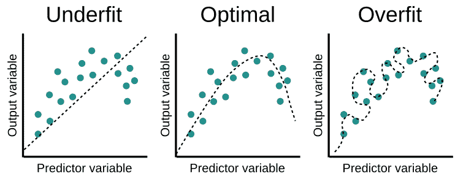
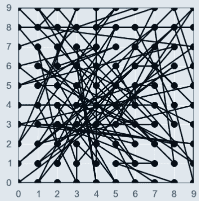
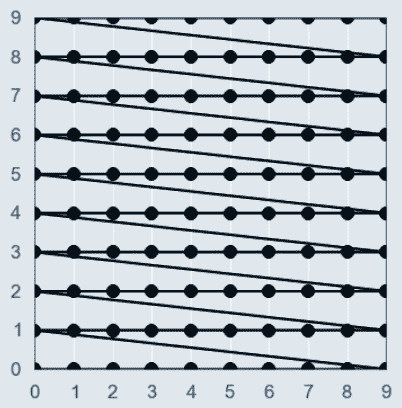
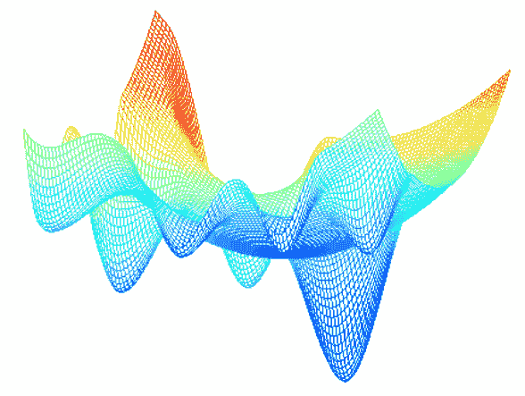
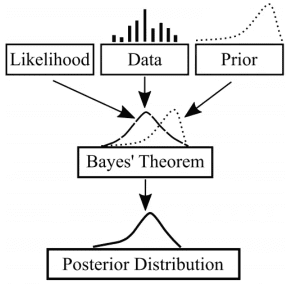

# 9

# 探索优化技术

本章主要旨在回答“为什么在解决问题时优化是必要的？”这个问题。数学优化，或称数学规划，是一种强大的决策工具，在第一部分的各章中已进行了深入讨论。重要的是要回忆一个简单的事实：优化通过减少误差（本质上是预测数据与实际数据之间的差距）来为问题提供最佳结果。优化是有代价的；几乎所有的优化问题都通过成本来描述，例如金钱、时间和资源。这个成本函数就是误差函数。如果一个商业问题具有明确的目标和约束条件，例如航空和物流行业，那么数学优化就可以用于高效的决策制定。

在**机器学习**（**ML**）问题中，成本通常称为**损失函数**。机器学习模型对趋势进行预测或对数据进行分类，而训练一个模型的过程本质上就是优化过程，因为该过程的每次迭代都旨在提高模型的准确性并降低误差范围。选择超参数的最佳值是确保模型准确高效运行的关键。超参数是机器学习模型中的元素（例如，学习率、簇的数量等），它们经过调优以使特定数据集适应模型。简而言之，它们是控制学习过程的参数值。优化是一个迭代过程，意味着在大多数情况下，机器学习模型在每次迭代后变得更加准确，并且在预测结果或分类数据方面变得更好。

机器学习与数学优化的正确结合对于某些商业问题是有用的。例如，机器学习模型的输出可以决定优化模型的范围，特别是在路径规划问题中，其中使用机器学习进行预测性维护和聚类，其结果被输入到数学模型中，以创建最佳路径。同样，机器学习模型也可以从数学模型中学习。通过数学模型获得的决策变量的初始值可以用于机器学习模型，不仅预测决策变量的最佳值，还可以帮助加速优化算法的性能。

ML 优化是通过使用一系列技术的算法来优化机器学习模型。优化过程寻找最有效的配置或超参数集，以使模型适应特定的使用案例（数据集）或商业问题。

总结来说，机器学习（ML）是数据驱动的，而优化是算法驱动的。每个机器学习模型都遵循最小化成本函数的原则；因此，优化在其核心上是一个超集。

本章包含以下主题：

+   优化机器学习模型

+   运筹学中的优化

+   演化优化

下一节将探讨用于优化机器学习模型的各种方法和技术，以便找到最佳的超参数集。

# 优化机器学习模型

优化的概念是机器学习模型的核心。机器学习有助于进行聚类、检测异常、从历史数据预测未来等。然而，当涉及到最小化业务成本、寻找业务设施的最佳位置等问题时，我们所需要的是一个数学优化模型。

本节将讨论机器学习中的优化问题。优化确保了机器学习模型的结构和配置尽可能有效，以实现其建立的目标。优化技术可以自动化测试不同的模型配置。最佳配置（超参数集）具有最小的误差范围，从而为给定的数据集提供最准确的模型。对于机器学习模型，正确的超参数优化可能是一个繁琐的过程，因为无论是未优化（欠拟合）还是过度优化（过拟合）的模型都会失败。过拟合是指模型过于贴合训练数据，导致在新数据上的预测不准确。欠拟合是指模型训练不足，使其在训练数据和新数据上都表现不佳。超参数可以通过手动搜索获得，这是一种通过反复试验进行的繁琐方法。欠拟合、最佳拟合和过拟合的模型在*图 9.1*中进行了说明，如下所示：



图 9.1：未优化（L）和过度优化（R）模型拟合

优化的主要技术包括**随机搜索**、**网格搜索**超参数和**贝叶斯优化**，这些都将在接下来的小节中讨论。

## 随机搜索

随机抽样搜索空间并确定最有效的超参数配置集的过程叫做随机搜索。随机搜索技术可以发现新的超参数组合，从而优化机器学习模型。搜索过程中的迭代次数需要设置，这限制了这些新组合的数量，否则过程会变得更加耗时。它是一个高效的过程，因为它用随机性替代了穷举搜索。搜索空间可以被看作是一个空间中的体积，每个维度代表一个超参数，体积中的每个点或向量代表一个模型配置。优化过程包括定义搜索空间。

搜索空间是 Python 代码中的一个字典，`scikit-learn` 库提供了调节模型超参数的函数。这里提供一个分类模型的随机搜索代码示例：

```py
import pandas as pd
from scipy.stats import loguniform
from sklearn.linear_model import LogisticRegression
from sklearn.model_selection import RepeatedStratifiedKFold
from sklearn.model_selection import RandomizedSearchCV
dataframe = pd.read_csv('sonar.csv')
data = dataframe.values
X, y = data[:, :-1], data[:, -1]
#Model
model = LogisticRegression()
cv = RepeatedStratifiedKFold(n_splits = 10, n_repeats = 3, random_state = 1)
#Define search space
space = dict()
space['solver'] = ['newton-cg', 'lbfgs', 'liblinear']
space['penalty'] = ['none', 'l1', 'l2', 'elasticnet']
space['C'] = loguniform(1e-5, 100)
search = RandomizedSearchCV(model, space, n_iter = 500, scoring = 'accuracy',
                            n_jobs = -1, cv = cv, random_state = 1)
result = search.fit(X, y)
print('Best Score: %s' % result.best_score_)
print('Best Hyperparameters: %s' % result.best_params_)
```

使用的数据集是一组由在各种条件下将声纳信号反射到金属圆柱体上获得的 60 个模式。每个模式是一组介于 0.0 和 1.0 之间的数字，每个数字代表在一段时间内集成的频率带内的能量。每个记录关联的标签要么是*R*（表示物体为岩石），要么是*M*（表示物体为金属圆柱体或地雷）。数据可以在 GitHub 仓库中找到：[`github.com/ranja-sarkar/dataset`](https://github.com/ranja-sarkar/dataset)。

还提供了一个用于线性回归模型的随机搜索示例代码。保险数据集包含两个变量，即索赔数量和所有索赔的总支付金额（以瑞典克朗计），可以在 GitHub 仓库中找到：[`github.com/ranja-sarkar/dataset`](https://github.com/ranja-sarkar/dataset)。

回归任务和分类任务的区别在于选择模型的性能评分协议。`scikit-learn` Python 库中的超参数优化方法假设好的性能评分为接近零的负值（对于回归任务），其中零表示完美的回归模型：

```py
import pandas as pd
from scipy.stats import loguniform
from sklearn.linear_model import Ridge
from sklearn.model_selection import RepeatedKFold
from sklearn.model_selection import RandomizedSearchCV
df = pd.read_csv('auto-insurance.csv')
data = df.values
X, y = data[:, :-1], data[:, -1]
#Model
model = Ridge()
cv = RepeatedKFold(n_splits = 10, n_repeats = 3, random_state = 1)
#Define search space
space = dict()
space['solver'] = ['svd', 'cholesky', 'lsqr', 'sag']
space['alpha'] = loguniform(1e-5, 100)
space['fit_intercept'] = [True, False]
space['normalize'] = [True, False]
search = RandomizedSearchCV(model, space, n_iter = 500, scoring =      'neg_mean_absolute_error', n_jobs = -1, cv = cv, random_state = 1)
result = search.fit(X, y)
print('Best Score: %s' % result.best_score_)
print('Best Hyperparameters: %s' % result.best_params_)
```

代码的运行时间取决于搜索空间的大小和系统处理器的速度。代码中的`result`类提供了结果，其中最重要的值是最佳得分，用于表示模型和超参数的最佳表现。知道最佳的超参数集后，可以定义一个新模型，将超参数设置为已知值，并在可用数据上拟合该模型。然后，这个模型可以用于对新数据进行预测。参数空间中随机配置的数量类似于*图 9.2*，该图表明随机搜索在低维数据中表现最佳：



图 9.2：随机搜索

在下一小节中，我们将详细阐述网格搜索在分类和回归模型优化中的应用。

## 网格搜索

评估机器学习模型已知超参数值有效性的过程是网格搜索。每个超参数在搜索空间的网格上表示为一个维度，网格中的每个点都要进行搜索和评估。网格搜索非常适合检查直观的猜测和已知在一般情况下表现良好的超参数组合。如前所述，优化过程涉及定义搜索空间（在 Python 中为字典），可以将其视为一个体积，其中每个维度表示一个超参数，每个点（向量）表示一个模型配置。这里必须定义一个离散网格。换句话说，网格搜索空间取离散值（可以是对数尺度），而不是随机搜索空间中使用的对数均匀分布。

以下给出一个使用相同数据集（`sonar.csv`）进行分类模型网格搜索的示例代码，该数据集也用于随机搜索算法：

```py
import pandas as pd
from scipy.stats import loguniform
from sklearn.linear_model import LogisticRegression
from sklearn.model_selection import RepeatedStratifiedKFold
from sklearn.model_selection import GridSearchCV
dataframe = pd.read_csv('sonar.csv')
data = dataframe.values
X, y = data[:, :-1], data[:, -1]
#Model
model = LogisticRegression()
cv = RepeatedStratifiedKFold(n_splits = 10, n_repeats = 3, random_state = 1)
#Define search space
space = dict()
space['solver'] = ['newton-cg', 'lbfgs', 'liblinear']
space['penalty'] = ['none', 'l1', 'l2', 'elasticnet']
space['C'] = [1e-5, 1e-4, 1e-3, 1e-2, 1e-1, 1, 10, 100]
search = GridSearchCV(model, space, scoring = 'accuracy', n_jobs = -1, cv = cv)
result = search.fit(X, y)
print('Best Score: %s' % result.best_score_)
print('Best Hyperparameters: %s' % result.best_params_)
```

以下提供了一个使用相同数据集（`auto-insurance.csv`）进行线性回归模型网格搜索的示例代码，该数据集也用于随机搜索算法。可以比较使用随机搜索和网格搜索算法为该数据集获得的最佳超参数，以估算哪种算法对该数据集表现更好：

```py
import pandas as pd
from sklearn.linear_model import Ridge
from sklearn.model_selection import RepeatedKFold
from sklearn.model_selection import GridSearchCV
df = pd.read_csv('auto-insurance.csv')
data = df.values
X, y = data[:, :-1], data[:, -1]
#Model
model = Ridge()
cv = RepeatedKFold(n_splits = 10, n_repeats = 3, random_state = 1)
#Define search space
space = dict()
space['solver'] = ['svd', 'cholesky', 'lsqr', 'sag']
space['alpha'] = [1e-5, 1e-4, 1e-3, 1e-2, 1e-1, 1, 10, 100]
space['fit_intercept'] = [True, False]
space['normalize'] = [True, False]
search = GridSearchCV(model, space, scoring = 'neg_mean_absolute_error', n_jobs = -1, cv = cv)
result = search.fit(X, y)
print('Best Score: %s' % result.best_score_)
print('Best Hyperparameters: %s' % result.best_params_)
```

使用随机搜索和网格搜索获得的分类和回归模型数据集的分数几乎相同。针对给定数据集选择优化技术取决于具体的应用场景。虽然在某些情况下，随机搜索可能会导致更好的性能，但它需要更多的时间，而网格搜索则适用于快速搜索那些通常表现良好的超参数。超参数的值像矩阵一样排列，如*图 9**.3*所示，类似于一个网格：



图 9.3：网格搜索

另一种方法，称为贝叶斯优化，其搜索过程不同于前述两种方法，将在以下小节中讨论。

## 贝叶斯优化

使用概率进行全局优化的有向迭代方法是贝叶斯优化。这是一个高斯过程，对于连续超参数的优化收敛速度较快，即在连续搜索空间中（*图 9**.4*）。在贝叶斯优化中，会构建一个函数的概率模型，并将超参数映射到在验证数据集上评估的目标。该过程基于当前模型评估一个超参数配置，然后更新模型，直到达到最优点，并尽量在最少的步骤中找到全局最优解。在大多数情况下，它比随机搜索更高效、有效。优化景观（多个局部极小值）与一个全局极小值的示例如下：



图 9.4：优化景观（响应面）

贝叶斯优化结合了关于目标函数的先验信念（边际概率），并通过从该函数中抽取样本来更新先验信念，从而获得一个后验信念（条件概率），该后验信念能更好地逼近该函数，如*图 9**.5*所示。该过程会不断重复，直到找到目标函数的极值点或资源耗尽：



图 9.5：贝叶斯统计

贝叶斯搜索通常在数据量大、学习速度慢且需要最小化调优时间时非常有益。`scikit-optimize`库提供了用于机器学习模型贝叶斯优化的函数。以下是一个在分类问题中使用贝叶斯方法进行超参数调优的示例代码：

```py
import numpy as np
from sklearn.datasets import make_blobs
from sklearn.model_selection import cross_val_score
from sklearn.neighbors import KNeighborsClassifier
from skopt.space import Integer
from skopt.utils import use_named_args
from skopt import gp_minimize
#Generate classification dataset
X, y = make_blobs(n_samples = 500, centers = 3, n_features = 2) ##3 class labels in data
#Model kNN
model = KNeighborsClassifier()
#Define search space
search_space = [Integer(1, 5, name = 'n_neighbors'), Integer(1, 2, name = 'p')]
@use_named_args(search_space)
def evaluate_model(**params):
    model.set_params(**params)
    result = cross_val_score(model, X, y, cv = 5, n_jobs = -1, scoring = 'accuracy')
    estimate = np.mean(result)
    return 1.0 – estimate
#Optimize
result = gp_minimize(evaluate_model, search_space)
print('Accuracy: %.3f' % (1.0 - result.fun))
print('Best Parameters: n_neighbors = %d, p = %d' % (result.x[0], result.x[1]))
```

用于逼近目标函数的模型称为**代理模型**，而后验概率则是一个代理目标函数，可用于估算候选样本的成本。后验概率用于从搜索空间中选择下一个样本，执行此操作的技术称为**获取函数**。贝叶斯优化在函数评估成本较高或目标函数形式复杂（非线性、非凸、高维或噪声很大）时效果最佳——例如，在深度神经网络中。

优化过程通过减少机器学习模型预测中的错误或损失，从而提高模型的准确性。机器学习的基本前提依赖于某种形式的函数优化，以便将输入几乎精确地映射到预期的输出。

在接下来的部分，我们将学习运筹学中的数学优化。

# 运筹学中的优化

**运筹学**这一术语源于第一次世界大战，当时英国军方将一群科学家聚集在一起，旨在最有效地分配不足的资源（如食物、药品等）到不同的军事行动中。因此，这一术语暗示了优化，即在约束条件下最大化或最小化目标函数，通常用于复杂问题和高维度问题。运筹问题通常包括规划工作班次或为大组织创建时间表、为大商店设计客户设施、选择可用资金的投资、供应链管理和库存管理，这些都可以通过一系列变量及其关系来表述或形式化为数学问题。

在运筹学中，商业问题被映射到一个更低层次的通用问题，该问题足够简洁，可以用数学符号来描述。这些通用问题反过来可以使用更高层次的语言来表达；例如，资源和活动用于描述调度问题。更高层次的语言是问题特定的，因此通用问题可以使用建模范式来描述。建模范式是一组规则和实践，允许使用更低层次的数据结构（如矩阵）来表示更高层次的问题。这些数据结构或矩阵会传递到最后一步的抽象层次，即算法。最突出的建模范式包括线性规划、整数规划和混合整数规划，所有这些方法都使用线性等式约束。有一系列算法用于解决这些线性规划问题。搜索算法（如分支限界法）用于解决整数规划问题，而单纯形算法则用于线性规划建模范式。

以下数据演示了如何通过优化来解决背包问题（*图 9.6a* *和 9.6b*）：


图 9.6a：背包问题

假设约束条件是背包只能携带最大 2.9 公斤的物品，而所有物品的总重量为 3.09 公斤。物品的价值有助于选择最优的物品数量。随着物品数量的增加，问题变得更加复杂，通过尝试所有可能的物品组合来求解，所需时间会显著增加：


图 9.6b：具有另一个变量的背包问题

目标函数是价值，必须最大化。必须选择最佳物品，以满足总重量不超过 2.9 公斤的约束条件。使用求解器（在此情况下为 pulp）来解决此线性规划问题，代码如下所示。决策变量（待确定）由  给出。若选择该物品，变量为 1；若未选择该物品，变量为 0：

```py
from pulp import *
#value per weight
v = {'Sleeping bag': 4.17, 'Pillow': 5.13, 'Torch': 10.0, 'First Aid Kit': 8.0, 'Hand sanitiser': 2.0}
#weight
w = {'Sleeping bag': 1.2, 'Pillow': 0.39, 'Torch': 0.5, 'First Aid Kit': 0.5, 'Hand sanitiser': 0.5}
limit = 2.9
items = list(sorted(v.keys()))
# Model
m = LpProblem("Knapsack Problem", LpMaximize)
# Variables
x = LpVariable.dicts('x', items, lowBound = 0, upBound = 1, cat = LpInteger)
#Objective
m += sum(v[i]*x[i] for i in items)
#Constraint
m += sum(w[i]*x[i] for i in items) <= limit
#Optimize
m.solve()
#decision variables
for i in items:
    print("%s = %f" % (x[i].name, x[i].varValue))
```

执行此代码时，将产生以下输出：

```py
x_First_Aid_Kit = 1.0
x_Hand_sanitizer = 0.0
x_Pillow = 1.0
x_Sleeping_bag = 1.0
x_Torch = 1.0
```

根据结果（最优解），背包中不应该携带手部消毒液。这是一个简单的整数规划问题，因为决策变量被限制为整数。以类似的方式，其他实际的商业问题，如生产规划，都是通过数学优化来解决的，在这些问题中，选择合适的资源来最大化利润等。当运筹学与机器学习预测相结合时，数据科学实际上转变为决策科学，帮助组织做出可行的决策。

在下一节中，我们将学习关于**进化优化**的内容，这受到自然界中观察到的优化过程的启发，例如物种迁移、鸟群和蚂蚁群。

# 进化优化

进化优化利用模仿自然界内选择过程的算法。例如通过自然选择优化的遗传算法。每次超参数值的迭代就像是遗传学中的突变，进行评估和改变。这个过程通过重新组合的选择一直持续，直到达到最有效的配置。因此，每一代在优化中都会随着每次迭代而改进。遗传算法经常用于训练神经网络。

进化算法通常包括三个步骤：初始化、选择和终止。更适应的生成会像自然选择那样生存和繁殖。一般来说，在问题的约束条件下随机创建一个广泛范围的解初始种群。种群包含了解决问题的任意数量的可能解，或者这些解大致集中在被认为是理想解的周围。然后根据适应度（或目标）函数对这些解进行评估。一个好的适应度函数能够代表数据并计算一个解对特定问题可行性的数值。一旦计算出所有解的适应度，就会选择得分最高的解。可能存在多个适应度函数导致多个最优解，这时会使用决策者根据一些关键指标缩小到一个单一问题特定解。*图 9**.7* 描述了这些算法的步骤如下：


图 9.7: 进化算法的步骤

最优解会成为算法的下一代。这些解通常具有上一代解的特征混合。新的遗传材料被引入到这个新的代中，从数学角度来说，这意味着引入新的概率分布。这一步骤是突变，没有它很难达到最优结果。最后一步是终止，当算法达到性能阈值或最大迭代次数（运行时间）时。然后选择并返回最终解。

进化算法是一种基于启发式方法的问题解决方法，使用确定性方法耗时过长。它是一种随机搜索技术，通常应用于组合问题或与其他方法一起快速找到最优解。

# 摘要

在这一章中，我们了解了优化技术，尤其是那些用于机器学习的技术，旨在找到适合数据集的机器学习模型的最有效超参数配置。优化后的机器学习模型具有最小的错误，从而提高预测的准确性。没有优化，就没有模型的学习或发展。

我们讨论了在运筹学中使用的优化算法，以及在深度学习模型优化和更复杂问题的网络建模中应用的进化算法。

在本书的最后一章，我们将学习如何选择标准技术来优化机器学习模型。对于给定的问题，可能存在多个最优解，并且可能有多种优化技术可以达到这些解。因此，在构建模型并解决相关业务问题时，选择合适的技术至关重要。
