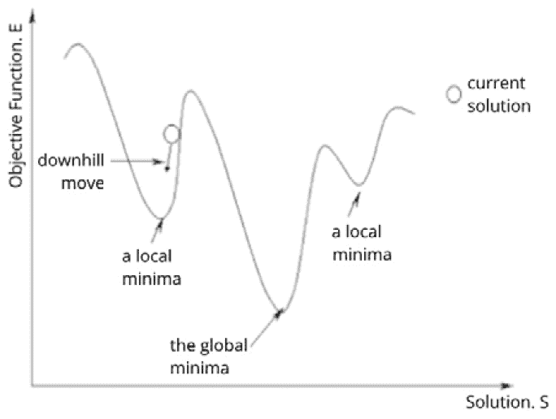
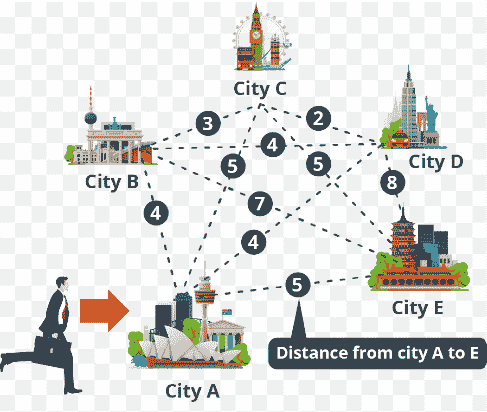
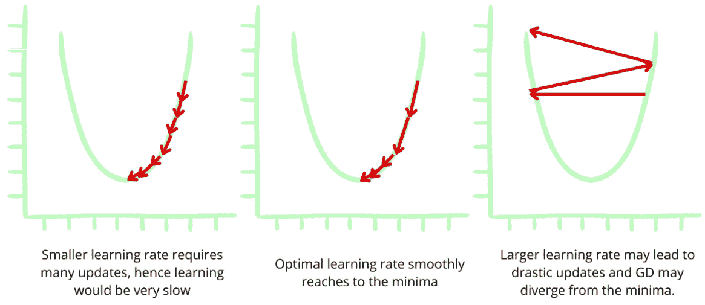
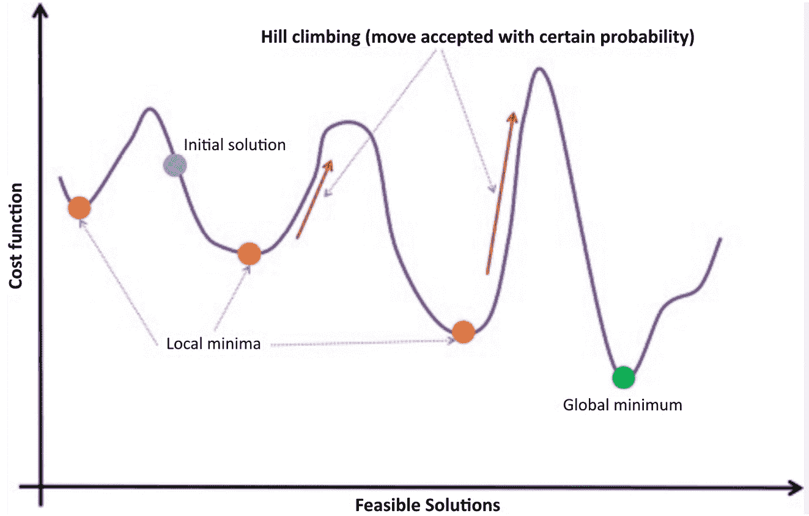

# 10

# 机器学习的优化技术

我们在上一章中讨论了数学优化技术及其在商业问题中的必要性，这些问题需要最小化成本（误差）函数，以及在预测建模中，机器通过历史数据学习来预测未来。在**机器学习**（**ML**）中，成本是需要最小化的损失函数或能量函数。在大多数情况下，知道应该为给定的机器学习模型选择哪种优化算法是具有挑战性的。优化是一个迭代过程，旨在最大化或最小化目标函数，在每一步之间，总是存在一个折衷，即所采取的迭代步骤数量与达到下一步所需的计算难度之间的权衡。本章提供了如何根据问题（因此也就是目标）选择优化算法的提示。优化算法的选择取决于多个因素，包括要解决的具体问题、相关数据集的大小和复杂性，以及可用的资源，如计算能力和内存。

直接搜索和随机搜索算法是为目标函数的导数不可用时设计的。严格来说，优化算法可以分为使用导数的和不使用导数的两类。依赖于梯度下降的优化算法快速且高效；然而，它们需要目标函数具有良好的行为才能有效工作。如果函数具有复杂的特性，我们可以采用穷举搜索，但这需要极长的时间（*图 10.1*）。有些比梯度下降更复杂的优化方法，如**遗传算法**（**GAs**）和模拟退火，这些方法需要比梯度下降更多的计算时间和步骤，但即使在非常难以找到的情况下，它们仍然能够发现最优点。

图 10.1：优化算法的性能

优化算法可以是无导数的，也可以是基于梯度的。用于机器学习模型的优化算法一般可以分为两类：一类是使用目标函数的一阶导数（称为梯度），另一类是使用目标函数的二阶导数（称为 Hessian 矩阵）来进行搜索。

本章涵盖以下主题：

+   常规优化算法

+   复杂优化算法

复杂的优化算法包括可微分和不可微分的函数。接下来的两个部分将介绍常规优化算法和复杂优化算法的示例。

# 常规优化算法

在机器学习中，最常见的优化问题是连续函数优化，其中函数的输入参数是（实数）数值。在训练机器学习模型时，优化的目标是最小化损失函数，直到它达到或收敛到一个局部最小值（值）。

全局优化使用整个搜索域，而局部优化仅探索邻域，这需要知道初步的近似值，如*图 10.2a*所示。如果目标函数具有局部最小值，那么局部搜索算法（例如梯度法）也可能会困在某个局部最小值中。如果算法达到了局部最小值，那么几乎不可能在搜索空间中找到全局最小值。在离散搜索空间中，邻域是一个有限集合，可以被完全探索，而在连续搜索空间中，目标函数是可微分的（例如梯度方法、类似牛顿法的算法）。

图 10.2a：局部最小值与全局最小值

函数可能是离散性质的，取离散变量，且出现在组合优化问题中（例如**旅行商问题**（**TSP**），如*图 10.2b*所示），其中可行解也是离散的。一般而言，在连续空间中搜索最优解比在离散空间中搜索更高效。

图 10.2b：TSP 是一个组合优化问题

括号法算法是一种优化算法，具有一个输入变量，且已知最优解存在于特定范围内。它们假设在已知的搜索空间范围内存在一个单一的最优解（单峰目标函数）。当导数信息不可用时，这些算法有时甚至可以被使用。二分法优化就是其中一个例子。

具有多个输入变量的优化算法是局部下降算法。局部下降过程涉及在搜索空间中选择一个方向，然后沿所选方向在一条线或超平面上执行括号搜索。局部下降也称为线搜索算法；然而，在搜索空间中优化每次方向移动的计算开销较大。梯度下降是线搜索算法的经典例子。

按照是否使用梯度（一级导数）或梯度的梯度（二级导数）信息在搜索空间中移动以找到最优点的方式对算法进行分组，接下来的子章节将对此进行讨论。

## 一阶算法

目标函数的一阶导数（梯度或斜率）用于一阶优化算法。一阶算法通常称为梯度下降（或最速下降法）。与梯度下降不同，正则化算法使用预定义的目标函数。机器学习模型通过最小化目标（损失函数）进行学习，当模型发生过拟合时，会在此基础上使用正则化方法。

在搜索空间中，梯度是通过步长（称为学习率）计算的，学习率是一个超参数，控制着在空间中移动的距离（*图 10.3*）。如果步长过小，则会导致寻找最优点的时间过长；如果步长过大，则可能完全错过最优点。优化算法有许多超参数，如学习率，这些超参数会对机器学习模型的性能产生重大影响。

图 10.3: 梯度下降中的学习率

梯度下降的变体包括批量梯度下降、迷你批量梯度下降和**随机梯度下降**（**SGD**）。批量梯度下降是针对整个训练数据集（所有训练样本）计算梯度，而 SGD 则是针对每个训练样本计算梯度。迷你批量则是针对每个（迷你）子集的训练样本进行更新，因此能够兼顾两者的优点。批量梯度下降可能非常慢，而迷你批量梯度下降则效率很高。迷你批量梯度下降非常适合处理大规模数据的问题。SGD 会进行频繁更新，因此目标函数波动较大，但它能够更好地收敛到最优解。SGD 常用于训练人工神经网络。

图 10.4: 一阶算法（梯度下降）示例

对梯度下降优化过程的小幅扩展产生了几种算法，例如动量法、**自适应梯度**（**AdaGrad**）和**自适应矩估计**（**Adam**）。例如，动量法是一种帮助加速 SGD 沿相关方向收敛的技术（*图 10.4*），从而实现更快的收敛。像 AdaGrad 和 Adam 这样的算法为每个参数计算自适应学习率，帮助函数快速收敛。然而，Adam 可能是处理稀疏数据时的最佳选择。Adam 同时使用梯度和梯度的二阶矩。AdaGrad 适用于数据噪声非常大以及目标函数条件不良的问题；即，目标函数的不同维度具有不同的尺度。

## 二阶算法

目标函数的二阶导数（海森矩阵）用于二阶优化算法，前提是可以计算或近似计算海森矩阵（曲率）。这些算法用于具有单一实变量的一元目标函数，其中少数优化时显示出最小值或最大值，但在其定义域（搜索空间）中为鞍点。牛顿法是二阶优化算法的一个例子。在优化中，梯度下降（一阶）与牛顿法（二阶）的比较如图*10**.5*所示。

到寻找路径](https://example.org/img/Figure_10_06_B18943.jpg)

图*10**.5*：梯度下降（绿色）和牛顿法（红色），在极小学习率条件下从到寻找路径。

这些算法在神经网络中表现更好；然而，当维度或参数数量巨大时，计算和存储变得具有挑战性。为了成功使用二阶算法，必须简化矩阵，通常是通过简化海森矩阵的形式来完成。

接下来的章节详细阐述了目标函数的可微性，这决定了在给定问题中选择一般（在本节讨论的）或复杂的优化算法。

# 复杂的优化算法

目标函数的性质有助于选择用于优化给定业务问题的算法。关于函数的信息越多，优化函数就越容易。最重要的是，目标函数可以在搜索空间中的任何点处被微分。

## 目标函数的可微性

可微的目标函数是指在输入空间中的任意点都可以计算出导数的函数。导数（斜率）是该点函数变化的速率。海森矩阵是函数导数变化的速率。微积分帮助分析优化简单可微函数。对于可微的目标函数，使用基于梯度的优化算法。然而，有些目标函数的导数无法计算，通常是非常复杂（噪声多、多模态等）的函数，这些被称为非可微目标函数。也可能有不连续的目标函数，其导数只能在搜索空间的某些区域计算。随机和群体算法处理此类函数，因此有时被称为黑盒算法。

当目标函数的解析形式不可得时，一般使用基于仿真的优化方法。下一小节简要介绍了在使用经典方法找到可行解具有挑战性时，考虑的算法，这些算法要么计算，要么基于关于目标函数导数的假设进行构建。

## 直接法与随机算法

直接法与随机优化算法用于目标函数的导数未知或无法计算的情况，即搜索空间是离散的。前者是确定性的，假设目标函数是单峰的（即只有一个全局最优解）。直接搜索通常被称为模式搜索，因为它通过几何形状有效地在搜索空间中导航。梯度信息通过目标函数进行近似，并用于启动搜索空间中的线性搜索，最终（通过重复的线性搜索）确定最优解区域。Powell 方法是直接搜索算法的一个例子。它是一种无梯度方法，因为它优化的函数是不可微分的。

另一方面，随机算法利用全局搜索中的随机性，这也就是“随机”名称的来源。它们通常涉及对目标函数的抽样，可以处理具有误导性局部极值的问题。模拟退火（*图 10.6*）是一个随机搜索算法的例子，即全局优化，它偶尔会接受较差的初始配置。模拟退火是一种概率技术，用于解决无约束和有约束的优化问题。它是一种元启发式方法，用于在物理过程的大搜索空间中近似全局优化，其中系统能量最小化。

图 10.6：模拟退火是一种随机优化算法

像遗传算法（GAs）这样的群体优化算法也是随机的，通常用于具有多个全局极值和不平滑（高度噪声）的多峰目标函数。这些算法维持一个候选解的群体，从而增强了搜索的鲁棒性，提高了克服局部极值的可能性。它们的效率对描述问题时所使用的变量非常敏感。与其他启发式算法一样，进化算法有许多自由度，因此很难调整以获得良好的模型性能。

遗传算法（GA）借鉴了进化的类比，通过保持群体中个体的数量均衡来进行进化。这些个体构成一代人，并通过随机选择一对个体来生成新的一代，其中较适应的个体更可能被选中。GA 被用于通过初始化（种群）、适应度分配（给个体分配适应度）和选择最佳（重组）解决方案来解决复杂的优化问题。一个庞大的研究社区正在致力于遗传算法的研究，以便在大多数实际问题中加以利用。

# 总结

在本章中，我们了解了在优化机器学习模型时，应该考虑哪种优化算法来最小化（连续）目标函数，这些函数通常出现在机器学习模型中。此类模型具有对输入变量的实值评估，并涉及局部搜索。目标函数的可微性可能是考虑优化算法类型时最重要的因素。

本章并没有列出完整的优化机器学习模型的算法清单，但捕捉了主要算法的精髓以及它们的基本行为，并通过示例加以说明。还涉及了确定性优化和随机优化的概念，后者包括遗传算法（GA），其在现实世界问题中的应用正在不断发展。

# 结语

本书主要面向职业生涯初期的数据科学家。假设本书的读者已经具备线性代数、基础统计学、微分方程、基本数值算法、数据类型和数据结构的知识。话虽如此，我们必须意识到，将业务问题转化为数学公式是一门艺术。

在探索数据科学的世界时，理解经典数学模型的相关性非常重要，并了解如何将其与机器学习模型结合使用，以解决通常复杂的业务问题。混合（综合）模型可以促进更好的决策，尤其在敏感领域的高风险决策中至关重要。数学优化通常能够提升机器学习模型，帮助最佳地解释决策变量与相关数据、商业目标之间的关系，以及找到业务问题的最佳解决方案。然而，简单的（纯粹的或未混合的）模型往往更具可解释性，而在构建复杂模型时，我们需要考虑效率和成本等因素。

我想通过向以下领域专家表示感谢并衷心致谢来结束本书：

+   Brandon Rohrer ([`github.com/brohrer`](https://github.com/brohrer))

+   Sebastian Raschka ([`github.com/rasbt`](https://github.com/rasbt))

+   Jason Brownlee ([`www.linkedin.com/in/jasonbrownlee/`](http://fileName.py))

他们的在线文章、书籍、课程和教程/博客激励我去学习、重新学习，并深入探索数据科学和数学优化的世界。我的学习和工作经验最终在这本书中得到了体现。
