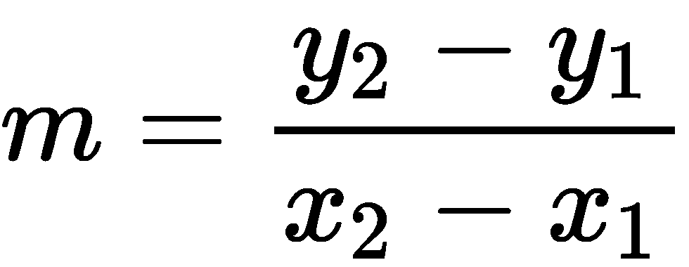
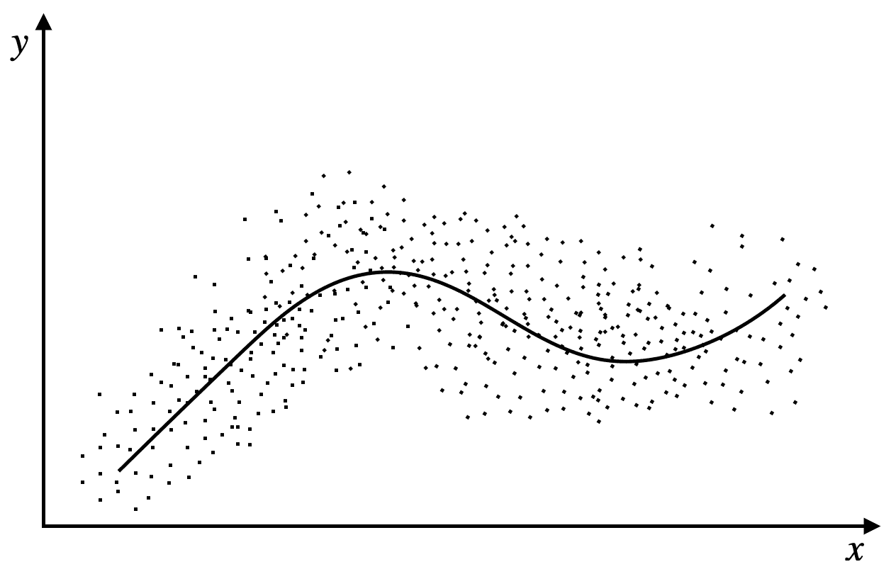
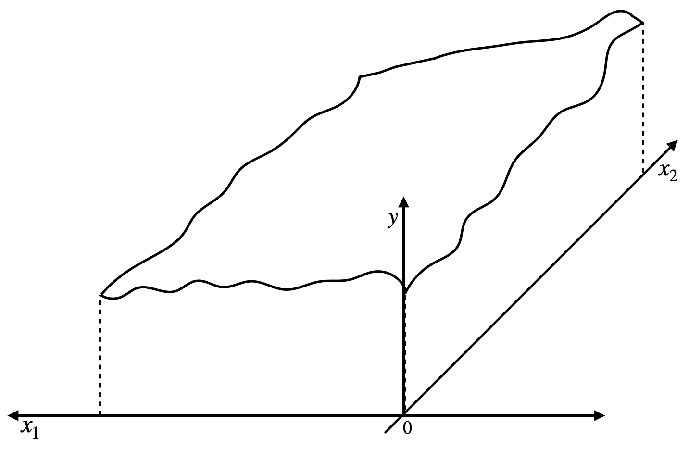
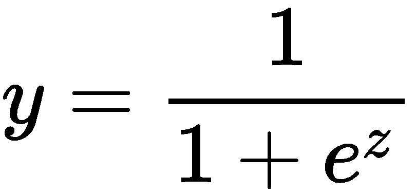
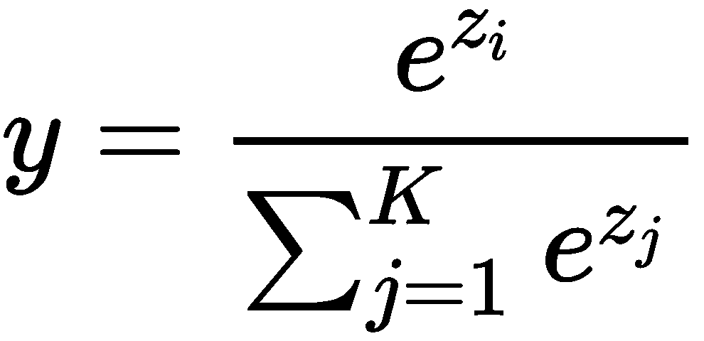

# 线性神经网络

在本章中，我们将讨论一些机器学习的概念。希望你已经学习过并理解机器学习的相关内容。因此，本章将作为对本书中需要的某些概念的复习，而不是全面学习所有机器学习方法。

在本章中，我们将重点讲解线性神经网络，这是最简单的神经网络类型，常用于诸如线性回归、多项式回归、逻辑回归和 softmax 回归等任务，这些任务在统计学习中最为常见。

我们使用回归来解释一个或多个自变量与因变量之间的关系。本章中我们将学习的概念对于进一步理解机器学习的工作原理至关重要，尤其是在下章深入了解深度神经网络之前。

本章将涵盖以下主题：

+   线性回归

+   多项式回归

+   逻辑回归

# 线性回归

回归的目的是找出数据（用 *x* 表示）与其对应输出（用 *y* 表示）之间的关系，并进行预测。所有回归问题的输出都是一个实数（![]）。这可以应用于一系列问题，例如预测房价或预测电影评分。

为了能够使用回归，我们需要以下内容：

+   输入数据，可以是标量值或向量。它有时被称为**特征**。

+   训练示例，包含大量的 (*x[i], y[i]*) 对；也就是每个输入的输出。

+   捕捉输入与输出之间关系的函数——模型。

+   损失或目标函数，告诉我们模型的准确度。

+   优化，以最小化损失或目标函数。

在进一步讲解之前，让我们回顾一下第一章，*向量微积分*，在其中我们注意到直线的方程如下：

在这里，*m* 是梯度（或斜率），*b* 是修正项。我们使用以下方程，通过直线上的两个点来找到斜率：

如我们所知，这很容易做到。然而，在**线性回归**中，我们给定了许多 (*x[i], y[i]*) 点，我们的目标是找到最能捕捉关系的最佳拟合线。这条线就是我们模型所学习的内容。我们可以如下表示：

在这里，*ε* 代表误差，我们假设它是高斯分布，*y* 是真实标签，且 ![] 是我们的模型所提供的预测值。

现在让我们考虑一个有多个自变量的案例，我们希望找到一个因变量之间的关系。这种回归方法称为**多元回归**。在这种情况下，每个自变量都会影响预测结果。

在这种情况下，我们的输入将采取如下形式：

这里，*n* 是自变量的数量。

为了找到 ![]，我们可以对所有因变量求平均或将它们加起来，但这**不太可能**给我们期望的结果。假设我们想预测房子的价格；我们的输入可能是地块的平方英尺、卧室数量、浴室数量，以及是否有游泳池。

每个输入都会有一个对应的权重，模型会从数据点中学习这个权重，它最能描述每个输入的重要性。这就变成了如下形式：

或者，我们可以得到如下形式：

我们也可以将其重新写成矩阵形式：

但现在，显然有一个问题——*我们的模型如何学习这些权重和这种关系？* 对我们来说，这很容易，因为我们的脑袋可以瞬间识别模式，我们能够从分析中发现关系。然而，如果我们的机器要学习这种关系，它需要一个指南。这个指南就是损失函数，它告诉模型预测偏差有多大，并指示它需要朝哪个方向移动才能改进。

损失通常是预测值 (![]) 与真实值 (*y[i]*) 之间的距离，我们可以如下表示：

但这仍然没有给我们完整的视图。我们的目标是最小化模型在所有数据样本上的损失，因此我们将所有数据样本的损失求和并取平均。这看起来如下：

训练的目标是找到最佳参数：

在了解了线性回归之后，接下来让我们看看多项式回归的具体内容。

# 多项式回归

线性回归，正如你所想，它并不是一个适用于所有问题的通用解决方案。现实中，变量之间的许多关系并不是线性的；也就是说，一条直线无法捕捉到这些关系。对于这些问题，我们使用前述线性回归的变体——**多项式回归**，它能够捕捉到更多的复杂性，例如曲线。这种方法利用将解释变量应用不同的幂次来发现非线性问题。其形式如下：

或者，我们可能会有以下情况：

这是 ![] 的情况。

如前面的方程所示，这样的模型不仅能够捕捉到一条直线（如果需要的话），还能够生成一个二阶、三阶或 *n^(th)-*阶方程来拟合数据点。

假设我们有以下数据点：

我们可以立即判断，直线无法完成任务，但当我们应用多项式回归时，我们可以看到我们的模型学习拟合曲线，这个曲线类似于正弦波。我们可以在下图中观察到这一点：

现在让我们来看一个案例，我们试图学习一个表面，并且有两个输入，![]，和一个输出， *y*。同样，如下图所示，表面并不平坦；实际上，它相当崎岖：

我们可以使用以下三阶多项式来近似建模：

如果这给出了令人满意的结果，我们可以添加另一个更高阶的多项式（以此类推），直到找到一个能够拟合表面的模型。

# 逻辑回归

还有一种我们在实践中常用的回归方法——**逻辑回归**。假设我们想要判断一封电子邮件是否是垃圾邮件。在这种情况下，我们的 *x**(s)* 值可以是 *!(s)* 出现的次数，或者是邮件中的拼写错误总数。然后， *y* 可以取值为 1（表示垃圾邮件）和 0（表示非垃圾邮件）。

在这种情况下，线性回归将无法发挥作用，因为我们不是在预测一个实际值——我们是在预测电子邮件属于哪个类别。

这通常会呈现如下形式：

如你所见，数据被分成了两个区域——一个代表非垃圾邮件，另一个代表垃圾邮件。

我们可以按以下方式计算：

这里， ![]。

然而，这仅适用于二分类问题。如果我们想要分类多个类别怎么办？那我们可以使用 softmax 回归，它是逻辑回归的扩展。其形式如下：

这是 ![] 和 ![] 的情况。

# 总结

在这一章，我们学习了各种回归形式，例如（多元）线性回归、二次回归、逻辑回归和 softmax 回归。每种模型都帮助我们找出了一个或多个自变量与因变量之间的关系。对一些人来说，这些概念可能显得非常基础，但它们将在我们本书的旅程中为我们提供很大帮助，并帮助我们更深入地理解接下来的概念。

在下一章，我们将学习前馈神经网络。
