函数

> “数学家就像法国人：你对他们说的任何话，他们都会翻译成自己的语言，立刻就变成完全不同的东西。”
> 
> ——约翰·沃尔夫冈·冯·歌德

是时候处理机器学习数学中的下一个大主题了：函数与微积分。我们与函数有何关系？

正如我们之前所见，预测模型无非就是一个多变量参数函数。线性回归？Ax。逻辑回归？σ(Ax)。神经网络？一系列σ(Ax)层，以及其他无数层。

但这不仅仅是对模型的描述，它还包括将模型拟合到数据。比如，对于一个简单的线性回归模型，“训练”就是最小化均方误差；也就是说，寻找


其中 x[i]是训练数据，y[i]是实际标签。这是通过微分完成的，微分是人类最重要的发明之一。（我们是否可以称数学发现为发明，始终是一个持续争论的问题。）

对于一个函数 f(x)，它在 x[0]处的导数定义为


描述 x 的变化率。这里有很多需要解开的谜团：那个奇怪的 lim[x→x[0]]符号是什么意思？比率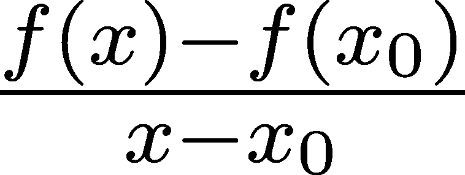表示什么？我们会在适当的时候详细解答。这一切的要点是，微分是梯度下降的推动力，而梯度下降是训练神经网络的首选算法。

但事情并没有到此为止。微分有一个同样重要的对立面：积分。公式

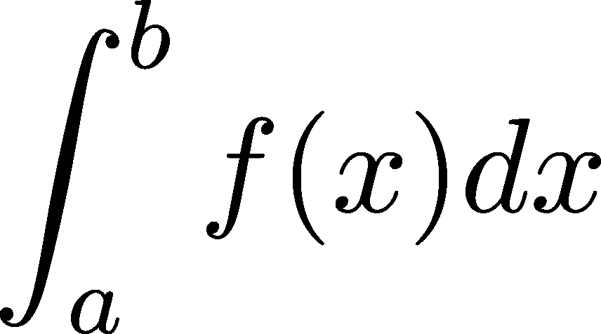

被称为 f(x)的积分，描述了其图形下方的有符号面积。积分在实践中并不那么普遍，但它是理论中的一项重要工具。例如，概率论的一半是围绕它构建的。比如，著名的期望值就是通过积分定义的；多个重要的概率分布也是如此。

在接下来的几章中，我们将深入探讨微积分，即单变量函数的理论。为什么？因为尽管机器学习是多变量的，但我们在这里发展出的思想将为后续所有数学内容奠定基础。让我们开始吧！

## 9.1 理论中的函数

每个人对于函数都有一种直观的理解。在某个时刻，我们所有人都接触过这个概念。对大多数人来说，函数就是在笛卡尔坐标系上画出的用连续线条表示的曲线。

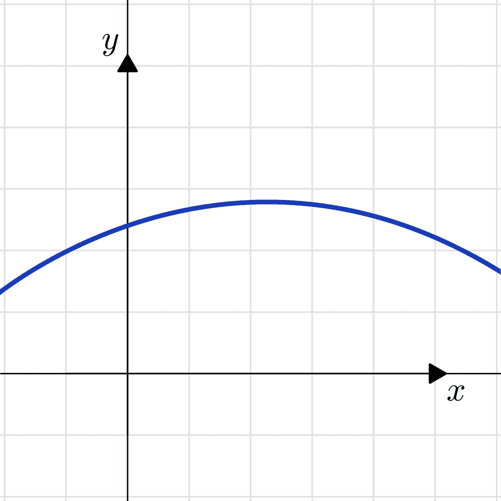

图 9.1：显然看起来像一个函数

然而，在数学中，直觉往往会引导我们得出错误的结论。很多时候，事物的本质与你对它的思考方式之间存在差异——也就是你的心理模型。举个机器学习中实际场景的例子，考虑以下这段代码：

```py
import numpy as np 

def cross_entropy_loss(X, y): 
    #x0022;"/span> 
    Args: 
        X: numpy.ndarray of shape (n_batch, n_dim). 
            Contains the predictions in form of a probability distribution. 
        y: numpy.ndarray of shape (n_batch, 1). 
            Contains class labels for each data point in X. 

    Returns: 
        loss: numpy.float. 
            Cross entropy loss of the predictions. 
    #x0022;"/span> 

    exp_x = np.exp(X) 
    probs = exp_x / np.sum(exp_x, axis=1, keepdims=True) 
    log_probs = - np.log([probs[i, y[i]] for i in range(len(probs))]) 
    loss = np.mean(log_probs) 

    return loss
```

假设你写了这个函数，它现在位于你的代码库的某个地方。根据我们的需求，我们可能会将它视为交叉熵损失，但实际上，它是 Python 语言中一个 579 个字符长的字符串，最终由解释器处理。然而，在使用它时，我们通常会运用一个将这些信息压缩成易于使用的块的心理模型，就像“交叉熵损失”这三个词一样。当我们思考高层次的过程，比如训练神经网络时，像这样的抽象帮助我们走得更远、迈得更大。

但是有时候，事情并不会按照我们的预期进行。当这个函数抛出错误并导致计算崩溃时，交叉熵损失将无法解决问题。这时，我们需要解开定义，并将一切放大来看。之前可能阻碍你思考的东西，现在却变得至关重要。

这些原则不仅对实践适用，同样对理论也适用。数学是在逻辑精确性和清晰理解之间找到平衡的艺术，这两者常常是互相矛盾的目标。

让我们回到最初的起点：数学意义上的函数。正如前面提到的，一种可能的心理模型是通过连续的线条绘制的曲线。这使我们能够直观地思考函数，并回答一些问题。然而，这种特定的心理模型也可能大错特错。

举个例子，图 9.2 描述的是一个函数吗？

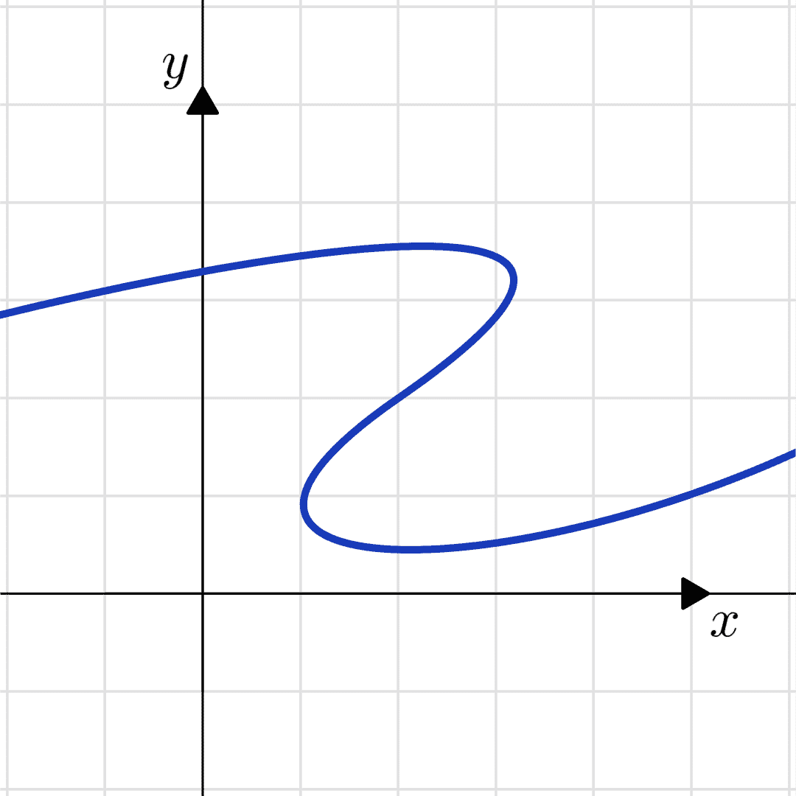

图 9.2：这是一种函数吗？

尽管这条曲线是用连续的线段绘制的，但这并不是一个函数，因为存在多个值对应同一个像，这在函数中是不能发生的。为了避免以后的混淆，我们必须在讨论数学对象时，先打好基础。本章的目标是建立一个基本的词汇表，帮助我们正确理解在机器学习中所使用的对象。

### 9.1.1 函数的数学定义

让我们直接深入探讨函数的精确定义！ （如果第一次阅读时不理解，也不用担心，我会详细解释。这是第一次遇到定义时常有的体验。）

定义 35. （函数）

设 X 和 Y 是两个集合。如果对于每个 x ∈X，最多有一个 y ∈Y 使得 (x,y) ∈f，那么子集 f ⊆X ×Y 就是一个函数。

（集合 X ×Y 表示 X 和 Y 的笛卡尔积。如果你不熟悉这个概念，可以查看附录 C。）

为了简便，我们引入符号


这就是 f 是从 X 到 Y 的函数的简写。

注意，X 和 Y 可以是任何集合。在我们遇到的示例中，这些通常是实数集或向量集，但并没有这样的限制。

为了形象地展示定义，我们可以画出两个集合，并用箭头指向 X 的元素到 Y 的元素。每个元素 (x,y) ∈f 代表一根箭头，指向从 x 到 y。


图 9.3：作为集合间箭头的函数

唯一的标准是任何 x ∈X 处最多只能有一根箭头起始。这就是为什么图 9.2 不是一个函数的原因。

将函数定义为一个子集在数学上是精确的，但非常基础。为了更有用，我们可以通过用公式定义函数来引入抽象，例如：


或简写为 f(x) = x²。我们大多数人在处理函数时都会这样思考。

现在我们已经熟悉了定义，我们应该了解一些函数最基本的结构性质。

### 9.1.2 定义域和值域

我们看到，本质上，函数是集合之间的箭头。在这一点上，我们对它们没有任何有用的了解。什么时候一个函数是可逆的？我们如何找到它们的最小值和最大值？为什么我们要关心这些？你可能有一堆问题。我们将慢慢地、一步一步地解决这些问题。

我们旅程的第一步是关注箭头起始和指向的集合。函数的生命中有两个重要的集合：它的定义域和值域。

定义 36．（函数的定义域和值域）

设 f : X →Y 为一个函数。集合


和


分别称为 f 的定义域和值域。

换句话说，定义域是箭头起始的 X 的子集；值域是箭头指向的 Y 的子集。

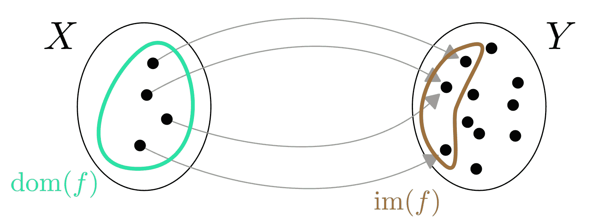

图 9.4：函数的定义域和值域

为什么这很重要？首先，这些直接与函数的可逆性相关。如果你考虑“点和箭头”的心理表征，反转一个函数就像简单地反转箭头的方向一样。当我们什么时候能做这件事？在某些情况下，做这件事甚至可能无法得到一个函数，如图 9.5 所示。

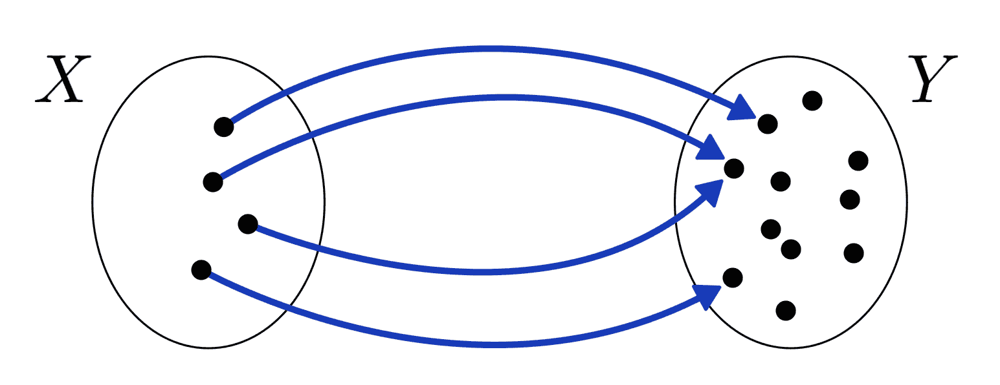

图 9.5：该函数不可逆，因为反转箭头并不能得到一个定义良好的函数。

为了将函数的研究建立在坚实的理论基础上，我们引入了单射、满射和双射函数的概念。

定义 37．（满射、单射和双射函数）

设 f : X →Y 为一个任意的函数。

(a) 如果对于每个 y ∈Y，最多只有一个 x ∈X 使得 f(x) = y，则 f 是单射。（我们常说一个单射 f 是一对一函数。）

(b) 如果对于每个 y ∈Y，存在一个 x ∈X 使得 f(x) = y，则 f 是满射。（我们常说一个满射 f 将 X 映射到 Y 上。）

(c) 如果 f 同时是单射和满射，则 f 是双射。

从箭头的角度看，单射意味着值域中的每个元素最多只有一个箭头指向它，而满射意味着每个元素确实至少有一个箭头指向它。当两者都满足时，我们就得到一个双射函数，一个可以被正确反转的函数。当逆函数 f^(−1) 存在时，它是唯一的。f^(−1) ∘f 和 f ∘f^(−1) 在各自的定义域中都等于恒等函数。

让我们来看一些具体的例子！例如，


既不是单射也不是满射。（如果你一时不理解，可以稍作思考。画个图会有帮助。）

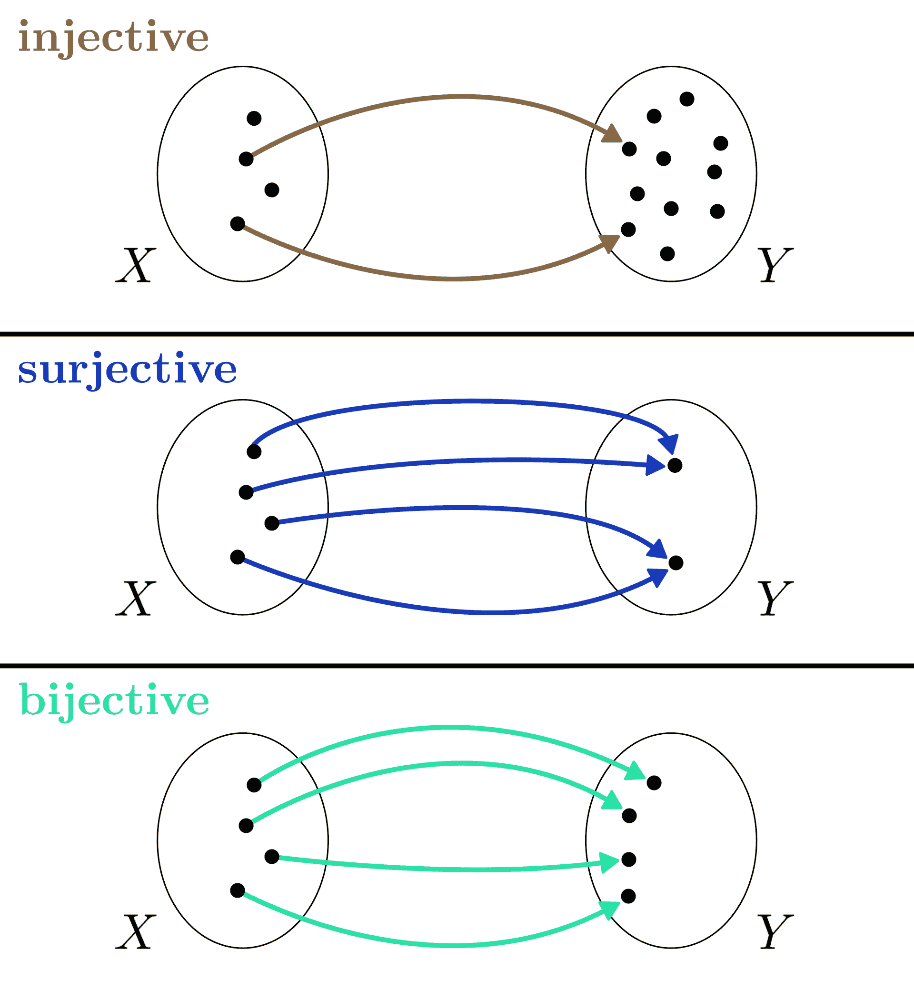

图 9.6：单射、满射和双射函数

相反，


它是双射和可逆的，反函数是 g^(−1)(x) = x^(1∕3)。

可逆函数表现良好，从某种角度来看，它们更容易处理。

### 9.1.3 函数的运算

就像数字一样，函数也有操作定义。两个数字可以相乘或相加，但你能对函数做同样的操作吗？没有任何困难，它们可以相加，并且可以与标量相乘，如下所示


其中 c 是一个标量。


图 9.7：函数的组合

另一个重要的操作是组合。让我们考虑一下著名的逻辑回归吧！估计器本身是通过以下方式定义的


其中


是 sigmoid 函数。估计器 f(x) 是两个函数的组合：l(x) = ax + b 和 sigmoid 函数，因此


由于 σ 将 ℝ 映射到 [0,1]，我们可以将 f(x) 看作 x 属于正类的概率。

图 9.7 展示了函数组合的点和箭头示意图。

再举一个例子，一个拥有多个隐藏层的神经网络实际上是多个函数的组合。每一层的输出被送入下一层，这正是函数组合的定义。

通常，如果 f : Y →Z 和 g : X →Y 是两个函数，则它们的组合形式定义为


注意在 (f ∘g)(x) = f(g(x)) 中，函数 g 是先应用的。应用顺序通常是一个困扰点，所以要记住这一点。

备注 8\. （函数加法作为组合）

给定这些函数


我们可以通过以下方式定义它们的和


信不信由你，这又是函数组合的另一种形式。为什么？定义加法函数为


现在我们可以写出加法为


组合是一个极其强大的工具。事实上，它如此强大，以至于给定一小组巧妙定义的构建块，“几乎所有的函数”都可以通过这些块的组合得到。（我把“几乎所有的函数”放在引号中，因为如果我们要保持数学精确性，需要进行长时间的绕道。为了保持专注，我们在这里可以稍微放松一下。）

### 9.1.4 函数的思维模型

到目前为止，我们已经看到，函数可以被定义为从两个集合的元素之间绘制的箭头。尽管这种定义在数学上是严谨的，但它没有为我们提供有效的思维模型来推理这些函数。正如你在我们旅程结束时必定会看到的，在数学中，关键通常是找到合适的视角来看待事物。

关于函数，最常见且有用的思维模型之一就是它们的图形。

如果 f : ℝ → ℝ 是一个将实数映射到实数的函数，我们可以通过它的图形来可视化它，图形定义为：


这一组点可以在二维平面上绘制。例如，著名的修正线性单元（ReLU）的情况。

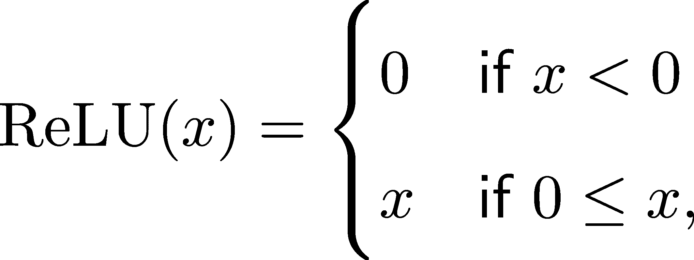

该图看起来是这样的。

```py
import numpy as np 
import matplotlib.pyplot as plt 

x = np.linspace(-10, 10, 400) 
relu = np.maximum(0, x) 

with plt.style.context("/span>seaborn-v0_8-white: 
    plt.figure() 
    plt.plot(x, relu, label="/span>ReLU(x) color="/span>blue 
    plt.axhline(0, color=’black’, linewidth=0.8, linestyle="-" 
    plt.title("/span>ReLU fontsize=14) 
    plt.xlabel("/span>x fontsize=12) 
    plt.ylabel("/span>ReLU(x) fontsize=12) 
    plt.grid(alpha=0.3) 
    plt.show()
```

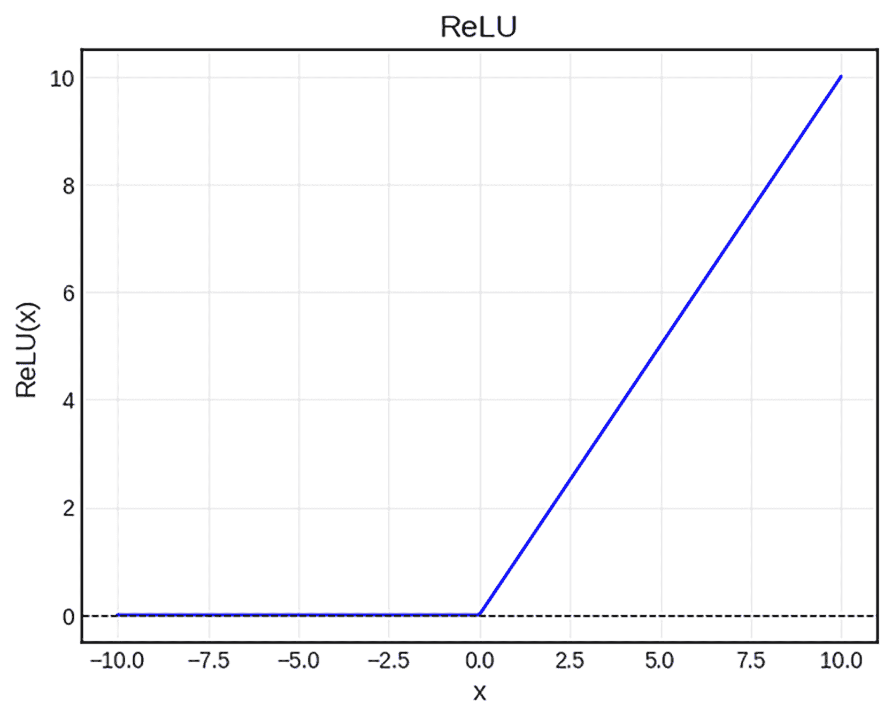

图 9.8：ReLU 函数的图形

虽然通过图形识别函数是有用的，但对于更复杂的映射，这种方法并不可推广。如果函数的定义域和映像不是实数集，直观地表示它将会很具挑战性。

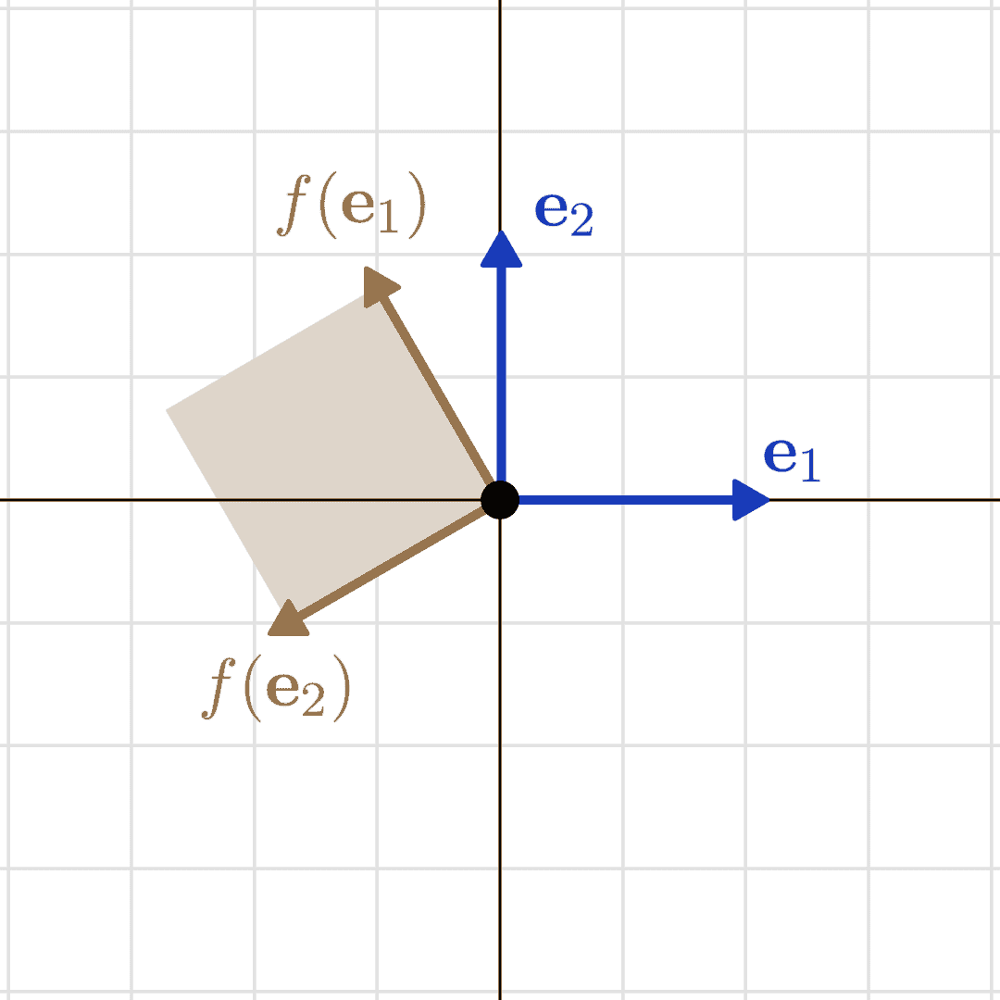

图 9.9：作为空间变换的函数。在这里，空间的向量围绕原点旋转。

在处理神经网络时，关于函数（在此上下文中即为层）最好的思考方式是将其视为对底层特征空间的变换。一个简单的例子是二维欧几里得平面中的旋转，如图 9.9 所示。

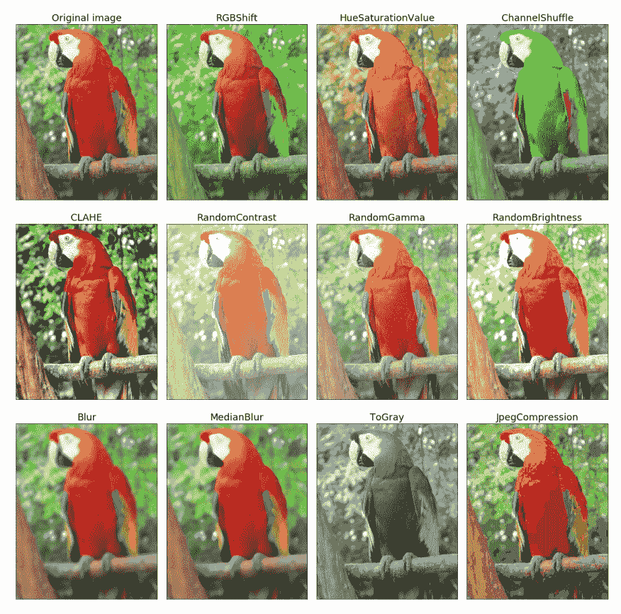

图 9.10：Albumentations 中的图像变换示例应用

图像变换提供了一组更复杂的示例。你很少将图像模糊视为空间之间的变换，但事实就是如此。毕竟，图像只是某个向量空间中的一个巨大的向量。

图像操作作为变换，由 Albumentations ([`albumentations.ai/`](https://albumentations.ai/)) 库执行。图片来源：Albumentations：快速灵活的图像增强，作者：Alexander Buslaev, Vladimir I. Iglovikov, Eugene Khvedchenya, Alex Parinov, Mikhail Druzhinin 和 Alexandr A. Kalinin ([`www.mdpi.com/2078-2489/11/2/125`](https://www.mdpi.com/2078-2489/11/2/125))。

本质上，神经网络仅仅是一个变换堆栈，每一层都从前一层的输出中获取输入。如你所见，神经网络之所以特殊，是因为这些变换并非手工设计，而是从数据中学习得到的。

## 9.2 实践中的函数

在我们对函数的研究中，我们从集合之间的箭头出发，最终得到了像公式和图形这样的思维模型。对于纯数学目的，这些模型足够用来进行深入的研究。然而，一旦我们离开理论领域，开始将其付诸实践时，我们就必须考虑函数在编程语言中的表示方式。

在 Python 中，函数使用简单的语法来定义。例如，平方函数 square(x) = x² 可以这样实现。

```py
def square(x): 
    return x**2
```

结果是一个类型为函数的对象。（在 Python 中，一切都是对象。）

```py
type(square)
```

```py
function
```

使用 `()` 操作符来调用函数。

```py
square(12)
```

```py
144
```

Python 以简洁著称，函数也不例外。然而，这并不意味着它们的功能受限——恰恰相反，通过巧妙使用函数，你可以实现很多功能。

### 9.2.1 函数操作

我们想对函数执行三种操作：组合、加法、乘法。最简单的方法是直接调用函数本身，然后回退到为数字类型定义的操作。为了看到一个例子，让我们实现立方函数 cube(x) = x³，并将其与平方函数相加、相乘或组合。

```py
def cube(x): 
    return x**3 
x = 2 

square(x) + cube(x)    # addition
```

```py
 12
```

```py
square(x)*cube(x)      # multiplication
```

```py
32
```

```py
square(cube(x))        # composition
```

```py
64
```

然而，存在一个主要问题。如果你再看一下函数操作，你会发现它们接受函数并返回函数。例如，组合由以下公式定义：


通过将返回值传递给外部函数，我们并没有做这种事情。没有函数对象来表示这种组合。

在 Python 中，函数是第一类对象，这意味着我们可以将它们传递给其他函数并从函数中返回它们。（这是一个绝妙的特性，但如果这是你第一次遇到这个概念，可能需要一些时间来适应。）

因此，我们可以通过使用第一类函数特性来实现上面的组合函数。

```py
def compose(f, g): 

    def composition(*args, **kwargs): 
        return f(g(*args, **kwargs)) 

    return composition 
square_cube_composition = compose(square, cube) 

square_cube_composition(2)
```

```py
64
```

加法和乘法可以像这样完成。（它们甚至作为练习题在 9.4 节中被分配。）

### 9.2.2 函数作为可调用对象

标准的函数定义方式并不适合我们需要的应用：带参数的函数。想一下线性函数 ax + b 的情况，其中 a 和 b 是参数。在第一次尝试时，我们可以这样做：

```py
def linear(x, a, b):
    return a*x + b
```

将参数作为参数传递似乎是可行的，但存在一些严重的潜在问题。例如，函数可能有很多参数。即使我们将参数压缩成多维数组，我们也可能需要处理几十个这样的数组。手动传递这些参数容易出错，而且我们通常需要与多个函数一起工作。例如，神经网络由多个层组成。每一层都是一个带参数的函数，它们的组合会产生一个预测模型。

我们可以通过应用经典的面向对象封装原则来解决这个问题，将函数实现为可调用对象。在 Python 中，我们可以通过为类实现魔法方法 `__call__` 来做到这一点。

```py
class Linear: 
    def __init__(self, a, b): 
        self.a = a 
        self.b = b 

    def __call__(self, x): 
        return self.a*x + self.b 
f = Linear(2, -1) # this represents the function f(x) = 2*x - 1 
f(2.1)
```

```py
3.2
```

这样，我们可以使用属性来存储、访问和修改参数。

```py
f.a, f.b
```

```py
(2, -1)
```

由于可能会有很多参数，我们应该实现一个方法，将它们收集到一个字典中。

```py
class Linear: 
    def __init__(self, a, b): 
        self.a = a 
        self.b = b 

    def __call__(self, x): 
        return self.a*x + self.b 

    def parameters(self): 
        return {"/span>a self.a, /span>b self.b}
```

```py
f = Linear(2, -1) 
f.parameters()
```

```py
{’a’: 2, ’b’: -1}
```

交互性是 Python 最有用的特性之一。在实践中，我们经常在 REPL 环境中工作，检查对象并手动调用函数。我们通常会为我们的类添加简洁的字符串表示，以应对这些情况。

默认情况下，打印一个 `Linear` 实例会显示一条晦涩的信息。

```py
f
```

```py
/span>__main__.Linear at 0x7c9fbef31190/span>
```

这并不是非常有用。除了类名和它在内存中的位置，我们没有获得任何信息。我们可以通过实现负责返回我们对象字符串表示的`__repr__`方法来改变这一点。

```py
class Linear: 
    def __init__(self, a, b): 
        self.a = a 
        self.b = b 

    def __call__(self, x): 
        return self.a*x + self.b 

    def __repr__(self): 
        return f/span>Linear(a={self.a}, b={self.b})/span> 

    def parameters(self): 
        return {"/span>a self.a, /span>b self.b} 
f = Linear(2, -1) 
f
```

```py
Linear(a=2, b=-1)
```

这看起来好多了！添加一个漂亮的字符串表示看似是一件小事，但在做机器学习工程时，这可以起到很大的作用。

### 9.2.3 `Function` 基类

我们刚刚看到的 `Linear` 类只是冰山一角。在机器学习中，有成百上千个函数族。我们最终会实现其中的许多，为了保持接口的一致性，我们将添加一个基类，所有其他类都将从这个基类继承。

```py
class Function: 
    def __init__(self): 
        pass 

    def __call__(self, *args, **kwargs): 
        pass 

    def parameters(self): 
        return dict()
```

有了这个，我们可以以以下方式实现函数和函数族。

```py
import numpy as np 

class Sigmoid(Function):            # the parent class is explicitly declared 
    def __call__(self, x): 
        return 1/(1 + np.exp(-x)) 

sigmoid = Sigmoid() 
sigmoid(2)
```

```py
np.float64(0.8807970779778823)
```

即使我们还没有为 `Sigmoid` 类实现 `parameters` 方法，它还是继承自基类。

```py
sigmoid.parameters()
```

```py
{}
```

现在，让我们保持基类尽可能简单。在本书的过程中，我们会逐步增强 `Function` 基类，以涵盖神经网络及其层所需的所有方法。（例如，梯度。）

### 9.2.4 面向对象的组合方式

回想一下我们在处理纯 Python 函数时是如何进行函数组合的（在第 9.2.1 节中）？从语法上讲，这也可以与我们的 `Function` 类一起使用，尽管有一个巨大的问题：返回值不是 `Function` 类型。

```py
composed = compose(Linear(2, -1), Sigmoid())
composed(2)
```

```py
np.float64(0.7615941559557646)
```

```py
isinstance(composed, Function)
```

```py
False
```

这种组合方式并没有继承我们需要的接口。

```py
composed.parameters()
```

```py
--------------------------------------------------------------------------- 
AttributeError                          Traceback (most recent call last) 
Cell In[33], line 1 
---->/span> 1 composed.parameters() 

AttributeError: ’function’ object has no attribute ’parameters’
```

为了解决这个问题，我们将函数组合实现为 `Function` 基类的一个子类。回忆一下，组合是一个函数，接受两个函数作为输入并返回一个函数：


记住这一点，这就是我们如何进行组合的方式。

```py
class Composition(Function): 
    def __init__(self, *functions): 
        self.functions = functions 

    def __call__(self, x): 

        for f in reversed(self.functions): 
            x = f(x) 

        return x
```

（注意，由于组合是这样定义的，我们以相反的顺序遍历函数列表。这是因为 `(f ∘ g)(x) = f(g(x))`，我们首先应用 `g`。）

```py
composed = Composition(Linear(2, -1), Sigmoid()) 
composed(2)
```

```py
np.float64(0.7615941559557646)
```

通过这种方式，我们可以保持 `Function` 接口。

```py
composed.parameters()
```

```py
{}
```

```py
isinstance(composed, Function)
```

```py
True
```

## 9.3 小结

现在我们已经了解了函数的真正含义，我敢打赌你的世界有些动摇了。函数作为由连续线条绘制的图形，当然可以。也许甚至是像 `f(x) = x² + 1` 这样的表达式。但作为点和箭头的函数呢？

出人意料的是，点和箭头表示法最接近真实定义。图表和表达式紧随其后。这是我们在本章学到的内容，到目前为止，我感觉自己像个魔术师。我向你展示了数学对象，并揭示了它们深藏的本质并非你所想象的那样。我们用向量、矩阵，现在又用函数做到了这一点。

除了“幕后秘密”的技巧外，将理论付诸实践也成为我们的一种惯例。因此，我们使用面向对象的 Python 来了解函数的实现。

接下来，我们将把目光转向更高层次的视角。对于我们来说，最重要的函数将数字映射到数字。但是，什么是数字？即使在编程语言中，我们也有几种不同的数字类型，如整数、浮点数、双精度数等等。这些深深植根于数学中，熟悉数字结构对每个开发者和工程师都是必需的。

下一章见！

## 9.4 问题

问题 1\. 这些函数中哪些是单射、满射或双射？找到双射函数的反函数。

(a) f : ℝ → (0,∞)，x→e^x (b) g : ℝ → [0,∞)，x→x² (c) h : [0,∞) → [0,∞)，x→x² (d) sin : ℝ → [0,1]，x→sin(x) (e) tan : ℝ →ℝ，x→tan(x)，

问题 2\. 找到一个函数 f : ℝ →ℝ，使得 (f ∘f)(x) = −x。

问题 3\. 任何实函数 g : ℝ →ℝ 都能通过 g = f ∘f 的形式得到吗？

问题 4\. 在函数组合章节 9.2.1 的示例之后，实现

+   加法函数，接受 f 和 g，并返回 f + g，

+   乘法函数，接受 f 和 g，并返回 fg，

+   以及除法函数，接受 f 和 g，并返回 f∕g。

## 加入我们的 Discord 社群

与其他用户、机器学习专家和作者一起阅读这本书。提问，为其他读者提供解决方案，通过问答环节与作者交流，以及更多内容。扫描二维码或访问链接加入社群。[`packt.link/math`](https://packt.link/math)


