# 开始使用 Matplotlib

现在我们已经熟悉了 Matplotlib 的功能，并且已经配置好 Python 环境，让我们直接开始创建我们的第一个图表。

在本章中，我们将学习如何：

+   绘制基本的线图和散点图

+   在同一图表上叠加多个数据系列

+   调整网格、坐标轴和标签

+   添加标题和图例

+   将创建的图表保存为单独的文件

+   配置 Matplotlib 全局设置

# 加载数据

在我们开始绘图之前，需要导入我们打算绘制的数据，并熟悉 Matplotlib 中的基本绘图命令。让我们开始了解这些基本命令！

在进行数据可视化项目时，我们需要确保对用于数据处理的工具有基本的熟悉和理解。在开始之前，让我们简要回顾一下处理数据时您会遇到的最常见数据结构。

# 列表

这是最基本的 Python 数据结构，它存储一组值。虽然您可以将任何数据类型作为元素存储在 Python 列表中，但在数据可视化的目的下，我们主要处理数值类型的列表作为数据输入，或者最多是具有相同数据类型元素的列表，如字符串，用于存储文本标签。

列表由方括号`[]`指定。要初始化一个空列表，可以通过`l = []`将`[]`赋值给变量。要创建一个列表，我们可以写如下内容：

```py
fibonacci = [1,1,2,3,5,8,13]
```

有时，我们可能希望得到一个算术序列的列表。我们可以通过使用`list(range(start, stop, step))`来实现。

请参见以下示例：

```py
In [1]: fifths = list(range(10,30,5))
        fifths
Out[1]: [10, 15, 20, 25]

In [2]: list(range(10,30,5))==[10, 15, 20, 25]
Out[2]: True
```

与 Python 2.7 不同，在 Python 3.x 中，您不能将`range()`对象与列表互换使用。

# NumPy 数组

NumPy 允许创建 n 维数组，这也是数据类型`numpy.ndarray`名称的来源。它处理许多复杂的科学和矩阵运算，并提供许多线性代数和随机数功能。

NumPy 是许多计算的核心，这些计算在数学上支持 Matplotlib 和许多其他 Python 包。因此，它是许多常用包的依赖项，并且通常与 Python 发行版一起提供。例如，它为 SciPy 提供了基础数据结构，SciPy 是一个处理统计计算的包，这些计算对科学和许多其他领域都有用。

要导入 NumPy，输入以下内容：

```py
import numpy as np
```

要从列表创建 NumPy 数组，请使用以下内容：

```py
x = np.array([2,3,1,0])
```

您还可以通过使用`np.linspace(start, stop, number)`来使用 NumPy 创建非整数的算术序列。

请参见以下示例：

```py
In [1]: np.linspace(3,5,20)
Out[1]: array([ 3\.        ,  3.10526316,  3.21052632,  3.31578947,  3.42105263,
        3.52631579,  3.63157895,  3.73684211,  3.84210526,  3.94736842,
        4.05263158,  4.15789474,  4.26315789,  4.36842105,  4.47368421,
        4.57894737,  4.68421053,  4.78947368,  4.89473684,  5\.        ])
```

矩阵运算可以应用于 NumPy 数组。这里是一个乘以两个数组的例子：

```py
In [2]: a = np.array([1, 2, 1])
In [3]: b = np.array([2, 3, 8])
In [4]: a*b
Out[4]: array([2, 6, 8])
```

# pandas DataFrame

您可能经常看到`df`出现在基于 Python 的数据科学资源和文献中。这是表示 pandas DataFrame 结构的常规方式。pandas 使我们能够通过简单的命令执行本来繁琐的表格（数据框）操作，例如`dropna()`、`merge()`、`pivot()`和`set_index()`。

pandas 旨在简化常见数据类型（如时间序列）的处理过程。虽然 NumPy 更专注于数学计算，但 pandas 具有内建的字符串处理功能，并允许通过`apply()`函数将自定义函数应用于每个单元格。

使用前，我们通过以下传统缩写导入该模块：

```py
pd.DataFrame(my_list_or_array)
```

要从现有文件读取数据，只需使用以下命令：

```py
pd.read_csv()
```

对于制表符分隔的文件，只需将 `'\t'` 作为分隔符：

```py
pd.read_csv(sep='\t')
```

pandas 支持从多种常见文件结构导入数据，以便进行数据处理和处理，从`pd.read_xlsx()`导入 Excel 文件，`pd.read_sql_query()`导入 SQL 数据库，直到最近流行的 JSON、HDF5 和 Google BigQuery。

pandas 提供了一系列便捷的数据操作方法，是 Python 数据科学家或开发者工具箱中不可或缺的工具。

我们鼓励读者在我们的 Mapt 平台上寻求资源和书籍，以更好、更深入地了解 pandas 库的使用。

要完全理解和利用功能，您可能想要阅读更多来自官方文档的内容：

[`pandas.pydata.org/pandas-docs/stable/`](http://pandas.pydata.org/pandas-docs/stable/)

# 我们的第一个 Matplotlib 绘图

我们刚刚回顾了使用 Python 进行数据处理的基本方法。接下来，让我们创建我们的第一个 "Hello World!" 绘图示例。

# 导入 pyplot

要从对象（如列表和 ndarray）创建 pandas DataFrame，您可以调用：

```py
import pandas as pd

```

要开始创建 Matplotlib 图形，我们首先通过输入此命令导入绘图 API `pyplot`：

```py
import matplotlib.pyplot as plt
```

这将启动你的绘图例程。

在 Jupyter Notebook 中，启动内核后，一旦开始 notebook 会话，您需要导入模块。

# 线形图

在导入 `matplotlib.pyplot` 作为 `plt` 后，我们使用 `plt.plot()` 命令绘制线形图。

这是一个简单的代码片段，用于绘制一周温度的示例：

```py
# Import the Matplotlib module
import matplotlib.pyplot as plt

# Use a list to store the daily temperature
t = [22.2,22.3,22.5,21.8,22.5,23.4,22.8]

# Plot the daily temperature t as a line plot
plt.plot(t)

# Show the plot
plt.show()
```

运行代码后，以下图表将作为输出显示在 notebook 单元格中：

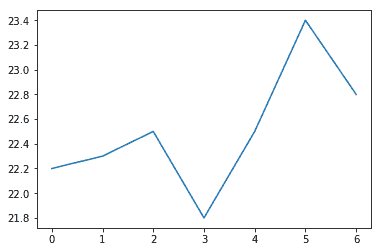

当解析一个参数时，数据值将假定在 *y* 轴上，索引在 *x* 轴上。

记得每次绘图后调用 `plt.show()`。如果忘记此操作，绘图对象将作为输出显示，而不是图形。如果你没有通过其他绘图命令覆盖图形，你可以在下一个运行的单元格中调用 `plt.show()` 来显示图形。以下是为说明此情况而制作的截图：


此外，如果你在调用`plt.show()`之前多次运行绘图命令，下次你再次添加这行代码并运行时，输出区域会出现多个图形或带有意外元素的图形（例如，颜色变化）。我们可以通过在两个连续运行的单元格中复制相同的绘图命令来演示这一点。以下截图中，你会看到颜色从默认的蓝色（如之前所示）变为棕色。这是因为第一个命令绘制的蓝色线被第二个命令绘制的棕色线覆盖：

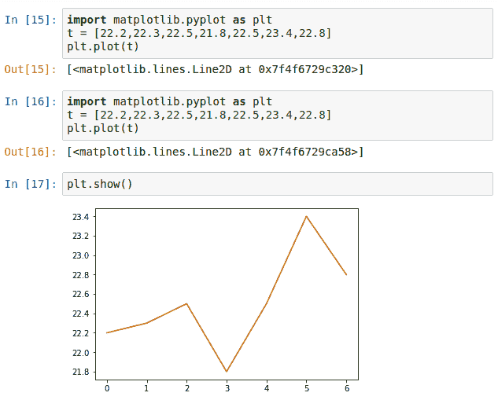

如果出现这种情况，请不要惊慌。你可以重新运行单元格，达到预期的结果。

**抑制函数输出**：有时，图表可能会在没有调用`plt.show()`的情况下显示，但`matplotlib`对象的输出也会显示，并且没有提供有用的信息。我们可以在代码行的末尾加上分号（`;`）来抑制其输入。例如，在以下快速示例中，当我们在绘图命令后加上`;`时，我们不会在输出中看到 Matplotlib 对象`[<matplotlib.lines.Line2D at 0x7f6dc6afe2e8>]`：

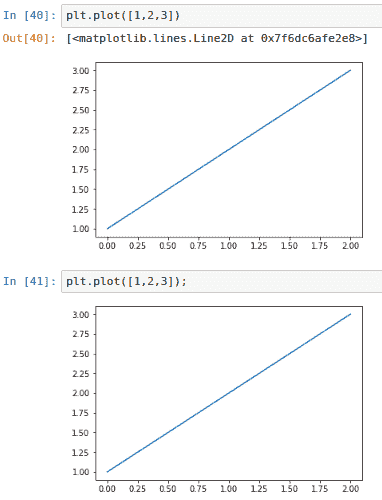

要指定自定义的*x*轴，只需将其作为第一个参数传递给`plt.plot()`。假设我们绘制 11^(th)日期的温度。我们可以通过调用`plt.plot(d, t)`来绘制温度`t`与日期列表`d`之间的关系。这里是结果，你可以在*x*轴上观察到指定的日期：

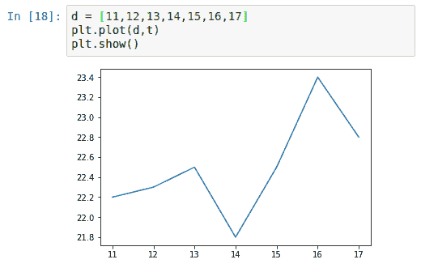

# 散点图

另一种基本的图表类型是散点图，即点图。你可以通过调用`plt.scatter(x, y)`来绘制它。以下示例显示了一个随机点的散点图：

```py
import numpy as np
import matplotlib.pyplot as plt

# Set the random seed for NumPy function to keep the results reproducible
np.random.seed(42)

# Generate a 2 by 100 NumPy Array of random decimals between 0 and 1
r = np.random.rand(2,100)

# Plot the x and y coordinates of the random dots on a scatter plot
plt.scatter(r[0],r[1])

# Show the plot
plt.show()
```

以下图表是前述代码的结果：

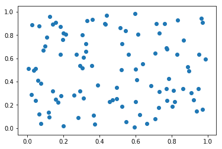

# 在图表中叠加多个数据系列

我们可以在使用`plt.show()`结束绘图之前堆叠多个绘图命令，以创建一个包含多个数据系列的图表。每个数据系列可以使用相同或不同的绘图类型进行绘制。以下是包含多个数据系列的折线图和散点图的示例，以及结合这两种图类型显示趋势的例子。

# 多行图表

例如，要创建一个多行图表，我们可以为每个数据系列绘制一条折线图，然后再结束图表。让我们尝试使用以下代码绘制三座不同城市的温度：

```py
import matplotlib.pyplot as plt

# Prepare the data series
d = [11,12,13,14,15,16,17]
t0 = [15.3,15.4,12.6,12.7,13.2,12.3,11.4]
t1 = [26.1,26.2,24.3,25.1,26.7,27.8,26.9]
t2 = [22.3,20.6,19.8,21.6,21.3,19.4,21.4]

# Plot the lines for each data series
plt.plot(d,t0)
plt.plot(d,t1)
plt.plot(d,t2)

plt.show()
```

这是前面代码生成的图表：

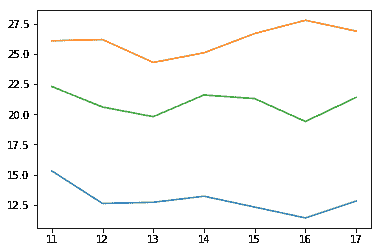

这个例子改编自 2017 年 12 月三座城市一周内的最高气温。从图表中，你能辨认出哪两条线更有可能代表来自同一大洲的城市吗？

# 用散点图显示聚类

虽然我们之前已经看到过随机点的散点图，但散点图在表示显示趋势或聚类的离散数据点时最为有用。默认情况下，每个数据系列将在每个绘图命令中以不同的颜色绘制，这有助于我们区分每个系列中的不同点。为了演示这一概念，我们将使用 NumPy 中的一个简单随机数生成函数生成两个人工数据点聚类，如下所示：

```py
import matplotlib.pyplot as plt

# seed the random number generator to keep results reproducible
np.random.seed(123) 

# Generate 10 random numbers around 2 as x-coordinates of the first data series
x0 = np.random.rand(10)+1.5

# Generate the y-coordinates another data series similarly
np.random.seed(321) 
y0 = np.random.rand(10)+2
np.random.seed(456)
x1 = np.random.rand(10)+2.5
np.random.seed(789)
y1 = np.random.rand(10)+2
plt.scatter(x0,y0)
plt.scatter(x1,y1)

plt.show()
```

从以下图表中，我们可以看到两个人工创建的数据点聚类，分别用蓝色（大致位于左半部分）和橙色（大致位于右半部分）表示：

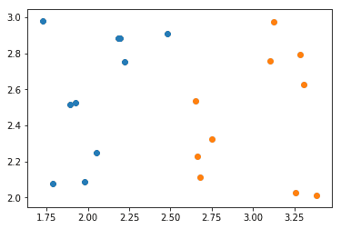

还有另一种生成聚类并在散点图中展示它们的方法。我们可以使用名为`sklearn`的包中的`make_blobs()`函数，更直接地生成测试和演示所需的数据点聚类，该包是为更高级的数据分析和数据挖掘而开发的，如下所示的代码片段所示。我们可以根据指定的特征（聚类标识）来指定颜色：

```py
import matplotlib.pyplot as plt
from sklearn.datasets import make_blobs

# make blobs with 3 centers with random seed of 23
blob_coords,features = make_blobs(centers=3, random_state=23)

# plot the blobs, with c value set to map colors to features
plt.scatter(blob_coords[:, 0], blob_coords[:, 1], marker='x', c=features) 
plt.show()
```

由于`make_blob`函数是基于各向同性高斯分布生成点，因此我们可以从结果图中看到，数据点更好地聚集成三个独立的点群，分别集中在三个点上：

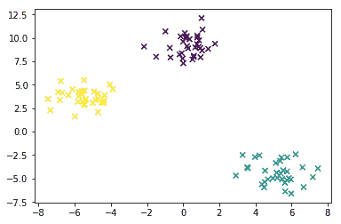

scikit-learn 是一个强大的 Python 包，提供了许多用于数据挖掘和数据分析的简单函数。它有一套多功能的算法，适用于分类、回归、聚类、降维和建模。它还允许数据预处理并支持多个处理阶段的流水线操作。

为了熟悉 scikit-learn 库，我们可以使用包中预加载的数据集，如著名的鸢尾花数据集，或者生成符合指定分布的数据集，如前所示。这里我们只使用这些数据来演示如何使用散点图进行简单的可视化，暂时不涉及更多细节。更多示例可通过点击以下链接找到：

[`scikit-learn.org/stable/auto_examples/datasets/plot_random_dataset.html`](http://scikit-learn.org/stable/auto_examples/datasets/plot_random_dataset.html)

前面的示例演示了一种更简单的方法来映射点的颜色与标记特征（如果有的话）。`make_blobs()`和其他 scikit-learn 函数的细节超出了本章介绍基本图表的范围。

我们鼓励读者访问我们的 Mapt 平台，查阅有关 scikit-learn 库使用的资源和书籍，以便更好地理解该库的用法。

或者，读者也可以在此处阅读 scikit-learn 的文档：[`scikit-learn.org`](https://scikit-learn.org)。

# 在散点图上添加趋势线

多种图表类型可以叠加在一起。例如，我们可以在散点图上添加趋势线。以下是一个将趋势线添加到 10 个*y*坐标上的例子，这些坐标与*x*坐标之间存在微小的线性偏差：

```py
import numpy as np
import matplotlib.pyplot as plt

# Generate th
np.random.seed(100)
x = list(range(10))
y = x+np.random.rand(10)-0.5

# Calculate the slope and y-intercept of the trendline
fit = np.polyfit(x,y,1)

# Add the trendline
yfit = [n*fit[0] for n in x]+fit[1]
plt.scatter(x,y)
plt.plot(yfit,'black')

plt.show()
```

我们可以从下图中观察到，趋势线覆盖了向上倾斜的点：

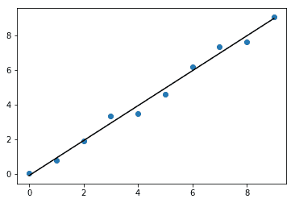

# 调整坐标轴、网格、标签、标题和图例

我们刚刚学会了如何通过 Matplotlib 将数值转化为点和线。默认情况下，Matplotlib 会通过后台计算合理的坐标轴范围和字体大小来优化显示。然而，良好的可视化通常需要更多的设计输入，以适应我们的自定义数据可视化需求和目的。此外，很多情况下，需要文本标签来使图表更加信息化。在接下来的章节中，我们将展示如何调整这些元素。

# 调整坐标轴范围

尽管 Matplotlib 会自动选择 *x* 和 *y* 坐标轴的范围，将数据扩展到整个绘图区域，但有时我们可能需要进行一些调整，比如希望将 100%显示为最大值，而不是较低的某个数值。要设置 *x* 和 *y* 坐标轴的范围，我们可以使用`plt.xlim()`和`plt.ylim()`命令。在我们的日常温度示例中，自动缩放使得温度变化不到 2 度的情况看起来非常剧烈。以下是如何进行调整，比如仅显示前 5 天的温度数据，*y* 轴的下限设为 0 度：

```py
import matplotlib.pyplot as plt

d = [11,12,13,14,15,16,17]
t0 = [15.3,12.6,12.7,13.2,12.3,11.4,12.8]
t1 = [26.1,26.2,24.3,25.1,26.7,27.8,26.9]
t2 = [22.3,20.6,19.8,21.6,21.3,19.4,21.4]

plt.plot(d,t0)
plt.plot(d,t1)
plt.plot(d,t2)

# Set the limit for each axis
plt.xlim(11,15)
plt.ylim(0,30)

plt.show()
```

上述代码生成的图表，*y* 轴范围为 0 到 30，如下所示：

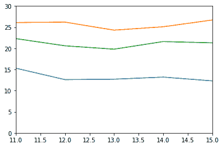

# 添加坐标轴标签

为了使 *x* 轴和 *y* 轴上的数值有意义，我们需要关于数据性质和类型的信息，以及其对应的单位。我们可以通过在`plt.xlabel()`或`plt.ylabel()`中添加坐标轴标签来提供这些信息。

让我们继续以多个城市的温度图作为例子。我们将添加`plt.xlabel('温度 (°C)')`和`plt.ylabel('日期')`来标注坐标轴，从而生成如下图表：

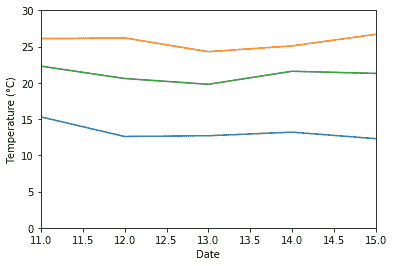

与许多其他涉及文本的 Matplotlib 函数类似，我们可以在`plt.xlabel()`和`plt.ylabel()`函数中通过传递属性参数来设置文本属性，例如字体大小和颜色。在这里，我们为标签指定了较粗的字体权重，以实现一定的层次感：

```py
plt.xlabel('Date',size=12,fontweight='semibold')
plt.ylabel('Temperature (°C)',size=12,fontweight='semibold')
```

如你所见，Matplotlib 支持对许多文本元素进行内联字体调整。在这里，我们为标签指定了较粗的字体权重，以实现一定的层次感：

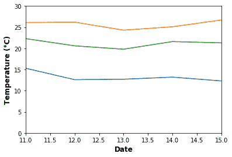

# 添加网格

虽然空白图表背景显得简洁，但有时我们可能希望添加一些参考网格线，以便更好地参考，特别是在多行图表中。

我们可以在 `plt.show()` 之前调用 `plt.grid(True)` 来打开背景网格线。例如，我们可以将此命令添加到前述的多城市温度图中，得到以下图表：

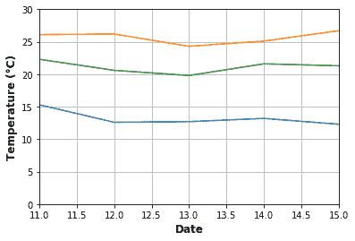

同样地，当我们不再需要网格时，例如当使用具有网格线作为默认样式时，我们可以使用 `plt.grid(False)` 来移除网格。

在下一章节将详细讨论详细的样式选项。前述示例中的网格显得太过突出，干扰了线图的解释。网格线的属性，如线宽、颜色和虚线模式，在 `plt.grid()` 命令中是可以调整的；这里是使网格线更加柔和的简要示例：

```py
plt.grid(True,linewidth=0.5,color='#aaaaaa',linestyle='-')
```

如下图所示，与上一个示例中默认网格颜色相比，网格线变得更加淡化，不再干扰数据线：

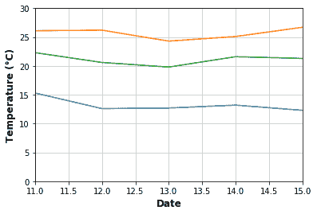

# 标题和图例

根据我们的图表将被呈现的位置和方式，它们可能会或者不会伴随一个描述背景和结果的图表标题。我们可能需要添加一个标题来简洁地总结和传达结果。

同时，虽然轴标签足以识别柱状图和箱线图等某些图形类型的数据系列，但可能会有需要额外图例键的情况。以下是添加和调整这些文本元素的方法，以使我们的图表更具信息性。

# 添加标题

要描述绘制数据的信息，我们可以为我们的图表添加一个标题。这可以通过简单的命令 `plt.title(yourtitle)` 来完成：

```py
plt.title("Daily temperature of 3 cities in the second week of December")
```

同样，我们可以指定文本样式属性。在这里，我们将标题字体设置为比其他标签更大：

```py
plt.title("Daily temperature of 3 cities in the second week of December", size=14, fontweight='bold')
```

下图已添加标题：

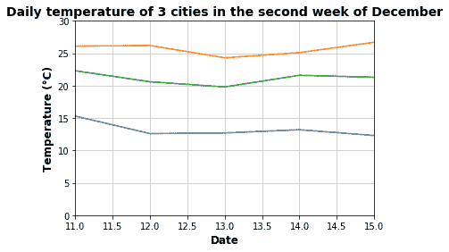

# 添加图例

为了匹配图表上的数据系列及其标签，例如通过它们的线条样式和标记样式，我们添加如下内容：

```py
plt.legend()
```

每个数据系列的标签可以在每个 `plt.plot()` 命令中通过 `label` 参数指定。

默认情况下，Matplotlib 选择最佳位置以最小化与数据点的重叠，并在重叠时添加图例面板颜色的透明度。然而，这并不总能保证每种情况下的位置都是理想的。要调整位置，我们可以通过传递 `loc` 设置来实现，例如使用 `plt.legend(loc='upper left')`。

可能的 `loc` 设置如下：

+   `'best'`: 0（仅适用于轴的图例）

+   `'upper right'`: 1

+   `'upper left'`: 2

+   `'lower left'`: 3

+   `'lower right'`: 4

+   `'right'`: 5（与 'center right' 相同；为了向后兼容性）

+   `'center left'`: 6

+   `'center right'`: 7

+   `'lower center'`: 8

+   `'upper center'`: 9

+   `'center'`: 10

你还可以将`loc`设置为相对于父元素的归一化坐标，通常是坐标轴区域；也就是说，坐标轴的边缘位于 0 和 1 的位置。例如，`plt.legend(loc=(0.5,0.5))`将图例设置在正中间。

让我们尝试将图例设置到多线图的右下角，使用绝对坐标`plt.legend(loc=(0.64,0.1))`，如下所示：

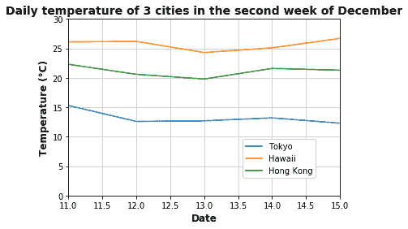

# 完整示例

为了更好地熟悉 Matplotlib 函数，让我们绘制一个包含坐标轴、标签、标题和图例的多线图，并在一个简单的代码段中完成配置。

在这个例子中，我们使用世界银行的农业真实数据。随着全球人口的不断增长，粮食安全继续成为一个重要的全球性问题。让我们通过绘制以下代码的多线图来看看最近十年几种主要作物的生产数据：

```py
Data source: https://data.oecd.org/agroutput/crop-production.htm
OECD (2017), Crop production (indicator). doi: 10.1787/49a4e677-en (Accessed on 25 December 2017)
# Import relevant modules
import pandas as pd
import matplotlib.pyplot as plt

# Import dataset
crop_prod = pd.read_csv('OECD-THND_TONNES.txt',delimiter='\t')
years = crop_prod[crop_prod['Crop']=='SOYBEAN']['Year']
rice = crop_prod[crop_prod['Crop']=='RICE']['Value']
wheat = crop_prod[crop_prod['Crop']=='WHEAT']['Value']
maize = crop_prod[crop_prod['Crop']=='MAIZE']['Value']
soybean = crop_prod[crop_prod['Crop']=='SOYBEAN']['Value']

# Plot the data series
plt.plot(years, rice, label='Rice')
plt.plot(years, wheat, label='Wheat')
plt.plot(years, maize, label='Maize')
plt.plot(years, soybean, label='Soybean')

# Label the x- and y-axes
plt.xlabel('Year',size=12,fontweight='semibold')
plt.ylabel('Thousand tonnes',size=12,fontweight='semibold')

# Add the title and legend
plt.title('Total OECD crop production in 1995-2016', size=14, fontweight='semibold')
plt.legend()

# Show the figure
plt.show()​
```

从结果图中，我们可以观察到玉米 > 小麦 > 大豆 > 水稻的生产趋势，一般呈现作物产量的增长趋势，以及大豆产量的稳定增长：

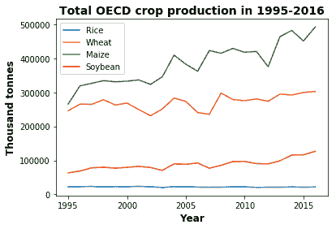

# 将图形保存为文件

要保存图形，我们将在绘图命令的末尾使用`plt.savefig(outputpath)`。它可以替代`plt.show()`，直接保存图形而不显示。

如果你希望将图形保存为文件并在 notebook 输出中显示，你可以同时调用`plt.savefig()`和`plt.show()`。

颠倒顺序可能导致图形元素被清除，留下一个空白画布用于保存的图形文件。

# 设置输出格式

`plt.savefig()`会自动检测指定输出路径的文件扩展名，并生成相应的文件格式（如果支持）。如果输入中未指定文件扩展名，则将使用默认后端输出 PNG 格式文件。它支持多种图像格式，包括 PNG、JPG、PDF 和 PostScript：

```py
import numpy as np
import matplotlib.pyplot as plt
y = np.linspace(1,2000)
x = 1.0/np.sin(y)
plt.plot(x,y,'green')
plt.xlim(-20,20)
plt.ylim(1000,2400)
plt.show()
plt.savefig('123')
```

# 设置图形分辨率

根据显示的格式、位置和目的，每个图形可能需要不同的分辨率。通常，较大的印刷材料，如海报，需要更高的分辨率。我们可以通过指定**每英寸点数**（**DPI**）值来设置分辨率，例如如下所示：

```py
plt.savefig(dpi=300)
```

对于*8x12*英寸的方形图和 300 DPI 的输出，图像中的像素将是*(8x300)x(12x300) = 2400x3600*像素。

# Jupyter 支持

Matplotlib 已原生集成到 Jupyter Notebook 中；这种集成使得图形可以直接作为每个 notebook 单元的输出静态显示。有时，我们可能希望使用 Matplotlib 的交互式 GUI，例如缩放或平移图形，以从不同角度查看。我们可以通过一些简单的步骤继续在 Jupyter Notebook 中工作。

# 交互式导航工具栏

要访问 Jupyter Notebook 中的交互式导航工具栏，首先调用 Jupyter 单元魔法命令：

```py
%matplotlib notebook
```

我们将通过一个具有更动态形状的图表来演示：

```py
import numpy as np
import matplotlib.pyplot as plt

y = np.linspace(1,2000)
x = 1.0/np.sin(y)

plt.plot(x,y,'green')
plt.xlim(-20,20)
plt.ylim(1000,2400)

plt.show()
```

如图所示，这里我们有一个嵌入在 GUI 框中的圣诞树形状图表：

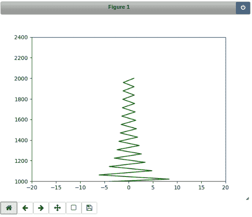

你可以在左下角找到工具栏。按钮从左到右的功能如下：

+   **主页图标**：重置原始视图

+   **左箭头**：返回到上一个视图

+   **右箭头**：前进到下一个视图

+   **四方向箭头**：按住左键拖动进行平移；使用右箭头键在屏幕上进行缩放

+   **矩形**：通过拖动图表上的矩形进行缩放

+   **软盘图标**：下载图表

这是通过在图表上拖动来进行平移的示例：

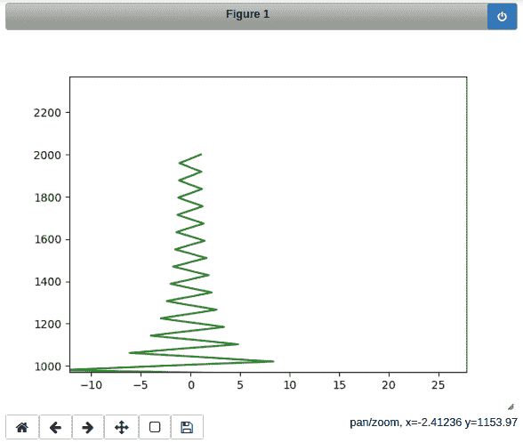

以下插图展示了通过拖动矩形框进行缩放的结果：

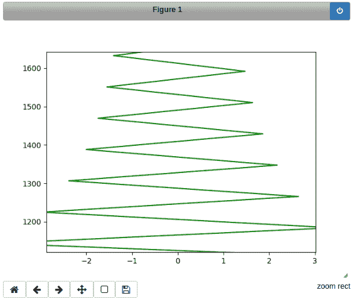

要恢复为内联输出模式，可以使用单元格魔法命令 `%matplotlib inline`，或点击右上角的电源按钮。

# 配置 Matplotlib

我们已经学会了如何调整 Matplotlib 图表中的一些主要元素。当我们反复生成相似风格的图表时，能够存储并应用持久的全局设置会非常方便。Matplotlib 提供了几种配置选项。

# 在 Python 代码中进行配置

为了在当前会话中保持设置，我们可以执行 `matplotlib.rcParams` 来覆盖配置文件中的设置。

例如，我们可以通过以下方式将所有图表中文本的字体大小设置为 18：

```py
matplotlib.rcParams['font.size'] = 18
```

另外，我们可以调用 `matplotlib.rc()` 函数。由于 `matplotlib.rc()` 只改变一个属性，要更改多个设置，我们可以使用 `matplotlib.rcParams.update()` 函数，并以键值对字典的形式传递参数：

```py
matplotlib.rcParams.update({'font.size': 18, 'font.family': 'serif'})
```

# 恢复到默认设置

要恢复为默认设置，可以调用 `matplotlib.rcdefaults()` 或 `matplotlib.style.use('default')`。

# 通过配置 rc 文件进行全局设置

如果你有一组配置想要全局应用而不需要每次设置，你可以设置 `matplotlibrc` 默认值。为了在某一组参数上进行持久且有选择性的更改，我们将选项存储在 `rc` 配置文件中。

# 查找 rc 配置文件

在 Linux/Unix 系统上，你可以通过编辑 `/etc/matplotlibrc`、`$HOME/.matplotlib/matplotlib/rc` 或 `~/.config/matplotlib/matplotlibrc` 来为机器上的所有用户设置全局配置。

在 Windows 上，默认的 `matplotlibrc` 文件可能位于 `C:\Python35\Lib\site-packages`。要查找当前活动的 `matplotlibrc` 文件路径，我们可以在 Python shell 中使用 Matplotlib 的 `matplotlib_fname()` 函数，如下所示：

```py
In [1]: import matplotlib as mpl
        mpl.matplotlib_fname()
Out[1]: '/home/mary/.local/lib/python3.6/site-packages/matplotlib/mpl-data/matplotlibrc'

```

`rc`配置文件位于`$INSTALL_DIR/matplotlib/mpl-data/matplotlibrc`，其中`$INSTALL_DIR`是 Matplotlib 的安装路径，通常看起来像是`python3.6/site-packages/`。安装目录中的`rc`文件会在每次更新时被覆盖。为了在版本更新时保持更改不丢失，请将其保存在本地配置目录中，如`'/home/mary/.config/matplotlib/matplotlibrc'`。

# 编辑 rc 配置文件

文件的基本格式是`option: value`的形式。例如，若要将图例始终显示在右侧，我们可以这样设置：

```py
legend.loc: right
```

Matplotlib 提供了大量的图形可配置选项，下面列出了几个可以控制定制的地方：

+   **全局机器配置文件**：Matplotlib 为每个用户配置全局机器配置文件

+   **用户配置文件**：每个用户的唯一文件，在此文件中可以覆盖全局配置文件，选择自己的设置（注意用户可以随时执行与 Matplotlib 相关的代码）

+   **当前目录中的配置文件**：通过使用此目录，可以针对当前脚本或程序进行特定的定制

这在不同程序有不同需求的情况下尤其有用，使用外部配置文件要比在代码中硬编码设置要好。

# 总结

恭喜！我们现在已经掌握了使用 Matplotlib 语法的基本绘图技巧！记住，数据可视化项目的成功在于制作吸引人的视觉效果。

在接下来的章节中，我们将学习如何美化图形，并选择合适的图表类型，以有效地传达我们的数据！
