# 装饰图表的绘图样式和类型

在上一章中，我们学习了一些基本概念，使用 Matplotlib 绘制折线图和散点图，并对几个元素进行了调整。现在我们熟悉了 Matplotlib 语法，准备深入探索 Matplotlib 的潜力。

本章将讨论：

+   颜色规格

+   线条样式定制

+   点样式定制

+   更多原生绘图类型

+   插入文本和其他注释

+   绘图样式的注意事项

# 控制颜色

颜色是任何视觉效果中的一个重要元素。它会对图形的感知产生巨大影响。例如，鲜明的颜色对比可以用来突出焦点；几种不同颜色的组合有助于建立层次感。

在 Matplotlib 2 中，颜色已默认设置为更好地区分不同类别；并且为了更直观地感知连续数值，我们通常需要更好地控制颜色以表示数据。在本节中，我们将介绍 Matplotlib 中常见的颜色选项。

# 默认颜色循环

颜色循环是一个颜色列表，用于自动控制一系列元素的颜色，例如多条数据线图中的每一条数据系列。在 Matplotlib 2.0 中，默认的颜色循环从 7 种颜色扩展到 10 种颜色，采用 **Data-Driven Documents** (**D3**)[https://github.com/d3] 和 Vega（一种声明性可视化语法语言）中的 *category10* 调色板。这些颜色设计用于在不同类别之间显示良好的对比度。每种颜色的名称为 `'C0'` 到 `'C9'`，可以通过指定预设颜色循环中的颜色手动调用。以下是一个包含默认颜色循环中每种颜色的多线图的示例：

```py
import matplotlib.pyplot as plt
for i in range(10):
    plt.plot([i]*5,c='C'+str(i),label='C'+str(i))
plt.xlim(0,5)
plt.legend()
plt.show()
```

以下是图形输出。图例显示了默认颜色循环中每种颜色的名称：

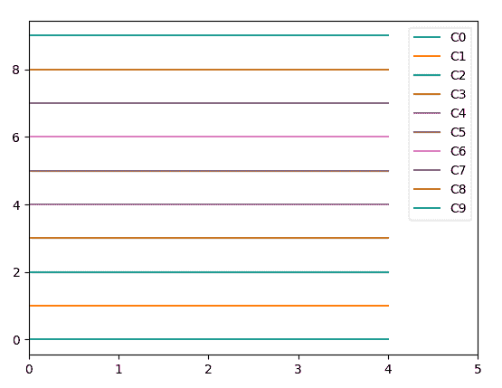

若要访问颜色的十六进制代码，可以使用以下代码：

```py
import matplotlib as mpl 
mpl.rcParams['axes.prop_cycle']
```

# 基本颜色的单字母缩写

有几个常用颜色，它们具有内置的单字母标准缩写，便于快速使用。它们如下所示：

+   `'b'`：蓝色

+   `'g'`：绿色

+   `'r'`：红色

+   `'c'`：青色

+   `'m'`：品红色

+   `'y'`：黄色

+   `'k'`：黑色

+   `'w'`：白色

# 标准 HTML 颜色名称

当我们想要从更广泛的颜色范围中快速构建调色板时，普通英语中的颜色名称可能比数字代码更直观。现代浏览器支持 HTML 中超过一百种不同的颜色名称。它们在 Matplotlib 中也得到了良好的支持，例如鲑鱼色、橙色、黄绿色、巧克力色和矢车菊蓝色。

你可以在此找到与颜色名称匹配的完整列表：[`matplotlib.org/examples/color/named_colors.html`](https://matplotlib.org/examples/color/named_colors.html)。相应的十六进制代码可以在这里找到：[`www.w3schools.com/colors/colors_names.asp`](https://www.w3schools.com/colors/colors_names.asp)。

# RGB 或 RGBA 颜色代码

颜色也可以指定为三个到四个介于零到一之间的浮点数的元组，例如 `(0.1,0.1,0.2)` 或 `(0.2,0.2,0.3,0.8)`。前三个数字定义了应该混合多少红色、绿色和蓝色光以生成所需的颜色输出。可选的第四个数字是 alpha 值，用于控制透明度。

# 十六进制颜色代码

类似于 RGBA 值，十六进制（hex）颜色代码控制红色、绿色和蓝色光的量。它们还通过一个两位数的十六进制数字来控制透明度，每个数字以井号 `'#'` 开头，例如 `'#81d8d0ec'`。因此，纯红色、绿色、蓝色、黑色和白色的十六进制代码分别是 `'#ff0000'`、`'#00ff00'`、`'#0000ff'`、`'#000000'` 和 `'#ffffff'`。

# 灰度深度

你可以在浮点数的字符串中指定任何值，范围为 *0-1*，例如 `'0.5'`。数值越小，灰度越暗。

# 颜色映射

颜色映射将数值映射到一系列颜色。

从 Matplotlib 2.0 开始，默认的颜色映射已经从 `'jet'`（横跨从红色到蓝色的可见光谱）更改为 `'viridis'`，这是一种从黄色到蓝色的感知均匀的渐变色。这样做使得感知连续值变得更加直观：

```py
import numpy as np
import matplotlib.pyplot as plt

N = M = 200
X, Y = np.ogrid[0:20:N*1j, 0:20:M*10]
data = np.sin(np.pi * X*2 / 20) * np.cos(np.pi * Y*2 / 20)

fig, (ax2, ax1) = plt.subplots(1, 2, figsize=(7, 3)) # cmap=viridis by default
im = ax1.imshow(data, extent=[0, 200, 0, 200])
ax1.set_title("v2.0: 'viridis'")
fig.colorbar(im, ax=ax1, shrink=0.85)

im2 = ax2.imshow(data, extent=[0, 200, 0, 200], cmap='jet')
fig.colorbar(im2, ax=ax2, shrink=0.85)
ax2.set_title("classic: 'jet'")

fig.tight_layout()
plt.show()
```

查看以下使用前述代码生成的图像，了解感知颜色均匀性意味着什么：

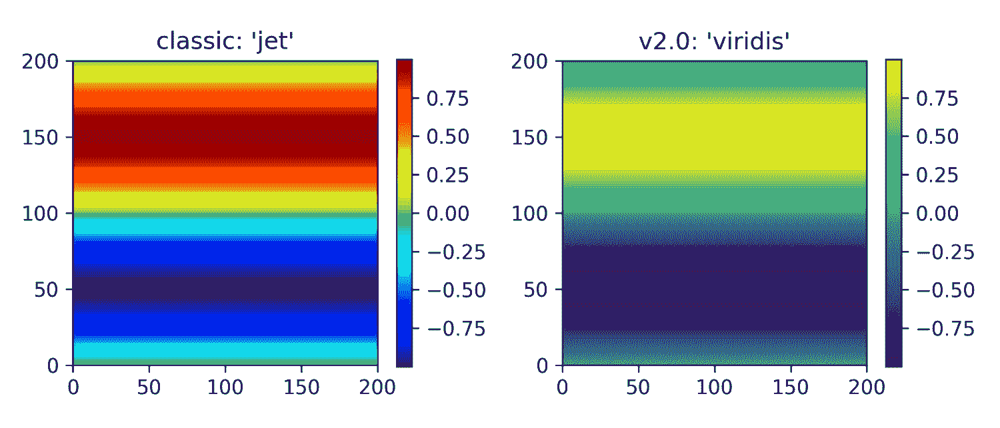

Matplotlib 还提供了一些预设的颜色映射，优化了显示发散值或定性类别的效果。欢迎查看：[`matplotlib.org/2.1.0/tutorials/colors/colormaps.html`](https://matplotlib.org/2.1.0/tutorials/colors/colormaps.html)。

# 创建自定义颜色映射

我们可以设置自定义的颜色映射。这在自定义热图和表面图时非常有用。

创建自定义线性颜色映射的一种简单方法是准备一个颜色列表，并让 Matplotlib 处理颜色过渡。让我们看一下以下示例：

```py
import numpy as np
import matplotlib.pyplot as plt
import matplotlib.colors

# Create a 30 random dots
np.random.seed(52)
x,y,c = zip(*np.random.rand(30,3))

# Create a custom linear colormap
cmap = matplotlib.colors.LinearSegmentedColormap.from_list("", ["red","yellow","green"])

plt.scatter(x,y,c=c, cmap=cmap)
plt.colorbar()
plt.show()
```

这里，我们有一个散点图，使用了我们自定义的颜色映射，从 `红色` 通过 `黄色` 到 `绿色`：

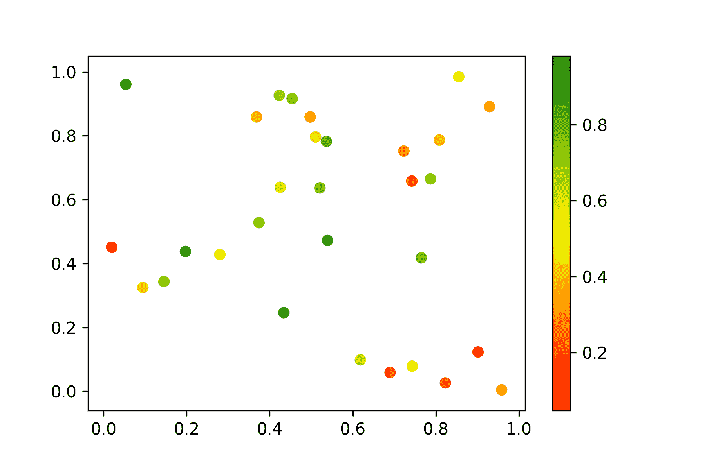

# 线条和标记样式

在上一章中，我们已经展示了如何绘制折线图和散点图。我们知道，散点图由表示每个数据点的点组成，而折线图是通过连接数据点来生成的。在 Matplotlib 中，标记用来标示数据点的位置，可以定制其形状、大小、颜色和透明度。类似地，连接数据点的线段以及共享相同类的不同 2D 线条，也可以调整它们的样式，如在上一章的网格部分简要演示的那样。调整标记和线条样式对于使数据系列更加易于区分非常有用，有时也是出于美学考虑。在本节中，我们将详细介绍 Matplotlib 中标记和线条样式的实现方法。

# 标记样式

对于表示数据点的标记，我们可以调整它们的形状、大小和颜色。默认情况下，Matplotlib 会将标记绘制为单个圆形点。这里，我们介绍调整方法。

# 选择标记的形状

有几十种可用的标记来表示数据点。它们被分为未填充的 `markers` 和更粗的 `filled_markers`。以下是一些示例：

+   `'o'`：圆形

+   `'x'`：叉号

+   `'+'`：加号

+   `'P'`：填充加号

+   `'D'`：填充菱形

+   `'s'`：方形

+   `'^'`：三角形

我们可以通过 `mpl.lines.Line2D.markers` 访问所有可用标记形状的键和名称。以下是一个代码片段，用于概览所有标记形状：

```py
import matplotlib.pyplot as plt
from matplotlib.lines import Line2D

for i,marker in enumerate(Line2D.markers):
    plt.scatter(i%10,i,marker=marker,s=100) # plot each of the markers in size of 100
plt.show()
```

以下是标记的图形输出：


# 使用自定义字符作为标记

Matplotlib 支持使用自定义字符作为标记，现在包括数学文本和表情符号。要使用字符作为自定义标记，我们将两个美元符号 `'$'` 连接在字符前后，并将其作为 `marker` 参数传递。

以反斜杠 `'\'` 开头的符号，如 `'\clubsuit'`，是数学文本（mathtext），将在本章稍后的文本和注释部分介绍。

这是一个使用数学符号和表情符号的散点图示例：

```py
import matplotlib.pyplot as plt
from matplotlib.lines import Line2D

custom_markers = ['$'+x+'$' for x in ['\$','\%','\clubsuit','\sigma','']]
for i,marker in enumerate(custom_markers):
    plt.scatter(i%10,i,marker=marker,s=500) # plot each of the markers in size of 100
plt.show()
```

从以下图示可以看到，我们成功地在散点图中使用了符号、希腊字母以及表情符号作为自定义标记：

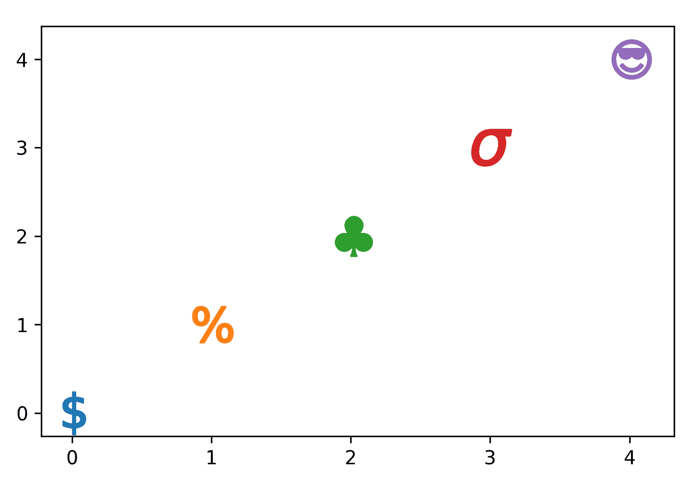

# 调整标记的大小和颜色

在散点图中，我们可以使用参数 `s` 来指定标记的大小，使用 `c` 来指定标记的颜色，在 `plt.scatter()` 函数中实现。

要在折线图上绘制标记，我们首先在 `plt.plot()` 函数中指定标记的形状，如 `marker='x'`。标记的颜色将与线条颜色一致。

请注意，散点图接受列表类型的大小和颜色值，这对于可视化数据聚类非常方便，而折线图每个数据系列只接受单一值。

让我们看一下以下示例：

```py
import numpy as np
import matplotlib.pyplot as plt
import matplotlib.colors

# Prepare a list of integers
n = list(range(5))

# Prepare a list of sizes that increases with values in n
s = [i**2*100+100 for i in n]

# Prepare a list of colors
c = ['red','orange','yellow','green','blue']

# Draw a scatter plot of n points with sizes in s and colors in c
plt.scatter(n,n,s=s,c=c)

# Draw a line plot with n points with black cross markers of size 12
plt.plot(n,marker='x',color='black',ms=12)

# Set axis limits to show the markers completely
plt.xlim(-0.5,4.5)
plt.ylim(-1,5)

plt.show()
```

这段代码生成了一个散点图，标记大小随着数据值增加，同时也有一个线性图，标记为固定大小的十字形：

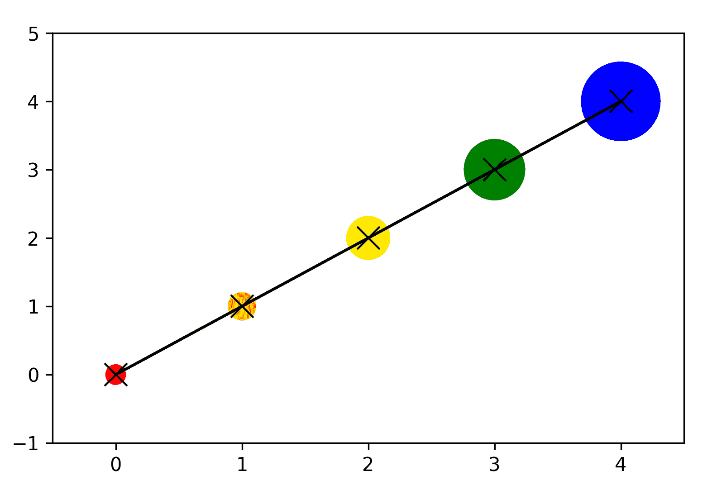

# 通过关键字参数精细调整标记样式

我们可以通过一些额外的关键字参数进一步精细调整标记样式。例如，对于 `plt.plot()`，我们可以更改 `markeredgecolor`、`markeredgewidth` 和 `markerfacecolor`。

这里有一个代码示例：

```py
import numpy as np
import matplotlib.pyplot as plt
import matplotlib.colors

# Prepare data points
x = list(range(5))
y = [1]*5

# Set the face color, edge color, and edge width of markers
plt.plot(x,y,marker='o',ms=36,markerfacecolor='floralwhite',markeredgecolor='slateblue',markeredgewidth=10)

plt.show()
```

这是添加额外关键字参数后的结果：

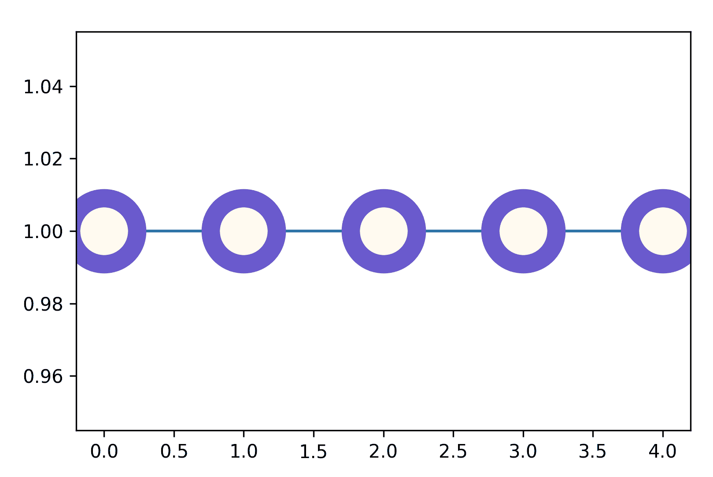

# 线条样式

线条是 Matplotlib 可视化中最常见的元素之一，从表示数据序列的线条到标记坐标轴、网格和任何形状轮廓的线条。因此，理解如何调整线条样式非常重要。Matplotlib 中的线条由 `Line2D` 类控制。Matplotlib 的面向对象结构使得通过关键字参数轻松调整线条样式，每个 API 中的语法都很相似。在这里，我们将介绍几个常用的 Matplotlib 线条调整方面。

# 颜色

设置线条图中线条的颜色非常简单，只需要在 `plt.plot()` 命令中添加 `color` 或其简写 `c` 参数即可。颜色选项在许多其他 Matplotlib API 中也可用。

# 线条粗细

线条的粗细通过大多数 Matplotlib 涉及线条的元素中的 `linewidth` 或 `lw` 参数设置，包括线条图。

# 虚线模式

线条的虚线模式由 `linestyle` 或 `ls` 参数指定。有时为了方便，它可以作为位置参数使用。例如，在线条图中，我们可以指定以下内容：

+   `'solid'` 或 `'-'`：实线；默认值

+   `'dashed'` 或 `'--'`：等距虚线

+   `'dashdot'` 或 `'-.'`：交替虚线和点线

+   `'.'`：松散的虚线

+   `':'`：紧密的点线

+   `'None'`、`' '`、`''`：没有可见的线条

+   `(offset, on-off-dash-seq)`：自定义虚线

以下是不同虚线模式的线条示例：

```py
import matplotlib.pyplot as plt

# Prepare 4 data series of sine curves
y = [np.sin(i) for i in np.arange(0.0, 10.0, 0.1)]

dash_capstyles = ['-','--','-.','.',':']

# Plot each data series in different cap dash styles
for i,x in enumerate(dash_capstyles):
    plt.plot([n*(i+1) for n in y],x,label=x)

plt.legend(fontsize=16,loc='lower left')
plt.show()
```

我们可以在下图中看到每种虚线样式的效果：

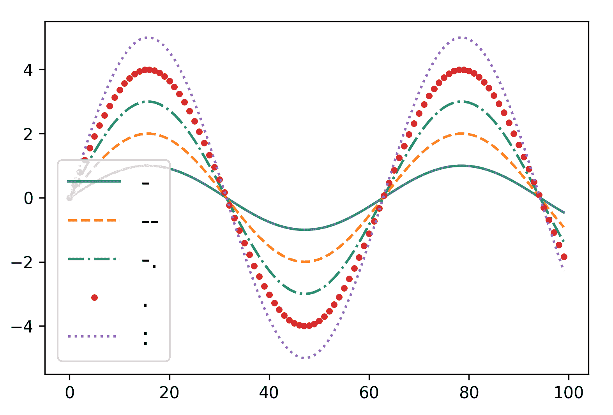

# 设计自定义虚线样式

Matplotlib 不仅仅限制于其预设的线条样式。实际上，我们可以通过指定每个重复虚线单元的长度和间距，设计自己的虚线模式，例如 `(0, (5,3,1,3,1,3))`。

# 端点样式

另一个调节参数是 `dash_capstyle`。它控制虚线端点的样式：

+   `'butt'`：钝头

+   `'projecting'`：延伸长度

+   `'round'`：圆形末端

为了展示不同的端点样式，我们有一段多线图的代码示例，使用粗线条来放大虚线：

```py
import matplotlib.pyplot as plt

# Prepare 4 data series of sine curves
y = list(range(10))

dash_capstyles = ['butt','projecting','round']

# Plot each data series in different cap dash styles
for i,x in enumerate(dash_capstyles):
 plt.plot([n*(i+1) for n in y],lw=10,ls='--',dash_capstyle=x,label=x)

plt.legend(fontsize=16)
plt.show()
```

从下图中，我们可以清楚地看到钝头和圆形虚线给人不同的锋利度和微妙感：

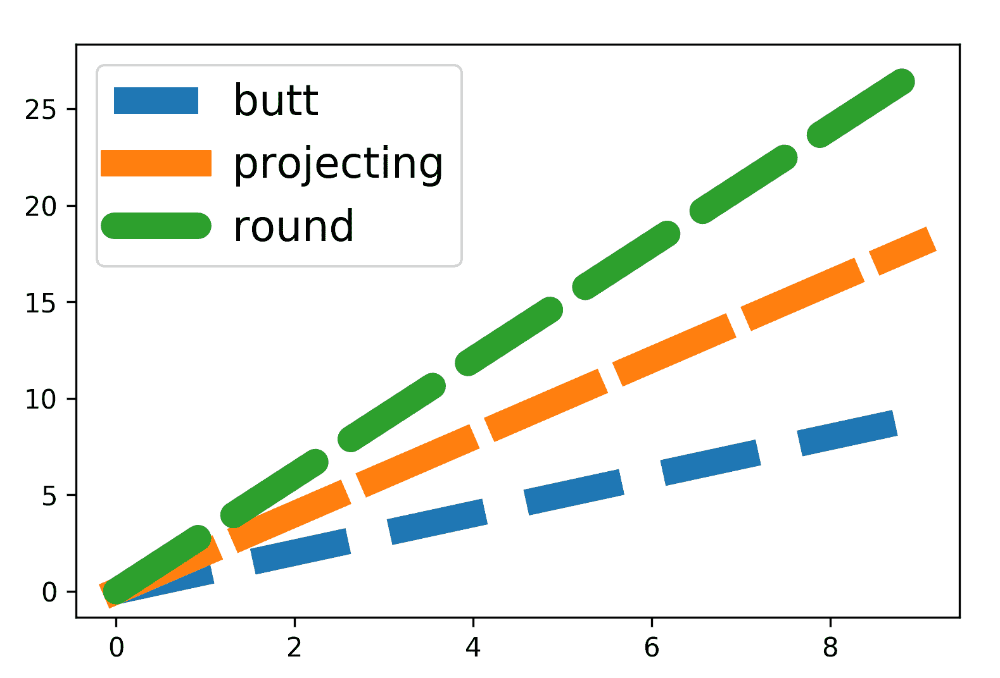

# 坐标轴

在 Matplotlib 中，脊柱指的是围绕绘图区域坐标轴的线条。我们可以设置每个脊柱具有不同的线条样式或设置为不可见。

首先，我们使用`plt.gca()`访问坐标轴，其中**gca**代表**获取当前坐标轴**，并将其存储在一个变量中，例如`ax`。

然后我们通过`ax.spines`调整每个脊柱的属性，分别为`'top'`、`'right'`、`'bottom'`或`'left'`。常见的设置包括线宽、颜色和可见性，下面的代码片段演示了这些设置。

下面是一个示例，演示如何去除顶部和右侧脊柱，这在某些科学图表中常见，并且通常为了简化视觉效果而去除它们。通常还会加粗剩余的脊柱。颜色的变化如下所示，作为演示。我们可以根据图表显示的整体设计进行调整：

```py

import matplotlib.pyplot as plt

y = list(range(4))
plt.plot(y)

# Store the current axes as ax
ax = plt.gca()

# Set the spine properties
ax.spines['left'].set_linewidth(3)
ax.spines['bottom'].set_linewidth(3)
ax.spines['left'].set_color('darkblue')
ax.spines['bottom'].set_color('darkblue')
ax.spines['right'].set_visible(False)
ax.spines['top'].set_visible(False)

plt.show()
```

这将创建一个显示左侧和底部为蓝色脊柱的图：

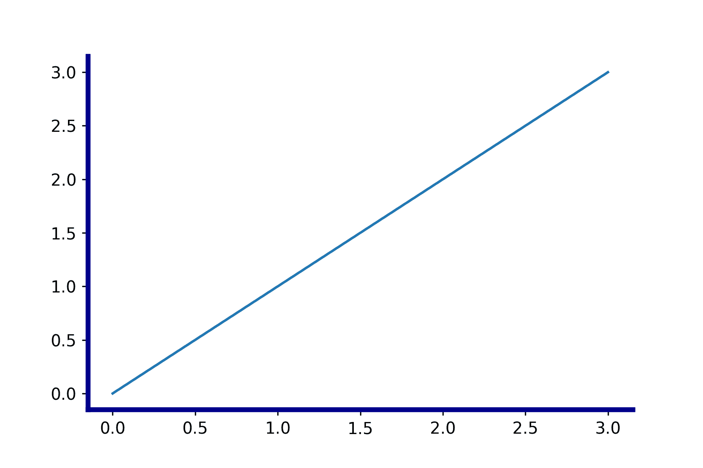

# 更多本地的 Matplotlib 图表类型

除了最基本的散点图和折线图，Matplotlib 还提供了多种多样的图表类型，用于不同的数据可视化需求。在本节中，我们将介绍图表类型选择的原理以及每种类型的使用方法。

# 选择合适的图表

成功的可视化必须能够有效地传达信息。为了实现这个目标，我们需要对数据的性质有清晰的理解，同时了解每种图表类型在展示不同数据关系时的优缺点。

在选择合适的图表类型时，我们有以下几个考虑因素：

+   变量的数量

+   数据分布

+   数据系列之间的关系

# 直方图

直方图有助于调查数据的分布。例如，当我们希望查看某个人群中年龄分布，照片中的光照暴露，或一个城市每个月的降水量时，可以使用直方图绘制数据。

在 Matplotlib 中，我们调用`plt.hist()`函数并传入线性数组。Matplotlib 会自动将数据点分组为`bins`，并绘制每个 bin 的频率作为条形图。我们还可以通过`plt.hist(array, bins=binsize)`指定 bin 的大小。

下面是一个绘制随机生成的二项分布的示例：

```py
import numpy as np
import matplotlib.pyplot as plt

np.random.seed(8)
x = np.random.binomial(100, 0.5, size=10000)
plt.hist(x,bins=20) # or plt.hist(x,20)
plt.show()
```

生成的直方图如下：

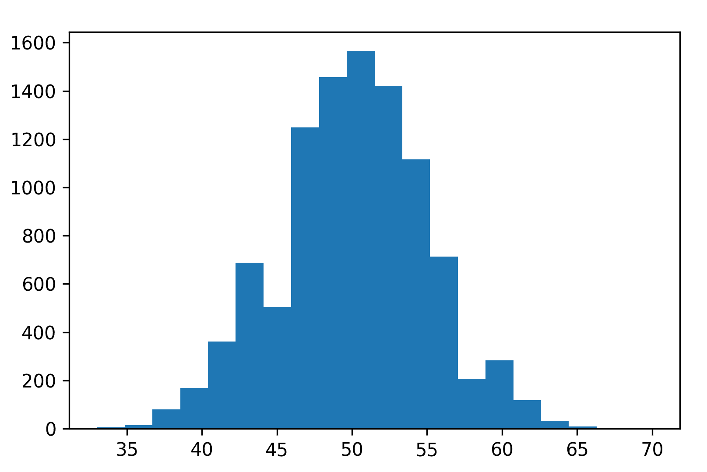

# 条形图

条形图对于比较离散数据系列的绝对水平非常有用。它们可以通过 Matplotlib 中的`plt.bar(labels, heights)`函数创建。

让我们来看一下今天备受关注的加密货币的市值示例。这里展示的是市值排名前五的加密货币：

```py
import matplotlib.pyplot as plt

# Data retrieved from https://coinmarketcap.com on Jan 8, 2018
# Prepare the data series
cc = ['BTC','XRP','ETH','BCH','ADA']
cap = [282034,131378,107393,49999,26137]

# Plot the bar chart
plt.bar(cc,cap)
plt.title('Market capitalization of five top cryptocurrencies in Jan 2018')
plt.xlabel('Crytocurrency')
plt.ylabel('Market capitalization (million USD)')
plt.show()
```

从下图中可以看到，Matplotlib 并没有按照输入顺序，而是按字母顺序排列了标签，并输出了一个条形图：


要按指定顺序创建条形图，我们可以利用 Pandas 及其与 Matplotlib 的集成。步骤如下：

1.  创建一个 Pandas DataFrame `df`

1.  使用`df.plot(kind='bar')`绘制条形图

1.  设置`xticks`的标签

1.  调整其他图表属性

1.  使用`plt.show()`显示图表

请注意，默认情况下，`df.plot()`包含一个图例。我们需要指定`legend=False`来关闭它。

这里是一个示例，展示如何重新排序之前输出图中的条形图：

```py
import pandas as pd
import matplotlib.pyplot as plt

df = pd.DataFrame({'cc':cc,'cap':cap}, legend=False)

ax = df.plot(kind='bar')
ax.set_xticklabels(df['cc'])

plt.title('Market capitalization of five top cryptocurrencies in Jan 2018')
plt.xlabel('Crytocurrency')
plt.ylabel('Market capitalization (million USD)')
plt.show()
```


# 设置条形图属性

我们可以在`plt.bar()`中作为关键字参数设置条形图的`width`、`color`和`bottom`坐标。

条形图的`width`是按比例设置的，而颜色则如本章早期部分所介绍的那样设置。

对于可能包含实验或测量误差的数据，我们可以输入`yerr`（和`xerr`）值的列表来显示精确度。

# 使用多变量数据绘制带误差条的条形图

我们可以通过 Pandas 的`df.plot()`轻松创建带有多个数据系列的条形图。这个 API 还允许我们通过提供`xerr`和`yerr`参数轻松添加误差条。让我们看一个示例，展示如何使用这个函数并调整条形图属性。

以下代码段绘制了一个多条形图，展示了一种假想药物治疗炎症的效果，通过比较治疗前后炎症蛋白的水平以及安慰剂对照组：

```py
import pandas as pd
import matplotlib.pyplot as plt

# Prepare the data series
labels_drug = ['Drug (Before)', 'Drug (After)']
labels_placebo = ['Placebo (Before)', 'Drug (After)']
drug = [2.88,1.42]
placebo = [2.72,2.68]
yerr_drug = [0.12,0.08]
yerr_placebo = [0.24,0.13]

df = pd.DataFrame([drug,placebo])
df.columns = ['Before', 'After']
df.index = ['Drug','Placebo']

# Plot the bar chart with error bars
df.plot(kind='bar',width=0.4,color=['midnightblue','cornflowerblue'],\
        yerr=[yerr_drug,yerr_placebo])

plt.title('Effect of Drug A Treatment')
plt.xlabel('Condition')
plt.ylabel('[hsCRP] (mg/L)')
plt.xticks(rotation=0) # to keep the xtick labels horizontal
plt.legend(loc=(0.4,0.8))

plt.show()
```

在这里，你得到一个双条件的配对条形图。看起来药物相比安慰剂可能有一些效果。你能想到更多的数据示例，用来绘制多条形图吗？

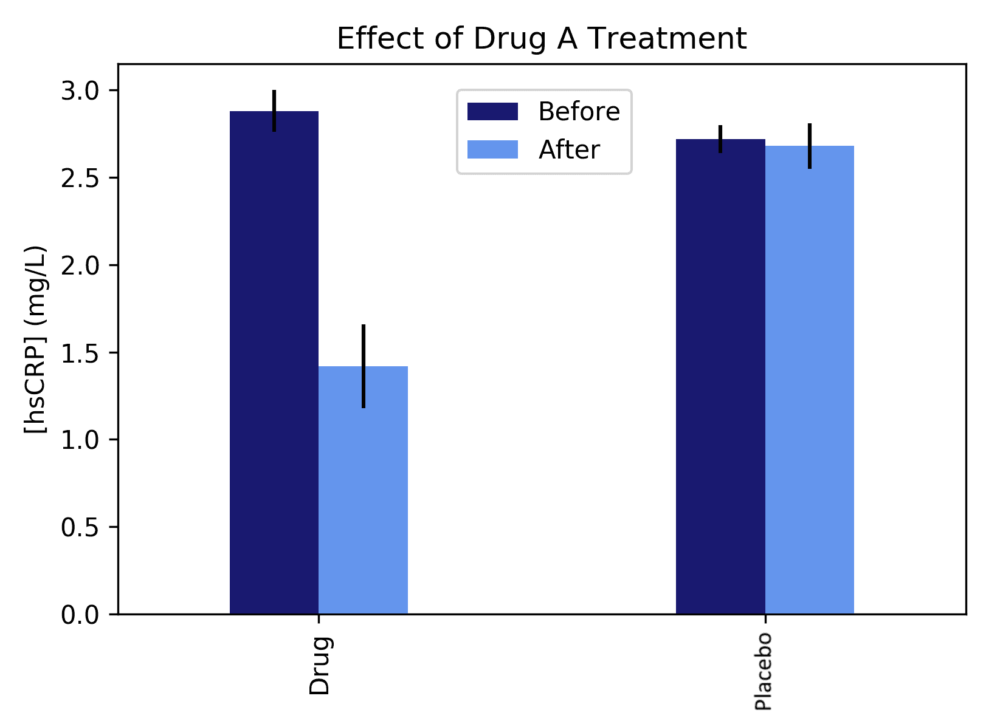

除了使用 Pandas 外，我们还可以调用多个`plt.bar()`命令来绘制多个系列的条形图。注意，我们需要调整坐标，以确保条形图不会重叠。

# 均值和误差图

对于实验科学，数据点通常是通过多次实验的平均值得到的，这就需要显示误差范围来说明精度水平。在这种情况下，均值和误差图比条形图更为合适。在 Matplotlib 中，均值和误差图是通过`plt.errorbar()`API 生成的。

当正误差和负误差相同时，我们可以将 1D 数组输入为误差值，绘制对称的误差条。否则，我们将输入 2D 数组`[正误差，负误差]`来绘制不对称的误差条。虽然只绘制`y`轴误差的图更为常见，但`x`和`y`轴的误差值都被支持。

默认情况下，Matplotlib 会绘制连接每个误差条的线，格式`fmt`设置为`'.-'`。对于离散数据集，我们可以添加关键字参数`fmt='.'`来去除这条线。让我们来看一个简单的例子：

```py
import matplotlib.pyplot as plt
import numpy as np

# Prepare data for a sine curve
x = np.arange(0, 5, 0.3)
y = np.sin(-x)

# Prepare random error to plot the error bar
np.random.seed(100)
e1 = 0.1 * np.abs(np.random.randn(len(y)))

# Plotting the error bar
plt.errorbar(x, y, yerr=e1, fmt='.-')
plt.show()
```

我们现在得到了一个带误差条的正弦曲线，如下所示。试着用你获得的一些真实测试数据来替换它：

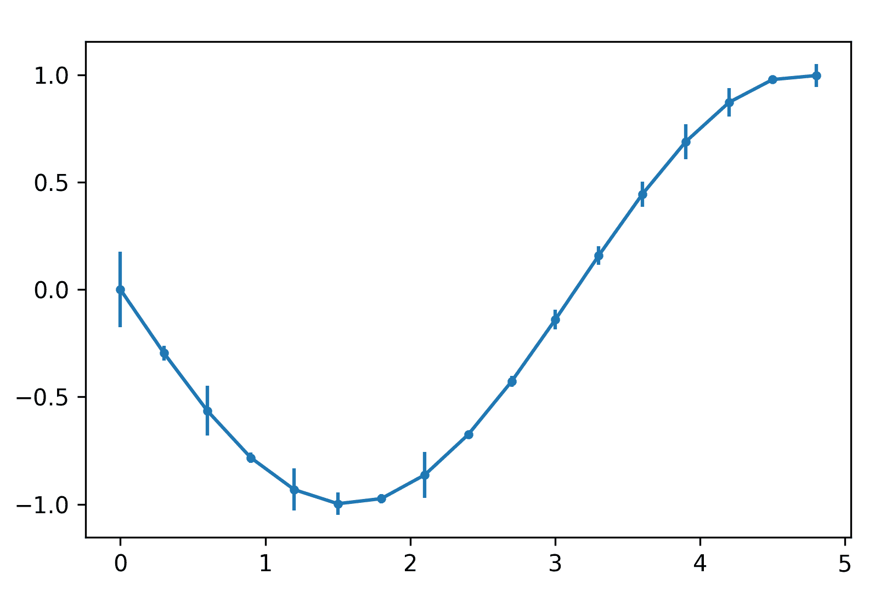

# 饼图

饼图是以圆形表示各组成部分比例的图表。每个扇区的角度及其弧长（也叫 **楔形**）代表各组成部分相对于整体的比例。

Matplotlib 提供了 `plt.pie()` 函数来绘制饼图。我们可以通过 `labels` 为每个扇区添加标签，并且可以通过 `autopct` 自动显示百分比。有关如何自定义百分比字符串格式的不同方式，请参考：[`pyformat.info/`](https://pyformat.info/)。

为了保持饼图的圆形形状，我们通过 `plt.figure(figsize=(n,n))` 为正方形图形指定相同的宽度和长度。

这里是 2017 年 1 月第一周的网络服务器使用情况示例：

```py
# Data obtained from https://trends.builtwith.com/web-server on Jan 06, 2017
import matplotlib.pyplot as plt
plt.figure(figsize=(4,4))

x = [0.31,0.3,0.14,0.1,0.15]
labels = ['nginx','Apache','IIS','Varnish','Others']
plt.pie(x,labels=labels,autopct='%1.1f%%')
plt.title('Web Server Usage Statistics')
plt.show()
```

生成的饼图如下所示：


我们还可以通过传递一个比率列表给关键字参数 `explode` 来分离每个扇区。例如，在之前的 `plt.pie()` 绘图中添加 `explode=[0.1]*5` 参数，将会生成如下结果：


请注意，如果输入数组的和小于 1，输出的饼图将不完整，正如下图所示：

```py
import matplotlib.pyplot as plt
plt.figure(figsize=(4,4))
x = [0.1,0.3]
plt.pie(x)
plt.show()
```

如图所示，饼图并不是一个完整的圆，而是一个不完整的扇形图：


在这种情况下，我们必须明确指定每个项的比例。例如，在之前的示例中，将 `x = [0.1,0.3]` 改为 `x = [0.25,0.75]`。

# 极坐标图

极坐标图用于显示多维数据，也被称为雷达图或蜘蛛图。它常用于展示不同对象在不同方面的强度对比，例如评估硬件的价格和各种规格，或者游戏角色的能力。

此外，极坐标图在绘制数学函数时也很有用，下面我们将进行演示。在 Matplotlib 中，我们使用命令 `plt.polar()` 绘制极坐标图。除了我们熟悉的 x、y 坐标系外，极坐标用于极坐标图、角度和半径。中心点称为 **极点**。注意，Matplotlib 采用角度单位来输入角度。

这是绘制极坐标玫瑰图的代码：

```py
import numpy as np
import matplotlib.pyplot as plt

theta = np.arange(0., 2., 1./180.)*np.pi
plt.polar(3*theta, theta/6)
plt.polar(theta, np.cos(6*theta))
plt.polar(theta, [1.2]*len(theta))

plt.savefig('mpldev_03_polarrose.png')
plt.show()
```

这是结果。你看到了多少个花瓣？

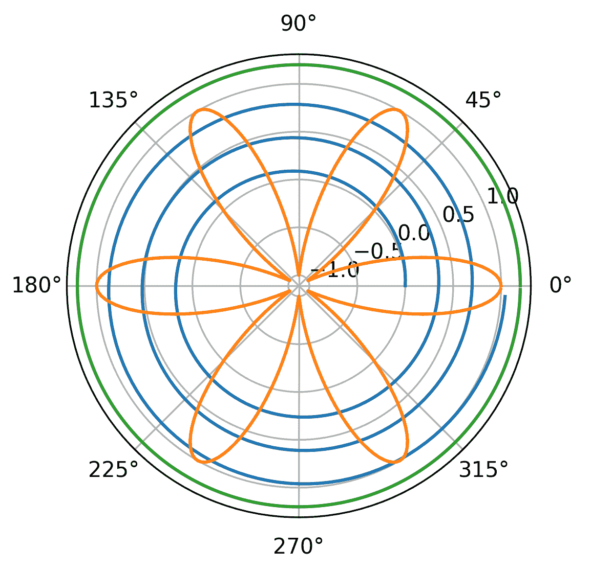

我们还可以利用极坐标系创建图表，例如地理学中表示地球风速的热力图，或工程学中表示圆形物体表面温度的图表。我们将把这些高级用法留作练习，等你完成本书后再尝试。

# 控制径向和角度网格

有两个函数可以控制径向网格和角度网格：`rgrid()` 和 `thetagrid()`。我们可以将 `radii`、`labels` 和 `angle` 参数传递给 `rgrid()` 函数，将 `angles`、`labels` 和 `frac` 参数传递给 `thetagrid()` 函数。

# 文本与注释

为了更好地理解图表细节，我们有时会添加文本注释来进行说明。接下来我们将介绍在 Matplotlib 图表中添加和调整文本的方法。

# 添加文本注释

我们可以通过调用 `plt.text(x,y,text)` 向图表中添加文本；我们需要指定 `x` 和 `y` 坐标以及文本字符串。

这里是一个快速示例：

```py
plt.text(0.25,0.5,'Hello World!',fontsize=30)
plt.show()
```

你可以在下图中看到**Hello World!**消息出现在图形的中心：

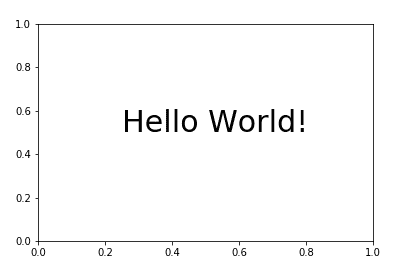

# 字体

下面是一些常见的可调节字体属性：

+   **字体大小**：浮动或相对大小，例如，smaller 和 x-large

+   **字体粗细**：例如，bold 或 semibold

+   **字体样式**：例如，斜体

+   **字体家族**：例如，Arial

+   **旋转**：以度为单位的角度；可以是垂直或水平

Matplotlib 现在支持 Unicode 和 Emoji。

# 数学符号

作为绘图工具，数学符号非常常见。我们可以使用内置的 mathtext 或 LaTeX 在 Matplotlib 中渲染数学符号。

# Mathtext

要创建 mathtext 符号，我们可以在字符串前加上 r，例如 `r'$\alpha'`。以下是一个简短的演示代码：

```py
plt.title(r'$\alpha > \beta$')
plt.show()
```

以下图中的 Alpha 和 Beta 是通过 MathTex 打印的：

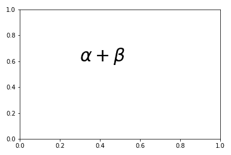

# LaTeX 支持

Matplotlib 支持 LaTeX，尽管其渲染速度比 mathtext 慢；因此，它允许更灵活的文本渲染。以下是 LaTeX 用法的更多细节：[`matplotlib.org/users/usetex.html`](https://matplotlib.org/users/usetex.html)。

# 外部文本渲染器

如果我们已经安装了 LaTeX，可以通过 `matplotlib.rc('text', usetex='false')` 让外部 LaTeX 引擎渲染文本元素。

# 箭头

为了突出图表中的特定特征，我们可以使用 `plt.arrow()` 函数绘制箭头。以下代码演示了不同可用的箭头注释样式：

```py
import matplotlib.pyplot as plt

plt.axis([0, 9, 0, 18])
arrstyles = ['-', '->', '-[', '<-', '<->', 'fancy', 'simple', 'wedge']
for i, style in enumerate(arrstyles):
 plt.annotate(style, xytext=(1, 2+2*i), xy=(4, 1+2*i), \
 arrowprops=dict(arrowstyle=style))
connstyles=["arc", "arc,angleA=10,armA=30,rad=15", \
 "arc3,rad=.2", "arc3,rad=-.2", "angle", "angle3"]

for i, style in enumerate(connstyles):
 plt.annotate("", xytext=(6, 2+2*i), xy=(8, 1+2*i), \
 arrowprops=dict(arrowstyle='->', connectionstyle=style))

plt.show()

```

它生成以下图形，列出了可用的箭头形状进行注释：

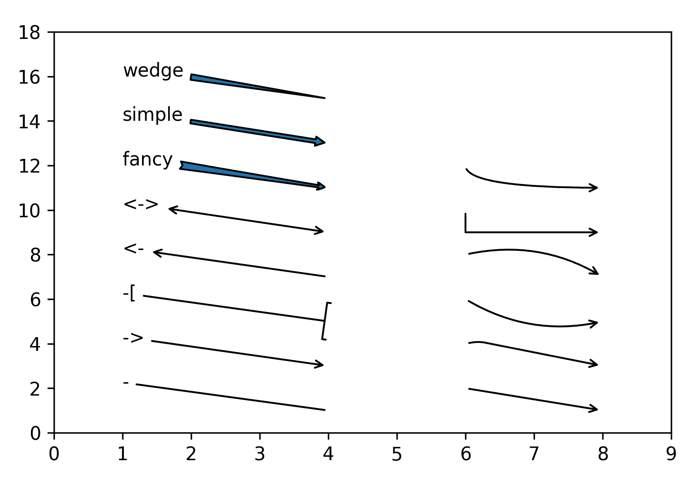

# 使用样式表

到目前为止，我们已经一步步学习了如何为图表设置样式。为了获得更持久和可移植的设置，我们可以通过 `matplotlib.style` 模块应用预定义的全局样式：

```py
## Available styles
 Matplotlib provides a number of pre-built style sheets. You can check them out by with `matplotlib.style.available`.

import matplotlib as mpl
mpl.style.available

Out[1]: ['seaborn-talk',
'seaborn-poster',
'_classic_test',
'seaborn-ticks',
'seaborn-paper',
'ggplot',
'seaborn',
'seaborn-dark',
'seaborn-bright',
'seaborn-pastel',
'fivethirtyeight',
'Solarize_Light2',
'classic',
'grayscale',
'bmh',
'seaborn-dark-palette',
'seaborn-whitegrid',
'seaborn-white',
'dark_background',
'seaborn-muted',
'fast',
'seaborn-notebook',
'seaborn-darkgrid',
'seaborn-colorblind',
'seaborn-deep']
```

# 应用样式表

我们可以调用 `plt.style.use(stylename)` 来应用样式。此函数可以接受内置样式表、本地路径和 URL。

# 创建自己的样式表

你也可以创建自己的样式表。关于 Matplotlib 样式表文件的规格，请参考文档页面：[`matplotlib.org/users/customizing.html`](http://matplotlib.org/users/customizing.html)。

# 重置为默认样式

样式表设置的效果会在新的图形中持续。如果要恢复默认参数，请调用`plt.rcdefaults()`。

# 样式设计中的美学与可读性考虑

由于可视化是为了传递信息，从读者的角度思考越多，效果就会越好。一个吸引人的图形更容易引起注意。图形越容易阅读，读者越能理解其中的信息。以下是设计数据图形时的一些基本原则。

# 合适的字体样式

层次结构最多可以使用三种字体系列、粗细和大小的级别。尽量使用不那么花哨的字体系列，若可能，使用无衬线字体。确保字体大小足够大，便于阅读。

**衬线与无衬线**

衬线字体是字母上带有装饰性边缘的字体。无衬线字体在法语中意为“没有衬线”。如其名所示，无衬线字体通常比衬线字体更简洁、朴素。以微软 Office 中最常用的默认字体为例，2007 及之前版本使用的 Times New Roman 就是衬线字体，而更新版的 Calibri 则是无衬线字体。

# 有效使用颜色

+   使用更强烈的颜色对比来突出重点和区分

+   谨慎使用额外的颜色，例如每个数据系列只用一种颜色

+   对色弱的读者友好；例如，避免红绿组合

# 保持简单

<q>"少即是多。"</q> <q>                                                                              –  安德烈亚·德尔·萨托（《无瑕画家》） 罗伯特·布朗宁</q>

这句话阐明了前面建议的基本原则。极简主义设计哲学激发了许多杰出的作品，无论是建筑还是平面设计。虽然使用不同的颜色和样式能创造出区别性和层次感，同时增加图形的吸引力，但我们必须尽可能减少复杂性。这有助于读者集中注意力于主要信息，同时也帮助我们的图形保持专业的印象。

# 摘要

恭喜！你现在已经掌握了最常用的绘图方法以及自定义图形的基本技巧。接下来，我们将进入更高级的 Matplotlib 使用方法。

在下一章中，我们将介绍更多图形类型，并借助第三方包来优化多图和多个坐标轴的显示，处理特定比例尺下的显示效果，以及显示图像中的像素。敬请期待！
