# 无监督机器学习在网络数据上的应用

欢迎来到另一个激动人心的章节，我们将一起探索网络科学和数据科学。在上一章中，我们使用监督学习训练了一个模型，通过图特征来识别《悲惨世界》中的革命者。在本章中，我们将探讨无监督机器学习以及它如何在图分析和节点分类中与监督学习结合使用。

这两章的编写顺序是有意安排的。我希望你能够学习如何通过图创建自己的训练数据，而不是依赖于无监督机器学习的嵌入。这一点很重要：当你依赖嵌入时，你失去了理解机器学习模型分类原因的能力。你失去了可解释性和可说明性。无论使用哪种模型，分类器基本上都像一个黑箱。我想先向你展示可解释和可说明的方法。

在本章中，我们将使用一个名为 **Karate Club** 的 Python 库。这个库在社区检测和使用图机器学习创建图嵌入方面非常出色。然而，使用这种方法时，无法得知模型究竟发现了哪些有用的信息。因此，我将其放在最后介绍。如果你不介意失去可解释性，它仍然非常有效。

这是一个有趣的章节，因为我们将把书中的许多内容汇聚在一起。我们将创建图、生成训练数据、进行社区检测、创建图嵌入、做一些网络可视化，甚至使用监督机器学习进行节点分类。如果你从本章开始阅读这本书，可能一切看起来都像魔法。如果你从*第一章*就跟着阅读，那么这一切应该都能理解，而且很容易掌握。

# 技术要求

在本章中，我们将使用 Python 库 NetworkX、pandas、scikit-learn 和 Karate Club。除了 Karate Club 之外，这些库应该已经安装好，可以直接使用。安装 Karate Club 的步骤会在本章中介绍。如果其他库没有安装，你可以通过以下方式安装 Python 库：

```py
pip install <library name>
```

例如，要安装 NetworkX，你可以这样操作：

```py
pip install networkx
```

在*第四章*中，我们还介绍了 `draw_graph()` 函数，它同时使用了 NetworkX 和 `scikit-network`。每当我们进行网络可视化时，你将需要这段代码。随时准备好使用它！

所有代码都可以从 GitHub 仓库获取：[`github.com/PacktPublishing/Network-Science-with-Python`](https://github.com/PacktPublishing/Network-Science-with-Python)。

# 什么是无监督机器学习？

在关于机器学习的书籍和课程中，通常会解释有三种不同的类型：监督学习、无监督学习和强化学习。有时会解释组合方法，比如半监督学习。在监督学习中，我们提供数据（X）和答案（y），模型学习进行预测。而在无监督学习中，我们只提供数据（X），没有答案（y）。目标是让模型自主学习识别数据的模式和特征，然后我们可以利用这些模式和特征做其他事情。例如，我们可以使用无监督机器学习自动学习图形的特征，并将这些特征转换为可以在监督学习预测任务中使用的嵌入。在这种情况下，无监督机器学习算法接受一个图（G），并生成作为训练数据（X）的嵌入，这些数据将用于预测答案。

简而言之，无监督机器学习的目标是识别数据中的模式。我们通常称这些模式为簇（clusters），但这不仅仅限于聚类。创建嵌入（embeddings）并不是聚类。然而，通过嵌入，一个复杂的网络被简化为几个数字特征，机器学习将更容易使用这些特征。

在本章中，你将亲眼看到这种方法实际的样子，以及它的优缺点。这并非全是积极的。使用嵌入作为训练数据会有一些不太理想的副作用。

# 介绍 Karate Club

我将展示一本书中我们之前提到过的 Python 库：Karate Club。我在前几章简要提到过它，但现在我们将实际使用它。我故意推迟详细讲解，因为我想先教授一些关于如何处理网络的核心方法，再展示使用机器学习从网络中提取社区和嵌入的看似简单的方法。这是因为使用网络嵌入而不是从网络中提取的度量数据，可能会带来一些不良副作用。我稍后会详细说明。现在，我想介绍这个强大、高效且可靠的 Python 库。

Karate Club 的文档（[`karateclub.readthedocs.io/en/latest/`](https://karateclub.readthedocs.io/en/latest/)）清晰简洁地解释了该库的功能：

Karate Club 是一个为 NetworkX 提供的无监督机器学习扩展库。它基于其他开源线性代数、机器学习和图信号处理库，如 NumPy、SciPy、Gensim、PyGSP 和 Scikit-learn。Karate Club 包含了用于对图结构数据进行无监督学习的最先进的方法。简单来说，它是小规模图挖掘研究的瑞士军刀。

这一段中有两点应该特别引起注意：*无监督机器学习*和*图形*。你可以将 Karate Club 简单地看作是图形的无监督学习。然后，Karate Club 的输出可以与其他库一起用于实际的预测。

Karate Club 中有许多很酷的无监督学习方法，这让了解它们成为一种真正的乐趣。你可以在[`karateclub.readthedocs.io/en/latest/modules/root.html`](https://karateclub.readthedocs.io/en/latest/modules/root.html)上了解它们。我最喜欢的一点是，文档链接到关于这些算法的原始研究论文。这让你能够真正了解无监督机器学习模型背后的过程。为了选择本章使用的模型，我阅读了七篇研究论文，每一刻我都很喜欢。

这个库的另一个优点是，输出在各个模型间是标准化的。一个模型生成的嵌入与另一个模型生成的嵌入是相似的。这意味着你可以轻松地尝试不同的嵌入方法，看看它们如何影响用于分类的模型。我们将在本章中准确地做到这一点。

最后，我从未见过像 Karate Club 那样简单的社区检测。使用 NetworkX 或其他库进行 Louvain 社区检测需要一些工作来进行设置。而使用 Karate Club 中的**可扩展社区检测**（**SCD**），你可以通过非常少的代码行从图形转换为已识别的社区。它非常简洁。

如果你想了解更多关于 Karate Club 和图机器学习的内容，我推荐《*图机器学习*》这本书。你可以在[`www.amazon.com/Graph-Machine-Learning-techniques-algorithms/dp/1800204493/`](https://www.amazon.com/Graph-Machine-Learning-techniques-algorithms/dp/1800204493/)上购买。这本书比本章将要讨论的内容更详细地讲解了 Karate Club 的能力。它也是本书之后的好跟读书籍，因为本书讲解了如何使用 Python 与网络进行交互的基础，而《*图机器学习*》则在此基础上更进一步。

# 网络科学选项

需要注意的是，你并不*需要*使用机器学习来处理图形。机器学习只是很有用。实际上，什么是机器学习、什么不是机器学习之间有一个模糊的界限。例如，我认为任何形式的社区检测都可以视为无监督机器学习，因为这些算法能够自动识别网络中存在的社区。按照这个定义，我们可以认为 NetworkX 提供的一些方法是无监督机器学习，但由于它们没有明确地被称为图机器学习，它们并没有在数据科学界受到同等的关注。对此需要保持警惕。

我之所以这么说，是希望你记住，已经学过的一些方法可以避免使用所谓的图机器学习（graph ML）。例如，你可以使用 Louvain 方法来识别社区，甚至只是识别连接组件。你可以使用 PageRank 来识别枢纽——你不需要嵌入方法来做这些。你可以使用`k_corona(0)`来识别孤立点——这完全不需要机器学习。你可以将几个图特征链在一起作为训练数据，就像我们在上一章所做的那样。如果你对模型可解释性感兴趣，你*不需要*使用卡拉泰社交网络来创建嵌入，甚至*不应该*使用卡拉泰社交网络的嵌入。

记住你在本书中学到的关于分析和剖析网络的内容。将本章中的内容作为捷径使用，或者如果你所做的事情的背后原理已经弄清楚了，嵌入方法可以作为一个不错的捷径，但任何使用这些嵌入的模型都会变成一个不可解释的黑箱。

我的建议是：尽可能使用网络科学方法（在 NetworkX 中），而不是卡拉泰社交网络（Karate Club），但要注意卡拉泰社交网络，并且它可能有其用处。这个建议并不是因为我对卡拉泰社交网络有任何蔑视，而是因为我发现从模型中提取的洞察非常有启发性，几乎没有什么能让我放弃这些洞察。例如，什么特征使得一个模型能够预测机器人和人工放大效应？

可解释性的丧失意味着你将无法理解模型的行为。这绝不是一件好事。这并不是对将图分解为嵌入方法或这些方法背后的研究的贬低；只不过值得知道，某些方法可能导致模型行为完全无法解释。

# 在网络数据上使用无监督机器学习

如果你查看卡拉泰社交网络的网站，你可能会注意到，针对无监督机器学习的两种方法可以分为两类：识别社区和创建嵌入。无监督机器学习不仅可以为节点创建嵌入，还可以为边或整个图创建嵌入。

## 社区检测

社区检测最容易理解。使用社区检测算法的目标是识别网络中存在的节点社区。你可以把社区看作是相互以某种方式互动的节点群体。在社交网络分析中，这被称为社区检测，因为它本质上是识别社交网络中的社区。然而，社区检测不仅仅局限于涉及人类的社交网络分析。也许可以将图形看作是一个由相互作用的事物组成的社交网络。网站之间有互动。国家和城市之间有互动。人们之间有互动。国家和城市之间有互动的社区（盟友和敌人）。网站之间有互动的社区。人们之间有互动的社区。这只是识别那些相互作用的事物群体。

我们在本书的*第九章*中讨论了社区检测。如果你还没读过这一章，我建议你回去阅读，深入了解它。

这里是一个示例社区，帮助你刷新记忆：


图 11.1 – 来自《悲惨世界》的社区

看这个社区，我们可以看到它是紧密相连的。每个成员与社区中的其他所有成员都相互连接。其他社区的连接较为稀疏。

## 图嵌入

我喜欢把图嵌入看作是将复杂的网络转化为数学模型能够更好使用的数据格式。例如，如果你使用图的边列表或 NetworkX 图（G）与随机森林模型，什么都不会发生。模型根本无法使用输入数据。因此，为了让这些模型发挥作用，我们需要将图形分解成更易用的格式。在前一章关于监督式机器学习的内容中，我们将图转换成了这种格式的训练数据：

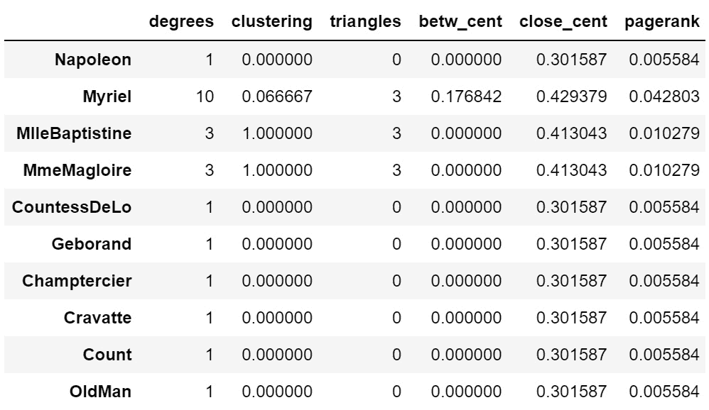

图 11.2 – 手工制作的图形训练数据

我们还包括了一个**标签**，这是机器学习模型将从中学习的答案。之后，我们为每个节点附加了邻接矩阵，以便分类模型也能从网络连接中学习。

如你所见，我们很容易知道训练数据中的特征。首先，我们有一个节点的度数，然后是它的聚类、三角形的数量、它的中介中心性和接近中心性，最后是它的 PageRank 得分。

使用嵌入技术，图中的所有信息都被解构成一系列的嵌入。如果你阅读该模型背后的文章，你可以理解过程中的发生情况，但在嵌入创建之后，它实际上是不可直接解释的。这就是嵌入的样子：


图 11.3 – 无监督机器学习图嵌入

太棒了，我们把一个图转换成了 1,751 列……什么？

尽管如此，这些嵌入仍然很有用，可以直接输入到监督学习模型中进行预测，尽管模型和数据的可解释性可能不高，但这些预测仍然非常有用。

但是这些嵌入能做什么呢？它们仅仅是一大堆没有描述的数字列。它怎么可能有用呢？好吧，有两个下游应用，一个是使用更多的无监督机器学习进行聚类，另一个是使用监督学习进行分类。

### 聚类

在**聚类**中，你的目标是识别出看起来或行为相似的聚类、群组或事物。通过手工制作的训练数据和 Karate Club 生成的嵌入，可以进行聚类。将这两个数据集输入聚类算法（如 K-means）中，可以识别出相似的节点。例如，使用任何模型都有其含义，因此要花时间了解你打算使用的模型。例如，使用 K-means 时，你需要指定期望在数据中存在的聚类数量，而这个数量通常是无法事先知道的。

回到`k_corona`，查看了连接组件，或者按 PageRank 对节点进行排序。如果你在使用机器学习，你应该首先问自己，是否有一种基于网络的方法可以消除使用机器学习的需求。

### 分类

在分类任务中，你的目标是预测某些内容。在社交网络中，你可能想预测谁最终会成为朋友，谁可能想成为朋友，谁可能会点击广告，或者谁可能想购买某个产品。如果你能做出这些预测，就能自动化推荐和广告投放。或者，你可能想识别欺诈、人工放大或滥用行为。如果你能做出这些预测，你就可以自动隔离那些看起来像是不良行为的内容，并自动化响应这些类型的案例。

分类通常是机器学习中最受关注的部分，它当之无愧。在分类任务中，我们可以防止垃圾邮件破坏我们的邮箱和生产力，我们可以自动将文本从一种语言翻译成另一种语言，我们还可以防止恶意软件破坏我们的基础设施并让犯罪分子利用我们。分类可以在正确且负责任的使用下，确实让世界变得更美好、更安全。

在上一章中，我们发明了一个有趣的游戏，叫做“发现革命者”。这个游戏在现实生活中可以有不同的目的。你可以自动识别影响力人物、识别欺诈行为、识别恶意软件，或者识别网络攻击。并非所有分类器都是严肃认真的。有些分类器帮助我们更好地了解周围的世界。例如，如果你使用的是手工制作的训练数据而非嵌入数据，你可以训练一个模型来预测机器人的行为，然后你可以了解模型在识别机器人时认为最有用的特征。例如，可能是一个机器人账号创建于两天前，做了零条推文，做了 2000 条转发，并且已经有了 15000 个粉丝，这些可能与此有关。一个训练在嵌入数据上的模型可能告诉你，嵌入编号 72 很有用，但这没有任何意义。

好了，够多的说法了。让我们开始编码，看看这些如何实际运行。在本章剩下的部分，我们将使用 Karate Club 的方法。

# 构建图

在我们进行任何操作之前，我们需要一个图来进行实验。和上一章一样，我们将使用 NetworkX 的*《悲惨世界》*图，确保熟悉。

首先，我们将创建图，并去除不需要的附加字段：

```py
import networkx as nx
import pandas as pd
G = nx.les_miserables_graph()
df = nx.to_pandas_edgelist(G)[['source', 'target']] # dropping 'weight'
G = nx.from_pandas_edgelist(df)
G_named = G.copy()
G = nx.convert_node_labels_to_integers(G, first_label=0, ordering='default', label_attribute=None)
nodes = G_named.nodes
```

如果你仔细看，我已经包括了两行代码，创建了一个`G_named`图，作为 G 的副本，并且将图 G 中的节点标签转换为数字，以便稍后在本章中使用 Karate Club。这是使用 Karate Club 时必需的步骤。

让我们先可视化一下图 G，进行简单的检查：

```py
draw_graph(G, node_size=4, edge_width=0.2)
```

这会生成以下图形。我们没有包含节点标签，因此它只会显示点和线（节点和边）。

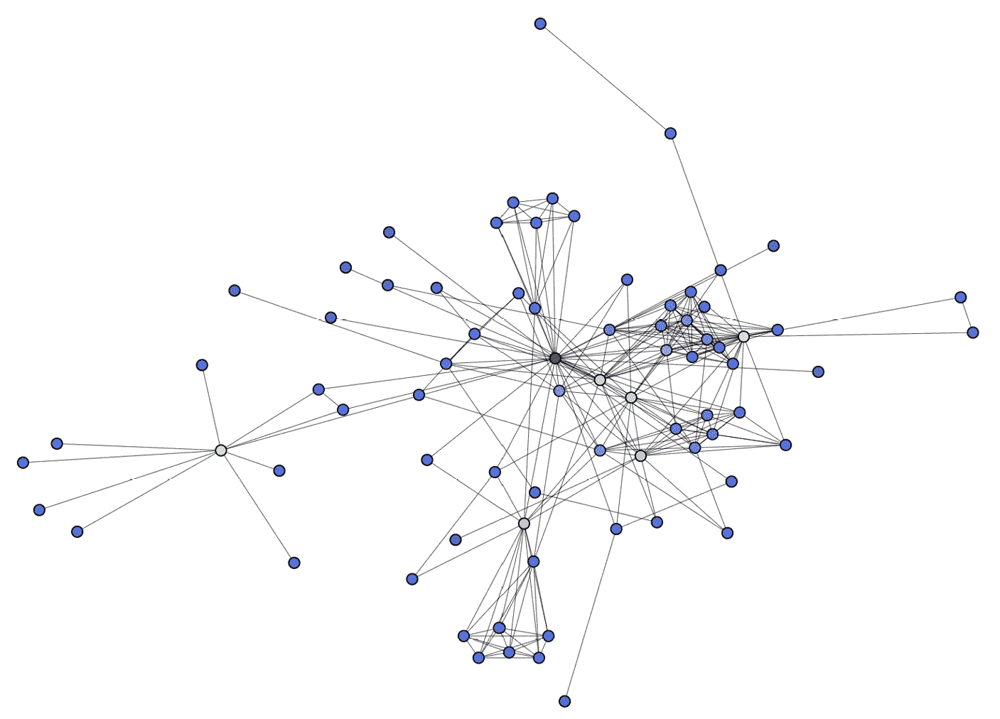

图 11.4 – 《悲惨世界》网络

这看起来符合预期。每个节点都有标签，但我们没有显示它们。

我还创建了一些带标签的训练数据。这些数据包含在本书附带的 GitHub 仓库的`/data`部分：

```py
train_data = 'data/clf_df.csv'
clf_df = pd.read_csv(train_data).set_index('index')
```

创建训练数据的过程稍微复杂一些，并且已经在上一章中解释过，所以请按照那些步骤手动学习如何操作。对于本章，你可以直接使用 CSV 文件来节省时间。让我们检查一下数据是否正确：

```py
clf_df.head()
```


图 11.5 – 手工制作的训练数据

在本章中，只有一个模型会使用手工制作的训练数据作为输入，但我们会将标签与我们的嵌入数据一起使用。我稍后会展示如何做。

有了图和训练数据，我们就可以继续进行下去了。

# 社区检测实践

在社区检测中，我们的明显目标是识别网络中存在的社区。我在*第九章*中解释了各种方法，*社区检测*。在本章中，我们将使用两种 Karate Club 算法：SCD 和 EgoNetSplitter。

对于这一章，通常来说，我倾向于选择那些能够良好扩展的模型。如果一个模型或算法仅在小型网络中有用，我会避免使用它。现实世界的网络庞大、稀疏且复杂。我不认为我见过某个扩展性差的模型比那些扩展性好的算法更优秀。在社区检测中尤为如此。最好的算法确实具有良好的扩展性。我最不喜欢的则完全不具备扩展性。

## SCD

我想展示的第一个社区检测算法是 SCD。你可以在[`karateclub.readthedocs.io/en/latest/modules/root.html#karateclub.community_detection.non_overlapping.scd.SCD`](https://karateclub.readthedocs.io/en/latest/modules/root.html#karateclub.community_detection.non_overlapping.scd.SCD)找到关于该模型的文档和期刊文章。

该模型声称比最准确的最先进社区检测解决方案要快得多，同时保持或甚至超过它们的质量。它还声称能够处理具有数十亿条边的图，这意味着它可以在现实世界网络中使用。它声称比 Louvain 算法表现得更好，后者是最快的社区检测算法。

这些都是大胆的声明。Louvain 在社区检测中非常有用，原因有几点。首先，它非常快速，适用于大规模网络。其次，Python 实现简单易用。因此，我们已经知道 Louvain 是快速且易于使用的。这个模型究竟有多好呢？让我们试试：

1.  首先，确保你已经在计算机上安装了 Karate Club。你可以通过简单的`pip install karateclub`来安装。

1.  现在，让我们使用该模型。首先，从导入开始。你需要这两个：

    ```py
    from karateclub.community_detection.non_overlapping.scd import SCD
    ```

    ```py
    import numpy as np
    ```

1.  既然我们有了这些，将图的社区分配到节点上就像 1、2、3 一样简单：

    ```py
    model = SCD()
    ```

    ```py
    model.fit(G)
    ```

    ```py
    clusters = model.get_memberships()
    ```

我们首先实例化 SCD，然后将图拟合到 SCD，接着获取每个节点的聚类成员关系。Karate Club 模型就是这么简单。你需要阅读文章来了解其背后的运作。

1.  聚类是什么样的？如果我们打印`clusters`变量，应该会看到如下内容：

    ```py
    {0: 34,
    ```

    ```py
     1: 14,
    ```

    ```py
     2: 14,
    ```

    ```py
     3: 14,
    ```

    ```py
     4: 33,
    ```

    ```py
     5: 32,
    ```

    ```py
     6: 31,
    ```

    ```py
     7: 30,
    ```

    ```py
     8: 29,
    ```

    ```py
     9: 28,
    ```

    ```py
     10: 11,
    ```

    ```py
    …
    ```

    ```py
    }
    ```

节点零在聚类 34 中，节点 1-3 在聚类 14 中，节点 4 在聚类 33 中，以此类推。

1.  接下来，我们将这些聚类数据塞进一个`numpy`数组中，以便可以用我们的命名节点更容易地确定哪些节点属于哪些聚类：

    ```py
    clusters = np.array(list(clusters.values()))
    ```

现在，`clusters`变量看起来是这样的：

```py
array([34, 14, 14, 14, 33, 32, 31, 30, 29, 28, 11, 27, 13, 26, 25, 24,  7,
       15, 15,  4, 15,  9, 11,  6, 23, 35, 11, 11, 11, 11, 11, 36,  9,  1,
        4,  4,  1,  1,  1, 15, 15, 15, 15, 37,  7,  7,  7,  7,  7,  7,  7,
        6, 15, 15, 22, 17, 21, 15,  4, 20, 17,  1,  1, 19, 19,  1,  1,  1,
        1,  1,  1,  2,  2,  1,  0, 18, 16])
```

1.  然后，我们创建一个`cluster`数据框：

    ```py
    cluster_df = pd.DataFrame({'node':nodes, 'cluster':clusters})
    ```

    ```py
    cluster_df.head(10)
    ```

这将给我们如下输出：

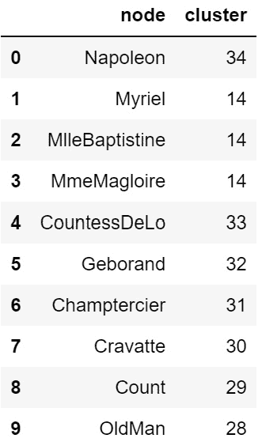

图 11.6 – SCD 聚类数据框

太好了。以这种格式呈现更容易理解。我们现在有了实际的节点和它们所属的社区。

1.  让我们通过节点成员关系找出最大的社区：

    ```py
    title = 'Clusters by Node Count (SCD)'
    ```

    ```py
    cluster_df['cluster'].value_counts()[0:10].plot.barh(title=title).invert_yaxis()
    ```

这将给我们如下结果：

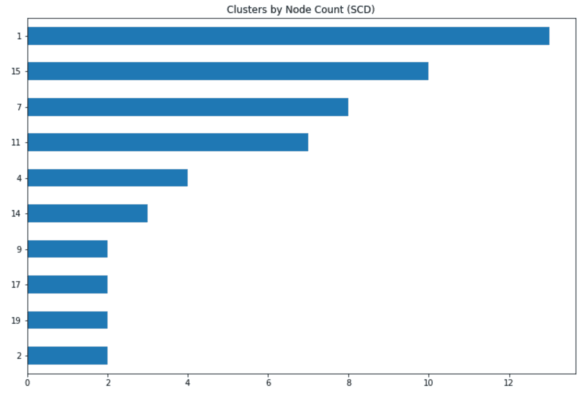

图 11.7 – 按节点数划分的 SCD 社区

1.  社区 1 是最大的，有 13 个成员，其次是社区 15，有 10 个成员。让我们一起检查这两个社区：

    ```py
    check_cluster = 1
    ```

    ```py
    community_nodes = cluster_df[cluster_df['cluster']==check_cluster]['node'].to_list()
    ```

    ```py
    G_comm = G_named.subgraph(community_nodes)
    ```

    ```py
    draw_graph(G_comm, show_names=True, node_size=5)
    ```

这给我们带来了以下内容：

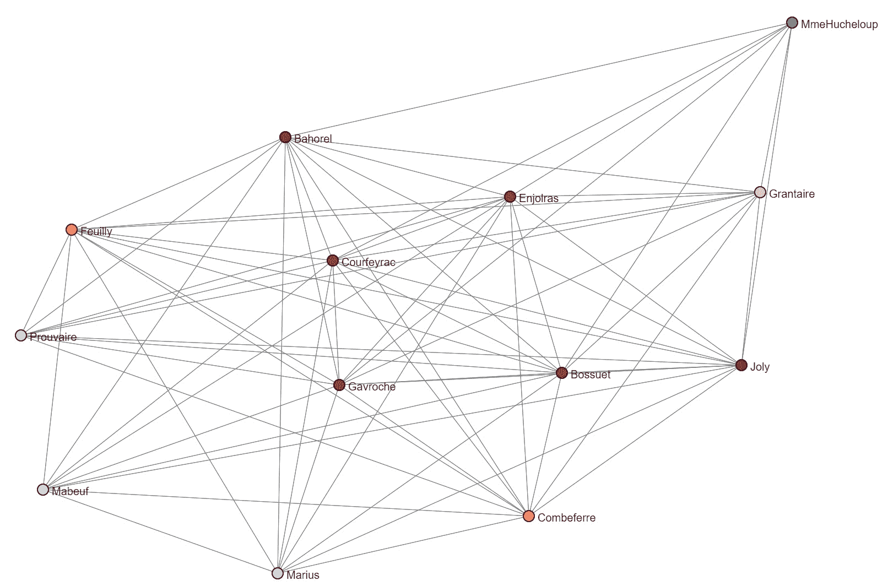

图 11.8 – SCD 社区 1

这非常棒。这是一个清晰的高度连接的社区。这是一个密集连接的社区，并不是所有节点都连接得一样好，一些节点比其他节点更为中心。

1.  让我们看看社区 15：

    ```py
    check_cluster = 15
    ```

    ```py
    community_nodes = cluster_df[cluster_df['cluster']==check_cluster]['node'].to_list()
    ```

    ```py
    G_comm = G_named.subgraph(community_nodes)
    ```

    ```py
    draw_graph(G_comm, show_names=True, node_size=5)
    ```

结果如下：

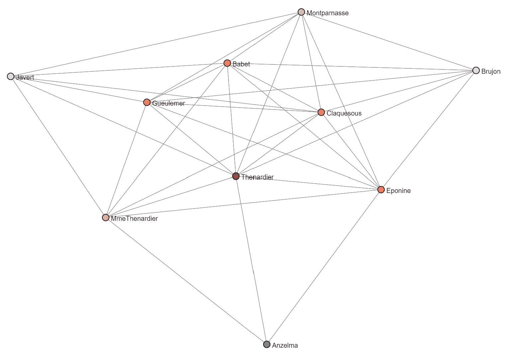

图 11.9 – SCD 社区 15

这是另一个高质量的社区提取。所有节点都与社区中的其他节点相连。一些节点比其他节点更为中心。

1.  让我们再看看一个社区：

    ```py
    check_cluster = 7
    ```

    ```py
    community_nodes = cluster_df[cluster_df['cluster']==check_cluster]['node'].to_list()
    ```

    ```py
    G_comm = G_named.subgraph(community_nodes)
    ```

    ```py
    draw_graph(G_comm, show_names=True, node_size=5)
    ```

我们得到了*图 11.10*。

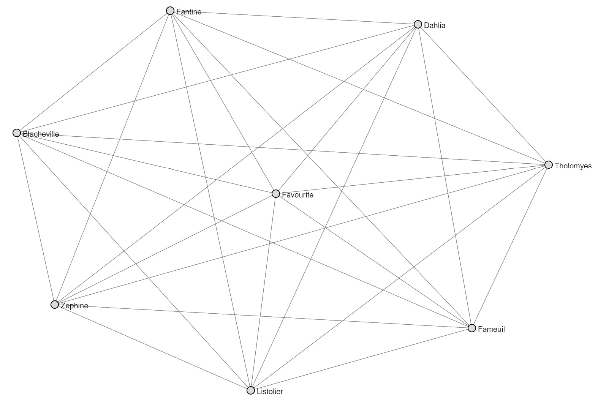

图 11.10 – SCD 社区 7

这是另一个高质量的社区提取。社区中的所有节点都相互连接。在这种情况下，这是一种相当令人愉悦的可视化效果，因为所有节点的连接性相同。它非常对称且美丽。

*悲惨世界*网络非常小，因此，自然地，SCD 模型几乎能立即进行训练。

我喜欢这种方法的一个原因是，它的设置比我在*第九章*中解释的其他方法简单。我可以在几乎不需要任何代码的情况下，从图形直接生成社区。事实上，如果它真的能扩展到具有数十亿条边的网络，那将是不可思议的。它快速、简洁且实用。

### EgoNetSplitter

我们将要测试的下一个社区检测模型叫做 EgoNetSplitter。你可以在这里了解它：[`karateclub.readthedocs.io/en/latest/modules/root.html#karateclub.community_detection.overlapping.ego_splitter.EgoNetSplitter`](https://karateclub.readthedocs.io/en/latest/modules/root.html#karateclub.community_detection.overlapping.ego_splitter.EgoNetSplitter)。

在 Jupyter 中，如果你按*Shift* + *Tab*进入模型实例化代码，你可以查看相关信息：

工具首先创建节点的自我网络。然后，使用 Louvain 方法创建一个人物图，并对其进行聚类。生成的重叠聚类成员关系以字典形式存储。

所以，这个模型创建自我网络，然后使用 Louvain 进行聚类，最后将重叠的成员关系存储为字典。这是一个有趣的方式，与其他方法不同，所以我觉得测试一下它的表现会很有意思。步骤与 SCD 的略有不同：

1.  首先，让我们先把模型搭建好：

    ```py
    from karateclub.community_detection.overlapping.ego_splitter import EgoNetSplitter
    ```

    ```py
    model = EgoNetSplitter()
    ```

    ```py
    model.fit(G)
    ```

    ```py
    clusters = model.get_memberships()
    ```

    ```py
    clusters = np.array(list(clusters.values()))
    ```

    ```py
    clusters = [i[0] for i in clusters] # needed because put clusters into an array of arrays
    ```

1.  这将得到我们的聚类。接下来，创建我们的`cluster`数据框并进行可视化的代码与 SCD 相同：

    ```py
    cluster_df = pd.DataFrame({'node':nodes, 'cluster':clusters})
    ```

1.  让我们通过计数来检查社区成员：

    ```py
    title = 'Clusters by Node Count (EgoNetSplitter)'
    ```

    ```py
    cluster_df['cluster'].value_counts()[0:10].plot.barh(title=title).invert_yaxis()
    ```

我们得到以下输出：


图 11.11 – 按节点数量划分的 EgoNetSplitter 社区

结果与 SCD 已经看起来不同了。这应该很有趣。

1.  让我们来看看有什么不同。聚类 7 和 1 是最大的，我们来看看这两个：

    ```py
    check_cluster = 7
    ```

    ```py
    community_nodes = cluster_df[cluster_df['cluster']==check_cluster]['node'].to_list()
    ```

    ```py
    G_comm = G_named.subgraph(community_nodes)
    ```

    ```py
    draw_graph(G_comm, show_names=True, node_size=5)
    ```

这将绘制我们的自我网络。

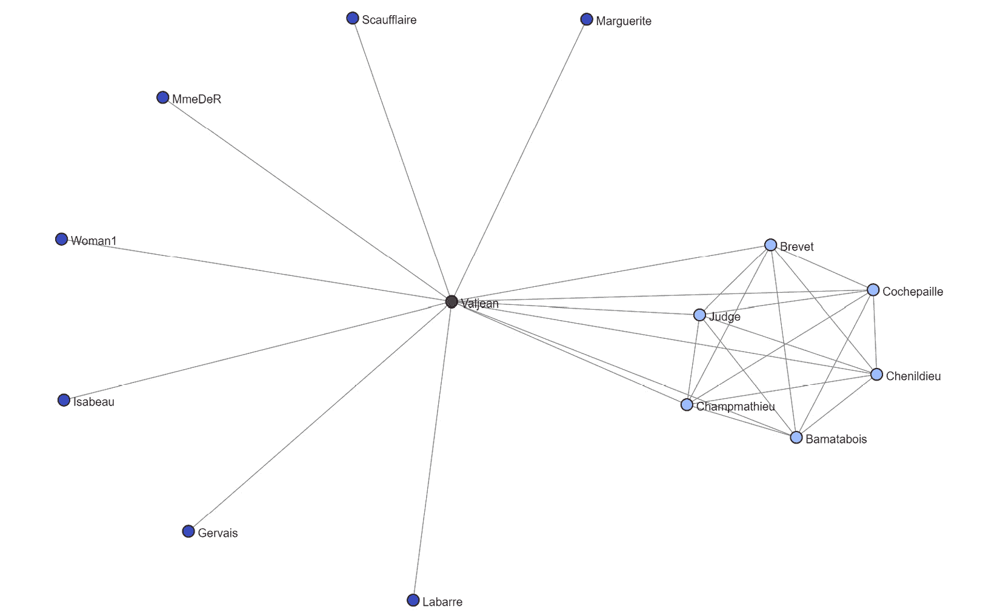

图 11.12 – EgoNetSplitter 社区 7

我不喜欢这样。我认为左侧的节点不应该和右侧与密集连接节点相连的节点属于同一个社区。就我个人而言，我觉得这不像 SCD 的结果那样有用。

1.  让我们看看下一个人口最多的聚类：

    ```py
    check_cluster = 1
    ```

    ```py
    community_nodes = cluster_df[cluster_df['cluster']==check_cluster]['node'].to_list()
    ```

    ```py
    G_comm = G_named.subgraph(community_nodes)
    ```

    ```py
    draw_graph(G_comm, show_names=True, node_size=5)
    ```

*图 11.13* 显示了结果输出。

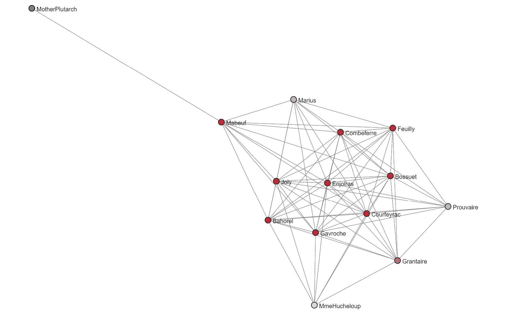

图 11.13 – EgoNetSplitter 社区 1

再次出现类似的情况，其中一个节点被包含在网络中，但实际上它不应该在其中。**MotherPlutarch** 可能与 **Mabeuf** 连接，但她与社区中的其他人没有任何关系。

1.  让我们最后来看一下下一个社区：

    ```py
    check_cluster = 5
    ```

    ```py
    community_nodes = cluster_df[cluster_df['cluster']==check_cluster]['node'].to_list()
    ```

    ```py
    G_comm = G_named.subgraph(community_nodes)
    ```

    ```py
    draw_graph(G_comm, show_names=True, node_size=5)
    ```

代码产生了以下输出：


图 11.14 – EgoNetSplitter 社区 5

再次看到一个节点与另一个节点连接，但没有与网络中的其他节点连接。

我不想说 EgoNetSplitter 比 SCD 或其他任何模型差。我个人更喜欢 SCD 的社区检测输出，而不是 EgoNetSplitter。然而，也可以说，考虑到它们之间仅有的一条连接，将这些额外的节点作为社区的一部分可能比将它们排除在外更好。了解这两种方法的区别以及它们结果的差异非常重要。

然而，鉴于 SCD 的可扩展性声明以及它对社区的清晰划分，我倾向于选择 SCD 进行社区检测。

既然我们已经探讨了使用无监督机器学习进行社区检测，那么让我们继续使用无监督机器学习来创建图嵌入。

# 图嵌入实战

既然我们已经走出了社区检测的舒适区，现在我们进入了图嵌入的奇异领域。我理解图嵌入的最简单方式就是将一个复杂的网络解构成一个更适合机器学习任务的格式。这是将复杂的数据结构转换为不那么复杂的数据结构。这是一个简单的理解方式。

一些无监督机器学习模型会创建比其他模型更多的嵌入维度（更多的列/特征），正如你将在本节中看到的那样。在本节中，我们将创建嵌入，检查具有相似嵌入的节点，然后使用这些嵌入与监督机器学习结合来预测“是否革命性”，就像我们上一章的“找出革命者”游戏。

我们将快速浏览几种不同模型的使用方法——如果我详细讲解每个模型，这一章节可能会有几百页长。所以，为了节省时间，我会提供文档链接和一个简单的总结，我们将做一些简单的比较。请理解，使用机器学习时绝不可盲目操作。请阅读文档、阅读相关文章，了解模型如何工作。我已经做了很多准备工作，你也应该这样做。当然，可以随意尝试不同的模型，看看它们的表现。如果你只是进行实验，并且不将它们投入生产环境，你不会因为使用 `scikit-learn` 模型而意外造成时空裂缝。

我们将需要这个辅助函数来可视化接下来的嵌入：

```py
def draw_clustering(embeddings, nodes, title):
    import plotly.express as px
    from sklearn.decomposition import PCA
    embed_df = pd.DataFrame(embeddings)
    # dim reduction, two features; solely for visualization
    model = PCA(n_components=2)
    X_features = model.fit_transform(embed_df)
    embed_df = pd.DataFrame(X_features)
    embed_df.index = nodes
    embed_df.columns = ['x', 'y']
    fig = px.scatter(embed_df, x='x', y='y', text=embed_df.index)
    fig.update_traces(textposition='top center')
    fig.update_layout(height=800, title_text=title, font_size=11)
    return fig.show()
```

我需要解释一些事情。首先，这个 `draw_clustering` 函数使用 `plotly` 来创建一个交互式散点图。你可以进行缩放并交互式地检查节点。你需要安装 `plotly`，可以通过 `pip` `install plotly` 来完成安装。

其次，我使用 **主成分分析**（**PCA**）将嵌入降至二维，主要是为了可视化。PCA 也是一种无监督学习方法，适用于降维。我需要这样做，以便向你展示这些嵌入模型表现不同。将嵌入降至二维后，我可以在散点图上可视化它们。我不建议在创建嵌入后进行 PCA。此过程仅用于可视化。

## FEATHER

我们将使用的第一个算法叫做 **FEATHER**，你可以在 [`karateclub.readthedocs.io/en/latest/modules/root.html#karateclub.node_embedding.attributed.feathernode.FeatherNode`](https://karateclub.readthedocs.io/en/latest/modules/root.html#karateclub.node_embedding.attributed.feathernode.FeatherNode) 了解它。

在 Jupyter 中，如果你 *Shift* + *Tab* 进入模型实例化代码，你可以阅读相关内容：

“FEATHER-N” 的实现，< [`arxiv.org/abs/2005.07959`](https://arxiv.org/abs/2005.07959) >，来自 CIKM ‘20 论文《图上的特征函数：同类相聚，从统计描述符到参数模型》。该过程使用节点特征的特征函数与随机游走权重来描述节点邻域。

FEATHER 声称能够创建高质量的图形表示，有效地执行迁移学习，并且能很好地扩展到大规模网络。它创建节点嵌入。

这个模型实际上非常有趣，因为它可以同时使用图形和附加的训练数据来创建嵌入。我很想进一步探索这个想法，看看它在不同类型的训练数据（如 `tf-idf` 或主题）下表现如何：

1.  现在，让我们使用之前用过的手工制作的训练数据：

    ```py
    from karateclub.node_embedding.attributed.feathernode import FeatherNode
    ```

    ```py
    model = FeatherNode()
    ```

    ```py
    model.fit(G, clf_df)
    ```

    ```py
    embeddings = model.get_embedding()
    ```

首先，我们导入模型，然后实例化它。在`model.fit`这一行，注意到我们同时传入了`G`和`clf_df`。后者是我们手动创建的训练数据。与其他模型不同，我们只传入`G`。对我来说，这是非常有趣的，因为它似乎让模型能够基于其他上下文数据学习更多关于网络的内容。

1.  让我们可视化这些嵌入，以便看看模型是如何工作的：

    ```py
    title = 'Les Miserables Character Similarity (FeatherNode)'
    ```

    ```py
    draw_clustering(embeddings, nodes, title)
    ```

我们得到以下输出：

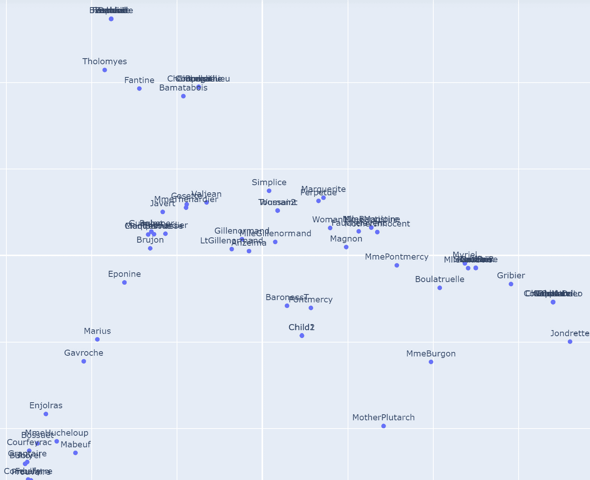

图 11.15 – FEATHER 嵌入

这很有趣。我们可以看到有几个节点出现在一起。由于这是一个交互式可视化，我们可以检查其中任何一个。如果我们放大左下角的聚类，我们可以看到以下内容：

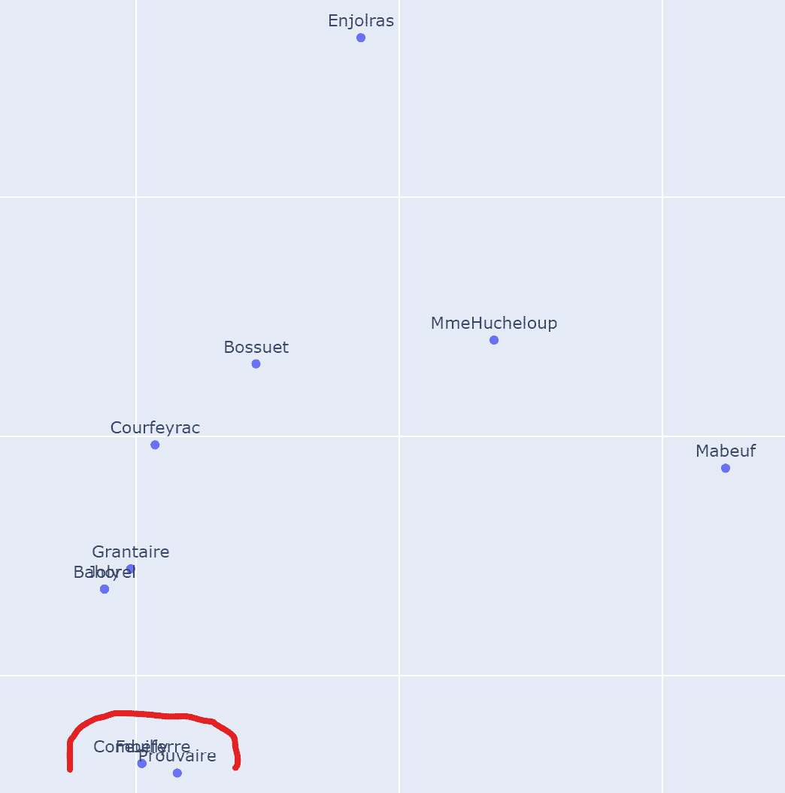

图 11.16 – FEATHER 嵌入放大图

由于重叠，很难阅读，但**Feuilly**出现在左下角，靠近**Prouvaire**。

1.  让我们检查一下他们的自我网络，看看有哪些相似之处：

    ```py
    node = 'Feuilly'
    ```

    ```py
    G_ego = nx.ego_graph(G_named, node)
    ```

    ```py
    draw_graph(G_ego, show_names=True, node_size=3)
    ```

这产生了*图 11**.17*：

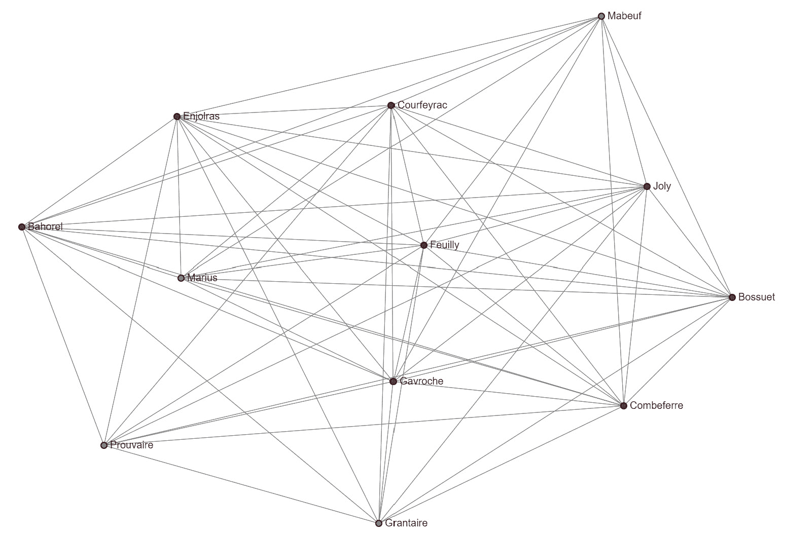

图 11.17 – Feuilly 自我网络

1.  现在，让我们检查一下 Prouvaire 的自我网络：

    ```py
    node = 'Prouvaire'
    ```

    ```py
    G_ego = nx.ego_graph(G_named, node)
    ```

    ```py
    draw_graph(G_ego, show_names=True, node_size=3)
    ```

这输出了*图 11**.18*。

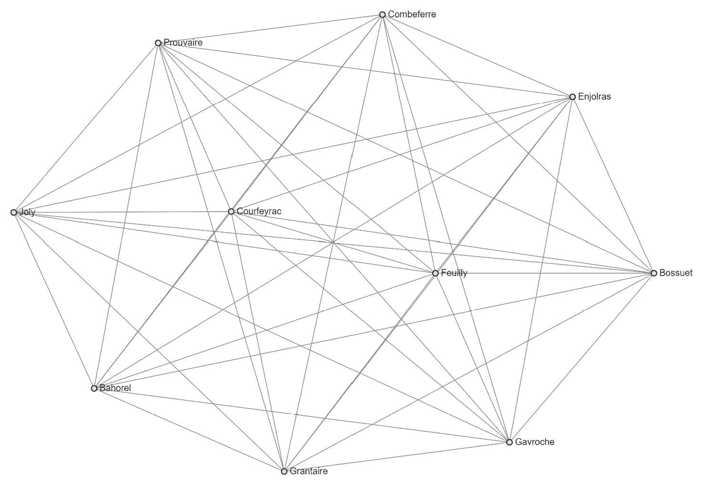

图 11.18 – Prouvaire 自我网络

很好。第一个观察结果是，它们都是彼此自我网络的一部分，并且也是彼此社区的一部分。第二，它们的节点连接性相当强。在两个自我网络中，两个节点都显示出相当强的连接性，并且都是密集连接社区的一部分。

1.  让我们看一下其他一些节点：

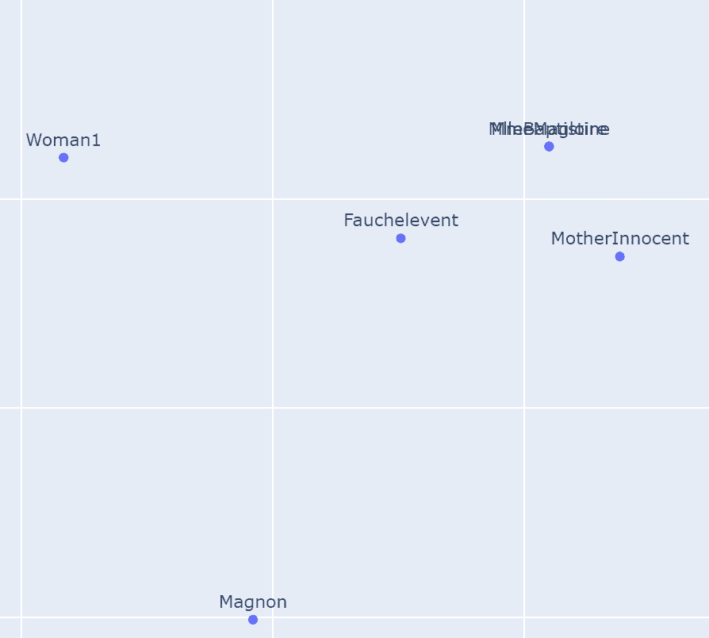

图 11.19 – FEATHER 嵌入放大图

1.  让我们检查一下**MotherInnocent**和**MmeMagloire**的自我网络。首先是**MotherInnocent**：

    ```py
    node = 'MotherInnocent'
    ```

    ```py
    G_ego = nx.ego_graph(G_named, node)
    ```

    ```py
    draw_graph(G_ego, show_names=True, node_size=3)
    ```

*图 11**.20*显示了输出。

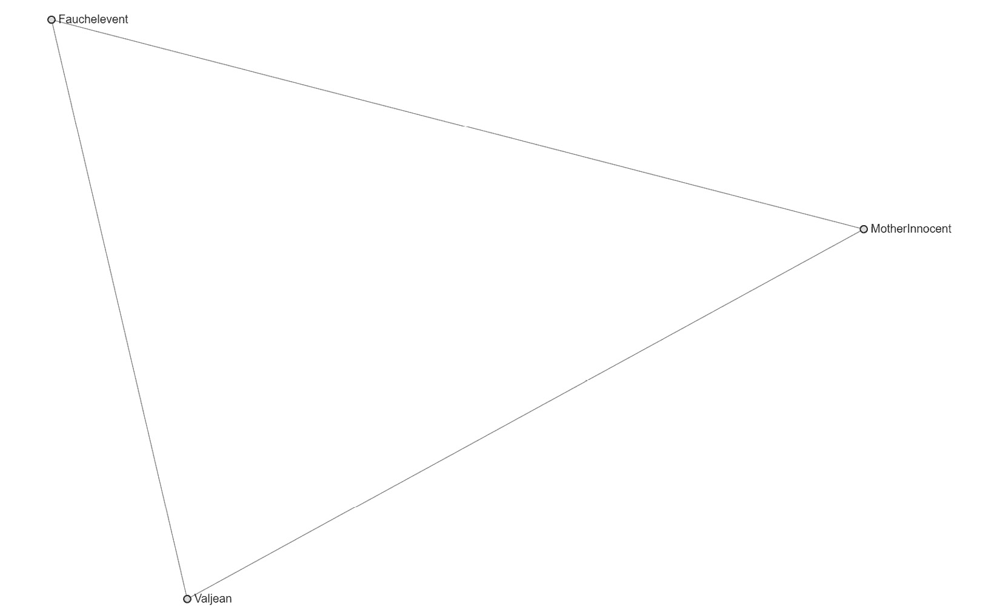

图 11.20 – MotherInnocent 自我网络

现在是**MmeMagloire**：

```py
node = 'MmeMagloire'
G_ego = nx.ego_graph(G_named, node)
draw_graph(G_ego, show_names=True, node_size=3)
```

*图 11**.21*显示了结果。

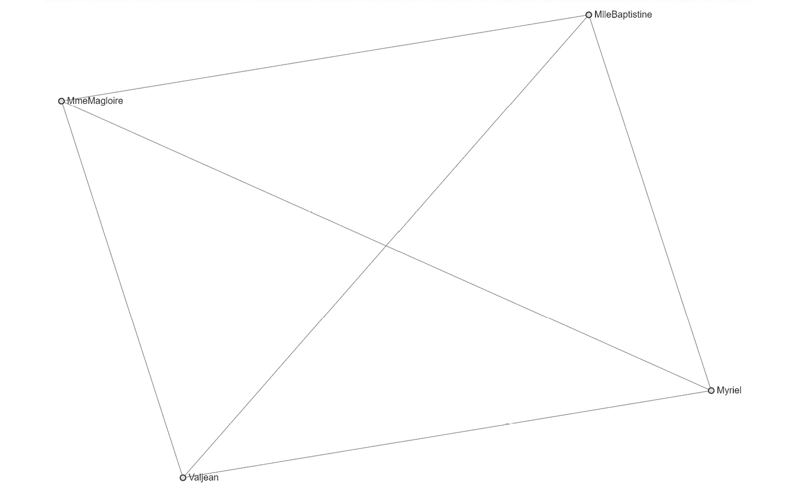

图 11.21 – MmeMagloire 自我网络

**MotherInnocent**有两条边，**MmeMagloire**有三条。它们的自我网络相当小。这些相似性被 FEATHER 捕捉并转化为嵌入。

1.  但实际的嵌入是什么样的呢？

    ```py
    eb_df = pd.DataFrame(embeddings, index=nodes)
    ```

    ```py
    eb_df['label'] = clf_df['label']
    ```

    ```py
    eb_df.head(10)
    ```

这将生成以下数据框。


图 11.22 – FEATHER 嵌入数据框

图形被转化为 1,750 维的嵌入。在这种格式下，你可以将它们看作列或特征。一个简单的网络被转化为 1,750 列，这对于这么小的网络来说数据量相当大。我们在处理其他模型（如 FEATHER）时，注意这些模型所创建的维度数量。

这些嵌入对分类很有用，所以我们就做这个。我将直接把数据丢给分类模型，并希望能够得到好结果。这种做法除了用于简单实验之外从来不是一个好主意，但这正是我们要做的。我鼓励你深入探索你感兴趣的任何模型。

1.  前面的代码已经添加了`label`字段，但我们还需要创建我们的`X`和`y`数据来进行分类：

    ```py
    from sklearn.model_selection import train_test_split
    ```

    ```py
    X_cols = [c for c in eb_df.columns if c != 'label']
    ```

    ```py
    X = eb_df[X_cols]
    ```

    ```py
    y = eb_df['label']
    ```

    ```py
    X_train, X_test, y_train, y_test = train_test_split(X, y, random_state=1337, test_size=0.3)
    ```

`X`是我们的数据，`y`是正确答案。这是我们的“识别革命者”训练数据。标记为革命者的节点其`y`为`1`，其余节点的`y`为`0`。

1.  让我们训练一个随机森林模型，因为我想向你展示一些关于可解释性的东西：

    ```py
    from sklearn.ensemble import RandomForestClassifier
    ```

    ```py
    clf = RandomForestClassifier(random_state=1337)
    ```

    ```py
    clf.fit(X_train, y_train)
    ```

    ```py
    train_acc = clf.score(X_train, y_train)
    ```

    ```py
    test_acc = clf.score(X_test, y_test)
    ```

    ```py
    print('train accuracy: {}\ntest accuracy: {}'.format(train_acc, test_acc))
    ```

如果我们运行这段代码，得到的结果是：

```py
train accuracy: 0.9811320754716981
test accuracy: 1.0
```

使用 FEATHER 嵌入作为训练数据，模型能够在未见过的数据上 100%准确地识别出革命者。这是一个小型网络，不过，绝对不要，*永远不要*信任任何能给出 100%准确度的模型。一个看似达到 100%准确度的模型，通常会隐藏一个更深层次的问题，比如数据泄漏，因此很有必要对非常高的分数持怀疑态度，或者在模型经过彻底验证之前，通常要对模型结果保持怀疑。这是一个玩具模型。然而，这表明这些嵌入可以通过图形创建，并且监督式机器学习模型可以在预测中使用这些嵌入。

然而，使用这些嵌入与模型结合时有一个严重的缺点。你失去了所有的可解释性。在前面这一章中展示的手工制作的训练数据中，我们可以看到模型在做出预测时最有用的特征是什么。让我们检查一下这些嵌入的特征重要性：

```py
importances = pd.DataFrame(clf.feature_importances_, index=X_train.columns)
importances.columns = ['importance']
importances.sort_values('importance', ascending=False, inplace=True)
importances[0:10].plot.barh(figsize=(10,4)).invert_yaxis()
```

我们得到这个输出：

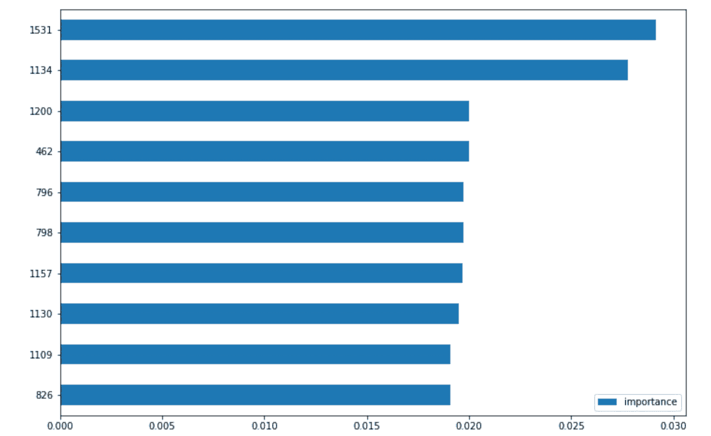

图 11.23 – FEATHER 嵌入特征重要性

太棒了！发现 1531 嵌入比 1134 稍微有用，但这两个嵌入都比其他嵌入要有用得多！太棒了！这是完全丧失了解释性，但这些嵌入确实有效。如果你只是想从图到机器学习，这种方法可以使用，但无论使用哪个模型进行预测，最终都会得到一个黑箱模型。

好了，对于接下来的模型，我将加快速度。我们将重复使用很多代码，我只是会减少可视化部分，并减少代码量，以便本章不会变成 100 页长。

## NodeSketch

我们接下来要看的算法是**NodeSketch**，你可以在[`karateclub.readthedocs.io/en/latest/modules/root.html#karateclub.node_embedding.neighbourhood.nodesketch.NodeSketch`](https://karateclub.readthedocs.io/en/latest/modules/root.html#karateclub.node_embedding.neighbourhood.nodesketch.NodeSketch)了解更多信息。

在 Jupyter 中，如果你按*Shift* + *Tab*进入模型实例化代码，你可以查看相关信息：

“NodeSketch”的实现 <https://exascale.info/assets/pdf/yang2019nodesketch.pdf>

来自 KDD ‘19 论文 “NodeSketch: 高效图嵌入

通过递归草图化”。该过程从绘制图的自环增强邻接矩阵开始，输出低阶节点嵌入，然后基于自环增强邻接矩阵和（k-1）阶节点嵌入递归生成 k 阶节点嵌入。

与 FEATHER 类似，NodeSketch 也会创建节点嵌入：

1.  让我们使用模型，一次性进行可视化：

    ```py
    from karateclub.node_embedding.neighbourhood.nodesketch import NodeSketch
    ```

    ```py
    model = NodeSketch()
    ```

    ```py
    model.fit(G)
    ```

    ```py
    embeddings = model.get_embedding()
    ```

    ```py
    title = 'Les Miserables Character Similarity (NodeSketch)'
    ```

    ```py
    draw_clustering(embeddings, nodes, title)
    ```

以下图表是结果：

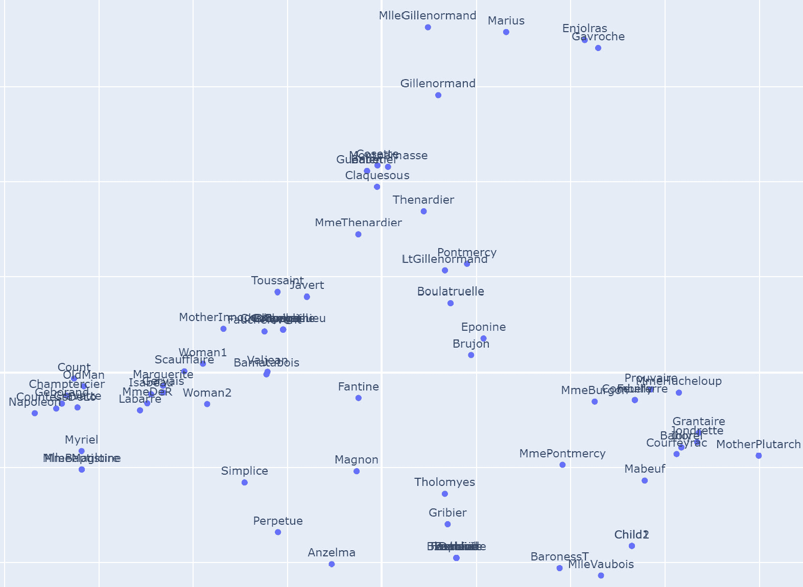

图 11.24 – NodeSketch 嵌入

1.  如前所示，这个可视化是互动式的，你可以放大节点集群以进行更细致的检查。让我们来看几个被发现相似的节点。

首先，**Eponine**：

```py
node = 'Eponine'
G_ego = nx.ego_graph(G_named, node)
draw_graph(G_ego, show_names=True, node_size=3)
```

你可以在 *图 11**.25* 中看到结果。


图 11.25 – Eponine 自我网络

1.  接下来，**Brujon**：

    ```py
    node = 'Brujon'
    ```

    ```py
    G_ego = nx.ego_graph(G_named, node)
    ```

    ```py
    draw_graph(G_ego, show_names=True, node_size=3)
    ```

如 *图 11**.26* 所示。

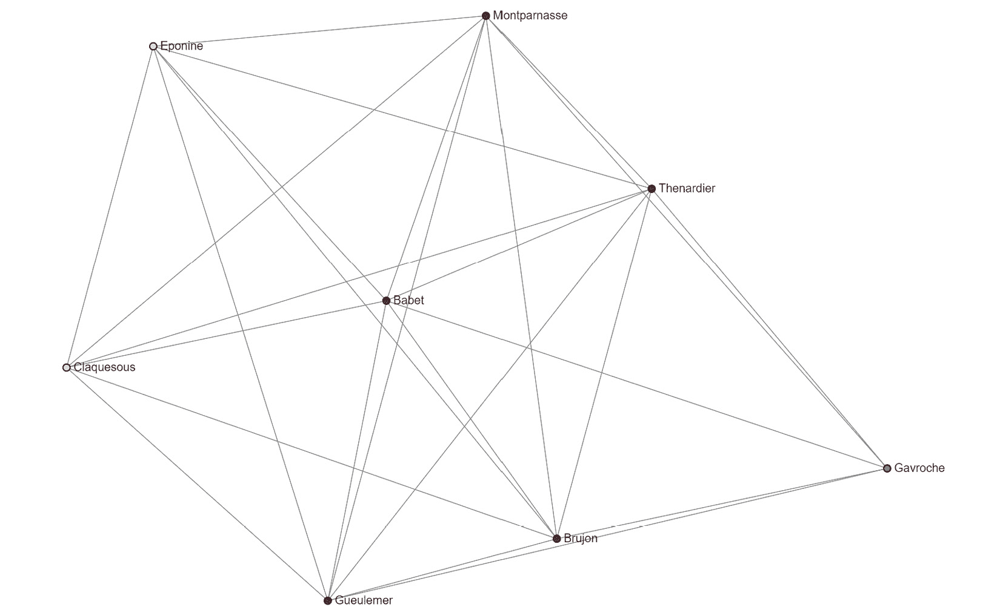

图 11.26 – Brujon 自我网络

经检查，自我网络看起来差异很大，但这两个节点似乎具有相同数量的连接，并且它们都是一个连接良好的社区的一部分。我很满意这两个节点在结构和位置上非常相似。两个节点也是同一个社区的一部分。

1.  嵌入的样子是什么？

    ```py
    eb_df = pd.DataFrame(embeddings, index=nodes)
    ```

    ```py
    eb_df['label'] = clf_df['label']
    ```

    ```py
    eb_df.head(10)
    ```

这将展示我们的数据框。

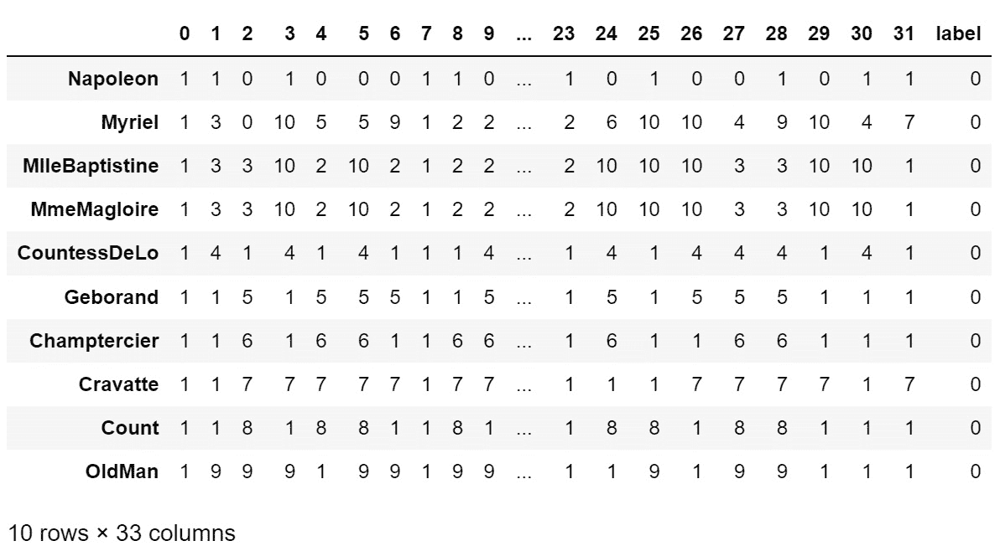

图 11.27 – NodeSketch 嵌入数据框

哇，这是一个比 FEATHER 生成的数据集简单得多。**32** 个特征，而不是 1,750 个。另外，请注意，嵌入中的值是整数而不是浮动值。随机森林能在这个训练数据上做出多好的预测？

```py
X_cols = [c for c in eb_df.columns if c != 'label']
X = eb_df[X_cols]
y = eb_df['label']
X_train, X_test, y_train, y_test = train_test_split(X, y, random_state=1337, test_size=0.3)
clf = RandomForestClassifier(random_state=1337)
clf.fit(X_train, y_train)
train_acc = clf.score(X_train, y_train)
test_acc = clf.score(X_test, y_test)
print('train accuracy: {}\ntest accuracy: {}'.format(train_acc, test_acc))
```

如果我们运行代码，会得到以下结果：

```py
train accuracy: 0.9811320754716981
test accuracy: 1.0
```

该模型能够在训练数据上以 98% 的准确率进行预测，在测试数据上则达到了 100% 的准确率。同样，永远不要测试一个给出 100% 准确率的模型。但这仍然显示出该模型能够使用这些嵌入。

1.  它发现了哪些重要特征？

    ```py
    importances = pd.DataFrame(clf.feature_importances_, index=X_train.columns)
    ```

    ```py
    importances.columns = ['importance']
    ```

    ```py
    importances.sort_values('importance', ascending=False, inplace=True)
    ```

    ```py
    importances[0:10].plot.barh(figsize=(10,4)).invert_yaxis()
    ```

这将产生 *图 11**.28*。

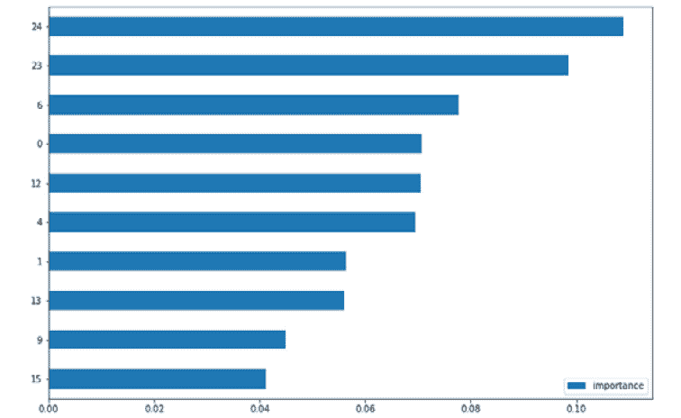

图 11.28 – NodeSketch 嵌入特征重要性

很好。如前所示，使用这些嵌入将随机森林变成了一个黑盒模型，我们无法从中获取任何模型可解释性。我们知道模型发现特征 **24** 和 **23** 最为有用，但我们不知道为什么。之后我不会再展示特征重要性了，你明白了。

这是一个很酷的模型，它默认创建比 FEATHER 更简单的嵌入。随机森林在这两种模型的嵌入上表现得都很好，我们无法在没有更多实验的情况下说哪个更好，而这超出了本章的范围。祝你在实验中玩得开心！

## RandNE

接下来是**RandNE**，它声称对于“百亿级网络嵌入”非常有用。这意味着它适用于具有数十亿节点或数十亿边的网络。这一声明使得该模型对于大规模的现实世界网络非常有用。你可以在[`karateclub.readthedocs.io/en/latest/modules/root.html#karateclub.node_embedding.neighbourhood.randne.RandNE`](https://karateclub.readthedocs.io/en/latest/modules/root.html#karateclub.node_embedding.neighbourhood.randne.RandNE)阅读相关文档。

在 Jupyter 中，如果你*Shift* + *Tab*进入模型实例化代码，你可以查看相关信息：

“RandNE”实现来自 ICDM '18 论文《百亿级网络嵌入与迭代随机投影》 <https://zw-zhang.github.io/files/2018_ICDM_RandNE.pdf>。该过程使用基于正则化邻接矩阵的平滑方法，并在正交化的随机正态生成基节点嵌入矩阵上进行操作。

1.  再次，我们来一次性生成嵌入并进行可视化：

    ```py
    from karateclub.node_embedding.neighbourhood.randne import RandNE
    ```

    ```py
    model = RandNE()
    ```

    ```py
    model.fit(G)
    ```

    ```py
    embeddings = model.get_embedding()
    ```

    ```py
    title = 'Les Miserables Character Similarity (RandNE)'
    ```

    ```py
    draw_clustering(embeddings, nodes, title)
    ```

输出的图表如下：

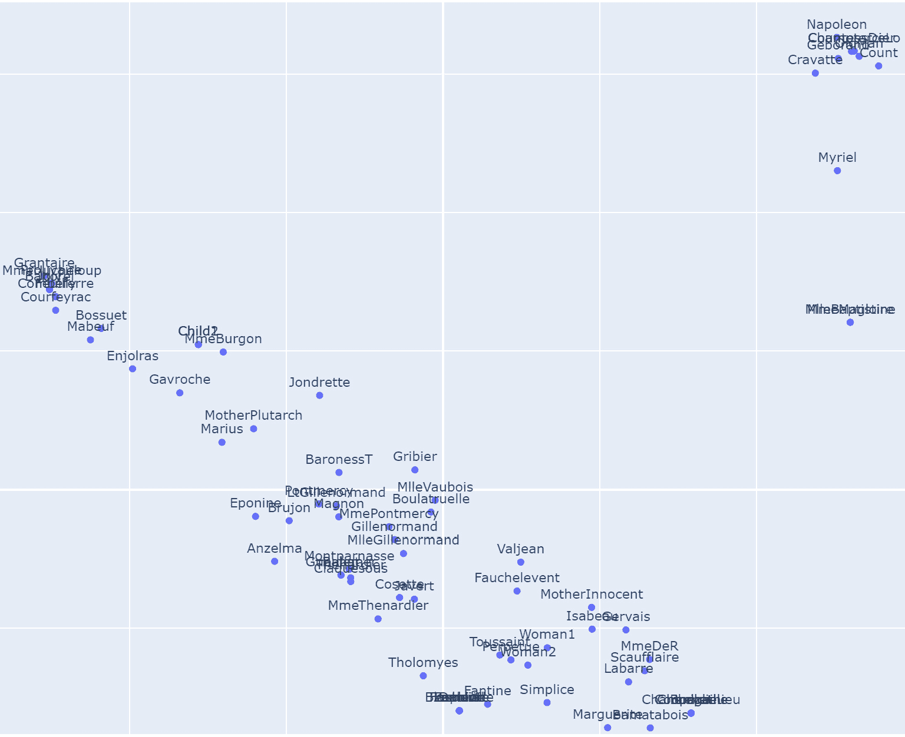

图 11.29 – RandNE 嵌入

1.  你可以立即看到，这个散点图与 FEATHER 和 NodeSketch 的都很不同。让我们来看看`Marius`和`MotherPlutarch`这两个已被认为是相似的节点的自我网络：

    ```py
    node = 'Marius'
    ```

    ```py
    G_ego = nx.ego_graph(G_named, node)
    ```

    ```py
    draw_graph(G_ego, show_names=True, node_size=3)
    ```

我们得到了一个网络输出：

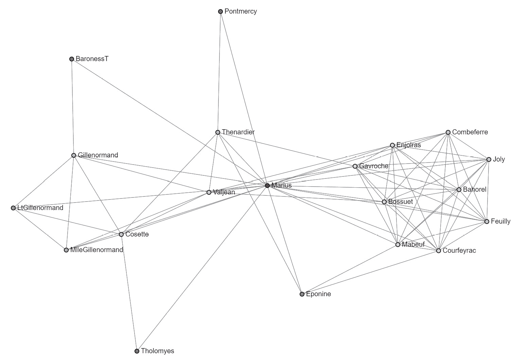

图 11.30 – Marius 自我网络

1.  接下来是**MotherPlutarch**：

    ```py
    node = 'MotherPlutarch'
    ```

    ```py
    G_ego = nx.ego_graph(G_named, node)
    ```

    ```py
    draw_graph(G_ego, show_names=True, node_size=3)
    ```

网络如下所示：

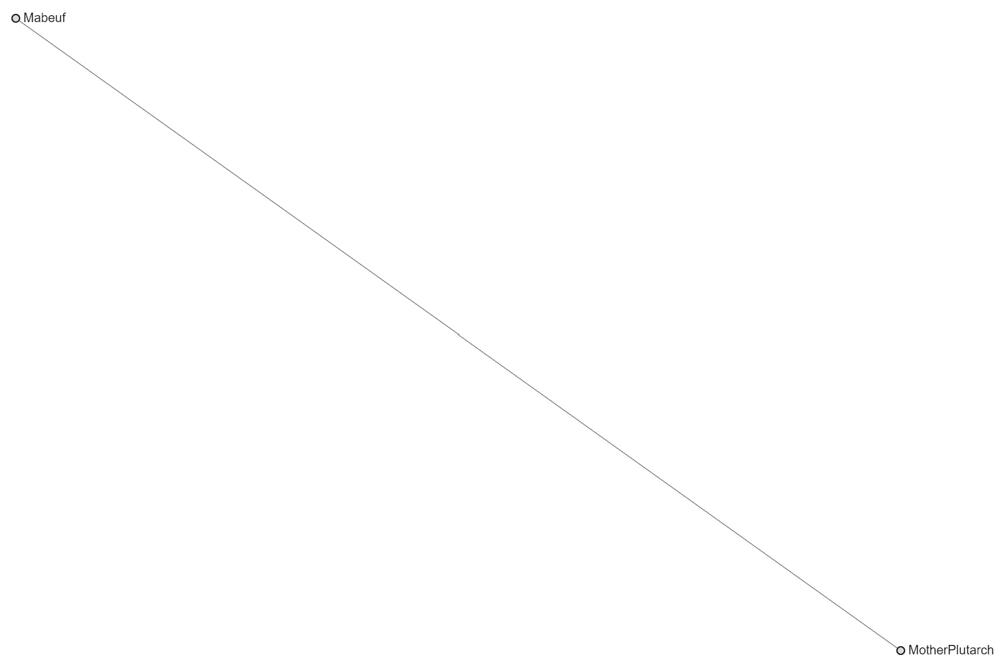

图 11.31 – MotherPlutarch 自我网络

哇，这些自我网络差异如此之大，节点也一样。**Marius**是一个连接良好的节点，而**MotherPlutarch**与另一个节点只有一条边。这是两个非常不同的节点，而嵌入结果却显示它们是相似的。不过，这可能是由于散点图可视化中的 PCA 步骤导致的，因此请不要仅凭这一例子就对 RandNE 做出过快判断。查看其他相似节点。我将把这个留给你，作为你自己的练习和学习。

嵌入结果是什么样子的？

```py
eb_df = pd.DataFrame(embeddings, index=nodes)
eb_df['label'] = clf_df['label']
eb_df.head(10)
```

这将显示我们的嵌入。


图 11.32 – RandNE 嵌入数据框

最终的嵌入是 77 个特征，因此它默认创建的嵌入比 FEATHER 更简单。相比之下，NodeSketch 创建了 32 个特征。

1.  随机森林能够多好地利用这些嵌入？

    ```py
    X_cols = [c for c in eb_df.columns if c != 'label']
    ```

    ```py
    X = eb_df[X_cols]
    ```

    ```py
    y = eb_df['label']
    ```

    ```py
    X_train, X_test, y_train, y_test = train_test_split(X, y, random_state=1337, test_size=0.3)
    ```

    ```py
    clf = RandomForestClassifier(random_state=1337)
    ```

    ```py
    clf.fit(X_train, y_train)
    ```

    ```py
    train_acc = clf.score(X_train, y_train)
    ```

    ```py
    test_acc = clf.score(X_test, y_test)
    ```

    ```py
    print('train accuracy: {}\ntest accuracy: {}'.format(train_acc, test_acc))
    ```

如果我们运行这段代码，结果将如下所示：

```py
train accuracy: 0.9811320754716981
test accuracy: 0.9166666666666666
```

该模型在测试集上的准确率为 98.1%，在测试集上的准确率为 91.7%。这比使用 FEATHER 和 NodeSketch 嵌入的结果要差，但这可能是个偶然。我不会在如此少的训练数据下相信这些结果。该模型能够成功地将嵌入作为训练数据使用。然而，如前所述，如果你检查嵌入的特征重要性，你将无法解释这些结果。

## 其他模型

这些并不是 Karate Club 中唯一可用于创建节点嵌入的三个模型。还有两个模型。你可以像我们使用 FEATHER、NodeSketch 和 RandNE 一样进行实验。所有嵌入模型在随机森林上的结果大致相同。它们都可以是有用的。我建议你对 Karate Club 保持好奇，开始研究它提供的内容。

这些模型做的是相同的事情，但实现方式不同。它们的实现非常有趣。我建议你阅读关于这些方法的论文。你可以把这些看作是创建节点嵌入的演变过程。

### GraRep

**GraRep** 是我们可以使用的另一个模型。你可以在这里找到文档：[`karateclub.readthedocs.io/en/latest/modules/root.html#karateclub.node_embedding.neighbourhood.grarep.GraRep`](https://karateclub.readthedocs.io/en/latest/modules/root.html#karateclub.node_embedding.neighbourhood.grarep.GraRep)：

```py
from karateclub.node_embedding.neighbourhood.grarep import GraRep
model = GraRep()
model.fit(G)
embeddings = model.get_embedding()
```

### DeepWalk

**DeepWalk** 是我们可以使用的另一个可能模型：[`karateclub.readthedocs.io/en/latest/modules/root.html#karateclub.node_embedding.neighbourhood.deepwalk.DeepWalk`](https://karateclub.readthedocs.io/en/latest/modules/root.html#karateclub.node_embedding.neighbourhood.deepwalk.DeepWalk)：

```py
from karateclub.node_embedding.neighbourhood.deepwalk import DeepWalk
model = DeepWalk()
model.fit(G)
embeddings = model.get_embedding()
```

既然我们有了几种创建图嵌入的选项，接下来让我们在监督式机器学习中使用它们进行分类。

# 在监督式机器学习中使用嵌入

好的！我们已经完成了涉及网络构建、社区检测、无监督和监督机器学习的有趣实践工作；进行了自我中心网络可视化；并检查了使用不同嵌入的结果。本章将所有内容整合在一起。我希望你和我一样享受这次实践工作，也希望你觉得它有用且富有启发性。在结束本章之前，我想回顾一下我们使用嵌入的优缺点。

请记住，我们本来可以测试很多其他分类模型，而不仅仅是随机森林。你也可以将这些嵌入用于神经网络，或者用逻辑回归进行测试。利用你在这里学到的知识，去尽可能多地学习并享受乐趣。

## 优缺点

让我们来讨论使用这些嵌入式方法的优缺点。首先，我们从缺点开始。我在本章中已经提到过几次这一点，所以我再重复一次：如果你使用这些嵌入式方法，无论分类模型多么可解释，你都会失去所有的可解释性。无论如何，你现在得到的是一个黑箱模型，好的坏的都不重要。如果有人问你为什么你的模型会有某种预测，你只能耸耸肩说那是魔法。当你选择使用嵌入式方法时，你就失去了检查特征重要性的能力。它没了。回到原点的方法是使用像我们在本章开头和上一章中创建的手工制作的网络训练数据，但那需要网络科学的知识，这也许是一些人宁愿只使用这些嵌入式方法的原因。这就引出了这些嵌入式方法的优点。

好处是，创建和使用这些嵌入式方法比创建你自己的训练数据要容易得多，速度也更快。你必须了解网络科学，才能知道什么是中心性、聚类系数和连通组件。而你不需要了解任何关于网络科学的知识，就可以运行以下代码：

```py
from karateclub.node_embedding.neighbourhood.grarep import GraRep
model = GraRep()
model.fit(G)
embeddings = model.get_embedding()
```

当人们盲目使用数据科学中的工具时，这就是一个问题，但这总是发生。我并不是为此辩解。我只是陈述事实，这种情况在各个领域都存在，而空手道俱乐部的嵌入式方法让你在使用图数据进行分类时，不需要真正了解任何关于网络的知识。我认为这是一个问题，但它不仅仅发生在图数据中。在自然语言处理（NLP）和机器学习（ML）中，这种情况普遍存在。

## 失去可解释性和洞察力

使用这些嵌入式方法的最糟糕部分是你失去了所有模型的可解释性和洞察力。就我个人而言，构建模型并不会让我感到兴奋。我更兴奋的是通过预测和学习到的重要性获得的洞察力。我兴奋的是理解模型捕捉到的行为。使用嵌入式方法后，这一切都没有了。我把可解释性丢进了垃圾桶，希望能快速创建一个有效的模型。

这与我对**主成分分析（PCA）**的看法是一样的。如果你使用它来进行降维，你就会失去所有的可解释性。我希望你在决定使用 PCA 或图嵌入之前已经做过科学探索。否则，这就是数据炼金术，而不是数据科学。

## 更简便的分类和聚类工作流

不过，并非全是坏事。如果你发现某种类型的嵌入式方法是可靠且高质量的，那么你确实可以通过它快速进行分类和聚类，只要你不需要可解释性。你可以在几分钟内从图数据到分类或聚类，而不是几个小时。这与从图特征手工制作训练数据相比，是一个巨大的加速。因此，如果你只是想看看图数据是否能用于预测某些东西，这确实是构建原型的一个捷径。

这全是优缺点和使用案例。如果你需要可解释性，在这里是得不到的。如果你需要快速推进，这里可以提供帮助。而且，很有可能在了解更多关于嵌入的内容之后，你会从中获得一些见解。我也确实见证过这一点。有时候，你能够找到一些见解——只是需要间接的方法才能得到它们，希望本书能给你一些启发。

# 总结

我简直不敢相信我们已经走到这一步。在本书开始时，这看起来像是一个不可能完成的任务，但现在我们已经做到了。为了完成本章的实践练习，我们使用了前几章学到的内容。我希望我已经向你展示了网络如何有用，以及如何与它们一起工作。

在本书的开头，我决定写一本实践性强的书，内容侧重于代码，而非数学。有很多网络分析书籍，侧重于数学，但很少展示实际的实现，甚至没有。我希望本书能够有效填补这一空白，为程序员提供一项新技能，并向社会科学家展示通过编程方式提升他们的网络分析水平。非常感谢你阅读这本书！
