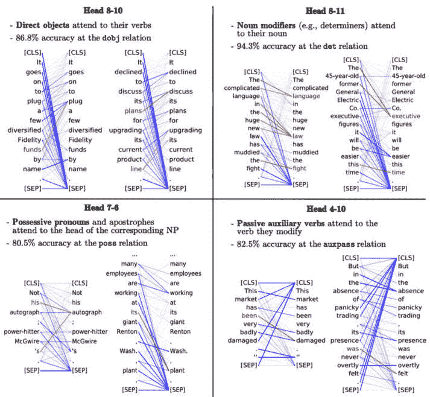
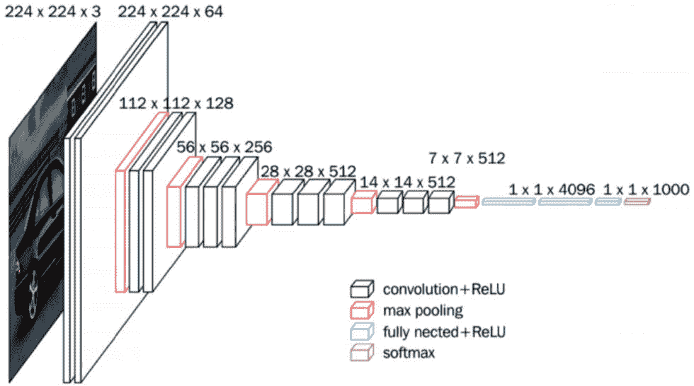
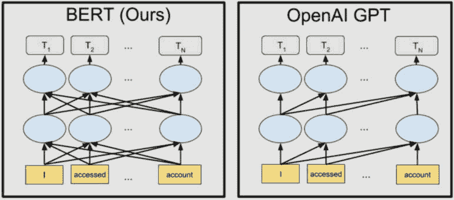
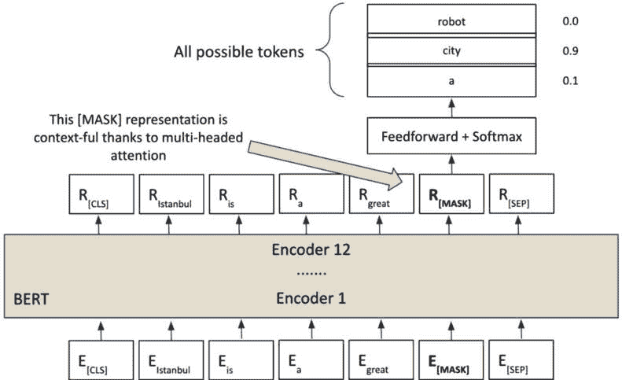
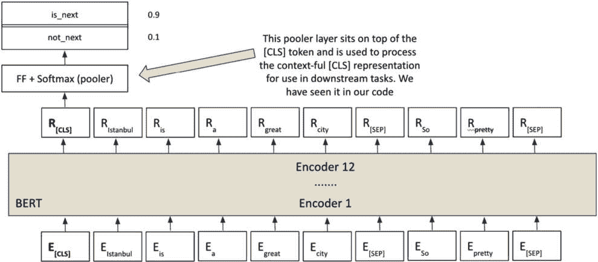
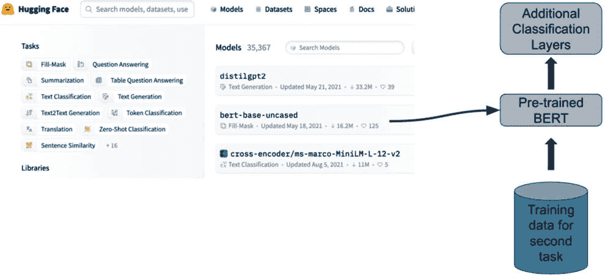
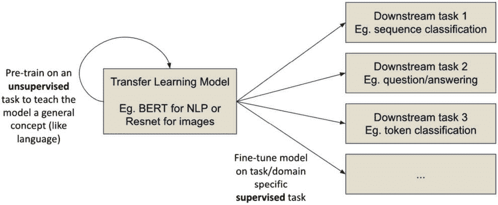
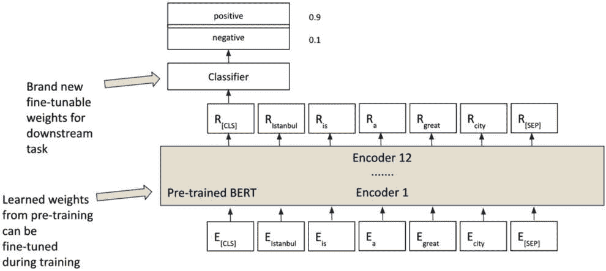
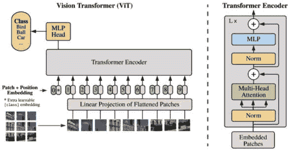
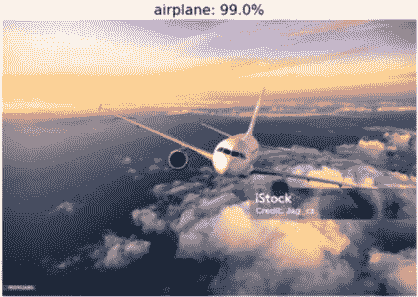

# 12

# 迁移学习与预训练模型简介

就像没人会重新发明轮子一样，在数据科学和**机器学习**（**ML**）领域，通常更高效的做法是基于现有知识进行构建。这就是**迁移学习**（**TL**）和预训练模型的概念发挥作用的地方，这两者是数据科学家工具库中不可或缺的强大工具。

TL 几乎像是机器学习中的快捷方式。与其使用一个从未接触过数据的模型架构，例如逻辑回归模型或随机森林模型，不如想象一下能够将一个在某个任务上训练过的模型，重新用于另一个不同但相关的任务。这就是 TL 的本质——利用现有的知识以更高效的方式学习新事物。这一概念贯穿于生活的许多方面，是数据科学中的一项关键技术。

预训练模型是现成的组件，可以立即使用。它们是已在大数据集上进行训练的机器学习模型，捕获了关于它们所训练任务的海量信息。面对新任务时，这些预训练模型提供了一个巨大的起步优势。在现代机器学习中，TL 和预训练模型的重要性不容忽视。它们是数据科学中许多前沿应用的基础，从**计算机视觉**（**CV**）任务（如图像识别）到**自然语言处理**（**NLP**）任务（如**情感分析**（**SA**））。通过利用这些技术，我们即使在数据或资源有限的情况下，也能取得令人印象深刻的成果。

在接下来的章节中，我们将探讨这些概念，探索它们的细微差别、应用和潜力：

+   理解预训练模型

+   不同类型的 TL

+   TL 与**双向编码器表示的转换器**（**BERT**）和**生成预训练****变换器**（**GPT**）

我们还将通过实际示例来讲解它们在实际场景中的强大作用。通过本章内容，您将深入理解 TL 和预训练模型，并能够在自己的项目中利用它们的潜力。

# 理解预训练模型

预训练模型就像是从他人的经验中学习。这些模型已在大量数据集上进行过训练，学习了使其能够胜任任务的模式和特征。可以把它想象成一个模型读了成千上万本关于某一主题的书籍，吸收了所有这些信息。当我们使用预训练模型时，我们实际上是在利用这些先前的知识。

一般来说，预训练步骤对人类来说并不“有用”，但对于模型而言，它是学习领域和媒介的关键。预训练帮助模型理解语言是如何运作的，但并不涉及如何分类情感或检测物体。

## 使用预训练模型的好处

使用预训练模型的好处有很多。首先，它们能为我们节省大量时间。从头开始训练一个模型可能是一个耗时的过程，但使用预训练模型可以让我们提前开始。此外，这些模型通常能带来更好的性能，尤其是在数据集相对较小的情况下。原因是，预训练模型已经看过比我们通常可以使用的更多的数据，并从中学到了很多。

*图 12.1* 显示了一项关于 **大型语言模型** (**LLMs**) 的研究结果，例如 BERT，其中一个目标是展示预训练如何导致 BERT 在识别基本语法结构时出现一些明显的模式。该研究可视化地表明，经过预训练的模型能够识别我们认为是显而易见的语法模式，如代词-先行词关系和直接宾语/动词关系：



图 12.1 – 一项研究，展示了 BERT 预训练如何让它识别常见的语法结构，尽管它从未被告知这些结构是什么

BERT 当然不是唯一一个进行预训练的模型，这种做法甚至不限于基于文本的模型。

## 常用的预训练模型

预训练模型有各种形状和尺寸，每种都针对不同类型的数据和任务量身定制。让我们来谈谈其中一些最受欢迎的模型。

### 基于图像的模型

对于与图像相关的任务，像 Vision Transformer（本章稍后会介绍）这样的模型，**视觉几何组**（**VGG**）的模型（如在 *图 12.2* 中所示），以及 ResNet 是一些常见的选择。这些模型已经在成千上万的图像上进行过训练，学会了从形状和纹理到复杂物体的识别。它们非常通用，可以为各种基于图像的任务进行微调：



图 12.2 – VGG16 模型（来自 VGG）是一个卷积神经网络（CNN），可以在图像数据上进行预训练

### 基于文本的模型

当谈到文本时，像 BERT（*图 12.3*）和 GPT 这样的模型是最常用的语言模型之一。它们最初是在 2018 年设计的（仅在 GPT 和 BERT 都基于的基础 Transformer 架构被提出或提及后 1 年），并且像它们的图像对应物一样，已经在大量文本数据上进行训练，学习了人类语言的复杂性。无论是理解推文背后的情感，还是回答关于某段文本的问题，这些模型都能胜任任务。随着我们不断前进，我们将看到这些预训练模型如何与 TL 结合，凭借出色的效率应对新的任务：



图 12.3 – 来自谷歌 2018 年开源 BERT 原始博客文章中的一张图片，强调了 OpenAI 的 GPT-1 模型

这张图片是在几个月前发布的，突出了 BERT 在相对相同数量的参数下，比 GPT 处理更多词汇之间关系的能力。

## 解码 BERT 的预训练

TL 最令人印象深刻的成就之一可以从 BERT 中看到，BERT 是一个革命性地改变了 NLP 领域的预训练模型。两个基本的训练任务推动了 BERT 对语言语义和关系的深刻理解：**掩码语言建模**（**MLM**）和**下一句预测**（**NSP**）。让我们分解一下，看看每个任务如何促进 BERT 的语言处理能力。

### MLM

**MLM**（*见图 12.4*）是 BERT 预训练过程中的关键组成部分。本质上，MLM 通过随机将输入数据中大约 15%的单词替换为一个特殊的（*MASK*）标记来工作。然后，BERT 需要弄清楚哪个单词被替换了，实质上是填补空白。可以把它看作是 BERT 在训练过程中玩的一种复杂的*填词游戏*。举个例子，假设我们有一句话“Stop at the light”，MLM 可能会将“light”替换为（*MASK*），并促使 BERT 预测缺失的单词：



图 12.4 – MLM 预训练任务让 BERT 从一个词序列中填补缺失的标记

MLM 这一过程帮助 BERT 理解每个单词周围的上下文，并构建句子不同部分之间的有意义关系。

### NSP

**NSP**（在*图 12.5*中可视化）是 BERT 预训练方案的第二个关键部分。NSP 是一个二分类问题，BERT 的任务是判断提供的句子*B*是否在原文中紧跟句子*A*。从语言理解的宏观角度来看，这就像是在要求 BERT 理解一段文本中句子的逻辑流。这种预测句子*B*是否合乎逻辑地跟随句子*A*的能力，使得 BERT 能够理解更加微妙的、更高层次的语言结构和叙事流：



图 12.5 – 在 NSP 预训练任务中，BERT 正在查看两个思想，并判断第二个短语是否紧接着第一个短语

换句话说，MLM 帮助 BERT 理解单词及其上下文之间复杂的关系，而 NSP 则使 BERT 能够理解句子之间的关系。正是这种组合使得 BERT 成为执行各种 NLP 任务的强大工具。在 NSP 和 MLM（*图 12.6*）之间，BERT 的训练旨在让它理解词元如何影响短语含义（MLM），以及短语如何协同工作以形成更大的思想（NSP）：


图 12.6 – BERT 的预训练帮助它学习语言的基本知识

## TL

现在我们已经对预训练模型有了较强的理解，让我们把注意力转向这个方程式的另一个引人注目的方面：**TL**。本质上，TL 是将从一个问题领域（源）获得的知识应用到另一个但相关的问题领域（目标）。

### TL 的过程

TL 的核心在于适应性。它将一个已经在某个任务上训练过的模型，调整到执行一个不同但相关的任务。它们可能之前没有解决过这个特定的谜题，但它们的技能和经验可以被调整到当前的任务上。TL 在我们为特定任务拥有少量数据，或者我们的任务与原始模型训练时的任务非常相似时特别有用。在这些情况下，TL 可以节省时间和资源，同时提高我们模型的性能。

# 不同类型的 TL

让我们花点时间了解一下 TL 的多样性。它不是一个单一的整体概念，而是多种不同策略的集合，这些策略都属于同一个 umbrella term。几乎每种你可能遇到的场景都有一种 TL 类型。

## 归纳式 TL

首先，我们有**归纳式 TL**（**ITL**）。这完全是关于利用已经学到的知识，并将其应用到新的但相关的场景中。这里的关键是将一个任务中学到的特征进行泛化——我们称之为源任务——然后对它们进行微调，以便在另一个任务——目标任务上表现良好。

想象一下，一个模型在广泛的文本语料库中度过了它的虚拟一生，掌握了语言、语法和语境的复杂性。现在，我们有一个新的任务：对产品评论进行情感分析（SA）。通过迁移学习（ITL），我们的模型可以利用它已经学到的语言知识，并通过微调使自己成为一个检测情感的专家。*图 12.7*展示了我们如何在后续部分应用 ITL。其核心思想是，从模型库（如`HuggingFace`）中取出一个预训练模型，对其进行任何可能的任务调整，投入一些带标签的数据（像我们对待任何其他机器学习模型一样），然后观察它如何学习：



图 12.7 – ITL 过程可能涉及在带监督标签数据上训练 BERT

## 传导性迁移学习（TTL）

我们的第二种迁移学习类型称为**传导性迁移学习（TTL）**，它的任务相对模糊。我们的模型并不是被要求执行一个具体的第二任务（例如分类），而是被要求在不失去对原任务基础的理解的情况下，适应新数据。当我们有大量未标注的目标任务数据时，这种方法是一个不错的选择。

例如，如果一个模型在一个图像数据集上进行了训练，以识别不同的物体，而我们有一个新的未标注的图像数据集，我们可以要求模型利用从源任务中获得的知识来标注新的数据集，即使没有提供任何显式标签。

## 无监督迁移学习（TL）——特征提取

预训练模型不仅对其预测能力有用，它们也是特征的宝库，等待我们去挖掘。通过使用**无监督迁移学习（UTL）**，我们已经在庞大的文本语料库上训练过的模型，可以利用它对语言的理解，发现模式并帮助我们将文本划分为有意义的类别。使用预训练模型进行特征提取，涉及使用预训练模型将原始数据转化为更有用的格式——突出重要特征和模式。

这三种迁移学习方法是 TL 的主要类型，每种方法都有其独特的方式和理想的应用场景。在广阔的机器学习世界中，关键在于选择合适的工具，而迁移学习无疑为我们提供了一个完整的工具箱供我们选择。通过对迁移学习的这些新的理解，我们已做好充分准备，开始将其应用到实践中。在下一节中，我们将看到迁移学习和预训练模型如何结合在一起，轻松征服新任务。

# 基于 BERT 和 GPT 的迁移学习（TL）

在掌握了预训练模型和迁移学习（TL）的基本概念后，是时候将理论付诸实践了。知道食材是什么是一回事；知道如何将它们混合成一道美味的菜肴又是另一回事。在这一部分，我们将采用一些已经从预训练中学到了很多的模型，并对其进行微调，使其能够执行一个新的相关任务。这个过程涉及调整模型的参数，以更好地适应新任务，类似于调整乐器的音调：



图 12.8 – ITL

ITL 采用一个通常在半监督（或无监督）任务上训练的预训练模型，然后用标记数据学习一个特定任务。

## TL 示例

让我们看一些具体预训练模型的 TL 示例。

## 示例 – 微调预训练模型进行文本分类

考虑一个简单的文本分类问题。假设我们需要分析客户评论，并判断它们是正面还是负面。我们有一个评论数据集，但它远远不足以从头开始训练一个**深度学习**（**DL**）模型。我们将微调 BERT 进行文本分类任务，使模型能够将其现有知识适应我们的特定问题。

我们将需要从流行的 scikit-learn 库转向另一个流行的库，名为`transformers`，它是由 HuggingFace（我之前提到的预训练模型库）创建的，因为`scikit-learn`（目前）不支持 Transformer 模型。

*图 12.9*展示了我们如何需要对原始 BERT 模型进行一些小的修改，以执行文本分类。幸运的是，`transformers`包有一个内置的类，名为`BertForSequenceClassification`，可以为我们完成这项工作：



图 12.9 – 最简单的文本分类情况

在许多 TL 案例中，我们需要架构额外的层。在最简单的文本分类情况下，我们在预训练的 BERT 模型上添加一个分类层，以便它可以执行我们想要的分类任务。

以下代码块展示了在文本分类任务中微调 BERT 的端到端代码示例。请注意，我们还使用了一个名为`datasets`的包，它也是由`HuggingFace`开发的，用于从 IMDb 评论中加载情感分类任务。让我们首先加载数据集：

```py
# Import necessary libraries
from datasets import load_dataset
from transformers import BertTokenizer, BertForSequenceClassification, Trainer, TrainingArguments
# Load the dataset
imdb_data = load_dataset('imdb', split='train[:1000]')  # Loading only 1000 samples for a toy example
# Define the tokenizer
tokenizer = BertTokenizer.from_pretrained('bert-base-uncased')
# Preprocess the data
def encode(examples):
    return tokenizer(examples['text'], truncation=True, padding='max_length', max_length=512)
imdb_data = imdb_data.map(encode, batched=True)
# Format the dataset to PyTorch tensors
imdb_data.set_format(type='torch', columns=['input_ids', 'attention_mask', 'label'])
```

加载数据集后，我们可以运行一些训练代码，以在我们的标记数据上更新 BERT 模型：

```py
# Define the model
model = BertForSequenceClassification.from_pretrained(
  'bert-base-uncased', num_labels=2)
# Define the training arguments
training_args = TrainingArguments(
  output_dir='./results',
  num_train_epochs=1,
  per_device_train_batch_size=4
)
# Define the trainer
trainer = Trainer(model=model, args=training_args, train_dataset=imdb_data)
# Train the model
trainer.train()
# Save the model
model.save_pretrained('./my_bert_model')
```

一旦我们保存了模型，我们可以使用以下代码对模型进行未见数据的推理：

```py
from transformers import pipeline
# Define the sentiment analysis pipeline
nlp = pipeline('sentiment-analysis', model=model, tokenizer=tokenizer)
# Use the pipeline to predict the sentiment of a new review
review = "The movie was fantastic! I enjoyed every moment of it."
result = nlp(review)
# Print the result
print(f"label: {result[0]['label']}, with score: {round(result[0]['score'], 4)}")
# "The movie was fantastic! I enjoyed every moment of it."
# POSITIVE: 99%
```

### 示例 – 图像分类的 TL

我们可以使用像 ResNet 或视觉 Transformer（如*图 12.10*所示）这样的预训练模型，它最初是在像 ImageNet 这样的规模较大的图像数据集上训练的。这个模型已经学会了从图像中检测各种特征，从简单的形状到复杂的物体。我们可以利用这个知识，在自定义的图像分类任务上对模型进行微调：



图 12.10 – 视觉 Transformer

视觉 Transformer 就像是图像领域的 BERT 模型。它依赖于许多相同的原理，只不过它使用图像的片段作为“令牌”来代替文本令牌。

以下代码块展示了一个端到端的代码示例，用于在图像分类任务中微调 Vision Transformer。该代码应该与上一节的 BERT 代码非常相似，因为`transformers`库的目标是标准化现代预训练模型的训练和使用，使得无论你执行什么任务，它们都能提供相对统一的训练和推理体验。

让我们首先加载数据并查看我们所拥有的图像类型（见*图 12.11*）。请注意，我们只会使用数据集的 1%来证明其实你并不需要那么多数据就能从预训练模型中获得很大的收益！

```py
# Import necessary libraries
from datasets import load_dataset
from transformers import ViTImageProcessor, ViTForImageClassification
from torch.utils.data import DataLoader
import matplotlib.pyplot as plt
import torch
from torchvision.transforms.functional import to_pil_image
# Load the CIFAR10 dataset using Hugging Face datasets
# Load only the first 1% of the train and test sets
train_dataset = load_dataset("cifar10", split="train[:1%]")
test_dataset = load_dataset("cifar10", split="test[:1%]")
# Define the feature extractor
feature_extractor = ViTImageProcessor.from_pretrained('google/vit-base-patch16-224')
# Preprocess the data
def transform(examples):
    # print(examples)
    # Convert to list of PIL Images
    examples['pixel_values'] = feature_extractor(images=examples["img"], return_tensors="pt")["pixel_values"]
    return examples
# Apply the transformations
train_dataset = train_dataset.map(
transform, batched=True, batch_size=32
).with_format('pt')
test_dataset = test_dataset.map(
transform, batched=True, batch_size=32
).with_format('pt')
```

我们可以类似地使用以下代码来使用模型：


图 12.11 – 来自 CIFAR10 的单一示例，显示一架飞机

现在，我们可以开始训练我们预训练的 Vision Transformer：

```py
# Define the model
model = ViTForImageClassification.from_pretrained(
'google/vit-base-patch16-224',
num_labels=10, ignore_mismatched_sizes=True
)
LABELS = ['airplane', 'automobile', 'bird', 'cat', 'deer', 'dog', 'frog', 'horse', 'ship', 'truck']
model.config.id2label = LABELS
# Define a function for computing metrics
def compute_metrics(p):
    predictions, labels = p
    preds = np.argmax(predictions, axis=1)
    return {"accuracy": accuracy_score(labels, preds)}
# Define the training arguments
training_args = TrainingArguments(
    output_dir='./results',
    num_train_epochs=5,
    per_device_train_batch_size=4,
    load_best_model_at_end=True,
    # Save and evaluate at the end of each epoch
    evaluation_strategy='epoch',
    save_strategy='epoch'
)
# Define the trainer
trainer = Trainer(
    model=model,
    args=training_args,
    train_dataset=train_dataset,
    eval_dataset=test_dataset
)
```

我们最终的模型在测试集的 1%上达到了大约 95%的准确率。现在我们可以在未见过的图像上使用我们的新分类器，如下一个代码块所示：

```py
from PIL import Image
from transformers import pipeline
# Define an image classification pipeline
classification_pipeline = pipeline(
'image-classification',
model=model,
feature_extractor=feature_extractor
)
# Load an image
image = Image.open('stock_image_plane.jpg')
# Use the pipeline to classify the image
result = classification_pipeline(image)
```

*图 12.12* 显示了这次单一分类的结果，看起来效果相当不错：



图 12.12 – 我们的分类器正确预测了一张飞机的库存图像

在最小化标注数据的情况下，我们可以利用迁移学习（TL）将现成的模型转化为强大的预测模型。

# 总结

我们对预训练模型的探索让我们了解了这些经过大量数据和时间训练的模型是如何为我们提供坚实的基础，以供进一步开发的。它们帮助我们克服了计算资源和数据可用性相关的限制。特别是，我们熟悉了像 VGG16 和 ResNet 这样的图像模型，以及像 BERT 和 GPT 这样的文本模型，进一步丰富了我们的工具库。

我们的探索继续进入了迁移学习（TL）领域，在那里我们学习了其基本原理，认识到其多样化的应用，并了解了它的不同形式——归纳式、传导式和无监督式。每种类型都有其独特的特性，为我们的机器学习工具箱增添了不同的维度。通过实际的例子，我们看到了这些概念的实际应用，使用 BERT 模型进行文本分类，使用 Vision Transformer 进行图像分类。

但是，正如我们已经认识到的那样，虽然迁移学习和预训练模型很强大，但并不是所有数据科学问题的解决方案。它们在合适的情况下大放异彩，而作为数据科学家的我们，需要判断何时以及如何有效地部署这些强大的方法。

随着本章的结束，我们对迁移学习（TL）和预训练模型的理解，不仅使我们能够处理实际的机器学习（ML）任务，还为我们应对更高级的概念和技术铺平了道路。通过在我们的机器学习过程中引入更多步骤（如预训练），我们也在为更多潜在的错误敞开了大门。下一章将开始探讨迁移学习的一个隐藏面：偏差传递和漂移应对。

向前看，可以考虑深入研究其他预训练模型，探索迁移学习的其他变种，甚至尝试创建你自己的预训练模型。无论你选择哪条路径，记住——机器学习的世界广阔且不断发展。保持好奇，持续学习！
