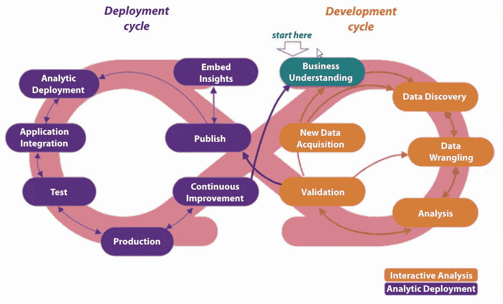
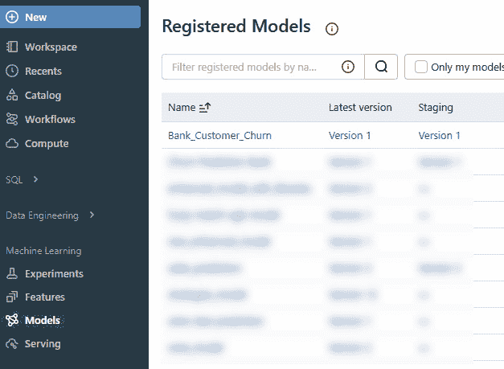
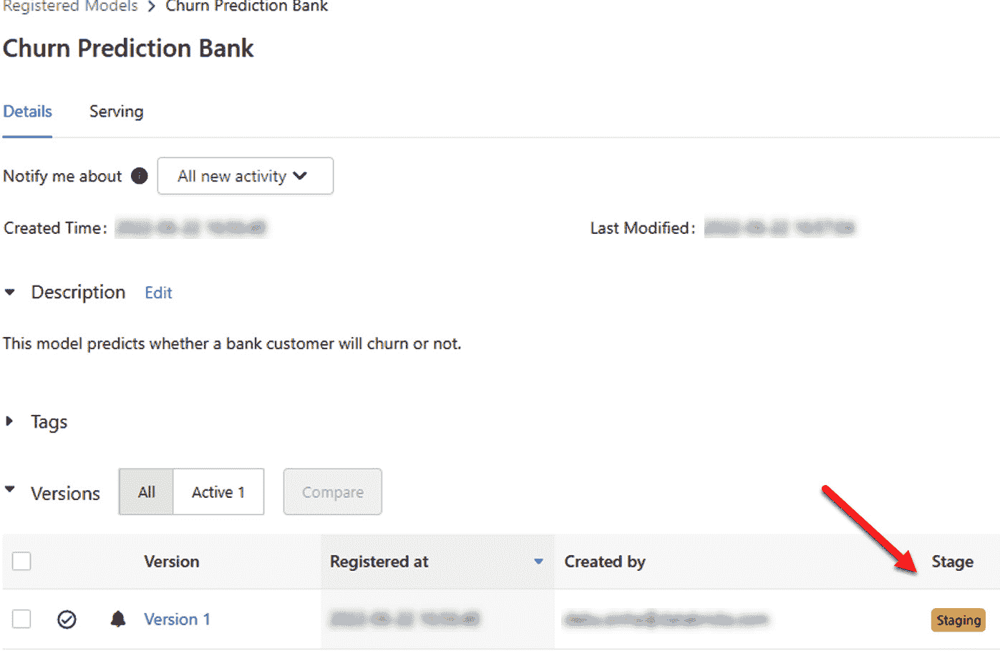
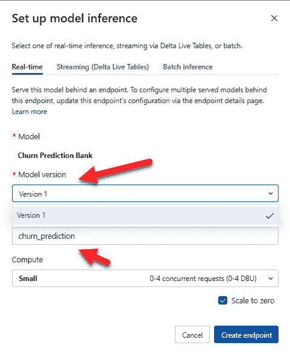
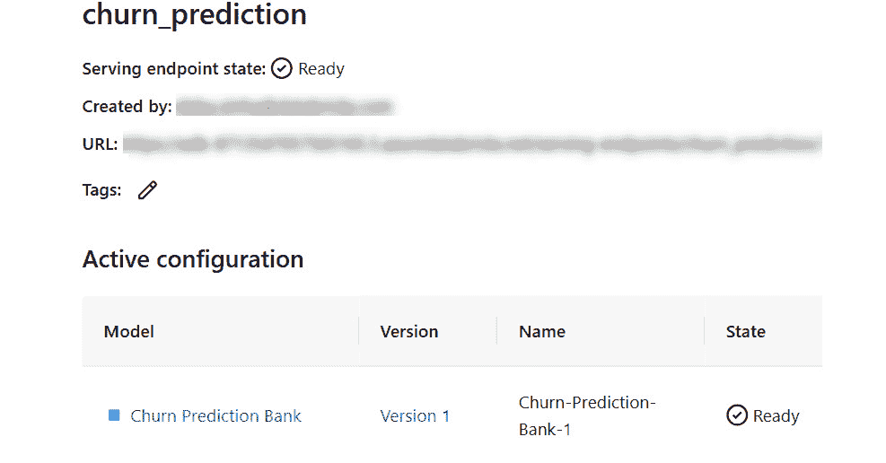
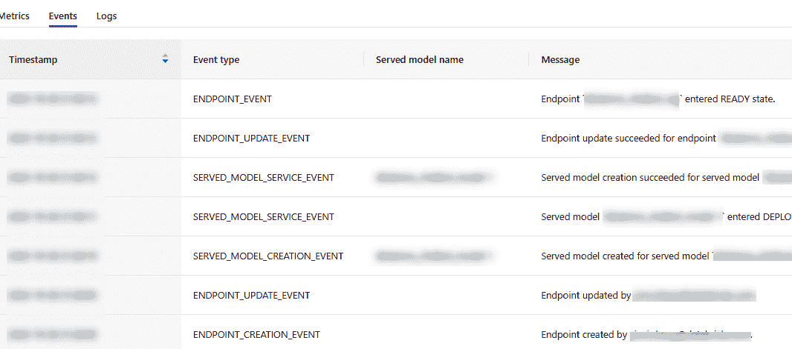
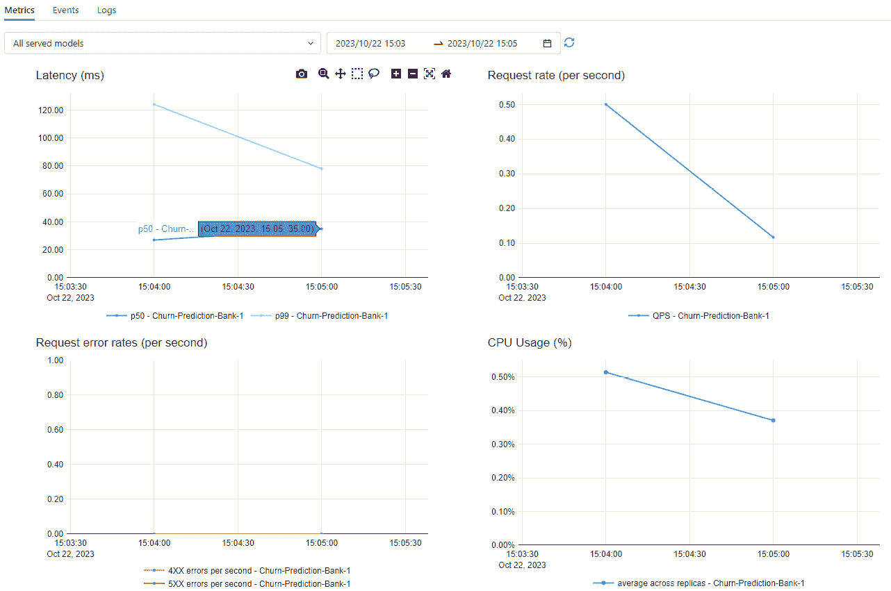
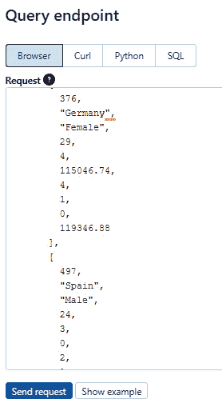

# 7

# 模型部署方法

在上一章中，我们了解了如何利用 Databricks MLflow 模型注册表来管理我们的机器学习模型版本和生命周期。我们还学习了如何使用集成的访问控制来管理对模型注册表中已注册模型的访问。我们还了解了如何使用模型注册表中可用的 Webhook 支持，触发自动的 Slack 通知或作业，以验证注册表中的已注册模型。

在本章中，我们将从模型注册表中获取已注册的模型，并了解如何使用 Databricks 中可用的各种模型部署选项进行部署。

我们将涵盖以下主题：

+   理解机器学习部署和范式

+   部署机器学习模型进行批处理和流处理推理

+   部署机器学习模型进行实时推理

+   将自定义 Python 库集成到 MLflow 模型中以进行 Databricks 部署

+   使用 MLflow 和模型服务部署自定义模型

+   将依赖项打包到 MLflow 模型中

让我们看看本章的技术要求。

# 技术要求

在深入本章之前，我们需要以下内容：

+   访问 Databricks 工作区

+   运行一个包含**Databricks 机器学习运行时**（**Databricks Runtime ML**）的集群，版本为 13 或更高

+   所有前面的笔记本，如上所述执行

+   基础的 Apache Spark 知识，包括 DataFrame 和 SparkUDF

让我们来看一下机器学习部署到底是什么。

# 理解机器学习部署和范式

**数据科学**与**数据工程**不同。数据科学更侧重于将商业问题转化为数据问题，并利用科学方法进行解决。我们开发数学模型，然后优化其性能。而数据工程师主要关注数据湖中数据的可靠性。他们更关注用于使数据管道可扩展和可维护的工具，同时确保符合**服务水平** **协议**（**SLA**）。

当我们谈论机器学习部署时，我们希望弥合数据科学和数据工程之间的差距。

下图可视化了整个机器学习部署过程：



图 7.1 – 展示机器学习部署过程

在右侧，我们展示了数据科学的过程，这是一个非常互动和迭代的过程。我们理解商业问题，并发现可以为分析增值的数据集。然后，我们构建数据管道来处理数据并进行分析。我们开发我们的模型，链条继续。

该图的左侧展示了将软件开发领域的最佳实践与数据科学领域的整合。这大多是自动化的。一旦我们的候选模型准备就绪，我们会执行以下步骤：

1.  首先，我们将其注册到模型注册表。

1.  接下来，我们将模型与我们的应用程序集成。

1.  接下来，我们将用我们的应用程序测试集成后的模型。

1.  最后，我们将其部署到生产环境中，在那里我们监控模型的性能并加以改进。

其中一些过程可能看起来与 DevOps 非常相似，但**DevOps**和**ModelOps**之间存在一些关键的区别。

本质上，DevOps 结合了软件开发和 IT 运营，如**持续集成**（**CI**）、**持续部署**（**CD**）、更新或回滚功能以及推送补丁。

ModelOps 结合了 DevOps 的原则，如 CI/CD，并结合了机器学习领域的特定需求。它引入了持续训练和监控 ML 模型的需求。

持续训练是 ModelOps 中的一个重要方面。与传统软件不同，传统软件模块一旦部署后很少发生变化，ML 模型需要不断更新。随着新数据的涌入，模型必须定期重新训练，以确保其准确性和相关性。这意味着即使核心模型代码保持不变，模型本身也会随着数据环境的变化而进化。

ModelOps 中的持续监控涵盖了两个关键领域：模型性能监控和基础设施监控。模型性能监控涉及追踪模型在现实场景中的表现，包括准确率、精度、召回率等指标。另一方面，基础设施监控关注支持模型的计算基础设施的健康状况和性能。这种双重监控方法确保了模型和底层系统的最佳运行状态。

这种方法与传统软件工程有所不同，在传统软件工程中，一旦软件模块经过测试并部署到生产环境，它通常保持稳定，无需持续监控和适应。而在 ModelOps 中，数据的不断变化和维护模型性能的重要性使得持续训练和监控成为过程的核心部分。

在 MLOps 的初期，大多数公司使用 Java 和定制的内部工具来管理 ML 部署、持续训练和监控。然而，现在大多数工具和框架已经开源，并且我们已经看到 Python 成为了实施整个模型开发生命周期的事实标准。

让我们来看一下最常见的 ML 部署模式。大多数 ML 用例可以分为四类：

+   **批量部署**（可即时运行或按计划执行）：

    +   这些是最常见的部署方式，实施相对简单，且在成本和生产化工作量方面最为高效。

    +   模型进行预测，并将预测结果存储在快速访问的数据仓库中，如 DynamoDB、Cassandra、Cosmos DB 或数据湖仓中的 Delta 表。这些存储解决方案因其高效的预测服务能力而被选择。然而，需要注意的是，这些选择是为具有低延迟检索要求的使用场景量身定制的，而批处理使用场景则可能有不同的考虑因素。此外，Databricks SQL 提供了一种无服务器的高性能数据仓储解决方案，它与数据湖仓无缝集成，简化了数据管理和分析，提高了利用预测模型的生产力和可靠性。值得一提的是，Delta 表还结合了写入优化，确保了高效的数据存储和处理。

+   **流式部署**（持续运行在数据上）：

    +   当你在推理开始之前无法访问整个数据集，并且需要在新数据到达时相对快速地处理它们时，这些部署变得至关重要。

    +   Spark Structured Streaming 非常适合处理流数据。它还内置了排队机制，在处理大量图像数据时非常有用。

+   **实时**（REST 端点）：

    +   当使用场景需要模型作为应用的一部分进行近实时的请求和响应时，这些部署变得尤为重要。

    +   在编写本书时，Databricks 提供了一项与其平台无缝集成的生产级模型服务。该服务利用无服务器计算的强大功能以实现最佳性能。尽管深入探讨各种部署架构的细节超出了本书的范围，但你可以在 Databricks 文档中访问有关此主题的详细信息（[`docs.databricks.com/en/serverless-compute/index.html`](https://docs.databricks.com/en/serverless-compute/index.html)）。另外，你还可以在 Databricks 上通过 Azure ML（利用 Azure Kubernetes 服务）、AWS Sagemaker 和 Google Vertex AI 等各种云服务，轻松地将你的机器学习模型部署为 REST 端点。机器学习模型被打包成容器镜像，然后与相应云提供商提供的托管服务进行注册。

    +   你还可以使用自己的 Kubernetes 集群，使用相同的范式进行模型部署。

+   **设备端**（边缘）：

    +   这些是非常特定的使用场景，我们希望将模型部署到诸如 Raspberry Pi 或其他物联网设备上。我们将在本章中不涉及这些内容。

最佳实践是，初步考虑将批量部署作为你的主要机器学习部署范式。仅在彻底验证批量部署不足以满足你的特定用例时，才过渡到其他范式。请记住，实时机器学习部署系统的长期维护成本通常高于批量系统。

在选择最合适的机器学习部署范式时，考虑响应延迟要求同样至关重要：

+   **批量部署**：最适合那些推理响应时间预期为几小时到几天的场景：

    +   **用例推荐**：对于那些不受时间限制的数据分析和报告任务，尤其是生成每月销售预测或风险评估，这种部署方法特别有用。

+   **结构化流式部署**：最适合那些需要在几分钟到一小时内对新数据进行推理的用例：

    +   **用例推荐**：实时分析或欺诈检测系统通常会从这种部署类型中受益，这些系统需要持续分析数据流，但即时响应并不是关键。

+   **近实时或 REST 端点部署**：当预期延迟在几百毫秒到一分钟之间时，这些部署方式最为合适：

    +   **用例推荐**：这种部署范式最适合应用于实时推荐系统或自动化客户服务机器人等需要较快响应但不要求立即反应的应用。

+   **边缘部署**：这些部署适用于那些要求小于 100 毫秒 SLA 的场景：

    +   **用例推荐**：对于**物联网**（**IoT**）应用、自动驾驶车辆或任何需要闪电般决策能力的用例，这一点至关重要。

这些只是一些大致的指导原则。以下图表总结了我们在这里讨论的所有要点：


图 7.2 – 各种机器学习部署的响应延迟要求

现在，让我们来看一下使用 Databricks 时的各种部署选项。除了这里讨论的部署方法，一些开源项目可能会对你有兴趣，尤其是将模型作为 REST 服务进行部署。这些项目的链接可以在本章末尾的*进一步阅读*部分找到。

# 部署机器学习模型进行批量和流式推理

本节将介绍使用 Databricks 以批量和流式方式部署机器学习模型的示例。

在**批量**和**流式**推理部署中，我们使用模型进行预测，然后将预测结果存储在某个位置以供以后使用。预测结果的最终存储区域可以是一个具有低延迟读取访问的数据库、用于导出到其他系统的云存储（如 S3），甚至是一个可以被业务分析师轻松查询的 Delta 表。

在处理大量数据时，Spark 提供了一个高效的框架来处理和分析数据，这使得它成为了一个理想的候选框架来利用我们训练的机器学习模型。

注意

需要记住的一个重要提示是，我们可以使用任何非分布式的机器学习库来训练模型。只要它使用了 MLflow 的模型抽象，就可以利用 MLflow 模型注册表的所有好处，并且可以使用本章中呈现的代码。

我们应该始终考虑模型生成的结果的访问模式。根据我们存储预测结果的位置，我们可以进行以下优化：

+   分区可以加速数据读取，尤其是当你的数据以静态文件形式存储或保存在数据仓库中时。

+   在数据库中为相关查询构建索引，通常会提高性能。

让我们看一个如何在 Databricks 环境中执行批量和流式推理部署的示例。

## 在 Databricks 上进行批量推理

批量推理是最常见的模型部署方式。批量推理的意思是使用模型进行预测并将结果存储以供后续使用。

为此，我们将使用在 MLflow 的模型注册表中可用的模型。我们必须确保在此章节提供的笔记本中至少有一个模型版本处于 Staging 阶段，以便执行：

1.  进入**Models**选项卡，选择**Churn Prediction Bank**已注册模型。应该会有一个版本处于**Staging**状态：



图 7.3 – 模型注册表中 Staging 阶段的已注册模型

1.  打开与`Chapter-07`相关联的笔记本，名为*Batch and Streaming*。我们将简单地将模型从注册表加载为 Python 函数，如下所示的代码块：

    ```py
    import mlflow# the name of the model in the registryregistry_model_name = "Churn Prediction Bank"# get the latest version of the model in staging and load it as a spark_udf.# MLflow easily produces a Spark user defined function (UDF).  This bridges the gap between Python environments and applying models at scale using Spark.model = mlflow.pyfunc.spark_udf(spark, model_uri = f"models:/{registry_model_name}/staging")
    ```

1.  该笔记本的其余部分读取与我们用于训练模型的相同`raw_data`，以 Spark DataFrame 的形式进行读取，然后在选择用于训练分类模型的列之后，使用 AutoML 进行训练：

    ```py
    spark_df = spark.table("bank_churn_analysis.raw_Data")display(spark_df)exclude_colums = {'RowNumber', "CustomerId", "Surname", "Exited"}input_columns = [col for col in spark_df.columns if col not in exclude_colums]input_columns# passing non label columns to the model as inputprediction_df = spark_df.withColumn("prediction", model(*input_columns))display(prediction_df)
    ```

让我们看看如何利用相同的模型加载为 Spark UDF 进行流式推理部署。

本章不详细讨论 Spark 中的结构化流式处理，因为它本身是一个庞大的话题。《*Spark: The Definitive Guide: Big Data Processing Made Simple*》是一本深入学习 Apache Spark 和结构化流式处理的好书。流式 DataFrame 可以被看作是一个不断更新的无界表格，随着新数据的到来持续更新。在*进一步阅读*部分中，提供了关于结构化流式处理的更多资源链接，供你深入学习。

## 在 Databricks 上进行流式推理

让我们看一下示例代码，展示如何将上一节中使用的模型部署以进行流式推理：

1.  在`Cmd 15`中，我们必须将来自 Delta 表的`raw_data`定义为流式读取而非批量读取：

    ```py
    # right now we are just defining a streaming data source but this statement will not execute until we call an Spark action. Another way to exclude the columns that are not needed is by dropping them from the DataFrame.raw_streaming_df = spark.readStream.format("delta").option("ignoreChanges", "true").table("bank_churn_analysis.raw_Data").drop(*("RowNumber", "CustomerId", "Surname", "Exited"))
    ```

    剩余的流程将与批量推理类似。

1.  一旦我们定义了我们的流式 Dataframe，我们调用在暂存环境中可用的模型注册表中加载的相同模型：

    ```py
    predictions_df = raw_streaming_df.withColumn("prediction", model(*raw_streaming_df.columns))display(predictions_df, streamName=stream_name)
    ```

    一旦我们准备好预测结果，就可以将数据写入 Delta 表或适合我们使用场景的格式。

现在，让我们来看看如果我们想要执行实时推理，使用相同模型有多么简单。

# 部署 ML 模型进行实时推理

实时推理包括使用作为 REST 端点部署的模型对少量记录生成预测。期望在几毫秒内收到预测结果。

在特征仅在提供模型时可用且无法预先计算的使用场景中，需要进行实时部署。这些部署比批量或流式部署更复杂，需要更多的管理。

Databricks 提供集成的模型服务端点，使您能够在 Databricks 环境中，在生产级别的完全托管基础设施上原型设计、开发和部署实时推理模型。在撰写本书时，您可以利用以下两种额外方法将模型部署到实时推理：

+   由以下云服务提供商提供的托管解决方案：

    +   **Azure ML**

    +   **AWS SageMaker**

    +   **GCP VertexAI**

+   使用 Docker 和 Kubernetes 或类似技术集的定制解决方案

如果您正在考虑为生产环境中部署和管理 ML 模型提供强大的解决方案，Databricks 模型服务提供了一系列引人注目的功能：

+   **轻松创建端点**：只需点击一下，Databricks 就会处理设置一个完全配备的环境，适合您的模型，并提供无服务器计算选项。

+   **自适应可扩展性和可靠性**：Databricks 模型服务为生产环境的高要求而设计，能够处理每秒超过 25,000 个查询的高吞吐量。该服务能够动态扩展以满足波动的需求，甚至允许多个模型在单一访问点上运行。

+   **强大的安全措施**：每个部署的模型都在安全的数字边界内运行，并分配专用计算资源，模型不再使用时会撤销这些资源。

+   **与 MLflow 的顺畅集成**：该平台轻松连接到 MLflow 的模型注册表，简化了 ML 模型的部署过程。

+   **全面的监控和调试功能**：Databricks 会捕捉所有请求和响应交互，并将其记录到专门的 Delta 表中，以便进行实时监控。查询速度、延迟和错误等指标会动态更新，并可以导出到您选择的监控解决方案中。

+   **实时特征集成**：如果您使用 Databricks 的特征存储训练了您的模型，这些特征会与模型无缝打包在一起。此外，如果您配置了在线特征存储，您还可以实时更新这些特征。

让我们了解一些与模型服务端点功能相关的重要技术细节，按类别分组。

## Databricks 模型服务的约束和能力的深入分析

在本节中，我们将全面概述与使用 Databricks 模型服务相关的关键技术要点。从负载大小和查询吞吐量限制，到延迟和并发性指标，本节旨在为您提供基本的见解，帮助您有效地使用 Databricks 模型服务。此外，我们还将深入探讨系统资源分配细节，并讨论可能影响您操作的合规性和区域限制。最后，我们将触及可能影响您在该平台上部署机器学习模型决策的其他因素和操作见解。

+   **负载限制和** **查询吞吐量**：

    +   **负载大小**：值得注意的是，每个请求的负载大小限制为 16 MB。对于大多数标准用例来说，这已经足够，但对于更复杂的模型，可能需要进行优化。

    +   **每秒查询数**（**QPS**）：系统为每个工作空间设定了 200 QPS 的默认限制。尽管对于实验和低流量服务来说已经足够，但对于高需求场景，可以通过咨询 Databricks 支持将其扩展至 25,000 QPS。

+   **延迟和** **并发性指标**：

    +   **评估延迟**：那些使用计算密集型模型的用户需要注意，Databricks 对评估延迟设置了 120 秒的上限。

    +   **并发请求**：在一个工作空间中，所有服务端点的并发限制为每秒 200 个查询。虽然这一限制通常足够，但对于需求更高的服务，可以通过 Databricks 支持进行自定义调整。

+   **系统资源** **和开销**：

    +   **内存**：该环境为每个模型分配默认的 4 GB 内存。对于大多数传统的机器学习模型来说，这通常是足够的，但深度学习模型可能需要扩展至 16 GB。

    +   **延迟开销**：该架构的目标是将额外延迟保持在 50 毫秒以下，但这是一个尽力而为的近似值，而非保证。

+   **合规性和** **区域限制**：

    +   **HIPAA 合规性**：对于医疗领域的用户，需要注意的是，Databricks 模型服务目前不符合 HIPAA 合规性要求。

    +   **区域限制**：某些情况下，工作区位置可能会干扰模型服务功能。这是规划阶段需要考虑的一个重要因素。要查看支持的区域列表，请访问 [`docs.databricks.com/en/resources/supported-regions.html`](https://docs.databricks.com/en/resources/supported-regions.html)。

+   `pandas.core.indexes.numeric`” 可能是由于 pandas 版本不兼容导致的。解决方法如下：

    1.  运行 '`add-pandas-dependency.py`' ([`learn.microsoft.com/en-us/azure/databricks/_extras/documents/add-pandas-dependency.py`](https://learn.microsoft.com/en-us/azure/databricks/_extras/documents/add-pandas-dependency.py)) 脚本，并使用 MLflow `run_id`。

    1.  在 MLflow 模型注册表中重新注册模型。

    1.  提供更新后的 MLflow 模型。

+   **运营洞察**：

    +   **端点创建时间**：创建新模型端点的时间大约为 10 分钟。

    +   **零停机时间更新**：该系统旨在执行端点更新时实现零停机时间，最小化运营风险。

    +   **动态扩展**：Databricks 模型服务采用智能扩展算法，能够根据流量模式和预配置的并发性进行调整，确保资源的最优分配。

让我们来看一个如何使用 Databricks 内建的模型服务端点来开发、原型设计并部署模型以生成实时推理的示例：

1.  转到工作区中的**模型**部分并选择**客户流失预测** **银行**模型：



图 7.4 – 在模型注册表的 Staging 阶段注册的模型

1.  点击**用于推理的模型**按钮：


图 7.5 – 用于推理的模型按钮，您可以选择使用模型进行批量/流推理或作为实时 REST 端点

1.  选择**实时**并点击**启用服务**。在这里，我们可以选择要提供的模型版本以及服务端点的名称。还可以选择自动生成批量和流推理的代码：



图 7.6 – 如何从 UI 启用实时服务

1.  您还可以指定希望为模型部署分配的计算资源类型。这取决于端点预计要处理的并发请求量。在我们的示例中，我们将选择**小型**：


图 7.7 – 各种计算选项

1.  最后，您还可以选择**扩展到零**选项，以确保在没有负载时您的端点不会产生费用。现在，点击**创建端点**。

1.  你将被重定向到**状态**页面，在这里你可以看到当前模型部署的状态，包括正在部署的模型版本：



图 7.8 – 部署的模型服务端点的状态页面

1.  你还可以查看与模型部署相关的事件：



图 7.9 – 部署的模型服务端点的状态页面

你也可以对与端点相关的指标执行相同的操作：



图 7.10 – 与模型服务端点相关的指标

这里另一个需要注意的重要事项是，访问 REST 端点的权限是继承自你在模型注册表中设置的权限：


图 7.11 – 模型服务端点继承的权限

1.  现在，让我们来看一下如何查询你的模型。在用户界面中，一旦你看到模型端点处于**就绪**状态，你可以点击服务端点状态页面右上角的**查询端点**按钮：


图 7.12 – 查询端点按钮

有一些代码片段可以解释如何在 Python、cURL 或 SQL 中查询你部署的特定版本的模型。还有一个选项可以模拟浏览器请求，以下步骤描述了如何使用它：

1.  点击**显示示例**按钮。只有当我们在 MLflow 中记录了模型的输入示例时，这才有效：



图 7.13 – 来自 AutoML 的自动记录的示例输入记录

1.  要向我们的模型发送 JSON 请求以进行实时推理，只需点击**发送请求**：


图 7.14 – 从部署的模型接收到的响应

当我们训练我们的客户流失预测模型时，AutoML 记录了我们的模型在作为 REST 端点部署时期望的示例输入。如果你没有使用 AutoML 而是自己训练模型，可以使用 MLflow API 在模型运行时记录模型的示例输入。

让我们看看如何借助示例笔记本使用 Python 查询模型端点：

1.  打开`Chapter-07`文件夹中的`Real-Time`笔记本。

1.  要查询模型端点，我们需要每个 REST 调用都伴随一个 Databricks `Cmd 4`，我们必须从我们的笔记本实例中提取 PAT token，并以编程方式提取我们的工作区域名。这有助于保持代码与工作区无关：

    ```py
    # get token from notebooktoken = dbutils.notebook.entry_point.getDbutils().notebook().getContext().apiToken().getOrElse(None)#create authorization header for REST callsheaders = {    "Authorization": f"Bearer {token}",    "Content-Type": "application/json"  }# Next we need an enpoint at which to execute our request which we can get from the Notebook's tags collectionjava_tags = dbutils.notebook.entry_point.getDbutils().notebook().getContext().tags()# This object comes from the Java CMtags = sc._jvm.scala.collection.JavaConversions.mapAsJavaMap(java_tags)# extract the databricks instance (domain name) from the dictionaryinstance = tags["browserHostName"]
    ```

1.  `Cmd 6` 包含一种方法评分，该方法将作为输入的样本记录转换为 Python 字典，转化为 JSON 格式，并向已部署的模型发送请求。模型随后以 JSON 格式返回预测结果：

    ```py
     # Import the requests library for HTTP communicationimport requests#change the model_serving endpoint name to the one you have given.model_serving_endpoint_name = "churn_prediction"# Define the function 'score_model' which takes a dictionary as an inputdef score_model(data_json: dict):    # Construct the URL for the model serving endpoint    url = f"https://{instance}/serving-endpoints/{model_serving_endpoint_name}/invocations"    # Make an HTTP POST request to score the model    response = requests.request(method="POST", headers=headers, url=url, json=data_json)    # Check if the request was successful (HTTP status code 200)    if response.status_code != 200:        # If not, raise an exception detailing the failure        raise Exception(f"Request failed with status {response.status_code}, {response.text}")    # Return the JSON response from the model scoring endpoint    return response.json()
    ```

1.  为了有效地与服务端 API 进行交互，您应该根据已识别的格式之一组装 JSON 请求负载。每种格式都有独特的优点和限制。在我们的特定场景中，我们的 ML 模型期望以 pandas DataFrame 形式接收输入。因此，我们有两种最佳的结构化 API 查询端点的方向选项：

    1.  `dataframe_split` 方法，采用 JSON 格式并以分割方向序列化。与记录方向相比，这种格式更节省带宽，但阅读起来稍微复杂：

    ```py
    payload = {  "dataframe_split": {    "index": [1, 2],    "columns": ["CreditScore", "Geography", "Gender", "Age", "Tenure", "Balance", "NumOfProducts", "HasCrCard", "IsActiveMember", "EstimatedSalary"],    "data": [[619, "France", "Female", 42, 2, 0.0, 1, 1, 1, 101348.88], [608, "Spain", "Female", 41, 1, 83807.86, 1, 0, 1, 112542.58]]  }}
    ```

    1.  `records` 布局是表示 DataFrame 数据的另一种选择。它以 JSON 对象的形式呈现，每个条目代表 DataFrame 中的一行。此记录易于阅读且对人类友好，但由于列名在每条记录中都会重复，因此会消耗更多带宽：

    ```py
    payload = {  "record_dataframe": [    {      "CreditScore": 619,      "Geography": "France",      "Gender": "Female",      "Age": 42,      "Tenure": 2,      "Balance": 0.0,      "NumOfProducts": 1,      "HasCrCard": 1,      "IsActiveMember": 1,      "EstimatedSalary": 101348.88    },    {      "CreditScore": 608,      "Geography": "Spain",      "Gender": "Female",      "Age": 41,      "Tenure": 1,      "Balance": 83807.86,      "NumOfProducts": 1,      "HasCrCard": 0,      "IsActiveMember": 1,      "EstimatedSalary": 112542.58    }  ]}
    ```

1.  最后，您可以直接对这些记录进行推断调用：

    ```py
    score_model(payload){'predictions': [0, 0]}
    ```

当处理如 TensorFlow 或 PyTorch 等 ML 模型时，这些模型通常期望张量输入，您通常有两种主要的格式选项可供考虑：实例格式和输入格式。实例格式和输入格式各自具有独特的优缺点，这些优缺点会显著影响您 ML 解决方案的设计和性能。

让我们深入了解每种格式的细节，以便更好地理解如何最优化地使用它们：

+   **张量的实例格式**：**实例**格式专为张量数据设计，以行优先的方式处理张量。当所有输入张量在索引 0 的维度上共享相同的大小时，这种格式是理想选择。本质上，实例列表中的每个张量可以与列表中具有相同名称的其他张量进行概念上的合并，从而形成模型的完整输入张量。只有当所有张量在 0 维度上保持一致时，这种合并才是无缝的：

    +   单一张量：

        ```py
        {"instances": [8, 9, 10]}
        ```

    +   多个命名张量：

        ```py
        { "instances": [ { "t1": "a", "t2": [1, 2, 3, 4, 5], "t3": [[1, 2], [3, 4], [5, 6]] }, { "t1": "b", "t2": [6, 7, 8, 9, 10], "t3": [[7, 8], [9, 10], [11, 12]] } ] }
        ```

+   **张量的输入格式**：**输入**格式是另一种将张量数据按列的方式结构化的选项。这种格式与实例格式在一个关键点上有所不同：它允许不同张量类型的实例具有不同的数量。这与实例格式相对，后者要求每种类型的张量实例数量一致。

Databricks 的服务功能提供了在单个端点后部署多个模型的灵活性，这对于进行 A/B 测试特别有用。此外，你还可以在同一个端点后将总流量的特定百分比分配给各个模型。有关更多详细信息，请参考官方文档([`dpe-azure.docs.databricks.com/machine-learning/model-serving/serve-multiple-models-to-serving-endpoint.html#serve-multiple-models-to-a-model-serving-endpoint`](https://dpe-azure.docs.databricks.com/machine-learning/model-serving/serve-multiple-models-to-serving-endpoint.html#serve-multiple-models-to-a-model-serving-endpoint))。

通过用户界面将另一个模型添加到现有端点是一个直接的过程。只需导航到**编辑配置**部分，选择**添加已服务模型**选项。在那里，你可以选择要部署的注册表中的模型，指定其版本，定义计算资源，并设置所需的流量分配：


图 7.15 – 如何将多个模型添加到同一个端点后

在`Chapter-07`文件夹中，有一个名为`real-time-additional`的笔记本，里面包含了演示如何使用 Python 编程通过 API 设置这些端点的代码。你可以按自己的节奏浏览它。

现在，让我们深入探讨与模型部署相关的其他常见场景。首先要介绍的是，在使用 MLflow 部署模型时，如何集成自定义用户定义的函数和库。

# 在 Databricks 部署中将自定义 Python 库集成到 MLflow 模型中

如果你的项目需要集成托管在安全私有仓库中的定制 Python 库或包，MLflow 提供了一个有用的实用函数`add_libraries_to_model`。这个功能可以在日志记录过程中无缝地将这些自定义依赖项集成到你的模型中，然后通过 Databricks 模型服务进行部署。虽然以下代码示例使用 scikit-learn 模型演示了这一功能，但相同的方法可以应用于 MLflow 支持的任何模型类型：

1.  **上传依赖项并在笔记本中安装它们**：推荐的上传依赖项文件位置是**Databricks 文件系统**（**DBFS**）：

    ```py
    dbutils.fs.cp("local_path/to/your_dependency.whl", "dbfs:/path/to/your_dependency.whl")# Installing custom library using %pip%pip install /dbfs/path/to/your_dependency.whl
    ```

1.  使用`mlflow.sklearn.log_model()`和`pip_requirements`或`conda_env`参数来指定依赖项：

    ```py
    # Logging the modelimport mlflow.sklearncustom_requirements = ["scikit-learn", "numpy", "/dbfs/path/to/your_dependency.whl"]mlflow.sklearn.log_model(model, "sklearn-model", pip_requirements=custom_requirements)
    ```

1.  `add_libraries_to_model()`函数用于将自定义库与模型一起嵌入，以确保环境一致：

    ```py
    import mlflow.models.utilsmodel_uri = "models:/<model-name>/<model-version>"mlflow.models.utils.add_libraries_to_model(model_uri)
    ```

1.  **模型部署**：一旦新的模型版本，包括自定义库，已经注册，你就可以继续使用 Databricks 模型服务进行部署。

你可以在 MLflow 网站上阅读更多相关内容（[`www.mlflow.org/docs/latest/python_api/mlflow.models.html?highlight=add_libraries#mlflow.models.add_libraries_to_model`](https://www.mlflow.org/docs/latest/python_api/mlflow.models.html?highlight=add_libraries#mlflow.models.add_libraries_to_model)）。

这是另一个端到端的示例，你可以在 `Chapter-07` 文件夹中的 `custom-python-libraries` 笔记本中找到完整的代码：

```py
# Model URI for accessing the registered modelaccess_model_uri = "models:/enhanced_model_with_libraries/1"
# Add libraries to the original model run
add_libraries_to_model(access_model_uri)
# Example to add libraries to an existing run
prev_run_id = "some_existing_run_id"
add_libraries_to_model(access_model_uri, run_id=prev_run_id)
# Example to add libraries to a new run
with mlflow.start_run():
    add_libraries_to_model(access_model_uri)
# Example to add libraries and register under a new model name
with mlflow.start_run():
    add_libraries_to_model(access_model_uri, registered_model_name="new_enhanced_model")
```

接下来，在以下章节中，我们将深入探讨自定义模型开发的细节，探索如何将专用算法、独特的数据处理技术和企业特定需求无缝集成到 MLflow 部署中，以提高性能和合规性。

## 使用 MLflow 和 Model Serving 部署自定义模型

部署机器学习模型通常不仅仅是进行预测。许多用例要求额外的功能，例如预处理输入、后处理输出，甚至为每个请求执行自定义逻辑。MLflow 中的自定义模型提供了这种灵活性，使得可以将专门的逻辑直接与模型集成。本节将带你了解如何使用模型服务（Model Serving）部署这些自定义模型。

MLflow 自定义模型在以下场景中特别有用：

+   **预处理需求**：当你的模型在将输入传递给预测函数之前需要特定的预处理步骤时。

+   **后处理需求**：当模型的原始输出需要转换或格式化以供最终用户使用时。

+   **条件逻辑**：如果模型本身有基于请求的分支逻辑，例如根据输入选择不同的模型或算法。

+   **完全自定义代码**：当你需要在模型旁边部署完全自定义的代码库时。

要在 MLflow 中创建自定义模型，你需要编写一个实现两个核心函数的 `PythonModel` 类：

+   `load_context`：`load_context` 方法负责初始化诸如模型参数或第三方模块等关键组件，这些组件对于模型至关重要，但只需加载一次。这一步骤有助于提升模型预测阶段的性能。

+   `predict`：该函数包含了每次收到输入请求时执行的所有逻辑。

以下是一些示例代码，定义了一个名为 `CustomModel` 的自定义 MLflow 模型类，该类使用 `PythonModel` 基类构建：

```py
class CustomModel(mlflow.pyfunc.PythonModel):    def load_context(self, context):
        self.model = torch.load(context.artifacts["model-weights"])
        from preprocessing_utils.my_custom_tokenizer import CustomTokenizer
        self.tokenizer = CustomTokenizer(context.artifacts["tokenizer_cache"])
    def format_inputs(self, model_input):
        # insert code that formats your inputs
        pass
    def format_outputs(self, outputs):
        predictions = (torch.sigmoid(outputs)).data.numpy()
        return predictions
    def predict(self, context, model_input):
        model_input = self.format_inputs(model_input)
        outputs = self.model.predict(model_input)
        return self.format_outputs(outputs)
```

让我们更详细地了解这段代码，因为它可以根据你的用例在未来轻松修改。

+   `load_context(self, context)`：load_context 方法初始化执行模型所需的基本资源。这些资源只加载一次，以优化推理阶段。让我们更详细地了解这个方法中的代码。

    +   `self.model = torch.load(context.artifacts["model-weights"])`：这行代码从工件中加载一个 PyTorch 模型，并将其分配给`self.model`属性。模型的权重应该是工件中的一部分，位于`model-weights`键下。

    +   `from preprocessing_utils.my_custom_tokenizer import CustomTokenizer`：这行代码导入一个自定义的分词器类。

    +   `self.tokenizer = CustomTokenizer(context.artifacts["tokenizer_cache"])`：这行代码创建了一个导入的`CustomTokenizer`类的实例，并使用标记为`tokenizer_cache`的工件进行初始化。它被存储在`self.tokenizer`属性中。

+   `format_inputs(self, model_input)`：这个方法用于处理模型输入的格式化或预处理。到目前为止，这个函数的代码尚未实现，表示为`pass`。

    到目前为止，这个函数的代码尚未实现，表示为`pass`。

+   `format_outputs(self, outputs)`：这个函数负责对模型的原始输出进行后处理或格式化。

    +   `predictions = (torch.sigmoid(outputs)).data.numpy()`：这行代码将 sigmoid 激活函数应用于原始输出，并将结果张量转换为 NumPy 数组。

    +   这个函数用于格式化或后处理模型的原始输出。

+   `predict(self, context, model_input)`：最后，我们有`predict`方法，执行以下步骤：

    +   `model_input = self.format_inputs(model_input)`：这行代码调用`format_inputs`函数来格式化或预处理输入。

    +   `outputs = self.model.predict(model_input)`：这行代码使用预加载的 PyTorch 模型来生成预测结果。

    +   `return self.format_outputs(outputs)`：这行代码调用`format_outputs`函数，在返回之前对原始输出进行后处理。

MLflow 允许你记录自定义模型，并附带你组织中共享的代码模块。例如，你可以使用`code_path`参数来记录模型所需的整个代码库：

```py
mlflow.pyfunc.log_model(CustomModel(), "model", code_path = ["preprocessing_utils/"])
```

`mlflow.pyfunc.log_model(CustomModel(), "model", code_path = ["preprocessing_utils/"])`这一行使用 MLflow 的`log_model`方法来记录一个自定义的 Python 模型，以便以后使用，比如提供服务或与团队成员共享。我们来分解一下函数参数：

+   `CustomModel()`：这是你定义的自定义 Python 模型类的实例（例如我们之前看到的`CustomModel`类）。这个模型将被记录，并可以以后从 MLflow 的模型注册表中检索。

+   `"model"`：这是你为记录的模型指定的名称。它作为一个标识符，用于在 MLflow 中引用该模型。

+   `code_path = ["preprocessing_utils/"]`：这是一个本地文件路径列表，指向自定义模型所依赖的 Python 文件。在此案例中，它表示`preprocessing_utils`文件夹中的代码是自定义模型正常运行所必需的。这样做特别有用，当你希望包含一些必需的预处理或工具代码来运行模型时。在记录模型时，该目录中的代码将与模型一起打包。这确保了在后续加载模型时，你拥有所有必需的代码。

因此，当执行此函数时，它会将你的`CustomModel`类实例作为名为“model”的模型记录到 MLflow 中。它还会将位于`preprocessing_utils/`目录中的所有依赖代码一起打包。生成的工件可以在任何支持 MLflow 的地方加载和执行，且包含模型及其依赖项。

一旦你记录了自定义模型，它可以注册到 MLflow 模型注册表中，并像其他模型一样部署到模型服务端点。

让我们看一个完整的示例，展示自定义模型的使用。代码使用了葡萄酒数据集，这是一个经典且简单的多类别分类问题。具体来说，该数据集包含来自意大利三种不同葡萄品种的 178 个葡萄酒样本。每个样本有 13 个不同的特征，例如酒精含量、苹果酸等。

目标是根据这 13 个特征预测某个葡萄酒样本属于哪种葡萄品种。换句话说，给定一个新的葡萄酒样本，模型将预测它属于`class_0`、`class_1`或`class_2`，每个类别代表三种葡萄品种之一。它还会提供该样本属于这些类别的概率。

该代码使用决策树分类器，该分类器在葡萄酒数据集的一个子集（训练集）上进行了训练。一旦模型训练完成，它就会被包装在一个自定义的 Python 类（`CustomModelWrapper`）中，以便通过 MLflow 进行日志记录。

最后，模型用于对新的、未见过的数据（测试集）进行预测。此代码可在`Chapter-07`文件夹中的`custom-model`笔记本中找到：

```py
# Custom model classclass CustomModelWrapper(mlflow.pyfunc.PythonModel):
    # Initialize the classifier model in the constructor
    def __init__(self, classifier_model):
        self.classifier_model = classifier_model
    # Prediction method
    def predict(self, context, model_data):
        # Compute the probabilities and the classes
        probs = self.classifier_model.predict_proba(model_data)
        preds = self.classifier_model.predict(model_data)
        # Create a DataFrame to hold probabilities and predictions
        labels = ["class_0", "class_1", "class_2"]
        result_df = pd.DataFrame(probs, columns=[f'prob_{label}' for label in labels])
        result_df['prediction'] = [labels[i] for i in preds]
        return result_df
```

上述代码定义了一个`CustomModelWrapper`类，该类继承自`mlflow.pyfunc.PythonModel`。此类作为给定分类器模型的封装器。`__init__`方法初始化分类器，而`predict`方法计算概率和类别预测。然后，这些结果作为 pandas DataFrame 返回，其中包括每个类别的概率得分和最终预测的标签：

```py
# Load the wine dataset and split it into training and test setswine_data = load_wine()
X, y = wine_data.data, wine_data.target
X_train, X_test, y_train, y_test = train_test_split(X, y, test_size=0.3, random_state=7)
# Initialize and fit the DecisionTreeClassifier
dt_classifier = DecisionTreeClassifier(random_state=7)
dt_classifier.fit(X_train, y_train)
# Create an instance of the CustomModelWrapper
custom_wrapper = CustomModelWrapper(dt_classifier)
# Define the input and output schema
input_cols = [ColSpec("double", feature) for feature in wine_data.feature_names]
output_cols = [ColSpec("double", f'prob_{cls}') for cls in wine_data.target_names] + [ColSpec("string", 'prediction')]
model_sign = ModelSignature(inputs=Schema(input_cols), outputs=Schema(output_cols))
# Prepare an example input
input_sample = pd.DataFrame(X_train[:1], columns=wine_data.feature_names)
input_sample_dict = input_sample.to_dict(orient='list')
# Log the model using MLflow
with mlflow.start_run():
    mlflow.pyfunc.log_model("wine_model",
                            python_model=custom_wrapper, input_example=input_sample_dict, signature=model_sign)
```

从自定义模型包装器继续，代码采取额外步骤来准备模型的部署。首先，它加载葡萄酒数据集，并将其分为训练集和测试集。然后初始化并训练 `DecisionTreeClassifier`，并在训练集上进行训练。接着，创建一个 `CustomModelWrapper` 实例，将训练好的分类器包装其中，添加了额外的输出格式化层。

下一阶段涉及定义输入和输出架构，通过指定特征和目标变量的数据类型及名称。这些架构作为模型预期输入和输出的蓝图，对于后续部署阶段至关重要。我们还使用训练集中的一行数据来构建示例输入，展示模型如何接收数据。

最后，模型被记录到 MLflow 中，不仅包括自定义包装器，还包括输入示例和预定义的架构。这种全面的记录确保模型在未来跟踪和部署时保持所有细节不变。

在 ML 部署管道中，确保所有模型依赖项正确打包对于稳定、可扩展和高效的运行至关重要。以下部分将详细说明使用 MLflow 将这些依赖项与模型一起打包的最佳实践。

# 与 MLflow 模型一起打包依赖项

在 Databricks 环境中，文件通常存储在 DBFS 中。然而，为了提高性能，建议将这些工件直接打包进模型工件中。这可以确保所有依赖项在部署时被静态捕获。

`log_model()` 方法不仅可以记录模型，还可以记录其依赖文件和工件。此函数接受一个 `artifacts` 参数，您可以在其中指定这些附加文件的路径：

```py
Here is an example of how to log custom artifacts with your models: mlflow.pyfunc.log_model(    artifacts={'model-weights': "/dbfs/path/to/file", "tokenizer_cache": "./tokenizer_cache"}
)
```

在通过 MLflow 记录的自定义 Python 模型中，您可以使用 `context.artifacts` 属性在模型的代码中访问这些依赖项：

```py
class CustomMLflowModel(mlflow.pyfunc.PythonModel):    def load_context(self, context):
        self.model = torch.load(context.artifacts["model-weights"])
        self.tokenizer = transformers.BertweetTokenizer.from_pretrained(
            "model-base",
            local_files_only=True,
            cache_dir=context.artifacts["tokenizer_cache"]
        )
```

在通过模型端点提供自定义模型时，所有的工件都会被复制到部署容器中。它们可以像示例中所示，通过上下文对象进行访问。

MLflow 允许您为模型指定 Conda 环境。您可以提供一个列出所有模型所需依赖项的 `conda.yaml` 文件。当您提供模型时，MLflow 会使用此 Conda 环境来确保所有依赖项正确安装。如果在记录模型时没有手动指定，该文件会自动创建。

这是一个在 Python 中指定 Conda 环境的示例：

```py
mlflow.pyfunc.log_model(    python_model=MyModel(),
    artifact_path="my_model",
    conda_env={
        'name': 'my_custom_env',
        'channels': ['defaults'],
        'dependencies': [
            'numpy==1.19.2',
            'pandas==1.2.3',
            'scikit-learn==0.24.1',
        ],
    }
)
```

本章内容到此结束。让我们总结一下我们所学的内容。

# 总结

本章介绍了 Databricks 中的各种 ML 模型部署选项。我们还了解了多种部署范式，以及如何使用 Databricks 工作区实现这些范式。本书的后续版本将详细介绍 Databricks 正在开发的许多新功能，这些功能旨在简化 MLOps 旅程，为用户提供更好的支持。

在下一章，我们将深入探讨 Databricks 工作流，学习如何调度和自动化 ML 工作流。我们将介绍如何使用 Jobs API 设置 ML 训练。我们还将查看 Jobs API 如何与 webhooks 集成，以便在模型从一个注册表阶段转移到另一个阶段时，触发自动化测试。

# 进一步阅读

以下是一些进一步阅读的链接：

+   *MLeap* ([`combust.github.io/mleap-docs)`](https://combust.github.io/mleap-docs))

+   *Databricks*，*DataFrames 简介 –* *Python* ([`docs.databricks.com/spark/latest/dataframes-datasets/introduction-to-dataframes-python.html`](https://docs.databricks.com/spark/latest/dataframes-datasets/introduction-to-dataframes-python.html))

+   *结构化流处理编程* *指南* ([`spark.apache.org/docs/latest/structured-streaming-programming-guide.html`](https://spark.apache.org/docs/latest/structured-streaming-programming-guide.html))

+   Docker ([`docs.docker.com/`](https://docs.docker.com/))

+   *Kubernetes* ([`kubernetes.io/docs/home/`](https://kubernetes.io/docs/home/))

+   *Pickle – Python 对象* *序列化* ([`docs.python.org/3/library/pickle.html`](https://docs.python.org/3/library/pickle.html))
