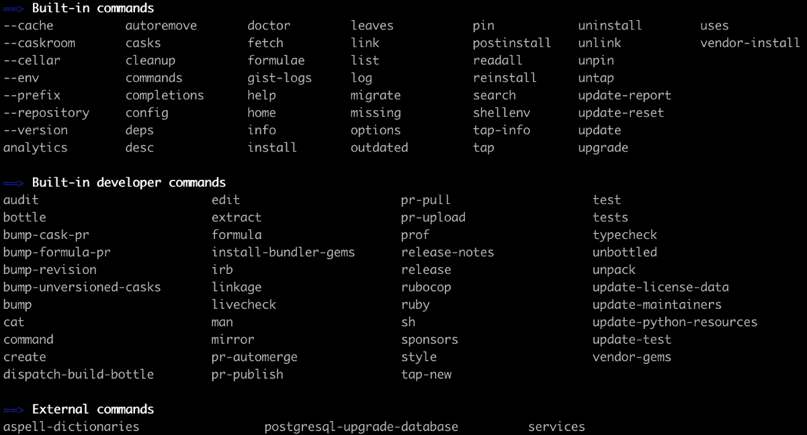
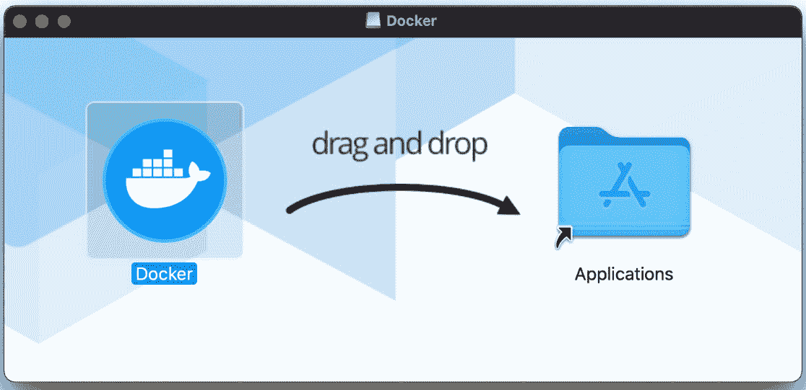
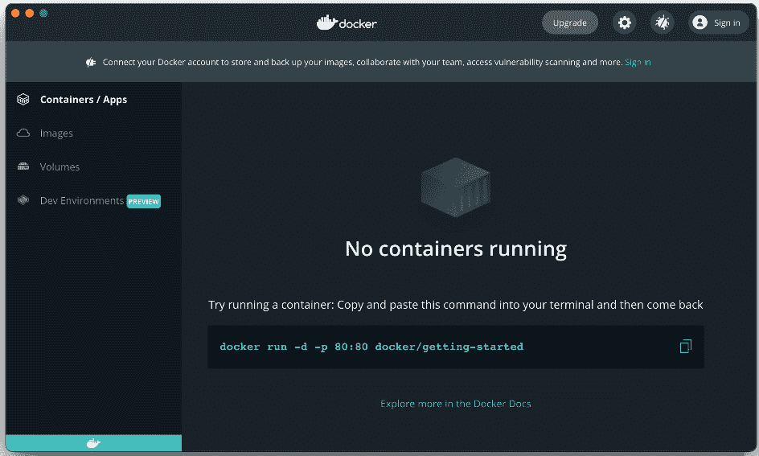
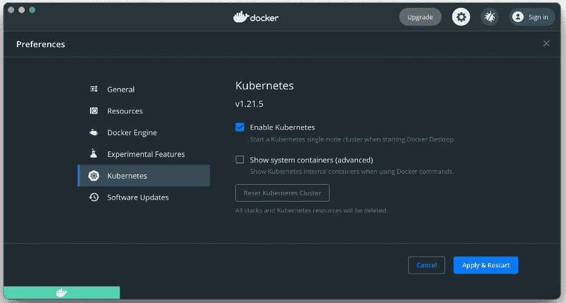
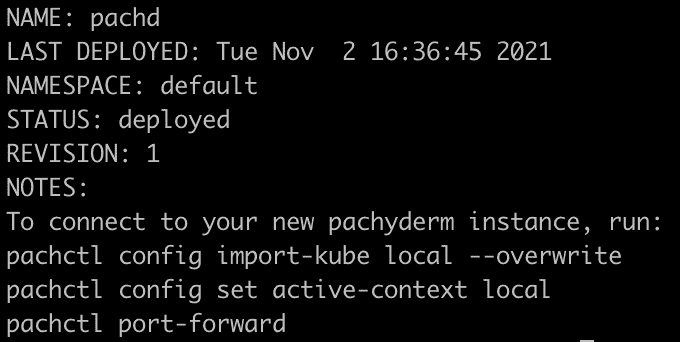
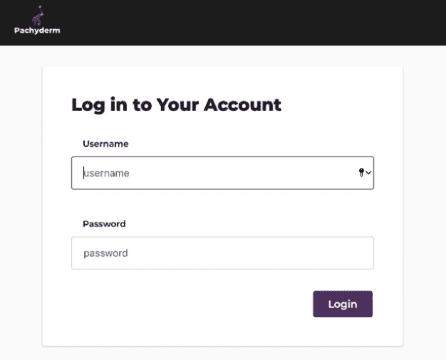
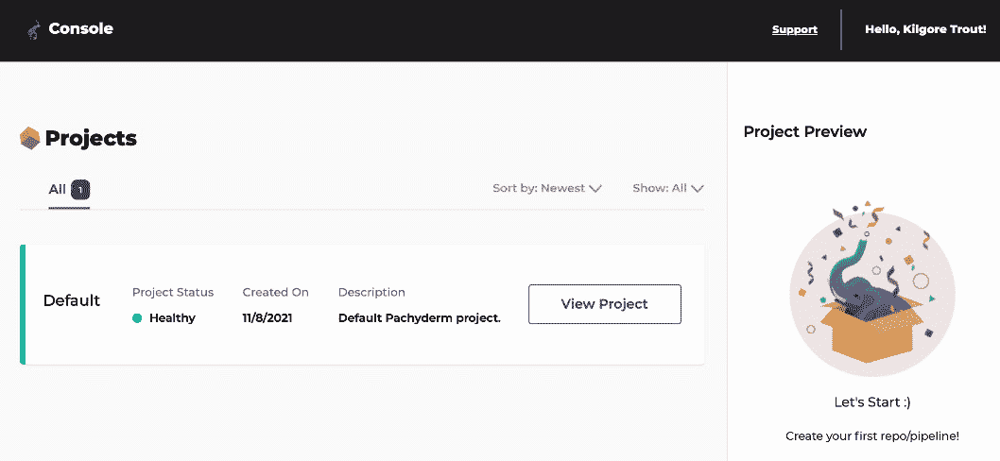

# *第四章*：本地安装 Pachyderm

在前几章中，我们了解了 Pachyderm 的架构、Pachyderm 解决方案的内部工作原理，以及版本控制原语，如仓库、分支和提交。我们回顾了为什么可重复性至关重要，以及它为何应成为成功的数据科学流程的一部分。我们还学习了如何在 macOS、Linux 和 Windows 三大平台上进行操作。

有许多方式和平台可以让你使用 Pachyderm 运行端到端的 **机器学习**（**ML**）工作流。我们将从最常见和最容易配置的本地部署方法开始，然后在接下来的章节中回顾在云平台上的部署过程。

本章将引导你完成在本地安装 Pachyderm 的过程，让你能够快速开始并测试 Pachyderm。本章将为你运行第一个 pipeline 做好准备。我们将概述系统要求，并指导你安装运行 Pachyderm 所需的所有前置软件。

本章将涵盖以下主要主题：

+   安装所需工具

+   安装 minikube

+   安装 Docker Desktop

+   安装 Pachyderm **命令行界面**（**CLI**）

+   启用 Pachyderm 的自动补全功能

+   准备 Kubernetes 环境

+   部署 Pachyderm

+   访问 Pachyderm 仪表盘

+   删除现有的 Pachyderm 部署

# 技术要求

无论你使用的是 macOS、Windows 还是 Linux，都需要安装以下工具：

+   Homebrew

+   Kubernetes 的 `kubectl`

+   Helm

+   minikube

+   Docker Desktop（作为 minikube 的替代方案）

+   Pachyderm CLI；即通过 `pachctl`

+   **Windows 子系统 for Linux**（**WSL**）用于 Windows 安装

我们将在本章中详细讲解安装和配置这些工具的具体步骤。如果你已经知道如何操作，可以立即开始设置。

# 安装所需工具

在本节中，我们将介绍如何安装我们将用于准备环境的系统工具，然后再安装 Pachyderm。

## 安装 Homebrew（仅限 macOS）

尽管 Linux 发行版有许多包管理选项，但 macOS 用户没有默认的包管理器。`brew` 填补了这个空白，提供了一种很好的解决方案，可以在 macOS 终端和 Linux shell 中轻松安装和管理软件，作为 Linux 发行版中可用的 **apt**、**yum** 或 **flatpak** 的替代方案。

Homebrew 使用 `/user/local/Cellar` 目录。你常常会听到的另一个术语是 **Tap**。Tap 是一个 Formulae 的 Git 仓库。

在本章中，我们将经常使用 `brew` 来安装 macOS 上的各种软件包。因此，如果你使用的是 macOS，则需要先安装它。我们将在本章中使用的相同 `brew` 命令也可以在 Linux 上运行，但我们会将 Linux 上的 brew 使用保留为可选项：

1.  执行以下命令以在你的计算机上安装 Homebrew：

    ```py
    $ /bin/bash -c "$(curl -fsSL https://raw.githubusercontent.com/Homebrew/install/HEAD/install.sh)"
    ```

1.  执行以下命令以验证 Homebrew 是否已安装，并列出可用的命令：

    ```py
    $ brew commands
    ```

以下屏幕截图显示了系统的输出：



图 4.1 – brew 命令列表

1.  让我们了解一些你将来可能需要的有用 Homebrew 命令。你可以通过执行以下命令更新 Homebrew 本身：

    ```py
    $ brew update
    ```

1.  执行以下命令查找任何过时的配方：

    ```py
    $ brew outdated
    ```

1.  执行以下命令以升级所有过时的配方：

    ```py
    $ brew upgrade
    ```

现在你已经在计算机上安装了 Homebrew 包管理器，接下来我们来安装 `kubectl`。

## 安装 Windows 子系统 Linux（仅限 Windows）

**WSL** 是一个工具，它使 Windows 用户能够在 Windows 中原生运行 Linux 命令和实用程序。如果你使用的是 Windows，可以通过以下步骤在机器上安装 WSL：

1.  打开 PowerShell 或 Windows 命令提示符。

1.  通过运行以下命令安装 WSL：

    ```py
    wsl --install
    ```

    重要说明

    如果你使用的是 Windows，请从 WSL 运行本书中描述的所有 Linux 和 Pachyderm 命令。

有关更多信息，请参见官方微软 Windows 文档：https://docs.microsoft.com/en-us/windows/wsl/install。

## 安装 Kubernetes 命令行工具

在创建第一个 Kubernetes 集群之前，你需要安装 Kubernetes 命令行工具 `kubectl`，以便执行对集群的命令。现在，让我们了解如何在计算机上安装 `kubectl`。

有关更多信息，请参见官方 Kubernetes 文档：https://kubernetes.io/docs/home/。

按照以下步骤操作：

1.  执行以下命令以在你的计算机上下载并安装 `kubectl`：

如果你正在使用 Linux，请运行以下命令：

```py
$ curl -LO https://storage.googleapis.com/kubernetes-release/release/$(curl -s https://storage.googleapis.com/kubernetes-release/release/stable.txt)/bin/linux/amd64/kubectl
$ chmod +x ./kubectl && sudo mv ./kubectl /usr/local/bin/kubectl
```

如果你使用的是 macOS（Intel），请运行以下命令：

```py
$ curl -LO https://storage.googleapis.com/kubernetes-release/release/$(curl -s https://storage.googleapis.com/kubernetes-release/release/stable.txt)/bin/darwin/amd64/kubectl
$ chmod +x ./kubectl && sudo mv ./kubectl /usr/local/bin/kubectl
```

如果你使用的是 Windows，以下命令将完成此操作：

```py
curl -LO https://dl.k8s.io/release/v1.22.0/bin/windows/amd64/kubectl.exe
```

1.  通过执行以下命令验证你正在使用的版本，并确保已安装 `kubectl`：

    ```py
    $ kubectl version --short --client
    ```

这是系统输出的示例：

```py
Client Version: v1.22.3
```

为了能够执行以下命令，`kubectl` 的版本必须为 v1.19 或更高版本。

现在你已在计算机上安装了 `kubectl`，可以对你的 Kubernetes 集群执行命令，接下来我们来安装 Helm。

## 安装 Helm v3

Helm 是 Kubernetes 集群的流行包管理器。在使用其 Helm 图表部署 Pachyderm 之前，你需要在环境中安装 Helm 二进制文件，以便能够管理 Helm 图表的生命周期。请按照以下步骤在你的计算机上安装 Helm：

1.  执行以下命令以下载并在计算机上安装 Helm：

    ```py
    $ curl -fsSL -o get_helm.sh https://raw.githubusercontent.com/
    helm/helm/master/scripts/get-helm-3
    $ chmod 700 get_helm.sh
    $ ./get_helm.sh
    ```

1.  通过执行以下命令验证你正在使用的版本，并确保已安装 Helm：

    ```py
    $ helm version --short
    ```

这是系统输出的示例：

```py
V3.7.1+g1d11fcb
```

接下来，在你部署 Pachyderm 之前，你必须安装必要的工具来准备本地 Kubernetes 集群环境。如果你熟悉 Linux 中的容器，你应该对这些工具也很熟悉。如果你使用 Linux 作为本地计算机，请按照 *安装 minikube* 部分提供的说明来准备环境。如果你使用的是 macOS，请按照 *安装 Docker Desktop* 部分提供的说明进行操作。由于简单易用，推荐使用 Docker Desktop。

# 安装 minikube

**Minikube** 是一个流行的跨平台且轻量级的 Kubernetes 实现，它帮助用户快速创建单节点的本地 Kubernetes 集群。minikube 支持多种运行时，包括 **CRI-O**、**container** 和 **Docker**。它可以作为 **虚拟机**（**VM**）、容器或裸机部署。由于 Pachyderm 仅支持 Docker 运行时，我们将介绍如何使用 Docker 容器运行时并将其部署为容器。有关更多配置细节，你可以参考官方 Docker 文档 [`minikube.sigs.k8s.io/docs/start/`](https://minikube.sigs.k8s.io/docs/start/)。现在让我们安装最新版本的 minikube：

1.  执行以下命令，在你的计算机上安装 `minikube`。

如果你正在使用 Linux，请运行以下命令：

```py
$ curl -LO https://storage.googleapis.com/minikube/releases/latest/minikube-linux-amd64
$ sudo install minikube-linux-amd64 /usr/local/bin/minikube
```

如果你使用的是 Windows（需要 Chocolatey 包管理器），请运行以下命令：

```py
choco install minikube
```

1.  通过执行以下命令，验证你正在使用的 `minikube` 版本，并确保已安装 minikube：

    ```py
    $ minikube version
    ```

以下是命令响应的示例：

```py
minikube version: v1.22.0
commit: a03fbcf166e6f74ef224d4a63be4277d017bb62e 
```

现在你已经安装了 minikube，接下来让我们安装 Docker Desktop。

# 安装 Docker Desktop

Docker 通过将应用程序与基础设施及其依赖关系分离，简化了应用程序的开发、交付和运行。Pachyderm 仅支持 Docker 容器运行时；因此，在部署 Pachyderm 之前必须安装 Docker 工具。

Docker 作为原生应用程序运行，使用 macOS 沙盒安全模型，并在你的 macOS 上安装所有 Docker 工具，包括 Docker 引擎、CLI、Docker Compose、Credential Helper、Notary 和 Kubernetes。

如果你还没有安装 Docker Desktop，可以按照下一节提供的说明进行安装。否则，你可以跳到 *准备 Kubernetes 环境* 部分。你还可以参考官方 Docker 文档 [`docs.docker.com/get-docker/`](https://docs.docker.com/get-docker/)。

## 为 macOS 安装 Docker Desktop

按照以下步骤在 macOS 上安装 Docker Desktop。Docker 的最新版本支持 macOS 的最后三个版本。如果你的 macOS 版本比最新三个版本更旧，你需要将其升级到最新版本的 macOS：

1.  访问 Docker Hub 下载链接 [`hub.docker.com/editions/community/docker-ce-desktop-mac/`](https://hub.docker.com/editions/community/docker-ce-desktop-mac/) 下载 Docker Desktop 安装程序。

1.  点击 `Docker.dmg` 文件以在工作站上安装。

1.  下载完成后，双击 `Docker.dmg` 文件以打开镜像，并将 Docker 图标从窗口拖动到**应用程序**文件夹完成安装：



图 4.2 – macOS 上的 Docker Desktop 安装界面

1.  在**应用程序**文件夹中，双击 Docker 图标以启动 Docker Desktop。

1.  确认你拥有安装 Docker 组件的权限。

1.  如果你是第一次使用 Docker，请按照快速教程操作。否则，点击**跳过教程**以启动 Docker：



图 4.3 – Docker Desktop 图形用户界面

在 Windows 上安装 Docker Desktop

按照以下步骤在 Windows 计算机上安装 Docker Desktop：

1.  访问 https://docs.docker.com/desktop/windows/install/。

1.  点击**Docker Desktop for Windows**。

1.  点击**Docker Desktop Installer.exe**。

1.  按照互动提示安装**Docker Desktop**。

1.  在**配置**页面，确保选择**为 WSL 2 安装所需的 Windows 组件**。

1.  完成后，点击**关闭**。

1.  通过在 Windows 搜索中找到 Docker Desktop 并接受条款与条件，启动 Docker Desktop。之后，Docker 将自动启动。

现在你已经在机器上安装了 Docker Desktop，让我们安装 Pachyderm CLI，称为 `pachctl`。

# 安装 Pachyderm 命令行界面

Pachyderm 的 `pachctl` 用于部署和与 Pachyderm 集群交互。按照以下步骤安装 `pachctl`：

1.  获取 `pachctl` 的最新版本标签，并将其保存在一个名为 `PACHYDERMVERSION` 的变量中：

    ```py
    $ PACHYDERMVERSION=$(curl --silent "https://api.github.com/repos/pachyderm/pachyderm/releases/latest" | grep '"tag_name":' | \
    sed -E 's/.*"v([^"]+)".*/\1/')
    ```

1.  执行以下命令在计算机上安装 `pachctl`。

如果你使用的是 macOS，请运行以下命令：

```py
$ brew tap pachyderm/tap && brew install pachyderm/tap/pachctl@${PACHYDERMVERSION}
```

如果你使用的是 Debian Linux 或 Windows 10 上的 WSL，请运行以下命令：

```py
$ curl -o /tmp/pachctl.deb -L https://github.com/pachyderm/pachyderm/releases/download/v${PACHYDERMVERSION}/pachctl_${PACHYDERMVERSION}_amd64.deb && sudo dpkg -i /tmp/pachctl.deb
```

1.  执行以下命令来验证是否已安装`pachctl`：

    ```py
    $ pachctl version --client-only
    ```

以下是系统输出的示例：

```py
COMPONENT           VERSION
pachctl             2.0.1
```

至此，你已安装了运行 Pachyderm 所需的先决条件。现在，让我们准备集群并在本地 Kubernetes 集群上部署 Pachyderm。

# 启用 Pachyderm 的自动补全

自动补全是 Unix shell 提供的一项功能，通过命令行界面（CLI）自动填写参数。根据系统中使用的 shell 类型，自动补全功能会在你输入命令时，建议或自动补全部分输入的命令，有时按下*Tab*键即可。Pachyderm 支持 Bourne Again Shell（`bash`）和 Z shell（`zsh`，一种扩展的 Bourne shell）的自动补全功能。`bash` 和 `zsh` 是 macOS 和 Linux 上最常用的 Unix 命令行解释器。在本节中，你将学习如何启用 Pachyderm 的自动补全功能，以及 `pachctl` 命令支持的参数。

如果你不知道自己使用的是哪种 shell，请键入以下命令查看：

```py
$ echo "$SHELL"
```

如果你使用的是 `bash`，则前面命令的输出应如下所示：

```py
/bin/bash
```

如果你使用的是 `zsh`，则前面命令的输出应如下所示：

```py
/bin/zsh
```

既然我们已经知道使用的是哪种 shell，接下来可以安装 Pachyderm 自动补全。

## 启用 bash 的 Pachyderm 自动补全

按照以下步骤在你的计算机上启用 Pachyderm 自动补全：

1.  执行以下命令以启用 `bash-completion`。

如果你使用的是带有 Homebrew 的 macOS 或 Linux，请使用以下命令：

```py
$ brew install bash-completion
```

如果你使用的是 Ubuntu Linux，请使用以下命令：

```py
$ sudo apt install bash-completion
```

如果你使用的是 RHEL 或 CentOS Linux，请使用以下命令：

```py
$ sudo yum install bash-completion bash-completion-extras
```

1.  执行以下命令以验证 `bash-completion` 是否已在你的计算机上启用。

如果你使用的是 macOS，请运行以下命令：

```py
$ brew info bash-completion
```

如果你使用的是 Linux，请运行以下命令：

```py
$ complete -p
```

1.  确认 `bash-completion` 的路径指向正确的目录。然后，执行以下任一命令以启用 Pachyderm `pachctl` 自动补全：

如果你使用的是 macOS，请运行以下命令：

```py
$ pachctl completion bash --install --path /usr/local/etc/bash_completion.d/pachctl
```

如果你使用的是 Linux，请运行以下命令：

```py
$ pachctl completion bash --install --path /usr/share/bash-completion/completions/pachctl
```

到此为止，Pachyderm 的命令行自动补全已经在你的 bash shell 中启用。

## 启用 zsh 的 Pachyderm 自动补全

`zsh` 和 macOS Catalina。按照以下步骤在你的计算机上启用 Pachyderm 自动补全：

重要提示

如果你不希望启用自动补全，你可以尝试使用 `pachctl shell`。要启用此功能，请键入 `pachctl shell`。

1.  执行以下命令以启用 `zsh` 自动补全。

如果你使用的是带有 Homebrew 的 macOS 或 Linux，请使用以下命令：

```py
$ brew install zsh-completion
```

如果你在 Linux 上，访问 [`github.com/zsh-users/zsh-completions`](https://github.com/zsh-users/zsh-completions) 页面，并根据你的 Linux 发行版按照说明启用 `zsh` 补全。例如，对于 Ubuntu 19.10，应该如下所示：

```py
$ echo 'deb http://download.opensuse.org/repositories/shells:/zsh-users:/zsh-completions/xUbuntu_19.10/ /' | sudo tee /etc/apt/sources.list.d/shells:zsh-users:zsh-completions.list
$ curl -fsSL https://download.opensuse.org/repositories/shells:zsh-users:zsh-completions/xUbuntu_19.10/Release.key | gpg --dearmor | sudo tee /etc/apt/trusted.gpg.d/shells_zsh-users_zsh-completions.gpg > /dev/null
$ sudo apt update && sudo apt install zsh-completions
```

1.  执行以下命令以验证 `zsh` 自动补全是否已在你的计算机上启用。

如果你使用的是 macOS，请运行以下命令：

```py
$ brew info zsh-completions
```

如果你使用的是 Linux，请运行以下命令：

```py
$ complete -p
```

1.  确认 `zsh` 自动补全的路径指向正确的目录。然后，执行以下任一命令以启用 Pachyderm `pachctl` 自动补全。

在 macOS 上，运行以下命令：

```py
$ pachctl completion zsh --install --path /usr/local/share/zsh-completions/_pachctl
```

如果你使用的是 Linux，请运行以下命令：

```py
$ pachctl completion zsh --install --path /home/linuxbrew/.linuxbrew/share/zsh-completions/_pachctl
```

到此为止，Pachyderm 命令行自动补全现在已在你的 `zsh` shell 中启用。接下来，我们来准备 Kubernetes 环境。

# 准备 Kubernetes 环境

在本节中，你将使用在 *安装所需工具* 部分中部署的首选工具来配置 Kubernetes 集群。

## 在 Docker Desktop 上启用 Kubernetes

如果你使用 Docker Desktop 作为容器平台来部署 Kubernetes 集群，可以按照以下步骤启用 Kubernetes：

1.  打开 Docker 用户界面。

1.  在 Docker UI 的右上角，点击 **设置** 图标。

1.  切换到 Kubernetes 设置面板，并点击 **启用 Kubernetes** 按钮，以在 Docker Desktop 上启动单节点 Kubernetes 集群。通过点击 **应用并重启** 按钮来应用这些设置：



图 4.4 – 在 Docker Desktop 中启用 Kubernetes

1.  打开终端窗口并通过执行以下命令确认 Kubernetes 是否正在运行：

    ```py
    $ kubectl get node
    ```

以下是系统响应的示例：

```py
NAME           STATUS ROLES                AGE  VERSION
docker-desktop Ready  control-plane,master 7m9s v1.21.5
```

至此，你已经在 Docker Desktop 上配置了单节点 Kubernetes 集群。现在，我们准备在本地 Kubernetes 环境中部署 Pachyderm。

## 使用 minikube 启用 Kubernetes

按照以下步骤在使用 minikube 时本地运行 Kubernetes：

1.  将 Docker 设置为 `minikube` 的默认驱动程序：

    ```py
    $ minikube config set driver docker
    ```

1.  启动 Kubernetes 集群：

    ```py
    $ minikube start
    ```

1.  执行以下命令以验证你的 Kubernetes 集群是否准备好：

    ```py
    $ kubectl get node
    NAME       STATUS   ROLES                  AGE   VERSION
    minikube   Ready    control-plane,master   29m   v1.20.2
    ```

至此，你的 Kubernetes 集群已经使用 minikube 配置完成。现在，我们准备在本地 Kubernetes 环境中部署 Pachyderm。

# 部署 Pachyderm

在生产环境中运行 Pachyderm 时，建议在可以扩展资源以满足较大流水线计算需求的环境中启动。Pachyderm 可以安装在任何 Kubernetes 集群上，包括 AWS、Google Cloud、Microsoft Azure、IBM Cloud 和 OpenShift 提供的托管 Kubernetes 服务，也可以在本地工作站上安装。在本节中，我们将重点介绍一个较小的测试部署，因此，本地集群足以开始。

Pachyderm 提供了示例 Helm 图表，帮助你将 Pachyderm 部署到所有主要云平台。你可以在 *第二章* 中了解更多关于 Helm 图表的信息，*Pachyderm 基础*。由于 Helm 图表是灵活的，你可以选择要安装的组件。例如，你可以安装名为控制台的 Pachyderm 浏览器界面。

Pachyderm 控制台是 Pachyderm 的用户界面，并通过 **直接有向图**（**DAG**）提供对你的流水线的鸟瞰图，以及其他有用的功能。

一些组件，如 Pachyderm 控制台，要求企业版许可证，但也可以通过免费试用许可证进行测试，试用期为 30 天。你可以在 [`www.pachyderm.com/trial/`](https://www.pachyderm.com/trial/) 请求免费试用许可证。

按照以下步骤在本地 Kubernetes 集群中安装 Pachyderm：

1.  部署 Pachyderm 包括多个资源。`helm` 命令帮助管理复杂 Kubernetes 应用的生命周期，并通过一个命令同时创建所有必要的组件。你可以在*第五章*中了解更多关于 Helm charts 的选项，*在云平台上安装 Pachyderm*。现在，让我们执行以下命令将 Pachyderm Helm Chart 仓库添加到本地仓库：

    ```py
    $ helm repo add pach https://helm.pachyderm.com  
    ```

1.  执行以下命令从 Chart 仓库获取最新的 Chart 信息：

    ```py
    $ helm repo update
    ```

1.  执行以下命令将最新版本的 Pachyderm 部署到你的集群中，无需控制台：

    ```py
    $ helm install pachd pach/pachyderm --set deployTarget=LOCAL
    ```

如果你有企业密钥并希望通过 Pachyderm 的控制台用户界面进行部署，请创建一个名为 `license.txt` 的文件，并将你的企业令牌粘贴到该文件中。然后，运行以下命令：

```py
$ helm install pachd pach/pachyderm --set deployTarget=LOCAL --set pachd.enterpriseLicenseKey=$(cat license.txt) --set console.enabled=true  
```

一旦控制台成功部署，请按照*访问 Pachyderm 控制台*章节中的说明访问控制台。

前面的命令返回以下输出：



图 4.5 – Pachyderm Helm Chart 在 Kubernetes 上部署

1.  你可以检查 Helm Chart 仓库中的 `values.yaml` 文件（[`github.com/pachyderm/pachyderm/tree/master/etc/helm/pachyderm`](https://github.com/pachyderm/pachyderm/tree/master/etc/helm/pachyderm)），了解通过部署该 Chart 创建的 Kubernetes 对象。Pachyderm Helm Chart 创建了 Kubernetes **服务账户**、**服务**、**部署**、PostgreSQL 和 etcd 实例，所有这些都是运行 Pachyderm 所必需的。

1.  Kubernetes 部署是一个控制器，它根据你在清单文件中定义的要求推出一组 Pods 的副本集。副本集是一组相同的服务实例。执行以下命令验证在安装过程中创建的部署状态：

    ```py
    $ kubectl get deployments
    ```

前面的命令输出应如下所示：


图 4.6 – Pachyderm 部署对象列表

1.  执行以下命令验证安装是否成功，并查看作为部署一部分创建的 Pods：

    ```py
    $ kubectl get pods
    ```

前面的命令输出应如下所示：


图 4.7 – Pachyderm Pods 列表

1.  执行以下命令连接到你的新 Pachyderm 实例：

    ```py
    pachctl config import-kube local –overwrite
    pachctl config set active-context local
    pachctl port-forward
    ```

1.  打开浏览器并访问 `http://localhost:4000`。

1.  使用名为 `admin` 的模拟用户进行身份验证，并使用 `password` 作为密码。

1.  返回终端并启用身份验证：

    ```py
    pachctl auth activate
    ```

系统会提示你再次登录 UI。使用名为 `admin` 的模拟用户登录，并将 `password` 作为密码。

1.  执行以下命令验证 Pachyderm 是否成功安装：

    ```py
    pachctl version
    ```

上述命令的输出应如下所示：

```py
COMPONENT           VERSION
pachctl             2.0.1
pachd               2.0.1
```

现在我们已经在集群中安装了 Pachyderm，可以开始创建我们的第一个管道了。

# 访问 Pachyderm Console

如果你已与 Pachyderm 集群一起安装了 Console，你可以在 UI 中访问它，并查看你的管道、仓库和其他 Pachyderm 对象。Pachyderm Console 提供 30 天的免费试用期。按照以下步骤访问 Pachyderm Console：

1.  执行以下命令以验证企业激活的状态：

    ```py
    pachctl enterprise get-state
    ```

上述命令的输出应如下所示：

```py
Pachyderm Enterprise token state: ACTIVE
Expiration: 2022-02-02 22:35:21 +0000 UTC
```

1.  如果端口转发未运行，请执行以下命令启动它。此步骤将把 Pachyderm Console 服务的端口 `4000` 转发到本地工作站的端口 `4000`：

    ```py
    pachctl port-forward
    ```

1.  在网页浏览器中，打开 [`localhost:4000`](http://localhost:4000)。

1.  在登录屏幕上使用默认凭据 `admin` 和 `password`，如下所示：



图 4.8 – Pachyderm Console 登录屏幕

1.  点击 **登录** 访问 Pachyderm Console 后，点击 **查看项目** 按钮以查看你的仓库和管道：



图 4.9 – Pachyderm 仪表板

因为我们尚未创建任何 Pachyderm 对象，所以此页面为空。

现在你已经学会了如何访问 Pachyderm Console，准备好在 Pachyderm 中创建第一个管道了。

# 删除现有的 Pachyderm 部署

仅当你想删除集群时才执行此部分的步骤。如果你想继续在其他章节中的示例上工作，请跳过此部分。

如果你需要删除部署并重新开始，你需要清除环境并从 *准备 Kubernetes 环境* 部分提供的步骤重新开始。当你删除现有的 Pachyderm 部署时，所有组件（除了 Helm 仓库和 `pachctl`）都会从你的机器中移除。

按照以下步骤删除现有的 Pachyderm 部署：

1.  如果你为 Helm 实例使用了不同的名称，请执行以下命令查找你通过 Helm 图表部署的 Pachyderm 实例名称：

    ```py
    $ helm ls | grep pachyderm
    ```

上述命令的输出应如下所示：

```py
pachd default 1 2021-11-08 21:33:44 deployed Pachyderm-2.0.1 2.0.1
```

1.  使用你的 Pachyderm 实例名称执行以下命令，从集群中删除 Pachyderm 组件：

    ```py
    $ helm uninstall pachd
    ```

1.  如果你使用的是 minikube，请删除整个 Kubernetes 集群并重新部署，然后再重新部署 Pachyderm：

    ```py
    $ minikube stop 
    $ minikube delete 
    ```

至此，你已完全从计算机中移除了 Pachyderm 和本地 Kubernetes 集群。

# 总结

在本章中，我们了解了在本地计算机上为测试目的安装和运行 Pachyderm 所需的软件先决条件。

我们了解了 minikube 和 Docker Desktop 的基本知识，并学习了如何在本地机器上安装它们。我们还学习了如何安装 Pachyderm CLI 并在不同操作系统上启用自动补全功能。

然后，我们在系统上安装了 Helm 和 Pachyderm Helm 仓库。我们了解了 Helm Charts 以及如何获取免费的 Pachyderm 试用许可证。

我们使用基于桌面操作系统的最流行选项部署了一个单节点、本地 Kubernetes 集群。最后，我们部署了 Pachyderm，并学习了如何访问 Pachyderm 控制台。

我们还学习了如何在三大主要平台上进行操作——macOS、Linux 和 Windows。

在下一章节中，我们将学习如何通过云端安装 Pachyderm，并解释在生产环境中运行 Pachyderm 集群所需的软件要求。我们还将了解 **Pachyderm Hub**，即 **软件即服务**（**SaaS**）版本的 Pachyderm，适用于测试和生产环境。

# 进一步阅读

请参考以下链接，了解本章中涉及的主题：

+   *官方 Homebrew 文档*：[`docs.brew.sh/`](https://docs.brew.sh/)

+   *Kubectl 备忘单*：[`kubernetes.io/docs/reference/kubectl/cheatsheet/`](https://kubernetes.io/docs/reference/kubectl/cheatsheet/)

+   *Minikube 手册*：[`minikube.sigs.k8s.io/docs/handbook/`](https://minikube.sigs.k8s.io/docs/handbook/)

+   *官方 Docker Desktop 文档*：https://docs.docker.com/desktop/

+   *生产环境中的 Kubernetes 最佳实践*：[`www.packtpub.com/product/kubernetes-in-production-best-practices/9781800202450`](https://www.packtpub.com/product/kubernetes-in-production-best-practices/9781800202450)

+   *Kubernetes 和 Docker – 企业指南*：[`www.packtpub.com/product/kubernetes-and-docker-an-enterprise-guide/9781839213403`](https://www.packtpub.com/product/kubernetes-and-docker-an-enterprise-guide/9781839213403)

+   *官方 Pachyderm pachctl 参考指南*：[`docs.pachyderm.com/latest/reference/pachctl/pachctl/`](https://docs.pachyderm.com/latest/reference/pachctl/pachctl/)
