# 14 无监督机器学习中的异常值检测

## 加入我们的书籍社区，参与 Discord 讨论


[`packt.link/zmkOY`](https://packt.link/zmkOY)

在*第八章*，*使用统计方法的异常值检测*中，你探讨了使用参数和非参数统计技术来识别潜在的异常值。这些方法简单、可解释，而且相当有效。

异常值检测并非简单直观，主要是由于异常值的定义存在模糊性，这种定义取决于你的数据或你试图解决的问题。例如，尽管常见，但*第八章*中使用的某些阈值，*使用统计方法的异常值检测*，仍然是任意的，并非你必须遵循的规则。因此，拥有领域知识或能够访问**主题专家**（**SMEs**）对于正确判断异常值至关重要。

在本章中，你将会接触到基于机器学习的几种异常值检测方法。大多数机器学习异常值检测技术被视为*无监督*异常值检测方法，例如**孤立森林**（**iForest**）、无监督**K-近邻算法**（**KNN**）、**局部异常因子**（**LOF**）以及**基于 Copula 的异常值检测**（**COPOD**）等。

通常情况下，异常值（或异常情况）被认为是一种罕见现象（在本章稍后你会看到，这被称为污染率）。换句话说，你会假设在一个大型数据集中，只有一小部分数据是异常值。例如，1%的数据可能是潜在的异常值。然而，这种复杂性需要设计出能够发现数据模式的方法。无监督的异常值检测技术擅长于发现罕见现象中的模式。

在调查异常值之后，你将拥有一个历史标签数据集，允许你使用半监督的异常值检测技术。本章重点讲解无监督异常值检测。

在本章中，你将接触到**PyOD**库，它被描述为*“一个全面且可扩展的 Python 工具包，用于检测多变量数据中的异常对象。”*该库提供了一个广泛的实现集合，涵盖了异常值检测领域的流行算法和新兴算法，你可以在此阅读更多内容：[`github.com/yzhao062/pyod`](https://github.com/yzhao062/pyod)。

你将使用相同的纽约出租车数据集，这样可以更方便地比较本章不同机器学习方法和*第八章*，*使用统计方法的异常值检测*中的统计方法的结果。

本章中你将遇到的内容如下*：

+   使用**KNN**检测异常值

+   使用**LOF**检测异常值

+   使用**iForest**检测异常值

+   使用**一类支持向量机**（**OCSVM**）检测异常值

+   使用**COPOD**检测异常值

+   使用**PyCaret**检测异常值

## 技术要求

你可以从 GitHub 仓库下载所需的 Jupyter notebooks 和数据集：

+   Jupyter notebooks：[`github.com/PacktPublishing/Time-Series-Analysis-with-Python-Cookbook./blob/main/code/Ch14/Chapter%2014.ipynb`](https://github.com/PacktPublishing/Time-Series-Analysis-with-Python-Cookbook./blob/main/code/Ch14/Chapter%2014.ipynb)

+   数据集：[`github.com/PacktPublishing/Time-Series-Analysis-with-Python-Cookbook./tree/main/datasets/Ch14`](https://github.com/PacktPublishing/Time-Series-Analysis-with-Python-Cookbook./tree/main/datasets/Ch14)

你可以使用 `pip` 或 Conda 安装 PyOD。对于 `pip` 安装，运行以下命令：

```py
pip install pyod
```

对于 `Conda` 安装，运行以下命令：

```py
conda install -c conda-forge pyod
```

为了准备异常值检测方法，首先加载你将在整个章节中使用的库：

```py
import pandas as pd
import numpy as np
import matplotlib.pyplot as plt
from pathlib import Path
import warnings
warnings.filterwarnings('ignore')
plt.rcParams["figure.figsize"] = [16, 3]
```

将 `nyc_taxi.csv` 数据加载到 pandas DataFrame 中，因为它将在整个章节中使用：

```py
file = Path("../../datasets/Ch14/nyc_taxi.csv")
nyc_taxi_2 = pd.read_csv(file,
                     index_col='timestamp',
                     parse_dates=True)
nyc_taxi_2.index.freq = '30T'
```

你可以存储包含异常值的已知日期，也称为真实标签：

```py
nyc_dates =  [
        "2014-11-01",
        "2014-11-27",
        "2014-12-25",
        "2015-01-01",
        "2015-01-27"]
```

创建你将在整个方法中使用的 `plot_outliers` 函数：

```py
def plot_outliers(outliers, data, method='KNN',
                 halignment = 'right',
                 valignment = 'top',
                 labels=False):
    ax = data.plot(alpha=0.6)

    if labels:
        for i in outliers['value'].items():
            plt.plot(i[0], i[1], 'v', markersize=8, markerfacecolor='none', markeredgecolor='k')
            plt.text(i[0], i[1]-(i[1]*0.04), f'{i[0].strftime("%m/%d")}',
                         horizontalalignment=halignment,
                         verticalalignment=valignment)
    else:
        data.loc[outliers.index].plot(ax=ax, style='rX', markersize=9)       
    plt.title(f'NYC Taxi - {method}')
    plt.xlabel('date'); plt.ylabel('# of passengers')
    plt.legend(['nyc taxi','outliers'])
    plt.show()
```

在进行异常值检测时，目标是观察不同技术如何捕捉异常值，并将其与真实标签进行比较，如下所示：

```py
tx = nyc_taxi.resample('D').mean()
known_outliers = tx.loc[nyc_dates]
plot_outliers(known_outliers, tx, 'Known Outliers')
```

上述代码应生成一个时间序列图，其中标记 `X` 表示已知的异常值：

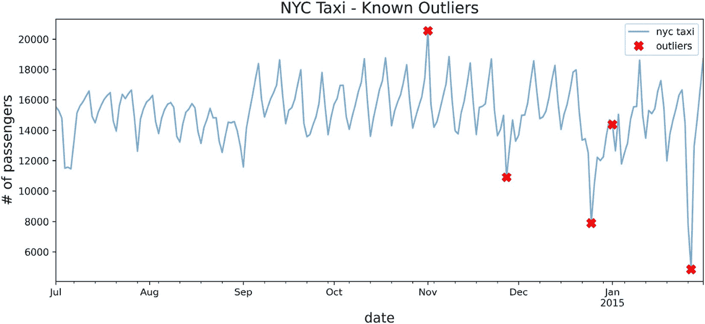

图 14.1：对下采样后的纽约出租车数据进行绘图，并附上真实标签（异常值）

> PYOD 的训练与预测方法
> 
> > 像 scikit-learn 一样，PyOD 提供了熟悉的方法来训练模型并进行预测，方法包括：`model.fit()`、`model.predict()` 和 `model.fit_predict()`。
> > 
> > 在这些方法中，我们将过程分为两步，首先使用 `.fit()` 拟合模型（训练），然后使用 `.predict()` 进行预测。

除了 `predict` 方法，PyOD 还提供了两个附加方法：`predict_proba` 和 `predict_confidence`。

在第一个方法中，你将探索 PyOD 如何在幕后工作，并介绍基本概念，例如 `contamination` 的概念，以及如何使用 `threshold_` 和 `decision_scores_` 来生成二元标签（*异常* 或 *正常*）。这些概念将在接下来的方法中详细讨论。

## 使用 KNN 检测异常值

KNN 算法通常用于监督学习环境，其中先前的结果或输出（标签）是已知的。

它可以用来解决分类或回归问题。这个思想很简单；例如，你可以根据最近邻来分类一个新的数据点 Y。例如，如果 k=5，算法会通过与点 Y 的距离找到五个最近的邻居，并根据多数邻居的类别来确定 Y 的类别。如果五个邻居中有三个是蓝色，两个是红色，那么 Y 将被分类为蓝色。KNN 中的 K 是一个参数，你可以修改它以找到最佳值。

在离群点检测的情况下，算法的使用方式有所不同。由于我们事先不知道离群点（标签），KNN 以*无监督*的方式进行学习。在这种情况下，算法会为每个数据点找到最近的*K*个邻居，并计算它们的平均距离。与数据集其余部分的距离最远的点将被视为离群点，更具体地说，它们被认为是*全局*离群点。在这种情况下，距离成为确定哪些点是离群点的评分依据，因此 KNN 是一种**基于邻近的算法**。

一般来说，基于邻近的算法依赖于离群点与其最近邻之间的距离或接近度。在 KNN 算法中，最近邻的数量，*k*，是你需要确定的一个参数。PyOD 支持 KNN 算法的其他变种，例如，**平均 KNN**（**AvgKNN**），它使用与 KNN 的平均距离进行评分；以及**中位数 KNN**（**MedKNN**），它使用中位数距离进行评分。

### 如何实现...

在这个示例中，你将继续使用在*技术要求*部分创建的`tx`数据框，通过 PyOD 的`KNN`类来检测离群点：

1.  首先加载`KNN`类：

```py
from pyod.models.knn import KNN
```

1.  你需要熟悉一些参数来控制算法的行为。第一个参数是`contamination`，一个数字（浮动）值，表示数据集中离群点的比例。这是 PyOD 中所有不同类别（算法）通用的参数。例如，`contamination`值为`0.1`表示你期望数据中 10%是离群点。默认值为`contamination=0.1`。`contamination`的值可以在`0`到`0.5`（即 50%）之间变化。你需要通过实验来调整`contamination`值，因为该值会影响用于确定潜在离群点的评分阈值，以及返回多少潜在离群点。你将在本章的*它是如何工作的...*部分深入了解这一点。

例如，如果你怀疑数据中的离群点比例为 3%，你可以将其作为`contamination`值。你可以尝试不同的`contamination`值，检查结果，并确定如何调整`contamination`水平。我们已经知道在 215 个观测值中有 5 个已知的离群点（约 2.3%），在这个示例中，你将使用 0.03（或 3%）。

第二个参数，特定于 KNN 的是`method`，其默认值为`method='largest'`。在本教程中，你将把它更改为`mean`（所有*k*邻居距离的平均值）。第三个参数，亦为 KNN 特有的是`metric`，它告诉算法如何计算距离。默认值是`minkowski`距离，但它可以接受来自 scikit-learn 或 SciPy 库的任何距离度量。最后，你需要提供邻居的数量，默认值为`n_neighbors=5`。理想情况下，你将希望使用不同的 KNN 模型并比较不同*k*值的结果，以确定最佳邻居数量。

1.  使用更新后的参数实例化 KNN，然后训练（拟合）模型：

```py
knn = KNN(contamination=0.03,
          method='mean',
          n_neighbors=5)
knn.fit(tx)
>>
KNN(algorithm='auto', contamination=0.05, leaf_size=30, method='mean',
  metric='minkowski', metric_params=None, n_jobs=1, n_neighbors=5, p=2,
  radius=1.0)
```

1.  `predict`方法将为每个数据点生成二进制标签，`1`或`0`。值为`1`表示是异常值。将结果存储在 pandas Series 中：

```py
predicted = pd.Series(knn.predict(tx),
                      index=tx.index)
print('Number of outliers = ', predicted.sum())
>>
Number of outliers =  6
```

1.  过滤`predicted` Series，仅显示异常值：

```py
outliers = predicted[predicted == 1]
outliers = tx.loc[outliers.index]
outliers
>> 
Timestamp  value
2014-11-01  20553.500000
2014-11-27  10899.666667
2014-12-25  7902.125000
2014-12-26  10397.958333
2015-01-26  7818.979167
2015-01-27  4834.541667
```

总体来看，结果很有前景；已识别出五个已知日期中的四个。此外，算法还识别了圣诞节后的那一天，以及 2015 年 1 月 26 日，那一天由于北美暴风雪，所有车辆都被命令驶离街道。

1.  使用在*技术要求*部分创建的`plot_outliers`函数来可视化输出，以获得更好的洞察：

```py
plot_outliers(outliers, tx, 'KNN')
```

上述代码应生成类似于*图 14.1*的图表，不同之处在于`x`标记是基于使用 KNN 算法识别的异常值：


图 14.2：使用 KNN 算法识别的潜在异常值标记

要打印标签（日期）和标记，只需再次调用`plot_outliers`函数，但这次要设置`labels=True`：

```py
plot_outliers(outliers, tx, 'KNN', labels=True)
```

上述代码应生成一个类似于*图 14.2*的图表，并附加文本标签。

### 工作原理...

KNN 算法的无监督方法计算一个观测值与其他邻近观测值的距离。PyOD 中 KNN 的默认距离是闵可夫斯基距离（p-范数距离）。你可以更改为不同的距离度量，例如使用`euclidean`或`l2`表示欧几里得距离，或使用`manhattan`或`l1`表示曼哈顿距离。可以使用`metric`参数来实现这一点，`metric`参数可以接受字符串值，例如`metric='l2'`或`metric='euclidean'`，也可以是来自 scikit-learn 或 SciPy 的可调用函数。这是一个需要实验的参数，因为它影响距离的计算方式，而异常值分数正是基于此进行计算的。

传统上，当人们听到 KNN 时，他们立即认为它仅仅是一个监督学习算法。对于无监督 KNN，有三种常见的算法：ball tree、KD tree 和暴力搜索。PyOD 库支持这三种算法，分别为 `ball_tree`、`kd_tree` 和 `brute`。默认值设置为 `algorithm="auto"`。

PyOD 使用特定于每个算法的内部评分，对训练集中的每个观测值进行评分。`decision_scores_` 属性将显示每个观测值的这些评分。较高的评分表示该观测值更有可能是异常值：

```py
knn_scores = knn.decision_scores_
```

你可以将其转换为 DataFrame：

```py
knn_scores_df = (pd.DataFrame(scores,
             index=tx.index,
             columns=['score']))
knn_scores_df
```

由于所有数据点都被评分，PyOD 会确定一个阈值来限制返回的异常值数量。阈值的大小取决于你之前提供的 *污染* 值（你怀疑的异常值比例）。污染值越高，阈值越低，因此返回的异常值越多。污染值越低，阈值会提高。

你可以使用模型在拟合训练数据后，从 `threshold_` 属性中获取阈值。以下是基于 3% 污染率的 KNN 阈值：

```py
knn.threshold_
>> 225.0179166666657
```

这是用来过滤显著异常值的值。以下是如何重现这一点的示例：

```py
knn_scores_df[knn_scores_df['score'] >= knn.threshold_].sort_values('score', ascending=False)
```

输出结果如下：


图 14.3：显示来自 PyOD 的决策评分

请注意，最后一个观测值 `2014-09-27` 稍微高于阈值，但在你使用 `predict` 方法时并没有返回。如果使用污染阈值，你可以得到一个更好的截止点：

```py
n = int(len(tx)*0.03)
knn_scores_df.nlargest(n, 'score')
```

另一个有用的方法是 `predict_proba`，它返回每个观测值是正常值和异常值的概率。PyOD 提供了两种方法来确定这些概率：`linear` 或 `unify`。这两种方法都会在计算概率之前对异常值评分进行缩放。例如，在 `linear` 方法的实现中，使用了 scikit-learn 的 `MinMaxScaler` 来缩放评分，然后再计算概率。`unify` 方法则使用 z-score（标准化）和 SciPy 库中的高斯误差函数（`erf`）（`scipy.special.erf`）。

你可以比较这两种方法。首先，使用 `linear` 方法计算预测概率，你可以使用以下代码：

```py
knn_proba = knn.predict_proba(tx, method='linear')
knn_proba_df = (pd.DataFrame(np.round(knn_proba * 100, 3),
            index=tx.index,
            columns=['Proba_Normal', 'Proba_Anomaly']))
knn_proba_df.nlargest(n, 'Proba_Anomaly')
```

对于 `unify` 方法，你只需将 `method='unify'` 更新即可。

要保存任何 PyOD 模型，你可以使用 `joblib` Python 库：

```py
from joblib import dump, load
# save the knn model
dump(knn, 'knn_outliers.joblib')
# load the knn model
knn = load('knn_outliers.joblib')
```

### 还有更多内容...

在之前的步骤中，当实例化 `KNN` 类时，你将计算异常值 *评分* 的 `method` 值更改为 `mean`：

```py
knn = KNN(contamination=0.03,
          method='mean',
          n_neighbors=5)
```

让我们为 KNN 算法创建一个函数，通过更新 `method` 参数为 `mean`、`median` 或 `largest`，以训练模型并检查这些方法对决策评分的影响：

+   `largest` 使用到 *k* 邻居的最大距离作为异常值评分。

+   `mean` 使用与 *k* 邻居的距离的平均值作为异常值分数。

+   `median` 使用与 *k* 邻居的距离的中位数作为异常值分数。

创建 `knn_anomaly` 函数，包含以下参数：`data`、`method`、`contamination` 和 `k`：

```py
def knn_anomaly(df, method='mean', contamination=0.05, k=5):
    knn = KNN(contamination=contamination,
              method=method,
              n_neighbors=5)
    knn.fit(df)   
    decision_score = pd.DataFrame(knn.decision_scores_,
                          index=df.index, columns=['score'])
    n = int(len(df)*contamination)
    outliers = decision_score.nlargest(n, 'score')
    return outliers, knn.threshold_
```

你可以通过不同的方法、污染度和 *k* 值来运行该函数进行实验。

探索不同方法如何生成不同的阈值，这会影响异常值的检测：

```py
for method in ['mean', 'median', 'largest']:
    o, t = knn_anomaly(tx, method=method)
    print(f'Method= {method}, Threshold= {t}')
    print(o)
```

前述代码应该会打印出每种方法的前 10 个异常值（污染度为 5%）：

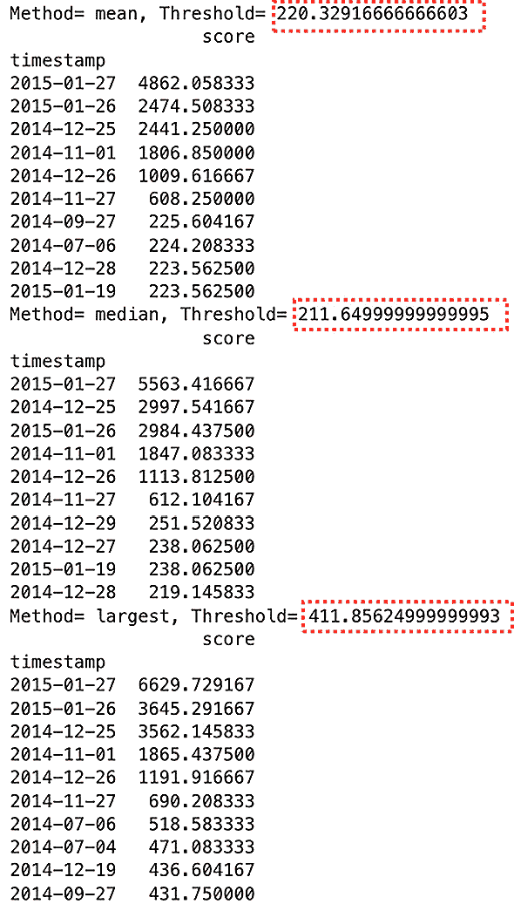

图 14.4：使用不同 KNN 距离度量比较决策分数

注意，前六个（表示 3% 污染度）对于三种方法是相同的。顺序可能会有所不同，各方法的决策分数也不同。请注意，各方法之间的差异在前六个之后更为明显，如 *图 14.4* 所示。

### 另见

查看以下资源：

+   要了解更多关于无监督 KNN 的内容，scikit-learn 库提供了关于其实现的很棒的解释：[`scikit-learn.org/stable/modules/neighbors.html#unsupervised-nearest-neighbors`](https://scikit-learn.org/stable/modules/neighbors.html#unsupervised-nearest-neighbors)。

+   要了解更多关于 PyOD KNN 和不同参数的内容，请访问官方文档：[`pyod.readthedocs.io/en/latest/pyod.models.html?highlight=knn#module-pyod.models.knn`](https://pyod.readthedocs.io/en/latest/pyod.models.html?highlight=knn#module-pyod.models.knn)。

## 使用 LOF 检测异常值

在前一个实例中，*使用 KNN 检测异常值*，KNN 算法通过观测点之间的距离来为检测异常值计算决策分数。与 KNN 距离较远的数据点可以被认为是异常值。总体来说，该算法在捕捉全局异常值方面表现不错，但对于那些远离周围点的数据点，可能无法很好地识别局部异常值。

这时，LOF（局部异常因子）就能解决这个问题。LOF 不使用邻近点之间的距离，而是通过密度作为基础来为数据点评分并检测异常值。LOF 被认为是一个**基于密度的算法**。LOF 的理念是，异常值会离其他数据点较远且更加孤立，因此会出现在低密度区域。

用一个例子来说明这个概念会更清楚：假设一个人站在小而忙碌的星巴克队伍中，每个人几乎都靠得很近；那么，我们可以说这个人处于高密度区域，更具体地说是**高局部密度**。如果这个人决定在停车场里等着，直到队伍稍微缓解，他就被孤立了，处于**低密度**区域，因此被认为是异常值。从排队的人角度来看，他们可能不知道车里的人，但车里的人能看到所有排队的人。所以，从他们的角度来看，车里的人被认为是不可接近的。我们称之为**逆向可达性**（从邻居的角度看你有多远，而不仅仅是你自己的视角）。

和 KNN 一样，你仍然需要定义用于最近邻居数量的*k*参数。最近邻居是基于观察值之间的距离进行识别的（想想 KNN），然后对每个邻近点计算**局部可达密度**（**LRD**或简称**局部密度**）。这个局部密度是用于比较第*k*个邻近观察值的评分，那些局部密度低于第*k*个邻居的点被视为异常值（它们离邻居的范围更远）。

### 如何操作……

在这个实例中，你将继续使用在*技术要求*部分创建的`tx` DataFrame，使用 PyOD 中的**LOF**类来检测异常值：

1.  首先加载`LOF`类：

```py
from pyod.models.lof import LOF
```

1.  你应该熟悉几个控制算法行为的参数。第一个参数是`contamination`，它是一个数值（浮动型），表示数据集中异常值的比例。例如，`0.1`表示你预计 10%的数据是异常值。默认值是*contamination=0.1*。在本例中，你将使用`0.03`（3%）。

第二个参数是邻居的数量，默认为`n_neighbors=5`，类似于 KNN 算法。理想情况下，你会使用不同的*k*（`n_neighbors`）值运行不同的模型，并比较结果以确定最佳的邻居数。最后，`metric`参数指定用来计算距离的度量。可以使用 scikit-learn 或 SciPy 库中的任何距离度量（例如，**欧几里得**距离或**曼哈顿**距离）。默认值是**闵可夫斯基**距离，`metric='minkowski'`。由于闵可夫斯基距离是欧几里得距离（）和曼哈顿距离（）的推广，你会看到一个`p`参数。默认情况下，`p=2`表示欧几里得距离，而`p=1`表示曼哈顿距离。

1.  通过更新`n_neighbors=5`和`contamination=0.03`来实例化 LOF，同时保持其他参数为默认值。然后，训练（拟合）模型：

```py
lof = LOF(contamination=0.03, n_neighbors=5)
lof.fit(tx)
>>
LOF(algorithm='auto', contamination=0.03, leaf_size=30, metric='minkowski',
  metric_params=None, n_jobs=1, n_neighbors=5, novelty=True, p=2)
```

1.  `predict`方法将为每个数据点输出`1`或`0`。值为`1`表示异常值。将结果存储在一个 pandas Series 中：

```py
predicted = pd.Series(lof.predict(tx),
                      index=tx.index)
print('Number of outliers = ', predicted.sum())
>>
Number of outliers = 6
```

1.  过滤预测的序列，仅显示异常值：

```py
outliers = predicted[predicted == 1]
outliers = tx.loc[outliers.index]
outliers
>>       
Timestamp    value
2014-10-31  17473.354167
2014-11-01  20553.500000
2014-12-25  7902.125000
2014-12-26  10397.958333
2015-01-26  7818.979167
2015-01-27  4834.541667
```

有趣的是，它捕获了五个已知日期中的三个，但成功识别了感恩节后的那一天和圣诞节后的那一天为异常值。此外，10 月 31 日是星期五，那天是万圣节夜晚。

使用在*技术要求*部分创建的`plot_outliers`函数来可视化输出，以获得更好的洞察：

```py
plot_outliers(outliers, tx, 'LOF')
```

前面的代码应生成一个类似于*图 14.1*的图表，只不过`x`标记是基于使用 LOF 算法识别的异常值：

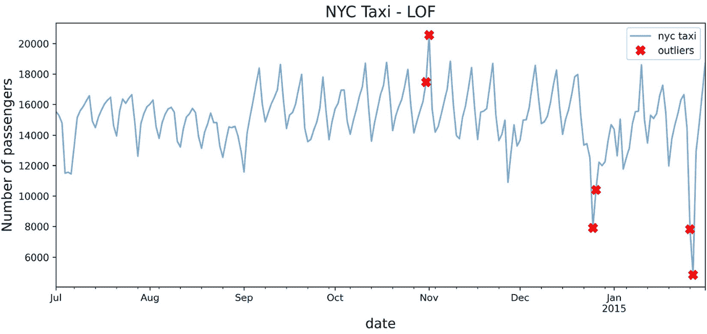

图 14.5：使用 LOF 算法识别的潜在异常值标记

若要打印带有标记的标签（日期），只需再次调用`plot_outliers`函数，但这次传入`labels=True`：

```py
plot_outliers(outliers, tx, 'LOF', labels=True)
```

前面的代码应生成一个类似于*图 14.5*的图表，并附加文本标签。

### 它是如何工作的...

**LOF**是一种**基于密度的算法**，它假设异常点比邻居更加孤立，且具有较低的局部密度得分。

LOF 类似于 KNN，因为我们在计算局部密度之前，测量邻居之间的距离。局部密度是决策得分的基础，你可以通过`decision_scores_`属性查看这些得分：

```py
timestamp  score
2014-11-01  14.254309
2015-01-27  5.270860
2015-01-26  3.988552
2014-12-25  3.952827
2014-12-26  2.295987
2014-10-31  2.158571
```

这些得分与*图 14.3*中的 KNN 得分非常不同。

若要更深入了解`decision_`得分、`threshold_`或`predict_proba`，请查看本章的第一篇教程——使用 KNN 检测异常值。

### 还有更多内容...

类似于 LOF，算法的另一个扩展是**基于聚类的局部异常因子（CBLOF）**。CBLOF 在概念上与 LOF 相似，因为它在计算得分以确定异常值时依赖于聚类大小和距离。因此，除了 LOF 中的邻居数（`n_neighbors`），我们现在有了一个新的参数，即聚类数（`n_clusters`）。

PyOD 中的默认聚类估计器`clustering_estimator`是 K 均值聚类算法。

你将使用 PyOD 中的 CBLOF 类，并保持大部分参数为默认值。更改`n_clusters=8`和`contamination=0.03`参数：

```py
from pyod.models.cblof import CBLOF
cblof = CBLOF(n_clusters=4, contamination=0.03)
cblof.fit(tx)
predicted = pd.Series(lof.predict(tx),
                      index=tx.index)
outliers = predicted[predicted == 1]
outliers = tx.loc[outliers.index]
plot_outliers(outliers, tx, 'CBLOF')
```

前面的代码应生成一个类似于*图 14.1*的图表，只不过`x`标记是基于使用 CBLOF 算法识别的异常值：

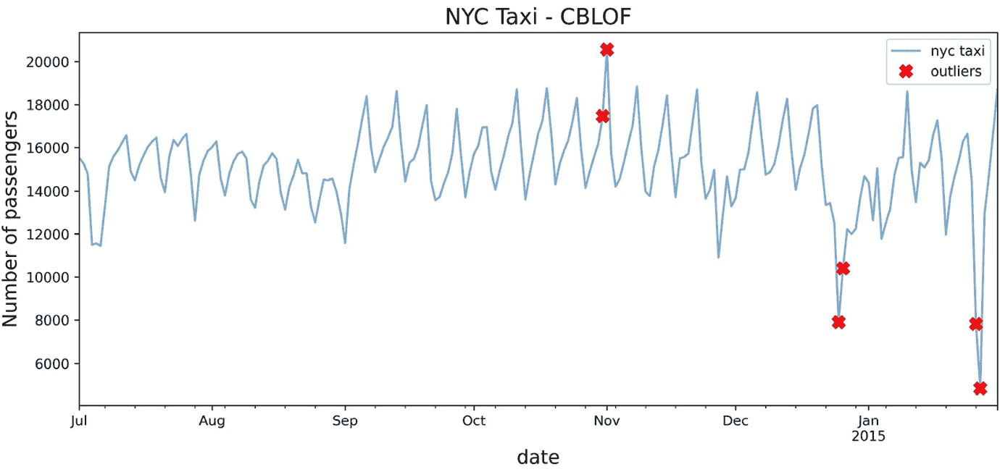

图 14.6：使用 CBLOF 算法识别的潜在异常值标记

将*图 14.6*与*图 14.5*（LOF）进行比较，注意它们之间的相似性。

### 另见

要了解更多关于 LOF 和 CBLOF 算法的信息，你可以访问 PyOD 文档：

+   LOF: [`pyod.readthedocs.io/en/latest/pyod.models.html#module-pyod.models.lof`](https://pyod.readthedocs.io/en/latest/pyod.models.html#module-pyod.models.lof)

+   CBLOF: [`pyod.readthedocs.io/en/latest/pyod.models.html#module-pyod.models.cblof`](https://pyod.readthedocs.io/en/latest/pyod.models.html#module-pyod.models.cblof)

## 使用 iForest 检测异常值

**iForest** 与另一个流行的算法**随机森林**有相似之处。随机森林是一种**基于树的监督学习**算法。在监督学习中，你有现有的标签（分类）或值（回归）来表示目标变量。这就是算法学习的方式（它是监督学习）。

*森林*这个名称来源于算法工作原理的底层机制。例如，在分类中，算法随机采样数据来构建多个弱分类器（较小的决策树），这些分类器共同做出预测。最终，你得到一个由较小树（模型）组成的森林。这种技术优于单个可能会过拟合数据的复杂分类器。集成学习是多个弱学习者协作产生最优解的概念。

iForest，作为一种**集成学习**方法，是随机森林的无监督学习方法。iForest 算法通过随机划分（拆分）数据集成多个分区来隔离异常值。这个过程是递归进行的，直到所有数据点都属于一个分区。隔离一个异常值所需的分区数量通常比隔离常规数据点所需的分区数量要少。这个思路是，异常数据点距离其他点较远，因此更容易被分离（隔离）。

相比之下，正常的数据点可能会更接近较大的数据集，因此需要更多的分区（拆分）来隔离该点。因此，称之为隔离森林，因为它通过隔离来识别异常值。一旦所有的点都被隔离，算法会生成一个异常值评分。你可以把这些分区看作是创建了一个决策树路径。到达某个点的路径越短，异常的可能性越大。

### 如何实现...

在本例中，你将继续使用`nyc_taxi`数据框，利用 PyOD 库中的`IForest`类来检测异常值：

1.  开始加载`IForest`类：

```py
from pyod.models.iforest import IForest
```

1.  有一些参数是你应该熟悉的，以控制算法的行为。第一个参数是`contamination`。默认值为`contamination=0.1`，但在本例中，你将使用`0.03`（3%）。

第二个参数是 `n_estimators`，默认为 `n_estimators=100`，即生成的随机树的数量。根据数据的复杂性，您可能希望将该值增大到更高的范围，如 `500` 或更高。从默认的小值开始，以了解基准模型的工作原理——最后，`random_state` 默认为 `None`。由于 iForest 算法会随机生成数据的划分，因此设置一个值有助于确保工作结果的可复现性。这样，当您重新运行代码时，能够获得一致的结果。当然，这个值可以是任何整数。

1.  实例化 `IForest` 并更新 `contamination` 和 `random_state` 参数。然后，将该类的新实例（`iforest`）拟合到重采样数据上，以训练模型：

```py
iforest = IForest(contamination=0.03,
                 n_estimators=100,
                 random_state=0)
iforest.fit(nyc_daily)
>>
IForest(behaviour='old', bootstrap=False, contamination=0.03,
    max_features=1.0, max_samples='auto', n_estimators=100, n_jobs=1,
    random_state=0, verbose=0)
```

1.  使用 `predict` 方法来识别异常值。该方法会为每个数据点输出 `1` 或 `0`。例如，值为 `1` 表示是一个异常值。

让我们将结果存储在一个 pandas Series 中：

```py
predicted = pd.Series(iforest.predict(tx),
                      index=tx.index)
print('Number of outliers = ', predicted.sum())
>>
Number of outliers =  7
```

有趣的是，与之前的算法 *使用 KNN 检测异常值* 不同，iForest 检测到了 `7` 个异常值，而 KNN 算法检测到了 `6` 个异常值。

```py
Filter the predicted Series to only show the outlier values:
outliers = predicted[predicted == 1]
outliers = tx.loc[outliers.index]
outliers
>>     
timestamp  value
2014-11-01  20553.500000
2014-11-08  18857.333333
2014-11-27  10899.666667
2014-12-25  7902.125000
2014-12-26  10397.958333
2015-01-26  7818.979167
2015-01-27  4834.541667
```

总体而言，iForest 捕获了已知的五个异常值中的四个。还有一些其他有趣的日期被识别出来，这些日期应触发调查，以确定这些数据点是否为异常值。例如，2014 年 11 月 8 日被算法检测为潜在异常值，而该日期并未被考虑在数据中。

1.  使用 *技术要求* 部分中创建的 `plot_outliers` 函数来可视化输出，以便更好地理解：

```py
plot_outliers(outliers, tx, 'IForest')
```

上述代码应生成类似于 *图 14.1* 中的图表，唯一不同的是 `x` 标记基于使用 iForest 算法识别的异常值：

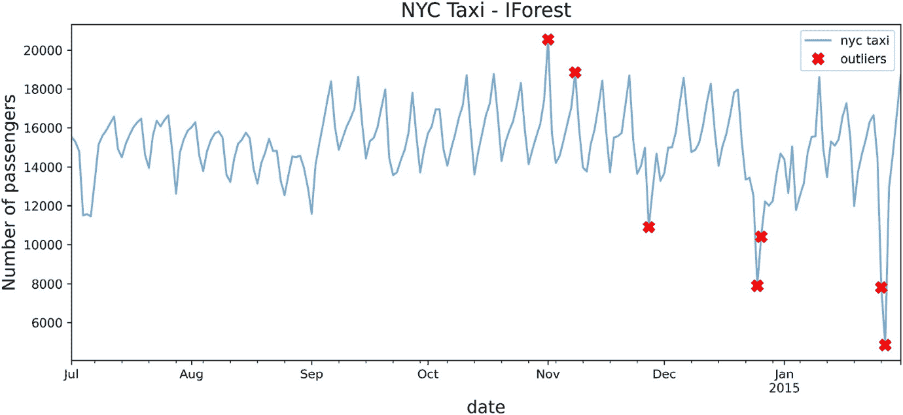

图 14.7：使用 iForest 算法标识潜在异常值的标记

要打印带有标记的标签（日期），只需再次调用 `plot_outliers` 函数，但这次将 `labels=True`：

```py
plot_outliers(outliers, tx, 'IForest', labels=True)
```

上述代码应生成类似于 *图 14.7* 的图表，并且增加了文本标签。

### 它是如何工作的...

由于 iForest 是一种集成方法，您将创建多个模型（决策树学习器）。`n_estimators` 的默认值是 `100`。增加基础估计器的数量可能会提高模型的性能，但在某个程度上可能会影响计算性能。因此，您可以将估计器数量视为训练好的模型。例如，对于 100 个估计器，您实际上是创建了 100 个决策树模型。

还有一个值得一提的参数是`bootstrap`参数。默认值为`False`，它是一个布尔值。由于 iForest 会随机抽样数据，你有两个选择：带替换的随机抽样（称为*自助抽样*）或不带替换的随机抽样。默认行为是没有替换的抽样。

### 还有更多...

PyOD 中的 iForest 算法（`IForest`类）是 scikit-learn 中`IsolationForest`类的封装。这对上一食谱中使用的 KNN 也是如此，*使用 KNN 检测异常值*。

让我们进一步探索，使用 scikit-learn 实现 iForest 算法。你将使用`fit_predict()`方法作为一步训练和预测，这个方法也可以在 PyOD 的各种算法实现中找到：

```py
from sklearn.ensemble import IsolationForest
sk_iforest = IsolationForest(contamination=0.03)
sk_prediction = pd.Series(sk_iforest.fit_predict(tx),
                      index=tx.index)
sk_outliers = sk_prediction[sk_prediction == -1]
sk_outliers = tx.loc[sk_outliers.index]
sk_outliers
>> 
timestamp   value
2014-11-01  20553.500000
2014-11-08  18857.333333
2014-11-27  10899.666667
2014-12-25  7902.125000
2014-12-26  10397.958333
2015-01-26  7818.979167
2015-01-27  4834.541667
```

结果是一样的。但请注意，与 PyOD 不同，识别出的异常值在标记时为`-1`，而在 PyOD 中，异常值被标记为`1`。

### 参见

PyOD 的 iForest 实现实际上是 scikit-learn 中`IsolationForest`类的封装：

+   要了解更多关于 PyOD iForest 和不同参数的信息，请访问他们的官方文档：[`pyod.readthedocs.io/en/latest/pyod.models.html?highlight=knn#module-pyod.models.iforest`](https://pyod.readthedocs.io/en/latest/pyod.models.html?highlight=knn#module-pyod.models.iforest)。

+   要了解更多关于 scikit-learn 中`IsolationForest`类的信息，你可以访问他们的官方文档页面：[`scikit-learn.org/stable/modules/generated/sklearn.ensemble.IsolationForest.html#sklearn-ensemble-isolationforest`](https://scikit-learn.org/stable/modules/generated/sklearn.ensemble.IsolationForest.html#sklearn-ensemble-isolationforest)。

## 使用单类支持向量机（OCSVM）检测异常值

**支持向量机（SVM）** 是一种流行的有监督机器学习算法，主要用于分类，但也可以用于回归。SVM 的流行源于使用核函数（有时称为**核技巧**），例如线性、多项式、**基于半径的函数**（**RBF**）和 sigmoid 函数。

除了分类和回归，SVM 还可以以无监督的方式用于异常值检测，类似于 KNN。KNN 通常被认为是一种有监督的机器学习技术，但在异常值检测中它是以无监督的方式使用的，正如在*使用 KNN 进行异常值检测*食谱中所见。

### 如何做...

在这个食谱中，你将继续使用在*技术要求*部分创建的`tx`数据框，利用 PyOD 中的`ocsvm`类检测异常值：

1.  首先加载`OCSVM`类：

```py
from pyod.models.ocsvm import OCSVM
```

1.  有一些参数你应该了解，以控制算法的行为。第一个参数是`contamination`。默认值为`contamination=0.1`，在这个食谱中，你将使用`0.03`（即 3%）。

第二个参数是 `kernel`，其值设为 `rbf`，你将保持其不变。

通过更新 `contamination=0.03` 来实例化 OCSVM，同时保持其余参数为默认值。然后，训练（拟合）模型：

```py
ocsvm = OCSVM(contamination=0.03, kernel='rbf')
ocsvm.fit(tx)
>>
OCSVM(cache_size=200, coef0=0.0, contamination=0.03, degree=3, gamma='auto',
   kernel='rbf', max_iter=-1, nu=0.5, shrinking=True, tol=0.001,
   verbose=False)
```

1.  `predict` 方法将为每个数据点输出 `1` 或 `0`。值为 `1` 表示异常值。将结果存储在一个 pandas Series 中：

```py
predicted = pd.Series(ocsvm.predict(tx),
                      index=tx.index)
print('Number of outliers = ', predicted.sum())
>>
Number of outliers =  5
```

1.  筛选预测的 Series，仅显示异常值：

```py
outliers = predicted[predicted == 1]
outliers = tx.loc[outliers.index]
outliers
>> 
timestamp  value
2014-08-09  15499.708333
2014-11-18  15499.437500
2014-11-27  10899.666667
2014-12-24  12502.000000
2015-01-05  12502.750000
```

有趣的是，它捕捉到了五个已知日期中的一个。

1.  使用*技术要求*部分中创建的 `plot_outliers` 函数可视化输出，以便获得更好的洞察：

```py
plot_outliers(outliers, tx, 'OCSVM')
```

上述代码应产生一个与*图 14.1*类似的图表，唯一不同的是 `x` 标记是基于 OCSVM 算法识别的异常值：

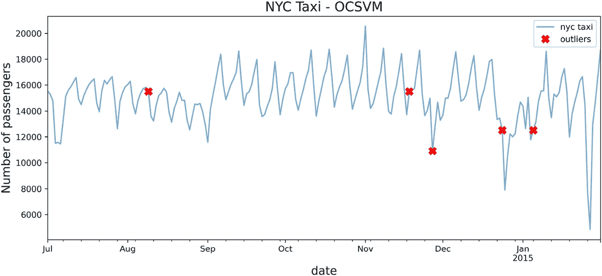

图 14.8：使用 OCSVM 标记每个异常点的折线图

当查看*图 14.8*中的图表时，不清楚为什么 OCSVM 识别出这些日期为异常值。RBF 核函数可以捕捉非线性关系，因此它应该是一个强健的核函数。

这个不准确的原因在于 SVM 对数据缩放敏感。为了获得更好的结果，您需要首先对数据进行标准化（缩放）。

1.  让我们解决这个问题，先对数据进行标准化，然后再次运行算法：

```py
from pyod.utils.utility import standardizer
scaled = standardizer(tx)
predicted = pd.Series(ocsvm.fit_predict(scaled),
                      index=tx.index)
outliers = predicted[predicted == 1]
outliers = tx.loc[outliers.index]
outliers
>>
timestamp  value
2014-07-06  11464.270833
2014-11-01  20553.500000
2014-11-27  10899.666667
2014-12-25  7902.125000
2014-12-26  10397.958333
2015-01-26  7818.979167
2015-01-27  4834.541667
```

有趣的是，现在模型识别出了五个已知异常日期中的四个。

1.  在新的结果集上使用 `plot_outliers` 函数：

```py
plot_outliers(outliers, tx, 'OCSVM Scaled'))
```

上述代码应生成一个更合理的图表，如下图所示：

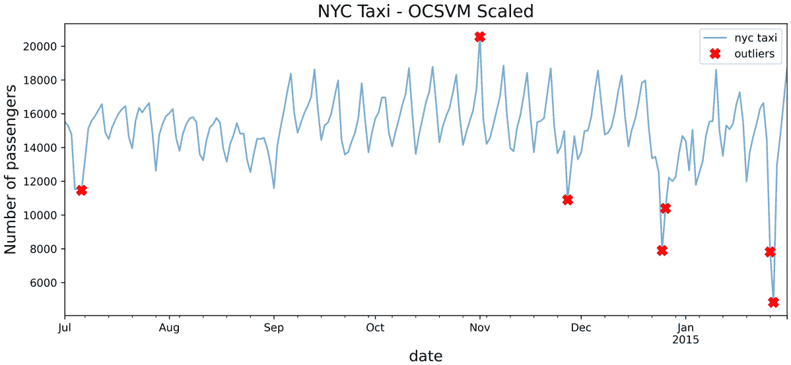

图 14.9：使用标准化函数缩放数据后的 OCSVM

比较*图 14.9*和*图 14.8*中的结果，看看缩放如何在 OCSVM 算法识别异常值方面产生了显著差异。

### 工作原理...

PyOD 对 OCSVM 的实现是对 scikit-learn 中 **OneClassSVM** 实现的封装。

与 SVM 相似，OneClassSVM 对异常值以及数据的缩放非常敏感。为了获得合理的结果，在训练模型之前标准化（缩放）数据非常重要。

### 还有更多...

让我们探讨不同核函数在相同数据集上的表现。在下面的代码中，您将测试四种核函数：`'linear'`、`'poly'`、`'rbf'` 和 `'sigmoid'`。

回顾一下，当使用 SVM 时，您需要缩放数据。您将使用之前创建的缩放数据集：

```py
for kernel in ['linear', 'poly', 'rbf', 'sigmoid']:
    ocsvm = OCSVM(contamination=0.03, kernel=kernel)
    predict = pd.Series(ocsvm.fit_predict(scaled),
                      index=tx.index, name=kernel)
    outliers = predict[predict == 1]
    outliers = tx.loc[outliers.index]
    plot_outliers(outliers, tx, kernel, labels=True)
```

上述代码应生成每个核函数的图表，以便您可以直观地检查并比较它们之间的差异：

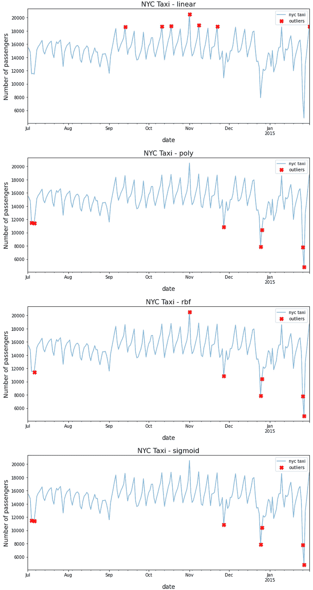

图 14.10：比较不同核函数与 OCSVM 的效果

有趣的是，每种核方法捕获的异常值略有不同。您可以重新运行之前的代码，通过传递 `labels=True` 参数来打印每个标记（日期）的标签。

### 参见

要了解有关 OCSVM 实现的更多信息，请访问官方文档：[`pyod.readthedocs.io/en/latest/pyod.models.html#module-pyod.models.ocsvm`](https://pyod.readthedocs.io/en/latest/pyod.models.html#module-pyod.models.ocsvm)。

## 使用 COPOD 检测异常值

COPOD 是一个令人兴奋的算法，基于 2020 年 9 月发布的一篇论文，你可以在这里阅读：[`arxiv.org/abs/2009.09463`](https://arxiv.org/abs/2009.09463)。

PyOD 库提供了许多基于最新研究论文的算法，这些算法可以分为线性模型、基于邻近的模型、概率模型、集成模型和神经网络。

COPOD 属于概率模型，并被标记为 *无参数* 算法。它唯一的参数是 *contamination* 因子，默认为 `0.1`。COPOD 算法受统计方法启发，使其成为一个快速且高度可解释的模型。该算法基于 copula，一种通常用于建模相互独立的随机变量之间的依赖关系的函数，这些变量不一定服从正态分布。在时间序列预测中，copula 已被应用于单变量和多变量预测，这在金融风险建模中非常流行。copula 这个术语源自 copula 函数，它将单变量的边际分布连接（耦合）在一起，形成一个统一的多变量分布函数。

### 如何操作...

在本食谱中，您将继续使用 `tx` DataFrame，通过 PyOD 库中的 `COPOD` 类来检测异常值：

1.  首先加载 `COPOD` 类：

```py
from pyod.models.copod import COPOD
```

1.  您需要考虑的唯一参数是 `contamination`。通常，将该参数（用于所有异常值检测实现）视为一个阈值，用于控制模型的敏感性并最小化假阳性。由于这是一个由您控制的参数，理想情况下，您希望运行多个模型，实验出适合您用例的理想阈值。

如需了解更多关于 `decision_scores_`、`threshold_` 或 `predict_proba` 的信息，请查看本章的第一个食谱，*使用 KNN 检测异常值*。

1.  实例化`COPOD`并将`contamination`更新为`0.03`。然后，在重新采样的数据上进行拟合，以训练模型：

```py
copod = COPOD(contamination=0.03)
copod.fit(tx)
>>
COPOD(contamination=0.03, n_jobs=1)
```

1.  使用 `predict` 方法识别异常值。该方法将为每个数据点输出 `1` 或 `0`。例如，`1` 表示异常值。

将结果存储在 pandas Series 中：

```py
predicted = pd.Series(copod.predict(tx),
                      index=tx.index)
print('Number of outliers = ', predicted.sum())
>>
Number of outliers =  7
```

异常值的数量与使用 iForest 获得的数量相匹配。

1.  仅筛选预测的 Series，以显示异常值：

```py
outliers = predicted[predicted == 1]
outliers = tx.loc[outliers.index]
outliers
>>           
timestamp  value
2014-07-04  11511.770833
2014-07-06  11464.270833
2014-11-27  10899.666667
2014-12-25  7902.125000
2014-12-26  10397.958333
2015-01-26  7818.979167
2015-01-27  4834.541667
```

与你迄今为止探索的其他算法相比，你会注意到使用 COPOD 捕获了一些有趣的异常点，这些异常点之前没有被识别出来。例如，COPOD 识别了 7 月 4 日——美国的国庆节（独立日）。那天恰好是周末（星期五是休息日）。COPOD 模型在 7 月 4 日和 7 月 6 日的整个周末期间捕获了异常。恰巧 7 月 6 日是由于纽约的一场棒球赛而成为一个有趣的日子。

1.  使用*技术要求*部分中创建的`plot_outliers`函数来可视化输出，以便获得更好的洞察：

```py
plot_outliers(outliers, tx, 'COPOD')
```

上述代码应该生成一个类似于*图 14.1*的图表，唯一的区别是`x`标记基于使用 COPOD 算法识别的异常点：

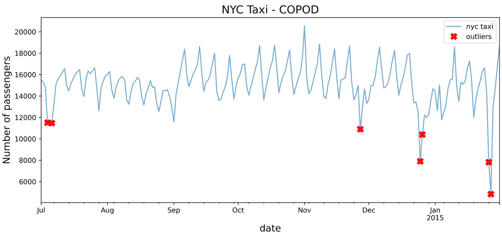

图 14.11：使用 COPOD 算法识别的潜在异常点的标记

要打印带有标记的标签（日期），只需再次调用`plot_outliers`函数，但这次需要将`labels=True`：

```py
plot_outliers(outliers, tx, 'COPOD', labels=True)
```

上述代码应该生成一个类似于*图 14.11*的图表，并加上文本标签。

### 它是如何工作的…

COPOD 是一个先进的算法，但它仍然基于概率建模和在数据中找到统计学上显著的极端值。使用 COPOD 的几项测试已经证明它在基准数据集上的卓越表现。使用 COPOD 的一个吸引力是它不需要调参（除了污染因子）。因此，作为用户，你无需担心超参数调优。

### 还有更多…

另一个简单且流行的概率算法是**中位绝对偏差**（**MAD**）。我们在*第八章*，*使用统计方法进行异常值检测*中探讨了 MAD，具体是在*使用修改过的 z-score 进行异常值检测*的食谱中，你是从零开始构建该算法的。

这是 PyOD 提供的一个类似实现，只有一个参数：阈值。如果你还记得*第八章*，*使用统计方法进行异常值检测*，阈值是基于标准差的。

以下代码展示了如何使用 PyOD 实现 MAD。你将使用`threshold=3`来复现你在*第八章*，*使用统计方法进行异常值检测*中的操作：

```py
from pyod.models.mad import MAD
mad = MAD(threshold=3)
predicted = pd.Series(mad.fit_predict(tx),
                      index=tx.index)
outliers = predicted[predicted == 1]
outliers = tx.loc[outliers.index]
outliers
>> 
timestamp  value
2014-11-01  20553.500000
2014-11-27  10899.666667
2014-12-25  7902.125000
2014-12-26  10397.958333
2015-01-26  7818.979167
2015-01-27  4834.541667
```

这应该与你在*第八章*，*使用统计方法进行异常值检测*中，修改过的 z-score 实现的结果一致。

### 另见

若要了解更多关于 COPOD 及其在 PyOD 中的实现，请访问官方文档：[`pyod.readthedocs.io/en/latest/pyod.models.html?highlight=copod#pyod.models.copod.COPOD`](https://pyod.readthedocs.io/en/latest/pyod.models.html?highlight=copod#pyod.models.copod.COPOD)。

如果你有兴趣阅读*COPOD: 基于 Copula 的异常值检测*（2020 年 9 月发布）的研究论文，请访问 arXiv.org 页面：[`arxiv.org/abs/2009.09463`](https://arxiv.org/abs/2009.09463)。

## 使用 PyCaret 检测异常值

在本食谱中，你将探索**PyCaret**用于异常检测。PyCaret ([`pycaret.org`](https://pycaret.org)) 被定位为“一个开源的、低代码的 Python 机器学习库，自动化机器学习工作流”。PyCaret 是 PyOD 的封装，你之前在食谱中使用过它进行异常检测。PyCaret 的作用是简化整个过程，用最少的代码进行快速原型设计和测试。

你将使用 PyCaret 来检查多种异常检测算法，类似于你在之前的食谱中使用过的算法，并查看 PyCaret 如何简化这个过程。

### 准备开始

探索 PyCaret 的推荐方式是为 PyCaret 创建一个新的虚拟 Python 环境，这样它可以安装所有所需的依赖项，而不会与当前环境发生任何冲突或问题。如果你需要快速回顾如何创建虚拟 Python 环境，请参考*开发环境设置*食谱，见*第一章*，*时间序列分析入门*。本章介绍了两种方法：使用`conda`和`venv`。

以下说明将展示使用`conda`的过程。你可以为环境命名任何你喜欢的名字；在以下示例中，我们将命名为`pycaret`：

```py
>> conda create -n pycaret python=3.8 -y
>> conda activate pycaret
>> pip install "pycaret[full]"
```

为了使新的`pycaret`环境在 Jupyter 中可见，你可以运行以下代码：

```py
python -m ipykernel install --user --name pycaret --display-name "PyCaret"
```

本食谱有一个单独的 Jupyter notebook，你可以从 GitHub 仓库下载：

[`github.com/PacktPublishing/Time-Series-Analysis-with-Python-Cookbook./blob/main/code/Ch14/Chapter%2014-pycaret.ipynb`](https://github.com/PacktPublishing/Time-Series-Analysis-with-Python-Cookbook./blob/main/code/Ch14/Chapter%2014-pycaret.ipynb)

### 如何操作...

在本食谱中，你将不会接触到任何新概念。重点是展示如何使用 PyCaret 作为实验的起点，并快速评估不同的模型。你将加载 PyCaret 并运行不同的异常检测算法：

1.  从`pycaret.anomaly`模块加载所有可用的函数：

```py
from pycaret.anomaly import *
setup = setup(tx, session_id = 1, normalize=True)
```

上述代码应该生成一个表格摘要，如图 14.12 所示

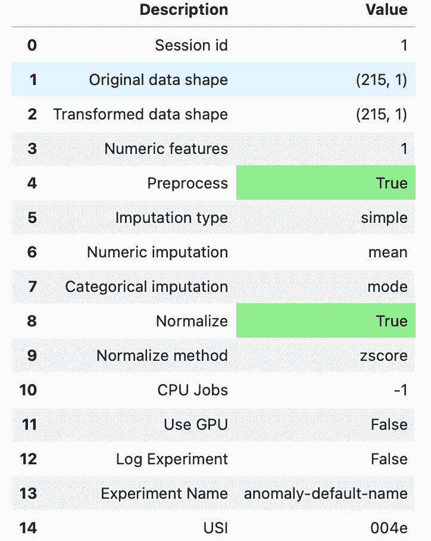

图 14.12 – PyCaret 摘要输出

1.  要打印可用的异常检测算法列表，可以运行`models()`：

```py
models()
```

这应该会显示一个 pandas DataFrame，如下所示：

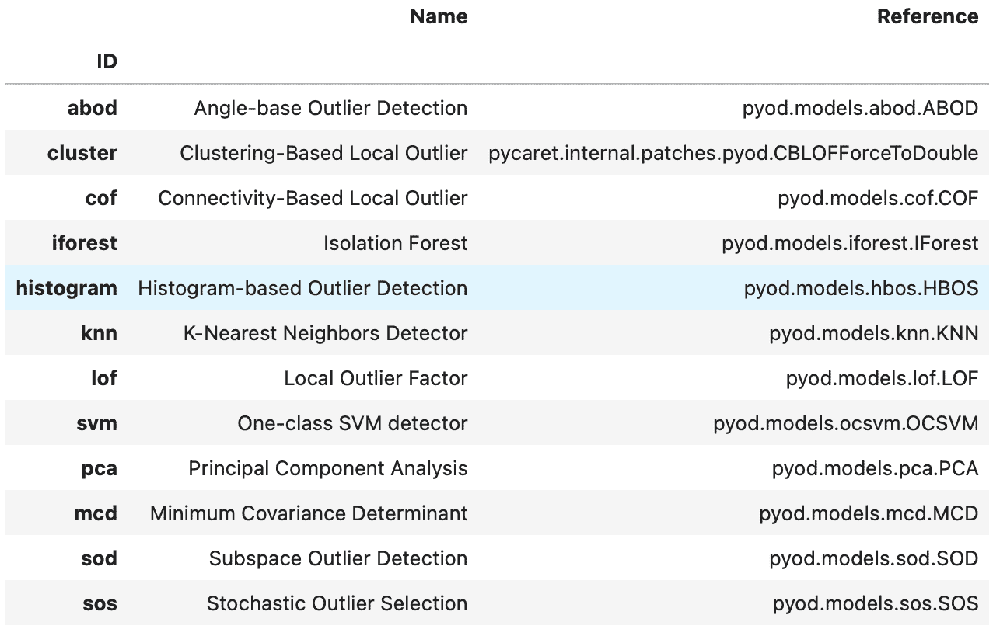

图 14.14: PyCaret 可用的异常检测算法

请注意，这些算法都来自 PyOD 库。如前所述，PyCaret 是 PyOD 和其他库（如 scikit-learn）的封装。

1.  让我们将前八个算法的名称存储在列表中，以便稍后使用：

```py
list_of_models = models().index.tolist()[0:8]
list_of_models
>>
['abod', 'cluster', 'cof', 'iforest', 'histogram', 'knn', 'lof', 'svm']
```

1.  遍历算法列表并将输出存储在字典中，以便稍后在分析中引用。要在 PyCaret 中创建模型，你只需使用`create_model()`函数。这类似于 scikit-learn 和 PyOD 中的`fit()`函数，用于训练模型。一旦模型创建完成，你可以使用该模型通过`predict_model()`函数预测（识别）离群值。PyCaret 将生成一个包含三列的 DataFrame：原始的`value`列，一个新的`Anomaly`列，存储结果为`0`或`1`，其中`1`表示离群值，另一个新的`Anomaly_Score`列，存储使用的得分（得分越高，表示越有可能是离群值）。

你只需要改变污染参数，以便与之前使用 PyOD 的配方匹配。在 PyCaret 中，污染参数被称为`fraction`，为了保持一致性，你需要将其设置为`0.03`或者 3%，即`fraction=0.03`：

```py
results = {}
for model in list_of_models:
    cols = ['value', 'Anomaly_Score']
    outlier_model = create_model(model, fraction=0.03)
    print(outlier_model)
    outliers = predict_model(outlier_model, data=tx)
    outliers = outliers[outliers['Anomaly'] == 1][cols]
    outliers.sort_values('Anomaly_Score', ascending=False, inplace=True)
    results[model] = {'data': outliers, 'model': outlier_model}
```

`results`字典包含每个模型的输出（一个 DataFrame）。

1.  要打印每个模型的离群值，你可以简单地遍历字典：

```py
for model in results:
    print(f'Model: {model}')
    print(results[model]['data'], '\n')
```

这将打印出每个模型的结果。以下是列表中的前两个模型作为示例：

```py
Model: abod
                   value  Anomaly_Score
timestamp                             
2014-11-01  20553.500000      -0.002301
2015-01-27   4834.541667      -0.007914
2014-12-26  10397.958333      -3.417724
2015-01-26   7818.979167    -116.341395
2014-12-25   7902.125000    -117.582752
2014-11-27  10899.666667    -122.169590
2014-10-31  17473.354167   -2239.318906
Model: cluster
                   value  Anomaly_Score
timestamp                             
2015-01-27   4834.541667       3.657992
2015-01-26   7818.979167       2.113955
2014-12-25   7902.125000       2.070939
2014-11-01  20553.500000       0.998279
2014-12-26  10397.958333       0.779688
2014-11-27  10899.666667       0.520122
2014-11-28  12850.854167       0.382981
```

### 它是如何工作的…

PyCaret 是一个出色的自动化机器学习库，最近他们在时间序列分析、预测和离群值（异常值）检测方面不断扩展其功能。PyCaret 是 PyOD 的封装库，你在本章之前的配方中也使用了 PyOD。*图 14.14*展示了 PyCaret 支持的 PyOD 算法数量，这是 PyOD 更广泛算法列表的一个子集：[`pyod.readthedocs.io/en/latest/index.html#implemented-algorithms`](https://pyod.readthedocs.io/en/latest/index.html#implemented-algorithms)。

### 另请参见

要了解更多关于 PyCaret 离群值检测的信息，请访问官方文档：[`pycaret.gitbook.io/docs/get-started/quickstart#anomaly-detection`](https://pycaret.gitbook.io/docs/get-started/quickstart#anomaly-detection)。
